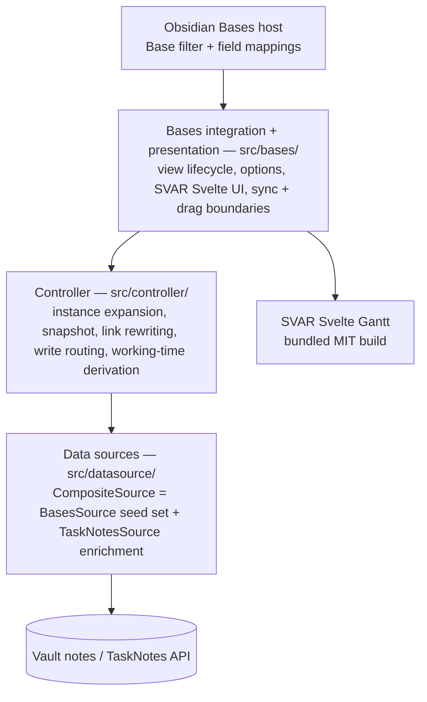

# Architecture

Durable architecture reference for TaskNotes Gantt. This records the structural
decisions and their rationale — including the alternatives that were weighed and
rejected — the layer the other governing docs deliberately don't carry:
[overview.md](overview.md) is the *where* (source topology),
[standards-alignment.md](standards-alignment.md) is the *what-must-hold* (the RFC
authority), day-to-day conventions live in
[docs/conventions/](../conventions/architecture.md), and vocabulary in the
repo-root [CONCEPTS.md](../../CONCEPTS.md) — terms defined there (echo, cascade,
fence, settled facts, entry signature, …) are used here without redefinition.
Update this document when the architecture itself changes.

## Shape

One Obsidian plugin, bundled to a single `main.js`, mounted as a Bases view. Three
layers under the host: a Bases integration/presentation layer, a controller that
owns derivation, and capability-typed data sources that own external truth.

Reads flow down that spine and render back up through the `GanttData` store and
the sync port; writes flow from gestures and cell edits back through the
controller to `CompositeSource`. The file-level map of both flows is in
[overview.md](overview.md).

## Structural decisions and why (the durable subset)

- **The Bases Base owns the matched seed set; TaskNotes enriches it.** The host's
  query — the Base's filter and field mappings — decides membership; TaskNotes adds
  dependency edges, editing, status/priority semantics, and a relationship graph
  whose "Show all" expansion stays anchored to the matched Base roots. Rejected:
  the plugin running its own vault queries, which would duplicate the host's query
  engine and break the user's expectation that a Bases filter governs what a Bases
  view shows. Composition point:
  [CompositeSource.ts](../../src/datasource/CompositeSource.ts). When TaskNotes is
  absent the same structure degrades to a read-only timeline rather than a
  different code path.
- **Data adapters extract raw values; views format for display.**
  [BasesDataAdapter.ts](../../src/bases/services/BasesDataAdapter.ts) yields native
  types; formatting is a view concern. This is the norm, with known lag: the
  adapter still display-formats group keys and some property values today — a
  tracked violation queued for the maintainability campaign (see
  `docs/backlog.md`), not a revision of the boundary. The boundary keeps every
  derivation step testable in jest without a DOM, keeps display conventions
  swappable per view, and preserves round-trips: a value formatted at extraction
  can never restore the raw entry it came from — a wikilink flattened to its
  display form is a destroyed link, not a styled one. Rule and rationale:
  [data-formatting.md](../conventions/data-formatting.md).
- **Controller–view–datasource layering, wired by dependency injection.**
  [GanttController.ts](../../src/controller/GanttController.ts) is the source of
  truth: it selects the active source, expands tasks into render instances,
  rewrites links, owns the snapshot, and routes writes. The Svelte view renders
  and intercepts gestures; datasources own external truth. Obsidian APIs are
  injected, so tests mock at DI seams instead of patching globals. The layering is
  normative even where the code lags it: the 2026-07-27 gap analysis names
  calendar derivation still living in `src/bases/` as a defect against this
  decision (workstream G4), not a revision of it.
- **SVAR is bundled at build time into the single-file plugin, and the MIT build's
  Pro gate is never patched.** Bundling is Obsidian's distribution model — no
  runtime dependency fetch, one artifact to install. The MIT `DataStore.init`
  unconditionally nulls the entire Pro surface (splitTasks, markers, calendars,
  summary, …); the 2026-08-10 audit confirmed there is no API being declined.
  Rejected: patching that store init — it would fork a vendored library, undercut
  the license split, and turn every SVAR upgrade into a merge. Pro-shaped
  capabilities (ghost runs, occupancy, the marker overlay, the calendar subsystem)
  are hand-rolled only as sanctioned exceptions.
- **Prefer SVAR's documented API always; the one standing exception class is
  capability, not preference.** Hand-rolling what SVAR ships is forbidden without
  sign-off — deviating cost us twice on theming alone. The standing exception:
  fullscreen was reversed back to a CSS overlay + reparent *with* maintainer
  sign-off, because SVAR's `<Fullscreen>` wraps the native browser top layer,
  which structurally escapes Obsidian's stacking context and hides its modals and
  menus — no styling can out-stack it. The test for any future exception is the
  same: the documented component must be *unable* to satisfy the requirement, not
  merely inconvenient. Precedent:
  [obsidian-plugin-fullscreen-maximize-not-native.md](../solutions/architecture-patterns/obsidian-plugin-fullscreen-maximize-not-native.md).
- **The drag pipeline has one derivation authority and speaks in optimistic
  echoes.** Gestures are planned by
  [dragCommitPlanner.ts](../../src/bases/dragCommitPlanner.ts) and written through
  the queued [dragExecutor.ts](../../src/bases/dragExecutor.ts); span and estimate
  math is unified behind the working-time stretch rather than re-derived per call
  site. An echo is display truth, never data — reverting one never undoes a write
  that landed. A cascade is displacement, not assignment, and runs only after the
  parent's write settles; a halted cascade leaves an origin stash so unpaid
  displacement survives to the next attempt. A fence's acquisition is
  deadline-bounded and each source is held independently, so one hung write cannot
  park the rest of the round. Settled facts overlay stale rows until a genuine
  vault re-read delivers — a read that merely reuses cached tasks proves nothing.
  This vocabulary ([CONCEPTS.md](../../CONCEPTS.md) → Drag commit) encodes the
  drag campaign's four P1 lessons. Rejected: patching the orchestration in place
  inside the view component — the review record showed in-place fixes
  manufacturing the next round's defects, while the extracted pure seams converged
  in one round.
- **Refresh discipline: an entry signature breaks the host's re-notify storm.**
  Every notify recomputes a fingerprint of the matched notes' paths plus the
  frontmatter values of the watched field mappings; an unchanged signature
  means task reuse, a moved one releases a full re-read. The watched set is
  load-bearing and currently incomplete: the task-name (`textProperty`) mapping
  is not watched, so a label-only edit reuses the cache — a tracked gap (see
  `docs/backlog.md`), not the contract. The signature is
  deliberately derived *without* touching the Base's value system, because reading
  through that system is itself what provokes the host into another notify — the
  loop-breaker must not feed the loop. The watched-field set is load-bearing: a
  field the signature does not watch is a field whose edits the chart will not
  see. Rejected: coalescing/debouncing alone, which treats an identity problem as
  a timing problem and merely slows the storm. Implementation:
  [entrySignature.ts](../../src/bases/entrySignature.ts), consumed by the #161
  guards in [register.ts](../../src/bases/register.ts).
- **Calendar availability stays bundled, but extractable.** The availability seam
  ([availability.ts](../../src/controller/availability.ts)) is decoupled and
  abstract so the evolution ladder stays cheap: bundle now → an API exposed from
  this plugin if demand appears → only then a companion plugin. Each rung is taken
  on demand, never speculatively — a second plugin is a second release train and a
  second support surface. Day granularity now (a day works if the pattern or any
  availability block covers it); hour granularity — sub-day rendering, hourly
  conflicts, RFC 9253 working-time lag — is deferred until the Gantt renders
  hourly ([backlog](../backlog.md)).
- **The iCalendar RFC family is the exclusive semantic authority at every calendar
  boundary.** The decision is structural, not stylistic: boundary shapes are
  standards-shaped so the plugin composes with the calendars and tools users
  already have, and so every future calendar feature has one authoritative model
  to map onto. Rejected: a proprietary date model — including letting a component
  library's own calendar shape become a boundary contract. The rule, the named
  RFCs, and their roles are owned by
  [standards-alignment.md](standards-alignment.md); the executable lossless proof
  is [calendar-rfc-mapping.md](calendar-rfc-mapping.md) with
  [rfcMapping.ts](../../src/controller/calendar/rfcMapping.ts) round-trip-tested.
- **Rebuild vs. refactor (2026-07-27): strategic refactor, decisively — with a
  named falsifier.** The god component predates the proposed discard boundary
  (3,415 of its lines existed before the campaign under scrutiny), so a rebuild
  would re-implement the healthy majority, re-discover ~30 review rounds of fixed
  defects, and still end standing on the same substrate. The debt is paid down by
  extract-and-test slices — the drag-commit planner being the one sanctioned
  small-component rewrite. The verdict's own falsifier is recorded so it stays
  testable: if, after the planner and derivation-authority work lands, cross-path
  drift defects recur at a similar rate, the locality diagnosis is wrong and a
  scoped-rewrite discussion becomes legitimate. Full analysis:
  [2026-07-27-002-rebuild-vs-refactor-gap-analysis.md](../reports/2026-07-27-002-rebuild-vs-refactor-gap-analysis.md).

## Degradation and write-safety posture (cross-cutting)

The plugin degrades by narrowing capability, never by erroring the view. TaskNotes
absent → the same view renders as a read-only timeline. Writes are gated on the
data source's `capabilities.write` flag
([types.ts](../../src/datasource/types.ts)); dynamically read-only sources may
keep rejecting methods as defensive backstops, but the flag is the truth. A field
without round-trip symmetry (written property ≠ read property) is read-only rather
than appearing to save. On the optimistic path, failure reverts the echo and only
the echo; a fence that cannot assemble in time abandons rather than waits. In the
calendar domain, failure granularity is deliberate: a parse-invalid `pattern`
(no `FREQ`) invalidates its calendar, while a malformed entry or unknown
timezone is dropped and the calendar stays valid. A pattern invalid only at
evaluation time is today inert rather than invalid — the fail-visible gap
already tracked as backlog P2b, not the contract. Dropped-entry diagnostics are recorded at parse
time and are *meant* to surface as flags; today only calendar-set diagnostics
are promoted while per-calendar definition diagnostics are recorded but not yet
surfaced — a tracked gap (see `docs/backlog.md`), not the contract.

## Provenance

Distilled from
[2026-07-27-002-rebuild-vs-refactor-gap-analysis.md](../reports/2026-07-27-002-rebuild-vs-refactor-gap-analysis.md)
(the refactor verdict, layering defects, and the natural experiment behind the
drag-pipeline decision),
[2026-08-10-svar-conformance-and-maintainability-audit.md](../reports/2026-08-10-svar-conformance-and-maintainability-audit.md)
(the Pro-gate finding and the reuse-over-imitation evidence), the
[docs/solutions/architecture-patterns/](../solutions/architecture-patterns/)
entries (worked precedents, notably the fullscreen reversal), and
[CONCEPTS.md](../../CONCEPTS.md) (the canonical vocabulary this document reuses).
