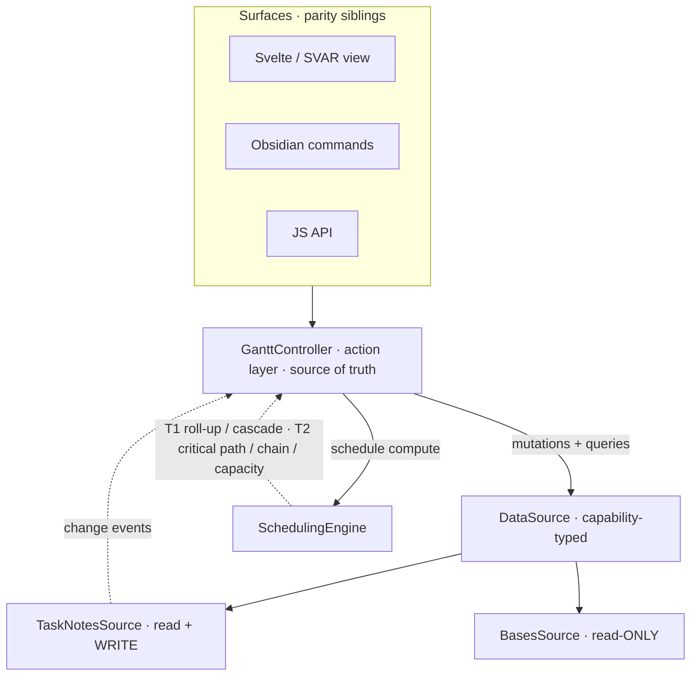

# Reposition Obsidian Gantt as a TaskNotes-first, agent-native companion

## Summary

Reposition the plugin from a standalone Bases-Gantt view into a **TaskNotes-first companion** that owns only the Gantt experience — rendering, interaction, and scheduling computation — while delegating all task data and CRUD to TaskNotes' APIs. TaskNotes (when present) becomes the first-class read **and write** source that unlocks real dependency arrows and persistent drag-to-reschedule; the existing generic Bases reader survives as a read-only mode for non-TaskNotes users. Every user action is reachable by an AI agent or companion app through a single action layer, and the plugin's own API surface is a **scheduling engine** that grows from date propagation toward critical path, critical chain, and capacity planning.

---

## Problem Frame

Development paused around January 2026 and the Obsidian ecosystem moved underneath it. TaskNotes — which the author co-develops — now ships a documented data-model spec, an HTTP API, a JS API, a CLI, an NLP API, webhooks, and a companion-plugin pattern. That removes the original reason this plugin had to own its own data layer.

Meanwhile, the plugin as it stands is a viewer wearing a Gantt's clothes. The data layer is a thin, isolated adapter that reads Obsidian Bases entries and maps properties to `SVARTask`s ([src/bases/services/BasesDataAdapter.ts](src/bases/services/BasesDataAdapter.ts), [src/bases/services/PropertyMappingService.ts](src/bases/services/PropertyMappingService.ts)). But the behaviors that make a Gantt worth choosing over a table do not actually work end-to-end:

- **Nothing persists.** Drag, resize, and the custom editor modal mutate SVAR's in-memory state only; no code writes a changed date back to a note ([src/bases/GanttContainer.svelte:396-418](src/bases/GanttContainer.svelte#L396-L418)).
- **Dependencies are fake.** The dependency `links` are a hardcoded dummy array, not derived from data ([src/bases/GanttContainer.svelte:630-653](src/bases/GanttContainer.svelte#L630-L653)).
- **There is no agent surface at all** — no commands, no JS API, no settings; the Gantt exists only inside a Bases view ([src/main.ts](src/main.ts)).

The repo also carries a large, product-orthogonal AssertThat/JIRA BDD-sync subsystem (`axios`, `simple-git`, `inquirer`, the `sync:*`/`assign:ids` scripts, [src/bdd/](src/bdd/), [src/errors/SyncErrors.ts](src/errors/SyncErrors.ts)) that has nothing to do with the Gantt and conflicts with the decision to move tracking to GitHub.

The cost of leaving this as-is: the plugin can never deliver the editing round-trip or the dependency-aware scheduling that justify its existence, and it duplicates data-handling responsibility that TaskNotes now does better.

---

## Key Decisions

- **TaskNotes-first, Bases-capable (not TaskNotes-only).** TaskNotes is the first-class source that lights up dependencies, write-back, and (later) NLP. The generic Bases reader is retained as a reduced, read-only mode so non-TaskNotes users still get a real chart. This preserves the original dual-audience goal at modest extra cost because the Bases adapter already exists.

- **Read-only without TaskNotes.** Editing (drag-to-reschedule, resize, progress, the editor modal) persists *only* when TaskNotes is present, through its API. Without TaskNotes the chart is a viewer — mutation is absent, not faked. This avoids reimplementing date validation/recurrence and the risk of corrupting notes, and makes "install TaskNotes to edit" the natural upgrade path. The read-only contract is expressed as a missing capability on the data source, not as conditionals sprinkled through the UI.

- **The plugin's own API is a scheduling engine, not a CRUD API.** CRUD is already agent-reachable through TaskNotes' existing HTTP/JS/CLI APIs; duplicating it (e.g., a second HTTP server inside this plugin) is rejected. The plugin exposes only what TaskNotes cannot do because it has no schedule model: date propagation, then critical path, critical chain (CCPM / Theory of Constraints), and capacity/resource scheduling.

- **Agent parity by construction.** A single action layer (referred to here as `GanttController`) is the source of truth for every operation. The Svelte/SVAR view, Obsidian commands, and a JS API all call it — so anything a user can do, an agent can do, because they invoke the same code path rather than parallel implementations.

- **Multi-parent via virtual duplication with a source/instance split.** A task can have multiple parents and appears once under each visible parent (matching the TaskNotes task list). Because SVAR's `parent` is single-valued, this is done by duplicating rows at the transform layer — one render instance per visible parent — over a single source task. The resulting hard split between *source identity* (one note, one set of dates) and *render instance* (one row under one parent) is load-bearing: it must be designed into the action layer's identity handling from the first persistence milestone, because a drag on one instance must resolve to the source note before writing and then reflect on all instances. This is no longer deferred.

- **Evolve in place; carve out what doesn't belong.** Keep the SVAR view and all hard-won usability work (it is view-layer and decoupled from the data question), insert the new layered seam beneath it, and remove the AssertThat/JIRA BDD-sync subsystem entirely. A full greenfield rebuild is rejected as risk without architectural payoff.

- **Keep BDD as the specification method; rewrite the specs; track in GitHub.** Executable Gherkin specs fit this product unusually well because they specify the shared action layer independent of which surface (human or agent) invokes it — one suite enforces parity. The current specs are entangled with the JIRA sync machinery and of suspect quality, so they are dropped and rewritten against the new contract, run locally (the existing WebdriverIO + Cucumber harness already works), with all tracking on GitHub Issues/Projects. No JIRA, no AssertThat.

---

## Architecture (orientation)

The four-layer shape the requirements below assume. SVAR ceases to be the source of truth; a mutation travels Surface → controller → data source (TaskNotes) → change event → refresh → re-render.

---

## Actors

- A1. **Project planner (human user).** Views, reschedules by dragging, sets progress and dependencies, organizes hierarchy. The primary audience; typically a TaskNotes power user doing project management.
- A2. **AI agent.** Drives the plugin headlessly to read the computed schedule and perform Gantt-specific operations (propagate/cascade dates, later critical path/capacity) via commands or the JS API.
- A3. **Companion app / external caller.** Consumes the scheduling engine's outputs through the agent-reachable surface (transported via TaskNotes' HTTP/CLI rather than a second server in this plugin).
- A4. **TaskNotes plugin.** System of record for task data and CRUD; provides read, write, the dependency model, and change events.
- A5. **Obsidian Bases.** Generic data source for the read-only, no-TaskNotes mode.

---

## Requirements

### Positioning & packaging

- R1. The plugin is presented and documented as a TaskNotes companion plugin, with TaskNotes as the recommended (not strictly required) dependency.
- R2. When TaskNotes is installed and ready, it is the active data source; when it is absent, the plugin falls back to the Bases source automatically without user configuration churn.
- R3. The plugin functions for non-TaskNotes users as a read-only Gantt over Bases data, with no broken or dead-end mutation affordances visible.

### Data sources & capabilities

- R4. Data access is mediated by a capability-typed data-source abstraction; a source declares whether it supports writes. The TaskNotes source supports read + write; the Bases source supports read only.
- R5. Surfaces (UI and API) derive available mutation actions from the active source's declared capabilities — read-only mode is the absence of write capabilities, expressed in one place, not per-surface conditionals.
- R6. CRUD operations (create, read, update, delete tasks) on the TaskNotes source delegate to TaskNotes' APIs rather than writing note frontmatter directly.
- R7. The plugin subscribes to TaskNotes change events and refreshes affected rows without a full reload where feasible.

### Action layer & agent parity

- R8. All operations (queries, mutations, schedule compute) are exposed through a single action layer that is the sole source of truth; no surface mutates chart state directly.
- R9. Every user-facing action available in the UI has a corresponding Obsidian command and a JS API method that invoke the same action-layer operation.
- R10. The agent-reachable surface is transported through TaskNotes' existing HTTP/CLI/JS facilities; the plugin does not stand up its own HTTP server to duplicate task CRUD.
- R11. In read-only mode, mutation operations are uniformly unavailable across every surface (UI disabled/absent, command/API report "unsupported"), with no surface able to bypass the capability gate.

### Scheduling engine

- R12. The plugin owns a scheduling engine exposing only schedule computations TaskNotes cannot perform; it is the plugin's distinctive API surface.
- R13. Tier 1 (first scheduling milestone, after CRUD + visualization): roll parent/summary dates up from children, and cascade child and dependent dates when a parent or predecessor moves. Scheduling computes over unique source tasks (the source graph), never over render instances (see Multi-parent display), with a cycle guard for dependency/hierarchy graphs that may contain cycles.
- R14. Tier 2 (later / nice-to-have): critical path, critical chain (CCPM / Theory of Constraints), and capacity/resource scheduling (e.g., next availability slot for a given effort and resource). Captured as direction, not committed scope for the first releases.
- R15. Schedule computations that result in date changes persist through the same write path as manual edits (TaskNotes), so an agent-driven cascade and a human drag converge on identical behavior.

### Dependencies & visualization

- R16. Dependency arrows are derived from TaskNotes' `blockedBy`/`blocking` model (including dependency relationship types and gaps) and rendered as SVAR links, replacing the current hardcoded dummy links. In the first write-enabled milestone these arrows are read-only (rendered, not editable from the Gantt); drawing/deleting links is deferred (see Scope Boundaries).
- R17. The first write-enabled milestone persists schedule edits only: drag-to-reschedule, resize (duration), and progress changes write back through the active write-capable source and survive reload. Dependency (link) creation/deletion is explicitly out of this milestone.
- R18. Parent/child hierarchy continues to render with indentation and expand/collapse, sourced from the configured parent relationship.

### Multi-parent display

- R24. A task with multiple parents renders once under each of its *visible* parents (those present in the current query result), via virtual duplication at the transform layer: a single source task expands into one render instance per visible parent. A task with no visible parent renders as a root; with exactly one, as a single row. SVAR's `parent` field is single-valued, so duplication — not a multi-valued parent — is the mechanism.
- R25. All render instances of a task share one source identity (the note path). Edits to any instance (reschedule, resize, progress, title, status) write to the single source task and reflect on every instance; a task cannot hold different dates under different parents. This is a direct consequence of single-source-of-truth, not a limitation to work around.
- R26. The action layer maintains an instance↔source identity map: mutations arriving with a render-instance ID (e.g., `path#parent-X`) resolve to the source note path before writing, and source-level change events fan out to refresh every instance of that task. This identity split is designed in from the first persistence milestone, not retrofitted.
- R27. How dependency arrows render across duplicated instances is a user-selectable view option (primary-instance-only vs. every-instance), persisted in the Bases view configuration. Default: primary-instance-only (each arrow drawn once on a designated primary instance; other instances show a subtle "has dependencies" indicator).

### Preserved usability

- R19. All existing view-layer usability work is preserved through the refactor: touch-device drag/drop handling, floating zoom controls and zoom levels, offline-friendly Lucide icons, grid resizer behavior, unscheduled-task styling, and the custom editor modal.
- R20. The refactor introduces the new layers beneath the view without regressing the above; SVAR mutation events are rerouted to call the action layer instead of mutating in-memory state.

### Codebase & contributor workflow

- R21. The AssertThat/JIRA BDD-sync subsystem and its product-orthogonal dependencies and scripts are removed from the plugin (archived out, not carried forward).
- R22. BDD is retained as the specification method: specs are rewritten fresh against the action-layer contract and run with a local runner; they do not depend on JIRA or AssertThat.
- R23. Issue tracking and project management move entirely to GitHub.

---

## Key Flows

- F1. Persistent reschedule (TaskNotes present)
  - **Trigger:** A1 drags a task bar to a new date, or A2 calls the reschedule operation.
  - **Actors:** A1 or A2, A4
  - **Steps:** Surface emits the intent → action layer `reschedule` → TaskNotes source writes via TaskNotes API → TaskNotes emits change event → action layer refreshes the affected row → SVAR re-renders.
  - **Outcome:** The note's date reflects the change and survives reload; human and agent paths are identical.
  - **Covered by:** R6, R7, R8, R15, R17

- F2. Read-only viewing (no TaskNotes)
  - **Trigger:** A1 opens the Gantt with only Bases available.
  - **Actors:** A1, A5
  - **Steps:** Bases source declares read-only → action layer exposes queries only → UI renders the chart with mutation affordances absent/disabled; commands and API mutations report unsupported.
  - **Outcome:** A usable, honest viewer with no broken edit affordances and a clear path to "install TaskNotes to edit."
  - **Covered by:** R3, R4, R5, R11

- F3. Agent-driven cascade (Tier 1)
  - **Trigger:** A2 moves a predecessor (or a parent) and requests dependent rescheduling.
  - **Actors:** A2, A4
  - **Steps:** Agent calls the cascade operation on the action layer → scheduling engine computes new dates from the dependency/hierarchy graph → resulting changes persist through the TaskNotes write path → views and any listeners refresh.
  - **Outcome:** Dependents shift consistently, identically to the engine being triggered from the UI.
  - **Covered by:** R8, R9, R12, R13, R15, R16

---

## Acceptance Examples

- AE1. Persistence on drag
  - **Covers R17.**
  - **Given** TaskNotes is active and task T has due date 2026-03-01,
  - **When** the user drags T's bar to 2026-03-05 and the vault is reloaded,
  - **Then** T's note shows due date 2026-03-05.

- AE2. Read-only honesty
  - **Covers R3, R5, R11.**
  - **Given** TaskNotes is not installed and only Bases data is available,
  - **When** the user attempts to drag a bar and an agent calls the reschedule API,
  - **Then** the bar does not move/persist and the API returns an explicit "unsupported in read-only mode" result — no silent no-op and no orphaned in-memory change.

- AE3. Real dependency arrows
  - **Covers R16.**
  - **Given** TaskNotes task B is `blockedBy` task A with a finish-to-start relationship,
  - **When** the Gantt renders,
  - **Then** a finish-to-start link is drawn from A to B (not a dummy link, and not absent).

- AE4. Cascade parity between human and agent
  - **Covers R13, R15.**
  - **Given** A finishes later such that dependent B must move,
  - **When** the move is performed by dragging A in the UI, and separately when it is performed by an agent calling the cascade operation,
  - **Then** B's resulting dates are identical in both cases and persist to its note.

- AE5. Roll-up from children
  - **Covers R13.**
  - **Given** a summary task S with children spanning 2026-04-02 to 2026-04-20,
  - **When** roll-up runs,
  - **Then** S's start/end reflect 2026-04-02 / 2026-04-20.

- AE6. Multi-parent rendering under visible parents
  - **Covers R24.**
  - **Given** task T lists parents A, B, and C, but only A and B are present in the current query result,
  - **When** the Gantt renders,
  - **Then** T appears as two rows — one under A and one under B — and not under C.

- AE7. Shared identity across instances
  - **Covers R25, R26.**
  - **Given** task T appears under both A and B and TaskNotes is active,
  - **When** the user drags the instance under A to a new date,
  - **Then** T's note is rescheduled once and the instance under B shows the same new date after refresh (no divergent dates, no double-write).

---

## Scope Boundaries

### Deferred for later

- Creating/deleting dependencies from the Gantt (drawing or removing links). Dependency arrows are read-only initially (R16); link editing follows once the date/progress write path is solid.
- Tier 2 scheduling: critical path, critical chain (CCPM / Theory of Constraints), capacity and resource scheduling. Direction is set (R14) but not committed for the first releases.
- NLP-driven task entry from within the Gantt (TaskNotes has an NLP API; consuming it is a later enrichment).
- Webhook/calendar integrations as inbound triggers for schedule recompute.

### Outside this product's identity

- Owning task data, persistence, search, or arbitrary model manipulation — that is TaskNotes' job; this plugin delegates it.
- A standalone task CRUD API or an embedded HTTP server duplicating TaskNotes' transport.
- Direct-frontmatter editing as a no-TaskNotes write fallback (explicitly rejected to avoid owning date/recurrence validation and note-corruption risk).
- Remaining a general Bases visualization tool co-equal with TaskNotes; Bases is the fallback, not the headline.

---

## Dependencies / Assumptions

- TaskNotes' JS API covers the operations this plugin needs — confirmed against the docs on 2026-06-16 (see "TaskNotes API surface" below). The author co-develops TaskNotes, so any remaining gaps can be shaped upstream.
- **Progress field mismatch (load-bearing).** TaskNotes' model is status/completion + recurrence + time-tracking; there is no obvious native numeric 0–100 progress field. The current `progressProperty` mapping therefore needs a deliberate home — map to status/completion, to time-tracked vs. estimated effort, or to a user-defined field. To be decided in planning; affects R17.
- **Agent/companion-app transport reach.** TaskNotes' HTTP server (loopback, desktop-only, default port 8080, optional bearer token) is TaskNotes' own surface and will not expose this plugin's scheduling engine. Cross-process callers (A3) reach the engine only via the in-Obsidian JS API + commands, unless TaskNotes proxies or a thin bridge is added later. The in-process surface (R9) is the reliable one; treat external HTTP reach to the engine as out of early scope.
- Assumes Obsidian Bases remains the read-only fallback source and its view/entry API stays available (the plugin already targets the official Bases API, 1.10.0+).
- SVAR's link types map to TaskNotes' four dependency relationship types (`FINISHTOSTART`, `FINISHTOFINISH`, `STARTTOSTART`, `STARTTOFINISH`, with `gap`); exact visual fidelity still to be verified, but the model alignment is confirmed.
- Assumes the existing WebdriverIO + Cucumber E2E harness is the BDD runner going forward (verified working on the author's machine).
- Multi-parent duplication multiplies row count (a task under N parents = N rows). SVAR virtual-scrolls at 100+ rows, so this is acceptable, but a transform-layer guard against pathological fan-out (and the existing cycle-detection `visited`-set pattern) is assumed. `BasesDataAdapter.extractParents()` already returns a parent array, so the data side is partly in place; the missing piece is the source→instance expansion and the instance↔source index.

## Outstanding Questions

### Resolve before planning

- None. (The TaskNotes API surface was confirmed on 2026-06-16; see below.)

### Deferred to planning

- How `progress` persists given TaskNotes has no native numeric progress field (map to status/completion, effort ratio, or a user field).

- Controller granularity: thin pass-through (own only the schedule graph the engine needs) vs. a richer internal task-graph domain model. Lean thin-first; finalize in `/ce-plan`.
- Whether companion-app access ships in the first releases or waits until the scheduling engine has Tier-1 substance worth calling.
- Disposition of the carved-out AssertThat/BDD code: delete vs. archive to a separate repo/tag.

---

## TaskNotes API surface (confirmed 2026-06-16)

The JS API is the in-process surface this plugin builds on; the HTTP API is TaskNotes' own external surface (relevant to A3, not something this plugin re-implements).

- **Access & capability gate:** `app.plugins.getPlugin("tasknotes")?.api`; check `api.apiVersion` and `api.hasCapability("tasks.write")`; coordinate startup with `await api.lifecycle.ready()`. The capability check (R4/R5) can delegate directly to `hasCapability` rather than the plugin inventing its own.
- **Read:** `api.tasks.get(path)`, `api.tasks.list(query?)`, `api.query.tasks(query?)`; canonical field IDs (`task.due`, `task.scheduled`, `task.status`, …) with rich operators; `api.catalog.fields()` for field metadata.
- **Write (dates/progress/status — R17):** `api.tasks.update(path, patch, context?)`, `api.tasks.setScheduled` / `clearScheduled`, `api.tasks.setDue` / `clearDue`, `api.tasks.setStatus`, `api.tasks.complete` / `uncomplete`, plus `create` / `delete` / `move`.
- **Dependencies (R16):** read via `api.relationships.dependencies(path)` / `blocking(path)` / `all(path)`; mutate via `api.tasks.addDependency` / `removeDependency`; reltypes from `api.catalog.dependencyRelTypes()`. `blockedBy` = `[{uid, reltype, gap}]`; `blocking` is read-only reverse. Note: dependency *editing* is fully API-supported, so deferring it (Scope Boundaries) is purely a scope choice, not a platform limit.
- **Events (R7, F1):** `api.events.on(name, handler)` → EventRef (`api.events.off(ref)` / `this.registerEvent(ref)`); events include `task.updated`, `task.scheduled.changed`, `task.due.changed`, `task.dependencies.changed`, `task.status.changed`. Payloads carry `changes` and `context`.
- **Echo-loop control (F1 correctness):** all mutators accept a `context` ({source, correlationId, reason}) that attaches to the emitted event — tag self-generated writes and skip re-processing their events.

## Sources / Research

- Current data layer and view (the refactor surface): [src/bases/services/BasesDataAdapter.ts](src/bases/services/BasesDataAdapter.ts), [src/bases/services/PropertyMappingService.ts](src/bases/services/PropertyMappingService.ts), [src/bases/GanttContainer.svelte](src/bases/GanttContainer.svelte), [src/bases/register.ts](src/bases/register.ts), [src/main.ts](src/main.ts).
- Prior runtime-interop sketch (read for ideas, predates this repositioning): `project/archived/TaskNotes Integration Architecture.md` (removed in repo housekeeping; recoverable from git history).
- TaskNotes dependency model and hierarchy findings: `docs/tasknotes-learnings.md` (removed in repo housekeeping; recoverable from git history).
- TaskNotes external docs to confirm the API contract during planning: spec (`tasknotes.dev/spec/`), JS API (`tasknotes.dev/javascript-api/`), HTTP API (`tasknotes.dev/HTTP_API/`), CLI (`tasknotes.dev/obsidian-cli/`), NLP API (`tasknotes.dev/nlp-api/`), webhooks (`tasknotes.dev/webhooks/`), companion plugins (`tasknotes.dev/companion-plugins/`).
- Code to remove (product-orthogonal): [src/bdd/](src/bdd/), [src/errors/SyncErrors.ts](src/errors/SyncErrors.ts), the `sync:*` and `assign:ids` scripts in [package.json](package.json), and the AssertThat docs under [docs/](docs/).
</content>
</invoke>
