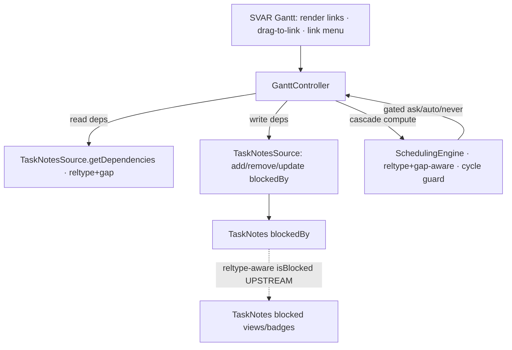

# Dependency types + gap, link editing, and scheduling-aware cascade (RFC 9253 ↔ TaskNotes)

## Summary

Turn the Gantt's dependency arrows from read-only FS lines into a full, **RFC 9253**-aligned dependency capability: render all four relationship types (`FINISHTOSTART`, `FINISHTOFINISH`, `STARTTOSTART`, `STARTTOFINISH`) plus `gap`; let the user **create, edit, and delete** dependencies directly on the chart; and make the plugin's (currently empty) `SchedulingEngine` propagate dates across dependencies respecting each reltype + gap, gated by the existing `ask`/`auto`/`never` cascade control.

The pivotal discovery driving this brainstorm: there is **no type mismatch** between the Gantt and TaskNotes. TaskNotes' data model and HTTP API already carry all four reltypes + gap; the Gantt's read path already maps them 1:1. The real constraint is that **TaskNotes' behavior is reltype-blind** — every `blockedBy` edge is treated as a hard Finish-to-Start block across all of TaskNotes' UI — and TaskNotes' own UI only ever authors `FINISHTOSTART`. So the work is staged: ship everything that is coherent under FS-only semantics now, make TaskNotes reltype-aware upstream, then unlock non-FS authoring.

This realizes the founding doc's R16 (real dependency arrows), R17 (deferred link create/delete), and R13 Tier-1 (dependency cascade) — see `origin`.

---

## Problem Frame

The founding repositioning (2026-06-16) deferred two things behind the date/progress write path: **link create/delete from the Gantt** (R16/R17) and the **dependency cascade** (R13, Tier 1). Both are now unblocked — the write path shipped (PR #71), native edit/delete shipped (#72), and parent-date cascade with a gated confirm modal shipped (#75). What remains:

- **Dependency arrows are read-only and type-flat in practice.** The read path maps all four reltypes ([`GanttController.ts:263-268`](src/controller/GanttController.ts#L263-L268)) and carries `gap` ([`TaskNotesSource.ts:108-118`](src/datasource/TaskNotesSource.ts#L108-L118)), but in real vaults every edge is `FINISHTOSTART` (TaskNotes' UI authors nothing else), and `gap` is not surfaced. The chart cannot express FF/SS/SF or lag/lead.
- **No dependency-driven scheduling exists.** [`src/scheduling/index.ts`](src/scheduling/index.ts) is an empty placeholder ("Populated by U10"). `cascadeGate.ts` handles only parent/child subtree moves, not predecessor→successor propagation.
- **The Gantt is the natural — and missing — editor for non-FS dependencies.** SVAR expresses link direction through which bar handle you drag from/to, so a drag gesture can author any of the four types. Nowhere in the TaskNotes ecosystem can a user *visually* set FF/SS/SF + gap. This is the distinctive value.

### The reltype-blindness constraint (load-bearing)

`blockedBy` is a single storage field; `reltype` is an attribute *inside* each entry (`{uid, reltype, gap?}`) — not a parallel mechanism. But TaskNotes **acts only on the edge's existence, never its reltype**:

- [`DependencyCache.isBlocked`](../../../tasknotes/src/utils/DependencyCache.ts) returns "blocked" when a task has any `blockedBy` edge to a not-completed predecessor — reltype is never consulted.
- Blocked badges, blocked/unblocked views, `dependencies.isBlocked`/`isBlocking` filter properties, auto-unblock-on-complete, and `taskUpdatePlanning` all treat every edge as Finish-to-Start.
- `reltype` round-trips through frontmatter/HTTP/serialization but is **behaviorally inert** in TaskNotes today.

Consequence: if the Gantt writes a non-FS reltype into `blockedBy`, TaskNotes will still mark the dependent as plainly "blocked" everywhere — semantically wrong for SS/SF, and confusing in the half of the workflow that lives in TaskNotes. The conflict is in **TaskNotes' display/blocked-logic, not in scheduling math** — the Gantt's own engine can be reltype-aware regardless.

---

## Key Decisions

- **Read all four + gap; author FS now; author non-FS after an upstream TaskNotes change.** Rendering all four + gap is coherent immediately (TaskNotes ignores reltype, so reading it is lossless). FS authoring is coherent immediately (matches what TaskNotes itself produces). Non-FS authoring waits until TaskNotes' blocked-logic honors reltype, so both UIs stay truthful.

- **`blockedBy` is the single dependency channel — no plugin-owned store.** Upholds the founding identity boundary (TaskNotes is system-of-record; the plugin delegates data). The Gantt writes dependencies via TaskNotes' `blockedBy` field, never a parallel structure.

- **Make TaskNotes reltype-aware upstream (the real harmonization).** Because the author co-develops TaskNotes, the clean fix is to teach TaskNotes' `isBlocked` (and blocked views/filters) to honor reltype — only `FINISHTOSTART` (and `FINISHTOFINISH` near predecessor completion) contribute to "blocked"; `STARTTOSTART`/`STARTTOFINISH` do not gate the blocked state. This removes the overload at its source rather than papering over it in the Gantt.

- **The Gantt's `SchedulingEngine` is reltype-aware independent of TaskNotes.** Cascade math computes over the reltype + gap it reads, so correct FF/SS/SF scheduling does not wait on the upstream change. Only *authoring* non-FS does.

- **Cascade is gated, reusing `ask`/`auto`/`never`.** The dependency cascade reuses the existing per-view cascade mode and confirm modal ([`cascadeGate.ts:25`](src/bases/cascadeGate.ts#L25)) rather than introducing a second control. `never` ≈ advisory (highlight only), `auto` ≈ enforce, `ask` ≈ confirm-then-write.

- **Editing is capability-gated.** Link create/edit/delete is available only when the active source is write-capable (TaskNotes present). In read-only/Bases mode, arrows are not editable (and Bases has no dependency model, so none render).

---

## Architecture (orientation)

This feature populates the `SchedulingEngine` node from the founding architecture and adds a write path for dependencies through the existing controller → source seam. Cross-repo: one work item lands in the **tasknotes** repo (reltype-aware blocking), the rest in **obsidian-gantt**.

---

## Actors

- A1. **Project planner (human).** Draws/edits/deletes dependency links on the chart, sees the four types + lag/lead, reschedules with cascade.
- A2. **AI agent.** Creates/edits dependencies and triggers cascade via the action layer (commands/JS API), identically to the UI.
- A4. **TaskNotes plugin.** System-of-record for `blockedBy`; target of the upstream reltype-awareness change.

---

## Requirements

IDs are scoped to this feature; origin references trace to the 2026-06-16 doc.

### Read fidelity (extends origin R16)

- R1. The chart renders each of the four reltypes with the correct SVAR anchor geometry (`FINISHTOSTART`→`e2s`, `STARTTOSTART`→`s2s`, `FINISHTOFINISH`→`e2e`, `STARTTOFINISH`→`s2e`) and a visual treatment that distinguishes them.
- R2. `gap` (ISO-8601 duration, e.g. `P1D`) is read into the render model and surfaced to the user (e.g. on a link tooltip/label), including sign/direction (lag vs lead) where applicable.
- R3. Reltype + gap are visible without leaving the Gantt (no need to open the note) so the user can read the dependency's true meaning.

### Link authoring — FS (realizes deferred origin R17)

- R4. Dependency writes are exposed as a capability on the active source and gated in one place; editing affordances are absent/disabled when the source is read-only.
- R5. The user can delete a dependency from the Gantt (e.g. link context menu); the write removes the edge from the dependent's `blockedBy` via TaskNotes, resolving render-instance → source note first (origin R26).
- R6. The user can create a Finish-to-Start dependency by dragging between two bars; the write appends `{uid, reltype: FINISHTOSTART}` to the dependent's `blockedBy`. Self-writes are echo-suppressed and the affected rows refresh (origin R7).
- R7. Creating/deleting a link on any render instance of a multi-parent task writes once to the source note and reflects on every instance (origin R25/R26).

### Link authoring — non-FS (depends on R12, the upstream change)

- R8. Once TaskNotes is reltype-aware, the user can create `FINISHTOFINISH`/`STARTTOSTART`/`STARTTOFINISH` dependencies via SVAR's start/end handle semantics (which handle the drag starts/ends on determines the type).
- R9. The user can edit an existing link's reltype and gap from the Gantt.

### Scheduling-aware cascade (realizes origin R13, Tier 1)

- R10. The `SchedulingEngine` computes, for a moved task, the resulting reschedules of its dependents over the **source graph** (never render instances), honoring each edge's reltype + gap, with a cycle guard.
- R11. Cascade is gated by the per-view `ask`/`auto`/`never` mode and persists resulting date changes through the same write path as manual edits; `never` produces an advisory violation indicator instead of a write. A predecessor that is already completed does not block/gate its dependents (consistent with TaskNotes issue-1878).

### Upstream (tasknotes repo)

- R12. TaskNotes' blocked-state computation (`isBlocked`, blocked/unblocked views, `dependencies.isBlocked`/`isBlocking` filters, auto-unblock-on-complete) honors `reltype`: `FINISHTOSTART` always contributes to "blocked"; `FINISHTOFINISH` contributes until the predecessor completes; `STARTTOSTART`/`STARTTOFINISH` do not gate the blocked state. Behavior is unchanged for existing FS-only vaults.

---

## Key Flows

- F1. **Read a non-FS dependency.** A1 opens the Gantt on a vault where an HTTP-API-created `STARTTOSTART` edge exists → the chart draws an `s2s` link with its gap surfaced. (R1, R2, R3)
- F2. **Create an FS link.** A1 drags from task A's end handle to task B's start → B's `blockedBy` gains `{[[A]], FINISHTOSTART}`; the arrow appears; TaskNotes shows B as blocked. (R4, R6, R7)
- F3. **Gated cascade.** A1 moves predecessor A later; with mode `ask`, the confirm modal lists the dependents that must shift (respecting reltype + gap) → on confirm, dependents reschedule and persist; with `never`, the violated links show an indicator and nothing is written. (R10, R11)
- F4. **Author a non-FS link (post-R12).** A1 drags from A's start handle to B's start handle → B's `blockedBy` gains `{[[A]], STARTTOSTART}`; TaskNotes (now reltype-aware) does *not* mark B as blocked. (R8, R12)

---

## Acceptance Examples

- AE1. **Four types render distinctly.** Given edges of all four reltypes exist, when the Gantt renders, then each draws with its correct SVAR anchor and is visually distinguishable. (R1)
- AE2. **Gap is visible.** Given a `FINISHTOSTART` edge with `gap: "P2D"`, when the user inspects the link, then the 2-day lag is shown without opening the note. (R2, R3)
- AE3. **FS create round-trips.** Given TaskNotes is active, when A1 drags A→B to create an FS link and reloads, then B's note shows `blockedBy: [{uid: [[A]], reltype: FINISHTOSTART}]` and the arrow persists. (R6)
- AE4. **Delete on one instance clears the source.** Given B appears under two parents, when A1 deletes the A→B link on one instance, then B's note loses the edge and neither instance shows the arrow after refresh. (R5, R7)
- AE5. **Cascade respects reltype + gap.** Given B is `FINISHTOSTART` blocked by A with `gap: P1D`, when A's end moves to 2026-04-10 (mode `auto`), then B's start becomes 2026-04-11 and persists. (R10, R11)
- AE6. **Completed predecessor doesn't gate.** Given A is completed and blocks B (FS), when cascade runs, then B is not held back by A. (R11)
- AE7. **Upstream: non-FS doesn't falsely block.** Given B is `STARTTOSTART` blocked by an incomplete A, when TaskNotes computes blocked-state (post-R12), then B is not marked blocked. (R12)

---

## Proposed increments (milestone slicing)

Each milestone is independently shippable and demoable. M1, M2, M4 are coherent under current FS-only semantics and can ship without the upstream change; **M3 depends on UT (the upstream change)**.

- **UT — TaskNotes reltype-aware blocking** *(tasknotes repo; gates M3)* — R12.
- **M1 — Read fidelity** — R1, R2, R3. Closes origin R16 properly. Lowest risk.
- **M2 — FS link authoring** — R4, R5, R6, R7. First write capability; flips origin R17.
- **M3 — Non-FS authoring** *(depends on UT)* — R8, R9. The distinctive value.
- **M4 — Scheduling-aware cascade** — R10, R11. Fills the empty `SchedulingEngine`; reltype-aware independent of UT.

Sequencing: M1 → M2 → {M4, M3}. M4 needs M2's write path; M3 needs M2 + UT. UT can proceed in parallel with M1/M2.

---

## Scope Boundaries

### Deferred for later

- Tier-2 scheduling (critical path, critical chain, capacity) — origin R14 direction only.
- Bulk dependency operations / link auto-routing aesthetics beyond SVAR defaults.
- NLP-driven dependency entry.

### Outside this product's identity

- A plugin-owned dependency store parallel to `blockedBy` (rejected — TaskNotes is system-of-record and already has the field + reltype).
- Direct-frontmatter dependency writes as a no-TaskNotes fallback (writes go through TaskNotes; Bases mode has no dependency model and renders no editable links).
- Re-implementing TaskNotes' blocked-state logic inside the Gantt to compensate for reltype-blindness (fixed upstream via UT instead).

---

## Dependencies / Assumptions

- **Cross-repo.** R12 (UT) lands in `C:\Users\renat\@repos-active\tasknotes`; M3 must not ship before it. The author co-develops TaskNotes, so this is feasible in-house.
- **TaskNotes write surface for dependencies.** Writes go through TaskNotes' `blockedBy` (update the dependent's field; `blocking` is read-only reverse). The plugin's `TaskNotesApi` slice currently declares only `relationships.dependencies` (read) + `tasks.update`/`delete`; the dependency-write methods needed (e.g. `tasks.update` with a `blockedBy` patch, or `addDependency`/`removeDependency` if exposed) are to be confirmed against the live API in planning.
- **SVAR link authoring.** That SVAR supports user-drawn/deletable links and maps the start/end handle of the drag to link type is assumed from the four native link types; exact API + events to be verified in planning.
- **Non-FS edges may pre-exist.** Vaults edited via the HTTP API or by hand may already contain non-FS reltypes; M1 must render them correctly even before UT/M3.
- Multi-parent instance→source identity (origin R26) and arrow render mode primary/all (origin R27) already exist and are reused, not rebuilt.

## Outstanding Questions

### Resolve before planning

- None blocking. (Harmonization stance, cascade model, and slicing are decided above.)

### Deferred to planning

- Exact TaskNotes dependency-write call (`tasks.update` blockedBy patch vs a dedicated `addDependency`/`removeDependency`), confirmed against the installed API version.
- SVAR's link-create/-delete event + handle-to-reltype mapping specifics, and whether gap is editable inline or via a small editor.
- Visual language for distinguishing the four reltypes and showing gap (color, dash, badge) — a design decision for M1.
- Whether M4's advisory mode (`never`) indicator is per-link or per-bar.

## Sources / Research

- Founding repositioning + API surface: [docs/brainstorms/2026-06-16-tasknotes-companion-gantt-requirements.md](docs/brainstorms/2026-06-16-tasknotes-companion-gantt-requirements.md).
- Gantt read path: [src/datasource/TaskNotesSource.ts](src/datasource/TaskNotesSource.ts), [src/controller/GanttController.ts](src/controller/GanttController.ts), [src/controller/InstanceExpansion.ts](src/controller/InstanceExpansion.ts), [src/scheduling/index.ts](src/scheduling/index.ts), [src/bases/cascadeGate.ts](src/bases/cascadeGate.ts).
- TaskNotes model + behavior (verified 2026-06-18): `tasknotes/src/types.ts` (`TaskDependency`, RFC 9253 reltypes), `tasknotes/src/utils/dependencyUtils.ts` (`DEFAULT_DEPENDENCY_RELTYPE`, normalize/serialize), `tasknotes/src/utils/DependencyCache.ts` (`isBlocked` — reltype-blind), `tasknotes/src/modals/taskModalDependencies.ts` (UI authors FS only), `tasknotes/docs/HTTP_API.md` (reltype + gap accepted).
