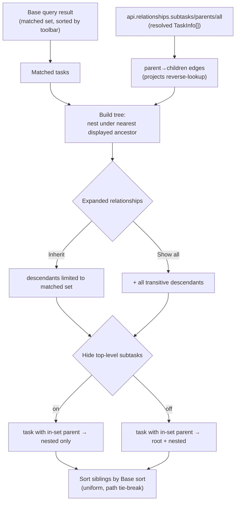

# Bases Relationship Expansion & Sorting — Requirements

## Summary

Bring the Gantt's Bases datasource to TaskNotes TaskList parity with three per-view
settings — **Expanded relationships** (Inherit / Show all), **Hide top-level subtasks**
(toggle), and the Obsidian Base's **toolbar sort** actually driving row order — all applied
consistently down the recursively-expanded subtask tree.

## Problem Frame

The Gantt today builds its parent/child hierarchy only from the configured `parentProperty`
**among rows already returned by the Base query**. Two consequences:

1. **No subtask reach beyond the result.** If a parent matches the Base filter but its
   subtasks don't, those subtasks never appear — there's no way to pull a parent's children
   into view the way TaskNotes' TaskList does. TaskNotes solves this with its **Expanded
   relationships** setting (`inherit` / `show-all`) and a companion **Hide top-level
   subtasks** toggle that keeps a child from showing both at the root and under its parent.
2. **Base sort is ignored.** The user-defined sort on the Obsidian Bases toolbar makes no
   visible difference in the Gantt. The likely cause: instance expansion currently re-sorts
   rows by file path (`compareStr(a.path, b.path)` in [src/controller/InstanceExpansion.ts](src/controller/InstanceExpansion.ts)),
   clobbering whatever order Bases provided.

These are entangled: once subtasks are injected into the result, "what order do siblings
appear in" has to be answered for both matched and fetched rows. The brief is parity — match
TaskNotes' user-facing logic, even where the Gantt's implementation must differ.

## Key Decisions

- **TaskNotes-companion only for expansion.** Subtask expansion (both Inherit and Show all)
  and the Hide-top-level rule are active **only when TaskNotes is present**, driven by the
  TaskNotes relationships API. In standalone Bases-only mode the Gantt keeps today's behavior
  (hierarchy only among rows already in the Base result). This avoids the Gantt ever
  maintaining its own `metadataCache.resolvedLinks` index.

- **Relationship edges come from the TaskNotes API (not hand-rolled).** TaskNotes 4.11.0
  exposes `api.relationships.subtasks(path)` / `parents(path)` (each returning resolved
  `TaskInfo[]`, internally a `projects` reverse-lookup) plus `all(path)` (a relationships
  bundle). The Gantt consumes `subtasks` for children. The Gantt uses these as the
  **default** sourcing mechanism rather than building its own index — honoring "the API
  already ships it; don't hand-roll." Reading `api.tasks.list()` and inverting `projects` in
  memory is kept only as a **measured fallback** if an eager full-tree bulk build proves
  cheaper than N per-node accessor calls. Either way, no self-built
  `metadataCache.resolvedLinks` index.

- **Companion mode: `projects` is the authoritative parent edge.** When TaskNotes is present,
  hierarchy comes from TaskNotes `projects` (via the relationships API); the configured
  `tngantt_parentProperty` is **ignored for hierarchy** in companion mode. Standalone
  Bases-only mode continues to use `parentProperty`. The two edge sources do not co-mingle.

- **Freshness.** Companion-mode hierarchy must refresh on project-edge changes — TaskNotes'
  own reverse index uses a 30s TTL + cache-event invalidation, and the Gantt should subscribe
  to `task.projects.changed` (a distinct event it does not currently watch) or otherwise rely
  on the accessor's freshness rather than caching a read-once map.

- **Parity principle.** Parity with TaskNotes exists for cross-plugin consistency; the Gantt
  diverges only where the timeline visualization makes parity actively misleading (e.g.
  uniform sibling sort, eager-expanded default). New relationship/sort features inherit this
  rule rather than re-arguing each case.

- **Terminology.** *Matched set* = tasks in the Base query result (the filter output, before
  any Show-all expansion). *Displayed set* = the matched set plus any Show-all descendants
  actually rendered. *Top level* = the tree roots. These three terms are used consistently
  below.

- **Base sort applied uniformly, tree preserved.** Read the Base's sort spec
  (`config.getSort()`) and apply it within each sibling group at every depth — matched rows
  and fetched descendants alike — with file path as the deterministic tie-break. Never a
  global flat sort that breaks nesting. The existing path-only sort that clobbers Base order
  is removed.

- **Three orthogonal settings, parity defaults.** `Expanded relationships` (default
  `Inherit`) controls *which descendants nest*; `Hide top-level subtasks` (default `off`)
  controls *whether a task with an in-set parent is removed from the root*. They compose
  independently, exactly as in TaskNotes.

- **Eager, persistent tree.** Unlike TaskNotes' lazy click-to-expand cards, the Gantt
  materializes the full tree and lets SVAR handle collapse/expand. Default state is **fully
  expanded** (timeline visibility). SVAR's own interactive column-sort is **not** exposed —
  the Base toolbar sort is the single source of truth, keeping the Obsidian Bases experience
  consistent.

- **Hide-top-level predicate replicated exactly.** A task is removed from the top level iff
  one of its `projects` parents resolves to a task **present in the matched query result**
  (pre-expansion); multi-parent → any in-set parent hides it; orphan (no in-set parent) stays. Because the
  Gantt is a tree, `off` means such a task appears **both** at root and nested under its
  parent (consistent with how the Gantt already renders multi-parent tasks as multiple
  instances); `on` yields the clean nested-only tree.

## Requirements

**Expanded relationships (subtask expansion)**

- R1. A new per-view setting **Expanded relationships** accepts `Inherit` (default) and
  `Show all`, mirroring TaskNotes' `expandedRelationshipFilterMode` semantics.
- R2. In `Inherit`, the displayed descendants of a matched task are limited to tasks that are
  themselves in the Base result set.
- R3. In `Show all`, the displayed descendants include **all transitive descendants** of a
  matched task regardless of whether they match the Base filter, sourced via the TaskNotes
  relationships API (`api.relationships.subtasks`).
- R4. Expansion is **recursive** (subtasks of subtasks, to any depth) and **cycle-guarded** —
  a task already present on its own ancestor chain is not re-rendered as its own descendant.
- R5. A node nests under its **nearest displayed ancestor**. A task with multiple displayed
  parents renders one instance per displayed parent (the Gantt's existing multi-instance
  behavior).
- R6. Expansion is active **only in TaskNotes-companion mode**. In standalone Bases-only mode
  the Gantt retains today's hierarchy built from in-result rows; `Show all` has no effect
  there. The companion-only controls are **hidden or disabled with an explanation** in
  standalone mode — never present-but-silently-inert.
- R18. Show-all descendants that do **not** match the Base filter must be **visually
  distinguished** from matched rows on the timeline (so the filter stays legible). Exact
  treatment (dim / tint / label) is a design decision; the requirement is that a distinction
  exists.
- R19. Undated Show-all descendants route through the Gantt's existing undated / partial-date
  handling (`showUndatedTasks` / `showPartialDateTasks`); Show-all does not introduce a new
  undated-row behavior.

**Hide top-level subtasks**

- R7. A new per-view toggle **Hide top-level subtasks**, default **off**, mirroring
  TaskNotes' `hideTopLevelSubtasks`.
- R8. The hide predicate: a task is removed from the top level iff at least one of its
  `projects` links resolves to a task **present in the matched query result** (the Base result
  set *before* Show-all expansion — not the post-expansion displayed set). Multi-parent → any
  one in-set parent triggers the hide. A task with no in-set parent stays at top level.
- R9. In the Gantt tree, `off` keeps the task's top-level (root) instance **in addition to**
  its nested instance(s); `on` suppresses the root instance so the task appears only nested
  under its parent(s).

**Sorting**

- R10. The Obsidian Base's toolbar sort (`config.getSort()`) drives sibling order at every
  depth of the tree.
- R11. The tree structure is preserved; sort is applied **within sibling groups only**, never
  as a global flat sort across the whole list.
- R12. The same sort comparator is applied to matched rows and fetched (Show-all) descendants
  alike, with **file path as the tie-break** when sort keys are equal.
- R13. The existing path-only sort in instance expansion that overrides Base order is removed
  so Base order survives to render. **Determinism caveat:** that sort also seeds
  primary-instance selection and link-id stability in `InstanceExpansion`; its removal must
  preserve that determinism via an equivalent tie-break inside expansion, not just at the
  sibling-display layer.
- R14. When no Base sort is configured, sibling order falls back to the Base-provided order
  with path tie-break — deterministic across re-renders.
- R20. **Formula fields are supported for display and sorting on in-result (matched) rows**,
  where Bases provides computed values. For Show-all **fetched** rows, formula values are not
  available — Bases evaluates formulas only for result rows and exposes no API to evaluate them
  on arbitrary notes, and TaskNotes does not either — so fetched rows fall back to native-field
  then file-path ordering. This fallback is **documented and intentional**, not a silent
  failure. Recomputing Base formulas for fetched rows is out of scope (see Scope Boundaries).

**Settings & consistency**

- R15. The new settings follow the Gantt's existing config conventions (view-option
  registration + reader) and preserve TaskNotes' value vocabulary (`inherit` / `show-all`) and
  defaults. Concrete keys: `tngantt_expandedRelationships` and `tngantt_hideTopLevelSubtasks`.
  The two new controls plus the existing sort are **grouped together** in the view-config
  panel, with labels matching TaskNotes' exact strings ("Expanded relationships", "Hide
  top-level subtasks") for cross-plugin recognizability.
- R16. SVAR Gantt's built-in interactive column sort is **not** exposed; the Base toolbar
  sort remains the single ordering authority.
- R17. The tree is materialized eagerly and rendered **fully expanded by default**, with
  SVAR's native collapse/expand controls available to the user. Collapse/expand state
  **persists** across view reload and settings changes, and a **collapse-all** affordance is
  available (deep Show-all trees are otherwise unusable at scale).

## Acceptance Examples

- AE1. **Inherit + Hide off (defaults).** Parent P and child C both match the Base filter.
  **Then** C appears nested under P **and** as its own top-level row (default `off` keeps the
  root instance).
- AE2. **Inherit + Hide on.** Same P and C both matched, Hide on. **Then** C appears only
  nested under P; it is not a top-level row.
- AE3. **Show all.** P matches; child C and grandchild G do **not** match the filter. **Then**
  C nests under P and G nests under C, both pulled in via the TaskNotes relationships API.
- AE4. **Inherit, matched child of unmatched parent.** C matches the filter but its parent P
  does not. **Then** C appears at top level (its parent isn't displayed, so it has no
  displayed ancestor to nest under) regardless of the Hide toggle.
- AE5. **Sort interleaves matched and fetched.** Base sort = due date ascending, Show all on.
  A fetched descendant with an earlier due date sorts **above** a matched sibling with a
  later due date within the same parent; equal due dates break by file path.
- AE6. **Multi-parent with Hide on.** C lists parents P1 (in the matched result set) and P2
  (not in the set). **Then** C is hidden from the top level (P1 is in-set) and nests under P1.

## Scope Boundaries

- Standalone Bases-only "Show all" — out. Reaching outside the Base result without TaskNotes
  would require a self-built `metadataCache` reverse index, which this work deliberately
  avoids.
- Manual drag-to-reorder / `sortOrder` persistence — out. This work matches TaskNotes'
  read/display ordering, not authored manual order.
- Exposing SVAR's interactive column sort — out (R16).
- Recomputing Base formulas for Show-all fetched (out-of-result) rows — out. No Bases API
  supports evaluating a formula on an arbitrary note; fetched rows fall back to
  native-field/path ordering (R20). A formula-recompute subsystem is a possible future item,
  not this work.

## Dependencies / Assumptions

- **TaskNotes 4.11.0+ behavior is the parity target**, confirmed against
  `renatomen/tasknotes@origin/main` (`hideTopLevelSubtasks` toggle, `topLevelSubtasks.ts`,
  `expandedRelationshipFilterMode`).
- `config.getSort()` is **confirmed available** in the Obsidian Bases API (TaskNotes uses it;
  the Gantt already uses the sibling `config.getOrder()`).
- `api.relationships.subtasks` / `parents` are **confirmed present** in TaskNotes 4.11.0,
  returning resolved `TaskInfo[]` (`all` returns a relationships bundle, not a flat array).
- Assumes `basesView.data.data` arrives pre-sorted by the Base toolbar sort (TaskNotes relies
  on this). The uniform-comparator approach (R12) does not strictly depend on it but should
  reconcile with it during planning.
- **Formula values are unavailable for out-of-result rows.** Bases computes formulas only for
  result rows and exposes no API to evaluate them on arbitrary notes; per R20, Show-all fetched
  rows fall back to native-field/path ordering (recompute is out of scope).
- **Eager tree forces an async pre-resolve stage.** `api.relationships.subtasks` is async
  (returns a `Promise`), so an eager full-tree build (R17) must resolve the fetched-descendants
  set in an async stage upstream of the currently-synchronous instance-expansion/render
  pipeline. Where that stage slots in — and whether the companion edge-source swap (R-level:
  `projects` supersedes `parentProperty`) lives in a companion-aware `BasesSource` or in
  `CompositeSource.getTasks()` — is a planning decision.

## Sources / Research

- TaskNotes 4.11.0 (`renatomen/tasknotes@origin/main`):
  - `src/bases/registration.ts` — view-option registration for `expandedRelationshipFilterMode`
    (default `inherit`) and `hideTopLevelSubtasks` (default `false`).
  - `src/bases/topLevelSubtasks.ts` — `filterTopLevelSubtasks` / `taskLinksToTaskInSet`, the
    exact hide predicate and project-link resolver shape.
  - `src/ui/taskCardRelationships.ts` — `filterExpandedRelationshipTasks`, the inherit vs
    show-all branch.
  - `src/services/ProjectSubtasksService.ts` — `projects`→reverse-lookup model and default
    `sortTasks` order.
  - `src/api/TaskNotesAPI.ts` (relationships at ~L807; `getSubtasks` ~L1862) and
    `src/api/runtime-api.ts` L790-792 — `api.relationships.subtasks` / `parents` return
    resolved `TaskInfo[]` (the children accessor the Gantt should consume); `all` returns a
    relationships bundle.
  - `src/services/ProjectSubtasksService.ts` — 30s-TTL reverse index + cache-event
    invalidation (the freshness precedent behind the refresh-trigger decision).
- Gantt current state:
  - [src/controller/InstanceExpansion.ts](src/controller/InstanceExpansion.ts) — the path
    sort that clobbers Base order (R13).
  - [src/bases/taskHierarchy.ts](src/bases/taskHierarchy.ts) — `buildHierarchy`, current
    in-result tree building and cycle handling.
  - [src/datasource/TaskNotesSource.ts](src/datasource/TaskNotesSource.ts),
    [src/datasource/CompositeSource.ts](src/datasource/CompositeSource.ts) — current
    TaskNotes API usage (`api.tasks.list`, `api.relationships.dependencies`); the recorded
    "no parent/project edge" limitation is **superseded** by `api.relationships.subtasks` /
    `parents`.
  - [src/bases/viewOptions.ts](src/bases/viewOptions.ts),
    [src/bases/fieldMappingConfig.ts](src/bases/fieldMappingConfig.ts) — where the new view
    settings and readers plug in.

## Deferred / Open Questions

### From 2026-06-22 review

- **Hide-top-level default & duplicate-bar treatment** (P0, design decision). With `Hide
  top-level subtasks` `off` (the TaskNotes parity default), the same task renders as **two
  bars** on the timeline — once at root and once nested under its matched parent (R9 / AE1).
  On a list this is mild; on a Gantt it reads as a duplicate-bar artifact. Resolve before or
  during planning: **(a)** keep `off` as the default for parity and add a visual
  de-duplication treatment for repeated instances, or **(b)** flip the Gantt's default to
  `on` (clean nested-only tree) as a deliberate, documented divergence from TaskNotes parity.
