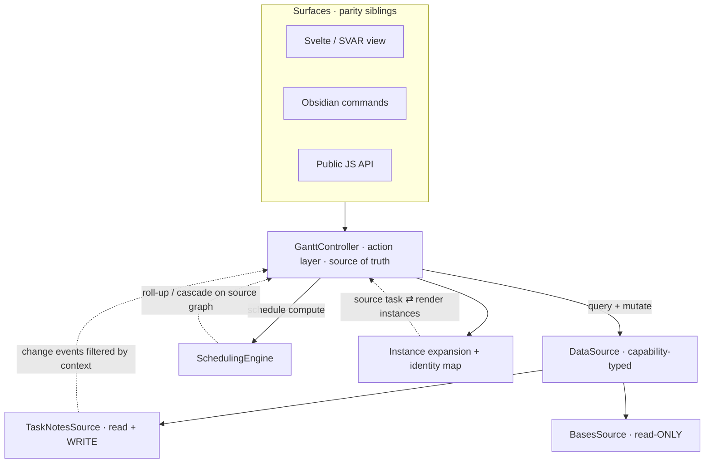
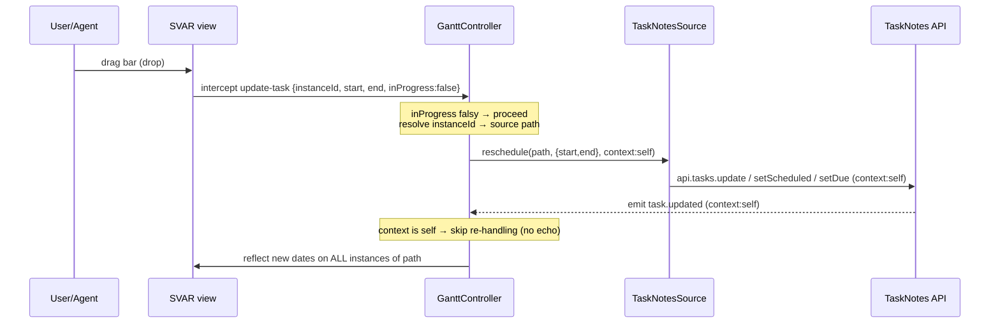
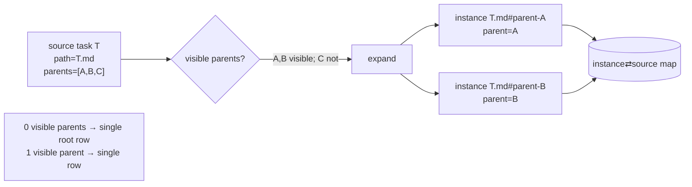

# feat: Reposition Obsidian Gantt as a TaskNotes-first, agent-native companion

## Summary

Restructure the plugin behind a four-layer architecture — Surfaces → `GanttController` (single action layer) → capability-typed `DataSource` (TaskNotes read+write, Bases read-only) + `SchedulingEngine` — so the Gantt owns only the visualization, interaction, and scheduling, while TaskNotes owns task data and CRUD. The work removes the product-orthogonal AssertThat/JIRA sync subsystem, lands a read-only multi-parent-capable chart first, then adds persistent drag/resize write-back through TaskNotes, agent-parity command + JS-API surfaces, and a Tier-1 date roll-up/cascade engine.

---

## Problem Frame

The plugin paused in January 2026 as a Bases-only Gantt view. Today nothing it does persists — drag, resize, and the editor modal mutate SVAR's in-memory store and evaporate ([src/bases/GanttContainer.svelte](src/bases/GanttContainer.svelte) edit handlers); dependency links are a hardcoded dummy array; there is no command, settings, or API surface; and a large AssertThat/JIRA BDD-sync subsystem sits in the repo unrelated to the product. Meanwhile TaskNotes now ships a confirmed JS/HTTP API, dependency model, and events. The repositioning lets the Gantt delegate data to TaskNotes and invest only in what nothing else in the ecosystem does: a persistent, dependency-aware, multi-parent Gantt with a scheduling engine. See origin: [docs/brainstorms/2026-06-16-tasknotes-companion-gantt-requirements.md](docs/brainstorms/2026-06-16-tasknotes-companion-gantt-requirements.md).

---

## Requirements

Requirement IDs are carried verbatim from the origin document for 1:1 traceability. The implementer's checklist; grouped by concern.

### Positioning & packaging
- R1. Presented/documented as a TaskNotes companion; TaskNotes recommended, not strictly required.
- R2. TaskNotes is the active source when installed and ready; Bases fallback is automatic when absent.
- R3. Non-TaskNotes users get a read-only Gantt over Bases with no broken mutation affordances.

### Data sources & capabilities
- R4. Data access is mediated by a capability-typed `DataSource`; sources declare write support (TaskNotes read+write, Bases read-only).
- R5. Surfaces derive available mutations from the active source's declared capabilities — read-only is the *absence* of a capability, in one place.
- R6. CRUD on the TaskNotes source delegates to the TaskNotes API, never direct frontmatter writes.
- R7. Subscribe to TaskNotes change events; refresh affected rows without full reload where feasible.

### Action layer & agent parity
- R8. All operations route through a single action layer (the source of truth); no surface mutates chart state directly.
- R9. Every UI action has a matching Obsidian command and JS API method invoking the same action-layer operation.
- R10. The agent-reachable surface is transported through TaskNotes' existing HTTP/CLI/JS facilities; the plugin does not run its own HTTP server.
- R11. In read-only mode, mutations are uniformly unavailable across every surface (UI, command, API), with no bypass.

### Scheduling engine
- R12. The plugin owns a scheduling engine exposing only computations TaskNotes cannot do.
- R13. Tier 1: roll parent/summary dates up from children; cascade child/dependent dates on parent/predecessor moves. Computes over unique *source* tasks with a cycle guard.
- R14. Tier 2 (deferred): critical path, critical chain (CCPM/ToC), capacity scheduling.
- R15. Schedule computations that change dates persist through the same write path as manual edits.

### Dependencies & visualization
- R16. Dependency arrows derived from TaskNotes `blockedBy`/`blocking` (with reltypes + gap) rendered as SVAR links; read-only initially.
- R17. First write milestone persists schedule edits only — drag-to-reschedule and resize (duration). Progress persistence is deferred pending a TaskNotes field mapping (see Key Technical Decisions and Deferred scope); link create/delete is also out of this milestone.
- R18. Parent/child hierarchy renders with indentation and expand/collapse.

### Multi-parent display
- R24. A task with multiple parents renders once under each *visible* parent via virtual duplication; no visible parent → root; one → single row.
- R25. All render instances of a task share one source identity; edits to any instance write to the single source and reflect everywhere; no divergent dates.
- R26. The action layer maintains an instance↔source identity map: instance-ID mutations resolve to the source path before writing; source events fan out to all instances.
- R27. Arrow rendering across duplicated instances is a user-selectable, view-config-persisted option (default primary-instance-only).

### Preserved usability
- R19. Preserve touch DnD handling, zoom controls/levels, offline Lucide icons, grid resizer, unscheduled-task styling, the editor modal.
- R20. Reroute SVAR mutation events to the action layer instead of in-memory mutation, without regressing R19.

### Codebase & contributor workflow
- R21. Remove the AssertThat/JIRA BDD-sync subsystem, its scripts, and its dependencies.
- R22. Keep BDD as the spec method; rewrite specs against the action-layer contract; run with the local WebdriverIO+Mocha harness; no JIRA/AssertThat.
- R23. Move tracking to GitHub.

---

## Key Technical Decisions

- **Controller owns a coherent source-graph snapshot; forwards CRUD.** `GanttController` forwards task CRUD to the active `DataSource` (no duplicate domain model — CRUD lives in TaskNotes), but it does own a coherent *source graph*: tasks + dependency edges (reltype, gap) + parent edges, refreshed on events. Tier-1 cascade already needs this relational state — it is not a thin forwarder — so a scheduling run operates on an **immutable snapshot** of the graph; an external mutation arriving mid-run aborts-and-retries the run rather than corrupting a half-computed cascade. Rationale: "thin" is right for CRUD, but cascade-with-reltypes is relational and needs an owner with snapshot discipline. (Resolves origin "controller granularity" deferred question; corrects the original "owns only the schedule graph the engine needs" framing, which under-provisioned Tier-1.)

- **Capability gating delegates to TaskNotes' own `hasCapability`, and is reactive.** The `TaskNotesSource` reports write capability via `api.hasCapability("tasks.write")` rather than inventing a parallel capability model; `BasesSource` hardcodes read-only. Read-only mode (R5/R11) is the structural absence of write methods on the active source. Capability is **reactive, not a construction-time snapshot**: the controller subscribes to TaskNotes plugin enable/disable and `lifecycle` readiness, re-selects the source when availability flips (e.g., TaskNotes becomes ready 2s after mount, or is disabled mid-session), and propagates the new capability to every surface. Critically, SVAR's `readonly` prop covers only native bar drag/resize and the native editor — it does **not** cover the view's custom toolbar ("Add Task") or custom editor modal, which call `api.exec(...)` directly. Those surfaces must be gated on `capabilities.write` explicitly (see U7), or R11's "no bypass" fails.

- **Drag persistence triggers on `update-task` with falsy `inProgress`.** SVAR fires `drag-task` (pixels only, every frame) during a gesture and a committing `update-task` (real `start`/`end`/`progress`) on drop; live progress drags fire `update-task` with `inProgress: true` per frame and a final call with `inProgress` absent. The controller persists only on `update-task` where `inProgress` is falsy, via `api.intercept("update-task", …)`. The exact firing sequence (per-frame `true`, committing call falsy) is a runtime-observed invariant, not guaranteed by the type surface (`inProgress?` is optional) — U8's first test captures and pins the real trace. Rationale: confirmed against SVAR v2.3.0 source; persisting from `drag-task` would capture no dates and thrash.

- **Every mutation surface routes through one gated controller API.** Drag is not the only mutation path: the preserved editor modal (Save/Delete — editing title/progress/dates) and the custom toolbar ("Add Task") emit `api.exec(...)` today and would otherwise bypass both the controller and the capability gate. All are rerouted to a generalized `mutate(instanceId, patch)` (where `patch` in milestone 1 may carry `{start, end, text, status}` — `progress` is deferred pending a field mapping, see R17) plus an explicit `deleteTask(instanceId)` that resolves to the source path and removes the source (all its instances). **The two `update-task`-shaped events must not be conflated:** a drag/resize commit and a modal Save both reach SVAR as `update-task` with falsy `inProgress`, so the `api.intercept("update-task", …)` path is reserved for drag/resize and constructs a **dates-only** patch, while the editor modal calls `controller.mutate(instanceId, explicitPatch)` *directly* (the modal knows exactly which fields changed) rather than via `api.exec`/intercept. Otherwise a drag would rewrite `text`/`status` from stale SVAR row values, or modal title/status edits would be dropped. The `show-editor` intercept, modal action buttons, and toolbar items are gated on `capabilities.write`. Rationale: R11 (no bypass) and R25 (title/status/**delete** edits persist) require one gated path, not a drag-only one — the drag-only design was the single biggest review gap.

- **Two echo loops, two guards.** Reflecting a write back into the chart can re-trigger persistence on two distinct paths, and both are guarded:
  - *TaskNotes event loop.* Every TaskNotes write passes `context: {source, correlationId, reason}` which rides the emitted change event; the controller suppresses events matching an in-flight `correlationId` set it maintains with a **TTL and removal-on-first-match**. Because one `tasks.update` may fan out into `task.updated` *plus* granular `task.scheduled.changed`/`task.due.changed`, self-suppression keys on `task.updated` (and verifies, against TaskNotes source, whether granular events also carry the originating context; if not, granular events are not used for self-suppression). A genuinely external edit arriving during an in-flight window must still be processed — suppression keys on `correlationId`, never on `source === self` alone.
  - *SVAR store loop.* Reflecting dates into the SVAR store re-fires SVAR's own `update-task`; controller-driven reflection tags `eventSource` (self) and the view's intercept early-returns on self-originated `eventSource`.
  - *Backstop (makes the guards non-correctness-critical).* The refresh path is idempotent: an inbound event whose date payload already equals the controller's current snapshot is a no-op. So a self-event that escapes the `correlationId` window (dropped/delayed past TTL, or a granular event lacking context) causes at most a redundant no-op, never a re-write. **Prerequisite for U6:** verify against TaskNotes source whether granular events (`task.scheduled.changed` etc.) carry the originating context; if not, self-suppression keys on `task.updated` only and relies on this backstop.
  Rationale: this is the correctness lynchpin; the original KTD described only the first guard, leaving the SVAR-side echo, the multi-event/correlationId-lifecycle, and the late/dropped-event cases unaddressed.

- **Source/instance identity split, designed in from milestone 1.** Multi-parent rendering (R24–R26) duplicates a source task into one SVAR row per visible parent (`id = path#parent-X`, `custom.sourceTaskId = path`). SVAR's `parent` is single-valued, so duplication is the only mechanism. The controller translates instance IDs → source path on every mutation and fans source events out to all instances. Two identity subtleties are designed in from the start, not discovered later:
  - An instance's `parent` must point at the **parent's instance ID under the same ancestry** (computed recursively), not the bare parent path — otherwise a nested tree breaks when a parent is itself multi-parented (its row id is `A.md#parent-Z`, not `A.md`).
  - Dependency links are **source-level** (`blockedBy` between note paths) but SVAR links connect **rows**; link endpoints are rewritten to concrete instance IDs via the `sourcePath → instanceId[]` map, targeting the primary instance per the arrow-mode setting (R27). A link to a non-existent row id silently fails to render.
  - **Parent identity is resolved-path-based.** `SourceTask.parents` must hold resolved vault paths in the same namespace as `path` — `BasesDataAdapter.extractParents()` returns *raw* references (wikilinks, relative refs), so the source resolves them (via `metadataCache.getFirstLinkpathDest`-equivalent) before populating `parents`. Otherwise every multi-parent lookup misses and tasks silently fall to root.
  - **Partial-ancestry rule.** Under visible-parent filtering, a parent that is itself multi-parented produces a *subset* of instances. A child instance is created per *(materialized parent-instance)* — derived from the parent's actual produced instance set, never the bare path — so a child never dangles to an ancestry instance that was not created.
  Rationale: retrofitting the ID layer after the write path is built is expensive; the link-endpoint, raw-vs-resolved-path, and partial-ancestry cases are exactly where a naive `parent = path` design breaks.

- **Scheduling operates on the source graph, view duplicates for display.** Roll-up/cascade compute once per unique source task (carrying the existing `visited`-Set cycle guard from [src/bases/views/GanttTaskListView.ts](src/bases/views/GanttTaskListView.ts)); the view reflects results to all instances. Rationale: clean separation — the engine never sees duplicates.

- **Progress is derived/read-only in milestone 1.** TaskNotes has no native numeric 0–100 progress field. Progress renders derived from status; progress drags do not persist until a user-configured TaskNotes field mapping exists (deferred). Rationale: avoids inventing a progress field or corrupting notes. (Resolves origin progress deferred question.)

- **Evolve in place on the existing seam.** The new layers insert at [src/bases/register.ts](src/bases/register.ts) `mountGantt()`, where config→`FieldMappings`→Svelte props are wired today; the Svelte `$props()` contract is preserved, so the view's usability work survives. Rationale: the view is decoupled from data; a rewrite is risk without payoff (per `.augment/rules/refactoring.md`).

- **Layering follows the existing convention set.** Facade (`GanttController`), DI-via-interface (`DataSource`), raw-values-in-data-layer (`data-formatting-separation`), and the `buildXCommand(plugin)` factory for commands are all mandated by `.augment/rules/`. New code adds barrel `index.ts` files and types the SVAR API surface (clearing existing `any` debt in touched files, in separate commits per `refactoring.md`).

---

## High-Level Technical Design

### Layered architecture



### Persistent reschedule round-trip (echo-safe)



### Source → render-instance expansion (multi-parent)



---

## Output Structure

New layered modules added beside the existing `src/bases/` tree (which is retained and wrapped). Indicative layout — the implementer may adjust:

```
src/
  main.ts                      # adds command + JS API registration
  datasource/
    index.ts                   # barrel
    types.ts                   # DataSource interface, capability flags, SourceTask model
    BasesSource.ts             # read-only; wraps existing Bases adapter/mapping
    TaskNotesSource.ts         # read+write; wraps TaskNotes JS API + events
  controller/
    index.ts
    GanttController.ts         # action layer / source of truth
    InstanceExpansion.ts       # source↔instance expansion + identity map
  scheduling/
    index.ts
    SchedulingEngine.ts        # Tier-1 roll-up + cascade (source graph)
  commands/
    index.ts
    ganttCommands.ts           # buildXCommand(plugin) factories
  api/
    index.ts
    GanttPublicApi.ts          # JS API mirroring controller actions
  bases/                       # RETAINED: register.ts (seam), GanttContainer.svelte (view),
                               # services/* (extraction reused by BasesSource)
```

---

## Implementation Units

Phased into milestones. Read-only visualization (incl. multi-parent) lands before any write-back.

### Milestone 0 — Cleanup & foundation

### U1. Remove the AssertThat/JIRA BDD-sync subsystem

- **Goal:** Delete the product-orthogonal sync subsystem and its dependencies; keep the WebdriverIO+Mocha E2E harness.
- **Requirements:** R21, R22, R23
- **Dependencies:** none
- **Files:** delete `src/bdd/`, `src/errors/SyncErrors.ts`, `cucumber.config.js`, `test/step-definitions/`, `features/`, `.bdd/`, the sync `scripts/*` (per origin/research inventory), and the AssertThat-tied tests in `test/unit/*` and `test/integration/*`; edit [package.json](package.json) (remove `axios`, `simple-git`, `inquirer`, `@cucumber/gherkin`, `adm-zip`, `@types/adm-zip`, `glob`, and the `sync:*`/`assign:ids`/`test:bdd*`/`validate:bdd`/`generate:feature`/`tags`/`detect:bdd-changes`/`verify:secrets` scripts); edit `.github/workflows/ci.yml` (drop the `bdd-validation` job and BDD steps/secrets) and delete `.github/workflows/sync-assertthat.yml`; edit [jest.config.mjs](jest.config.mjs) (remove the `@cucumber/gherkin` transform exception).
- **Approach:** Tag the current commit (e.g., `archive/assertthat-sync`) before deletion so it is recoverable, then remove in one atomic change. Verify nothing in the runtime plugin (`src/main.ts` and its imports) references the removed modules. Keep `dotenv` (shared with `e2e-local.mjs`). Resolve the orphaned `@cucumber/cucumber` reference and the `moduleNameMapping` typo flagged in research while here. The kept E2E runner is **WebdriverIO + Mocha** (`test/wdio/`, `test/specs/`, the `e2e` script) — distinct from the removable Cucumber-BDD machinery (`cucumber.config.js`, `test/step-definitions/`, `features/`); the origin/brainstorm "WebdriverIO + Cucumber" phrasing is inaccurate and should not drive an over-broad sweep. Verify `npm run e2e` still resolves its specs glob after removal.
- **Execution note:** Removal is a refactor; land it separate from feature commits (per `.augment/rules/refactoring.md`).
- **Test scenarios:** Test expectation: none — pure deletion. Verification is that the build, lint, typecheck, unit suite, and E2E smoke still pass with the subsystem gone.
- **Verification:** `npm run build`, `lint`, `typecheck`, `test`, and `e2e` smoke all green; no dangling imports; dependency count reduced; CI has no AssertThat steps.

### U2. DataSource abstraction, source-task model, and module skeleton

- **Goal:** Define the capability-typed `DataSource` interface, the `SourceTask` model (raw values, parent array), and barrel-exported module folders.
- **Requirements:** R4, R5, R1
- **Dependencies:** U1
- **Files:** create `src/datasource/types.ts`, `src/datasource/index.ts`; scaffold `src/controller/index.ts`, `src/scheduling/index.ts` (empty barrels for now).
- **Approach:** `DataSource` exposes read methods (list/get source tasks, read dependencies) always, and an optional/typed write capability surface. A `capabilities` descriptor (`{ write: boolean }`) is the single source of read-only truth (R5). `SourceTask` carries raw `start`/`end`/`progress`/`status` (Date/number/string/`null`), `parents: string[]`, and `path` as identity — honoring `data-formatting-separation` (no formatted strings in the data layer). The `DataSource` contract specifies that `parents` are **resolved vault paths** in the same namespace as `path` (resolving raw references is the source's responsibility, not the controller's).
- **Patterns to follow:** interface-in-`types/` + constructor DI as in [src/bases/services/PropertyMappingService.ts](src/bases/services/PropertyMappingService.ts); add barrels per `.augment/rules/typescript.md`.
- **Test scenarios:**
  - Happy path: a fake `DataSource` with `capabilities.write=false` exposes no write methods / reports unsupported; one with `write=true` exposes them.
  - Edge: `SourceTask` with empty `parents` array; with multiple parents; with `null` dates.
- **Verification:** Interface compiles under strict mode; a mock source can be constructed and injected; no `any` in the new types.

### Milestone 1 — Read-only visualization (TaskNotes + Bases, multi-parent)

### U3. BasesSource (read-only) behind the interface

- **Goal:** Implement `BasesSource` by wrapping the existing Bases extraction behind the read-only `DataSource` contract.
- **Requirements:** R3, R4
- **Dependencies:** U2
- **Files:** create `src/datasource/BasesSource.ts`, `test/unit/BasesSource.test.ts`; reuse [src/bases/services/BasesDataAdapter.ts](src/bases/services/BasesDataAdapter.ts) and [src/bases/services/PropertyMappingService.ts](src/bases/services/PropertyMappingService.ts).
- **Approach:** `BasesSource` produces `SourceTask[]` and reads dependencies as empty (Bases has no dependency model). `capabilities.write=false`. Keep the two-tier cheap-bulk/lazy-visible extraction discipline. **`extractParents` returns *raw* references (wikilinks, relative refs), so `BasesSource` resolves each to a vault path via `metadataCache.getFirstLinkpathDest(linkPath, sourcePath)` (the resolution logic already in [src/bases/views/GanttTaskListView.ts](src/bases/views/GanttTaskListView.ts) `resolveParentLink`) before populating `parents`** — satisfying the DataSource contract that `parents` are resolved paths.
- **Patterns to follow:** existing adapter extraction; `id = path` round-trip convention (research finding #2).
- **Test scenarios:**
  - Happy path: Bases entries → `SourceTask[]` with raw dates, basename fallback for text, progress clamped.
  - Edge: multi-valued parent property → `parents` array; missing/`null` dates → `null` not formatted string; unscheduled task handling preserved.
  - Resolution: a parent expressed as a wikilink (`[[Note]]`) or relative ref resolves to the same vault path used as another task's `path` identity (so the instance map can link them).
  - Capability: `capabilities.write` is false; no write methods callable.
- **Verification:** Mirrors current Bases render output as `SourceTask[]`; existing Bases adapter unit tests still pass.

### U4. TaskNotesSource (read + capability + events)

- **Goal:** Implement `TaskNotesSource` over the TaskNotes JS API: read tasks, read dependencies, subscribe to change events, declare write capability.
- **Requirements:** R1, R2, R4, R6 (read), R7, R16 (read)
- **Dependencies:** U2
- **Files:** create `src/datasource/TaskNotesSource.ts`, `test/unit/TaskNotesSource.test.ts`.
- **Approach:** Resolve `app.plugins.getPlugin("tasknotes")?.api`, `await api.lifecycle.ready()`, check `api.apiVersion`. Read via `api.tasks.list/get`; map TaskInfo → `SourceTask` (`id = path`, raw dates). Read dependencies via `api.relationships.dependencies(path)` and map reltypes (`FINISHTOSTART`→`e2s`, `STARTTOSTART`→`s2s`, `FINISHTOFINISH`→`e2e`, `STARTTOFINISH`→`s2e`) into a normalized link list. `capabilities.write = api.hasCapability("tasks.write")`. Subscribe to `task.updated`/`task.scheduled.changed`/`task.due.changed`/`task.dependencies.changed`/`task.created`/`task.deleted` via `api.events.on`, registered through `this.registerEvent`. Guard every cross-plugin call (try/catch, graceful fallback).
- **Execution note:** Start with a failing test for the TaskInfo→SourceTask mapping and the reltype→link-type mapping against a mocked TaskNotes API.
- **Patterns to follow:** defensive runtime resolution + event-refresh mechanics from `project/archived/TaskNotes Integration Architecture.md` (removed in repo housekeeping; recoverable from git history) (mechanics only; API names from origin's confirmed surface).
- **Test scenarios:**
  - Happy path: mocked `api.tasks.list` → `SourceTask[]`; `api.relationships.dependencies` → normalized links with correct SVAR types.
  - Covers AE3. A `blockedBy` finish-to-start dependency maps to an `e2s` link.
  - Edge: TaskNotes absent / `api` undefined / `apiVersion` mismatch → source resolution fails gracefully (caller falls back to Bases).
  - Capability: `hasCapability("tasks.write")` true → `write=true`; false → `write=false`.
  - Events: an emitted `task.updated` invokes the registered handler; unsubscribed on unload.
- **Verification:** With a mocked TaskNotes API, read + dependency + capability + event paths behave; no direct frontmatter access.

### U5. Source→instance expansion and instance↔source identity map

- **Goal:** Expand multi-parent source tasks into SVAR render instances and maintain a bidirectional instance↔source map.
- **Requirements:** R24, R25, R26
- **Dependencies:** U2
- **Files:** create `src/controller/InstanceExpansion.ts`, `test/unit/InstanceExpansion.test.ts`; update `src/controller/index.ts` barrel to export it.
- **Approach:** Pure transform: `SourceTask[]` + visible-set → SVAR task instances. For each source task, create one instance per *visible* parent (`id = ${path}#parent-${parentInstanceId}`, `custom.sourceTaskId = path`, `custom.isVirtual = parents>1`); 0 visible parents → single root instance with `id = path`; 1 → single instance. **`parent` is the parent's *instance ID* under the same ancestry, computed recursively** — not the bare parent path — so nested multi-parent trees resolve correctly when a parent is itself duplicated. Build bidirectional `instanceId → sourcePath` and `sourcePath → instanceId[]` maps. Provide a link-endpoint rewrite helper: given source-level links (path→path) and the maps, produce SVAR links whose `source`/`target` are concrete instance IDs (targeting the primary instance per the arrow-mode setting). Carry a cycle guard using a `visited` Set spanning the **full parent DAG** (the `GanttTaskListView.assignLevel` precedent is borrowed only as the visited-Set *idiom* — it creates a fresh per-root Set, which won't detect a node reachable from multiple roots; multi-parent needs DAG-wide detection). Add a configurable fan-out guard whose **tripped behavior is explicit: collapse an over-fanned task to primary-instance-only with a visible indicator — never silently drop instances** (silent drop would violate R24).
- Choose a delimiter for instance IDs guaranteed absent from note paths (or encode the path), and assert it in the round-trip test.
- **Execution note:** Implement test-first — this is pure, high-value, edge-heavy logic.
- **Test scenarios:**
  - Covers AE6. Task with parents [A,B,C], only A,B visible → two instances (under A, B), none under C.
  - Happy path: 0 parents → one root instance; 1 parent → one instance.
  - Edge: parent referenced but not in visible set → not created; all parents invisible → root; self-referential/cyclic parent chain → guarded, no infinite loop.
  - Identity: `instanceId → sourcePath` resolves for every instance; `sourcePath → instanceId[]` returns all instances of a duplicated task.
  - Nested multi-parent: a grandparent that is itself multi-parented → each child instance's `parent` resolves to the correct parent *instance* id (not the bare path), and the row exists in the instance set.
  - Partial ancestry: a parent P is multi-parented with one grandparent invisible → child C produces instances only for P's *materialized* instances, with no instance dangling to a non-existent ancestry.
  - Link rewrite: a source-level link A→B where B has two instances → rewritten link targets B's primary instance id; no endpoint references a non-existent row id.
  - Edge: fan-out guard trips → over-fanned task collapses to primary-instance-only with indicator; no instance is silently dropped.
  - Delimiter: a path containing the delimiter character round-trips without mis-splitting.
- **Verification:** Given representative multi-parent data, instance count and parent assignments are correct and the maps round-trip.

### U6. GanttController — query, source selection, event-driven refresh

- **Goal:** Implement the action layer: select the active source, expose read/query operations, expand to instances, and refresh on source events (echo-filtered).
- **Requirements:** R8, R2, R7
- **Dependencies:** U3, U4, U5
- **Files:** create `src/controller/GanttController.ts`, `test/unit/GanttController.test.ts`; update `src/controller/index.ts` barrel.
- **Approach:** Select `TaskNotesSource` if TaskNotes resolves and is ready, else `BasesSource` (R2) — but selection is **reactive**: subscribe to TaskNotes plugin enable/disable and `lifecycle` readiness and re-select the active source when availability flips, re-reading `capabilities` and propagating the change to all surfaces (R5; see KTD "reactive capability"). Expose `getTasks()`/`getLinks()` returning expanded instances + rewritten links (via U5). Maintain a coherent source-graph snapshot (tasks + dependency edges + parent edges) refreshed on events; scheduling runs read an immutable snapshot. Subscribe to source change events and recompute/refresh affected instances, applying the two-guard echo suppression (in-flight `correlationId` set with TTL for TaskNotes events; `eventSource` self-tag for SVAR reflection — see KTD "two echo loops"). Expose the active `capabilities` for surfaces to read (R5). No surface mutates state directly — the controller is the only writer (R8).
- **Patterns to follow:** facade + observer (`.augment/rules/architecture.md`); replace the brute-force unmount/remount refresh with targeted updates where feasible.
- **Test scenarios:**
  - Happy path: TaskNotes present → TaskNotesSource selected; absent → BasesSource.
  - Reactive: TaskNotes becomes ready after mount → controller upgrades BasesSource→TaskNotesSource and capability flips to write; TaskNotes disabled mid-session → capability flips to read-only and surfaces re-gate.
  - Integration: a source change event triggers a controller refresh of the affected instances.
  - Echo: one self-write that fans out into `task.updated` + granular events triggers no refresh; an external edit arriving during an in-flight self-write window IS processed (keyed on correlationId, not `source===self`); in-flight correlationId entries expire via TTL.
  - Backstop: a self-event that arrives *after* its correlationId TTL expired causes an idempotent no-op (payload equals snapshot) — never a re-write.
  - Edge: source returns empty → controller yields empty instances (no dummy data).
- **Verification:** Controller selects the right source, yields expanded instances/links, and refreshes on external (non-self) events only.

### U7. Rewire the SVAR view to the controller (read-only, real data, multi-parent, arrow setting)

- **Goal:** Replace dummy data/links with controller-provided instances and real dependency links; bind `readonly` to source capability; add the arrow-rendering view setting; preserve all usability work.
- **Requirements:** R3, R5, R11 (read side), R16, R18, R19, R20, R27
- **Dependencies:** U6
- **Files:** modify [src/bases/GanttContainer.svelte](src/bases/GanttContainer.svelte), [src/bases/register.ts](src/bases/register.ts) (`mountGantt` seam + new view config option), `test/specs/*.e2e.ts` (new read-only render spec).
- **Approach:** In `mountGantt`, construct the `GanttController` and pass controller outputs (instances + rewritten links) and `capabilities` into the component instead of `data`/`fieldMappings` directly. Remove `getDummyTasks()` and the hardcoded `links` array. Bind SVAR's `readonly` prop to `!capabilities.write` **and** explicitly gate the view's own mutation surfaces on `capabilities.write` (SVAR `readonly` does not cover them): hide/disable the "Add Task" toolbar item, and guard the `show-editor` intercept so the editor modal does not open (or opens in a non-editing state) in read-only mode (R11 — no bypass). Render dependency links from controller data; honor a new **per-view** Bases view-config dropdown (`dependencyArrowMode`: `primary` | `all`) registered via the existing `options()` view-option pattern in [src/bases/register.ts](src/bases/register.ts) and persisted via `config.set/get`, with display labels "Primary instance only" / "All instances", default `primary`, updating live via the existing `$derived` reactive props. When `primary`, draw each arrow once on the primary instance (lowest-sort visible parent) and mark other instances with a "has dependencies" indicator (a CSS-class badge, no computed rendering). Preserve the OG-79 `touch-action` CSS split, `fonts={false}` + Lucide SVG icons, zoom controls/levels, resizer icons, unscheduled styling, and the editor modal (R19).
- **Design/UX specs (resolve before implementing — reviewers flagged these as implementer-blocking):**
  - *Read-only affordances:* "Add Task" hidden when `!capabilities.write`. A fixed one-line banner between the toolbar and the chart body renders whenever `!capabilities.write`, regardless of source — copy is "Read-only — install TaskNotes to edit" when no TaskNotes is detected, and "Read-only — TaskNotes write access unavailable" when TaskNotes is present but `hasCapability('tasks.write')` is false (reachable via the reactive mid-session disable). It persists until capability flips writable. Verify whether SVAR `readonly` suppresses `show-editor`; if not, the intercept returns without opening.
  - *Multi-parent row visual language:* duplicated (`custom.isVirtual`) rows carry a duplicate icon (`copy`/`git-fork`) inline *before* the task name, always present on virtual rows regardless of arrow mode. Separately, in `primary` arrow mode, non-primary instances carry a `has-dependencies` class on the text cell with a `link`/`arrow-right-left` icon *after* the task name and a `title` of "[task] has dependencies — arrows shown on the primary instance". These are two distinct elements, not one icon doing double duty.
  - *Progress affordance:* the editor-modal progress slider is read-only/disabled in milestone 1 (progress persistence deferred per R17/KTD) so it is not a dead affordance.
- **Patterns to follow:** existing Bases view-option registration in [src/bases/register.ts](src/bases/register.ts); SVAR `readonly` prop and reactive `tasks`/`links` props (research §3–4).
- **Test scenarios:**
  - Covers AE2. With Bases-only (read-only) source: drag does not persist/move; the "Add Task" toolbar item is hidden/disabled; the editor modal does not open (or opens non-editing) on `show-editor` — no custom surface bypasses the capability gate.
  - Multi-parent visual: a duplicated row renders the "duplicate" indicator; in `primary` arrow mode, non-primary instances render the "has dependencies" indicator and no arrow.
  - Covers AE3. Real `blockedBy` dependency renders as the correct SVAR link type, not a dummy.
  - Covers AE6. A multi-parent task renders once under each visible parent.
  - Happy path: real tasks render with hierarchy, expand/collapse, zoom; no dummy fallback appears.
  - View setting: `dependencyArrowMode=primary` draws each arrow once + indicator on duplicates; `=all` draws to every instance; the choice persists in view config.
  - Regression: touch drag CSS, icons, zoom, editor modal still present (E2E smoke + manual).
- **Verification:** Read-only chart renders real TaskNotes/Bases data with real dependency arrows and multi-parent duplication; the arrow-mode setting persists; usability work intact.

### Milestone 2 — Write-back (dates/resize via TaskNotes)

### U8. Persistent edit round-trip through TaskNotes

- **Goal:** Persist drag-reschedule and resize edits via TaskNotes, resolving instance→source, with echo-loop control; progress remains derived/read-only.
- **Requirements:** R6 (write), R15, R17, R25, R26
- **Dependencies:** U7
- **Files:** modify `src/controller/GanttController.ts` (mutate ops), `src/datasource/TaskNotesSource.ts` (write methods), [src/bases/GanttContainer.svelte](src/bases/GanttContainer.svelte) (intercept wiring), `test/unit/GanttController.write.test.ts`, `test/specs/persist.e2e.ts`.
- **Approach:** All mutation surfaces funnel into one controller API. The `api.intercept("update-task", ev)` path is **reserved for drag/resize** — it forwards to `controller.mutate(instanceId, datesOnlyPatch)` only when `ev.inProgress` is falsy and `ev.eventSource` is not self-originated. The editor modal **does not go through the intercept** (a modal Save would otherwise be indistinguishable from a drag-commit, both `update-task` with falsy `inProgress`): its Save calls `controller.mutate(instanceId, explicitPatch)` directly with exactly the changed `{text, status, start, end}` fields, and its Delete calls `controller.deleteTask(instanceId)`. The controller resolves `instanceId → source path` (U5 map) and writes through `TaskNotesSource` with a self `context`.
  - **Atomic write:** prefer a single `api.tasks.update(path, patch)` over separate `setScheduled`/`setDue` so a reschedule never leaves a half-updated note on partial failure.
  - **Date conversion contract (both paths):** the drag path's committed `Partial<ITask>` carries JS `Date` objects (day-snapped, possible `diff`-only); the modal path's date inputs are `yyyy-MM-dd` *strings*. `mutate` normalizes both through `BasesDataAdapter.convertToDate` (which already handles Date and string) before patching, so heterogeneous inputs converge. Define which fields go to `scheduled` vs `due`; prefer explicit `task.start`/`task.end` over recomputing from `diff`. Also fix the pre-existing modal pre-population bug (a `Date` won't render in a `type="date"` input — convert to `yyyy-MM-dd` on open) as part of the preserved-modal work.
  - **No divergence window:** on an optimistic move of one instance, immediately mirror the optimistic dates onto all sibling instances of the same source (do not wait for the round-trip event) and lock drag on those siblings until the write settles — otherwise siblings show divergent dates, violating AE7. On the self `task.updated` the two-guard echo filter (U6) prevents re-handling; on persistence failure revert all mirrored instances and surface the error.
  - **Lock always releases:** the mutate round-trip carries a timeout / `AbortSignal` so a write that never settles (TaskNotes disabled mid-write, API hang, plugin unload) still unlocks and reverts siblings within the timeout. On controller teardown or reactive source re-selection (U6), in-flight writes are aborted and optimistic state reverted — a disable event firing during an in-flight write must not leave siblings locked or showing an unpersisted date.
  - **Failure UX:** drag/resize failure (or timeout) → an Obsidian `Notice` ("Couldn't save date change — check TaskNotes is running") and the bar reverts; editor-modal write failure → keep the modal open with an inline error, do not close.
  - **Delete confirmation:** clicking Delete opens an inline confirm *within* the modal (not a separate dialog): copy "Delete '[task name]'? This removes the note and all its Gantt instances.", buttons Delete (destructive → `controller.deleteTask`) and Cancel (returns to edit state, no write). On reject, the failure-UX path applies (inline error, modal stays open). This makes the destructive cross-instance effect explicit before the irreversible API delete.
  - Progress drags are not persisted this milestone (derived from status; the slider is read-only per U7).
- **Execution note:** Start with a failing test that *captures the real SVAR `update-task`/`drag-task`/`inProgress` trace* against the live store, pinning the falsy-`inProgress` persistence invariant to evidence; then the drag→write→reflect contract.
- **Patterns to follow:** SVAR `update-task`/`inProgress`/`eventSource` echo-back fast-path (research §1, §4–5).
- **Test scenarios:**
  - Covers AE1. Drag a bar to a new date → exactly one TaskNotes write with the new date; reload shows the new date.
  - Covers AE7. Dragging one instance of a multi-parent task writes once to the source; sibling instances are mirrored *immediately* (no divergent-date window) and locked until the write settles; no double-write.
  - Covers R25. An editor-modal title or status edit on a multi-parent instance writes once to the source and reflects on all siblings; the modal Delete removes the source (all instances) after confirmation.
  - Edge: mid-gesture frames (`inProgress: true`) do not persist; only the committing call writes.
  - Atomic: a reschedule uses a single `tasks.update` — no half-updated note is possible; simulated partial failure leaves a consistent state.
  - Error: TaskNotes write rejects → drag bar reverts with a Notice; editor-modal write rejects → modal stays open with inline error; mirrored siblings revert.
  - Discriminator: a drag-commit writes a dates-only patch and does NOT rewrite `text`/`status` from the SVAR row; a modal Save writes exactly its changed fields.
  - Lock release: a write that never settles (source disabled mid-write / hang) → siblings unlock and revert within the timeout; controller teardown aborts the in-flight write and reverts optimistic state.
  - Echo: the self-originated `task.updated` (and the SVAR `eventSource` reflection) does not trigger a second write or refresh loop; a self-write arriving as an event before the write promise resolves is still treated as self.
  - Read-only: in Bases-only mode the intercept path and modal/Delete are inert (no write attempted).
- **Verification:** Drag/resize persist to the correct note exactly once, reflect across all instances, and survive reload; no echo loop; progress unaffected.

### Milestone 3 — Agent-parity surfaces (write surface completes here; the read surface ships in Milestone 1)

### U9. Obsidian commands and public JS API over the controller

- **Goal:** Expose every controller operation as an Obsidian command and a JS API method (parity), reporting unsupported in read-only mode. The unit is phased, not single-milestone: its read/query + capability surface ships in Milestone 1 (depends only on U6); its mutating surface completes in Milestone 3 after U8. It is listed here under its completing milestone.
- **Requirements:** R8, R9, R10, R11
- **Dependencies:** U6 (read/query + capability surface); U8 (write/mutation surface)
- **Files:** create `src/commands/ganttCommands.ts`, `src/commands/index.ts`, `src/api/GanttPublicApi.ts`, `src/api/index.ts`; modify [src/main.ts](src/main.ts) (register commands, expose API on the plugin instance); `test/unit/GanttPublicApi.test.ts`.
- **Approach:** Phase parity to match capability availability rather than gating the whole surface behind write-back: the **read/query + capability-introspection** commands and JS API methods ship as soon as the controller exists (alongside U7, after U6), so an agent can read the chart and capabilities in milestone 1; the **mutating** commands/methods (`mutate`, `deleteTask`, scheduling ops) complete after U8. `getGanttCommands(plugin)` returns command objects built by `buildXCommand(plugin)` factories, each delegating to a controller op; `main.ts` loops and `addCommand`s them. `GanttPublicApi` exposes the same ops as methods on the plugin instance (mirroring commands), plus version/capability introspection. Both read the controller's capabilities: in read-only mode mutating commands/methods are disabled / return an explicit "unsupported" result (R11) — no bypass. No HTTP server (R10); external callers use TaskNotes' transport.
- **Patterns to follow:** `buildXCommand(plugin)` factory + modular registration (`.augment/rules/obsidian-plugin-best-practices.md`).
- **Test scenarios:**
  - Happy path: each command and its JS API twin invoke the same controller op with equivalent effect (parity).
  - Read-only: mutating command/method returns "unsupported" and performs no write (Covers AE2 at the API surface).
  - Edge: API exposes capability/version; querying ops work in both modes.
- **Verification:** UI action, command, and JS API produce identical results through the controller; read-only uniformly blocks mutations across all three surfaces.

### Milestone 4 — Tier-1 scheduling engine

### U10. SchedulingEngine — roll-up and cascade

- **Goal:** Compute parent roll-up and child/dependent cascade over the source graph, persisting results through the controller's write path.
- **Requirements:** R12, R13, R15
- **Dependencies:** U8 (write path), U6 (controller), U5 (source graph)
- **Files:** create `src/scheduling/SchedulingEngine.ts`, `test/unit/SchedulingEngine.test.ts`; modify `src/controller/GanttController.ts` (expose `rollUp`/`cascade` ops) and `src/commands`/`src/api` (parity entry points).
- **Approach:** Operate on the source graph (never render instances) over an immutable snapshot (per the controller-snapshot KTD). **Roll-up iterates parent→child *edges*, not source tasks:** a child with parents [A,B] contributes to *both* A's and B's roll-up, so each parent's start/end = min/max over its child set (a child may appear in multiple parents' sets). This reconciles "the engine never sees duplicates" — the distinction is source *edges* vs. render *instances*, not source tasks vs. anything. Cascade: when a predecessor (dependency) or parent moves, shift dependents/children honoring reltype + gap semantics. Because cascading a child changes a parent's roll-up span, which may itself feed another cascade, run roll-up and cascade to a **fixed point** over the combined hierarchy+dependency graph. Termination is explicit: iterate until a full pass produces no date change, with a **max-iteration ceiling** as an oscillation backstop, plus a DAG-wide `visited`-Set cycle guard (not the per-tree precedent). Two interactions with the controller's snapshot/echo machinery must hold: (a) **snapshot invalidation ignores self-originated (correlationId-tagged) writes**, so the engine's own persistence does not abort its in-progress run; (b) the abort-and-retry on genuine external mutation is **bounded** (N attempts, then coalesce pending mutations into the next snapshot or surface "scheduling deferred — graph changing too fast") to avoid livelock under a stream of edits. Resulting date changes persist via the same controller write path (R15), so an agent-triggered cascade and a human drag converge.
- **Execution note:** Implement test-first; this is pure graph computation with clear inputs/outputs.
- **Test scenarios:**
  - Covers AE5. Summary S with children spanning 04-02..04-20 → roll-up sets S to 04-02/04-20.
  - Covers AE4. Moving a predecessor in the UI and via the agent cascade op yields identical dependent dates, both persisted.
  - Edge: cyclic dependency/hierarchy graph → guarded, terminates; multi-parent child contributes to each visible parent's roll-up (edge iteration, not task iteration).
  - Fixed point: a cascade that shifts a child changes its parent's roll-up span, which feeds a further cascade → the run converges to a stable result.
  - Snapshot: an external mutation arriving mid-run → the run aborts-and-retries on a fresh snapshot rather than writing half-computed dates; the engine's *own* (self-tagged) writes do NOT abort the run.
  - Livelock: sustained external edits → the run still converges within N retries or surfaces a "scheduling deferred" result; never loops unbounded.
  - Error: a cascade that would require a write while in read-only mode is rejected (no write attempted).
- **Verification:** Roll-up/cascade produce correct source-graph dates, reflect to all instances, persist once, and are reachable identically from UI, command, and API.

---

## Scope Boundaries

### Deferred for later (origin)
- Creating/deleting dependencies from the Gantt (drawing/removing links); arrows are read-only initially (R16).
- Tier-2 scheduling: critical path, critical chain (CCPM/ToC), capacity/resource scheduling (R14).
- NLP-driven task entry; webhook/calendar inbound triggers for recompute.
- Persisting progress: requires a user-configured TaskNotes field mapping (progress is derived/read-only until then).

### Outside this product's identity (origin)
- Owning task data, persistence, search, or arbitrary model manipulation — TaskNotes' job.
- A standalone task CRUD API or embedded HTTP server duplicating TaskNotes' transport.
- Direct-frontmatter editing as a no-TaskNotes write fallback.
- Remaining a general Bases visualization tool co-equal with TaskNotes; Bases is the fallback, not the headline.

### Deferred to Follow-Up Work (plan-local)
- Clearing residual `any` debt in untouched files and adding barrels repo-wide (touched files cleaned as-you-go in separate commits per `refactoring.md`).
- Resolving the `scripts/build.mjs` (esbuild) vs. `vite build` divergence used by `e2e-local.mjs`.
- Replacing the controller's targeted-refresh with a fully diff-based update if remount proves too coarse at scale.
- Deciding `manifest.json` `minAppVersion` bump (1.5.0 → 1.10.0+) vs. keeping the runtime Bases version guard.

---

## Risks & Dependencies

- **TaskNotes JS API drift.** The write/dependency/event surface is confirmed (origin, 2026-06-16) but lives in a separately-versioned plugin. Mitigation: the author co-develops TaskNotes; pin the targeted API version, guard all calls, fall back to read-only Bases on resolution failure.
- **SVAR version drift.** Findings are verified against v2.3.0 source; the docs site describes 2.7 (e.g., link `lag`, auto-scheduling not in 2.3.0). Mitigation: pin behavior to the installed version; don't adopt 2.7-only actions without an upgrade.
- **Echo loops.** Write → event → refresh can cascade. Mitigation: context-tagged self-event filtering (KTD), persist only on falsy `inProgress`, prefer `eventSource` fast-path over full re-seed.
- **Multi-parent fan-out / cardinality.** Duplication multiplies rows *and* links *and* event fan-out (a task under N parents each under M grandparents → N×M instances). Note scroll virtualization bounds *render*, not *expansion/compute*. Mitigation: visible-parent filtering, cycle guard, and a fan-out guard whose tripped behavior is defined (collapse to primary-instance-only with indicator, never silent drop — U5).
- **Custom mutation surfaces bypass the gate.** The preserved toolbar/editor modal call `api.exec` directly and are not covered by SVAR `readonly`. Mitigation: route all of them through the controller `mutate`/`deleteTask` API and gate on `capabilities.write` (U7/U8); E2E test asserts no bypass in read-only mode.
- **Usability regression.** The refactor reroutes SVAR events; the touch/zoom/icon work must not break. Mitigation: preserve CSS/markup verbatim, E2E smoke + manual checks gate U7.
- **Dependency:** AssertThat removal (U1) precedes everything to clear the repo; the new layered modules depend on U2's interface.

---

## Sources / Research

- Origin requirements: [docs/brainstorms/2026-06-16-tasknotes-companion-gantt-requirements.md](docs/brainstorms/2026-06-16-tasknotes-companion-gantt-requirements.md) (includes confirmed TaskNotes API surface).
- Insertion seam: [src/bases/register.ts](src/bases/register.ts) `mountGantt()`; dummy data/links and edit handlers in [src/bases/GanttContainer.svelte](src/bases/GanttContainer.svelte).
- Reuse: [src/bases/services/BasesDataAdapter.ts](src/bases/services/BasesDataAdapter.ts) (`extractParents` already returns an array), [src/bases/services/PropertyMappingService.ts](src/bases/services/PropertyMappingService.ts); cycle-guard precedent in [src/bases/views/GanttTaskListView.ts](src/bases/views/GanttTaskListView.ts).
- Conventions: `.augment/rules/` — `architecture.md` (facade/observer), `obsidian-plugin-best-practices.md` (command factories, module split), `code-quality.md` + `typescript.md` (DI interfaces, barrels, no `any`), `data-formatting-separation.md` (raw values in data layer), `testing-standards.md` (TDD, mock Obsidian), `refactoring.md` (separate commits, archive before removal).
- SVAR v2.3.0: `update-task`+`inProgress` persistence trigger; `readonly` prop; link types `e2s/s2s/e2e/s2e`; reactive `tasks`/`links` props + `eventSource` echo-back fast-path; `api.intercept`. Verified against `svar-widgets/gantt` `v2.3.0` (`DataStore.ts`, `Gantt.svelte`, `Bars.svelte`, `Links.svelte`).
- Prior art (mechanics only, API names superseded by origin): `project/archived/TaskNotes Integration Architecture.md`; `docs/tasknotes-learnings.md` (virtual-duplication model); `docs/KNOWN_ISSUES.md` (SVAR CSP/font/listener quirks — expected, not bugs). (All removed in repo housekeeping; recoverable from git history.)
- AssertThat removal inventory: confirmed in repo research (src/bdd, src/errors/SyncErrors.ts, scripts/* sync tree, package.json deps/scripts, CI workflows, features/, cucumber.config.js, test/step-definitions, AssertThat-tied tests).
