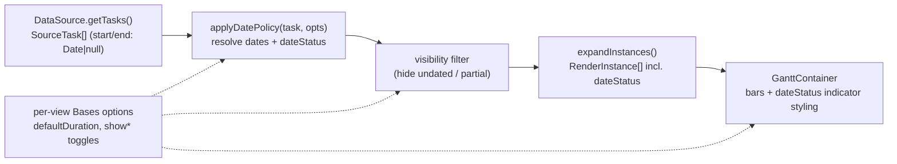

# feat: Configurable missing/partial-date handling for the Gantt view

## Summary

Restore and make configurable how the Gantt places tasks with incomplete dates, which the M1 view rewire regressed. A pure, source-agnostic **date-policy** transform resolves each task's display dates and a date-status flag (duration-anchored to the known date; today placeholder for dateless; swap for inverted), the controller applies it (and visibility filtering) so the view's `?? today` fallback is removed, per-view Bases options expose duration/visibility/indicator settings, and bar-level indicators are restored.

---

## Problem Frame

Tasks frequently carry only one date — usually a `due`. The pre-rewrite plugin inferred sensible placement; the M1 rewrite (U7) dropped it, leaving the view with `start = inst.start ?? today; end = inst.end ?? inst.start ?? today` ([src/bases/GanttContainer.svelte:98-99](src/bases/GanttContainer.svelte#L98-L99)), so a due-only task renders today→due instead of at its deadline, and the inferred/placeholder/swapped flags + the red "unscheduled" styling are gone. Confirmed in manual testing of a real due-only TaskNotes note. The prior intent is captured in the origin (see origin: [docs/brainstorms/2026-06-17-gantt-missing-date-handling-requirements.md](docs/brainstorms/2026-06-17-gantt-missing-date-handling-requirements.md)); the old logic survives, unused, in [src/bases/services/PropertyMappingService.ts](src/bases/services/PropertyMappingService.ts) as reference.

---

## Requirements

Carried from the origin (paraphrased for conciseness) for traceability.

### Date placement
- R1. Both start + due → bar spans start → due.
- R2. Only due → bar **ends** on the due date, length `defaultDuration` (precedes the deadline).
- R3. Only start → bar **starts** on the start date, length `defaultDuration`.
- R4. Neither → placeholder bar at today (length `defaultDuration`), classified placeholder.
- R5. Inverted (start > due) → dates swapped, classified swapped.
- R6. `defaultDuration` defaults to 1 day (→ single-day bars for R2/R3), configurable per view.

### Visibility
- R7. By default every task renders regardless of date completeness — never silently excluded for missing dates.
- R8. A per-view toggle hides undated tasks (R4); default shown.
- R9. A per-view toggle hides partial-date tasks (R2/R3); default shown.

### Indicators
- R10. Inferred / placeholder / swapped tasks carry a **bar-level** visual indicator (restoring the prior "unscheduled" styling), on the bar — not in the grid name cell.
- R11. A per-view toggle controls indicator visibility; default on.

### Configuration & architecture
- R12. All options are per-view Gantt Bases view options (alongside the date-property / arrow-mode options); no plugin settings tab.
- R13. The date policy is applied in a single source-agnostic transform between the data source and the view; the view applies no missing-date fallback; Bases and TaskNotes get identical handling.

---

## Key Technical Decisions

- **Date policy is a pure, source-agnostic transform.** A standalone function maps a raw `SourceTask` (`start`/`end` as `Date | null`) + policy options → resolved `{ start: Date, end: Date, dateStatus }`. It runs in the controller's snapshot build, *before* instance expansion, so both `BasesSource` and `TaskNotesSource` get identical handling and `GanttContainer` stops resolving dates. Reuses the case logic in the unused `PropertyMappingService.transformEntry` as reference, adapted to the duration-anchored model.

- **Duration-anchored placement (the model).** `defaultDuration` (`D`, in days) anchors partial dates to the known date:

  | start | due | resolved bar | `dateStatus` |
  |-------|-----|--------------|--------------|
  | set | set, `start ≤ due` | `[start, due]` | `complete` |
  | set | set, `start > due` | `[due, start]` (swapped) | `swapped` |
  | — | set | `[due − (D−1) days, due]` | `inferred-start` |
  | set | — | `[start, start + (D−1) days]` | `inferred-end` |
  | — | — | `[today, today + (D−1) days]` | `placeholder` |

  `D = 1` collapses the partial/placeholder rows to single-day bars (the prior behavior). Day arithmetic (inclusive `D−1`, normalization to day boundaries) is directional — the implementer pins exact boundaries mirroring the existing `PropertyMappingService` day-normalization.

- **Inference is presentational only.** The policy computes how a bar is *drawn*; it never writes resolved dates back to the note. Persisting happens only via an explicit user edit on the write path (the separate write-back milestone), not as a render side effect.

- **Visibility filtering happens on source tasks, pre-expansion.** Hiding undated/partial tasks filters at the source-task level in the controller, so a hidden multi-parent task produces no instances at all (rather than filtering instances after expansion).

- **Per-view options, no settings tab.** New options join the Gantt view's existing `options()` set in `register.ts`, read via `config.get(...)` exactly like `dependencyArrowMode`.

- **Bar-level indicators via a custom SVAR task `type` (one indicator state).** The view styles the bar from the resolved `dateStatus`, gated on the indicator toggle — deliberately *not* the grid cell, sidestepping the deferred SVAR cell-component follow-up. **Mechanism (decided, not deferred to U4):** SVAR v2.3.0 renders each bar with a *fixed* attribute set and emits `class="wx-bar wx-<typeId>"` derived from `task.type` (verified in `node_modules/@svar-ui/svelte-gantt/src/components/chart/Bars.svelte`); it does **not** reflect `custom`/arbitrary `cssClass` fields, and the legacy `.wx-bar[data-unscheduled]` CSS in `GanttContainer` is **dead** (nothing ever set that attribute). So the indicator is implemented by assigning a custom `task.type` (e.g. `'datestatus-flagged'`) when `showDateIndicators` and `dateStatus !== 'complete'`, registering it in the `<Gantt>` `taskTypes` prop, and styling `:global(.wx-bar.wx-datestatus-flagged)`. **One visual state for all non-`complete` values** (placeholder/inferred-start/inferred-end/swapped share it) — origin R10 asks only to distinguish "not fully dated" from complete; the five `dateStatus` enum values remain in the policy for future differentiation but collapse to a single indicator class here. Note the interaction with the existing `type: isParent ? 'summary' : 'task'` assignment (a bar is either a summary or a flagged leaf — flagging never overrides summary) and target current SVAR bar internals (`.wx-content`, `.wx-progress-percent`), not the legacy `.wx-bar-label`/`.wx-bar-progress` names.

---

## High-Level Technical Design

Where the policy sits in the existing read-only flow (the new step is `applyDatePolicy` + filter):

---

## Implementation Units

### U1. Pure date-policy transform

- **Goal:** A standalone pure function that resolves a raw task's display dates + `dateStatus` per the placement model.
- **Requirements:** R1, R2, R3, R4, R5, R6
- **Dependencies:** none
- **Files:** create `src/controller/datePolicy.ts`, `test/unit/datePolicy.test.ts`.
- **Approach:** `applyDatePolicy({ start, end }, { defaultDuration }) => { start: Date, end: Date, dateStatus }` implementing the KTD matrix. `dateStatus` ∈ `complete | inferred-start | inferred-end | placeholder | swapped`. **`applyDatePolicy` is the sole day-normalization point** — unlike the old plugin, the current controller/expansion path does *no* normalization (`BasesSource` passes raw extracted dates; `InstanceExpansion.makeInstance` copies them through verbatim). So normalize **every** row including `complete`/`swapped`, not just the inferred/placeholder rows — otherwise a both-dates bar and an inferred bar get inconsistent boundaries. Confirm SVAR's day-unit end interpretation (inclusive vs exclusive) so `D=1` truly renders a single-day bar. `today` is injected/parameterized (don't call `new Date()` inline — pass a clock or `now` arg) so tests are deterministic. Pure: no Obsidian, no I/O.
- **Patterns to follow:** the case structure in [src/bases/services/PropertyMappingService.ts](src/bases/services/PropertyMappingService.ts) `transformEntry` (day-normalization, partial-date branches) — adapted from single-day to duration-anchored.
- **Execution note:** Implement test-first; this is pure, edge-heavy logic.
- **Test scenarios:**
  - Covers AE1. only due, `D=1` → `[due, due]`, `inferred-start`.
  - Covers AE2. only start, `D=3` → start + 2 days, `inferred-end`.
  - only due, `D=3` → `[due−2, due]`, `inferred-start`.
  - Covers AE4. inverted (start > due) → swapped to `[due, start]`, `swapped`.
  - Covers AE3 (placement half). neither → `[today, today+(D−1)]`, `placeholder` (today injected).
  - both, `start ≤ due` → `[start, due]`, `complete`; both equal → single-day complete.
  - normalization: a `complete` (both-dates) task with non-midnight inputs comes out on normalized day boundaries — same boundary convention as the inferred/placeholder rows.
  - `D` boundary: `D=1` collapses all spans to single-day.
- **Verification:** every date-completeness case resolves to the matrix's dates + status, deterministically (no wall-clock dependence).

### U2. Apply the policy + visibility filter in the controller; carry `dateStatus` to instances

- **Goal:** Resolve dates and filter visibility in the controller snapshot so the view receives ready-to-render instances; remove the view's date fallback.
- **Requirements:** R7, R8, R9, R13
- **Dependencies:** U1
- **Files:** modify `src/controller/GanttController.ts` (snapshot build **and** the `instancesEqual` comparator), `src/controller/InstanceExpansion.ts` (`RenderInstance` gains `dateStatus`; carry resolved dates through), `src/bases/GanttContainer.svelte` (remove the `?? today` fallback at lines 98-99 — instances now carry resolved dates); `test/unit/GanttController.test.ts`.
- **Approach:** In `buildSnapshot`: `tasks = source.getTasks()` → map each through `applyDatePolicy(task, policyOpts)` → filter out undated/partial when their hide-toggle is set (filter on source tasks **before** `expandInstances`, so hidden multi-parent tasks produce no instances) → expand. `RenderInstance` carries the resolved `start`/`end` (non-null) + `dateStatus`.
  - **Idempotent-refresh comparator (load-bearing):** `instancesEqual` ([src/controller/GanttController.ts:446-457](src/controller/GanttController.ts#L446-L457)) compares a fixed field list and does *not* iterate keys, so it is blind to a new field. Add `dateStatus` to its comparison or status-only changes silently skip a refresh (stale indicator).
  - **Config channel (decided):** policy + visibility config reaches the controller via a new `policyConfig` field on `GanttControllerOptions`, stored on the instance and read at each `buildSnapshot` (not passed once — the controller recomputes on source events). U2 lands the field + defaults; U3 supplies the real per-view values. A config change flows through the existing `onDataUpdated` → unmount/remount path, so a fresh controller picks up new options — no separate live-update path needed.
  - **Interior-parent hiding (name + test the shadow path):** `expandInstances` treats the passed tasks as the *visible set*, and `visibleParentsOf` drops any parent path not present — so filtering out an undated **interior** parent reparents its visible children to the root. Decide and document: children of a hidden parent reparent to root (simplest, accept it) — and test that case explicitly so it isn't a silent hierarchy mutation.
- **Patterns to follow:** existing `GanttController` snapshot/expansion flow; `RenderInstance` shape in `src/controller/InstanceExpansion.ts`.
- **Test scenarios:**
  - Resolved dates: a due-only source task yields an instance whose dates match the policy (not today→due).
  - `dateStatus` propagates onto every `RenderInstance`.
  - Covers AE5. hide-undated on → dateless source tasks produce zero instances; partial + complete still present.
  - hide-partial on → partial-date tasks produce zero instances; complete + (visible) undated still present.
  - default (no hide) → all tasks present (R7).
  - multi-parent + hidden: a hidden multi-parent task contributes no instances at all.
  - comparator: two snapshots with identical resolved dates but different `dateStatus` compare **unequal** (status-only change triggers a refresh).
  - interior-parent hide: hide-undated on, an undated parent with dated children → the parent produces no instance and its children reparent to root (the documented behavior).
- **Verification:** the controller emits instances with resolved dates + `dateStatus`; visibility toggles add/remove whole tasks; `instancesEqual` reflects `dateStatus`; the view no longer references `?? today`.

### U3. Per-view Bases options + config plumbing

- **Goal:** Expose `defaultDuration`, the two visibility toggles, and the indicator toggle as per-view Gantt options, feeding the controller's policy/visibility config.
- **Requirements:** R6, R8, R9, R11, R12
- **Dependencies:** U1 (the config reader produces what the policy consumes; it does not depend on U2's controller wiring — U2 ships with defaults until U3 supplies real values).
- **Files:** modify `src/bases/register.ts` (Gantt view `options()` + a `buildDatePolicyConfig()`-style reader alongside `buildFieldMappings`/`getArrowMode`), pass the config into the `GanttController` via the `policyConfig` option (the field U2 added); `test/unit/*` for the config reader if it carries logic.
- **Approach:** Add options with user-facing labels (Bases renders the label; don't expose raw camelCase keys — confirm the label field against how `dependencyArrowMode` registers in `register.ts`):
  - `defaultDuration` (number, default 1) — "Default task duration (days)"
  - `showUndatedTasks` (boolean, default true) — "Show tasks with no dates"
  - `showPartialDateTasks` (boolean, default true) — "Show tasks with only one date"
  - `showDateIndicators` (boolean, default true) — "Show date-status indicators on bars"

  Read with `config.get(...)` and sensible fallbacks (mirror the `dependencyArrowMode` default pattern). Add to the **Gantt view only** (not the TaskList view). Pass the assembled config to the controller (which U2 consumes).
- **Patterns to follow:** the `dependencyArrowMode` option + `getArrowMode()` reader added in M1 ([src/bases/register.ts](src/bases/register.ts)).
- **Test scenarios:**
  - defaults: missing options → duration 1, all show toggles true.
  - `defaultDuration` non-default (e.g., 3) flows to the policy (a due-only task spans 3 days).
  - a hide toggle set in config flows to the controller filter.
  - `Test expectation: option registration itself is declarative; cover the config-reader defaults/coercion, not the Bases registration call.`
- **Verification:** each option appears in the Gantt view's Bases settings, persists, and changes rendering (duration/visibility/indicators) accordingly.

### U4. Bar-level date-status indicators

- **Goal:** Render non-`complete` (inferred/placeholder/swapped) tasks with one distinct bar treatment, gated on the indicator toggle.
- **Requirements:** R10, R11
- **Dependencies:** U2, U3
- **Files:** modify `src/bases/GanttContainer.svelte` (map `dateStatus` → a custom `task.type`; register the type via the `<Gantt>` `taskTypes` prop; add `:global(.wx-bar.wx-<typeId>)` CSS); `test/specs/*` covered in U5.
- **Approach:** Per the decided KTD mechanism — SVAR v2.3.0 emits `wx-<typeId>` on the bar from `task.type` and does **not** reflect `custom`/`cssClass` (the legacy `.wx-bar[data-unscheduled]` CSS is dead, never wired). In the `tasks` map, when `showDateIndicators` is on and `dateStatus !== 'complete'`, set `task.type = 'datestatus-flagged'` (a single type for all non-complete states — origin R10 only distinguishes "not fully dated" from complete); register it in the `taskTypes` array passed to `<Gantt>`; style `:global(.og-bases-gantt .wx-bar.wx-datestatus-flagged)`. Preserve the existing `type: isParent ? 'summary' : 'task'` rule — only leaf bars get flagged, summaries stay summaries (and remain non-draggable). Target current SVAR internals (`.wx-content`, `.wx-progress-percent`), not legacy `.wx-bar-label`/`.wx-bar-progress`. With `showDateIndicators` off, leave `task.type` at its default — no flagged class emitted.
- **Patterns to follow:** the existing `fonts={false}` Lucide-icon + `:global()` CSS approach in [src/bases/GanttContainer.svelte](src/bases/GanttContainer.svelte); SVAR's `taskTypes`/`ITaskType` usage in `node_modules/@svar-ui/svelte-gantt`.
- **Test scenarios:** (assertions land in the U5 E2E spec)
  - a placeholder (dateless) task's bar carries the `wx-datestatus-flagged` class; a complete task's does not.
  - `showDateIndicators` off → no flagged class on any bar.
- **Verification:** indicators visually distinguish inferred/placeholder/swapped bars when on, and are absent when toggled off; verified in the E2E render spec (U5).

### U5. E2E render spec for date handling

- **Goal:** Verify the policy end-to-end against real Obsidian: placement, placeholder, visibility toggle, indicator.
- **Requirements:** R2, R4, R7, R8, R10
- **Dependencies:** U4
- **Files:** modify `test/specs/gantt-readonly-render.e2e.ts` (or add a sibling spec) and extend `test/vaults/gantt-readonly/` fixtures (add a due-only note and a dateless note).
- **Approach:** Extend the hermetic fixture vault (it already self-provisions a temp copy) with a due-only task and **two** dateless tasks (two, not one — the "show everything" default piles dateless single-day bars at today; this surfaces the stacking, which is the intended default experience, with the hide-undated toggle as the escape hatch). Assert via bar positions/counts and the indicator class — reuse the existing `.og-bases-gantt .wx-bar` selectors and the `.wx-datestatus-flagged` class from U4; for placement, assert the due-only bar is positioned at/before the due date (not at today). Keep assertions resilient (counts + classes + relative position) per the M1 spec's selector discipline.
- **Patterns to follow:** the hermetic, self-provisioning render spec from M1 ([test/specs/gantt-readonly-render.e2e.ts](test/specs/gantt-readonly-render.e2e.ts)).
- **Execution note:** run via the WDIO + wdio-obsidian-service harness (boots real Obsidian); the spec must remain CI-safe (self-provision its vault, ignore `OBSIDIAN_TEST_VAULT`).
- **Test scenarios:**
  - Covers AE1. due-only task renders with its bar ending at the due date, not spanning from today.
  - Covers AE3. both dateless tasks render (placeholder) by default — not hidden — as single-day bars at today.
  - Covers AE5. with hide-undated on, the dateless tasks disappear while others remain.
  - indicator (`wx-datestatus-flagged`) present on a placeholder bar; absent on a complete bar; absent everywhere when `showDateIndicators` is off.
- **Verification:** the spec passes headlessly (locally + CI), proving placement, default visibility, the hide toggle, and the indicator.

---

## Scope Boundaries

### Deferred for later (origin)
- A tri-state per-end behavior beyond show/hide (the old `missingStartBehavior`/`missingEndBehavior` `"infer"|"show"|"hide"`); the duration-anchored model + two visibility toggles cover the need more simply.
- Global plugin settings / a settings tab.
- The multi-parent duplicate / has-dependencies **grid-cell** indicators (a separate M1 follow-up needing a SVAR cell component) — unrelated to the bar-level date indicators here.

### Outside this product's identity (origin)
- Writing inferred/placeholder dates back to notes. Inference is display-only; persisting dates happens only via an explicit user edit on the write-back path, never as a render side effect.

### Deferred to Follow-Up Work (plan-local)
- If U4 finds SVAR offers no clean per-bar styling hook, a richer indicator (e.g., a cell-component badge) is out of scope here and joins the existing cell-component follow-up.

---

## Risks & Dependencies

- **SVAR per-bar styling hook (U4) — resolved.** Investigation confirmed the only per-bar hook in SVAR v2.3.0 is a custom task `type` → `wx-<typeId>` class (`custom`/`cssClass` are not reflected; the legacy `.wx-bar[data-unscheduled]` CSS is dead). U4 uses that mechanism (one flagged type for all non-complete states). Residual risk is low: confirm the `taskTypes`/`type` interaction with the existing `summary` typing and that flagging a leaf doesn't disturb drag behavior.
- **Builds on merged M0+M1.** Depends on the `GanttController`/`InstanceExpansion`/sources architecture now on `main`. No external dependencies; read-only display only.
- **Independent of U8 write-back.** This is presentational; it neither needs nor blocks the write milestone, though both touch date flow — when write-back lands, dragging an inferred/placeholder bar writes real dates (that milestone's concern).
- **Determinism:** the policy must not call `new Date()` inline (today is injected) so unit tests and behavior are stable.

---

## Acceptance Examples

Carried from the origin; mapped to units in Test scenarios above.

- AE1. Due-only task (`due = 2026-08-17`, `D = 1`) → bar ends on 2026-08-17, one day long (not today→2026-08-17), flagged inferred. (U1, U5)
- AE2. Start-only task (`start = 2026-08-01`, `D = 3`) → bar starts 2026-08-01, three days, inferred. (U1)
- AE3. Dateless task → placeholder bar at today, flagged placeholder, not hidden by default. (U1, U2, U5)
- AE4. Inverted (`start = 2026-01-10`, `due = 2026-01-05`) → bar spans 2026-01-05→2026-01-10 (swapped), flagged swapped. (U1)
- AE5. Hide-undated toggle on → dateless tasks gone, partial + complete remain. (U2, U5)
- AE6. Inference does not mutate the note — no inferred start is written on render. (Honored by the presentational-only KTD; no write path is touched in this plan.)

---

## Sources / Research

- Origin requirements: [docs/brainstorms/2026-06-17-gantt-missing-date-handling-requirements.md](docs/brainstorms/2026-06-17-gantt-missing-date-handling-requirements.md).
- Reference inference logic (unused, kept): [src/bases/services/PropertyMappingService.ts](src/bases/services/PropertyMappingService.ts) `transformEntry`.
- The regression: [src/bases/GanttContainer.svelte:98-99](src/bases/GanttContainer.svelte#L98-L99).
- Architecture this builds on: [src/controller/GanttController.ts](src/controller/GanttController.ts), [src/controller/InstanceExpansion.ts](src/controller/InstanceExpansion.ts), [src/bases/register.ts](src/bases/register.ts) (the `dependencyArrowMode` per-view option pattern), and the M1 plan/origin ([docs/plans/2026-06-16-001-feat-tasknotes-companion-gantt-plan.md](docs/plans/2026-06-16-001-feat-tasknotes-companion-gantt-plan.md)).
- Recovered prior config design (option names as prior art): `project/archived/IMPLEMENTATION-PLAN-SVAR-Gantt.md`, `project/archived/Implementation Phase2-Plan.md`.
- SVAR v2.3.0 per-bar styling: to verify during U4 (see Risks).
</content>
