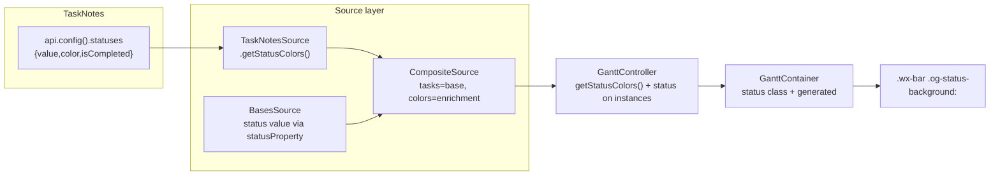

# feat: Color Gantt bars by TaskNotes status colors

## Summary

Color each Gantt bar with the **exact color the user configured for that task's status in TaskNotes**, instead of leaving bars uniformly styled. The status value is populated through the existing Bases field-mapping layer; the color palette is read from TaskNotes' own config through the source/enrichment layer (never the view); and each bar gets its status color via a generated stylesheet keyed to a per-status CSS class — coexisting with the existing date-status indicator.

Decisions confirmed with the user: **completed statuses get color only** (no extra treatment; `isCompleted` is still exposed for future use), and **colors refresh on remount** (read TaskNotes config at mount / on data update; no live config-event subscription).

---

## Problem Frame

The M1 "bases-scoped" strategy made the Base own the task set, but `SourceTask.status` is `null` from `BasesSource` (`src/datasource/BasesSource.ts:87`) and **nothing consumes status in rendering** — `RenderInstance` carries only `dateStatus`/`progress`, and `GanttContainer` reads `progress`, not `status`. So bars give no visual signal of workflow state. The user already color-codes statuses in TaskNotes (e.g. `11🟥Active = Now` → `#f8312f`, `41🟩Done = Recent` → `#00d26a`), and the TaskNotes API exposes that palette. Using it gives an exact, zero-config, no-clash result.

**Verified inputs (this session, do not re-derive):**
- TaskNotes API: `api.config()` → `getModelConfig()` returns `{ statuses: customStatuses }`; each entry is `{ value, label, color (hex), isCompleted }`, with `value` matching `task.status`. Confirmed against the installed plugin (apiVersion 1).
- SVAR bar class hook: `taskTypeCss` (`node_modules/@svar-ui/svelte-gantt/src/components/chart/Bars.svelte:348`) emits a **registered** custom task `type` id as a bare class on `.wx-bar` (`wx-bar wx-task <id>`), and a space-containing registered id yields multiple bare classes. `type` is single-valued; the date-status indicator (U4 of the prior plan) already uses type id `datestatus-flagged`. SVAR exposes no per-task inline `css`, so dynamic colors require a generated `<style>` block keyed by a per-status class.

---

## Requirements

- **R1.** Each bar whose task has a status with a TaskNotes-configured color renders in that exact color.
- **R2.** The status color palette is sourced from TaskNotes through the data-source layer; the Svelte view does not call the TaskNotes API directly (companion architecture — `see related` plan).
- **R3.** The status value is populated in bases-scoped mode from a per-view **Status Property** mapping (so it works without TaskNotes owning the set).
- **R4.** Status coloring **coexists** with the existing date-status indicator on the same bar (both visible; neither suppresses the other).
- **R5.** Graceful degradation: when TaskNotes is absent or its config is unavailable, no status classes/colors are applied and bars render exactly as today (no errors).
- **R6.** Status values containing emoji/symbols/spaces (e.g. `11🟥Active = Now`) produce a valid, unique CSS class; color lookup keys off the raw value.
- **R7.** `isCompleted` is carried through (exposed) but, per decision, drives **no** extra visual treatment beyond color in this plan.

---

## Key Technical Decisions

- **KTD1 — Color config lives in the source layer via a new optional `DataSource.getStatusColors()`.** `TaskNotesSource` implements it via `api.config().statuses` (guarded; returns `[]` on any failure). `CompositeSource` delegates to its enrichment; `BasesSource` returns `[]`. Rationale: keeps TaskNotes coupling out of the view (R2), mirrors the existing capability/deps delegation in `CompositeSource`. Optional method (like `subscribe`) — feature-detected, contract stays backward-compatible.
- **KTD2 — Status value flows through the existing mapping pipeline.** Add `statusProperty` to `FieldMappings`; `BasesSource.toSourceTask` populates `status` from it. `TaskNotesSource` already sets `status` from `task.status`. Both yield the same `value` string TaskNotes keys colors on (R3).
- **KTD3 — Bar coloring = per-status CSS class (via SVAR `type` multi-class composition) + a generated `<style>` block.** The view composes each leaf bar's `type` id from `[datestatus-flagged? , og-status-<slug>?]` (space-joined, registered in `taskTypes`), so the status class coexists with the date flag (R4). A generated, deduped `<style>` scoped under `.og-bases-gantt` maps each present `og-status-<slug>` → `background-color: <hex>`. Rationale: SVAR has no per-task inline css; `type` is the only class hook; composition is the same mechanism the date-status indicator already proves.
- **KTD4 — Slug sanitization is a pure, tested helper.** A new `src/bases/statusColor.ts` (dependency-free, mirrors `datePolicyConfig.ts`) provides `statusSlug(value)` (CSS-safe, collision-resistant via a short stable hash suffix) and `buildStatusStyleRules(instances, colorMap)` (returns deduped CSS text for only the statuses present). Color lookup uses the **raw** value; the slug is only the class token (R6).
- **KTD5 — Reactivity: read on (re)mount.** The controller reads `getStatusColors()` once per snapshot build; the view regenerates the `<style>` on mount/remount. A config change reflects after the normal data-update remount — no new event subscription (confirmed decision).
- **KTD6 — Completed = color only.** `isCompleted` is carried on the color entry but applied as nothing beyond color in this plan (confirmed decision); leaving the hook for a future unit.

---

## High-Level Technical Design

Data flow (status value vs. status color travel different paths, meet in the view):

Prose is authoritative where this diagram is ambiguous.

---

## Implementation Units

### U1. Status property mapping (populate `SourceTask.status`)

- **Goal:** Let a Base column drive each task's `status` value so it's no longer `null` in bases-scoped mode.
- **Requirements:** R3, R6.
- **Dependencies:** none.
- **Files:** `src/bases/types/field-mapping.ts` (add `statusProperty?: string`), `src/datasource/BasesSource.ts` (populate `status`), `src/bases/services/BasesDataAdapter.ts` (add `extractStatus` returning `string | null`, no basename fallback — reuse `extractValue` + string coercion), `src/bases/register.ts` (`buildFieldMappings` reads `statusProperty`; add a "Status Property" `type: 'property'` view option next to the existing ones), test files: `test/unit/BasesDataAdapter.test.ts`, `test/unit/BasesSource.test.ts`.
- **Approach:** Mirror the existing `progressProperty`/`parentProperty` plumbing exactly. Default `statusProperty` empty (→ `status: null`, unchanged behavior). Status is a raw string; do not format.
- **Patterns to follow:** `extractProgress`/`extractText` in `BasesDataAdapter.ts`; the property-option block in `register.ts` (the `Parent Property`/`Progress Property` entries).
- **Test scenarios:**
  - `extractStatus` returns the raw string when the mapped property has a value; returns `null` when empty/unmapped (no basename fallback). Covers R3.
  - `BasesSource.toSourceTask` sets `status` from `mappings.statusProperty`; `status` is `null` when `statusProperty` is empty.
- **Verification:** A Base with a Status Property mapped yields `SourceTask.status` equal to the frontmatter value.

### U2. Carry `status` onto `RenderInstance`

- **Goal:** Make the resolved status available to the view per render instance.
- **Requirements:** R1.
- **Dependencies:** U1.
- **Files:** `src/controller/InstanceExpansion.ts` (add `status: string | null` to `RenderInstance`; set it in `makeInstance` from the source task), test file: `test/unit/InstanceExpansion.test.ts`.
- **Approach:** `ExpandableTask` already spreads the full `SourceTask` (so `status` is present); add `status` to the `RenderInstance` interface and copy it in `makeInstance`. All duplicated instances of a multi-parent task share the same status (single source of truth).
- **Patterns to follow:** how `progress`/`text`/`dateStatus` are carried in `makeInstance`.
- **Test scenarios:**
  - A source task with `status: 'X'` expands to instance(s) with `status: 'X'`; multi-parent duplicates all carry the same status.
  - A `null`-status task yields `status: null` on its instance.
- **Verification:** `controller.getInstances()` exposes `status` on each instance.

### U3. `DataSource.getStatusColors()` across the source layer

- **Goal:** Surface TaskNotes' configured status palette through the data-source abstraction.
- **Requirements:** R2, R5, R7.
- **Dependencies:** none (parallelizable with U1/U2).
- **Files:** `src/datasource/types.ts` (add `StatusColor` type `{ value: string; color: string; isCompleted: boolean }` and an optional `getStatusColors?(): Promise<StatusColor[]>` on `DataSource`), `src/datasource/TaskNotesSource.ts` (implement via `api.config().statuses`; extend the local `TaskNotesApi` typing with `config?()`), `src/datasource/CompositeSource.ts` (delegate to enrichment, `[]` when absent), `src/datasource/BasesSource.ts` (no implementation needed — optional method absent ⇒ treated as `[]`), test files: `test/unit/TaskNotesSource.test.ts`, `test/unit/CompositeSource.test.ts`.
- **Approach:** Guard every cross-plugin call (try/catch → `[]`), same discipline as the rest of `TaskNotesSource`. Map each `customStatuses` entry to `StatusColor`. `CompositeSource.getStatusColors` returns `this.enrichment?.getStatusColors?.() ?? []`.
- **Patterns to follow:** the guarded `getTasks`/`getDependencies` and `supportsWrite` in `TaskNotesSource`; the delegation style in `CompositeSource`.
- **Test scenarios:**
  - `TaskNotesSource.getStatusColors` maps `api.config().statuses` → `StatusColor[]`; returns `[]` when `config` is missing, throws, or returns an unexpected shape. Covers R5.
  - `CompositeSource.getStatusColors` delegates to the enrichment; returns `[]` when enrichment is null or lacks the method. Covers R2/R5.
- **Verification:** With a fake TaskNotes api exposing `config().statuses`, the composite returns the mapped colors; with no enrichment, `[]`.

### U4. Controller exposes the status palette

- **Goal:** Give the view a source-agnostic way to read the active source's status colors.
- **Requirements:** R2.
- **Dependencies:** U3.
- **Files:** `src/controller/GanttController.ts` (add `getStatusColors(): Promise<StatusColor[]>` delegating to the active source, `[]` before init / when unsupported), test file: `test/unit/GanttController.test.ts`.
- **Approach:** Thin pass-through to `activeSource?.getStatusColors?.()`. Read at snapshot/mount time (KTD5); no caching beyond the active source.
- **Test scenarios:**
  - Returns the active source's colors when supported; `[]` when the source lacks the method or before init.
  - In bases-scoped mode with a TaskNotes enrichment, returns the enrichment's colors (composite path).
- **Verification:** `controller.getStatusColors()` returns the expected palette for each strategy.

### U5. View applies status color + class

- **Goal:** Render each bar in its status color, coexisting with the date-status flag.
- **Requirements:** R1, R4, R6, R7.
- **Dependencies:** U2, U4.
- **Files:** `src/bases/statusColor.ts` (new, pure: `statusSlug(value)`, `buildStatusStyleRules(instances, colorMap)`), `src/bases/GanttContainer.svelte` (compose the bar `type` id to include `og-status-<slug>` alongside `datestatus-flagged`; register the composed ids in `taskTypes`; read `getStatusColors()` and inject a generated `<style>` scoped under `.og-bases-gantt`; pass `app`/controller through as already wired), test file: `test/unit/statusColor.test.ts`.
- **Approach:** Build the per-status color map from the controller once at mount. For each leaf instance, compute its class set `[datestatus-flagged?, og-status-<slug>?]`, join into the registered `type` id (parents stay `summary`). Generate one CSS rule per **distinct** status present (dedup), scoped to avoid leaking. Color lookup uses the raw `inst.status`; the slug is only the class token. Completed = color only (KTD6).
- **Patterns to follow:** the `DATE_STATUS_TYPE`/`taskTypes` registration and the `flagged`→`type` logic already in `GanttContainer.svelte`; the pure-module style of `datePolicyConfig.ts`.
- **Test scenarios** (unit-test the pure helper; the Svelte wiring is covered by U6 E2E):
  - `statusSlug` produces CSS-safe, stable, collision-resistant tokens for emoji/space/symbol values (e.g. two distinct raw values never collide). Covers R6.
  - `buildStatusStyleRules` emits one deduped `background-color` rule per present status, keyed by slug, and omits statuses with no color / not present.
  - Test expectation for the `.svelte` edits: none at unit level — covered by U6 E2E (Svelte view wiring).
- **Verification:** A bar with a colored status shows that background color and carries `og-status-<slug>`; a partial-date bar with a status shows both `datestatus-flagged` and the status color.

### U6. E2E: status color on a real bar

- **Goal:** Prove the full chain renders status color in real Obsidian, coexisting with the date flag and degrading gracefully.
- **Requirements:** R1, R4, R5.
- **Dependencies:** U5.
- **Files:** `test/specs/gantt-status-coloring.e2e.ts` (new), `test/vaults/` fixture additions (a vault with a Status Property mapped and a couple of statuses; the harness self-provisions per the existing E2E pattern). Reuse the existing E2E setup.
- **Approach:** Since the existing E2E fixture vaults have no TaskNotes plugin, supply the status colors via a fixture mechanism (mapped status values + a stubbed/seeded color source) OR assert the class-only behavior when colors are absent (graceful path, R5) and the injected-style behavior via a unit-level DOM check where feasible. Resolve the exact fixture approach at implementation time (see Deferred).
- **Test scenarios:**
  - A task with a mapped status renders a bar carrying `og-status-<slug>`. Covers R1.
  - A partial-date task with a status carries **both** `datestatus-flagged` and `og-status-<slug>`. Covers R4.
  - With no status colors available, bars carry no `og-status-*` class and render unchanged. Covers R5.
- **Verification:** `npm run e2e` green including the new spec; existing specs unaffected.

---

## Scope Boundaries

**In scope:** status value mapping, source-layer color exposure, per-bar status coloring coexisting with the date flag, graceful no-TaskNotes degradation.

**Deferred to Follow-Up Work:**
- Live config-change reactivity (event subscription) — out per KTD5.
- Completed-status visual treatment beyond color (progress fill, muted/checkmark) — `isCompleted` is exposed but unused per KTD6.
- Status-driven progress derivation, status legend/filter UI, priority coloring.
- Committing a Windows-correct `package-lock.json` for the `@swc`/rollup optional-dep gap (tracked in `docs/solutions/developer-experience/windows-build-and-e2e-environment-setup.md`).

**Out of scope:** changing the date-policy engine, the write path (U8), or the source-selection strategy.

---

## Implementation-Time Unknowns (Deferred)

- Exact `taskTypes` registration shape for composed ids (whether to register each distinct combo or each atomic class) — resolve against SVAR's `taskTypeCss` exact matching during U5.
- The U6 fixture mechanism for supplying status colors without a real TaskNotes plugin in the E2E vault (seed a fake color source vs. assert class-only + graceful path). Resolve in U6.
- Final `statusSlug` hashing scheme (length/algorithm) — pick a short stable hash at U5.

---

## Risks & Dependencies

- **SVAR `taskTypeCss` is an internal (non-public-API) reliance.** Same risk the shipped date-status indicator already takes; mitigated by the U6 E2E asserting the emitted class. If SVAR changes class assembly, both features move together.
- **TaskNotes `api.config()` shape may drift across versions.** Guarded → `[]` on any mismatch (R5); bars degrade to uncolored, never error.
- **Status value ↔ TaskNotes `value` matching** depends on the user mapping Status Property to the same frontmatter TaskNotes writes. Documented in the option help text; mismatch simply yields no color (no error).
- **Style-injection scope.** Generated rules must be scoped under `.og-bases-gantt` and deduped to avoid leaking into other views or unbounded growth.

---

## Verification (end-to-end)

1. `npm test` — all unit suites green (env: fnm Node 20 + `NODE_EXTRA_CA_CERTS`, plus the `@swc/core-win32-x64-msvc` shim per the dev-run-config memory).
2. `npm run typecheck` — 0/0.
3. `npm run lint` — 0 errors.
4. `npm run build` — clean; deploys to the test vault.
5. `npm run e2e` (override `OBSIDIAN_TEST_VAULT` to the local copy) — new status-coloring spec + existing specs green.
6. Manual: in the test vault, map **Status Property** to the status frontmatter, reload → bars render in their TaskNotes colors; a partial-date task shows both the date flag and its status color; disabling TaskNotes leaves bars uncolored without errors.

---

## Notes

- Branch off current `main` (`9b64563`). No Claude attribution on commits/PRs (user preference). Keep TaskNotes access in the source layer per the 2026-06-16 companion architecture.
