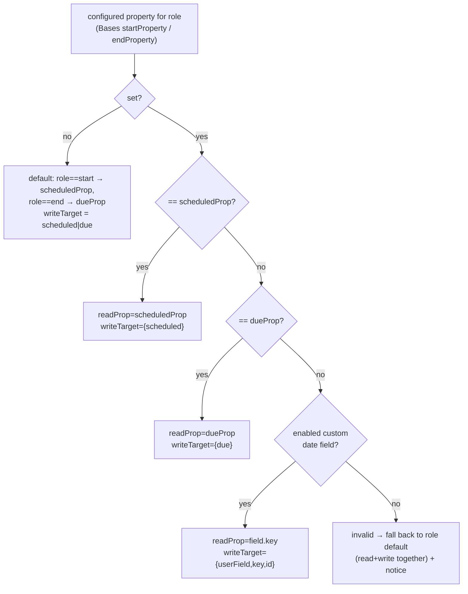

# feat: Map Gantt start/end dates to any TaskNotes field

## Summary

The bases-scoped Gantt persists drag/resize edits through TaskNotes, but the write path hardcodes `start → scheduled` and `end → due` while the Base *reads* dates from its mapped frontmatter properties. When the configured start property is not TaskNotes' `scheduled` property, start-date drags write to the wrong field and silently don't stick (GitHub issue #70). This plan makes the write **resolve to the same field the Base reads**, defaulting to TaskNotes' own configured `scheduled`/`due` properties and allowing the Bases view config to override start and/or end to an **enabled TaskNotes custom field of type `date`** — validated, with a visible fallback when a mapping is invalid. Read path is unchanged (Bases already reads frontmatter); TaskNotes field introspection stays in the source layer.

This supersedes the minimal #70 patch and completes the date side of U8 (write-back) from the companion plan. The editor-modal Save/Delete pass and progress persistence remain out of scope.

---

## Problem Frame

`src/datasource/TaskNotesSource.ts` `mutate()` maps `patch.start → updates.scheduled` and `patch.end → updates.due` (TaskNotes-canonical names). In `'bases-scoped'` mode the bar's dates are read by `src/bases/services/BasesDataAdapter.ts` from the Base's `startProperty`/`endProperty` frontmatter fields. The two diverge whenever `startProperty != scheduled` (or `endProperty != due`): the read shows one field, the write lands in another, and the edit appears to do nothing.

The user's vault is the concrete case: their `scheduled` property maps to TaskNotes Scheduled (canonical), and their `start` property is a TaskNotes **custom date field** defined in TaskNotes settings. They want the Gantt bar's start driven by that custom field, with drags persisting to it — and, by default (no override), start/end to follow TaskNotes' configured `scheduled`/`due`.

The round-trip must be **guaranteed symmetric**, not coincidental: whatever frontmatter property the Gantt reads a date from is exactly the property its write targets.

---

## Requirements

- **R-A. Default mapping.** With no Bases override, Gantt start ← TaskNotes' configured `scheduled` property, end ← its `due` property. Writes use the canonical `tasks.update({scheduled|due})`, which TaskNotes routes to those property names.
- **R-B. Override to custom date fields.** The Bases view config may override start and/or end to a TaskNotes custom user field, but only one that is **enabled** in TaskNotes settings **and** of **type `date`**. Writes to such a field go through `tasks.update({ userFields: … })`.
- **R-C. Reject invalid targets, visibly.** Any start/end target that is not (the scheduled property, the due property, or an enabled custom date field) is rejected — never silently written to a default that diverges from the read. (See KTD "Fallback is symmetric".)
- **R-D. Round-trip symmetry.** The property the chart reads a date from equals the property its write targets, for every start/end edit.
- **R-E. Source-layer encapsulation (companion R6).** TaskNotes field-config introspection and writes live in the source layer; the Svelte view never calls the TaskNotes API directly. Writes go through the TaskNotes API, never direct frontmatter edits.
- **R-F. Graceful degradation.** When TaskNotes is absent or `model.config()` is unavailable, the chart still renders read-only over Bases (no field-config, no writes) without throwing.
- **#70.** Dragging a bar's start date persists to the correct field; due continues to work.

---

## Key Technical Decisions

- **Resolve each role (start/end) to a `DateWriteTarget`; the property is the picker, the target is the mechanism.** The Bases `startProperty`/`endProperty` (a frontmatter property name) is resolved against TaskNotes' field config into one of: `{kind:'scheduled'}`, `{kind:'due'}`, or `{kind:'userField', key, id}`. The write path applies the target via `tasks.update` (canonical `scheduled`/`due`, or `userFields`). Rationale: keeps the existing Bases mapping model as the single picker while making the write correct; avoids a parallel mapping concept.

- **Field config is read in the source layer; resolution is a pure helper.** `TaskNotesSource.getFieldConfig()` reads `api.model.config()` once and returns `{ scheduledProp, dueProp, dateFields: [{key,id,displayName}] }` (custom fields filtered to `enabled && type==='date'`). A pure `resolveDateMapping(configuredProp, role, fieldConfig)` (new `src/datasource/dateFieldMapping.ts`) maps a property name → `{ readProp, writeTarget, invalid }`. The controller calls `getFieldConfig()` at selection time and uses the resolver; the source applies targets. Rationale: TaskNotes access stays in the source (companion architecture R6); the resolution is pure and heavily testable; the Svelte view stays API-free.

- **The resolved `readProp` drives the Base read too — symmetry by construction (R-D).** The effective start/end property fed to `BasesSource` via `FieldMappings` is the resolver's `readProp`, and the write uses the resolver's `writeTarget` for the *same* input property. Because a valid target is exactly one TaskNotes can write, read and write can never diverge for a valid mapping.

- **Fallback is symmetric, with a notice (resolves the stale-mapping question).** If a configured override is invalid (field disabled, retyped off `date`, or unknown), the resolver returns `invalid:true` and **both** `readProp` and `writeTarget` fall back to the role default (`scheduledProp`/`dueProp`). Because read and write fall back together, the chart stays coherent (it shows and edits the default field), and the view surfaces a one-line notice naming the invalid mapping. Rationale: the rejected alternative — falling back only the write — recreates exactly the #70 divergence.

- **Override selection is a constrained dropdown sourced from field config.** The Bases Start/End property view-options present only valid choices: the scheduled property, the due property, and enabled custom date fields (labeled by `displayName`). Rationale: a user can't configure an invalid date target through the UI. **Risk-gated** — see Risks: if the Bases `options()` API cannot source choices dynamically from async TaskNotes config, degrade to the documented free-text-property + validation + fallback-notice path (still correct per R-C/R-D, just less guided); U4 spikes this first.

- **`userFields` write key (id vs key) is pinned by test, and the target carries both.** TaskNotes internals key user-field values by `key` in some consumers and `id` in others. The `writeTarget` carries both; U2's first test sends a write and asserts which key TaskNotes persists, then the source uses that. Rationale: don't guess an external API shape — the lesson from `docs/solutions/integration-issues/tasknotes-status-palette-wrong-api-path.md`.

- **Dates serialize as `yyyy-MM-dd` (local) for all targets.** Reuse the U8a `toYmd` local-calendar formatting for canonical and custom date fields alike; U2 confirms custom date fields accept the same string. Rationale: consistency with the shipped drag path; avoids TZ day-shift.

---

## High-Level Technical Design

Date-field resolution (per role, computed at source-selection time and on config change):



Round-trip (drag → persist), unchanged transport from U8a, corrected target:

```mermaid
sequenceDiagram
  participant V as SVAR view
  participant C as GanttController
  participant T as TaskNotesSource
  participant TN as TaskNotes API
  V->>C: mutate(instanceId, {start,end} Dates)
  Note over C: resolve instance→path;<br/>map start/end → DateWriteTarget via fieldConfig
  C->>T: mutate(path, {dateWrites:[{target,value}], …}, ctx:self)
  T->>TN: tasks.update(path, {scheduled|due | userFields:{key:val}}, ctx)
  Note over C,V: read uses the SAME resolved property → bar reflects the persisted value
```

---

## Implementation Units

### U1. TaskNotes field-config reader

- **Goal:** Expose TaskNotes' configured `scheduled`/`due` property names and its enabled custom date fields to the rest of the app, in the source layer.
- **Requirements:** R-A, R-B, R-E, R-F
- **Dependencies:** none (extends shipped `TaskNotesSource`)
- **Files:** `src/datasource/TaskNotesSource.ts`, `src/datasource/CompositeSource.ts`, `src/datasource/types.ts` (add a `FieldConfig` type + optional `getFieldConfig?()` on `DataSource`), `test/unit/TaskNotesSource.test.ts`, `test/unit/CompositeSource.test.ts`.
- **Approach:** Add `getFieldConfig(): Promise<FieldConfig | null>` reading `api.model.config()` → `{ scheduledProp: fieldMapping.scheduled, dueProp: fieldMapping.due, dateFields: userFields.filter(f => f.enabled && f.type === 'date').map(f => ({ key, id, displayName })) }`. Guard everything (missing config/`userFields`/throw → `null`). `CompositeSource.getFieldConfig()` delegates to the enrichment (or `null`). Add the optional method to the `DataSource` interface and the `FieldConfig` type to `types.ts`. Confirm against the installed TaskNotes 4.11.0 `main.js` whether `userFields` lives under `model.config()` (verified this session) vs `getFieldDefinitions()` — prefer `model.config().userFields`; note the trade-off if it proves thin.
- **Patterns to follow:** the guarded `getStatusColors()` accessor already in `TaskNotesSource.ts` (same `api.model.config()` source, same try/catch-to-`[]`/`null` discipline).
- **Test scenarios:**
  - Happy path: a mocked `api.model.config()` with `fieldMapping {scheduled:'scheduled',due:'due'}` and `userFields [{enabled:true,type:'date',key:'start',id:'uf_start',displayName:'Start'}, {enabled:true,type:'text',key:'notes'}, {enabled:false,type:'date',key:'old'}]` → `getFieldConfig()` returns `scheduledProp='scheduled'`, `dueProp='due'`, `dateFields=[{key:'start',id:'uf_start',displayName:'Start'}]` (text and disabled dropped).
  - Edge: `userFields` absent / not an array → `dateFields: []`; `fieldMapping` missing scheduled/due → those props `undefined`.
  - Failure: `model.config()` throws / api absent → `getFieldConfig()` returns `null` (no throw).
  - Composite: delegates to enrichment; returns `null` when enrichment is absent.
- **Verification:** With a mocked TaskNotes api, the reader returns the configured scheduled/due property names and only enabled date custom fields; absent/broken config yields `null`.

### U2. DateWriteTarget model + targeted write in TaskNotesSource

- **Goal:** Let the write path persist a date to a *specified* target — canonical `scheduled`/`due` or a custom `userFields` key — instead of the hardcoded start→scheduled/end→due.
- **Requirements:** R-B, R-D, R-E, #70
- **Dependencies:** U1
- **Files:** `src/datasource/types.ts` (add `DateWriteTarget` + extend the write patch to carry `dateWrites`), `src/datasource/TaskNotesSource.ts` (apply targets in `mutate`), `src/datasource/CompositeSource.ts` (passthrough), `test/unit/TaskNotesSource.test.ts`.
- **Approach:** Define `DateWriteTarget = {kind:'scheduled'} | {kind:'due'} | {kind:'userField', key, id}`. Extend the patch the source receives with `dateWrites?: Array<{ target: DateWriteTarget; value: Date | null }>` (keep `text`/`status`; drop the implicit start→scheduled/end→due mapping from the source — that resolution moves to the controller in U3). In `mutate`, fold each `dateWrite` into the `tasks.update` payload: `scheduled`/`due` → top-level `{scheduled|due: ymd|null}`; `userField` → `{ userFields: { [k]: ymd|null } }`. **Pin id-vs-key first:** the unit's opening test sends a `userField` write and asserts the exact `tasks.update` payload TaskNotes expects (key vs id); set the source to use the confirmed one (carry both on the target regardless). Reuse `toYmd`. Propagate failures (no swallow), per U8a.
- **Execution note:** Start with the failing id-vs-key discriminator test against the mocked api, then the target-application contract.
- **Patterns to follow:** existing `TaskNotesSource.mutate` (atomic single `tasks.update`, context passthrough, error propagation); `toYmd` helper.
- **Test scenarios:**
  - Pin: a `userField` date write produces `tasks.update(path, { userFields: { <confirmed-key>: '2026-06-17' } }, ctx)` — exactly one call, correct key.
  - Canonical: a `{kind:'scheduled'}` write → `{ scheduled: 'yyyy-MM-dd' }`; `{kind:'due'}` → `{ due: … }`.
  - Mixed: `dateWrites` for start (userField) + end (due) in one call → a single `tasks.update` merging `{ due, userFields:{…} }`.
  - Clear: a `value: null` write forwards `null` to clear the field.
  - Failure: rejected `tasks.update` propagates (caller reverts).
  - Composite: `mutate` with `dateWrites` delegates unchanged to the enrichment.
- **Verification:** A write to a custom date field lands in `userFields` with the confirmed key; canonical writes unchanged; one atomic update per mutate.

### U3. Resolver + controller integration

- **Goal:** Resolve each role's configured property to `{readProp, writeTarget, invalid}` and have the controller (a) expose effective read properties and (b) translate a `{start,end}` drag patch into targeted `dateWrites`.
- **Requirements:** R-A, R-B, R-C, R-D, R-F
- **Dependencies:** U1, U2
- **Files:** `src/datasource/dateFieldMapping.ts` (new pure helper) + `test/unit/dateFieldMapping.test.ts`; `src/controller/GanttController.ts` + `test/unit/GanttController.write.test.ts`; `src/datasource/index.ts` (barrel).
- **Approach:** Pure `resolveDateMapping(configuredProp: string | undefined, role: 'start'|'end', cfg: FieldConfig): { readProp: string; writeTarget: DateWriteTarget; invalid: boolean }` implementing the HTD flow (default when unset; scheduled/due match; enabled-custom-date-field match by `key`; else `invalid` → role default for *both* readProp and writeTarget). In `GanttController`: at source selection (`bases-scoped`), fetch `getFieldConfig()` from the active source; resolve start/end from the Base mappings; store the two `writeTarget`s and expose the resolved `readProp`s + any `invalid` flags (for register to build `FieldMappings` and for the view's notice). `controller.mutate(instanceId, {start?,end?})` translates present dates into `dateWrites` using the stored targets, then calls `source.mutate(path, {dateWrites, …}, ctx)`. When `getFieldConfig()` is `null` (no TaskNotes), mutate stays unavailable (read-only) — capability gate already covers this (R-F).
- **Patterns to follow:** existing controller resolution + self-context/echo machinery in `GanttController.mutate` (U8a); pure-helper + table-test style of `src/bases/statusColor.ts`.
- **Test scenarios (resolver):**
  - Unset start → `readProp=scheduledProp`, `writeTarget={scheduled}`, `invalid=false`; unset end → due.
  - Configured == scheduledProp → `{scheduled}`; == dueProp → `{due}`.
  - Configured == enabled custom date field key → `{userField,key,id}`, `readProp=key`.
  - Configured == a disabled / non-date / unknown field → `invalid=true`, `readProp` and `writeTarget` both the role default (symmetry).
  - `FieldConfig` null/absent → caller treats as read-only (resolver only runs with a config).
- **Test scenarios (controller):**
  - Covers #70. Start configured to a custom date field → `mutate(instanceId,{start})` produces a `dateWrites:[{target:userField,…}]` write to the source (not `scheduled`).
  - Default config → start drag writes `{scheduled}`, end writes `{due}`.
  - A `{start,end}` drag → one source `mutate` with both `dateWrites`.
  - Invalid override → controller resolves to default target and exposes the `invalid` flag; the write still targets the default (matching the defaulted read).
  - Read-only (no fieldConfig) → mutate rejects, no write (existing capability gate).
- **Verification:** Given a field config and a configured property, the controller writes the date to the resolved target; read property and write target always agree; invalid overrides degrade to the default symmetrically.

### U4. Bases config wiring — effective read mapping, constrained dropdown, notice

- **Goal:** Feed the resolved read properties into `BasesSource`, present start/end as a constrained dropdown of valid date targets, default to scheduled/due, and surface the invalid-mapping notice.
- **Requirements:** R-A, R-B, R-C, R-D
- **Dependencies:** U3
- **Files:** `src/bases/register.ts` (`mountGantt`, `buildFieldMappings`, the `options()` registration), `src/bases/GanttContainer.svelte` (render the invalid-mapping notice), `test/unit/` coverage for the field-mapping/default logic in register where unit-testable.
- **Approach:** In `mountGantt`, obtain the resolved start/end `readProp`/`invalid` from the controller (or compute via the resolver with `controller.getFieldConfig()`), and build the `FieldMappings` passed to `BasesSource` using the effective `readProp` (so default start→`scheduledProp`, end→`dueProp`; override→custom key). Replace the hardcoded `startProperty`/`endProperty` defaults in `buildFieldMappings` with config-driven defaults. **Constrained dropdown:** populate the Start/End property view-options from the field config (scheduled, due, enabled custom date fields by `displayName`). **Spike first** whether the Bases `options()` API supports choices sourced from async TaskNotes config; if not, fall back to free-text property + the U3 `invalid` validation + notice (document the degradation). Thread an `invalidDateMappingNotice` prop to `GanttContainer` and render a one-line banner (reuse the read-only-banner styling) when a start/end override is invalid.
- **Patterns to follow:** existing `statusProperty` / "Status Property" option registration and `buildFieldMappings` in `register.ts`; the read-only banner markup in `GanttContainer.svelte`.
- **Test scenarios:**
  - `buildFieldMappings` defaults start→`scheduledProp`, end→`dueProp` when unset (using injected field config); honors an explicit override.
  - Dropdown options (or the fallback validation set) = scheduled + due + enabled custom date fields; a disabled/non-date field is absent.
  - Invalid override → the notice prop is set and the banner renders; valid → no banner.
  - Test expectation: option-registration glue that can't be unit-tested is covered by the manual/E2E verification below.
- **Verification:** A fresh Base with no overrides drives start/end from TaskNotes scheduled/due; selecting a custom date field maps start to it; an invalid mapping shows the notice and uses the default.

---

## Scope Boundaries

### In scope
- Start/end **date** fields only; resolution, validated override, default, symmetry, and the config UI for those two roles.
- Custom fields of **type `date`** only.
- `'bases-scoped'` strategy (the view).

### Deferred for later
- Editor-modal Save/Delete persistence pass (next U8 step) — unchanged here.
- Progress persistence (companion R17) — still derived/read-only.
- `statusProperty` / `parentProperty` write mapping — this plan touches dates only; status/parent remain read-only mappings.
- An actual-write E2E (needs a TaskNotes write stub in the harness) — verification stays manual-in-vault for the write round-trip, consistent with prior milestones.

### Outside this product's identity
- Direct-frontmatter writes as a no-TaskNotes fallback (companion boundary) — writes only via the TaskNotes API.

---

## Risks & Dependencies

- **Bases `options()` dynamic population (U4).** Whether the Bases view-options API can source dropdown choices from async TaskNotes config is unverified. Mitigation: U4 spikes it before committing; documented fallback to free-text + validation + notice preserves correctness (R-C/R-D) if dynamic choices aren't supported.
- **`userFields` write key (id vs key).** TaskNotes uses both internally. Mitigation: U2 pins it with a discriminator test against the installed plugin before relying on either; the target carries both.
- **Custom date field value format.** Assumed `yyyy-MM-dd` (as canonical). Mitigation: U2 confirms via the write test; adjust the formatter if TaskNotes expects ISO datetime for custom date fields.
- **TaskNotes API drift / absence.** `model.config()` shape is version-specific (verified 4.11.0). Mitigation: `getFieldConfig()` is fully guarded → `null` → read-only Bases (R-F).
- **Verification ceiling.** The write round-trip can't be E2E-tested without a TaskNotes stub; final proof is manual in-vault (re-run the #70 scenario). Called out so the plan isn't read as fully auto-verified.

---

## Open Questions / Deferred to Implementation

- Exact `tasks.update` `userFields` key (id vs key) — pinned in U2.
- Whether Bases `options()` supports dynamic choices — spiked in U4.
- Custom-date-field value format (date-only vs datetime) — confirmed in U2.

---

## Sources / Research

- GitHub issue #70 (the bug this fixes) and memory `gantt-u8-write-field-asymmetry`.
- Companion plan `docs/plans/2026-06-16-001-feat-tasknotes-companion-gantt-plan.md` (U8 write-back; R6/R17).
- TaskNotes 4.11.0 API surface verified this session: `api.model.config()` → `{ fieldMapping, userFields, … }`; `userFields` = `{enabled,displayName,key,type}`; write via `api.tasks.update(path, {scheduled|due|userFields}, context)`.
- Learning `docs/solutions/integration-issues/tasknotes-status-palette-wrong-api-path.md` (verify external API shape against the shipped artifact; guard accessors and assert real data).
- Shipped U8a code to extend: `src/datasource/TaskNotesSource.ts`, `src/datasource/CompositeSource.ts`, `src/controller/GanttController.ts`, `src/bases/GanttContainer.svelte`, `src/bases/register.ts` (branch `feat/gantt-write-back`).
