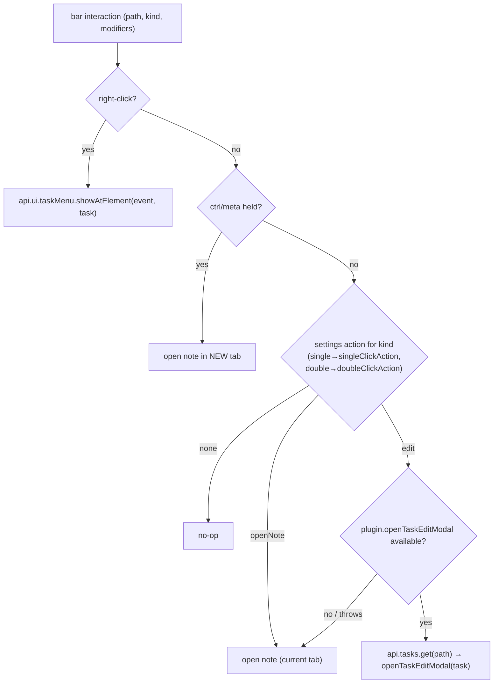

# feat: Native TaskNotes edit interaction on Gantt bars

## Summary

Make a Gantt bar behave like a native TaskNotes task card and delete the plugin's custom editor modal. Right-click opens TaskNotes' own task menu; left/double-click performs the action configured in TaskNotes settings (open the note, or open TaskNotes' edit modal); Ctrl/Cmd+click opens the note in a new tab. All editing, validation, custom-field writes, and deletion become TaskNotes' responsibility; the chart refreshes through the existing change-event/remount path. Drag/resize date persistence (PR #71) is unchanged.

This supersedes the planned U8b custom-modal work — instead of re-implementing TaskNotes' editor (the surface that produced three write-shape bugs), we delegate to it.

---

## Problem Frame

The custom editor modal (`GanttContainer.svelte` editor overlay + `handleEditorAction` + the `show-editor` intercept) would otherwise need to re-implement every TaskNotes field, validation, custom-field write, and recurrence — high carrying cost and recurring drift risk (see `docs/solutions/integration-issues/tasknotes-custom-field-write-top-level-key.md`). TaskNotes already ships a complete editor and a configurable click model; the plugin should reuse it and keep only what it uniquely owns (the chart + drag/resize). See origin: `docs/brainstorms/2026-06-17-native-tasknotes-edit-interaction-requirements.md`.

---

## Requirements

Carried from origin (R1–R10). Grouped by concern.

- **R1.** Right-click a bar → native TaskNotes task menu (`api.ui.taskMenu`).
- **R2.** Left-click / double-click → the action in TaskNotes settings (`singleClickAction` / `doubleClickAction`: `edit` | `openNote` | `none`), read at interaction time.
- **R3.** `openNote` action opens the note; Ctrl/Cmd held → open in a new tab.
- **R4.** `edit` action opens TaskNotes' native edit modal.
- **R5.** `none` action → no-op.
- **R6.** All field editing, validation, custom-field writes, recurrence, and deletion are performed by native TaskNotes.
- **R7.** Native edits reflect in the chart via the existing source-event → refresh / Base remount path; no new write/echo machinery.
- **R8.** Drag/resize date persistence (PR #71) is unchanged and remains the only edit the plugin itself performs.
- **R9.** The custom editor modal (overlay markup, `handleEditorAction`, the modal-opening `show-editor` intercept) is removed; drag/resize read-only gating stays.
- **R10.** Right-click menu and open-note work regardless of write capability; when TaskNotes is absent (Bases-only) there is no native menu and left/double-click falls back to open-note.

---

## Key Technical Decisions

- **A dedicated interaction service holds all TaskNotes/Obsidian interaction calls; the Svelte view stays API-free.** Per the companion architecture (TaskNotes access lives outside the view), a new service encapsulates settings read, note opening, modal opening, and menu showing. The view invokes it through callback props (mirroring the `onMutate` seam from PR #71); `register.ts` constructs the service and binds the callbacks. Rationale: keeps the view a thin surface and the TaskNotes coupling in one testable place.

- **Click-action resolution is a pure function; dispatch is a thin guarded shell.** A pure `resolveClickIntent({ action, kind, ctrlOrMeta })` → `{ kind: 'openNote' | 'openNoteNewTab' | 'editModal' | 'none' }` is unit-tested exhaustively; the side-effecting dispatch (workspace open, modal open, menu show) is guarded and verified in-vault. Rationale: the branching is the logic worth pinning; the I/O is integration.

- **Reads ride supported public APIs; only the edit-modal open is a guarded internal.** Verified against TaskNotes 4.11.0:
  - `api.settings.snapshot()` returns a deep clone of the full settings object → `singleClickAction` / `doubleClickAction` are available (public).
  - `api.ui.taskMenu.show` / `showAtElement` / `populate` → native task menu (public).
  - `api.tasks.get(path)` → the `TaskInfo` object (public).
  - **`plugin.openTaskEditModal(task, onTaskUpdated?)`** — takes a `TaskInfo`, lives on the plugin instance; **no public API**. Called guarded via `app.plugins.getPlugin('tasknotes')?.openTaskEditModal?.(task)`, with **fallback to opening the note** if absent or it throws (R4 degrades, never breaks). Rationale: the one durability risk, isolated and gracefully degrading (origin decision).

- **Note opening uses Obsidian, not TaskNotes.** Open via the workspace API (`getLeaf(ctrlOrMeta)` / `openLinkText`-equivalent) so Ctrl/Cmd → new tab is ours to control (R3). Rationale: opening a file is core Obsidian, no TaskNotes dependency.

- **No new refresh machinery.** Native edits emit TaskNotes change events the controller already subscribes to (and Base metadata changes trigger the existing remount); the chart refreshes for free (R7). The plan verifies this fires for menu/modal edits, but adds nothing.

---

## High-Level Technical Design

Click-intent resolution + dispatch (per bar interaction):

---

## Implementation Units

### U1. TaskNotes interaction service (resolution + dispatch)

- **Goal:** A non-view service that, given a task path + interaction info, resolves and performs the native action (menu / open-note / edit-modal), encapsulating all TaskNotes-API and Obsidian-workspace calls.
- **Requirements:** R1–R6, R10
- **Dependencies:** none (uses the resolved TaskNotes api + Obsidian app)
- **Files:** create `src/bases/taskNotesInteractions.ts` (service + pure `resolveClickIntent`), `test/unit/taskNotesInteractions.test.ts`. May reuse the plugin/api resolution pattern from `src/datasource/TaskNotesSource.ts` (`resolveApi`).
- **Approach:** Expose `resolveClickIntent({ action, kind, ctrlOrMeta })` (pure) and a service with `handleActivate(path, { kind, ctrlOrMeta })` and `showContextMenu(path, event)`. `handleActivate` reads `api.settings.snapshot()` for the relevant action, resolves intent, then: open-note (Obsidian workspace; new tab when ctrl/meta), edit-modal (`api.tasks.get(path)` → guarded `plugin.openTaskEditModal(task)`; on absent/throw → open note), or no-op. `showContextMenu` calls `api.ui.taskMenu` for the task. Guard every cross-plugin call; when TaskNotes/api is absent, `handleActivate` falls back to open-note and `showContextMenu` is inert (R10).
- **Execution note:** Implement the pure `resolveClickIntent` test-first — it's the branch-heavy logic.
- **Patterns to follow:** guarded api access in `src/datasource/TaskNotesSource.ts`; callback-prop seam from `src/bases/register.ts` `mountGantt` (`onMutate`).
- **Test scenarios:**
  - Covers AE1/AE3. `resolveClickIntent`: `{action:'openNote',kind:'single',ctrlOrMeta:false}` → `openNote`; `ctrlOrMeta:true` → `openNoteNewTab`; `{action:'none'}` → `none`; `{action:'edit'}` → `editModal`; double-click reads `doubleClickAction`.
  - Modifier precedence: ctrl/meta forces a new-tab note-open regardless of the configured action.
  - Dispatch (mocked api/app): `editModal` intent → `api.tasks.get(path)` then `plugin.openTaskEditModal(task)` once.
  - Covers AE6. `plugin.openTaskEditModal` absent/throws → falls back to opening the note; no throw surfaces.
  - Context menu: `showContextMenu` invokes `api.ui.taskMenu` for the resolved task; inert when api absent.
  - Edge: TaskNotes absent → `handleActivate` opens the note (never the modal); settings snapshot missing the field → treat as `openNote` default (confirm default in-vault).
- **Verification:** With a mocked TaskNotes api + Obsidian app, every intent dispatches to the right call; the edit-modal fallback degrades to open-note.

### U2. Rewire the view to native interaction; remove the custom modal

- **Goal:** Replace the custom editor modal with bar click/right-click handlers wired to the U1 service via callback props; delete the modal entirely; preserve drag/resize + read-only behavior.
- **Requirements:** R7, R8, R9
- **Dependencies:** U1
- **Files:** modify `src/bases/GanttContainer.svelte` (remove editor overlay markup, `handleEditorAction`, modal state, the modal-opening `show-editor` intercept, and now-unused `toDateInputValue`; add click/dblclick/contextmenu handling that resolves the bar's `sourcePath` and calls the new `onBarActivate(path, {kind, ctrlOrMeta})` / `onBarContextMenu(path, event)` props), `src/bases/register.ts` (`mountGantt`: construct the U1 service, bind the callback props), `test/specs/gantt-readonly-render.e2e.ts` (assert no custom editor modal opens; the read-only banner + no-Add-Task still hold).
- **Approach:** Intercept SVAR's bar-activation (the existing `show-editor` double-click hook, plus single-click via SVAR's select/click event and a `contextmenu` DOM listener on `.wx-bar`) to derive the bar id → `sourcePath` and call the callbacks instead of opening the custom modal. Single-vs-double-click disambiguation (debounce) is handled here. The view holds no TaskNotes/Obsidian API references — only the callback props. Keep drag/resize, the read-only banner, and the invalid-mapping notice intact.
- **Patterns to follow:** the `onMutate` callback-prop wiring already in `GanttContainer.svelte` + `register.ts` (PR #71); the `show-editor` intercept currently in `initGantt`.
- **Test scenarios:**
  - Covers AE2/AE4/AE5. (E2E / manual-in-vault, harness can't stub TaskNotes UI) opening a note vs edit modal per settings; right-click menu Delete removes the bar on refresh; a native date edit reflects on the bar with no double-write; drag/resize still persists.
  - Regression (E2E): read-only Bases render still shows the banner and no "Add Task"; no custom editor overlay element exists in the DOM after a bar double-click.
  - Wiring (unit where feasible): a bar double-click resolves the correct `sourcePath` and invokes `onBarActivate` with `kind:'double'` and the right modifier flags; right-click invokes `onBarContextMenu`.
  - Edge: clicking empty grid / a non-task row does not invoke the callbacks.
- **Verification:** Bars open the note or native modal per TaskNotes settings; right-click shows the native menu; the custom modal is gone; drag/resize and read-only behavior unaffected; native edits refresh the chart.

---

## Scope Boundaries

### In scope
- Click/right-click interaction emulating TaskNotes; removal of the custom modal; reading click-action settings; open-note (incl. new tab) and guarded edit-modal open.

### Deferred to Follow-Up Work
- A supported `api.ui.editTask(path)` / `openNote` in TaskNotes (cleaner than the guarded internal) — swap the guarded call for it if/when TaskNotes adds it (origin "Deferred for later").
- Task **creation** from the Gantt ("Add Task") — removed in PR #71; returns only via a controller/native create path (origin).

### Outside this product's identity
- Re-implementing any TaskNotes editing UI, field validation, or custom-field write logic. TaskNotes owns task data and its editor (origin).

---

## Risks & Dependencies

- **Risk (durability):** `plugin.openTaskEditModal(task, onTaskUpdated?)` is internal (verified 4.11.0: `new QC(app, plugin, {task, onTaskUpdated}).open()`). Mitigation: guarded call + open-note fallback (R4 degrades). Confirm the TaskInfo arg from `api.tasks.get` is accepted as-is.
- **Risk (SVAR event surface):** single-click and right-click on bars may need SVAR events and/or DOM listeners beyond the `show-editor` (double-click) hook; debounce to disambiguate single vs double. Confirm SVAR v2.3.0's available bar events in U2; DOM `contextmenu` on `.wx-bar` is the fallback for right-click.
- **Assumption:** native edits emit TaskNotes change events the controller/`CompositeSource` already subscribe to, so the chart refreshes without new plumbing (R7) — confirm in-vault that menu/modal edits trigger the refresh the same way external edits do.
- **Dependency:** TaskNotes installed + ready exposes `api.ui.taskMenu`, `api.settings.snapshot()`, `api.tasks.get`, and `plugin.openTaskEditModal`. Verified against 4.11.0.
- **Verification ceiling:** the menu/modal/open-note integration can't be E2E-stubbed; the dispatch *logic* is unit-covered, the rest is manual-in-vault (consistent with prior milestones).

---

## Open Questions / Deferred to Implementation
- Exact `api.ui.taskMenu` call shape (event + task vs element + task) — confirm in U1.
- SVAR's single-click / right-click event availability on bars — confirm in U2.
- The default when a click-action setting is unset/absent in the snapshot (assume `openNote`) — confirm in-vault.

---

## Sources / Research
- Origin requirements: `docs/brainstorms/2026-06-17-native-tasknotes-edit-interaction-requirements.md`.
- TaskNotes 4.11.0 (verified this session): `api.ui.taskMenu`, `api.settings.snapshot()` (full settings clone incl. `singleClickAction`/`doubleClickAction` = `edit`|`openNote`|`none`), `api.tasks.get`, internal `plugin.openTaskEditModal(task, onTaskUpdated?)`; TaskNotes' own card handler confirms `ctrl/meta → open note`, else dispatch on the click-action setting.
- Reuse: `src/bases/GanttContainer.svelte` + `src/bases/register.ts` (`onMutate` callback-prop seam, `show-editor` intercept); `src/datasource/TaskNotesSource.ts` (guarded api resolution).
- Learnings: `docs/solutions/integration-issues/tasknotes-custom-field-write-top-level-key.md` and `…/tasknotes-status-palette-wrong-api-path.md` (why delegating editing avoids the write-shape minefield).
