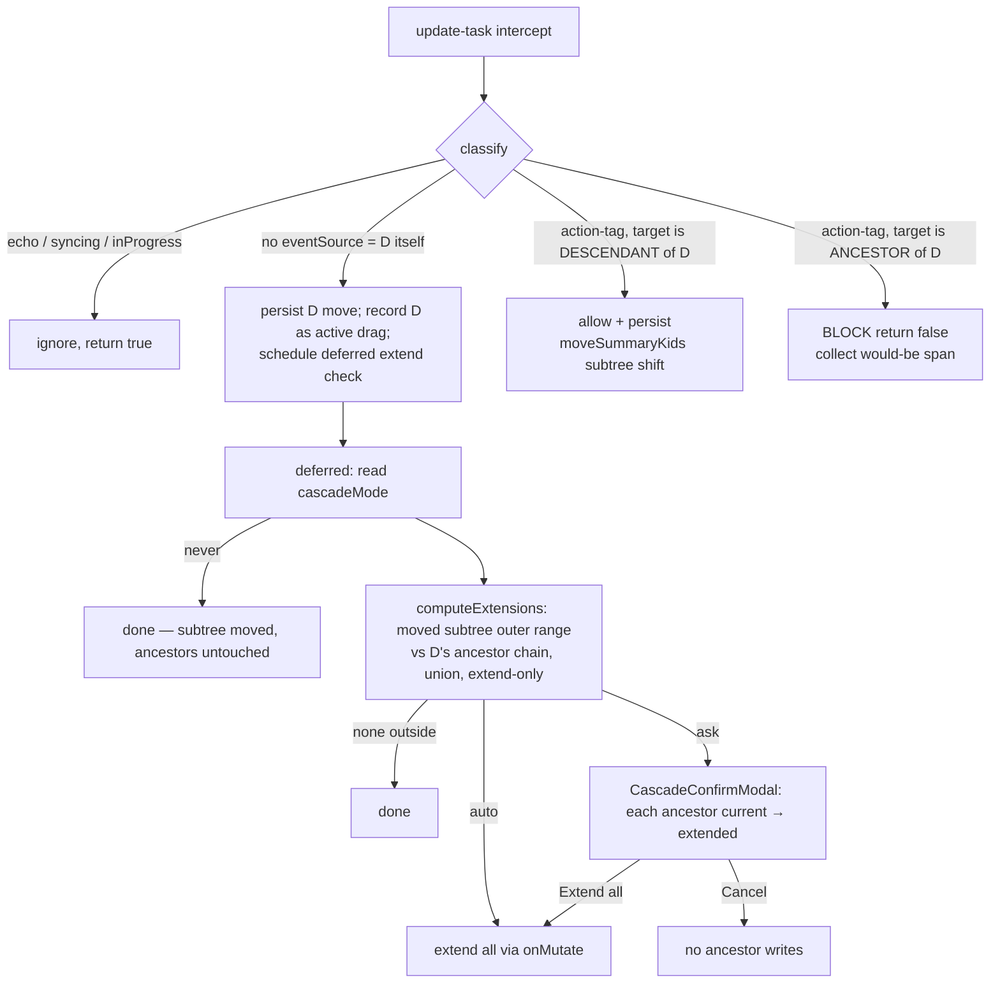

# feat: Gantt subtree-move on drag + gated ancestor extend

## Summary

Parents render their own (note) dates and keep the summary look; a child outside the window overflows. **Moving** any task shifts its whole subtree by the same delta (intervals preserved) and persists every moved note — children always follow a moved parent, no prompt. A move/resize that pushes a task or its subtree **outside an ancestor's window** offers to extend that ancestor up the chain, governed by a per-view **Ask** (default) / **Auto** / **Never** mode. Extend-only; nothing shrinks.

> **Supersedes three earlier directions.** v1 rendered parents as auto-spanning summaries and gated SVAR's `resetSummaryDates` writes — the recomputed span lingered on cancel. v2 removed summary typing — but seemed to break "drag a parent → children move with it." v3 kept summaries to reuse `moveSummaryKids` — but SVAR **rejects an asymmetric date change on a summary** (`f(i.start,d.start), f(i.end,d.end)!==c → return`), so an *extend* (one edge) would never render on a summary (bar ≠ note again). Final (verified against SVAR source): **parents are ordinary, non-summary tasks** — they show their own dates, a child overflows, the bar is fully draggable (`getMoveMode` only blocks resize on summaries/milestones; a non-summary task is move+resize), and date writes (extends, subtree shifts) apply cleanly. "Drag a parent → children follow" is implemented by **us** (compute the delta on drop, shift descendants), not by SVAR.

---

## Problem Frame

The Gantt renders a task-with-children as a SVAR *summary*. SVAR recomputes a summary's span from its children when a child changes (`resetSummaryDates`, fired on a child drop, recursing up) and the persistence path wrote that back to ancestor notes — silently overwriting a parent's own dates, and leaving a recomputed span on screen after a cancel until reload. Separately, dragging a parent shifts its children on screen (`moveSummaryKids`) but none of those moves persisted, so a deliberate subtree reschedule was lost.

The unifying intent: a parent has its **own** planned window, independent of where children land. Show it; preserve it on a child move unless the user opts to extend; and reschedule + save the whole subtree when the parent itself is moved (see origin: `docs/brainstorms/2026-06-17-parent-date-cascade-confirmation-requirements.md`).

---

## Key Technical Decisions

- **Parents are ordinary (non-summary) tasks.** A SVAR summary derives its length from its children (can't show the parent's own dates) and rejects an asymmetric date change — so an extend wouldn't render. Non-summary parents show their own note dates, overflow when a child is outside, are fully draggable (move + resize), and accept clean date writes. (Verified: `getSummaryId` is type-only; `getMoveMode` only suppresses resize for summaries/milestones.)
- **We implement the subtree move.** Because a non-summary row doesn't auto-move its children, on a parent *move* commit we read the delta (post-drag store vs pre-drag snapshot) and shift every descendant by it (optimistic `api.exec` echo + `onMutate` persist) — children follow, intervals preserved. A leaf has no descendants; a resize (asymmetric delta) shifts nothing.
- **One unified drag rule.** Move a task → its subtree moves with it (persisted, no prompt). Separately, if the moved subtree's outer range exceeds an ancestor, that ancestor is offered for extension up the chain (gated). Leaf = degenerate case.
- **Children follow unconditionally; only ancestor extension is gated.** Ask / Auto / Never governs only the extend.
- **Extend-only, move ≠ resize.** A task moving inward never shrinks an ancestor. Resize changes only the dragged task's own span (no descendant shift) and can still trigger a gated extend.
- **Writes are clean and don't re-enter.** All persistence (D, descendants, approved extends) goes through `onMutate` → `controller.mutate` → TaskNotes; the refresh runs under `syncing` and our optimistic echoes carry `OG_ECHO_SOURCE`, both ignored by the intercept.
- **Default existing views to Ask.**

---

## High-Level Technical Design

Routing of the synchronous `update-task` burst after dragging task **D** (Ask mode):

*Directional guidance, not implementation specification.*

---

## Implementation Units

### U1. Per-view "Parent date updates" option (Ask/Auto/Never), threaded into the view data

- **Goal:** Per-view dropdown (Ask/Auto/Never, default Ask) surfaced via `GanttData`.
- **Requirements:** R8; supports R10.
- **Dependencies:** U2 (`normalizeCascadeMode`).
- **Files:** `src/bases/register.ts` (option in the Gantt `options()`; `getCascadeMode()`; set `cascadeMode` in `buildGanttData`), `src/bases/types/gantt-view-data.ts` (`cascadeMode: CascadeMode`).
- **Approach:** Option key `parentDateCascade`. **Dropdown `options` is a `Record<string,string>`** (value→label) — Bases passes it to `DropdownComponent.addOptions`; an array renders `[object Object]` (fixes the pre-existing `defaultScale`/`dependencyArrowMode` dropdowns too). Give the Gantt `options()` factory an explicit `ViewOption[]` return type.
- **Test scenarios:** `Test expectation: none` — config plumbing; `normalizeCascadeMode` covered in U2; behavior verified in U4 in-vault. Confirm the three labels render in-vault.
- **Verification:** option shows three labelled choices; default Ask.

### U2. Pure `cascadeGate`: mode, classification, extension + shrink-fit computation

- **Goal:** Dependency-free decisions, unit-testable.
- **Requirements:** R7, R12, R12b, R14, R15.
- **Dependencies:** none.
- **Files:** `src/bases/cascadeGate.ts`, `test/unit/cascadeGate.test.ts`.
- **Approach:** Export:
  - `normalizeCascadeMode(value): CascadeMode` — unknown → `ask`.
  - `classifyUpdateEvent(ev, { echoSource, syncing })` → `'echo' | 'syncing' | 'user-gesture' | 'action' | 'ignore'`. (For non-summary rows `'action'` is not expected from a drag; the classifier still recognizes the SVAR tags so a stray one is never mistaken for a user gesture.)
  - `computeMoveExtensions(movedRanges, nodes): AncestorExtension[]` — **tree-wide** (covers R12b). `movedRanges`: `Map<sourcePath, {start,end}>` for the dragged task + shifted descendants; `nodes`: every instance `{id, sourcePath, name, parent?, start, end}`. For each non-moved ancestor instance, union the new ranges of moved instances beneath it; if that union exceeds the ancestor, propose extending the violated edge(s) (extend-only). An ancestor that is itself moved is skipped (rigid shift). Dedup by `sourcePath`. This naturally covers a multi-parent task's *alternate* parent, because every instance of a moved source contributes to its own ancestors' unions.
  - `computeShrinkFit(before, after, childRanges): DateRange | null` — fires only when the resize *newly* orphans children (`before` contained the children's bbox, `after` doesn't). Returns `after` with **only the violated edge(s)** pushed back to the children's boundary (the untouched edge stays). Else `null`.
- **Patterns to follow:** `src/bases/ganttSync.ts`, `src/bases/statusColor.ts`.
- **Test scenarios:**
  - `normalizeCascadeMode`: valid pass; missing/empty/unknown → ask.
  - `classifyUpdateEvent`: syncing wins; echo; no-eventSource → user-gesture; recognized action tag → action; unknown → ignore.
  - `computeMoveExtensions`: leaf past parent end → parent extended (end only); within all ancestors → empty; never shrinks; parent and grandparent both extended (union); only-parent when grandparent already covers; **moved ancestor not flagged**; **multi-parent alternate parent flagged** (C under A+B, A moved, B exceeded → B only); dedup by source; incomplete-date ancestor skipped; empty inputs.
  - `computeShrinkFit`: dragged-in start → only start corrected (finish stays); dragged-in finish → only finish corrected; both edges in → both; still-contains → null; pre-existing overflow → null; no children → null.

### U3. `CascadeConfirmModal` — generic confirm dialog (extend + shrink-fit)

- **Goal:** One Obsidian `Modal` taking `{ title, body, confirmText, cancelText?, rows }` (rows = `name, current → proposed`), `openAndGetChoice(): Promise<boolean>` (confirm/cancel). Used for both the **extend** prompt (confirm = Extend all) and the **shrink-fit** prompt (confirm = Adjust to fit, cancel = Undo resize).
- **Requirements:** R9, R14.
- **Dependencies:** U2 (`AncestorExtension[]` shape).
- **Files:** `src/bases/CascadeConfirmModal.ts`.
- **Approach:** Scrollable rows (`max-height:40vh`), dates `YYYY-MM-DD`; **Cancel** default-focused; confirm button `mod-cta`; Escape/backdrop → `false`. Copy is per-caller (extend vs shrink).
- **Test scenarios:** `Test expectation: none` — row data tested in U2; modal verified in-vault.

### U4. Unified drag wiring in `GanttContainer`

- **Goal:** Persist the dragged task's move; shift + persist its descendants on a move; run the parent-shrink guard on a resize; offer the gated, tree-wide ancestor extend.
- **Requirements:** R3, R4, R5, R6, R7, R9, R10, R11, R12b, R13, R14, R15; AE1–AE11.
- **Dependencies:** U1, U2, U3, U5.
- **Files:** `src/bases/GanttContainer.svelte`.
- **Approach:**
  - In `api.intercept("update-task", …)`: ignore `inProgress` frames. On `classifyUpdateEvent === 'user-gesture'` (the dragged task **D**, non-readonly, has `onMutate`): capture D's id, name, and **pre-drag** dates synchronously (the `instances` snapshot is still pre-drag at intercept time), `persistReschedule(D)` (existing), and schedule the deferred pass once. Other classes → no-op.
  - Deferred pass: read D's committed dates from the store; compute the delta. Seed `movedRanges` (`Map<sourcePath, range>`) with D. **If a pure move** (both edges same non-zero delta) and D has descendants: shift each descendant by the delta — optimistic `api.exec(…, eventSource: OG_ECHO_SOURCE)` + `onMutate` — and add each to `movedRanges`. **Else (resize / no shift):** run `computeShrinkFit(before, after, directChildRanges)`; if it returns a fit, apply the per-view mode — `never` → leave overflow; `auto` → write the fit; `ask` → `CascadeConfirmModal` (Adjust to fit / Undo resize) then write the fit or the pre-drag range — and **return** (skip extend).
  - Extend gate: read `cascadeMode` (`never` → done). Build `nodes` from all `instances`; `computeMoveExtensions(movedRanges, nodes)` (tree-wide — covers alternate parents). Empty → done. `auto` → write all; `ask` → `CascadeConfirmModal` (Extend all / Cancel), write all on approve. One `onMutate` per source.
- **Patterns to follow:** existing `persistReschedule`, `OG_ECHO_SOURCE`, `syncing`, `setTimeout(0)` deferral.
- **Test scenarios:** pure logic unit-tested in U2. Wiring verified **in-vault** against AE1–AE11 (move within/outside parent; cancel-leaves-overflow; parent move shifts subtree; grandparent extend; Never/Auto; resize extend; multi-parent dedup; **AE10** multi-parent alternate-parent extend; **AE11** resize-below-children shrink guard with per-edge Adjust).

### U5. Parents render as ordinary tasks at their own dates

- **Goal:** Type parents as ordinary tasks (own dates, fully draggable, clean date-writes); keep `open` for hierarchy. NOT summaries.
- **Requirements:** R1, R2.
- **Dependencies:** none (sequence first).
- **Files:** `src/bases/ganttSync.ts`, `test/unit/ganttSync.test.ts`.
- **Approach:** In `buildSvarTasks`, a parent is composed like a leaf (date-status flag + status-color class) with `open: true` and its own `start`/`end`; it is **not** typed `summary`. SVAR renders its own dates, a child outside the window overflows, and the bar is move+resize draggable. The parent-drag-moves-children behavior lives in U4 (we shift the subtree), since a non-summary row doesn't auto-move children.
- **Test scenarios:** `ganttSync.test.ts` — a parent yields a non-`summary` type carrying its own dates with `open: true`; a parent with a configured status gets the status class; `buildStatusTaskTypes` unaffected.
- **Verification:** in-vault, parents show their own bar at their note dates; a longer child overflows; expand/collapse works; zoom/scroll preservation (diff-sync) holds.

---

## Scope Boundaries

**In scope:** subtree move-and-persist on drag; gated ancestor extend (Ask/Auto/Never); parents render own dates with child overflow.

**Deferred to Follow-Up Work:** automated E2E (drag → modal/persist) — verified in-vault for now.

**Deferred for later** (origin): per-ancestor selection in the dialog; Auto-mode undo notice.

**Outside this change:** removing the summary look; shrinking an ancestor (extend-only); non-drag triggers (external edits).

---

## Risks & Dependencies

- **Distinguishing descendant vs ancestor events.** The block-vs-persist decision hinges on `collectAncestorIds(D)`; an event target not in the ancestor set is treated as a descendant move. Verified that `moveSummaryKids` touches only descendants and `resetSummaryDates` only ancestors, so the partition is clean. Cycle-guard the ancestor walk.
- **Multi-write subtree persistence.** A parent move writes the parent + every descendant note (one drag → N TaskNotes writes). First cut writes sequentially via `onMutate`; partial failure surfaces a Notice and leaves successfully-written notes as-is (no transactional rollback). Batching/atomicity is a follow-up if it proves slow or surprising.
- **Blocking `resetSummaryDates` via intercept.** Returning `false` for the ancestor-recompute events prevents the visual auto-span; the extend is then driven by our own writes. Verified the intercept runs before the store handler (it prepends) so the block is effective.
- **Diff-sync interaction (zoom fix).** All our writes run under `syncing`/`OG_ECHO_SOURCE` and are ignored by the intercept; U4 preserves those guards.
- **Dependency:** existing write path (`src/controller/GanttController.ts` `mutate`, `onMutate`) and reactive diff-sync (`src/bases/ganttSync.ts`).

---

## Sources & Research

- Origin requirements: `docs/brainstorms/2026-06-17-parent-date-cascade-confirmation-requirements.md`.
- SVAR verified in `node_modules/@svar-ui/gantt-store/dist/index.js`: `getSummaryId` (`type==="summary"` only), `moveSummaryKids` (shifts each descendant by the same delta, execs `update-task` per descendant), `resetSummaryDates` (recurses ancestors, execs `update-task`), summary resize skip (start/end delta mismatch returns before `moveSummaryKids`); and `node_modules/@svar-ui/svelte-gantt/src/components/chart/Bars.svelte` (drop commit fires `update-task` with no `eventSource`).
- Pattern + guards: `src/bases/ganttSync.ts`, `src/bases/statusColor.ts`, `src/bases/GanttContainer.svelte` (`persistReschedule`, `OG_ECHO_SOURCE`, `syncing`).
