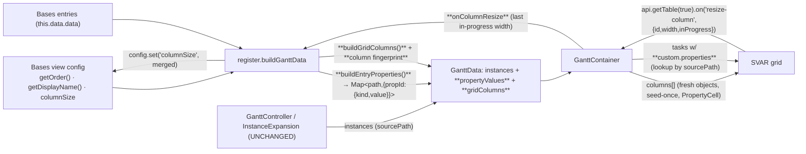

# feat: Gantt grid mirrors the Base's configured columns

## Summary

Make the Gantt's left-hand grid reflect the Obsidian Base's column configuration: the user's selected properties, in order, with the task-name/hierarchy column forced first; each cell rendered by its property type (date, number, boolean→checkmark, array, link, empty→blank); and per-column widths read from and written to the standard Bases `columnSize` field, persisted on resize. The name column is always present. Today the grid hardcodes a single "Task" column and ignores the Base config entirely (see origin: `docs/brainstorms/2026-06-18-gantt-grid-bases-columns-requirements.md`).

---

## Problem Frame

The M1 "controller owns the transform" refactor reduced the grid to one hardcoded column (`src/bases/GanttContainer.svelte`), and nothing consumes the Bases column config (`getOrder()`/`getDisplayName()`/`columnSize` are available on the view config but unused). So the properties a user selects in the Base never reach the grid. The extraction primitives exist — `BasesDataAdapter.extractValue` (raw native value), `convertValueToNative`, `extractPropertyValue` — but two facts (surfaced in the deepening review) shape the work: (a) `extractValue` returns **heterogeneous** forms for the same logical type (a `note.`-prefixed date comes back as the raw frontmatter **string** `"2026-06-17"`, a computed date as an **ISO string**, only rarely a `Date`), so the cell cannot type-switch on `instanceof`; and (b) display values need **no controller transform** (no date policy, no instance fan-out), so they should be resolved at `GanttData` assembly time keyed by source path — the same place `statusColors` and `capabilities` are already resolved — rather than threaded through `SourceTask`/`RenderInstance`.

---

## Key Technical Decisions

- **Resolve display property values at assembly time, not through the source/controller pipeline.** `register.buildGanttData` already holds the raw Bases entries (`this.data.data`) and the view config. Build a `Map<sourcePath, Record<propId, TypedValue>>` there and put it on `GanttData`; the grid cell looks values up by the instance's `sourcePath`. This mirrors how `statusColors`/`capabilities` are resolved in `register.ts` (not carried through `BasesSource`/`CompositeSource`/`InstanceExpansion`). Multi-parent instances share one `sourcePath`, so they read identical values for free — the identity model is preserved without touching `SourceTask` or `RenderInstance`. (Chosen over the original "thread a `properties` bag through 4 layers" after the scope + adversarial reviews showed display values require none of the controller's per-instance transforms; chosen over a lazy view-direct cell read because the assembly-time map is pure-testable and keeps the column concern in `register.ts`.)
- **Extract a type-tagged value, not a raw native value.** `extractValue` is heterogeneous (frontmatter string / ISO string / Date / number / boolean / array / FileValue-path). The adapter classifies each value using the Bases value wrapper's type (`getValue(propId)` / `getComputedProperty`) into a small tagged shape `{ kind, value }` (`kind ∈ date|number|boolean|text|list|link|empty`); the cell formats from `kind`, never from `instanceof`. This is what makes R5 (date→locale, boolean→checkmark, link→display text) actually fire for the common `note.`-prefixed case, and it makes the diff-sync fingerprint deterministic (see below).
- **One generic type-aware cell.** A single `PropertyCell` switches on `kind`. It guards a missing bag (`row.custom?.properties?.[column.id]`) — pre-existing/optimistic task writes may lack it — and renders blank for `empty`.
- **Columns are a seed-once `const` of fresh objects, rebuilt only on a column-config fingerprint change.** SVAR re-inits its whole store when the `columns` prop *reference* changes (verified: `Gantt.svelte` `reinitStore` destructures `columns` alongside `tasks`/`zoom`), resetting zoom/scroll — the bug PR #73 fixed. So `columns` must change from today's `$derived` to a seed-once `const` (mirroring the `svarTaskTypes` pattern). Two extra constraints the review surfaced: **(1)** SVAR *mutates the column objects in place* on resize/fit (`grid-store` resize handler writes `h.width`, `Grid.svelte fitColumns` writes `c.width`/`c.$width`), so every rebuild must construct **fresh** column objects — never reuse an element from the prior array. **(2)** `register` computes a stable **fingerprint** of the column config (`order` ids + display names + `columnSize` entries) and only swaps `gridColumns` when it changes; a plain data refresh must never alter the fingerprint, or it silently re-inits and resets zoom. A genuine column-config change does re-init (accepted; the implementation should re-apply the captured zoom level + scroll after the forced re-init, since column toggles are interactive, not rare).
- **The diff-sync key folds *formatted* display strings, not raw values.** `taskStateKey` (`ganttSync.ts`) must include the displayed columns' **formatted strings** (deterministic, produced by the same formatter the cell uses), not the raw native values — raw Dates/ISO-strings/Bases-wrapper objects serialize non-deterministically and would make every refresh look like a change (a re-render storm that defeats the diff-sync). Scope this fingerprint to the visible columns only, so cells refresh on an external property edit without churn.
- **`columnSize` is the standard width store — read and write.** Initial widths come from `config.get('columnSize')`; a resize writes back via `config.set('columnSize', …)`. **Verify-first** (no existing `config.set` call in the repo to copy from): that `config.set('columnSize', …)` persists, and whether `columnSize` is **per-view** (each `views[]` entry) or **file-level shared** with the native `table` view (shared keys → last-writer-wins clobber risk between our resize and the table view). Fallback: the namespaced `obsidianGantt` config.
- **Name/hierarchy column always first and always present.** SVAR pins the tree to `text`; it leads, then the Base's other selected properties in order. The single configured name/`file.basename` property maps onto `text` (if multiple name-like properties are selected, only the configured name property maps to `text`; the rest render as ordinary columns). A property that also serves a date/progress *role* (e.g. `note.start`) still renders as its own column when the user selected it. The grid never fully hides.

---

## High-Level Technical Design

Data flow (new/changed parts in **bold**) — note the property values bypass the source/controller layers entirely:

---

## Implementation Units

### U1. Resolve type-tagged property values at assembly time

- **Goal:** Produce, per task, a bag of type-tagged property values for the configured columns — built in `register`, carried on `GanttData`, keyed by source path. No changes to `SourceTask`/`CompositeSource`/`InstanceExpansion`.
- **Requirements:** R9, R5, R6 (enables R1).
- **Dependencies:** none.
- **Files:** `src/bases/services/BasesDataAdapter.ts` (add `extractTypedValue(entry, propId): TypedValue`), `src/bases/propertyValues.ts` *(new, pure)* + `test/unit/propertyValues.test.ts` *(new)*, `src/bases/types/gantt-view-data.ts` (`propertyValues: Map<string, Record<string, TypedValue>>` + the `TypedValue` type), `src/bases/register.ts` (call the builder in `buildGanttData`; thread the visible-column ids in), `test/unit/BasesDataAdapter.test.ts`.
- **Approach:** Define `TypedValue = { kind: 'date'|'number'|'boolean'|'text'|'list'|'link'|'empty', value: unknown }`. Add `BasesDataAdapter.extractTypedValue(entry, propId)` that classifies via the Bases value wrapper's type (reuse the `getValue`/`getComputedProperty` + `convertValueToNative` type detection already in the adapter), falling back to JS `typeof`/`Array.isArray`/`Date` checks for `note.`-prefixed raw frontmatter (a bare ISO/`YYYY-MM-DD` string with a date-typed wrapper → `date`). Pure `buildEntryProperties(entries, visiblePropIds, adapter)` returns `Map<sourcePath, Record<propId, TypedValue>>`. `register.buildGanttData` calls it with the visible-column ids (from U2's resolution) and sets `propertyValues` on `GanttData`.
- **Patterns to follow:** the assembly-time resolution of `statusColors`/`capabilities` in `register.buildGanttData`; the pure-module style of `src/bases/ganttSync.ts`; `convertValueToNative` type branches in `BasesDataAdapter`.
- **Test scenarios:**
  - `extractTypedValue` tags each kind correctly: a `note.`-prefixed date string → `date`; a computed ISO date → `date`; a number → `number`; a boolean → `boolean`; a list → `list`; a FileValue/link → `link`; a plain string → `text`; missing/null/empty → `empty`. (Covers the heterogeneity that broke the original `instanceof` assumption.)
  - `buildEntryProperties` keys by `sourcePath`, includes only the visible prop ids, and yields an empty record for an entry with none of them.
  - Empty visible-column list → empty map.
- **Verification:** for a Base selecting `note.status`/`note.start`, the map exposes `{ status: {kind:'text',…}, start: {kind:'date',…} }` for each entry; `npm test` green.

### U2. Build grid column descriptors + config fingerprint

- **Goal:** Derive the ordered, named, sized column descriptors and a stable column-config fingerprint from the Base config; surface both on `GanttData`; resolve the visible-column id list consumed by U1.
- **Requirements:** R1, R2, R3, R4, R7.
- **Dependencies:** none (U1 consumes the visible-id list this unit resolves).
- **Files:** `src/bases/gridColumns.ts` *(new, pure)*, `test/unit/gridColumns.test.ts` *(new)*, `src/bases/types/gantt-view-data.ts` (`gridColumns: GridColumn[]`, `gridColumnsKey: string`), `src/bases/register.ts` (resolve order/displayName/columnSize; set both fields).
- **Approach:** Pure `buildGridColumns(order, displayName, columnSize, nameKey)` → `GridColumn[]`: the name/hierarchy column first (`id: 'text'`, header from the name property's display name or "Task", width from `columnSize[nameKey]` or `DEFAULT_WIDTH`), then one column per visible property in order — excluding the single configured name property to avoid a duplicate — each `{ id: propId, header: displayName(propId), width: columnSize[propId] ?? DEFAULT_WIDTH, align }`. Pure `gridColumnsKey(columns)` returns a stable fingerprint string (ids + headers + widths). `register` resolves the visible set from `config.getOrder()` (working precedent: `src/bases/views/GanttTaskListView.ts` already consumes `getOrder()`; fall back to the query result's `properties`), and sets `gridColumns` + `gridColumnsKey` on `GanttData`.
- **Patterns to follow:** `getOrder()` usage in `src/bases/views/GanttTaskListView.ts`; pure-helper + test style of `ganttSync.ts`/`cascadeGate.ts`; `buildGanttData` field assembly in `register.ts`.
- **Test scenarios:**
  - Covers AE1/AE6. Name column first; remaining properties follow `order`.
  - Covers AE2/AE7. The configured `file.basename`/name property maps onto the name column (no duplicate); if multiple name-like properties are selected, only the configured one maps to `text`.
  - Covers AE4. A property with a `columnSize` entry gets that width; one without gets the default.
  - Covers AE5. Empty `order` → only the name column.
  - `gridColumnsKey` is stable for identical config and changes when order/header/width changes.
- **Verification:** descriptors + key match the Base's selection/order/widths for a representative config; `npm test` green.

### U3. Generic type-aware `PropertyCell`

- **Goal:** Render a `TypedValue` by its `kind`.
- **Requirements:** R5, R6.
- **Dependencies:** U1 (the `TypedValue` shape).
- **Files:** `src/bases/propertyFormat.ts` *(new, pure)*, `test/unit/propertyFormat.test.ts` *(new)*, `src/bases/PropertyCell.svelte` *(new)*.
- **Approach:** Pure `formatPropertyValue(tv: TypedValue): string` switches on `kind`: `date` → locale/`YYYY-MM-DD` date string; `number` → numeric; `boolean` → a checkmark token when true / blank when false; `list` → comma-joined; `link` → display text (basename of the path); `text` → as-is; `empty` → blank. `PropertyCell.svelte` is a SVAR cell **component** (receives `{ row, column }` — verified components render, snippets do not), reads `row.custom?.properties?.[column.id]` (guarded — returns blank when the bag or key is absent), runs `formatPropertyValue`, and renders text (or the checkmark glyph for booleans).
- **Patterns to follow:** `BasesDataAdapter` type branches; the icon-rendering approach in `GanttContainer.svelte` for the checkmark glyph; SVAR `TextCell.svelte` for the component cell contract.
- **Test scenarios:**
  - Covers AE2. Each `kind` formats correctly: date → formatted; number → numeric; boolean `true` → checkmark token / `false` → blank; list → comma-joined; link → basename; text → as-is.
  - Covers R6. `empty` (and a missing bag/key, exercised via the component) → blank.
- **Verification:** unit tests green; in-vault, a boolean column shows a checkmark, a date column a formatted date.

### U4. Assemble the SVAR columns and carry values onto tasks

- **Goal:** Build the SVAR `columns` array as fresh objects (name-first + property columns using `PropertyCell`), seed-once and fingerprint-gated; carry property values onto tasks; fold formatted display strings into the diff-sync key.
- **Requirements:** R1, R2, R3, R5, R10.
- **Dependencies:** U1, U2, U3.
- **Files:** `src/bases/GanttContainer.svelte` (replace the hardcoded `$derived` columns), `src/bases/ganttSync.ts` (`buildSvarTasks` sets `custom.properties`; `taskStateKey` folds formatted display strings; `SvarTask.custom.properties` optional), `test/unit/ganttSync.test.ts`.
- **Approach:** Replace the single-column `$derived` columns with a seed-once **`const`** (mirroring `svarTaskTypes`) built from `$data.gridColumns`: `text` column first (carries the tree), then a **freshly-constructed** object per descriptor (`id: propId`, `header`, `width`, `cell: PropertyCell`, `resize: true` except the last). Track `$data.gridColumnsKey`; when it changes, rebuild the array from **new** objects (never reuse prior elements — SVAR mutates them in place) and accept the SVAR re-init, re-applying the captured zoom level + scroll afterward. `buildSvarTasks` receives the `propertyValues` map and sets `custom.properties = propertyValues.get(inst.sourcePath) ?? {}` on each task. `taskStateKey` appends `formatPropertyValue` of each **visible** column's value (deterministic strings) so an external edit to a shown property triggers an `update-task` without churn; `SvarTask.custom.properties` is optional so guarded reads hold.
- **Patterns to follow:** the seed-once props + diff-sync in `GanttContainer.svelte`/`ganttSync.ts` (zoom fix, PR #73); `svarTaskTypes` seed-once `const`; `buildSvarTasks` task shaping.
- **Test scenarios (`ganttSync`):**
  - `buildSvarTasks` sets `custom.properties` from the map by `sourcePath`; absent entry → `{}` (guarded).
  - `taskStateKey` changes when a visible column's formatted value changes; unchanged when a non-displayed property changes; **deterministic** for a date-kind value across repeated builds (no spurious diff).
  - Component wiring verified **in-vault**: AE1 (columns/order/headers), AE2 (type rendering), AE5 (name-only), AE6 (reorder), AE7 (basename). Verify a plain data refresh does **not** change `gridColumnsKey` (no re-init; zoom/scroll survive), and a column-config change re-inits but restores zoom/scroll.
- **Verification:** in-vault, the grid shows the Base's columns with correct headers/order/type-aware cells; zoom/scroll survive ordinary refreshes; toggling a column rebuilds and restores view state.

### U5. Persist column widths to the standard `columnSize`

- **Goal:** On a column resize, write the new per-column width back to the Base's `columnSize`.
- **Requirements:** R8.
- **Dependencies:** U2, U4.
- **Files:** `src/bases/GanttContainer.svelte` (attach the resize listener; `onColumnResize` callback), `src/bases/register.ts` (provide `onColumnResize` → merge + `config.set`), `src/bases/gridColumns.ts` (`mergeColumnSize` pure helper), `test/unit/gridColumns.test.ts`.
- **Approach:** Attach the listener on the **table** API, not the gantt api: `api.getTable(true).then(tableApi => tableApi.on('resize-column', ev => …))` — `resize-column` is a grid-store action carrying `{ id, width, inProgress }` and never routes through the gantt store (an `api.on('resize-column')` on the gantt api would silently never fire). The grid store **discards** the `inProgress:false` commit frame, so capture the **last `inProgress`-truthy** width and persist on settle (debounced). Coexists with SVAR's own internal `resize-column` listener (additive). The handler calls `onColumnResize(propId, width)`; `register` merges via `mergeColumnSize(existing, propId, width)` and calls `config.set('columnSize', merged)`. The name column persists under the name key (`file.basename`/`file.name`). **Verify-first:** that `config.set('columnSize', …)` persists (no existing `config.set` in the repo), and whether `columnSize` is per-view or file-level shared with the native `table` view (shared keys risk last-writer-wins clobber between our write and the table view's) — if file-level shared, scope our writes to avoid clobbering or fall back to the namespaced `obsidianGantt` config.
- **Patterns to follow:** the `onMutate` callback wiring (register → component) for drag persistence; `api.getTable()` usage in SVAR `HeaderMenu.svelte`; pure-helper + test style.
- **Test scenarios:**
  - `mergeColumnSize`: adds a new entry; overwrites an existing one; leaves others intact.
  - In-vault — Covers AE3. Resizing the "status" column writes `columnSize.note.status`; Covers AE4. Reopening restores the persisted width. Confirm a width set in the native table view is not clobbered (or document the shared-key behavior).
- **Verification:** resize persists across reload in the test vault; the `.base` shows the updated `columnSize`.

---

## Scope Boundaries

**In scope**
- Grid columns mirror the Base's selected properties + order (name column first), type-aware cells, and `columnSize` read/write.

**Deferred to Follow-Up Work**
- Automated E2E for the grid columns + resize persistence (verified in-vault for now).
- `columnSize` × overall grid-pane width (`obsidianGantt.tableWidth`) / horizontal-scroll interaction — the origin left this open; resolve at the design level during U5 if per-column widths and `tableWidth` conflict.

**Deferred for later** (from origin)
- Inline cell editing of property values (`column.editor`); column sorting from header clicks (`column.sort` → `sort-tasks`). SVAR-reachable but separate from displaying the configured columns.

**Outside this change** (from origin)
- Property auto-detection for the selection UI (Obsidian Bases owns that); pinned/frozen columns (SVAR `split` not exposed by the wrapper); hiding the column-header row (always rendered; CSS-only); "hide grid when empty" (superseded by always-keeping the name column).

---

## Risks & Dependencies

- **Value-type contract (load-bearing).** `extractValue` returns heterogeneous forms (frontmatter string / ISO string / Date). U1's type-tagging is what makes date/boolean/link rendering (R5/AE2) and the deterministic diff-sync key (U4) work. Get U1's classification right first — U3 and U4 depend on it. Verify the Bases value wrapper exposes the type for both `note.`-prefixed and computed properties.
- **`columns` reference stability + in-place mutation (load-bearing).** Rebuilding `columns` on every refresh re-inits SVAR and resets zoom (PR #73 bug). Mitigation (U4): seed-once `const`, fingerprint-gated rebuild, **fresh objects each rebuild** (SVAR mutates column objects in place on resize/fit), and a plain refresh must never change the fingerprint. A column-config change re-inits intentionally; re-apply captured zoom/scroll afterward since column toggles are interactive.
- **Diff-sync key determinism (load-bearing).** Folding *raw* property values into `taskStateKey` serializes non-deterministically (Dates/ISO/wrapper objects) → constant re-render. Mitigation (U4): fingerprint the **formatted** display strings of visible columns only.
- **Resize event plumbing.** The listener must attach via `api.getTable(true)` and capture the last `inProgress`-truthy width (the commit frame is discarded by the grid store). Verified against the SVAR source; U5 specifies it.
- **`columnSize` persistence + cross-view sharing.** No existing `config.set` in the repo; `columnSize` may be a key shared with the native `table` view. Verify-first (U5) with the `obsidianGantt` namespaced fallback.
- **`getOrder()` runtime behavior.** Lower-risk than first framed — `src/bases/views/GanttTaskListView.ts` already consumes `getOrder()` as the visible selection, and a populated `order` is present in test `.base` files. Fallback to the query result's `properties` remains (U2).
- **R10 interpretation.** "Zoom/scroll preservation unaffected by the column changes" means a column-display *feature* must not break the PR #73 fix for ordinary data refreshes — not that zoom must survive a deliberate column-config change. The plan preserves zoom/scroll across refreshes (fingerprint-gated) and re-applies them after a config-change re-init.
- **Dependencies:** the merged zoom-fix diff-sync (`src/bases/ganttSync.ts`, `GanttContainer.svelte`); the extraction layer (`src/bases/services/BasesDataAdapter.ts`); `src/bases/views/GanttTaskListView.ts` (`getOrder()` precedent). The source/controller pipeline (`BasesSource`, `CompositeSource`, `InstanceExpansion`) is **not** touched.

---

## Sources & Research

- Origin requirements: `docs/brainstorms/2026-06-18-gantt-grid-bases-columns-requirements.md`.
- Original spec: `features/5-column-management-in-gantt-view.feature` (recovered from git `05f5b10^`).
- Standard config shape: `Bases/Gantt Base File.base` (test vault) and `test/vaults/*/*.base` — `order` (populated), `columnSize`, and the `obsidianGantt` namespaced config.
- SVAR grid behavior (verified during deepening): `node_modules/@svar-ui/svelte-gantt/src/components/Gantt.svelte` (`reinitStore` column list; `getTable`), `.../grid/Grid.svelte` (internal `resize-column` listener; `fitColumns` in-place mutation), `node_modules/@svar-ui/svelte-grid/src/components/HeaderCell.svelte` (`resize-column` emit + `{id,width,inProgress}` payload), `Cell.svelte`/`TextCell.svelte` (component cell contract), `node_modules/@svar-ui/grid-store/dist/index.js` (resize handler mutating `width` in place, discards commit frame).
- Existing code: `src/bases/services/BasesDataAdapter.ts` (`extractValue`/`convertValueToNative`), `src/bases/register.ts` (`BasesViewConfig`, `buildGanttData`, `statusColors`/`capabilities` assembly-time resolution), `src/bases/views/GanttTaskListView.ts` (`getOrder()` precedent), `src/bases/GanttContainer.svelte` (hardcoded `$derived` single column; diff-sync), `src/bases/ganttSync.ts` (`SvarTask`, `taskStateKey`).
