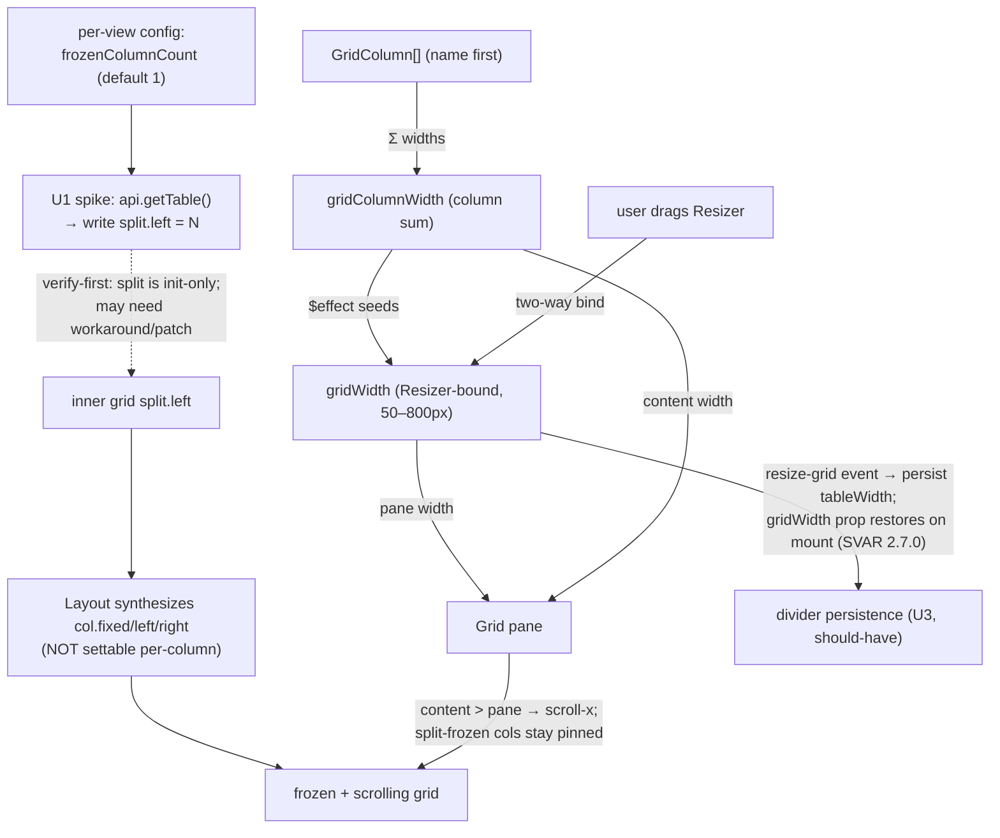

# feat: Gantt frozen columns + grid/timeline divider

> **Outcome (2026-06-18):** Shipped the **divider width persistence** (U3). **Frozen columns (U1/U2) were dropped** after the U1 spike confirmed there's no viable mechanism: SVAR exposes no freeze API in any version, the grid `split` is init-only, and a runtime `tableApi.setState({split})` poke is clobbered by the gantt-store's column recompute on every data change — reliable freezing would need a SVAR wrapper fork. In-vault verification confirmed the freeze poke didn't hold; per the spike's defer-if-unreliable gate, freezing is dropped (revisit if SVAR adds a sanctioned freeze API).

## Summary

Add two coupled grid-layout controls to the Gantt view: **freeze the first N columns** (per-view, default the name column) so they stay pinned while the rest scroll horizontally, and a usable **grid/timeline divider** that sets how wide the grid pane is — with the dragged width **persisted across reload** as a should-have. The divider persistence rides on SVAR's sanctioned grid-width API (`gridWidth` prop + the `resize-grid` action/event), which requires the **SVAR Gantt upgrade to 2.7.0** done as separate prerequisite work (see Prerequisites). The freeze must-have has **no public SVAR API in any version** (column pinning is undocumented; it's driven by the internal grid `split`), so it remains a verify-first spike. Builds on the merged grid-columns feature (PR #77).

> **Prerequisite (separate work):** SVAR Gantt is upgraded 2.3.0 → 2.7.0 and the Gantt revalidated (zoom-preservation diff-sync #73, summary-type handling #75, drag/resize, the grid-columns suite) **before** this plan is implemented. The divider unit (U3) assumes 2.7.0's `gridWidth`/`resize-grid` surface. The freeze unit (U1) does not depend on the upgrade but its spike runs against 2.7.0.

---

## Problem Frame

The grid mirrors the Base's selected columns (PR #77), but the layout is rigid: there's no way to keep the leftmost columns visible when columns exceed the pane, and the grid/timeline split isn't a persisted, user-controlled width.

Grounding (from the SVAR source, verified this session — see Sources):

- **Frozen columns are driven by a grid-level `split`, not per-column flags.** `svelte-grid` `Layout.svelte` (≈104-157) *synthesizes* each column's `fixed`/`left`/`right` from a `split: { left, right }` config (and clobbers non-frozen `fixed` to `0`), so pinning the first N means setting `split.left = N` on the inner grid — which the Gantt wrapper never exposes and consumes only at `dataStore.init()`. Reaching it (via `api.getTable()`) is the must-have's central unknown.
- **The divider already drags in-session.** `Layout.svelte` renders a `Resizer` between `<Grid>` and `<Chart>` with `bind:value={gridWidth}` (clamped 50–800px). `gridWidth` is initialised by `$effect(() => { gridWidth = gridColumnWidth })`, where `gridColumnWidth` is the **sum of column widths**. Because our columns are seed-once, `gridColumnWidth` is stable across plain data refreshes, so a dragged width holds in-session (it resets only on a column-config reseed or a remount).
- **Freezing and the divider are one mechanism.** By default `gridWidth` = the full column sum, so everything fits and freezing is a no-op. Freezing only does anything once the divider narrows the pane **below** the column sum — then the grid scrolls and the `fixed` columns stay pinned.
- **Persistence has no clean hook.** SVAR exposes no grid-width prop or store action (the gantt-store has no width action), and `Layout` doesn't surface the `Resizer`'s `onmove`. So capturing the dragged width and re-applying it on mount needs a confirmed mechanism (likely DOM-level) — hence the verify-first spike, with in-session-only as the accepted fallback (persistence is a should-have).

---

## Key Technical Decisions

- **Freezing is driven by the grid `split`, not per-column `fixed` — and that's the must-have's central risk.** Doc-review correction (feasibility, confidence 100): in `@svar-ui/svelte-grid`, `column.fixed`/`left`/`right` are **synthesized internally** by `Layout.svelte` (≈104-157) from a grid-level `split: { left, right }` config; `centerColumns` clobbers any incoming `col.fixed` to `0`. So marking descriptors `fixed` does nothing. The Gantt wrapper never sets `split` and exposes no prop/action for it (it's consumed once at `dataStore.init()`), so freezing requires reaching the inner grid store via `api.getTable()` and writing `split.left = N` — a path SVAR does not officially sanction. **The freeze feature is therefore a verify-first spike with real feasibility risk (may need a workaround or a SVAR patch), not "enabling and wiring."** A per-view integer option (default 1) supplies N; no per-column pin UI.
- **Freeze-count changes go through the grid `split`, not the columns array.** Because `split` is a grid-store concern (not a `columns` reference change), a freeze-count change should drive a `split` write via `api.getTable()` rather than a seed-once columns rebuild — so it need not re-init the store or reset zoom/scroll (better than the reorder-class reseed first assumed). Confirm in the U1 spike.
- **Lean on SVAR's in-session divider; don't fork it.** The `Resizer` provides the drag (clamped 50–800px by SVAR, which we can't tune via props). The must-have is that it composes correctly with frozen columns + horizontal scroll. We do not reimplement the splitter.
- **Persistence uses SVAR's sanctioned grid-width API (clean on 2.7.0).** The earlier DOM-`ResizeObserver` spike is superseded: SVAR 2.7.0 exposes a `gridWidth` prop (set the initial width) and a `resize-grid` action/event (`api.exec("resize-grid", {width})` to set, `api.on("resize-grid", …)` to observe). U3 captures the dragged width via `resize-grid` → persists to `obsidianGantt.tableWidth`, and restores by seeding the `gridWidth` prop on mount. Persistence stays a **should-have** (user confirmed: in-session drag is the acceptable fallback), but is now low-risk rather than spike-gated — contingent only on the prerequisite upgrade.
- **Reuse the shipped column machinery.** Freeze marking extends `gridColumns.ts`/`buildGridColumns` and `GanttContainer.buildSvarColumns` from PR #77; the freeze count and grid width persist via the same per-view `config.get`/`set` pattern as `columnSize`.

---

## High-Level Technical Design

How `gridWidth`, the column sum, freezing, and horizontal scroll interact (the crux):

The freeze mechanism (dotted, U1) is the verify-first spike. The divider's in-session drag + horizontal scroll is SVAR-default; persistence (U3) is clean on 2.7.0 via the sanctioned `gridWidth`/`resize-grid` API (prerequisite upgrade).

---

## Implementation Units

### U1. Freeze the first N columns (mechanism spike + config)

- **Goal:** A per-view setting freezes the first N grid columns so they stay pinned while the rest scroll. The freeze mechanism is **spike-first**: confirm whether the inner grid's `split` can be driven from our code before committing to the implementation.
- **Requirements:** R1, R2, R3, R4 (see origin).
- **Dependencies:** none (extends PR #77's `register.ts` / `GanttContainer.svelte`).
- **Execution note:** Spike-first — resolve the freeze mechanism in-vault before building the config plumbing around it. If no supported path to set `split` exists without forking SVAR, surface that and decide (workaround vs. defer) rather than shipping inert descriptor flags.
- **Files:** `src/bases/register.ts` (new `frozenColumnCount` view option + read it in `buildGanttData`; expose an `onFrozenColumns`/init hook if the spike needs one), `src/bases/GanttContainer.svelte` (apply the freeze via `api.getTable()` → grid `split`), `test/unit/` (only for any pure helper, e.g. clamping N).
- **Approach:** **Spike (verify-first), correcting the original mechanism.** Per doc-review (confidence 100): per-column `col.fixed` is NOT consumed — `svelte-grid` `Layout.svelte` (≈104-157) derives `fixed`/`left`/`right` from a grid-level `split` and clobbers `centerColumns` `fixed` to `0`. So the spike determines whether we can write `split.left = N` to the inner grid store via `api.getTable(true)` (the same hook PR #77 uses for `resize-column`). `split` is consumed at `dataStore.init()` and has no documented runtime setter, so the spike must establish: can `split` be set post-init (a sanctioned exec/state write), or does it require a workaround (re-init the grid table with a split config) or a SVAR patch? Once the mechanism is known: add a `frozenColumnCount` per-view option (type `number`, default 1, min 0; clamp to `[0, visibleColumnCount]`), read it in `buildGanttData`, and apply N as the grid `split.left` through the confirmed path. SVAR then synthesizes the sticky offsets and the rightmost-frozen shadow itself. **Edit surface** (design): `frozenColumnCount` lives in the per-view `.base` config like the other view options (`columnSize`, scale, etc.), edited via the Bases view-config UI / `.base` file — no bespoke UI.
- **Patterns to follow:** the `api.getTable(true)` hook + `onColumnResize` option/callback wiring in `src/bases/GanttContainer.svelte` / `src/bases/register.ts` (PR #77); the per-view option list + `buildGanttData` wiring in `register.ts`. Authoritative mechanism reference: `@svar-ui/svelte-grid` `Layout.svelte` (≈104-157, the `split`→`fixed` derivation) — **not** `getStyle`/`Cell`, which only consume the already-synthesized values.
- **Test scenarios:**
  - `Test expectation: none` for the freeze mechanism itself — it's SVAR-internal and resolved in-vault by the spike. Unit-test only a pure clamp helper if one is added (freeze clamped to `[0, columnCount]`; default 1).
  - Covers R1, R2. In-vault: freeze=1 pins only the name column; freeze=2 pins name + the first property; the rest scroll. Default (unset) → 1.
  - Covers R3. In-vault: the name column keeps its tree when frozen; a frozen property column keeps its `PropertyCell`.
  - Covers AE3, R4. In-vault: set freeze to 2, reload → still 2 (persists via the per-view config).
  - Edge (in-vault): freeze=0 → no pinned columns, and narrowing the divider still scrolls all columns horizontally with no shadow; freeze ≥ column count → all columns pinned (clamped, no error).
- **Verification:** the freeze mechanism is confirmed (or its infeasibility surfaced) by the spike; in-vault, with the pane narrowed, the first N columns stay pinned while the rest scroll; the name column keeps its tree; freeze count survives reload.

### U2. Verify frozen + scroll + divider composition (and degraded states)

- **Goal:** Confirm the must-have behaviors compose in-vault: with freezing applied (U1) and the divider dragged narrower than the column sum, the non-frozen columns scroll while the first N stay pinned, the in-session divider drag holds, and nothing shipped regresses. This unit is deliberately a **verification + small-CSS seam** dependent on U1's mechanism — the rendering and drag are produced by SVAR, not new code here.
- **Requirements:** R5 (in-session drag), R7 (scroll when narrower), R9 (no regressions). R8 (min-width guard) is **deferred** — see Scope Boundaries.
- **Dependencies:** U1 (the freeze mechanism must land first).
- **Files:** `src/bases/GanttContainer.svelte` (only the CSS needed for the pinned/scrolling boundary — see below; no new logic expected).
- **Approach:** SVAR provides the `Resizer` drag and the grid's horizontal overflow; this unit verifies the composition and pins down two degraded-state decisions the reviewers flagged:
  - **Shadow affordance (design decision):** the boundary shadow between the frozen and scrolling regions should appear **only when the grid is actually scrolled horizontally** (content wider than the pane) — an always-on shadow when nothing is hidden is a visual lie. Prefer SVAR's own scroll-state styling; add a minimal CSS rule only if SVAR doesn't already gate it.
  - **Clipped-state (design decision, ties to deferred R8):** when the pane is dragged below the frozen columns' combined width (SVAR's 50px floor allows this), the frozen cells **truncate via `overflow: hidden`** rather than overflowing the pane — accept this as the degraded state since the true min-width guard is deferred.
  - Confirm in-vault: (a) narrowing past the column sum scrolls non-frozen columns with the first N pinned (R7); (b) the drag holds in-session across plain data refreshes (`gridColumnWidth` is stable for seed-once columns) and resets only on a freeze-change/remount; (c) hierarchy, drag/resize, status coloring, `columnSize` persistence, and zoom/scroll preservation are unaffected (R9).
- **Patterns to follow:** the diff-sync/seed-once handling in `src/bases/GanttContainer.svelte`; SVAR `Layout.svelte` (`gridWidth`/`Resizer`/`gridColumnWidth`), `svelte-gantt` `grid/Grid.svelte` (overflow-x), `svelte-grid` `Cell.svelte` (`wx-fixed`/`wx-shadow`).
- **Test scenarios:**
  - `Test expectation: none` — the rendering/composition is SVAR-internal and verified in-vault, not unit-testable; this unit adds no behavior-bearing logic (CSS only).
  - Covers AE1, AE2. In-vault: freeze=1 then freeze=2 with a narrowed pane → correct pinned set + horizontal scroll; shadow appears only while scrolled.
  - Covers AE4. In-vault: dragging the divider narrows the pane, columns scroll, the timeline widens, and the width holds in-session.
  - Covers AE7. In-vault: with freezing on + a custom divider width, resize a column (persists), edit a task date (zoom/scroll survive), expand/collapse a parent — all unaffected.
- **Verification:** in-vault, frozen + scrolling + divider compose correctly, the shadow only shows while scrolled, clipped frozen cells truncate cleanly, and no shipped behavior regresses.

### U3. Persist and restore the divider width (should-have)

- **Goal:** The dragged grid width survives reload — captured per view and re-applied on mount, using SVAR 2.7.0's sanctioned grid-width API.
- **Requirements:** R6 (and AE5). Should-have (user-confirmed); in-session drag is the acceptable fallback if descoped.
- **Dependencies:** U2; the prerequisite SVAR 2.7.0 upgrade (for `gridWidth`/`resize-grid`).
- **Files:** `src/bases/GanttContainer.svelte` (seed the `gridWidth` prop from persisted config; subscribe to `resize-grid` via `api.on` and call back on commit), `src/bases/register.ts` (`onGridWidthChange` callback → `config.set('tableWidth', …)`; read `tableWidth` at `buildGanttData`/mount and pass as the initial `gridWidth`), `test/unit/` (only for a pure clamp helper, if added).
- **Approach:** **Restore:** read `obsidianGantt.tableWidth` at mount and pass it as the `<Gantt gridWidth={…}>` prop so the grid opens at the saved width (when unset, omit → SVAR's column-sum default). **Capture:** `api.on("resize-grid", ({ width }) => onGridWidthChange(width))` on the gantt API; the register callback merges/writes `config.set('tableWidth', width)`. Debounce the writes. Confirm in-vault that seeding `gridWidth` survives SVAR's internal `gridWidth = gridColumnWidth` effect (which fires on column-sum change) — if a later effect overrides the seeded value, re-assert via `api.exec("resize-grid", { width })` after mount. Mirror the `onColumnResize` callback wiring shape from PR #77.
- **Patterns to follow:** the `onColumnResize` → `config.set('columnSize', …)` persistence path in `src/bases/register.ts` + `GanttContainer.svelte` (PR #77); the `api.on(...)`/`api.exec(...)` usage already in `GanttContainer`; `config.get`/`set` per-view persistence. SVAR docs: `gridWidth` property, `resize-grid` action/event.
- **Test scenarios:**
  - Pure helper (if any, e.g. clamping the restored width to a sane range): unit-tested.
  - Covers AE5. In-vault: drag the divider, reload → the grid opens at the persisted width.
  - In-vault: a persisted width that's seeded via `gridWidth` is not overridden by SVAR's column-sum effect on a later refresh (re-assert via `resize-grid` if it is).
- **Verification:** in-vault, the divider width round-trips across reload via the sanctioned API; or, if descoped, the in-session drag still works and the deferral is recorded.

---

## Scope Boundaries

**In scope**
- Freeze first N columns (per-view, default 1) with pinned rendering + horizontal scroll; a usable in-session divider; divider-width persistence as a should-have.

**Deferred to Follow-Up Work**
- Divider-width persistence (U3) if the spike finds no clean restore mechanism — ship in-session drag, revisit.
- A true min-width guard (R8, and its acceptance example AE6 — "drag past the frozen width → stops at the minimum") preventing the pane from shrinking below the frozen columns' width: SVAR hard-codes the 50–800px `Resizer` clamp with no override, so a real guard would need a DOM workaround. Deferred; the clipped state truncates (U2) in the meantime.
- Tuning the divider's min/max range (SVAR hard-codes 50–800px and exposes no override without forking).

**Deferred for later** (from origin)
- Pinning arbitrary (non-leftmost) columns or a per-column pin toggle; right-side pinning; row/vertical freezing; pinning/collapsing the timeline side.

**Outside this change** (from origin)
- A column-management UI beyond what Bases provides; horizontal virtualization changes.

---

## Risks & Dependencies

- **The freeze mechanism (must-have) may need a SVAR workaround — confidence-100 doc-review finding.** Per-column `col.fixed` is NOT an input contract; `svelte-grid` `Layout.svelte` (≈104-157) synthesizes `fixed`/`left`/`right` from a grid-level `split` and clobbers non-frozen `fixed` to `0`. The Gantt never exposes `split` and it's init-only, so freezing depends on writing `split.left = N` to the inner grid store via `api.getTable()` — unsanctioned and possibly requiring a workaround or SVAR patch. Mitigation: U1 is spike-first; if no supported path exists, surface it and decide (workaround vs. defer) before building plumbing. This is the plan's primary risk — the must-have is feasibility-uncertain, not "enabling and wiring."
- **Prerequisite SVAR upgrade (2.3.0 → 2.7.0) carries Gantt-wide regression risk.** The divider persistence depends on it, and the whole Gantt rides on SVAR behavior (zoom-preservation diff-sync #73, summary-type handling #75, drag/resize). Mitigation: the upgrade is **separate prior work** with its own revalidation (in-vault checks + e2e) — this plan assumes it has landed and 2.7.0 is in place.
- **Divider persistence is clean on 2.7.0 (should-have).** Sanctioned `gridWidth` prop + `resize-grid` action/event (no DOM workaround). Residual risk: a seeded `gridWidth` could be overridden by SVAR's `gridWidth = gridColumnWidth` effect on a column-sum change — mitigation: re-assert via `api.exec("resize-grid", …)` after the effect (U3). User accepted in-session-only as the fallback if even this proves fiddly.
- **Frozen columns are only meaningful once the pane is narrowed.** By design (the two features are one mechanism) — documented so it isn't read as a bug when freezing alone shows no scroll.
- **R8 guard constrained by SVAR's hard-coded clamp.** A pane dragged to SVAR's 50px min can be narrower than the frozen columns' combined width, clipping them; a real guard isn't reachable via props, so R8 is deferred and the clipped state truncates (U2). 
- **Freeze-change application path.** Because `split` is a grid-store concern, a freeze-count change is applied via `api.getTable()` (not a columns-array reseed), so it should avoid a full store re-init / zoom reset — confirm in the U1 spike (better than the reorder-class reseed first assumed).
- **Dependencies:** the merged grid-columns feature (PR #77) — `src/bases/gridColumns.ts`, `src/bases/GanttContainer.svelte` (seed-once columns, `buildSvarColumns`, diff-sync, `onColumnResize` persistence), `src/bases/register.ts` (per-view options, `columnSize`/`getColumnSize`). SVAR `Layout`/`Resizer`/`Grid` internals.

---

## Sources & Research

- Origin requirements: `docs/brainstorms/2026-06-18-gantt-grid-fixed-columns-and-divider-requirements.md`.
- SVAR source (verified this session + doc-review): **freeze mechanism** — `@svar-ui/svelte-grid` `Layout.svelte` (≈104-157) derives `fixed`/`left`/`right` from a grid-level `split` (the authoritative mechanism; `centerColumns` clobbers incoming `fixed` to `0`); `svelte-grid` `Grid.svelte` defaults `split={ left: 0 }`; the `svelte-gantt` grid wrapper forwards no `split` prop and `<Gantt>` exposes none; `@svar-ui/grid-store` consumes `split` only at `init()` with no runtime setter. (`getStyle`/`Cell` only *consume* the already-synthesized `fixed` — not the input contract; the original plan mis-cited these.) **Divider** — `svelte-gantt` `Layout.svelte` (`Resizer` usage, `gridWidth = gridColumnWidth` `$effect`, `gridColumnWidth` = column-sum, `Resizer` `minValue=50`/`maxValue=800`), `Resizer.svelte` (two-way `value` bind, `onmove` not surfaced by Layout), `grid/Grid.svelte` (horizontal overflow-x). No grid-width action in the gantt-store; `api.getTable()` returns the inner grid table API.
- Shipped dependency: PR #77, plan `docs/plans/2026-06-18-001-feat-gantt-grid-bases-columns-plan.md`, code `src/bases/gridColumns.ts`, `src/bases/GanttContainer.svelte`, `src/bases/register.ts`.
- SVAR docs (latest = 2.7.0): the [Resizer guide](https://docs.svar.dev/svelte/gantt/guides/resizer/) documents the `gridWidth` property, the `resize-grid` action (`api.exec("resize-grid", {width})`) and event (`api.on("resize-grid", …)`), and `resize-chart`. The [columns API](https://docs.svar.dev/svelte/gantt/api/properties/columns/) documents `id, width, align, flexgrow, resize, sort, header, footer, template, cell, editor, options, getter` — **no** column freezing/pinning (`fixed`/`sticky`/`split`) in any version. **Version gap:** installed is **2.3.0**, which has neither the `gridWidth` prop nor `resize-grid`/`resize-chart` (confirmed by grep of the installed source/store); they were added in 2.4.x–2.7.0 — hence the prerequisite upgrade. (Resource surfaced by the user during planning.)
- Standard config: `Bases/Gantt Base File.base` (`obsidianGantt.tableWidth`, `columnSize`).
- Institutional learning: `docs/solutions/tooling-decisions/svar-gantt-summary-type-constraints.md` (precedent for SVAR-internal constraints driving design around the wrapper).
- Research provenance: this plan reuses first-hand research from this session (the #77 implementation and a direct read of the SVAR Layout/Resizer/Grid/column source for the origin brainstorm) plus a static confirmation that no grid-width API exists, rather than a fresh broad repo/external research dispatch. External research not run — SVAR is the only relevant technology and its source is in-repo.
