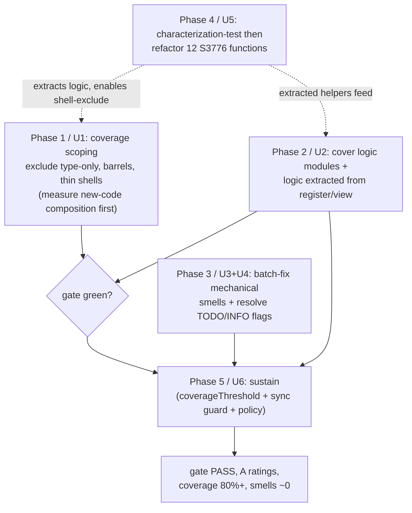

# chore: maximize SonarQube Cloud scores

Drive the SonarQube Cloud project (`renatomen_obsidian-gantt`) to a green quality gate and best-practice scores: keep all four ratings at **A**, push coverage comfortably **≥80%**, and reduce code smells toward **0** — without changing any plugin behavior. Built on a live API assessment (2026-06-20), not estimates. Hardened against a doc-review pass that caught two premise errors (see "Review corrections").

---

## Summary

The project already rates **A** on reliability, security, maintainability, and security-review. The quality gate is **ERROR on exactly one condition** — `new_coverage` 71.3% vs the required ≥80% (Clean-as-You-Code, evaluated on **new/changed code only**). The remaining quality debt is **83 code smells** (0 bugs, 0 vulns): 12 CRITICAL (all cognitive-complexity), 20 MAJOR, 49 MINOR, 2 INFO — most of the MINOR/MAJOR being mechanical TS-idiom rules.

The work proceeds in five phases (six units; Phase 3 carries two), each shippable as its own PR through the existing CI (build + e2e + Test+coverage + Analyze), merged green, and verified against the SonarCloud Web API after merge:

1. **Honest coverage scoping** (U1) — exclude only genuinely non-executable / non-unit-testable code (type-only files, barrels, thin DOM shells). **Logic-dense files are NOT blanket-excluded** — their pure logic is extracted and covered (U2/U5) first.
2. **Cover the testable logic** (U2) — targeted unit tests for the service modules and for logic extracted out of the glue files.
3. **Batch-fix the mechanical smells** (U3) by rule family + **resolve the TODO/INFO flags** (U4).
4. **Refactor the 12 cognitive-complexity functions** (U5) — characterization-test first, then extract sub-functions.
5. **Sustain** (U6) via an enforceable Clean-as-You-Code guard.

**Risk posture (from the review):** U1+U2 are the high-value, low-risk core (clears the gate, covers real logic). U3–U5 edit a working, shipped plugin to drive an already-A rating toward zero smells — worthwhile under the maintainer's chosen "thorough" scope, but **gated by characterization tests** (KTD5/R5) because the existing suite does not cover all the code they touch.

---

## Problem Frame

SonarQube "scores" = the quality gate (pass/fail) + the A–E ratings + coverage % + duplication %. After migrating to CI-based analysis (PR #113), the real picture emerged: ratings are all A, duplication 0.9%, but coverage reads low because the V8 coverage run (`collectCoverageFrom: src/**/*.ts`) forces files with no test into the LCOV report at 0% — including pure type declarations, barrel re-exports (`src/scheduling/index.ts` is literally `export {}`), and thin Obsidian DOM/registration shells. Those drag overall coverage down.

**Critical distinction (the gate is new-code-only).** The *failing* condition is `new_coverage`, computed by SonarCloud over **lines changed in the new-code period**, not the overall denominator. Coverage **exclusions** (`sonar.coverage.exclusions`) shrink *both* denominators; the Jest `collectCoverageFrom` change shrinks the LCOV report (overall). Whether scoping alone moves `new_coverage` depends entirely on whether the excluded files had *changed lines* in the new-code window — this must be **measured, not assumed** (U1).

The genuine remediation surface: (a) make the metric measure *testable* code honestly — excluding only code with no unit to test, and **extracting** logic out of logic-dense glue rather than hiding it; (b) actually cover the testable logic; (c) clean up accumulated smells under a characterization-test safety net.

This is a quality/CI chore: **no plugin behavior changes**. Every code edit must be proven behavior-neutral — and because parts of the touched code are currently uncovered, "proven" requires characterization tests, not just the existing suite (KTD5).

---

## Requirements

- **R1** — Quality gate **PASS**: `new_coverage` ≥ 80% (and all other gate conditions remain OK).
- **R2** — All four ratings remain **A** (reliability, security, maintainability, security-review).
- **R3** — Overall coverage and new-code coverage both comfortably **≥ 80%** on the testable surface.
- **R4** — Code smells driven down: **0 CRITICAL, 0 MAJOR**, MINOR minimized (resolve or justifiably dismiss).
- **R5** — **No behavior change**, *proven*: any edit to a function below ~80% coverage is preceded by a **characterization test** pinning current behavior (KTD5). The 431-test unit suite + full e2e stay green on every PR. (e2e proves DOM rendering, not branch-level conversion/selection logic — so it does not substitute for unit coverage of that logic.)
- **R6** — Coverage exclusions are **honest** — only files with *no unit to test* are excluded (type-only, barrels, thin DOM shells). Logic-dense files are extracted-and-covered, never blanket-excluded. Every exclusion glob carries a one-line rationale.
- **R7** — **Sustained via an enforceable guard**, not docs alone: a Jest `coverageThreshold` that fails `npm run test:coverage` on a coverage drop, plus a guard test that the two exclusion layers stay in sync, plus the documented policy.

---

## Key Technical Decisions

- **KTD1 — Exclude only code with no unit to test; extract logic out of glue rather than hiding it.** Three buckets:
  - **Exclude (no testable unit):** type-only files (`**/types/**`, `*.d.ts`), barrel `index.ts` re-exports, and *thin* Obsidian shells that are pure framework wiring (`src/main.ts`, `src/bases/GanttBasesView.ts`, and the residual registration shell of `src/bases/register.ts` after extraction).
  - **Extract-then-cover (logic-dense — do NOT blanket-exclude):** `src/bases/register.ts` and `src/bases/views/GanttTaskListView.ts`. The review flagged the contradiction of excluding these while U5 names them as complexity hotspots — a file dense enough to be a complexity hotspot has testable logic. Their pure logic (mapping/arrow/cascade/indicator readers in register; hierarchy build, parent-link resolution, property formatting in the view) is extracted to tested modules (the `fieldMappingConfig.ts` precedent), covered in U2, and only the residual DOM/registration shell is excluded.
  - **`CascadeConfirmModal.ts`:** inspect at execution time — extract any decision logic; exclude only if it is pure Modal UI.
- **KTD2 — Do not lower the gate threshold.** Keep the Sonar-way `new_coverage ≥ 80%`. We meet the bar, not move it.
- **KTD3 — Two coverage layers, correctly understood.** `jest.config.mjs` `collectCoverageFrom` globs **only `.ts`** — so the existing `*.svelte` exclusion lives **solely** in `sonar.coverage.exclusions`, *not* in Jest config. Adding `.ts` glue/type/barrel exclusions to `collectCoverageFrom` is therefore a **new** change, not "mirroring." Both layers must end up with identical *file sets*; U6 adds a guard test so they cannot drift.
- **KTD4 — Smell fixes are idiom-level and behavior-neutral.** `readonly`, optional chaining, redundant assertions/type-args/unions, unused imports — none change runtime behavior. Batch by rule family so a regression is easy to bisect.
- **KTD5 — Characterization-first is a hard gate, not a note.** No S3776 extraction (U5) and no smell-fix (U3) lands on a function below ~80% coverage until a characterization test pins its current behavior. The existing suite cannot prove neutrality for code it does not execute; this closes that circular gap.
- **KTD6 — Prefer extracting logic out of glue over excluding it.** Where a glue file contains cleanly-separable pure logic, extract it into a testable module and cover it (U2/U5) rather than hiding it behind an exclusion. This is the resolution to the KTD1 contradiction and a standing rule (U6).
- **KTD7 — Ship per phase; verify against the API.** Each phase is its own PR, merged green. After each merge, query the SonarCloud Web API (`api/measures/component`, `api/qualitygates/project_status`, `api/issues/search`) to confirm the numbers moved as intended and nothing regressed. For U1 specifically, also pull the **new-code** coverage composition (`new_uncovered_lines`) to confirm what is actually moving the gate.

---

## High-Level Technical Design

Five phases; each an independent PR. Phase 3 carries two units (U3 mechanical fixes, U4 TODO/INFO triage — both smell cleanup, independent of each other). For the two logic-dense files, the U5/U2 extraction is a **prerequisite** of their U1 exclusion (the residual shell can only be excluded once the logic is out).

Verification loop per phase: PR → CI green → merge → main `Analyze` run → SonarCloud API check (measures + gate + issue facets; + new-code composition for U1) → confirm intended delta, no regression.

---

## Implementation Units

### U1. Honest coverage scoping

- **Goal:** Make the coverage metric measure testable code only, by excluding files with **no unit to test** in both the Jest LCOV report and Sonar — *without* excluding logic-dense files (those go through U2/U5 first).
- **Requirements:** R1 (partial — see verification), R3, R6.
- **Dependencies:** For the two logic-dense files, the residual-shell exclusion depends on U2/U5 extraction. The type-only/barrel/thin-shell exclusions have no dependency and can land immediately.
- **Files:**
  - `sonar-project.properties` — extend `sonar.coverage.exclusions` (currently `**/*.svelte,src/**/*.d.ts`) with: `**/types/**`, `src/**/index.ts` (barrels), `src/main.ts`, `src/bases/GanttBasesView.ts`. Add `src/bases/register.ts` and `src/bases/views/GanttTaskListView.ts` **only after** their logic is extracted (U2/U5), and scope to the residual shell if practical.
  - `jest.config.mjs` — add the **same** globs as negative entries to `collectCoverageFrom` (new change — these were never there; KTD3).
- **Approach:** First, **measure the new-code composition**: pull `new_uncovered_lines` / the PR new-code coverage breakdown from the API to determine whether the gate gap lives in excludable files or in testable logic. If the gap is in testable logic, U2 is the gate-clearer and U1 is a denominator-cleanup precondition — do not claim U1 clears the gate alone. Each excluded glob carries a one-line rationale (type-only / barrel / thin shell). Scan each candidate file for separable logic before excluding (KTD1/KTD6); anything found routes to U2/U5.
- **Patterns to follow:** the existing `sonar.coverage.exclusions` line; the `collectCoverageFrom` array in `jest.config.mjs`.
- **Test scenarios:** `Test expectation: none -- coverage-config only.` Capture before/after `text-summary` locally and attribute the delta per glob family (some type-only files are already 0/0 lines and contribute nothing — document which globs actually moved the number, so R6's rationale is evidence-backed).
- **Verification:** local `npm run test:coverage` shows the metric scoped to testable files; after merge, `api/measures/component` `coverage` rises and the **new-code composition** is understood. Whether `new_coverage` ≥ 80% is reached here or only after U2 is confirmed against the API, not assumed.

### U2. Cover the testable logic (modules + logic extracted from glue)

- **Goal:** Raise real coverage on genuinely-testable logic: `PropertyMappingService` (74.4%), `BasesDataAdapter` (82.6%), any sub-80% controller/datasource logic, **and the pure logic extracted out of `register.ts` / `GanttTaskListView.ts`** (KTD6).
- **Requirements:** R1 (likely the actual gate-clearer), R3, R5.
- **Dependencies:** U1 (post-U1 report shows true remaining gaps); paired with U5's extraction for the two glue files.
- **Files:**
  - `test/unit/PropertyMappingService.test.ts`, `test/unit/BasesDataAdapter.test.ts` (extend).
  - New test files for logic extracted from `register.ts` (e.g., arrow-mode/cascade-mode/indicator/tableWidth readers → a tested config module) and `GanttTaskListView.ts` (hierarchy build, `resolveParentLink`, `stripPropertyPrefix`, `formatPropertyValue` → tested helpers).
  - Extended specs for remaining sub-80% logic in `src/controller/*`, `src/datasource/*` — exact files from the post-U1 report.
- **Approach:** Target the *uncovered branches/lines* reported per file (pull via `api/measures/component_tree?metricKeys=uncovered_lines` + local LCOV). Pure functions get direct unit tests; collaborators injected (existing DI pattern). The extraction itself (moving logic out of the glue files) is shared with U5 — do it once, cover it here.
- **Patterns to follow:** `test/unit/readFieldMappings.test.ts`, `test/unit/readDatePolicyConfig.test.ts`, `test/unit/PropertyMappingService.test.ts`, `test/unit/BasesDataAdapter.test.ts`; the `fieldMappingConfig.ts` extraction precedent.
- **Test scenarios:**
  - **PropertyMappingService** — happy: configured mapping → expected SVAR field; edge: empty/unset `parentProperty` → no parent; error: mapping at a non-date field → `MappingValidationError` (not silently accepted); boundary: progress clamp 0/100/out-of-range if owned here.
  - **BasesDataAdapter** — happy: `extractDate`/`extractProgress`/`extractText`/`extractParents` return raw natives; edge: missing/empty → `null` (not `''`/formatted); date: ISO↔Date round-trip, non-empty-unparseable → `null` + diagnostic; group-key: `convertGroupKeyToString` formats a Date header.
  - **extracted register/view helpers** — hierarchy build with valid/missing/circular parents; `resolveParentLink` for wikilink/markdown-link/bare-path/unresolvable; arrow-mode/cascade-mode normalization defaults; property formatting for Date/array/object/primitive/null.
  - **controller/datasource gaps** — date-policy inference for partial/undated tasks; composite-source delegation.
- **Verification:** each targeted file's coverage rises (LCOV + Sonar component-tree); overall + new coverage clear 80% with margin; gate green; all tests green.

### U3. Batch-fix mechanical smells (idiom-level)

- **Goal:** Eliminate the mechanical MINOR/MAJOR smells in grouped, low-risk commits by rule family.
- **Requirements:** R4, R5.
- **Dependencies:** none, **except** KTD5 — any target function below ~80% coverage gets a characterization test first.
- **Files:** across `src/**` where each rule fires — exact sites via `api/issues/search?rules=typescript:Sxxxx`.
- **Approach:** One commit per rule family (bisectable; KTD4). Run `npm run lint`, `npm run typecheck`, `npm test` after each. Rule families: `S2933` (→`readonly`), `S6582` (optional chaining), `S4325`/`S6571`/`S6594` (redundant assertions / union members / `RegExp.exec`), `S1128` (unused imports), and the minor S77xx modern-TS rules (`S7773`, `S7735`, `S7786`, `S7770`, `S6551`, `S6564`, `S4043`). **Before starting, run `api/issues/search?severities=MAJOR` and map each MAJOR to its rule** — if any MAJOR is `S3776`, it belongs to U5; account for all 20 MAJOR across U3+U4+U5 before claiming "0 MAJOR."
- **Patterns to follow:** existing code style; `eslint`/`prettier` config.
- **Test scenarios:** `Test expectation: none for already-covered lines -- behavior-neutral idiom changes proven by the existing suite. For any target below ~80% coverage: add a characterization test first (KTD5).` Each rule family leaves `npm test` + `npm run typecheck` green.
- **Verification:** `api/issues/search` shows targeted rules at 0; unit + e2e green; ratings stay A.

### U4. Resolve `S1135` TODO flags + remaining INFO

- **Goal:** Triage the 2 `S1135` TODO flags + 2 INFO issues — fix, convert to a tracked reference, or dismiss with justification.
- **Requirements:** R4.
- **Dependencies:** none. (Phase 3 alongside U3; independent of it.)
- **Files:** files with the flagged TODOs (via `api/issues/search?rules=typescript:S1135`).
- **Approach:** Per TODO: do it if trivial; convert real deferred work to a concrete reference (issue/`docs` pointer) so it's no longer a bare TODO; else mark the Sonar issue "won't fix" with a one-line rationale. Don't delete a TODO that documents real intent without capturing it elsewhere.
- **Test scenarios:** `Test expectation: none -- comment/triage only.`
- **Verification:** `S1135` count is 0 (fixed or dismissed-with-reason); no bare TODO hiding real work.

### U5. Refactor the 12 cognitive-complexity functions (`S3776`)

- **Goal:** Clear all 12 CRITICAL cognitive-complexity smells — by extraction where the code is (or becomes) testable, by justified dismissal where it is pure unmeasurable glue.
- **Requirements:** R4, R5, R2.
- **Dependencies:** U2 (test scaffolding); shares the register/view extraction with U2.
- **Files:** the 12 functions' files — identified first via `api/issues/search?rules=typescript:S3776`. Likely in `src/bases/register.ts`, `src/controller/GanttController.ts`, `src/bases/services/BasesDataAdapter.ts`, `src/bases/views/GanttTaskListView.ts`. Confirm the exact 12 at execution time.
- **Approach (split the 12 — review finding):**
  - **(a) Functions in covered/coverable modules** — full extract-helper treatment: decompose into named helpers, behavior-preserving, public signature stable; cover the extracted pure helpers (feeds U2). For the two logic-dense glue files, extract the logic *out* into tested modules (KTD6) — this is what makes their U1 shell-exclusion honest.
  - **(b) Functions in genuinely-unmeasurable glue** (if any remain after extraction) — prefer marking the Sonar issue "won't fix" with a rationale over refactoring code the unit tests can't reach. Document the (a)/(b) split.
- **Execution note (hard gate — KTD5):** characterization test before any extraction on a sub-80%-covered function; refactor under green. One function per commit.
- **Patterns to follow:** the `fieldMappingConfig.ts` extraction (logic pulled out of `register.ts` into a tested module).
- **Test scenarios:**
  - Each refactored function: a test exercises its primary behavior **before** the refactor and stays green after (neutrality proof).
  - Each extracted **pure** helper: direct unit test (happy + the edge that drove the original branch).
  - Integration: dependent view/controller behaviors still render/select (existing unit + e2e).
- **Verification:** `api/issues/search?rules=typescript:S3776` count is 0; CRITICAL count 0; maintainability still A with reduced debt; unit + e2e green.

### U6. Sustain via an enforceable Clean-as-You-Code guard

- **Goal:** Lock in the result so new code stays ≥80% covered and the gate stays green — with real enforcement, not just docs (review finding: docs-only is not a "guard").
- **Requirements:** R7, R1.
- **Dependencies:** U1–U5.
- **Files:**
  - `jest.config.mjs` — add a `coverageThreshold` (global, on the now-scoped surface) set at/just below the achieved level so it ratchets; `npm run test:coverage` fails on a drop, catching regressions before Sonar.
  - `test/unit/coverageExclusionsInSync.test.ts` (new) — guard test asserting the `collectCoverageFrom` negative-globs and `sonar.coverage.exclusions` describe the **same file set** (precedent: `noBarePluginConfigKeys` grep-guard, PR #110) — closes the two-layer drift risk (KTD3).
  - `AGENTS.md`, `docs/conventions/testing.md` — document the policy: new code ≥80% covered, no new CRITICAL/MAJOR smells, the exclusion policy, **and the standing rule that any new logic added to an excluded file must be extracted to a tested module** (else the gate stays green by no longer measuring the riskiest code — the review's sustain liability).
- **Approach:** Threshold + sync-guard are the enforcement; the docs carry the why and the standing extraction rule.
- **Test scenarios:** the sync-guard test (above) is itself the test: it passes when the two layers match and fails on divergence. For `coverageThreshold`: verify `npm run test:coverage` passes at current coverage (manual check on a deliberate drop).
- **Verification:** threshold guard passes at current coverage; sync-guard green; AGENTS.md + testing.md state the policy + extraction rule; gate remains green on a subsequent unrelated PR.

---

## Scope Boundaries

### Deferred to Follow-Up Work
- Tightening the gate **above** Sonar-way defaults (90%, zero MINOR) — revisit after the baseline is clean.
- SonarCloud project-key rename (`renatomen_obsidian-gantt` → repo name) — cosmetic, tracked separately.

### Outside this product's identity
- **Lowering the gate threshold** to pass — rejected (KTD2).
- **Any plugin behavior change** — quality chore; behavior invariant (R5).
- **The paused M3 dependency-authoring work** (plan 001).
- **e2e-measured coverage of the residual DOM/view shells** — excluded from the metric, not unit-or-e2e-coverage targets (per the confirmed call-out). The *logic* in those files is extracted and unit-covered (KTD6); only the thin shell is out.

---

## Risks & Dependencies

- **Behavior regression on uncovered code (HIGH — elevated by review).** U3/U5 edit functions the existing suite does not fully cover; the suite cannot prove neutrality for code it doesn't execute. Mitigation: KTD5 makes a characterization test a **hard gate** before any such edit; one function/rule-family per commit; e2e is not treated as a substitute for branch coverage.
- **Over-exclusion / metric-gaming (HIGH — the review's P1).** Excluding a logic-dense file hides real gaps. Mitigation: KTD1/KTD6 — `register.ts` and `GanttTaskListView.ts` are extract-then-cover, never blanket-excluded; only type-only/barrel/thin-shell files are excluded, each with a rationale; U6 documents extraction as a standing rule.
- **U1 does not clear the gate alone (MEDIUM — the review's cross-persona P1/P2).** The gate is new-code coverage; exclusions mainly move the overall denominator. Mitigation: U1 measures the new-code composition first; U2 is the expected gate-clearer if the gap is in testable logic. Do not sequence on the assumption that U1 standalone passes the gate.
- **Two-layer exclusion drift (MEDIUM).** `collectCoverageFrom` and `sonar.coverage.exclusions` can diverge. Mitigation: U6 sync-guard test.
- **Sustain blind spot (MEDIUM).** Excluding glue means future logic added *to* those files is unmeasured and the gate stays green spuriously. Mitigation: U6 standing extraction rule + documented liability.
- **Sonar processing lag (LOW).** Wait for the main `Analyze` run before re-querying.
- **Dependency:** SonarCloud Web API via the `.env` `SONAR_TOKEN` (verified) for the per-phase verification loop.

---

## Review Corrections (doc-review, 2026-06-20)

Integrated from a 4-persona doc-review pass:
- **Resolved the exclude/refactor contradiction (adversarial P1):** `register.ts` and `GanttTaskListView.ts` are no longer blanket-excluded; their logic is extracted-and-covered (KTD1/KTD6/U2/U5).
- **Corrected the "U1 clears the gate" claim (feasibility + adversarial P1):** U1 now measures new-code composition; U2 is the expected gate-clearer.
- **Corrected the `*.svelte` mechanism error (adversarial P2):** the svelte exclusion is sonar-side only; adding `.ts` exclusions to `collectCoverageFrom` is a new change (KTD3).
- **Made characterization-first a hard gate (adversarial P2):** KTD5/R5 — the existing suite can't prove neutrality on uncovered code.
- **Made the sustain guard enforceable (scope P2):** U6/R7 — real `coverageThreshold` + sync-guard test, not docs-only.
- **Fixed the phase/unit count (coherence P1):** five phases, six units, Phase 3 = U3+U4.

---

## Sources & Research

- Live SonarCloud Web API assessment, 2026-06-20: all ratings A; gate ERROR only on `new_coverage` (71.3 < 80); 83 smells (12 CRITICAL S3776, 20 MAJOR, 49 MINOR, 2 INFO); top rules and worst-covered files as in the Summary/Problem Frame.
- CI-based analysis pipeline: `.github/workflows/sonar.yml`, `sonar-project.properties`, `jest.config.mjs` (V8 coverage); PRs #113–#115, #122.
- Testable-logic extraction precedent: `src/bases/fieldMappingConfig.ts` + `test/unit/readFieldMappings.test.ts` (PR #111); `noBarePluginConfigKeys` grep-guard (PR #110) as the mechanical-guard precedent for U6's sync-guard.
- Coverage-exclusion precedent: the `*.svelte` entry in `sonar-project.properties` (sonar-side only — KTD3).

---

## Deferred to Implementation
- Exact uncovered lines/branches per file (U2), the exact 12 `S3776` functions and their (a)/(b) split (U5), and the MAJOR-rule attribution (U3) — pulled from the API + LCOV at execution time, as they shift while U1/U2/U3 land.
- The precise residual-shell boundary for `register.ts`/`GanttTaskListView.ts` after extraction — determined once the logic is pulled out (U2/U5), before adding their exclusion globs (U1).
- The exact `coverageThreshold` percentages (U6) — set once the achieved coverage level is known.
