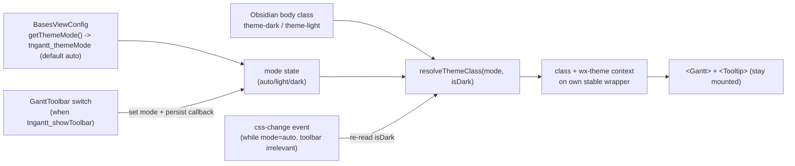

# feat: Gantt theme-aware toolbar (dark/light/auto)

## Summary

Make the Gantt theme-aware — it follows Obsidian's dark/light mode by default (fixing today's always-light gap), and gains an optional per-view toolbar carrying an **Auto / Light / Dark** switch to override per chart. The theme is applied by **replacing the hardcoded SVAR `<Willow>` wrapper with our own theme wrapper whose theme class is reactive**, so the `<Gantt>` instance is never remounted (zoom/scroll/selection preserved). Origin: [docs/brainstorms/2026-06-21-gantt-toolbar-theme-toggle-requirements.md](docs/brainstorms/2026-06-21-gantt-toolbar-theme-toggle-requirements.md).

This plan was hardened by a `ce-doc-review` pass that corrected a key assumption: the SVAR `wx-theme` **context is load-bearing** (it themes portalled content — the existing dependency Tooltip), so the replacement wrapper must replicate it.

---

## Problem Frame

The Gantt hardcodes SVAR's light theme — `<Willow fonts={false}>` wraps the chart at [src/bases/GanttContainer.svelte:1024](src/bases/GanttContainer.svelte#L1024) — and ignores Obsidian's active theme, so dark-mode users get a jarring bright panel. Users want the chart to match their theme, with a way to override. A toolbar is the control surface (a prior zoom-only toolbar was removed as redundant with the floating +/- control — the new one must earn its place with the theme control, not re-add zoom).

**Verified mechanism (drives the approach):** SVAR themes are a **CSS class + CSS custom properties** *plus a Svelte context*. The core `Willow`/`WillowDark` components each `setContext("wx-theme", "willow"|"willow-dark")` and render `
`, with `--wx-*` variables defined under `:global(.wx-willow-theme)` / `:global(.wx-willow-dark-theme)`. The gantt-level theme components compose three layers — core (base palette) + grid (table vars) + gantt (`--wx-gantt-*`). Switching theme = switching the class (no component swap, no remount). **But** `Portal.svelte` reads `getContext("wx-theme")` to theme portalled content, and GanttContainer already mounts `<Tooltip>` (the dependency tooltip) which uses Portal — so the context is **not** cosmetic and must be preserved by any replacement wrapper.

All configuration is per-Bases-view (`tngantt_*` options via `BasesViewConfig` get/set); there is no global settings tab. This feature targets the **Gantt** Bases view (the SVAR chart), not the separate TaskList view. The `css-change` workspace event used for auto-follow is a real Obsidian API (confirmed in `obsidian.d.ts`).

---

## Requirements (from origin)

- **R1** Auto-follow Obsidian theme by default; live-update on Obsidian theme change; applies regardless of toolbar visibility.
- **R2** Per-view `tngantt_showToolbar` toggle (default **off**) controls toolbar visibility.
- **R3** When shown, toolbar presents an Auto / Light / Dark switch.
- **R4** Light/Dark overrides for that view; Auto returns to following Obsidian; choice persists per-view.
- **R5** Override is Gantt-scoped — never changes Obsidian's own theme.
- **R6** Auto-follow works with the toolbar hidden (toolbar only needed to override).
- **R7** v1 toolbar contains only the theme switch (no zoom).

---

## Key Technical Decisions

1. **Replace `<Willow>` with our own theme wrapper; toggle its class (no remount) — and replicate the SVAR context (R1, R4, R5).** `<Willow>` hardcodes its class in markup (no prop to change it), so U2 *replaces* the SVAR theme component with our own stable wrapper element: `
` containing `<Gantt>`, where `effectiveThemeClass` is reactive (`wx-willow-theme` ↔ `wx-willow-dark-theme`). Toggling the class re-applies the CSS variables instantly with zero remount. **Critically, the wrapper must also `setContext('wx-theme', 'willow'|'willow-dark')` reactively** — `Portal.svelte` reads it to theme the existing dependency Tooltip; dropping it would render that tooltip unthemed. Do **not** conditionally render `<Willow>` vs `<WillowDark>` (that swap remounts the chart subtree). Note the own wrapper won't emit the `<svelte:head>` CDN font/icon links that `<Willow>` does — that is the existing `fonts={false}` intent and is desirable here; confirm icon rendering is unaffected.

2. **Effective theme is pure, resolvable logic (R1, R3, R4).** A pure resolver maps `(mode, obsidianIsDark) → themeClass`: `auto → obsidianIsDark ? dark : light`; `light → light`; `dark → dark`. This isolates the only real logic into a unit-testable module; the DOM/Obsidian read is a thin separate helper, injectable for testing.

3. **Auto-follow reads Obsidian's theme + subscribes to changes (R1, R5, R6).** Read `document.body` for the `theme-dark` / `theme-light` class for the current theme; subscribe to Obsidian's `css-change` workspace event (a `MutationObserver` on the body class is the fallback) and re-resolve while in Auto mode. The subscription lives in the chart container independent of toolbar visibility (R6). The class is applied only to the Gantt's own wrapper, never to `document.body` — Obsidian's theme is untouched (R5).

4. **Per-view persistence via the existing config mechanism, with an explicit reader + callback (R2, R4).** Toolbar visibility is a `tngantt_showToolbar` toggle option (default off) in `ganttViewOptions`. The theme **mode** is persisted as `tngantt_themeMode` (default `auto`) via `BasesViewConfig`: a `getThemeMode()` reader in `register.ts` (mirroring `getArrowMode()` / `getShowDateIndicators()`) supplies the initial mode; `register.ts` passes a **persist callback closing over `this.config.set('tngantt_themeMode', …)`** down to the toolbar, which calls it on change. `tngantt_themeMode` is intentionally not an options-panel entry (the toolbar is its UI).

5. **Toolbar is a small dedicated component, rendered conditionally (R2, R7).** A `GanttToolbar.svelte` shown above the chart only when `tngantt_showToolbar` is on; v1 content is the theme switch alone. Its change callback updates the live theme state (KTD 1/2) and persists the mode (KTD 4).

---

## High-Level Technical Design

Theme state flow (no remount — only the wrapper's class + context change):

The toolbar and the Obsidian event both feed the same `mode`/`isDark` inputs; the resolver output is a class string + context value on a wrapper that never unmounts.

---

## Implementation Units

### U1. Theme resolver + Obsidian theme detection

**Goal:** Isolate the effective-theme logic and the Obsidian theme read/subscribe into a tested module.
**Requirements:** R1, R3, R4, R5.
**Dependencies:** none.
**Files:** `src/bases/themeResolver.ts` (new), `test/unit/themeResolver.test.ts` (new).
**Approach:** Export a pure `resolveThemeClass(mode, obsidianIsDark)` returning the SVAR theme class, and a matching `resolveThemeContext(mode, obsidianIsDark)` returning `'willow' | 'willow-dark'` (for the wx-theme context). Export thin helpers `isObsidianDark()` (reads the body `theme-dark` class) and `subscribeObsidianTheme(app, cb)` (subscribes to the `css-change` workspace event; returns a disposer; MutationObserver fallback). Keep the pure resolvers free of any DOM/Obsidian import so they unit-test in isolation; make the detection helpers injectable so U2's behavior is testable without a live Obsidian.
**Patterns to follow:** the pure-logic-in-a-tested-module style of `src/bases/statusColor.ts` / `src/bases/datePolicyConfig.ts`.
**Test scenarios:**
- `resolveThemeClass('auto', true)` → dark class; `('auto', false)` → light class. (Covers F1/F3.)
- `resolveThemeClass('light', true)` → light class; `('dark', false)` → dark class (override ignores Obsidian). (Covers F2.)
- `resolveThemeContext` mirrors the class mapping (`willow` / `willow-dark`).
- Unknown/missing mode defaults to `auto` behavior.
**Verification:** resolver unit tests pass; the pure module has no DOM import.

### U2. Replace the SVAR wrapper; apply theme + context reactively without remount

**Goal:** Replace the hardcoded `<Willow>` with our own stable wrapper whose theme class **and** `wx-theme` context are reactive; subscribe to Obsidian changes while in Auto. The `<Gantt>` and `<Tooltip>` are never re-created.
**Requirements:** R1, R5, R6.
**Dependencies:** U1 (and consumes the `mode` prop from U3; can be developed against an injected/hardcoded mode until U3 lands).
**Files:** `src/bases/GanttContainer.svelte`.
**Approach:** Remove `<Willow fonts={false}>` and wrap the chart in our own element: `
` with `setContext('wx-theme', effectiveThemeContext)` set reactively from U1's resolvers. Hold `mode` as reactive state (seeded from the `themeMode` prop, U3) and `isDark` from `isObsidianDark()`. The wrapper element and `<Gantt>` must never be re-created on theme change (consistent with the existing "never reassign the arrays handed to `<Gantt>`" discipline) — only the class/context value changes. **Ensure both themes' full CSS is bundled:** import both gantt-level `Willow` + `WillowDark` for their `:global` CSS side-effects, which transitively pull the core + grid layers; this is a hard requirement, not optional (verify in the build, below). While `mode === 'auto'`, subscribe via `subscribeObsidianTheme` and update on change; dispose on unmount. Verify the dependency `<Tooltip>` (Portal) still themes correctly after the wrapper change, including after a mid-session theme switch (Svelte context isn't reactive for already-mounted descendants — accept "tooltip re-themes on next open" if a live re-theme isn't clean, and note it).
**Patterns to follow:** the no-remount reactive `$state` + diff-sync approach already used for `GanttData`; the existing `onunload`/dispose cleanup.
**Test scenarios:**
- Unit (with an injected `subscribeObsidianTheme`/`isObsidianDark`): simulating a `css-change` while `mode='auto'` updates the wrapper's class without re-creating the Gantt instance (assert instance identity / that no remount hook fired). (Covers R1/R6.)
- E2E: with Obsidian dark + mode auto **and the toolbar hidden**, the chart wrapper carries the dark class (proves R6 — auto works without the toolbar).
- E2E: the dependency tooltip renders themed (not `wx-undefined-theme`) after the wrapper replacement.
**Verification:** chart renders dark when Obsidian is dark + mode auto (toolbar hidden); switching the body theme updates the chart with no remount (scroll/zoom preserved); the dependency tooltip is themed; **`dist` CSS contains both light and dark rule-sets across all three layers** — grep the built stylesheet for a dark *base* var (e.g. core `--wx-background` under `.wx-willow-dark-theme`) and a dark *grid* var, not merely the class name.

### U3. Per-view toolbar toggle option + theme-mode persistence

**Goal:** Add the `tngantt_showToolbar` option and wire per-view persistence of the theme mode with an explicit reader + persist callback.
**Requirements:** R2, R4.
**Dependencies:** U1.
**Files:** `src/bases/viewOptions.ts` (add toggle to `ganttViewOptions`), `test/unit/viewOptions.test.ts` (extend), `src/bases/register.ts` (add `getThemeMode()` reader + read `tngantt_showToolbar`; pass `showToolbar` + initial `themeMode` + a persist callback to `GanttContainer`), `src/bases/GanttContainer.svelte` (accept `showToolbar` + `themeMode` props + the persist callback).
**Approach:** `tngantt_showToolbar` is a `type: 'toggle'` option, default off, in `ganttViewOptions` (mirrors `tngantt_showUndatedTasks` etc.). Add `getThemeMode()` to `register.ts` — `this.config.get('tngantt_themeMode')` normalized to `'auto'|'light'|'dark'`, default `'auto'` (mirrors `getArrowMode()`). `register.ts` passes a persist callback that closes over `this.config.set('tngantt_themeMode', …)` down through `GanttContainer` to the toolbar (the toolbar does not touch config directly). No options-panel entry for `tngantt_themeMode`.
**Patterns to follow:** the existing `tngantt_show*` toggle options in `viewOptions.ts`; the `getArrowMode()` / `getShowDateIndicators()` config readers in `register.ts`.
**Test scenarios:**
- `ganttViewOptions()` includes a `type: 'toggle'` option with key `tngantt_showToolbar`. (Covers R2.)
- `getThemeMode()` returns `'auto'` when unset and the stored value when set; normalizes an unexpected value to `'auto'`. (Covers R4 persistence.)
**Verification:** the toggle appears in the view's options panel; toggling it persists; `getThemeMode()` round-trips the stored mode.

### U4. Toolbar component with the Auto/Light/Dark switch

**Goal:** Render the toolbar (when enabled) with the theme switch wired to live state + persistence.
**Requirements:** R2, R3, R4, R7. (R6 is owned by U2 — this unit's verification focuses on the toolbar interaction.)
**Dependencies:** U2, U3.
**Files:** `src/bases/GanttToolbar.svelte` (new), `src/bases/GanttContainer.svelte` (render it above the chart when `showToolbar`).
**Approach:** A slim toolbar shown only when `showToolbar` is true, containing a 3-state Auto/Light/Dark control (segmented control or dropdown — affordance is an implementation detail). On change: set the live `mode` (U2) and call the persist callback (U3). v1 holds only this control (R7). Style via Obsidian CSS variables so it reads as native.
**Patterns to follow:** existing Svelte components in `src/bases/` (`PropertyCell.svelte`, `GanttContainer.svelte`) for styling/scoping.
**Test scenarios:** Test expectation: none new at unit level (Svelte/DOM). Covered by e2e (below).
**Verification:** with `tngantt_showToolbar` on, the toolbar appears with the switch; choosing Light themes the chart light while Obsidian stays dark (R5); choosing Auto returns to following Obsidian; the choice persists across reload.

---

## Verification Strategy

1. **Unit** (`npm test`): U1 resolver scenarios; U2 reactive-class-update with injected detection (no remount); U3 option shape + `getThemeMode()` round-trip.
2. **E2E** (CI windows job — the runtime gate for UI): with Obsidian dark + mode auto + toolbar hidden, the chart wrapper carries the dark class (R1/R6/F1); the dependency tooltip is themed; enabling `tngantt_showToolbar` shows the toolbar; switching to Light applies the light class to the Gantt only, Obsidian body unchanged (R5/F2).
3. **Build check:** inspect `dist` CSS for both light and dark rule-sets across the core/grid/gantt layers (KTD 1 / U2 bundling requirement).
4. **Local gate** (this Windows machine): fnm Node 20 + `NODE_EXTRA_CA_CERTS`; after npm install churn, force-install the rollup/@swc native binaries (#4828) — see the `dev-run-config` memory.

---

## Scope Boundaries

**In scope:** auto-follow default; per-view `tngantt_showToolbar` toggle; Auto/Light/Dark switch in the toolbar; per-view persistence; Gantt-scoped override; no-remount theme application; preserving the dependency-tooltip theming.

**Deferred to follow-up:** other toolbar controls (jump/scroll-to-today); the previously-deferred "Add Task" toolbar item (gated on `capabilities.write`).

**Outside this scope:** a global plugin settings tab (per-view chosen); changing Obsidian's own theme; zoom controls in the toolbar (redundant); theming the separate TaskList view.

---

## Open Questions (resolve in implementation)

- **Mid-session tooltip re-theme:** Svelte context is not reactive for already-mounted descendants, so the dependency Tooltip (Portal) may not re-theme until next open after an Auto-follow theme switch. Confirm whether that is acceptable (likely yes — tooltips are transient) or whether the Portal needs a nudge; do not regress the tooltip's *initial* theming.
- **Obsidian theme-change signal timing:** confirm `css-change` fires on light↔dark switches and the initial-read timing on mount; MutationObserver fallback if not.
- **Icon rendering without the SVAR font `<link>`:** the current `<Willow fonts={false}>` already suppresses the CDN links; confirm the own wrapper's omission of them doesn't change icon rendering (the project already manages SVAR icons — see the `gantt-svar-icon-shortlist` learning).

---

## Risks & Mitigations

- **Dependency tooltip loses theming** if the replacement wrapper drops `setContext('wx-theme')` (Portal reads it). Mitigation: KTD 1 replicates the context reactively; U2 e2e asserts the tooltip is themed.
- **Accidental remount on theme change** (would lose zoom/scroll). Mitigation: KTD 1 — class/context toggle on a stable element, never a component swap or `{#key}`; U2 unit + e2e assert no remount.
- **Dark CSS not fully bundled** (only the class name present, base/grid vars missing). Mitigation: import both gantt theme components for their CSS side-effects; verify the built CSS across all three layers (U2/Verification).
- **Auto doesn't track Obsidian live.** Mitigation: subscribe to `css-change` while in Auto (KTD 3) with a MutationObserver fallback.
- **Override leaks to Obsidian** (R5 violation). Mitigation: apply class/context only to the Gantt wrapper, never `document.body`.
