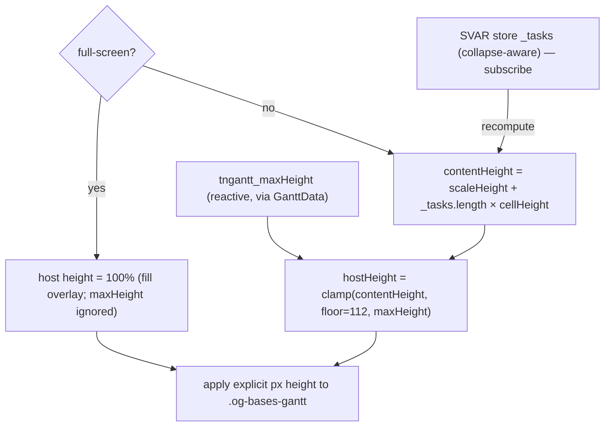

# feat: Gantt viewport sizing — configurable max-height + full-screen toggle

> **Note — the full-screen portion is superseded (historical record; body unchanged).** The full-screen mechanism went CSS-in-place (this plan) → SVAR `<Fullscreen>` (native API, PR #150) → **maximize-within-Obsidian** (PR #191). The current approach and the reasons are captured in [docs/solutions/architecture-patterns/obsidian-plugin-fullscreen-maximize-not-native.md](../solutions/architecture-patterns/obsidian-plugin-fullscreen-maximize-not-native.md). The max-height/viewport-sizing portion of this plan still reflects current behavior.

## Summary

Replace the Gantt's fixed `400px` height with a **per-view max-height** that fits the chart to its content (scrolling only when content exceeds the cap), and add an **always-visible full-screen toggle** that expands the chart to fill the Obsidian window. Both must preserve the chart's no-remount state (zoom/scroll/data). Origin: [docs/brainstorms/2026-06-21-gantt-viewport-sizing-requirements.md](docs/brainstorms/2026-06-21-gantt-viewport-sizing-requirements.md).

---

## Problem Frame

`.og-bases-gantt` is a fixed `400px` ([src/bases/GanttContainer.svelte](src/bases/GanttContainer.svelte)). Short charts waste space with an empty area below the bars; tall charts already cap and scroll. SVAR's model (from the `/svar-svelte` skill): *"the host container must provide height; `.wx-gantt` uses `height:100%; overflow-y:auto`"* — it fills the host and scrolls internally, with **no auto-grow-to-content prop**. So "fit content up to a max" is the host's job. SVAR defaults: row height `cellHeight = 38`, scale header `scaleHeight = 36`. Settings are per-view (`tngantt_*` via `BasesViewConfig`); the chart already preserves zoom/scroll/data across data updates via diff-sync and must not regress.

## Requirements (from origin)

- **R1** Per-view `tngantt_maxHeight` (px) option, default 400.
- **R2** Host sizes to `min(contentHeight, maxHeight)` — fits when short (no empty space/scrollbar), caps + internal scroll when tall.
- **R3** ~2-row minimum floor so a tiny chart isn't a sliver.
- **R4** `contentHeight` reflects currently-visible rows (expand/collapse, grouping); recomputed when the row set or row height changes.
- **R5** Floating, always-visible full-screen toggle button on the chart (independent of the off-by-default Theme toolbar).
- **R6** Activating fills the Obsidian app window (overlay).
- **R7** Exit via Esc + an on-overlay button; the control reflects state (enter ↔ exit).
- **R8** While full-screen, the chart uses all space (max-height ignored).
- **R9** Enter/exit preserves zoom/scroll/selection/data (no remount).
- **R10** Full-screen is transient (not persisted).

---

## Key Technical Decisions

1. **Compute content height from SVAR's reactive store (`_tasks`), not from the DOM or `$data` (R2, R4).** Two tempting approaches are both wrong, verified against the SVAR source:
   - *Measuring rendered DOM* fails — both the grid and chart panes are **virtualized** (only visible rows render), and SVAR's `.wx-pseudo-rows` carries `min-height:100%`, so once the host is sized ≥ content the measured `scrollHeight` reports the *host* height back (a fixed point in the measure→set loop).
   - *Computing from `$data.instances`* over-counts — `instances` is the controller's fully-expanded list, so it ignores SVAR's collapse/group state (the exact fragility we're trying to avoid).

   The correct source is **SVAR's store**: `api.getReactiveState()` exposes the collapse-aware visible-row array (`_tasks`) plus `cellHeight`/`scaleHeight`. Compute `contentHeight = scaleHeight + _tasks.length × cellHeight (+ a horizontal-scrollbar allowance, mirroring SVAR's own formula)`, then `hostHeight = clamp(contentHeight, floor, maxHeight)` where `floor = scaleHeight(36) + 2×cellHeight(38) = 112`. **Recompute by subscribing to the store's `_tasks`** (so expand/collapse and data changes trigger it) — **not** via a DOM `ResizeObserver`, which would fight SVAR's own internal `ResizeObserver` on the chart and create a SVAR-mediated reflow loop. Guard against redundant updates (skip when the new height equals the current).

2. **`tngantt_maxHeight` is a reactive per-view option (R1).** Add a `type: 'slider'` (or number) option to `ganttViewOptions` (default 400) + a `getMaxHeight()` reader in register.ts (mirrors `getShowDateIndicators`/`getThemeMode`), flowed through the reactive `GanttData` (like `showToolbar`) so changing it takes effect live without remount.

3. **Full-screen via a CSS-in-place class toggle — no DOM reparent (R6, R9).** Toggle a class (e.g. `og-fullscreen`) on the existing `.og-bases-gantt` root → `position: fixed; inset: 0`, at a **z-index above `.workspace` but below `.modal-container`** so it covers the panes without sitting over Obsidian's modals. Toggling a class never remounts the Svelte tree, so SVAR state is preserved (R9). While the class is on, the host height is forced to `100%` and the `maxHeight` clamp (KTD 1) is **skipped** — R8. **Containing-block caveat:** `position:fixed` resolves against the nearest ancestor with a `transform`/`filter`/`contain`/`will-change` (Obsidian applies these to sliding/animated leaves), which could trap the overlay inside the pane. De-risk by verifying against a real leaf in-app; if trapped, the fallback is to portal **only the lightweight wrapper** (never the SVAR root — that would remount) to a direct child of `document.body`, or render a sibling fixed layer. The chosen z-index band + the verified approach are settled in U3, not left open.

4. **Floating full-screen button mirrors the existing `.zoom-controls` (R5, R7).** A small always-visible button on the chart (lucide `maximize`/`minimize` icon reflecting state), positioned to not crowd the zoom +/-. Esc and the button both toggle off; an Esc key listener is added while full-screen and removed on exit.

---

## High-Level Technical Design

Height resolution (normal vs full-screen), and the compute→clamp→apply loop:

Content height comes from SVAR's reactive store (`_tasks`, collapse-aware, virtualization-proof), **not** the DOM — so there is no measure→set feedback loop and no competition with SVAR's own ResizeObserver. The result is applied as a definite px height (full-screen overrides it with `height:100%`).

---

## Implementation Units

### U1. `tngantt_maxHeight` per-view option + reactive plumbing

**Goal:** Add the configurable max-height option, read it, and flow it reactively to the chart.
**Requirements:** R1.
**Dependencies:** none.
**Files:** [src/bases/viewOptions.ts](src/bases/viewOptions.ts) (+ [test/unit/viewOptions.test.ts](test/unit/viewOptions.test.ts)), [src/bases/register.ts](src/bases/register.ts) (`getMaxHeight()` reader + include in `buildGanttData`), [src/bases/types/gantt-view-data.ts](src/bases/types/gantt-view-data.ts) (`maxHeight` field), [src/bases/GanttContainer.svelte](src/bases/GanttContainer.svelte) (read from reactive data).
**Approach:** `tngantt_maxHeight` option (default 400; a `slider` with a sensible min/max, or a number) per KTD 2. `getMaxHeight()` normalizes to a positive number (default 400). Flow via `GanttData` (like `showToolbar`) so it's live.
**Patterns to follow:** the `tngantt_showToolbar`/`tngantt_showDateIndicators` options + `getShowToolbar`/`getThemeMode` readers; the `showToolbar` reactive-data flow added in plan 002.
**Test scenarios:**
- `ganttViewOptions()` includes the `tngantt_maxHeight` option with default 400. (Covers R1.)
- `getMaxHeight()` returns 400 when unset, the stored value when set, and normalizes invalid/≤0 to the default.
**Verification:** option appears in the view panel; changing it propagates through `GanttData`.

### U2. Compute-and-clamp host height (fit-to-content up to max)

**Goal:** Size the host to `clamp(contentHeight, floor, maxHeight)` (content height computed from the store, KTD 1); recompute on data/expand changes.
**Requirements:** R2, R3, R4.
**Dependencies:** U1.
**Files:** [src/bases/GanttContainer.svelte](src/bases/GanttContainer.svelte) (height `$state` + subscribe to the SVAR store's `_tasks` + apply an explicit px height), its `<style>` (remove the fixed `height:400px`/`min-height`). A small pure helper `src/bases/ganttHeight.ts` (+ test) for the content-height + clamp math.
**Approach:** Per KTD 1. Read `cellHeight`/`scaleHeight`/`_tasks.length` from `api.getReactiveState()`; `contentHeight = scaleHeight + _tasks.length × cellHeight (+ scrollbar allowance)`; `hostHeight = clamp(contentHeight, 112, maxHeight)`. **Apply `hostHeight` as an explicit pixel height on `.og-bases-gantt`** (the outer host) — SVAR's `height:100%` chain (`.og-chart-area` → theme div → `.wx-gantt`) needs a *definite* host height, so `max-height + height:auto` will not satisfy it. Keep the flex column from plan 002 (toolbar row above, chart fills the rest). Recompute by **subscribing to the store's `_tasks`** (covers expand/collapse + data changes); dispose on unmount; skip no-op updates. (When full-screen — U3 — bypass this and use `height:100%`.)
**Execution note:** extract the content-height + clamp math into the pure `ganttHeight.ts` helper and unit-test it; the store subscription + applied height are covered by e2e.
**Patterns to follow:** existing `$effect` + dispose cleanup (the theme subscription); the flex layout from plan 002; reading the SVAR api/store as the diff-sync already does.
**Test scenarios:**
- Pure helper: `clamp(120, floor=112, max=400)=120`; `clamp(40, 112, 400)=112` (floor — `scaleHeight 36 + 2×cellHeight 38`); `clamp(900, 112, 400)=400` (cap); content-height formula for N rows = `36 + N×38 (+scrollbar)`. (Covers R2/R3.)
- E2E: a 3-task chart renders with no empty space and no vertical scrollbar (Covers F1); a 30-task chart caps at max and scrolls (Covers F2); **collapsing** a parent shrinks the host and **expanding** it grows the host up to the cap (Covers R4 both directions — proves the `_tasks` collapse-aware source).
**Verification:** short charts fit, tall charts scroll at the cap, expand/collapse re-fits in both directions; no resize feedback loop (no DOM ResizeObserver competing with SVAR).

### U3. Full-screen overlay (CSS-in-place) + Esc/exit

**Goal:** Toggle a full-window overlay by restyling the existing root in place — no remount.
**Requirements:** R6, R8, R9, R10.
**Dependencies:** U1, U2 (needs the reactive `maxHeight` + the explicit-height logic to bypass while full-screen).
**Files:** [src/bases/GanttContainer.svelte](src/bases/GanttContainer.svelte) (full-screen `$state`, class binding, Esc listener) + its `<style>` (`.og-fullscreen { position:fixed; inset:0; z-index:<above .workspace, below .modal-container>; height:100% }`).
**Approach:** Per KTD 3. A `fullScreen` `$state`; toggling adds/removes `og-fullscreen` on the existing `.og-bases-gantt` (no DOM move → no remount, R9). **R8 mechanism:** while `fullScreen` is true, skip the U2 explicit-px-height application (the `.og-fullscreen` rule sets `height:100%`), so the chart fills the overlay regardless of `maxHeight`. Add an Esc keydown listener on enter, remove on exit + unmount. State is transient (R10). Verify the `position:fixed` overlay covers the window against a real Obsidian leaf; if an ancestor containing block traps it, apply the KTD 3 fallback (portal only the wrapper to `body`, never the SVAR root).
**Patterns to follow:** the no-remount discipline; `$effect` add/remove-listener with cleanup.
**Test scenarios:**
- E2E: clicking the toggle expands the chart to fill the window; Esc and a second click exit; the chart's zoom/scroll is intact before/after (Covers F4/R9). 
- E2E: while full-screen, the chart is taller than `maxHeight` would allow (Covers R8).
**Verification:** overlay covers the Obsidian window at a correct stacking context; no remount (chart instance/scroll preserved); Esc + button both exit; no leftover listener after exit.

### U4. Floating full-screen toggle button

**Goal:** An always-visible chart button that drives U3, reflecting state.
**Requirements:** R5, R7.
**Dependencies:** U3.
**Files:** [src/bases/GanttContainer.svelte](src/bases/GanttContainer.svelte) (button markup near `.zoom-controls`, lucide icon, aria-label) + `<style>`.
**Approach:** Mirror the `.zoom-controls` floating-button pattern; lucide `maximize`/`minimize` swapping on `fullScreen`; positioned to avoid crowding the zoom +/-. Always visible (not gated on the Theme toolbar).
**Patterns to follow:** the `.zoom-controls` buttons + `lucideIcon` action in GanttContainer.
**Test scenarios:**
- E2E: the button is visible without enabling the Theme toolbar (Covers R5); its icon/aria-label reflects enter vs exit (Covers R7).
**Verification:** button visible by default, toggles full-screen, icon reflects state.

---

## Verification Strategy

1. **Unit** (`npm test`): the pure clamp helper (U2); the `tngantt_maxHeight` option + `getMaxHeight()` (U1).
2. **E2E** (CI windows — the UI runtime gate): short-fits / tall-scrolls / expand-re-fits (U2); full-screen enter-exit with state preserved + max-height bypassed (U3); button always visible + icon state (U4).
3. **Local gate** (this machine): fnm Node 20 + `NODE_EXTRA_CA_CERTS`; after npm install churn, force-install rollup/@swc native binaries (#4828) — see the `dev-run-config` memory.

---

## Scope Boundaries

**In scope:** per-view `tngantt_maxHeight` (fit-to-content-then-scroll, ~2-row floor); compute-and-clamp host sizing; floating full-screen toggle filling the Obsidian window with Esc/button exit; state preserved across full-screen.

**Deferred to follow-up:** persisting a per-view full-screen default; max-height in *rows* instead of px; animating the full-screen transition.

**Outside this scope:** true OS/monitor fullscreen (browser Fullscreen API); pane-maximize focus mode; a global settings tab.

---

## Open Questions (resolve in implementation)

- **Store-read details (KTD 1):** confirm the exact `api.getReactiveState()` field names (`_tasks`, `cellHeight`, `scaleHeight`) and the horizontal-scrollbar allowance in SVAR's own height formula; confirm subscribing to `_tasks` fires on expand/collapse. (The *approach* is settled — store-based, not DOM-measured; this is detail verification.)
- **Full-screen containing block (U3 de-risk):** verify against a real Obsidian leaf whether `position:fixed` on `.og-bases-gantt` covers the window or is trapped by an ancestor `transform`/`contain`; if trapped, apply the KTD 3 wrapper-portal fallback. Confirm the z-index band (above `.workspace`, below `.modal-container`).
- **Floating-control layout:** placement of the full-screen button vs the zoom +/- so they don't crowd the corner.

---

## Risks & Mitigations

- **Resize feedback loop / SVAR RO competition** (a DOM `ResizeObserver` would fight SVAR's internal one as virtualized rows re-slice). Mitigation: drive recompute from the **store** (`_tasks`), not the DOM (KTD 1); guard against no-op height updates.
- **Wrong content-height source** (DOM measure is broken by virtualization + `min-height:100%`; `$data.instances` is broken by collapse). Mitigation: use the collapse-aware store `_tasks.length` (KTD 1), verified against the SVAR source.
- **Full-screen reparent → remount** (loses state). Mitigation: CSS-in-place class toggle only, never a DOM move (KTD 3); e2e asserts state survives.
- **Overlay z-index conflicts** with Obsidian modals/popovers. Mitigation: pick a z-index above panes but below modals; verify in-app.
- **maxHeight too small** (< floor). Mitigation: the floor clamp guarantees a usable minimum.
