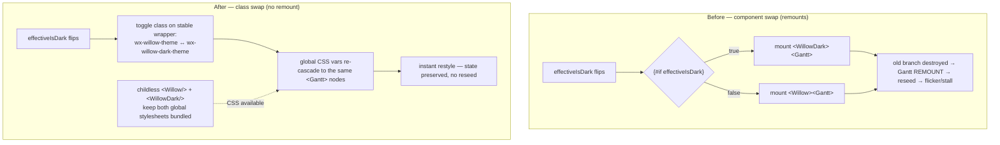

# fix: Eliminate Gantt remount/flicker on light↔dark theme toggle

## Summary

Toggling Obsidian's theme (or the in-chart Auto/Light/Dark switch) currently tears down and rebuilds the entire SVAR Gantt, producing a visible flicker and a brief main-thread stall. Replace the theme-driven **component swap** (`{#if effectiveIsDark}<WillowDark>…{:else}<Willow>…`) with a **CSS class swap on a stable wrapper**, so the chart restyles in place with no remount. The reseed-on-flip machinery that exists only to survive that remount is then retired.

---

## Problem Frame

The theme is applied in [src/bases/GanttContainer.svelte](src/bases/GanttContainer.svelte) by branching the markup on `effectiveIsDark`: one branch renders `<Willow>` around the chart, the other `<WillowDark>`. Because these are two distinct components, flipping `effectiveIsDark` makes Svelte **destroy one branch and mount the other**, remounting the `<Gantt>` inside — the code says so at [GanttContainer.svelte:195](src/bases/GanttContainer.svelte#L195) (*"The `{#if effectiveIsDark}` swap remounts the `<Gantt>`"*). The remount re-parses every task and re-renders every bar on the main thread, which is the flicker the user reported (command palette → "Toggle light/dark mode") and the momentary non-responsiveness. The existing `maybeReseedForThemeFlip` / `reseedSeedsFromData` logic exists **only** to repopulate the freshly-remounted chart with current data — it mitigates data loss but not the remount itself.

**Why a class swap is the fix (from SVAR's source + the `/svar-svelte` skill):** SVAR's theme styling is entirely CSS-variable-driven, and those variables are declared **globally** keyed on the theme class — `:global(.wx-willow-theme){…}` and `:global(.wx-willow-dark-theme){…}` (verified in `@svar-ui/svelte-gantt/src/themes/Willow.svelte` + `WillowDark.svelte` and the core equivalents). Both blocks are already present in the built `dist/styles.css` (verified: 8 occurrences each, with core `--wx-color-*` and gantt `--wx-gantt-*` variables). So changing the class on a *stable* ancestor swaps every variable and cascades to the chart instantly — which is exactly how SVAR's own demos switch theme without re-rendering (see the `consult-svar-docs-first` learning). SVAR exposes **no** reactive "theme prop"; the component is chosen at render time. The class swap is the supported runtime-switch pattern.

**Why the earlier hand-rolled attempt failed (must not regress):** a previous iteration rendered a bare `
` while only *importing* (not rendering) `Willow`/`WillowDark` (`void Willow`). The Svelte compiler emits a component's `<style>` only when the component is **instantiated**, so the theme CSS was tree-shaken out and defaults bled through ("heavy grid lines"). The fix below keeps both theme components instantiated so their global CSS stays in the bundle.

---

## Requirements

- **R1** Toggling the effective theme (via the in-chart toolbar OR Obsidian's appearance change while in Auto) restyles the chart **in place** — no remount of `<Gantt>`.
- **R2** No flicker and no perceptible main-thread stall on toggle.
- **R3** Theming remains **complete and correct** in both light and dark — no default-style bleed ("heavy lines"); parity with today's rendered output.
- **R4** Chart state (zoom, scroll, selection, expand/collapse, data) is preserved across a toggle — now intrinsically, because there is no remount.
- **R5** Both the in-chart Auto/Light/Dark switch and Obsidian auto-follow (Auto mode) drive the same in-place restyle.

---

## Key Technical Decisions

1. **Swap the theme CSS class on a stable wrapper, not the theme component (R1, R2).** Wrap `<Gantt>` in one persistent element whose class toggles reactively between `wx-theme wx-willow-theme` and `wx-theme wx-willow-dark-theme` based on `effectiveIsDark` (reusing the existing pure `isEffectiveDark` resolver). No `{#if}` component swap around the chart → Svelte never destroys/recreates the `<Gantt>` subtree. The global, class-keyed CSS variables do the visual switch.

2. **Keep both theme components instantiated as CSS/context providers (R3).** Render childless `<Willow fonts={false} />` and `<WillowDark fonts={false} />` (their `{:else}` branch renders only the CSS/icon injectors, no visible wrapper) so **both** global stylesheets stay emitted in `dist/styles.css` — directly avoiding the tree-shake that caused the "heavy lines" regression. The build-output CSS check (both blocks present) is the verification hook for this.

3. **Provide the `wx-theme` Svelte context as a *reactive* value (not a plain div, not once-set).** SVAR's real `<Willow>` sets `setContext("wx-theme", "willow"|"willow-dark")`. A plain `
` **cannot** call `setContext`, and the context is genuinely load-bearing for one surface: the dependency **Tooltip renders through SVAR's `Portal`, which mounts at `document.body`** — outside the wrapper's CSS cascade — and themes itself from `getContext("wx-theme")` **freshly on each hover** (`
`). So a once-set context would leave a tooltip opened *after* a light↔dark flip mis-themed (the chart is dark, the popup renders light). **Decision:** keep a Svelte component (or a script-scope `setContext` in GanttContainer) that provides `wx-theme` as a **reactive** value derived from `effectiveIsDark`, so a Portal mounting after a flip reads the current theme; the plain class-swapping `
` supplies only the CSS class for the in-cascade chart. (The grid's `_skin` — the other context reader — is confirmed benign: it is non-reactive and only consumed by SVAR's Print component, which this plugin does not use, so its staleness has no visible effect.)

4. **Retire the reseed-on-flip machinery (R4).** With no remount, the seed props are never re-read on a theme change, so `maybeReseedForThemeFlip` and the theme-flip call into `reseedSeedsFromData` become dead code. `handleThemeModeChange` collapses to "flip `mode`, persist"; `applyObsidianDark` to "flip `obsidianIsDark`". Keep `reseedSeedsFromData` itself only if the column-change path still uses it (it does — `reseedForColumnChange`); remove only the theme-flip reseed trigger.

---

## High-Level Technical Design

Theme application — before (remount) vs. after (in-place class swap):

The `<Gantt>` instance and its DOM are identical before and after the flip — only the wrapper's class attribute changes.

---

## Implementation Units

### U1. Replace the theme component-swap with a stable class-swapping wrapper

**Goal:** Make a theme flip restyle the chart in place (no remount), with complete theming preserved.
**Requirements:** R1, R2, R3, R5.
**Dependencies:** none.
**Files:** [src/bases/GanttContainer.svelte](src/bases/GanttContainer.svelte) (markup: remove the `{#if effectiveIsDark}` `<Willow>`/`<WillowDark>` swap around `chartBody`; render childless `<Willow fonts={false} />` + `<WillowDark fonts={false} />` providers; wrap the chart in a stable `
`; provide a reactive `wx-theme` context per KTD 3).
**Approach:** Per KTD 1–3. The existing `isEffectiveDark` function (in `themeResolver.ts`) and the `effectiveIsDark` `$derived` value (in GanttContainer) are unchanged — `effectiveIsDark` now drives the wrapper class instead of the `{#if}` branch. The `chartBody` snippet renders once inside the stable wrapper. **Context (KTD 3):** the plain `
` only carries the CSS class; provide `wx-theme` separately as a reactive value — call `setContext('wx-theme', <getter/store deriving "willow"|"willow-dark" from effectiveIsDark>)` at script scope (or via a minimal provider component), so the body-mounted dependency-Tooltip Portal reads the current theme on each hover. Keep `fonts={false}` (Obsidian provides fonts; icons handled by the existing GanttContainer CSS — see the `gantt-svar-icon-shortlist` learning).
**Patterns to follow:** the existing `effectiveIsDark`/`isEffectiveDark` resolver and `chartBody` snippet; SVAR's documented theme-wrapper class shape (`.wx-theme.wx-{name}-theme`, `height:100%`) from the `/svar-svelte` skill.
**Test scenarios:**
- Covered by U3 e2e (this is a rendering-structure change; the unit-level guarantee is "no `{#if}` swap around the chart" + "both theme classes' CSS present", both asserted in U3).
**Verification:** toggling theme (toolbar + Obsidian appearance) swaps colors/borders with no flicker; light and dark both fully themed (no heavy-line bleed); the `<Gantt>` is not recreated.

### U2. Retire the reseed-on-theme-flip machinery

**Goal:** Remove the now-dead remount-survival code so theme handlers are simple flips.
**Requirements:** R4.
**Dependencies:** U1.
**Files:** [src/bases/GanttContainer.svelte](src/bases/GanttContainer.svelte) (`handleThemeModeChange` → flip `mode` + persist; `applyObsidianDark` → flip `obsidianIsDark`; delete `maybeReseedForThemeFlip` and the theme-flip seed reassignment; keep `reseedSeedsFromData`/`reseedForColumnChange` for the column-change path). Also scrub the now-stale comments that encode the removed remount assumption — the height-subscription `$effect` comment ("…the theme-flip remount of `<Gantt>`") and the chart-area markup comment ("…the flip reseeds the chart's data … so the remounted `<Gantt>` shows current data") — since after this change a flip neither remounts the chart nor re-reads the seed props.
**Approach:** Per KTD 4. Confirm `reseedSeedsFromData` retains only its column-change caller after removing the theme-flip caller; leave that path intact.
**Patterns to follow:** the existing `reseedForColumnChange` usage (the legitimate remaining reseed trigger).
**Test scenarios:**
- Existing `themeResolver.test.ts` (pure `isEffectiveDark`/`normalizeThemeMode`/`readThemeMode`) stays green — the resolver is unchanged and still authoritative for the class choice.
- Test expectation: none beyond the above — this is dead-code removal whose behavioral guarantee (state preserved across flip) is proven by U3.
**Verification:** theme handlers no longer call any reseed; column-change reseed still works; unit suite green.

### U3. E2E — theme toggle restyles in place without remount

**Goal:** Prove the flip restyles in place, preserves state, and themes completely.
**Requirements:** R1, R3, R4, R5.
**Dependencies:** U1, U2.
**Files:** [test/specs/gantt-theme-toolbar.e2e.ts](test/specs/gantt-theme-toolbar.e2e.ts) (extend the existing theme spec; its fixture already enables the toolbar) — or a new `test/specs/gantt-theme-toggle.e2e.ts` if the existing spec is cleaner left as a render-only check.
**Approach:** Drive the in-chart Auto/Light/Dark switch (and/or flip Obsidian appearance). Use the **no-remount marker** technique proven in the full-screen work ([test/specs/gantt-fullscreen.e2e.ts](test/specs/gantt-fullscreen.e2e.ts)): set a `data-e2e-marker` attribute on a `.wx-bar` before toggling and assert it survives — a remount would recreate the DOM and lose it.
**Patterns to follow:** the marker-survives assertion in `gantt-fullscreen.e2e.ts`; the boot/fixture setup in `gantt-theme-toolbar.e2e.ts`.
**Test scenarios:**
- Via the **in-chart toolbar**, toggle Light→Dark→Light: the wrapper gains `.wx-willow-dark-theme` (loses `.wx-willow-theme`) then reverses. (Covers R1/R5 — toolbar path.)
- While in **Auto** mode, flip Obsidian's appearance: the wrapper class follows. (Covers R5 — auto-follow path.)
- A `data-e2e-marker` set on a `.wx-bar` before a toggle still exists after — no remount. (Covers R1/R4.)
- Complete-theming on the **gantt layer** (the layer that caused the prior "heavy lines"): after toggling to Dark, a rendered grid row / chart border's computed color resolves to the dark `--wx-gantt-border-color` value, not the light default — proving the gantt-layer block cascaded, not just a core variable. (Covers R3.)
- **Portaled tooltip follows the live theme (KTD 3):** open a dependency tooltip *after* a Light→Dark flip and assert its body-mounted Portal div carries `.wx-willow-dark-theme` — the regression guard for the reactive-context decision. (Covers R3 for the portaled surface.)
**Verification:** all three scenarios pass against real Obsidian; the existing theme render spec still passes.

---

## Verification Strategy

1. **Unit** (`npm test`): `themeResolver.test.ts` stays green (resolver unchanged).
2. **Build-output check:** after `npm run build`, confirm `dist/styles.css` still contains both `.wx-willow-theme` and `.wx-willow-dark-theme` variable blocks (the regression guard for KTD 2 — the childless providers must keep both stylesheets emitted).
3. **E2E** (CI Windows): the U3 no-remount/in-place-restyle spec + the existing theme render spec.
4. **Manual** (test vault): command palette → "Toggle light/dark mode" repeatedly — no flicker, no stall, state preserved; both themes fully styled. (Reproduces the original bug recording.)
5. **Local gate** (this machine): fnm Node 20 + `NODE_EXTRA_CA_CERTS`; after npm install churn, force-install rollup/@swc native binaries (#4828) — see the `dev-run-config` memory.

---

## Scope Boundaries

**In scope:** the theme-application mechanism in GanttContainer (component-swap → class-swap), retiring the theme-flip reseed, and the no-remount e2e.

**Deferred to follow-up:** none anticipated.

**Outside this scope:**
- The `css-change` + MutationObserver auto-follow detection and its double-fire guard ([themeResolver.ts](src/bases/themeResolver.ts) `subscribeObsidianTheme`) — not the cause; left untouched (confirmed in scoping).
- Any change to the theme *modes* (Auto/Light/Dark) or their persistence — the toolbar and `tngantt_themeMode` are unchanged.
- The viewport-sizing / full-screen behavior (just shipped, #147) — independent.

---

## Open Questions (resolve in implementation)

- **Reactive-context shape (KTD 3):** the *decision* is settled (provide a reactive `wx-theme` context); the implementer chooses the cleanest mechanism — a script-scope `setContext` of a getter/store vs. a thin provider component — and confirms the Tooltip Portal reads the live value (the U3 post-flip tooltip assertion is the guard).
- **Spec placement (U3):** extend `gantt-theme-toolbar.e2e.ts` vs. add a dedicated toggle spec — decide based on which keeps each spec's intent clear.

---

## Risks & Mitigations

- **Theme CSS tree-shaken when the component isn't rendered** (the original "heavy lines" cause). Mitigation: keep both `<Willow>`/`<WillowDark>` instantiated as childless providers (KTD 2); guard with the `dist/styles.css` both-blocks check (Verification 2) and the e2e complete-theming assertion (U3).
- **Portaled dependency tooltip mis-themes after a flip** — the SVAR Tooltip's `Portal` mounts at `document.body` (outside the wrapper cascade) and themes from `getContext("wx-theme")` per hover, so a once-set context would lock it to the mount-time theme. Mitigation: provide a **reactive** `wx-theme` context (KTD 3); the U3 post-flip tooltip-theme assertion guards it. (The grid `_skin` context reader is benign — only the unused Print component consumes it.)
- **Icon regression** (the `wxi-*` icons are hand-added in GanttContainer CSS per the `gantt-svar-icon-shortlist` learning). Mitigation: `fonts={false}` and the icon CSS are unchanged by this refactor; the e2e renders real bars/links to catch any regression.
- **`color-scheme: dark` now toggles live on a stable subtree** (the dark theme sets it on the wrapper) — under the old remount it landed on fresh DOM; in place it could repaint native scrollbar/control chrome on an already-rendered editor. Low severity. Mitigation: during manual verification, toggle with the grid scrolled and a property editor open; if a chrome flash appears, record it as a known minor artifact.
