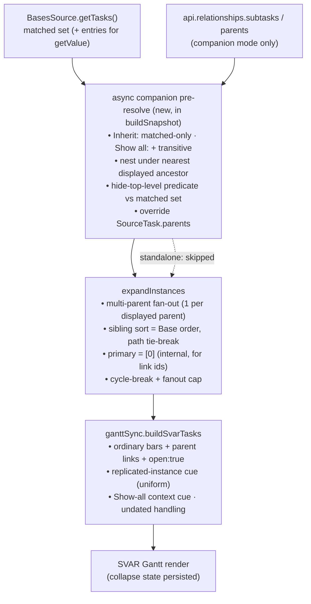

# feat: Gantt Bases relationship expansion & sorting

## Summary

Add TaskNotes-parity behavior to the Gantt's Bases datasource: three per-view settings —
**Expanded relationships** (Inherit / Show all), **Hide top-level subtasks**, and making the
Obsidian Base's **toolbar sort** drive row order — across a recursively-expanded,
companion-only subtask tree sourced from the TaskNotes relationships API, with a uniform visual
cue on every replicated instance.

## Problem Frame

Today the Gantt builds hierarchy only from the configured `parentProperty` among rows already
in the Base result, and `InstanceExpansion` re-sorts every row by file path — so subtasks
outside the filter never appear and the Base's toolbar sort has no visible effect. The origin
brainstorm (see origin) establishes the target behavior and resolves the major product forks;
this plan turns it into dependency-ordered work against the existing source/controller/render
pipeline. Two facts from research reshape the approach versus the brainstorm's first draft:
`api.relationships.subtasks`/`parents` and `config.getSort()` both exist but are **not wired**
in this repo today (only `relationships.dependencies` and `getOrder()` are), so each is net-new
typing + access; and duplicate bars are inherent to multi-parenting, not just the hide toggle.

---

## Key Technical Decisions

- KTD1. **Companion expansion is sourced from the TaskNotes relationships API.** Use
  `api.relationships.subtasks(path)` / `parents(path)` (resolved `TaskInfo[]`), added to the
  `TaskNotesApi` typing (today it types `relationships.dependencies` only) and called through
  guarded accessors. Verify the exact method names/shape against the shipped TaskNotes
  `main.js` before relying on them (precedent: a prior status-palette bug came from guessing an
  API path). In companion mode these edges supersede the configured `parentProperty` for
  hierarchy; the two edge sources never co-mingle (origin Key Decision).

- KTD2. **A new async pre-resolve stage builds the displayed tree** between `getTasks()` and
  `expandInstances()`, inside `GanttController.buildSnapshot`. `resolveAndFilter` is synchronous
  today; the companion stage is async (the accessors return Promises), runs only when TaskNotes
  is present, and overrides each `SourceTask.parents` plus injects fetched descendants before
  expansion. Standalone mode skips the stage entirely.

- KTD3. **Base toolbar sort drives sibling order, replacing the path-sort.** Access
  `config.getSort()` (new wiring — `getSort` is already in the Obsidian typings; only
  `getOrder()` is called today). `InstanceExpansion` is a pure, Obsidian-free transform over
  `SourceTask[]` with no `BasesEntry`/config access, so the sort key must be **threaded in, not
  read inside the expander**: `register.ts` (the only site with both `BasesEntry` and the view
  `config`) precomputes a per-path sort-key map for in-result rows (reading the `getSort()`
  spec; formula keys via `entry.getValue()`) and passes the sort spec + key map through
  `GanttController` into `expandInstances` as an **injected comparator/key-extractor**, keeping
  the expander pure. Sibling ordering: compare on the resolved sort-property value (matched rows
  from the key map incl. formula; fetched rows from the native `TaskInfo` field; formula/absent
  property on a fetched row → path fallback). The `compareStr(a.path, b.path)` primary sort is
  replaced by this comparator **with `path` retained as the final tie-break** so
  primary-instance selection (`sourceToInstances[0]`), `makeLinkId` stability, and — critically
  — the **cycle-break DFS visitation order** stay reproducible (origin R13 determinism caveat;
  the path-sort seeds the cycle-break loop, not just display). When no toolbar sort is
  configured, use each in-result row's index in the **pre-sorted `basesView.data.data`** array
  as the base-order key (Bases hands `data.data` pre-sorted), with `path` tie-break — never an
  unstable order.

- KTD4. **Render parent and subtree rows as ordinary SVAR bars, not `type:"summary"`.** Per the
  standing decision in `docs/solutions/tooling-decisions/svar-gantt-summary-type-constraints.md`,
  summaries auto-span and reject asymmetric writes; the tree is expressed with plain bars +
  `parent` links + `open:true`. The Expanded-relationships dropdown options are a
  `Record<string,string>` (an array renders as `[object Object]`).

- KTD5. **Hide-top-level default stays OFF (parity); a uniform replicated-instance cue handles
  duplicate bars.** Resolves the origin's F3 Open Question. Duplicate bars arise from two
  sources — multiple displayed parents (origin R5) and hide-off root+nested (origin R9) — so
  rather than a root-vs-nested special case, every instance of any task that renders more than
  once carries the same subtle cue (e.g. an "appears N times" indicator). All instances are
  treated equally visually. Note the leak risk: `InstanceExpansion`'s `'primary'` link mode
  attaches dependency arrows to the primary instance only, so visually-equal copies would
  behave unequally for links — see Open Questions for the link-mode decision (arrows on all
  replicated instances vs. primary-only).  This cue is distinct from the Show-all context cue
  (origin R18).

- KTD6. **Formula fields: display + sort on in-result rows only.** In-result rows read formula
  values via the existing `entry.getValue()` path in `BasesDataAdapter`; fetched (Show-all)
  rows have no `BasesEntry`, so they fall back to native-field then path ordering — documented,
  not silent (origin R20). Recomputing Base formulas for fetched rows is out of scope.

- KTD7. **Standalone Bases-only mode is behaviorally unchanged.** Expansion, hide-top-level,
  and companion edges are companion-only; the companion-only controls are hidden or
  disabled-with-explanation when TaskNotes is absent (origin R6).

- KTD8. **New keys go through the shared `tngantt_` schema, and per-refresh writes are guarded.**
  New keys `tngantt_expandedRelationships` and `tngantt_hideTopLevelSubtasks` are registered in
  the option schema with co-located pure readers (mirroring `readShowToolbar`); the
  `noBarePluginConfigKeys` test guards the prefix. Any config write re-asserted on refresh must
  be no-op-guarded to avoid the `onDataUpdated` refresh loop documented in
  `docs/solutions/integration-issues/gantt-theme-toggle-bases-refresh-loop.md`.

---

## Requirements

Traceability to origin R-IDs in parentheses; this plan adds R-NEW1 (the replicated-instance
cue) resolving the origin F3 Open Question.

**Expansion**
- R1. Per-view **Expanded relationships** setting (`Inherit` default / `Show all`); Inherit
  limits descendants to the matched set, Show all includes all transitive descendants via the
  relationships API; recursive + cycle-guarded; nest under nearest displayed ancestor;
  companion-only. (origin R1–R6)
- R2. **Hide top-level subtasks** toggle, default OFF; hide predicate evaluated against the
  **matched query result** (pre-expansion); OFF keeps root + nested, ON nests only. (origin
  R7–R9)
- R3. Show-all context descendants are visually distinct from matched rows; undated descendants
  use existing undated/partial-date handling. (origin R18, R19)

**Sorting**
- R4. The Base toolbar sort (`config.getSort()`) drives sibling order at every depth, applied
  within sibling groups only (tree preserved), uniformly across matched and fetched rows with a
  file-path tie-break; the existing path-only sort is removed while preserving instance/link
  determinism; absent sort falls back to Base-provided order + path. (origin R10–R14)
- R5. Formula fields are supported for display and sort on in-result rows; fetched rows fall
  back to native-field/path. (origin R20)

**Settings, rendering & state**
- R6. New settings use `tngantt_` keys + shared readers; SVAR interactive column sort stays
  unexposed. (origin R15, R16)
- R7. Tree is materialized eagerly, fully expanded by default; collapse/expand state persists
  across reload and settings changes; a collapse-all affordance exists. (origin R17)
- R-NEW1. Every instance of any source task that renders more than once (multiple displayed
  parents, or hide-off root+nested) carries a uniform subtle cue indicating multiple instances
  exist; all instances are treated equally. (resolves origin F3)

---

## High-Level Technical Design

The companion stage is the only structural addition to the pipeline; sort, hide, and the cues
layer onto the existing expand → sync → render flow. The path-sort removal is surgical —
swap the comparator key, keep the tie-break.

---

## Implementation Units

### Phase A — Settings & companion data

### U1. View options + readers for the three settings
- **Goal:** Register `Expanded relationships` (dropdown) and `Hide top-level subtasks` (toggle),
  read them, and pass them into `GanttData`; handle standalone hide/disable.
- **Requirements:** R1, R2, R6
- **Dependencies:** none
- **Files:** `src/bases/viewOptions.ts`, `src/bases/register.ts`,
  `src/bases/types/gantt-view-data.ts`, `test/unit/viewOptions.test.ts`,
  `test/unit/noBarePluginConfigKeys.test.ts` (existing guard — must stay green)
- **Approach:** Mirror the `tngantt_showToolbar` toggle + `readShowToolbar` reader pattern.
  Dropdown `options` MUST be a `Record<string,string>` (`{ inherit: 'Inherit', 'show-all':
  'Show all' }`), default `inherit`; toggle default `false`. Add private reader methods in
  `register.ts` and place values into `buildGanttData()`. Standalone treatment (companion
  absent) decided here: hide or disable the two controls.
- **Patterns to follow:** `viewOptions.ts` `readShowToolbar`/`readMaxHeight`; `register.ts`
  `getShowToolbar`.
- **Test scenarios:** reader returns `inherit`/`show-all` and the default when unset; toggle
  reader returns boolean + default; dropdown value is a `Record` (not array); bare-key guard
  passes for both new keys.
- **Verification:** options appear in the Bases view config; readers unit-tested; guard green.

### U2. TaskNotes relationships API typings + accessors + freshness event
- **Goal:** Type and call `api.relationships.subtasks(path)` / `parents(path)`, guarded; ensure
  companion hierarchy refreshes on project-edge changes.
- **Requirements:** R1 (companion sourcing), R7 (freshness)
- **Dependencies:** none
- **Files:** `src/datasource/TaskNotesSource.ts`, `test/unit/TaskNotesSource.test.ts`
- **Approach:** Extend the `TaskNotesApi.relationships` interface (currently `dependencies`
  only) with `subtasks`/`parents`; add guarded read methods returning resolved vault paths /
  `SourceTask`-shaped data. **Note `subtasks`/`parents` are derived from the `projects` field**
  (TaskNotes' `getSubtasks` back-references `projects`), so companion hierarchy keys on
  `projects` — this is the deliberate supersede of `parentProperty` (KTD1). **Freshness:** add
  `task.projects.changed` to `TASKNOTES_CHANGE_EVENTS` so a project-edge edit re-runs
  `buildSnapshot` (origin Freshness decision; today the list has no project event, so a
  re-parented child would stay stale until an unrelated event fires). Verify both the API method
  names AND the event name against `test/wdio/.obsidian-cache/.../tasknotes/4.11.0/main.js`; if
  `task.projects.changed` doesn't exist, document the fallback (existing events + the accessor's
  30s-TTL index).
- **Patterns to follow:** existing `getDependencies` guard; `TASKNOTES_CHANGE_EVENTS` list.
- **Execution note:** Verify the real API shape + event name against the shipped `main.js`
  before writing; add a fixture-based test asserting real subtasks come back, not just no-throw.
- **Test scenarios:** `subtasks(path)` maps a fixture shaped like the real API to child paths;
  `parents(path)` likewise; missing methods → guarded `[]`; non-array result → `[]`; a
  project-edge change event triggers a snapshot rebuild.
- **Verification:** accessors return real relationship data from the fixture; a `projects` edit
  refreshes the tree; guards covered.

### U3. Companion hierarchy resolver (pure)
- **Goal:** From the matched set + relationship accessor, compute the displayed tree: Inherit
  vs Show-all membership, nearest-displayed-ancestor nesting, cycle guard, and the
  hide-top-level predicate (against the matched set).
- **Requirements:** R1, R2 (covers AE1–AE4, AE6)
- **Dependencies:** U2
- **Files:** `src/bases/taskHierarchy.ts` (extend), `src/datasource/companionResolve.ts` (new,
  thin orchestration), `test/unit/companionResolve.test.ts` (new),
  `test/unit/taskHierarchy.test.ts`
- **Approach:** **Reuse `taskHierarchy.buildHierarchy`** for the childrenMap + cycle-guarded DFS
  core (it already takes an injectable resolver and a generic task type) rather than duplicating
  the DFS — extend it with the new parameters where needed. The companion-specific policy
  (Inherit vs Show-all membership, fetched-row flag, hide predicate) is a thin orchestration
  layer that calls the async accessor then `buildHierarchy`. Produce displayed source tasks with
  overridden `parents` (nearest displayed ancestor) and a fetched flag. Hide predicate: remove
  from top level iff a **`projects`** link (companion mode keys on `projects`, not
  `parentProperty`) resolves into the matched set; multi-parent any-in-set hides; orphan stays.
- **Patterns to follow:** `taskHierarchy.ts` `buildHierarchy` (childrenMap, cycle-guarded DFS).
- **Test scenarios:** Covers AE1 (Inherit+off → child nested and at root); Covers AE2
  (Inherit+on → nested only); Covers AE3 (Show-all → non-matching C, G nested); Covers AE4
  (matched child of unmatched parent → at top level regardless of toggle); Covers AE6
  (multi-parent, one in-set → hidden from top, nested under in-set parent); cycle (A→B→A) does
  not infinite-loop; orphan with unresolved link stays at root.
- **Verification:** all AE scenarios pass against the pure module.

### U4. Wire the async pre-resolve stage into the controller
- **Goal:** Run U3 inside `buildSnapshot` in companion mode, feeding overridden `SourceTask[]`
  to `expandInstances`; skip in standalone; keep refresh idempotent.
- **Requirements:** R1, R2, R7 (companion-only activation)
- **Dependencies:** U2, U3
- **Files:** `src/controller/GanttController.ts`, `src/datasource/CompositeSource.ts`,
  `test/unit/GanttController.test.ts`
- **Approach:** Insert an async stage between `source.getTasks()` and `expandInstances()` in
  `buildSnapshot` (already async — `resolveAndFilter` stays sync; only the new companion fetch is
  async). Gate on `sourceStrategy === 'bases-scoped'` AND TaskNotes present. Either wrap
  `CompositeSource.getTasks` with the companion resolver or add the stage in the controller —
  decide by which keeps the `getDependencies` enrichment loop intact. **Fetched-descendant
  dependencies:** the enrichment loop calls `getDependencies(path)` per task; fetched (Show-all)
  descendant paths were never in `CompositeSource.getTasks()` output, so confirm
  `CompositeSource.getDependencies` resolves edges for them via the TaskNotes enrichment — else
  fetched rows render with no dependency arrows. **Bound the eager walk:** the recursive
  `subtasks()` calls are N sequential async calls over the matched set + descendants; add a
  concurrency/depth bound, or use the origin's offered `api.tasks.list()` bulk-inversion
  fallback if per-node calls prove slow (measure in U8). **Concurrency:** `recompute` is
  fire-and-forget (`void this.recompute`); ensure overlapping refreshes don't race two async
  resolves into `this.snapshot` (latest-wins guard). Guard any per-refresh config write against
  no-op.
- **Patterns to follow:** `GanttController.test.ts` `makeBasesScoped` fake-source harness.
- **Test scenarios:** companion present → fetched descendants appear; standalone → unchanged,
  no expansion; Inherit vs Show-all toggle changes membership; a no-op refresh does not loop
  (re-render with identical config produces no config write); dependency enrichment still
  resolves after the new stage, **including for fetched descendant paths**; overlapping
  refreshes settle to the latest snapshot (no race).
- **Verification:** snapshot includes expanded tree in companion mode only; no refresh loop;
  fetched rows keep their dependency arrows.

### Phase B — Sort, render & state

### U5. Base-order sort + path-sort removal (determinism-preserving)
- **Goal:** Make `config.getSort()` drive sibling order with a path tie-break; remove the
  path-only sort without regressing primary-instance / link-id determinism; formula in-result,
  fetched fallback.
- **Requirements:** R4, R5 (covers AE5)
- **Dependencies:** U4 (operates on the expanded set)
- **Files:** `src/bases/services/BasesDataAdapter.ts` (`getSort()` accessor, mirroring the
  existing `getOrder()`), `src/bases/register.ts` (precompute per-path sort-key map from entries
  + config), `src/controller/GanttController.ts` (thread sort spec + key map into expansion),
  `src/controller/InstanceExpansion.ts` (accept injected comparator), `test/unit/InstanceExpansion.test.ts`,
  `test/unit/BasesDataAdapter.test.ts`
- **Approach:** Per KTD3, thread the sort key in rather than reading it inside the pure expander:
  add a guarded `getSort()` accessor in `BasesDataAdapter` (mirroring `getOrder()`); in
  `register.ts` precompute a per-path sort-key map for in-result rows (formula via `getValue`)
  and read the `getSort()` spec; pass spec + map through `GanttController` into `expandInstances`
  as an **injected comparator/key-extractor** (the expander stays pure). The comparator orders
  within sibling groups on the resolved sort value — matched rows from the map, fetched rows from
  the native `TaskInfo` field, formula/absent on a fetched row → path. Replace
  `compareStr(a.path, b.path)` with this comparator, **retaining `path` as the final tie-break**
  so `[0]` primary, `makeLinkId`, and the cycle-break DFS order stay reproducible. No-sort:
  pre-sorted `data.data` index for matched rows, path otherwise.
- **Patterns to follow:** `BasesDataAdapter.extractValue`/`convertValueToNative`; existing
  `InstanceExpansion.test.ts` determinism asserts.
- **Test scenarios:** Covers AE5 (due-asc: fetched earlier-due sorts above matched later-due;
  equal due → path); existing primary `[0]` and link-id determinism tests stay green; fanout
  cap behavior unchanged; in-result formula sort orders correctly; fetched row with absent
  sort key falls back to native/path (no silent collapse for in-result rows); no sort
  configured → Base-provided order + path.
- **Verification:** Base toolbar sort visibly reorders rows; determinism suite green.

### U6. SVAR render — ordinary bars, replicated-instance cue, context cue, undated
- **Goal:** Render the tree as plain bars with `parent` links; mark every replicated instance
  uniformly; distinguish Show-all context rows; route undated rows through existing handling.
- **Requirements:** R3, R7, R-NEW1
- **Dependencies:** U1, U4, U5
- **Files:** `src/bases/ganttSync.ts` (`buildSvarTasks` + a private classifier function),
  `src/bases/GanttContainer.svelte` (+ CSS), `test/unit/ganttSync.test.ts`
- **Approach:** In `buildSvarTasks`, emit ordinary bars (`open:true`), never `type:"summary"`
  (already the case — confirm unchanged). Compute two orthogonal per-instance flags as a
  **private function inside `ganttSync.ts`** (single consumer; no new module): `isReplicated` and
  `isContext`. `isReplicated` must key off the expansion's instance count per source path
  (`sourceToInstances(path).length > 1`) — **not** the existing `isVirtual` flag, which only
  fires for >1 *visible parent* and misses the hide-off root+nested case (origin R9); this means
  the instance-count signal (from `ExpansionResult`) must be threaded into `buildSvarTasks`,
  which today receives only `RenderInstance[]` + links. `isContext` = fetched / non-matching
  under Show-all. Apply a subtle, uniform CSS treatment per flag (prefer CSS over `wxi-*` icon
  fonts, which render blank unless hand-wired). Undated descendants reuse
  `showUndatedTasks`/`showPartialDateTasks`.
- **Patterns to follow:** `ganttSync.ts buildSvarTasks`; `gantt-svar-icon-shortlist` learning
  (wxi-* icons render blank unless CSS-added — prefer CSS treatment over icon font).
- **Test scenarios:** a source task with 2 displayed parents → both instances flagged
  replicated; hide-off matched child → root + nested both flagged replicated; single-instance
  task → not flagged; Show-all non-matching descendant → flagged context; matched row → not
  context; a row both replicated and context carries both flags; undated fetched row follows
  existing undated handling.
- **Verification:** duplicate bars are visibly marked uniformly; context rows distinct; parents
  render as normal bars.

### U7. Collapse-state persistence + collapse-all
- **Goal:** Persist collapse/expand state across reload and settings changes; add a collapse-all
  affordance.
- **Requirements:** R7
- **Dependencies:** U6
- **Files:** `src/bases/GanttContainer.svelte`, `src/bases/register.ts` (per-view state
  read/write), `test/unit/*` for the pure state-serialization helper
- **Approach:** Persist collapse state in per-view config or workspace state; re-assert it on
  reseed via SVAR's `api.exec` rather than trusting props (per
  `svar-gantt-gridwidth-divider-persistence` learning). Every persisted write is no-op-guarded
  (refresh-loop hazard). Collapse-all drives SVAR's collapse action across roots.
- **Execution note:** First verify the installed SVAR version (2.3.0) actually exposes a
  per-task open/close and collapse-all `api.exec` action — the version-gap precedent
  (`gridWidth`/`resize-grid` existed only in 2.7.0) caused rework once. If 2.3.0 lacks it, scope
  the discovery/upgrade before building this unit.
- **Patterns to follow:** `svar-gantt-gridwidth-divider-persistence.md` re-assert-via-exec
  pattern; theme-toggle no-op-write guard.
- **Test scenarios:** collapse state round-trips through serialize/deserialize; re-assert after
  reseed produces no config write when unchanged (no loop); collapse-all collapses all roots.
- **Verification:** collapsing a branch survives reload/settings change; no refresh loop.

### Phase C — Verify end-to-end

### U8. Companion-mode e2e
- **Goal:** Prove the behaviors in real Obsidian with TaskNotes loaded.
- **Requirements:** R1–R7, R-NEW1
- **Dependencies:** U1–U7
- **Files:** `test/specs/gantt-expansion-sorting.e2e.ts` (new), a new `test/vaults/<fixture>`
  with a parent/subtask/multi-parent shape and a Base with a toolbar sort
- **Approach:** Mirror `gantt-readonly-render.e2e.ts` harness (reloadObsidian, enable Bases,
  load bundled TaskNotes 4.11.0, open `.base`). Assert via `.og-bases-gantt .wx-*` + `.og-task-text`.
- **Execution note:** Headless WdcIO harness with TaskNotes present — companion behavior can't
  be proven by unit tests alone.
- **Test scenarios:** Covers AE2/AE3 (Show-all recursive subtasks render; hide-on nests);
  Base-sorted order matches toolbar sort; multi-parent task renders multiple instances each
  carrying the replicated cue; standalone fixture (no TaskNotes) shows no expansion.
- **Verification:** e2e green in CI with TaskNotes loaded.

---

## Scope Boundaries

Carried from origin:
- Standalone Bases-only "Show all" — out (would need a self-built metadataCache index).
- Manual drag-to-reorder / `sortOrder` persistence — out.
- Exposing SVAR's interactive column sort — out (R6).
- Recomputing Base formulas for Show-all fetched rows — out; fetched rows fall back (R5).

### Deferred to Follow-Up Work
- Exact visual treatment of the replicated-instance and context cues (badge/count/tint/icon) —
  a design detail resolved during U6 implementation, not pinned here.
- A formula-recompute subsystem for fetched rows, if ever wanted (currently out per KTD6).

---

## Risks & Dependencies

- **TaskNotes API shape (KTD1/U2).** `subtasks`/`parents` exist in 4.11.0 but aren't wired
  here; guessing the shape has bitten this repo before. Mitigation: verify against shipped
  `main.js`; fixture test asserts real output.
- **Determinism regression (KTD3/U5).** Removing the path-sort can churn primary-instance,
  link ids, AND the cycle-break DFS order (the path-sort seeds all three). Mitigation: retain
  path as the final tie-break and, when no toolbar sort is set, key on the pre-sorted
  `data.data` index — never an unstable order; existing determinism tests are the gate, and U5
  must add a test that the same data renders an identical snapshot across re-renders (so a churny
  Base order can't drive spurious `notify()` via `snapshotsEqual`).
- **Sort-key threading (KTD3/U5).** The pure expander has no `BasesEntry`/config; the sort key
  must be precomputed in `register.ts` and injected. If this seam isn't built first, U5 stalls.
  Mitigation: KTD3 pins the approach (precompute map + inject comparator).
- **Refresh loop (KTD8/U4/U7).** Async resolution + persisted state interact with Bases
  `onDataUpdated`. Mitigation: no-op-guard every per-refresh write; reproduce with instrumented
  e2e.
- **Async stage placement (U4).** Making parent-resolution async must not break the synchronous
  `getDependencies` enrichment loop; placement (CompositeSource vs controller) is settled in U4.

---

## Open Questions

- **Dependency arrows on replicated instances (U6).** `InstanceExpansion`'s `'primary'` link
  mode attaches arrows to one instance, which contradicts R-NEW1's "all instances equal" — a
  replicated task would show arrows on only one of its visually-identical bars. Decide at U6:
  render arrows on **all** replicated instances (`'all'` mode — honors equality, multiplies
  arrows) or keep primary-only and let the cue communicate it. Leaning toward `'all'` for
  replicated tasks; not blocking U1–U5.
- Exact per-instance cue treatment (badge/count/tint — deferred to U6, see Scope Boundaries).
  Not blocking.

---

## Sources / Research

- Origin: `docs/brainstorms/2026-06-22-gantt-bases-relationship-expansion-and-sorting-requirements.md`.
- Integration seams: `src/bases/viewOptions.ts` (`readShowToolbar`),
  `src/bases/register.ts` (`getShowToolbar`/`buildGanttData`/`getVisiblePropertyIds`),
  `src/bases/fieldMappingConfig.ts`, `src/datasource/types.ts` (`SourceTask`),
  `src/datasource/BasesSource.ts` (`resolveParents`/`resolveParentLink`),
  `src/datasource/CompositeSource.ts` (`getTasks` delegates to base),
  `src/datasource/TaskNotesSource.ts` (`TaskNotesApi`, `parents: []` today),
  `src/controller/GanttController.ts` (`selectSource`/`buildSnapshot`/`resolveAndFilter`),
  `src/controller/InstanceExpansion.ts` (path-sort at the `compareStr` call; `DEFAULT_FANOUT_CAP`;
  `getPrimaryInstanceId`; `makeLinkId`), `src/bases/services/BasesDataAdapter.ts`
  (`extractValue`/`getValue`; only `getOrder()` accessed, never `getSort()`),
  `src/bases/ganttSync.ts` (`buildSvarTasks`).
- TaskNotes 4.11.0 (`renatomen/tasknotes@origin/main`): `src/api/TaskNotesAPI.ts`
  (`relationships.subtasks`/`parents`, `getSubtasks`), `src/api/runtime-api.ts` L790-792.
- Learnings: `docs/solutions/tooling-decisions/svar-gantt-summary-type-constraints.md`
  (no `type:summary`; dropdown as `Record`),
  `docs/solutions/integration-issues/gantt-theme-toggle-bases-refresh-loop.md` (no-op write
  guard), `docs/solutions/integration-issues/tasknotes-status-palette-wrong-api-path.md`
  (verify API shape), `docs/solutions/integration-issues/tasklist-view-tngantt-config-keys.md`
  (`tngantt_` prefix + shared reader), `docs/solutions/integration-issues/svar-gantt-gridwidth-divider-persistence.md`
  (re-assert via `api.exec`), `docs/solutions/developer-experience/headless-e2e-verification-for-ui-work.md`.
- Test conventions: `test/unit/*.test.ts` (flat, per-module, DI fakes — `GanttController.test.ts`
  `makeBasesScoped`); e2e `test/specs/gantt-readonly-render.e2e.ts`.
