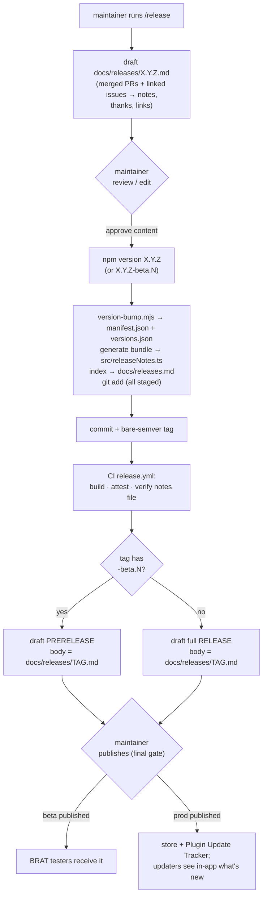
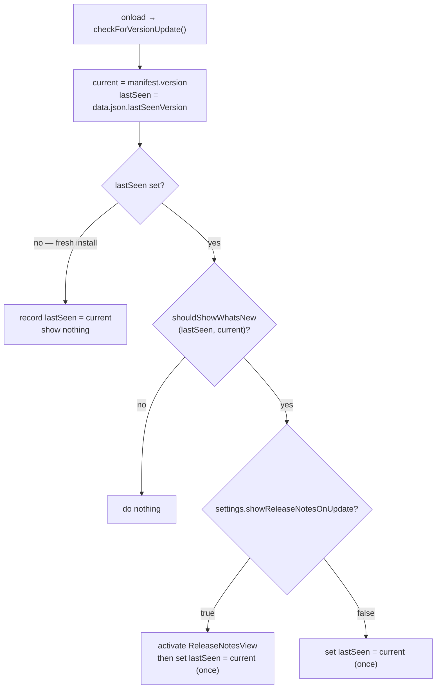

# feat: Community release pipeline

## Summary

Stand up a TaskNotes-style, **review-gated** community release process for
`tasknotes-gantt`. A local `/release` command auto-drafts user-facing release
notes (Keep-a-Changelog style, broad contributor thanks, inline links) from what
merged since the last release **and their linked issues**; the maintainer
reviews/edits the committed per-version notes file; CI packages **beta**
(prerelease, for BRAT testers) and **prod** (full release, for the store + Plugin
Update Tracker) as **draft** GitHub releases that the maintainer publishes as the
final approval. One reviewed notes source — `docs/releases/X.Y.Z.md` — feeds the
GitHub release body, an in-app "what's new" view, and a `docs/releases.md` index.

This **extends** existing machinery (`release.yml`, `version-bump.mjs`,
`versions.json`, bare-semver tags via `.npmrc`, the Vite build hooks) rather than
rebuilding it, and reuses the established `scripts/install-to-vault.mjs`
exported-fn-plus-CLI shape for new build scripts.

**Per the maintainer's planning-time decisions:** the in-app surface is a
**registered workspace view** (TaskNotes' `ReleaseNotesView` parity, not a plain
modal), and the plugin gains a **settings tab** with a "show release notes on
update" toggle. The repo has no view/settings/plugin-data scaffold today, so this
work introduces all three.

---

## Problem Frame

The plugin has no community-release process. `.github/workflows/release.yml` fires
on a bare-semver tag and calls `gh release create --generate-notes` — a raw commit
dump, auto-published, no beta channel, no curated notes, no contributor
attribution, no in-app surfacing. To release to the community we need the
end-to-end flow TaskNotes runs (the explicit model at `../tasknotes`), but with
notes **AI-drafted and review-gated** instead of hand-curated. See origin:
`docs/brainstorms/2026-06-23-community-release-pipeline-requirements.md`.

**Scope of this plan.** Build the whole pipeline as one coordinated body of work,
sequenced so the notes source + bundling land before the in-app view that consumes
them. Out of scope (carried from origin): off-the-shelf release tools
(changesets/release-please/semantic-release), a top-level `CHANGELOG.md`, a
`manifest-beta.json` channel, and auto-publishing.

---

## Requirements Traceability

| Origin | Where addressed |
| --- | --- |
| **R1** Auto-drafted notes from merged PRs + linked issues | U9 (`/release` command), U1 (notes convention/template) |
| **R2** Broad attribution (authors, reporters, requesters, testers) | U9, U1 (template guidance) |
| **R3** Inline links (issues/PRs/docs/sites) | U9, U7 (`(#123)` → link transform in view) |
| **R4** Review-and-approve gate (edit file pre-tag → publish draft) | U4 (draft release), U9 (drafts file), U10 (runbook) |
| **R5** Single source → three surfaces | U1 (source), U2 (in-app bundle), U3 (index), U4 (GH body) |
| **R6** Beta packaging (prerelease for BRAT, no manifest-beta) | U4, U10 |
| **R7** Prod packaging (full release; manifest/versions in sync) | U4 (incl. `version-bump.mjs` KTD5 prerelease guard) |
| **R8** In-app "what's new" view, once-per-version + on-demand (origin said "modal"; maintainer chose a registered view — see Alternatives) | U5, U6, U7, U8 |
| **R9** Update Tracker compatibility (plain markdown body) | U4 (body_path), U1 (markdown convention) |
| **R10** CI replaces `--generate-notes` (body_path, beta, draft, verify) | U4 |
| **NFR1** Secure release-CI posture (plan-introduced, beyond R10) | U4 (job-level perms, `persist-credentials: false`, attest `manifest.json`, hygiene-in-release, manifest-on-main guard) |
| **F1–F4** flows | U4 + U9 (F1/F2/F3), U6+U7 (F4) |

---

## Key Technical Decisions

- **KTD1 — `/release` is a committed project command at `.claude/commands/release.md`,
  not a `.claude/skills/` skill.** `.claude/skills/` is gitignored in this repo
  (managed by the `skills` CLI, per AGENTS.md), so a skill placed there would not be
  version-controlled. A project *command* under `.claude/commands/` is committed and
  invokable as `/release`. The command is a runbook the agent executes: enumerate
  merged PRs since the last release tag and their linked issues via `gh`, draft the
  per-version notes file, then hand off for review.

- **KTD2 — Notes bundle (`src/releaseNotes.ts`) is generated in TWO lifecycles,
  emitted at `buildStart`, and must be deterministic.** (a) On every Vite build via
  a **`buildStart`** hook (the "enforce always-X with a mechanism, not memory"
  learning — never a skippable `postbuild`); (b) chained into the `npm version`
  script and `git add`-ed so the reviewed bundle is committed and locked **before**
  the tag (R4). CI rebuilds from the committed `docs/releases/*.md` during
  `npm run build`.
  - **`buildStart`, NOT `writeBundle`/`closeBundle`.** `src/releaseNotes.ts` is
    *imported by* `src/main.ts`, so it is a **compile-time input** — it must exist
    *before* Rollup resolves the entry. The `copyManifest` (`writeBundle`) and
    `installToVaultPlugin` (`closeBundle`) hooks in `vite.config.ts` fire *after*
    compilation and emit *outputs*; they are the **wrong** precedent for a source
    input. Emitting in those hooks would fail the first clean build (unresolved
    import) and compile a one-build-stale file thereafter.
  - **Determinism (avoids dirty tree + committed-vs-rebuilt mismatch).** The
    generator must produce byte-identical output in both lifecycles **and across
    environments** (Windows local, Linux CI). TaskNotes derives every `date` from
    `git log -1 --format=%aI <tag>` — but that breaks here on two counts: (a) at
    `npm version` time the current version's tag **doesn't exist yet**, and (b) CI
    uses a **shallow checkout** (no `fetch-depth: 0` / tags), so git-date resolution
    returns `null` on the runner while the committed file (full clone) has real dates
    → byte mismatch. **Resolution: drop git entirely — resolve ALL versions' dates
    from a required authored `date:` line in each `docs/releases/X.Y.Z.md`** (the
    per-version files are the committed authoritative source anyway). This is a
    deliberate **divergence from TaskNotes** (whose files have no `date:` line — see
    U1). The generator **fails fast** if a notes file lacks a `date:` line (never
    silently falls back). Sort newest-first with a **semver, prerelease-aware
    tiebreak** (the same compare U5 uses) when dates are equal — a beta and its
    stable cut on the same day must order deterministically, not by filesystem
    `readdir` order. Write-if-different so the `buildStart` regen is a true no-op.
  - **Emit notes as string literals (no `.md` loader in Vite).** TaskNotes' generated
    file `import`s `docs/releases/*.md` via an esbuild `.md` loader; this repo builds
    with Vite/Rollup and has **no** `.md` loader, so the bundle inlines the notes as
    string literals. This is *why* the port diverges from TaskNotes, and it shapes the
    bundle-hygiene handling (see KTD9).
  - References: `docs/solutions/developer-experience/windows-build-and-e2e-environment-setup.md`;
    the hook precedents in `vite.config.ts`.

- **KTD3 — New build scripts mirror `scripts/install-to-vault.mjs`:** an exported
  pure function plus a thin CLI guard, idempotent, skip-if-source-absent, never
  throws to fail the build. This makes the core logic unit-testable without running
  the build (the test-at-the-fastest-level learning).

- **KTD4 — Beta = published GitHub *prerelease* on a `X.Y.Z-beta.N` tag; no
  `manifest-beta.json`.** Verified against BRAT v1.1.0+: it ignores
  `manifest-beta.json`, installs the highest semver across releases+prereleases from
  the published release **assets** (`main.js`/`manifest.json`/`styles.css`), and
  must see a *published* (not draft) release. Marking the release `prerelease: true`
  also makes Plugin Update Tracker hide it from non-beta users by default. (Sources
  in Sources & Research.)

- **KTD5 — manifest.json carries the full beta version; `versions.json` stays
  stable-only.** For a `1.2.0-beta.1` tag, `npm version 1.2.0-beta.1` sets
  `manifest.json` version to the full prerelease string (BRAT compares the asset
  `manifest.json`, so the suffix must be present for ordering). But `version-bump.mjs`
  **must be changed** (it is NOT unchanged): it currently writes
  `versions[targetVersion] = minAppVersion` unconditionally, which would insert a
  `1.2.0-beta.1` key into `versions.json` — the Obsidian **community-store** compat
  map, which expects clean `X.Y.Z` keys and is read for the *production* listing.
  Guard it: **prerelease tag → update `manifest.json` only; stable tag → update both.**
  BRAT reads release-asset `manifest.json`, never `versions.json`, so betas need no
  `versions.json` entry. (This makes `version-bump.mjs` a modified file in U4.)

- **KTD6 — In-app bundle coverage window mirrors TaskNotes:** all versions in the
  current minor series + patch releases of the previous minor series, sorted newest
  first, `isCurrent` flagged for the manifest version. (Resolves the origin
  "bundling-window policy" deferred item.)

- **KTD7 — Read versions authoritatively, degrade gracefully.** Current version
  from `this.manifest.version`; last-seen from plugin `data.json` via
  `loadData()`/`saveData()`. Never hardcode/duplicate a version string in
  `src/releaseNotes.ts` that can drift from `manifest.json`. First run / unset
  last-seen defaults to "don't surprise the user" (record current, show nothing).
  Guard the `lastSeenVersion` write to fire once and not re-enter any refresh path
  (the theme-toggle-loop lesson).

- **KTD8 — Release body comes from the committed per-version file, not
  `--generate-notes`.** CI uses `gh release create … --notes-file docs/releases/<TAG>.md`
  (or the action equivalent) and **fails fast** if the file is missing.

- **KTD9 — Bundle-hygiene check must target call-sites, not byte substrings, and
  must run in the release build.** `ci.yml` greps `dist/main.js` for patterns like
  `fetch(`/`eval(`/`atob`/`WebSocket`. Once notes prose is inlined as string
  literals (KTD2), legitimate copy like "fixed the `fetch()` retry" compiles those
  exact bytes into the bundle and trips a byte-level grep — **emitting as string
  literals is the mechanism by which it trips, not a mitigation.** Two required
  changes: (1) make the hygiene assertion call-site-aware — scope it to executable
  code (assert the *generated source* contains only string-literal assignment, no
  call expressions) or strip the `RELEASE_NOTES_BUNDLE` literal region before
  grepping `dist/main.js`; (2) run the hygiene check in **`release.yml`** too (today
  only the PR `ci.yml` runs it, but the failure manifests when `release.yml` runs
  `npm run build` from a tag — a path the PR gate never sees). Do **not** base64/escape
  the notes to dodge the grep (that introduces `atob`/decoding and breaks the
  local-only guarantee).

---

## High-Level Technical Design

### Release flow (beta and prod share the gate)



### In-app "what's new" decision (F4 / R8)



These diagrams render authoritative content; the prose and per-unit fields govern
on any disagreement.

---

## Output Structure

New files this plan creates (existing files modified are listed per-unit):

```
.claude/commands/
  release.md                         # U9 — /release drafting command (committed project command)
docs/releases/
  unreleased.md                      # U1 — working template
  0.1.0.md                           # U1 — first per-version notes (illustrative; actual version TBD)
docs/releases.md                     # U3 — generated index
docs/RELEASING.md                    # U10 — human runbook (beta → prod)
scripts/
  releaseFiles.mjs                   # U2 — shared file discovery + version parse (used by U2 + U3)
  generate-release-notes-import.mjs  # U2 — bundle generator (exported fn + CLI)
  update-release-index.mjs           # U3 — index generator (exported fn + CLI)
src/
  releaseNotes.ts                    # U2 — GENERATED bundle (committed; do not hand-edit)
  release/
    whatsNewVersion.ts               # U5 — pure shouldShowWhatsNew + version compare
    releaseNoteLinks.ts              # U7 — (#123) → GitHub link transform (pure)
    ReleaseNotesView.ts              # U7 — registered workspace view
    settings.ts                      # U6/U8 — settings shape + defaults
    GanttSettingTab.ts               # U8 — PluginSettingTab
```

Per-unit `**Files:**` remain authoritative; the implementer may adjust layout.

---

## Implementation Units

Phased: **A** notes source & build wiring → **B** packaging/CI → **C** in-app what's
new → **D** authoring & docs. C depends on A (the bundle). B is independent of C.

### U1. Notes convention, template, and first per-version file

- **Goal:** Establish `docs/releases/` with the Keep-a-Changelog convention, an
  `unreleased.md` working template encoding the attribution + link rules, and the
  first real per-version notes file.
- **Requirements:** R1, R2, R3, R5, R9.
- **Dependencies:** none.
- **Files:** `docs/releases/unreleased.md` (template), `docs/releases/<version>.md`
  (first notes file), update `CONTRIBUTING.md` (point to the convention).
- **Approach:** Mirror TaskNotes' `unreleased.md` template — section legend
  (Added/Changed/Deprecated/Removed/Fixed/Security), the entry shape
  `- (#123) Description … Thanks to @user for reporting/the contribution.`, and the
  explicit "acknowledge contributors **and** reporters/requesters/testers; do NOT
  thank the maintainer" guidance. **Deliberate divergence from TaskNotes:** each
  per-version notes file MUST carry an authored `date:` line (front-matter or a
  `date:` field), because the bundle generator resolves dates from the file, not git
  (KTD2) — TaskNotes' files omit it and rely on git tags, which doesn't work here.
  The template and U9 must always emit the `date:` line. The first per-version
  file's exact version aligns with the first release cut (see U10/U4); content is
  illustrative until then.
- **Patterns to follow:** `../tasknotes/docs/releases/unreleased.md` and a recent
  `../tasknotes/docs/releases/X.Y.Z.md`.
- **Test scenarios:** `Test expectation: none — docs/templates only, no behavior.`
- **Verification:** Template renders as valid markdown; conventions match the
  origin doc's R1–R3.

---

### U2. Release-notes bundle generator (`src/releaseNotes.ts`) + build hook

- **Goal:** Generate a committed `src/releaseNotes.ts` bundling the in-scope
  per-version notes, wired into the build (at `buildStart`) so it always runs and is
  deterministic.
- **Requirements:** R5, R8; KTD2, KTD3, KTD6, KTD9.
- **Dependencies:** U1; shares the file-discovery module with U3 (build it here).
- **Files:** `scripts/releaseFiles.mjs` (new, shared: file discovery + version
  parse), `scripts/generate-release-notes-import.mjs` (new, exported fn + CLI),
  `src/releaseNotes.ts` (generated, committed), `vite.config.ts` (add a `buildStart`
  hook invoking the generator), `package.json` (`version` script chains the generator
  and `git add src/releaseNotes.ts`), `test/unit/generateReleaseNotesImport.test.ts`,
  `test/unit/releaseFiles.test.ts`.
- **Approach:** Port TaskNotes' generator, adapted for this repo. Factor file
  discovery + version parsing into a shared `scripts/releaseFiles.mjs` (exported pure
  fns) used by **both** this generator and U3's index — so bundle membership and
  index membership can never desync. Scan `docs/releases/*.md` via the shared module
  (regex `^\d+\.\d+\.\d+(?:-[\w.]+)?\.md$`, prerelease suffix supported, `unreleased.md`
  excluded). Compute the coverage window (KTD6). **Resolve dates deterministically
  (KTD2):** current/about-to-be-released version's date from an authored `date:` line
  in its notes file (its tag doesn't exist yet); older versions from
  `git log -1 --format=%aI <tag>` (tolerate missing tag → `null`). Sort newest-first,
  emit `CURRENT_VERSION` + `RELEASE_NOTES_BUNDLE: ReleaseNoteVersion[]` with
  `{version, content, date, isCurrent}`, **as string literals** (no `.md` import —
  KTD2). Emit in Vite **`buildStart`** with write-if-different so it exists before
  compilation and the regen is a no-op against the committed file; **also** chain it
  in the `npm version` script so the committed file is locked pre-tag.
- **Patterns to follow:** `scripts/install-to-vault.mjs` (exported fn + CLI guard,
  best-effort); `vite.config.ts` `copyManifest`/`installToVaultPlugin` for the
  *plugin* shape only — NOT their `writeBundle`/`closeBundle` lifecycle (KTD2).
- **Test scenarios** (unit, against the exported fns — no build, no e2e):
  - Happy: three version files across two minor series → bundle includes current
    minor's versions + previous minor's patches, newest-first, correct `isCurrent`.
  - Edge: a `-beta.N` file is parsed and ordered below its stable sibling.
  - Dates: every version's date comes from its file's `date:` line (no git); a file
    missing the `date:` line makes the generator **fail fast**, not emit `null`.
  - Determinism tiebreak: a beta and its stable with the **same** authored date order
    by semver (stable above beta), independent of `readdir` order — same bytes on
    Windows and Linux.
  - Edge: empty `docs/releases/` (no version files) → empty bundle, no throw.
  - Edge: a dev build where the current `manifest.json` version has **no** matching
    notes file yet → the bundle simply omits it (no throw); `isCurrent` resolves to
    whichever bundled entry matches, or none.
  - Edge: `unreleased.md` is excluded from the bundle.
  - **Determinism: regenerating an already-committed bundle yields identical bytes**
    (committed == CI-rebuilt) — the core KTD2 guarantee.
  - **Hygiene (KTD9): the generated source's structure is call-site-clean** — assert
    the bundle is only string-literal assignment with no call expressions, even when
    a notes entry's prose contains `fetch(`/`eval(`/`atob`. (The byte-grep itself is
    fixed/relocated in U4.)
  - **HTML backstop:** a notes file containing raw HTML tags outside code fences
    (e.g. `<script>`, ``) is **rejected/stripped** at generation — the
    toolchain enforcement behind U9's sanitization requirement, so attacker-controlled
    PR/issue text can't reach `MarkdownRenderer` (U7) as live markup.
  - Shared module (`releaseFiles.test.ts`): discovery returns the same set the index
    will use; version parse/compare orders prereleases below stable.
- **Verification:** `npm run build` emits `src/releaseNotes.ts` at `buildStart`; a
  clean checkout builds without an unresolved-import error; regenerating yields no
  git diff; unit tests green.

---

### U3. Release index generator (`docs/releases.md`)

- **Goal:** Generate a `docs/releases.md` index from the per-version files, chained
  into the `npm version` flow with a `--check` mode for CI.
- **Requirements:** R5.
- **Dependencies:** U1, **U2** (provides `scripts/releaseFiles.mjs` — U2 must land
  before U3 within Phase A).
- **Files:** `scripts/update-release-index.mjs` (new, exported fn + CLI with
  `--check`), `docs/releases.md` (generated), `package.json` (`version` script
  chains it and `git add docs/releases.md`), `test/unit/updateReleaseIndex.test.ts`.
- **Approach:** Port TaskNotes' `scripts/update-release-index.mjs`: discover version
  files via the **shared `scripts/releaseFiles.mjs`** (same exclusion/parse as U2 — no
  duplicate regex), group by major, sort descending, emit the index with a short
  "Getting updates" + "Feedback" footer. `--check` exits non-zero if the on-disk
  index is stale (for an optional CI guard).
- **Patterns to follow:** `scripts/install-to-vault.mjs`; `scripts/releaseFiles.mjs`
  (U2); TaskNotes' `update-release-index.mjs`.
- **Test scenarios:**
  - Happy: several versions across majors → grouped, descending, latest first.
  - Edge: `unreleased.md` excluded; prerelease files included under their version.
  - `--check`: stale index → non-zero exit; fresh index → zero.
  - Membership agreement: the set of versions in the index equals the set bundled by
    U2 (both source from `scripts/releaseFiles.mjs`) — a prerelease can't appear in
    one and not the other.
- **Verification:** Generated index matches expected structure; `--check` green
  after generation.

---

### U4. Release CI — beta + prod, draft, notes body, verify

- **Goal:** Replace `--generate-notes` with the committed per-version notes file,
  support beta prerelease tags, create **draft** releases (prerelease flag for
  betas), and fail fast if the notes file is missing — preserving existing CI
  hardening.
- **Requirements:** R4, R6, R7, R9, R10; KTD4, KTD5, KTD8, KTD9.
- **Dependencies:** U1 (notes file must exist for the verify step); **U2** — CI runs
  `npm run build`, which after KTD2 emits `src/releaseNotes.ts` at `buildStart`, so
  the release build fails to compile unless U2's hook is in place. Also modifies
  `version-bump.mjs` per KTD5. Independent of U3 at runtime.
- **Files:** `.github/workflows/release.yml`, `version-bump.mjs` (KTD5 prerelease
  guard), and a hygiene-check step shared with / mirrored from `.github/workflows/ci.yml`.
- **Approach:**
  - **Tag trigger (the existing stable pattern already works — only ADD a beta
    pattern).** GitHub Actions `on.push.tags` filter patterns support `+` as a
    quantifier ("one or more of the preceding char") and are full-match anchored, so
    the existing `"[0-9]+.[0-9]+.[0-9]+"` **already** matches `1.2.0` and **already**
    excludes `1.2.0-beta.1` (the trailing suffix is unmatched). Do **not** "fix" it
    into `[0-9]*.[0-9]*.[0-9]*` — that would also match betas and route them into the
    prod branch. Just **add** a beta trigger glob admitting the `-beta.` family. Glob
    cannot express the tight negative-match, so add an **in-job regex guard** that
    fails fast unless `github.ref_name` matches
    `^[0-9]+\.[0-9]+\.[0-9]+(-beta\.[0-9]+)?$` (rejects `1.2.0-beta.x`,
    `1.2.0-beta.1-evil`). The acceptance criterion "malformed beta tag does not
    proceed" is enforced by this guard, not the trigger glob.
  - **manifest-on-`main` mechanical guard (not just the U10 runbook).** Add a
    `ci.yml` push-to-`main` assertion that `manifest.json` version matches
    `^[0-9]+\.[0-9]+\.[0-9]+$` (no prerelease suffix) so a `-beta` manifest can never
    silently land on `main` and corrupt the store-facing version. This applies the
    "enforce always-X with a mechanism, not memory" learning that KTD2 already cites.
  - Derive `TAG` from `github.ref_name` into a quoted `env:`, set
    `NOTES_PATH=docs/releases/$TAG.md`, **verify it exists** (fail otherwise). Never
    interpolate `ref_name` directly into a `run:` shell (script-injection); rely on the
    tight trigger glob to constrain the value + quote via `env`.
  - Replace `--generate-notes` with `--draft --notes-file "$NOTES_PATH"`; add
    `--prerelease` when `$TAG` contains `-beta.`. Keep attaching
    `dist/main.js dist/styles.css manifest.json`.
  - **Attest `manifest.json` too** — it is uploaded and is load-bearing for BRAT/store
    (KTD4/KTD5) but is currently NOT in the attest `subject-path`. Add it alongside
    `dist/main.js`/`dist/styles.css`.
  - **Run the KTD9 hygiene check in this workflow**, not only in PR `ci.yml` — the
    release build is where an embedded-prose substring would actually surface.
  - **Tighten the secret surface:** move `permissions` to **job level**; add
    `persist-credentials: false` to `checkout` (keep the release token out of
    `.git/config` during the untrusted build — per the SonarCloud learning). Document
    that `contents: write` + OIDC remain in scope for `npm ci`/build (the residual the
    deferred job-split would close — Alternatives).
  - **Preserve**: SHA-pinned actions, `npm ci --ignore-scripts` (the bundle is built
    by the project `build` script, not a dependency lifecycle script, so generation
    still runs), the attest fail-if-empty assertion, Node 20 pin.
- **Patterns to follow:** existing `.github/workflows/release.yml` + `ci.yml` (hygiene
  grep); `../tasknotes/.github/workflows/release.yaml` (draft + body_path + verify);
  `docs/solutions/tooling-decisions/secure-sonarcloud-ci-analysis-for-typescript.md`
  (`persist-credentials: false`, `--ignore-scripts`, SHA-pin).
- **Test scenarios:** `Test expectation: none directly unit-testable — workflow YAML.`
  The `version-bump.mjs` KTD5 prerelease guard IS unit-testable: add
  `test/unit/versionBump.test.ts` — prerelease tag updates manifest only (no
  `versions.json` key); stable tag updates both. Workflow behavior verified via dry-run
  (see Verification); the notes-file-exists guard and the beta tag negative-match are
  the key behavioral assertions.
- **Verification:** Push a throwaway `X.Y.Z-beta.0` tag on a branch → CI builds,
  runs the hygiene check, attests all three artifacts, creates a **draft prerelease**
  whose body is the per-version file, with the 3 assets attached; a missing notes file
  fails the run; a malformed beta tag does NOT trigger. Confirm `versions.json` gained
  no `-beta` key. Delete the draft after.

---

### U5. Pure version-comparison helper (`shouldShowWhatsNew`)

- **Goal:** A pure, exhaustively unit-tested predicate deciding whether to show the
  what's-new view, decoupled from any Obsidian glue.
- **Requirements:** R8; KTD7.
- **Dependencies:** none (consumed by U6).
- **Files:** `src/release/whatsNewVersion.ts`, `test/unit/whatsNewVersion.test.ts`.
- **Approach:** `shouldShowWhatsNew(lastSeen: string | undefined, current: string):
  boolean` — true only when `lastSeen` is set, valid, and strictly less than
  `current` by semver (prerelease-aware). Unset/invalid `lastSeen` → false (fresh
  install path handled by caller in U6). Keep a small internal semver compare or a
  vetted tiny dependency; no `any`.
- **Patterns to follow:** pure-module + DI testing per
  `docs/conventions/testing.md`; the test-at-the-fastest-level learning.
- **Test scenarios:**
  - Happy: `1.1.0` < `1.2.0` → true.
  - Boundary: equal versions → false; downgrade (`1.2.0` vs `1.1.0`) → false.
  - Prerelease: `1.2.0-beta.1` < `1.2.0` → true; `1.2.0` vs `1.2.0-beta.1` → false.
  - Unset `lastSeen` → false. Invalid/garbage `lastSeen` → false (no throw).
- **Verification:** Unit tests green; no Obsidian import in this module.

---

### U6. Plugin-data persistence + version-update check wiring

- **Goal:** Introduce `loadData`/`saveData` for settings incl. `lastSeenVersion`,
  and wire the once-per-version check into `onload`.
- **Requirements:** R8; KTD7.
- **Dependencies:** U5 (predicate), U2 (bundle import), U7 (view to activate).
- **Files:** `src/main.ts` (add settings load/save, `checkForVersionUpdate()`,
  invoke after layout ready), `src/release/settings.ts` (settings interface +
  `DEFAULT_SETTINGS`, incl. `lastSeenVersion?: string` and
  `showReleaseNotesOnUpdate: boolean` default true),
  `test/unit/checkForVersionUpdate.test.ts` (logic via injected fakes).
- **Approach:** On load, read settings via `loadData()` (merge over defaults). When
  merging, **validate `lastSeenVersion`** against the semver pattern (with optional
  prerelease) and a sane max length (~32 chars) before accepting it — a corrupted or
  hand-edited `data.json` value defaults to `undefined` rather than flowing into the
  compare (defence-in-depth beyond U5's read-time guard).
  `checkForVersionUpdate()`: compute current (`this.manifest.version`) vs
  `settings.lastSeenVersion`; if `shouldShowWhatsNew` and
  `showReleaseNotesOnUpdate`, activate the view (U7) then set `lastSeenVersion =
  current` and `saveSettings()` **once**; if unset (fresh install), record current
  and show nothing; guard the write so it cannot re-enter a refresh path. Defer the
  activation behind a short post-layout delay so the UI is ready — make the delay a
  **named constant, injectable/overridable** (not a hardcoded `1500`) so the U7 e2e
  drives it deterministically instead of racing a magic timer. `main.ts` is the
  **composition root**: it owns `registerView` + the activation helper (U7 provides
  the view *class*; U6 provides the check that *calls* the helper) — no unit owns
  registration, which dissolves the apparent U6↔U7 cycle. Keep `main.ts` thin
  (factory/DI per the obsidian-plugin convention).
- **Patterns to follow:** TaskNotes `src/main.ts::checkForVersionUpdate`; the
  guard-redundant-writes lesson in
  `docs/solutions/integration-issues/gantt-theme-toggle-bases-refresh-loop.md`.
- **Test scenarios:**
  - Fresh install (`lastSeenVersion` unset) → records current, does NOT activate
    the view, saves once.
  - Updated (`lastSeen` < current) + toggle on → activates view, sets lastSeen,
    saves once.
  - Updated + toggle off → no view, still sets lastSeen, saves once.
  - Same version on reload → no activation, no redundant save.
  - `saveSettings` failure is logged, not thrown (no crash on load).
- **Verification:** Unit tests green; reloading the plugin twice on the same version
  triggers at most one save and no view; the persisted `data.json` shows the
  expected `lastSeenVersion`.

---

### U7. ReleaseNotesView (registered workspace view) + link transform + open command

- **Goal:** A registered workspace view rendering the bundled notes as collapsible
  per-version sections with clickable issue/PR links, openable on update and via a
  command.
- **Requirements:** R3, R8.
- **Dependencies:** U2 (bundle).
- **Files:** `src/release/ReleaseNotesView.ts` (ItemView subclass),
  `src/release/releaseNoteLinks.ts` (pure `(#\d+)` → repo issue-URL transform),
  `src/main.ts` (`registerView`, an `addCommand` to open it, activation helper),
  `test/unit/releaseNoteLinks.test.ts`, `test/specs/whats-new.e2e.ts` (one e2e).
- **Approach:** Port TaskNotes' `ReleaseNotesView`: loop `RELEASE_NOTES_BUNDLE`,
  render each version as a collapsible section (current + first prior expanded),
  show date (formatted), a "Current" badge for `isCurrent`, and the markdown body
  via Obsidian's `MarkdownRenderer.render()`, after running `releaseNoteLinks` to
  turn `(#123)`/`(#12, #34)` into links to this repo's issues. Footer links to the
  GitHub releases page. The `(#123)` link transform runs **only in this in-app view**
  — never on the GitHub release body (which Plugin Update Tracker renders raw), so
  there's no cross-surface double-transform. Register the view type in `onload`; add a
  "Show release notes" command that activates it; the activation helper lives in
  `main.ts` (composition root, per U6) and is shared by both.
- **Interaction states (resolve implementer ambiguity):**
  - **Empty bundle** → render a non-blank fallback ("No release notes available.") so
    a command-opened view is never a blank panel that reads as a crash.
  - **Expand fallbacks** → current + first prior expanded; a single-entry bundle
    expands that one; if no entry is `isCurrent` (dev build whose manifest version
    isn't bundled), expand the first entry only.
  - **Trigger-agnostic** → the view renders the full bundle whether auto-opened (U6)
    or command-opened; no separate first-install branch.
  - **Accessibility** → use native `<details>/<summary>` for the collapsible sections
    (keyboard-reachable + screen-reader semantics) rather than a click-only `<div>`.
- **Render safety** → raw HTML in notes content must not execute. The generator
  already strips it (U9/U2 backstop); invoke `MarkdownRenderer.render()` with a
  correct `sourcePath`/component, relying on the upstream strip as the guarantee.
- **Patterns to follow:** `../tasknotes/src/views/ReleaseNotesView.ts`; Svelte
  `mount`/`unmount` in `src/bases/register.ts` if the body needs a component (plain
  DOM + `MarkdownRenderer` is sufficient and preferred here).
- **Test scenarios:**
  - Link transform (unit): `(#123)` → single repo issue link; `(#12, #34)` →
    two links; no false positives on `#` mid-word or in code spans; idempotent.
  - Covers F4. E2e (one, headless): simulate a version increase (seed `data.json`
    `lastSeenVersion` below manifest), reload → **await** the activation (drive the
    injectable delay from U6, don't sleep on the magic timer) → the view mounts and
    shows the current version's content; reload again at the same version → view does
    NOT auto-open. Reset `data.json` between runs (disposable vault).
- **Verification:** Link-transform unit tests green; the single e2e asserts
  mount + once-only against real Obsidian (per the headless-e2e learning); manual
  check limited to pixel polish.

---

### U8. Settings tab with "show release notes on update" toggle

- **Goal:** A `PluginSettingTab` exposing the `showReleaseNotesOnUpdate` toggle
  (TaskNotes parity), persisting via `saveSettings`.
- **Requirements:** R8.
- **Dependencies:** U6 (settings shape + persistence).
- **Files:** `src/release/GanttSettingTab.ts` (PluginSettingTab subclass),
  `src/release/settings.ts` (import: reads the `showReleaseNotesOnUpdate` field +
  type — created in U6), `src/main.ts` (`addSettingTab`).
- **Approach:** Build the tab with `new Setting(containerEl).addToggle(...)` bound
  to `settings.showReleaseNotesOnUpdate`, saving on change. Copy spec (for parity +
  consistency): toggle name "Show release notes on update", description "Open the
  What's New panel automatically after the plugin updates." Keep it minimal — this is
  the repo's first settings tab; structure it so future settings can be added.
- **Patterns to follow:** `src/bases/CascadeConfirmModal.ts` (the `Setting` API
  usage); standard Obsidian `PluginSettingTab`.
- **Test scenarios:** `Test expectation: minimal — thin Obsidian glue.` Optionally a
  small test that toggling updates settings and triggers a save (via injected fake).
  The decision logic it gates is already covered in U6/U5.
- **Verification:** Toggle appears in settings; flipping it persists to `data.json`
  and changes whether U6 activates the view on the next version bump.

---

### U9. `/release` drafting command

- **Goal:** A committed `/release` command that auto-drafts the per-version notes
  file from merged PRs since the last release tag and their linked issues, with
  broad attribution and links, for maintainer review.
- **Requirements:** R1, R2, R3, R4.
- **Dependencies:** U1 (template/convention to write into).
- **Files:** `.claude/commands/release.md`.
- **Approach (KTD1):** The command instructs the agent to: determine the last
  release tag **by matching the release-tag shape only** — `gh release list --limit 1`
  or a bare-semver tag match — **NOT** `git describe --tags --abbrev=0`, which in this
  repo resolves to unrelated `archive/*` / `backup-*` tags and would silently
  enumerate from an arbitrary point. "No tag matching the release glob" is the
  first-release signal (→ summarize from initial history). Then enumerate PRs merged
  since it (`gh pr list --search "merged:>=<date>"` or by commit range) and, for each,
  read the PR body + **linked issues** (`gh pr view`, `gh issue view`) to identify the
  code author **and** the reporter/requester/tester to thank; categorize each change
  (Added/Changed/Fixed/…); draft user-meaningful prose with `(#NNN)` refs and relevant
  doc/website links; write `docs/releases/<next-version>.md` following U1's template
  (**including the required `date:` line** — KTD2/U1); compute the suggested next
  version (semver bump from the change set; `-beta.N` when cutting a beta). Explicitly
  stop for maintainer review — drafting only, never tags or publishes. Honors the
  no-AI-attribution and "don't thank the maintainer" rules.
  - **Sanitize ingested text (markdown-injection guard).** PR titles/bodies and issue
    bodies are **attacker-influenceable** (any external contributor or issue filer).
    That text is written into the notes file, bundled as a string literal, and later
    rendered in-app via `MarkdownRenderer.render()` (U7) — which can execute embedded
    HTML. The command must **strip or escape raw HTML tags** (anything `<…>` outside
    code fences) from fetched text before writing, treating it as data not markup
    (this extends the shell-injection guidance in Risks to the render path). A
    toolchain backstop enforces it (see U2 below), so the maintainer review isn't the
    only gate.
- **Patterns to follow:** the CE command/skill structure; AGENTS.md git + attribution
  conventions; TaskNotes' `unreleased.md` thanking conventions.
- **Test scenarios:** `Test expectation: none — prompt/runbook artifact, not code.`
  Validated by a dry run on the repo (see Verification).
- **Verification:** Running `/release` on the repo produces a well-formed
  `docs/releases/<version>.md` matching U1's convention, thanking the right people
  with correct issue links, and stops for review without tagging.

---

### U10. RELEASING runbook (human steps, beta → prod)

- **Goal:** Document the maintainer's end-to-end steps for cutting a beta then a prod
  release, including the two-beat approval gate and the BRAT upgrade-gap caveat.
- **Requirements:** R4, R6, R7.
- **Dependencies:** U2, U3, U4, U9 (documents their combined flow).
- **Files:** `docs/RELEASING.md`; link it from `CONTRIBUTING.md`.
- **Approach:** Step-by-step: run `/release` → review/edit the notes file →
  `npm version X.Y.Z[-beta.N]` (auto-bumps manifest, bumps `versions.json` for
  **stable only** per KTD5, regenerates bundle + index, stages them) → commit + push
  tag → CI opens a **draft** (pre)release → **verify provenance on the draft assets
  (`gh attestation verify`) → publish** (the publish is both the content gate and an
  integrity gate). Document BRAT setup for testers and the **upgrade-gap caveat** (a
  tester on `X.Y.Z-beta.N` won't auto-move to `X.Y.Z`; they re-check in BRAT or wait
  for the next patch — KTD4). State the **manifest-on-`main` invariant:** cut betas on
  a branch (or otherwise ensure `main`/store-facing `manifest.json` is not left at a
  `-beta` string between a beta and its stable release); the stable `npm version X.Y.Z`
  is what lands the store-facing manifest. Note betas publish as prereleases (hidden
  from non-beta Update Tracker users), prod as full releases.
- **Patterns to follow:** `../tasknotes` AGENTS.md release section; origin doc flows
  F1/F2.
- **Test scenarios:** `Test expectation: none — documentation.`
- **Verification:** A maintainer can follow it to cut a beta and a prod release
  without referring to the code.

---

## Scope Boundaries

### In scope
The full origin pipeline (R1–R10), built to the maintainer-chosen parity level
(registered view + settings tab).

### Deferred to Follow-Up Work
- **`--check` index guard in CI** (U3 ships the mode; wiring it into `ci.yml` as a
  gate is optional follow-up).
- **CI job-split for secret isolation** (see Alternatives) — current single-job +
  attestation is acceptable for the GITHUB_TOKEN-only secret surface.
- **Localization** of the in-app view strings (TaskNotes has i18n; this repo does
  not yet).

### Out of scope (from origin)
changesets/release-please/semantic-release; a top-level `CHANGELOG.md`; a
`manifest-beta.json` channel; auto-publishing.

---

## Alternatives Considered

- **Plain Modal vs registered view (DECIDED: view).** A plain Obsidian `Modal`
  (matching `CascadeConfirmModal`) is simpler and needs no view registration, but
  the maintainer chose the registered workspace view for TaskNotes parity
  (scrollable multi-version history, openable on demand). Accepted the added view
  lifecycle + one e2e.
- **No settings tab vs full settings tab (DECIDED: full).** Shipping default-on with
  only `lastSeenVersion` persistence would avoid standing up settings
  infrastructure, but the maintainer chose a full `PluginSettingTab` + toggle.
- **Generate the bundle only in `npm version` vs also on every build (DECIDED:
  both).** Build-only generation risks a stale committed bundle; version-only risks
  an empty bundle in dev. Doing both (KTD2) keeps dev consistent and the committed
  file locked pre-tag.
- **Notes embedding format: TS string literals vs a generated JSON asset (DECIDED:
  string literals).** A runtime-loaded JSON asset would keep notes prose out of the
  executable-code hygiene-grep surface entirely (no `fetch(`/`eval(` substring
  collision, no KTD9 rework). String literals were chosen for continuity with the
  TaskNotes port and to avoid an extra runtime asset/load path; the hygiene collision
  is instead handled by the call-site-aware check + HTML strip (KTD9, U2). Revisit if
  the hygiene handling proves fragile.
- **Single CI job vs split build/publish jobs.** The secure-CI learning favors
  isolating publish secrets in a downstream `needs:`-gated job. Deferred: the only
  secret here is the auto `GITHUB_TOKEN` (+ id-token for attestation), and the
  existing job is already SHA-pinned with `npm ci --ignore-scripts`. Revisit if a
  signing secret is ever added.

---

## Risks & Dependencies

- **BRAT beta→stable upgrade gap (confirmed behavior).** Testers on
  `X.Y.Z-beta.N` won't auto-receive `X.Y.Z`. Mitigation: documented tester step in
  `docs/RELEASING.md` (KTD4/U10). Not engineered around.
- **Draft visibility to BRAT is an inference, not documented.** Mitigation: the
  runbook treats *published* prerelease as a hard requirement; the draft gate is the
  maintainer's review step, and publishing is what exposes it to BRAT.
- **Bundle hygiene regression (Medium — string literals are the *cause*, not the
  fix).** Inlined notes prose like "fixed the `fetch()` retry" compiles those exact
  bytes into `dist/main.js` and trips the `ci.yml` byte-level grep; and that grep
  runs only on PRs, while the failure actually surfaces in the release build. The U2
  "generated file is clean" test gives **no forward coverage** of future notes. Real
  fix (KTD9): make the hygiene assertion call-site-aware (assert the generated
  *source* is string-literal-only, or strip the notes-literal region before grepping)
  **and** run the hygiene check in `release.yml`, not just `ci.yml`.
- **Attestation gaps.** `manifest.json` is uploaded but, in the current workflow, not
  attested though BRAT/store depend on it — U4 adds it to the attest `subject-path`.
  The draft window is **mutable**: assets are attested at build but a draft's assets
  could be swapped before publish, and publish does not re-verify. Mitigation: the
  U10 publish gate runs `gh attestation verify` on the draft assets, turning the human
  gate into an integrity gate (low risk for a solo maintainer, but documented).
- **Tag-push is the trust boundary.** Anyone with push access who creates a matching
  tag triggers a release build holding `contents: write` + OIDC; the new beta pattern
  widens the tag surface. Mitigation: keep the trigger glob **tight** (U4 negative-match),
  and use protected-tag rules if collaborators are added. Also: reference
  `TAG`/`NOTES_PATH` via quoted `env`, never interpolate `github.ref_name` into a
  `run:` shell (Actions script-injection).
- **Local shell-out injection (`/release` + `.mjs`).** The `/release` command runs
  `gh pr/issue` and the generators run `git log`. Pass version/tag values as argv (not
  string-interpolated into a shell) and treat fetched PR/issue text as **data, never
  shell**. Inherits the local TLS-proxy CA requirement on the maintainer's machine.
- **Markdown/HTML injection into the in-app view.** PR/issue text (attacker-influenceable)
  flows `/release` → notes file → bundled literal → `MarkdownRenderer.render()`, which
  can execute embedded HTML. Mitigation: U9 strips raw HTML from fetched text, U2's
  generator rejects raw HTML in committed notes files (toolchain backstop), and U7
  renders relying on that strip — so the maintainer review isn't the only gate.
- **First-release tag detection.** `git describe --tags --abbrev=0` would resolve to
  this repo's existing `archive/*` / `backup-*` tags and mis-scope the first release.
  Mitigation: U9 detects the last release by release-tag shape only and treats "none"
  as the first-release path.
- **`-beta` manifest leaking to `main`.** Between a beta and its stable, `manifest.json`
  carries a `-beta` string. Mitigation is **mechanical**, not just the U10 runbook: a
  `ci.yml` push-to-`main` assertion that `manifest.json` is clean semver (U4), so a
  prerelease manifest can't silently land on `main`.
- **Release-time `npm audit` gap.** `ci.yml` runs `npm audit` on PRs but `release.yml`
  does not — a vuln advisory published between the last PR and the tag isn't re-checked
  at the release gate. Accept (PR gate is the audit point) or add an audit step in U4.
- **`data.json` write loop.** Mitigation: KTD7 once-only guarded write; U6 scenario
  for redundant-save avoidance.
- **Local-dev TLS proxy** (maintainer's Windows machine): if `/release` shells out
  over HTTPS (`gh`), it inherits the `NODE_EXTRA_CA_CERTS` / `--cacert` requirement;
  never disable TLS verification. CI is unaffected (GitHub-hosted runners).
- **Node 20 pin** must hold in `release.yml` (Node 24 breaks native prebuilds per the
  build-env learning).

---

## Open Questions

- **Beta-notes lifecycle on promotion.** When `X.Y.Z` ships after `X.Y.Z-beta.N`,
  are the `-beta.N` notes files (and their bundled/indexed entries) retained, or
  folded into `X.Y.Z.md` and deleted? Either is workable; U2/U3 must handle a notes
  file **disappearing** between releases without leaving a dangling bundle/index
  entry on the next regen. Decide during U2/U10.
- **`MarkdownRenderer` HTML behavior in the target Obsidian version.** The render-path
  guard (U7/U9/U2) is defence-in-depth regardless, but confirming whether
  `MarkdownRenderer.render()` passes raw HTML through in the supported app version
  sets how strict the U2 HTML backstop must be.

---

## Phased Delivery

- **Phase A (U1, U2, U3):** notes source + bundle + index. Independently landable;
  no user-visible change yet.
- **Phase B (U4):** CI packaging. Can land after A (needs a notes file to verify).
- **Phase C — execution order U5 → U7 → U6 → U8** (U-IDs are stable; this is the
  *landing* order, not a renumber): in-app what's new, depends on U2's bundle. U7 (the
  view class) must precede U6 (the check that activates it) per U6's stated
  dependency; U8 (settings tab) needs U6's settings shape.
- **Phase D (U9, U10):** authoring command + runbook. U9 needs U1; U10 documents
  A–D, so it lands last.

A natural first end-to-end milestone: A + B + U9 + U10 enables cutting a real
review-gated release even before the in-app view (Phase C) ships.

---

## Sources & Research

- **Origin requirements:** `docs/brainstorms/2026-06-23-community-release-pipeline-requirements.md`.
- **TaskNotes reference (`../tasknotes`):** `.github/workflows/release.yaml` (tag →
  draft release, `body_path`, attest), `version-bump.mjs`,
  `generate-release-notes-import.mjs` → `src/releaseNotes.ts`,
  `scripts/update-release-index.mjs` → `docs/releases.md`,
  `src/views/ReleaseNotesView.ts` + `src/main.ts::checkForVersionUpdate`,
  `docs/releases/unreleased.md` thanking conventions, `.npmrc` (`tag-version-prefix=""`).
- **This repo:** `.github/workflows/release.yml` (current `--generate-notes`,
  bare-semver-only, no draft; SHA-pinned + `npm ci --ignore-scripts` + attestation),
  `version-bump.mjs` + `package.json` `version` script, `vite.config.ts`
  (`copyManifest`/`installToVaultPlugin` hooks), `scripts/install-to-vault.mjs`
  (script template), `src/main.ts` (thin Plugin; no data/settings/view yet),
  `src/bases/CascadeConfirmModal.ts` (Setting API), `CONTRIBUTING.md`.
- **Learnings:** `docs/solutions/developer-experience/windows-build-and-e2e-environment-setup.md`
  (Vite `closeBundle` mechanism, Node 20, TLS proxy),
  `docs/solutions/tooling-decisions/test-at-the-fastest-level-not-redundant-e2e.md`
  (unit-test pure logic, one e2e max),
  `docs/solutions/tooling-decisions/secure-sonarcloud-ci-analysis-for-typescript.md`
  (secret-bearing CI posture, `--ignore-scripts`, SHA-pin),
  `docs/solutions/integration-issues/gantt-theme-toggle-bases-refresh-loop.md`
  (guard redundant config writes),
  `docs/solutions/architecture-patterns/property-agnostic-field-resolution.md`
  (read from authoritative source, degrade gracefully).
- **External (verified, load-bearing — KTD4):** BRAT v1.1.0+ ignores
  `manifest-beta.json`, installs highest semver from published release assets, needs
  published-not-draft ([BRAT Developer Guide](https://tfthacker.com/brat-developers);
  [BRAT-DEVELOPER-GUIDE.md](https://github.com/TfTHacker/obsidian42-brat/blob/main/BRAT-DEVELOPER-GUIDE.md);
  [issue #81](https://github.com/TfTHacker/obsidian42-brat/issues/81);
  [forum: prereleases + frozen updates](https://forum.obsidian.md/t/functional-update-to-brat-version-picker-github-pre-releases-and-frozen-version-updates/98951)).
  Plugin Update Tracker renders the GitHub release **body** as arbitrary markdown and
  hides prereleases by default
  ([swar8080/obsidian-plugin-update-tracker](https://github.com/swar8080/obsidian-plugin-update-tracker)).
  *Open assumption:* draft-release invisibility to BRAT is inferred from GitHub API
  behavior, not BRAT docs.
