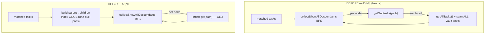
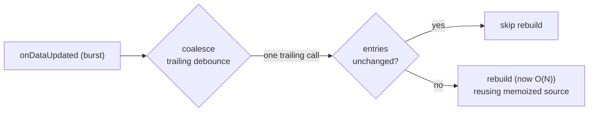

# fix: Resultset-change render loop / freeze in the Gantt Bases view (#161)

## Summary

A resultset-changing action (clear a Bases search, change a filter, toggle a resultset-affecting view setting) freezes Obsidian in real-sized vaults: the Gantt (OG) view re-renders in an unbounded loop with 1.5–1.9 s main-thread blocks. The **confirmed** root cause is an **O(N²) inverse-lookup** in Show-all expansion — `collectShowAllDescendants` calls TaskNotes' `getSubtasks(path)` once per BFS node, and that accessor scans every task in the vault per call. This plan makes the expansion **O(N)** (single-pass parent→children index), adds **defense-in-depth** against the re-render loop (coalesce notifications, skip no-op rebuilds, stop re-creating the TaskNotes source each refresh), and **investigates + fixes** the related "Show-all renders an empty chart until indexing completes" bug.

Root cause and the ruled-out hypotheses are documented in the origin report (see origin: `docs/bug-reports/2026-06-24-resultset-render-loop-161.md`); this plan is the HOW.

---

## Problem Frame

- **Trigger:** Bases re-runs its query on a resultset change and streams results on the main thread, calling the view's `onDataUpdated` repeatedly.
- **Cost (confirmed):** each call drives a full snapshot rebuild whose Show-all path is O(displayed-nodes × all-vault-tasks). On a real vault (~2657 nodes × thousands of tasks, with async per-candidate matching) this is the 1.5 s block.
- **Loop:** the long synchronous-ish rebuild starves Bases' pipeline, which re-streams → another rebuild → never settles. The exact Bases re-notify driver is inside minified `app.js` and remains *inferred*; the strong prediction is that an O(N) rebuild stops starving it and the view settles (verified in §Verification).
- **Why it never reproduced cheaply:** small/test vaults have too few tasks for O(N²) to bite; the native Bases Table view does no per-row vault scans; `expandInstances` and SVAR's render are both cheap (ruled out).

**In scope:** the O(N) expansion fix; loop defense-in-depth; the empty-chart bug.
**Out of scope:** changing Bases' own query/notify behavior (not our code); the SVAR `onScroll` null crashes (library-internal; expected to disappear once the freeze is gone — re-file upstream only if they persist).

---

## Requirements & Traceability

- **R1 — Show-all expansion must be O(N), not O(N²).** No per-node vault scan. (origin §7, §8.1)
- **R2 — A resultset change must not freeze the UI.** No multi-second main-thread block on a real-sized vault. (origin §1, §6)
- **R3 — The view must not amplify Bases notification bursts.** Coalesce rapid `onDataUpdated` calls; do not launch overlapping full rebuilds. (origin §8.2)
- **R4 — Avoid redundant work per notification.** Skip rebuild when the Bases entry set is unchanged; do not re-create the TaskNotes source on every refresh. (origin §8.2, defect B)
- **R5 — Show-all must render its matched rows even before/while relationship indexing completes** (no transient empty chart that only fills in minutes later). (origin §9)
- **R6 — Behavior parity:** the displayed companion set, instance expansion, parent/child nesting, and dependency links must be unchanged by the refactor (this is a performance fix, not a behavior change). (origin §7 "ruled out: expandInstances")

---

## Key Technical Decisions

### KTD1 — Build a parent→children index once; BFS the index instead of per-node `getSubtasks`
The freeze is `collectShowAllDescendants` calling `accessor.getSubtasks(path)` per node, each an O(N) vault scan. Replace with: build a `parent-path → child SourceTask[]` adjacency map **once** from the full task set, then the existing BFS does O(1) map lookups per node. Net O(N) instead of O(N²). `companionResolve` is already pure with an injected accessor, so the change is localized and unit-testable.

### KTD2 — Source the index from one bulk pass; pick the builder against ground-truth parity
Two candidate builders, both O(N):
- **`api.tasks.list()` + one-pass build.** Caveat (verified): `SourceTask` does **not** carry `projects` — `TaskNotesSource.toSourceTask` hardcodes `parents: []` and drops `projects`. So this path requires (a) surfacing raw `projects` on `SourceTask`, and (b) replicating TaskNotes' `resolveTaskReferencePath`/`taskReferenceMatches` (wikilink/uid/path → canonical path). More work than a "preferred" framing implies.
- **Invert `getParents` over the full list.** Reuses TaskNotes' own resolution, no replication — but it inverts the **parents** relation, which is **not guaranteed mutually inverse to `subtasks`**: upstream `getParentTasks` forward-resolves and *drops* unresolvable refs, whereas `getSubtasks`/`taskReferenceMatches` *falls back to `normalizePath(linkPath)`* — so a dangling or alias `projects` ref appears as a child under `getSubtasks` but is silently dropped by `getParents`-inversion.

**Decision:** the U1 spike picks the builder by testing each against **N× `getSubtasks` as ground truth**, including a **dangling/unresolvable ref and an alias ref**, not just a clean tree. Lean toward whichever matches ground truth exactly; the fallback is favored *only if* it passes the edge cases. This is R-A's real content — parity is the acceptance bar, not an afterthought.

### KTD3 — Memoize the active source across refreshes
`selectSource()` runs on every `onDataUpdated`, calling `createTaskNotesSource(this.app)` (one call per invocation — the two call sites are mutually exclusive branches), which re-resolves the API and re-awaits `lifecycle.ready()` each time even though the API reference and readiness are stable between refreshes. Reuse the resolved source while available; rebuild the `BasesSource`/composite from current entries each refresh (entries change — correct). **Invalidation mechanism (must specify):** `refreshSource()` is the shared path for *both* entry changes (reuse source) and availability flips (rebuild), and `onExternalSourceChange` carries no discriminator — so gate reuse on a cheap availability probe (e.g. `plugins.getPlugin('tasknotes')?.api` identity). **Staleness guard:** field config, readiness, and status palette must be **re-read each refresh** even when the source object is reused — a source memoized while the cache is cold must still observe it going warm (this interacts directly with U5). (R4)

### KTD4 — Coalesce `onDataUpdated`; guard no-op rebuilds
Wire the already-prototyped trailing-debounce (`src/bases/coalesce.ts`) into `onDataUpdated` so a burst collapses into one rebuild, and short-circuit a rebuild when the Bases entry set is unchanged from the last applied snapshot. This is defense-in-depth: once KTD1 makes rebuilds cheap, the freeze is gone; coalescing further reduces wasted work and is insurance against the (inferred) loop driver. The debounce window must be tuned to the real stream cadence (≫50 ms, or adaptive). **Lifetime-scope caveat (load-bearing):** origin ruled-out #7 has *two* parts — (1) iterations are spaced ≫50 ms apart, and (2) **the view instance is recreated mid-loop (a fresh `onload` fires)**. A trailing debounce and a memoized source both live on the `ObsidianGanttBasesView` instance, so neither survives a Bases-driven view recreation. The working assumption is that KTD1 eliminates the teardown/remount churn so the instance stays stable — **Verification step 1 must confirm no fresh `onload` fires mid-action**. If it does, U4/KTD3 must move to plugin-level (cross-instance) scope, not the view instance. **Entries-unchanged descriptor:** count + a cheap content token (e.g. first/last entry path) compared to the last applied; it does *not* suppress the oscillating mid-stream counts (260→4→58), so its value is only genuine post-settle no-ops — keep it inline in `register.ts` (one call site; no helper extraction). (R3, R4)

### KTD5 — Performance is asserted at the unit level, via call-counting, not wall-clock
The regression guard is a unit test on the pure `resolveCompanionTree`/`collectShowAllDescendants` that asserts **zero per-node `getSubtasks` calls** (replaced by one bulk build) — not a flaky timing test. Behavior-parity tests assert the resolved set is identical to the old path. (R1, R6)

---

## High-Level Technical Design

Data flow of one rebuild (`buildSnapshot`), before vs. after KTD1:

Notification handling, after KTD3/KTD4:

These diagrams are authoritative for the data flow; per-unit prose governs specifics.

---

## Implementation Units

### U1. Bulk child-index accessor
**Goal:** Provide a way to obtain a `parent-path → child SourceTask[]` index (or the raw material to build it) in a single bulk operation, replacing per-node `getSubtasks`.
**Requirements:** R1, R6.
**Dependencies:** none.
**Files:**
- `src/datasource/companionResolve.ts` — extend the `CompanionAccessor` interface with a bulk method (e.g. `getChildIndex(): Promise<Map<string, SourceTask[]>>`), keeping `getSubtasks`/`getParents` for now.
- `src/datasource/TaskNotesSource.ts` — implement the bulk method via `api.tasks.list()`.
- `src/datasource/TaskNotesSource.test.ts` (or the nearest existing datasource test) — cover the new method.
**Approach:** Implement KTD2. **Execution note: begin with a short spike** — confirm whether `api.tasks.list()` returns enough to resolve each task's parent references in one pass (preferred), or whether to fall back to inverting `getParents` over the full list (no `taskReferenceMatches` replication). Pick the path that preserves exact parent-resolution parity with the current per-node `getSubtasks` result; document the choice in the unit's code comment.
**Patterns to follow:** existing thin-adapter style of `getSubtasks`/`getParents` in `TaskNotesSource.ts` (graceful `[]`/empty on API absence or failure).
**Test scenarios:**
- Happy path: a vault with a multi-level project tree → the index maps each parent path to exactly its direct children (same membership the old per-node `getSubtasks` produced).
- Edge: task with no children → absent from / empty in the index; task with multiple parents → appears under each parent.
- Edge: malformed/childless paths and missing-API → returns an empty index, never throws (mirror the existing graceful-fallback contract).
- Parity: for a representative tree, the set of (parent → children) pairs equals what N× `getSubtasks` would have returned.
**Verification:** the new accessor returns a correct index from a single bulk fetch; no per-path scan in its implementation.

### U2. Rewrite Show-all expansion to use the index (the freeze fix)
**Goal:** Make `collectShowAllDescendants` O(N) by consuming the U1 index instead of calling `getSubtasks` per node.
**Requirements:** R1, R2, R6.
**Dependencies:** U1.
**Files:**
- `src/datasource/companionResolve.ts` — `collectShowAllDescendants` (and `resolveCompanionTree`'s wiring) consume the prebuilt index; remove the per-node `getSubtasks` call. **Also satisfy the per-task `getParents` loop (line ~94, runs in *both* modes) from the same bulk pass** — promoted from "consider" to a deliverable, so Inherit mode also drops its N async calls.
- `src/datasource/companionResolve.test.ts` — extend the existing pure-resolver tests.
**Approach:** KTD1 + KTD5. The BFS keeps its cycle-guard (membership in `displayed`); only the child-source changes from a per-node async call to an index lookup. Preserve discovery order so downstream `positionFetchedAmongMatched`/`expandInstances` order is unchanged.
**Execution note:** test-first — add the call-counting + parity tests, watch them fail against the current per-node implementation, then refactor to green.
**Patterns to follow:** the existing pure-with-injected-accessor design of `companionResolve.ts`; existing fake-accessor usage in `companionResolve.test.ts`.
**Test scenarios:**
- Covers R1. With a fake accessor that **counts calls**: Show-all resolution makes **zero** per-node `getSubtasks` calls AND **zero** per-task `getParents` calls (both satisfied from the bulk pass); assert at most one bulk call.
- Covers R6 (parity). For a multi-level tree (matched roots + nested + multi-parent + a `projects` cycle), the resolved `CompanionTask[]` (membership, `parents`, `isFetched`, `alsoTopLevel`, order) is **identical** to the pre-refactor output.
- **Parity edge cases (the KTD2 acceptance bar):** a task with a **dangling/unresolvable `projects` ref** and one with an **alias ref** must resolve identically to N× `getSubtasks` ground truth — this is where `getParents`-inversion can silently diverge.
- Edge: Inherit mode unchanged in output (no descendant collection runs); cycle terminates; empty matched set → empty result.
**Verification:** Show-all resolution is O(N) (index lookups), behavior-identical to before; the call-count test is the standing regression guard.

### U3. Wire the index through the controller, reduce the linear remainder, memoize the source, remove dead code
**Goal:** Feed the bulk index into `buildSnapshot`; eliminate the surviving per-task async loops; memoize the source; delete the now-dead `getSubtasks` chain.
**Requirements:** R4, R6.
**Dependencies:** U1, U2.
**Files:**
- `src/controller/GanttController.ts` — `toCompanionAccessor` surfaces the bulk method (and keys its duck-type probe on `getChildIndex`); `buildSnapshot()` passes the index to `resolveCompanionTree`; **batch the per-task `getDependencies` loop** (currently sequential `await` per task, ~2657 awaits in Show-all) via `Promise.all` or a bulk read; `selectSource()` memoizes the TaskNotes source per KTD3 (availability-probe invalidation + per-refresh re-read of field config/readiness).
- `src/datasource/companionResolve.ts` / `src/datasource/TaskNotesSource.ts` — **remove the dead `getSubtasks`** from the `CompanionAccessor` interface, `TaskNotesSource`, and the `toCompanionAccessor` wiring once U2 no longer calls it (leaving the O(N) inverse scan in place is a regression footgun). Retain `getParents` only if the index can't supply parents; otherwise drop it too.
- `src/controller/GanttController.test.ts` — source memoization, dependency-batching, snapshot parity.
**Approach:** KTD3. The plan's earlier claim that post-fix cost is "just index + pure expansion" was incomplete — the per-task `getDependencies` loop is a real **linear remainder** (each call is O(1) cache read upstream, but ~2657 sequential awaits add a fixed cost). Batch it so the residual is bounded. Reuse the resolved source; rebuild `BasesSource`/composite from current entries each refresh.
**Patterns to follow:** existing `selectSource`/`subscribeToSource`/`teardownSubscription` lifecycle; the duck-typed `toCompanionAccessor`.
**Test scenarios:**
- Covers R4. `createTaskNotesSource` invoked **once** across multiple `refreshSource()` calls when availability is unchanged; re-invoked after an `onExternalSourceChange`; field-config/readiness re-read each refresh (cold→warm cache observed without an availability event).
- Covers R6. Snapshot via the index equals the per-node-path snapshot for the same fixture.
- Dependency batching: dependencies for N tasks resolved without N sequential awaits (assert concurrency or a single bulk call).
- Cleanup: no remaining caller of `getSubtasks` in `src/` after the unit (grep-level assertion or removal verified by compile).
- Edge: standalone (no TaskNotes) path unchanged.
**Verification:** repeated refreshes reuse the source and re-read readiness; the dependency loop is no longer sequential; `getSubtasks` is gone from the accessor surface; snapshots unchanged.

### U4. Coalesce notifications and skip no-op rebuilds
**Goal:** Collapse `onDataUpdated` bursts into one trailing rebuild and skip rebuilds when entries are unchanged.
**Requirements:** R3, R4.
**Dependencies:** none (independent of U1–U3; can land in parallel), though best verified after U2.
**Files:**
- `src/bases/register.ts` — `onDataUpdated()` triggers the coalescer (from `src/bases/coalesce.ts`) instead of rebuilding inline; cancel on `onunload`; add an "entries unchanged since last applied" short-circuit.
- `src/bases/coalesce.ts` — reuse as-is (already unit-tested in `test/unit/coalesce.test.ts`); adjust the default window per KTD4 if the prototype's value is too tight.
- `test/unit/coalesce.test.ts` — already covers the debounce; add/keep a case for the chosen window if changed.
- Consider extracting the "entries-unchanged" comparison into a small pure helper with its own unit test (keeps `register.ts` thin per project convention).
**Approach:** KTD4. The coalescer is the prototyped trailing debounce. The entries-unchanged guard compares a cheap descriptor of `this.data.data` (count + identity/order signal) against the last applied one; on match, skip. Note the guard does **not** suppress mid-stream partial counts (260→4→58 differ), so its value is for genuine no-op notifications — the freeze fix (U2) is what tames the stream.
**Execution note:** test the window/guard logic at the unit level; do not add a flaky real-Obsidian loop e2e (the loop only reproduces at scale — see Verification for the manual in-vault check).
**Patterns to follow:** `src/bases/coalesce.ts` + `test/unit/coalesce.test.ts`; the project's "extract logic, keep register thin" convention.
**Test scenarios:**
- Happy path: N rapid `onDataUpdated` triggers → one trailing rebuild (debounce unit test already covers the mechanism).
- Edge: unchanged entries → rebuild skipped; changed entries → rebuild runs.
- Edge: `onunload` cancels a pending rebuild (no rebuild after teardown).
**Verification:** a burst yields one rebuild; a no-op notification yields none; teardown cancels cleanly.

### U5. Investigate + fix the "Show-all renders empty until indexing completes" bug
**Goal:** Show-all must render its matched rows immediately, not a transient empty chart that fills minutes later.
**Requirements:** R5.
**Dependencies:** U2 (work on the post-refactor code).
**Files:** TBD after the investigation — likely `src/controller/GanttController.ts` (`buildSnapshot`/`resolveAndFilter`) and/or `src/datasource/TaskNotesSource.ts`.
**Approach:** **Execution note: investigate-first** (the bug only reproduces in a large, mid-indexing vault). Hypotheses, **reordered to match the timing evidence** ("empty for ~30 min until TaskNotes finished background-indexing, *then* rows appeared" most directly implicates a cold cache, not a date filter):
1. **TaskNotes cache warmth (lead).** The source resolves / `getTasks` / the bulk index run against a not-yet-populated `cacheManager.getAllTasks()`, yielding an empty/partial set; the chart renders empty until the cache warms. **Interaction with KTD3 (critical):** if the bulk index is built from a cold `api.tasks.list()` and the source is then memoized, the chart could stay empty *even after* indexing completes — a **new, worse** failure than today's eventual fill. The fix must re-read on cache-warm (ties to KTD3's per-refresh readiness re-read) — treat a cold cache as "not loaded" and re-render on the readiness/index-update event rather than committing an empty chart.
2. **Date-policy filtering during indexing** — `resolveAndFilter` ([GanttController.ts:1006-1020](src/controller/GanttController.ts#L1006-L1020)) drops `placeholder`-dated tasks when "show undated" is off; if tasks return with not-yet-indexed (null) dates, all matched rows are dropped. (Weaker fit: would also affect Inherit.)
3. **Companion fetch returning a transient empty/partial set** during indexing, interacting with hide/`alsoTopLevel` logic to drop roots.
**Patterns to follow:** the date-policy + visibility-toggle handling in `resolveAndFilter`; the readiness handling in `TaskNotesSource.create`.
**Test scenarios:**
- Cold→warm cache: bulk index/source built against an empty `getAllTasks()`, then queried after warm-up → assert the render is **not** stuck on a stale empty index (guards the KTD3-memoization interaction — the new failure mode the refactor could introduce).
- Reproduce: matched tasks with unresolved dates at first read → the view does not commit a permanent empty chart (renders rows, or shows a loading state and re-renders on readiness).
- Edge: a genuinely undated task with "show undated" off is still correctly hidden (don't over-correct hypothesis 2).
**Verification:** in the repro vault, Show-all shows matched rows immediately (or a brief loading state that resolves to rows), never a minutes-long empty chart.

---

## Sequencing & Phases

- **Phase A (the freeze fix — highest value):** U1 → U2 → U3. Lands the O(N) expansion. After Phase A, do the in-vault verification (below) before deciding how much of Phase B is still needed.
- **Phase B (loop defense-in-depth):** U4. Independent; can land alongside Phase A but its value is judged after the in-vault check.
- **Phase C:** U5 (empty-chart bug), on top of the refactored code.

---

## Verification

The freeze cost is confirmed by code; the open question is whether the O(N) fix also resolves the **loop**. After Phase A:
1. **In-vault (production repro):** Show-all → search → clear. Expect: no multi-second blocks, view settles, no climbing `[Violation]` counters. Capture two extra signals, not just "does it loop":
   - **Post-fix rebuild duration** — confirm the linear remainder (batched `getDependencies` + property rebuild + diff-sync + the full-vault `api.tasks.list()` copy) is sub-multi-second; a still-slow rebuild can keep starving Bases even with the O(N²) gone.
   - **Does a fresh `onload` fire mid-action?** This decides the lifetime-scope question for Phase B: if the view instance is recreated per iteration, per-instance coalescing/memoization (U4/KTD3) cannot help and must move to plugin scope.
2. **Optional pre-check (no build):** filter the Base to ~20–30 rows → search→clear; no loop at low volume corroborates the volume/cost diagnosis.
3. **Suite:** `npm run build` + full Jest suite green; the U2 call-count test guards against regression to per-node scanning.

---

## Risks & Mitigations

- **R-A — Parent-reference resolution parity (KTD2).** *Both* candidate builders can diverge from N× `getSubtasks` ground truth: the `api.tasks.list()` path needs `SourceTask` to surface `projects` (it currently doesn't) + `resolveTaskReferencePath` replication; the `getParents`-inversion path inverts a different relation that drops dangling/alias refs `getSubtasks` would keep. *Mitigation:* the U1 spike picks against ground truth **including dangling + alias edge cases** (U2 parity fixture). This is the highest-severity correctness risk.
- **R-B — The O(N) fix may not fully stop the loop, and Phase B may target the wrong scope.** Two compounding unknowns: (1) the Bases re-notify driver is inferred; (2) the **linear remainder** (batched-but-nonzero `getDependencies`, property rebuild, diff-sync, full-vault `api.tasks.list()` copy) could keep the rebuild slow enough to starve Bases; (3) if the **view instance is recreated mid-loop**, per-instance coalescing/memoization (U4/KTD3) cannot help. *Mitigation:* Verification measures rebuild duration AND whether `onload` re-fires; Phase B's scope (per-instance vs plugin-level) is decided by that check rather than assumed.
- **R-C — Behavior drift in the refactor.** *Mitigation:* R6 parity tests (U2/U3) assert identical resolved sets/snapshots before merging.
- **R-D — Empty-chart bug is data/timing dependent, and the refactor could worsen it (U5).** A cold-cache bulk index + source memoization (KTD3) risks a *new* permanent-empty failure. *Mitigation:* investigate-first; cache-warmth ranked as the lead hypothesis; the cold→warm test guards the memoization interaction.
- **R-E — Full-vault `api.tasks.list()` copy per rebuild.** `listTasks()` deep-copies every TaskInfo; paid on every notification regardless of resultset size. *Mitigation:* build the index once per **coalesced** rebuild (after U4's debounce), not per raw `onDataUpdated`; the U1 spike confirms the copy cost is negligible vs. the saved O(N²), else use the raw cache accessor over the copying `list()`.

---

## System-Wide Impact

- **Users:** removes a hard freeze on common Bases actions in real-sized vaults; Show-all becomes usable. Immediate workaround until shipped: a Base filter keeping the Gantt under ~50 rows.
- **Code:** touches the datasource (`companionResolve`, `TaskNotesSource`), the controller (`GanttController`), and the view glue (`register.ts`). No public API or config changes. No migration.
- **Tests:** new pure-unit coverage (index accessor, call-count parity, source memoization, coalescing guard); no new flaky real-Obsidian e2e (per the project's test-at-the-fastest-level convention).

---

## Open Questions

- **Q1 (execution-time, U1 spike):** Does `api.tasks.list()` expose enough to resolve parent refs in one pass, or do we use the `getParents`-inversion fallback? Resolved during U1, not now.
- **Q2 (U5):** Exact root cause of the empty-chart bug — resolved by the U5 investigation (needs the mid-indexing vault).
- **Q3 (verification-time):** Whether Phase B is load-bearing or pure insurance — decided by the post-Phase-A in-vault check.

---

## Deferred to Follow-Up Work

- SVAR `onScroll` null-property crashes — library-internal; expected to vanish once the freeze is gone. Re-file upstream against SVAR only if they appear on **normal use** (no freeze, no rebuild in progress) after Phase A verification passes — i.e. don't dismiss them as "gone with the freeze" if they're actually a separate scroll-DOM lifecycle issue.
- Any broader virtualization/host-sizing work — not needed (SVAR already virtualizes; ruled out as the cost).
