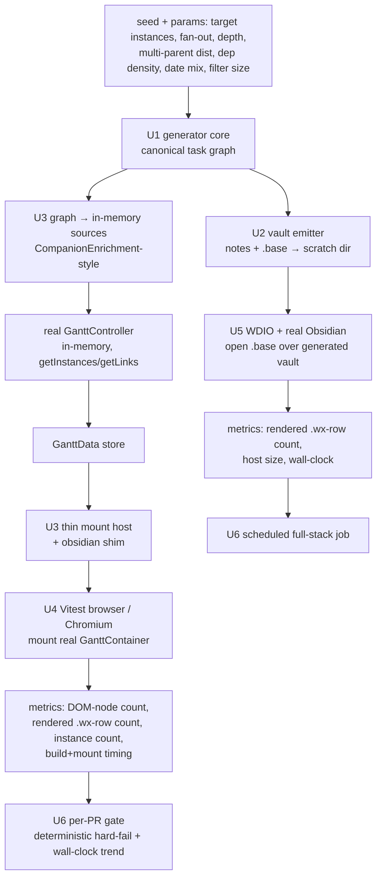
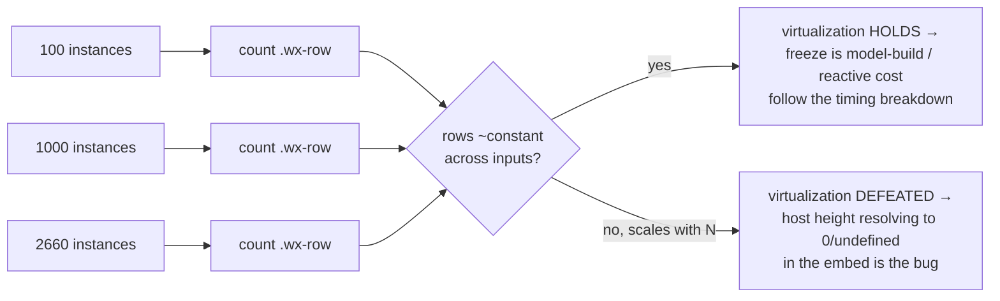

# feat: Gantt performance harness & perf gate

## Summary

Build a deterministic, seeded task-graph generator and a two-layer performance gate for the Gantt Bases view. The generator produces a production-shaped vault (~10k notes / ~5k TaskNotes tasks) where a Base filter narrows to ~261 matched while relationships span the full set — reproducing the 261→2660 render-instance explosion behind #161. Layer 1 mounts the **real** Gantt component (fed by the real controller, in-memory) in a headless browser and asserts deterministic metrics (DOM-node count, rendered-instance count, build/mount timing). Layer 2 reuses the existing WebdriverIO suite over the generated vault for fidelity. The harness's first verdict answers the open #161 question: does SVAR's row virtualization **hold in the real embed**, or is it defeated?

---

## Problem Frame

Investigation of #161 burned a day in a hypothesize → "fix" → slow-manual-in-vault-verify loop because there was no reproducible, measurable target for the layer that freezes. The data pipeline is fast (~200ms for 2660 instances, instrumented); the freeze is in the SVAR render/DOM layer, past the instrumented boundaries (`[OGDBG] sync applied` never logs). This harness is the instrument that makes the freeze reproducible on demand, turns the gating question into a number, and then persists as a regression gate.

**Research correction carried into this plan:** the bundled SVAR is **2.7.0**, not 2.3.0 as the bug report states (`package-lock.json` resolves 2.7.0; the `2026-06-18-003-chore-svar-gantt-upgrade-plan.md` upgrade landed). SVAR 2.7.0's source **virtualizes** both panes — `node_modules/@svar-ui/svelte-gantt/src/components/chart/Chart.svelte` computes a row window from the host's measured `clientHeight`, and both `Bars.svelte` and `Grid.svelte` slice `$rTasks` to `[$area.start, $area.end]`. So only ~`ceil(hostHeight/cellHeight)+3` rows should materialize, independent of total instance count.

**What the code says about the freeze cause (doc-review correction).** `GanttContainer` does **not** let the embed resolve the chart height: it sets its own `og-chart-area` to an explicit `height: ${hostHeightPx}px` where `hostHeightPx = resolveHostHeight(rowCount, …, maxHeight, minHeight)` (model-derived from SVAR's `_tasks`, capped at `maxHeight`/default 400), and SVAR measures *that* element. So the "host height resolves to 0/undefined in the embed" theory is structurally precluded except in a transient pre-measure tick — and the bug report's **H#5 already disconfirmed it** (a bounded 422px production host still froze). Therefore **virtualization almost certainly holds**, and the freeze most likely lives in the **in-memory tree/scale model build or per-instance reactive work** at ~2660 instances (bug report §8/§10 Q2: the freeze is past the instrumented boundaries, `[OGDBG] sync applied` never logs). This makes the **mount+settle timing breakdown the primary measurement and the primary hard-gate** (KD4/KD7/U4); the DOM-node-count / virtualization check is retained as a *sanity assertion + negative control*, not the headline verdict. (The earlier "45,298 wx-* nodes" figure was partly a since-removed all-elements `console.log` dump — F1 — so it is re-measured empirically, not trusted.)

**Cheapest first probe (do before calibrating the gate).** The freeze is already reproducible on the production vault (bug report §3). A single DevTools/headless **performance profile** of that existing freeze localizes the cost (layout vs model-build vs reactive) and tells us which metric to gate on — so the gate's thresholds (U4/U6) are calibrated to the empirically-localized cost rather than to the virtualization hypothesis. The durable harness is still built now for its regression-gate value, but U4's metric choices are informed by this profile.

---

## Requirements traceability

Origin: [docs/brainstorms/2026-06-25-gantt-perf-harness-requirements.md](../brainstorms/2026-06-25-gantt-perf-harness-requirements.md). Mapping of origin requirements to implementation units:

| Origin req | Covered by |
|---|---|
| R1 deterministic seeded generator | U1 |
| R2 production-shaped scale (~10k notes / ~5k tasks) | U1, U2 |
| R3 structural coverage (deep nesting, multi-parent, deps, dates, cycles, orphans, status, wide fan-out) | U1 |
| R4 filter-narrows-but-relationships-span | U1 |
| R5 parameterized by rendered-instance count / fan-out | U1 |
| R6 Layer 1 isolated render harness | U3, U4 |
| R7 Layer 2 full-stack run | U5 |
| R8 deterministic hard-gate metrics (DOM-node count, instance count, build-time ceiling) | U4, U5 |
| R9 wall-clock as trend | U4, U6 |
| R10 on-demand vault, not committed | U2, U7 |
| R11 diagnosis-first (does virtualization hold?) | U4 (first assertion), U7 |

---

## Key Technical Decisions

- **KD1 — Layer-1 runner: Vitest browser mode (v4+) + `vitest-browser-svelte` + Playwright/Chromium provider.** Reuses the existing Vite + `@sveltejs/vite-plugin-svelte` (runes) config, so SVAR's Svelte-5 source compiles exactly as in production; the test body runs in real Chromium where `document.querySelectorAll` and `performance` are real and runes work. ~200ms/test. DOM-node count via `container.querySelectorAll(...)`. *Rejected:* `@playwright/experimental-ct-svelte` (still experimental for Svelte 5 in 2026, unresolved Context issues, requires duplicating Vite config); plain Playwright over a `vite preview` page (zero Vitest but manual mount host + wait-for-sentinel + 3–8s preview startup per run); Storybook test-runner (heavy second toolchain, no advantage here). Adds a second test runner alongside jest — accepted carrying cost (see Risks).
- **KD2 — `obsidian` module shim + runes.** `GanttContainer.svelte` imports `Notice, setIcon` from `obsidian` at module scope, and pulls `CascadeConfirmModal`, which imports `{ App, Modal, Setting }`. The reachable runtime-value `obsidian` surface from the mounted graph is exactly **`Notice`, `setIcon`, `Modal`, `App`, `Setting`** (`Component`/`TFile` are NOT reachable — they live only in `register.ts`, which the harness does not mount). A standalone mount needs a Vite `resolve.alias` mapping `obsidian` → a stub exporting those five values, with runes enabled (matching `vite.config.ts`). Icons render blank without the fonts hack — cosmetic, does not affect node/timing counts.
- **KD3 — Drive the explosion through the companion/`projects` multi-parent path.** This is the documented source of the 4.4× explosion (origin + #161). Isolated layer: feed the controller a `CompanionEnrichment`-style in-memory source (the pattern already in `test/unit/GanttController.test.ts`) built from the generated graph. Full-stack layer: emit `tags: [task]` notes with multiple `projects:` wikilinks + a Show-all base.
- **KD4 — Gate on deterministic metrics; the primary hard-gate is a timing/cost ceiling, not DOM-node count.** Because virtualization almost certainly holds (Problem Frame), a bounded DOM-node count is the *expected* result and cannot catch the predicted freeze (model-build / per-instance reactive cost). So the **hard-fail metrics are: (1) mount+settle cost for the ~2660 case under a generous *absolute* ceiling measured in the deterministic ~200ms/test Chromium env** (a regression that doubles per-instance reactive cost must fail a PR), **(2) rendered-instance-count vs input graph**, and **(3) DOM-node-count bounded as a sanity assertion + negative control** (force chart-area height to 0 → confirm the harness *can* detect a defeated render; without this the node-count check has no power). Raw wall-clock that is too runner-sensitive for an absolute bound is *additionally* trended (relative >20% regression). The absolute cost ceiling is set from the DevTools-profile baseline (Problem Frame), generous enough to absorb runner noise while still catching a real regression. (Origin KD1, R8, R9 — refined by doc review: the original "DOM-node count is the primary gate" framing would pass while the real freeze went unguarded.)
- **KD5 — Isolated gate per-PR; full-stack scheduled.** The fast deterministic Layer-1 gate runs on every PR; the heavy generated-vault full-stack run is a scheduled (or label-triggered) job to keep PR CI fast. (Origin KD4 — revisable; see Open Questions.)
- **KD6 — One canonical graph, two consumers.** The generator emits a single in-memory canonical graph; a vault emitter (U2) serializes it to notes + `.base` for the e2e/diagnosis path, and a source adapter (U3) turns the same graph into the in-memory `DataSource`/relationship-index the controller consumes for the isolated path. Single source of truth keeps the two layers measuring the same shape.
- **KD7 — The timing breakdown is the load-bearing measurement; DOM-node count is the sanity layer.** Because 2.7.0 virtualizes in source, a bounded DOM-node count is the *expected* healthy result and proves only "the model-derived capped host works in Chromium" — already true by code inspection. The freeze the harness must localize is the model build / per-instance reactive work, surfaced by the timing breakdown (controller build vs `mount()` vs settle) and hard-gated per KD4. A **negative-control** (chart-area height forced to 0) gives the DOM-node sanity check real power; otherwise it can never observe a defeated render and a green node-count is uninformative.

---

## High-Level Technical Design

The generator is the shared foundation; the two measurement layers consume it through different adapters.



Virtualization check (U4 **sanity assertion + negative control**, not the primary verdict — see KD4/KD7): render at increasing instance counts and assert the materialized row count stays at the exact window size rather than scaling with input. Because the host height is model-derived and capped, "holds" is the near-certain outcome; the primary hard-gate is the mount+settle timing ceiling, and this check earns its power from the negative control (forced height 0).



---

## Output Structure

New files (all under `test/perf/` plus CI + script wiring). The per-unit **Files** sections are authoritative; this tree is the scope shape.

```text
test/perf/
  generator/
    graph.ts            # canonical graph types + invariants
    generate.ts         # seeded generator (params → graph)
    emitVault.ts        # graph → TaskNotes-convention notes + .base (scratch dir)
    toSources.ts        # graph → in-memory DataSource / relationship index for the controller
    buildGanttData.ts   # graph → controller → GanttData (mirrors register.ts buildGanttData)
    generate.test.ts    # determinism + structural-invariant unit tests (jest, node)
    emitVault.test.ts   # frontmatter round-trip unit tests (jest, node)
  isolated/
    obsidian-shim.ts        # Notice/setIcon/etc. stub for the alias
    GanttPerfHost.svelte    # thin host mounting GanttContainer read-only with injected GanttData
    render.perf.ts          # Layer 1 perf gate (vitest browser)
  vitest.config.ts          # browser-mode config (Playwright provider, obsidian alias, runes)
test/specs/
  gantt-perf-fullstack.e2e.ts  # Layer 2 (WDIO, scheduled)
scripts/
  perf-gen.mjs            # CLI: generate a vault on demand into a scratch dir (R10/R11 diagnosis)
.github/workflows/
  perf.yml               # scheduled full-stack perf job (+ trend artifact)
```

---

## Implementation Units

### U1. Deterministic graph generator core

- **Goal:** A pure, seeded generator that turns parameters into a canonical in-memory task graph reproducing the production shape and the structural mix.
- **Requirements:** R1, R2, R3, R4, R5.
- **Dependencies:** none.
- **Files:** `test/perf/generator/graph.ts`, `test/perf/generator/generate.ts`, `test/perf/generator/generate.test.ts`.
- **Approach:** Define a canonical graph type (tasks with id/path/title, parent edges via `projects`, dependency edges with reltype+gap, start/due dates, status, a `matched` flag for the filter subset). Use an injected, seeded PRNG (deterministic — no `Date.now()`/`Math.random()`); the seed is a parameter. Parameters: total notes (~10k), task count (~5k), matched-subset size (~261), multi-parent distribution (counts of tasks with 2/4/7 parents), max nesting depth (≥5), dependency density, date-coverage mix (dated / undated / start-only / end-only proportions), cycle count, orphan count, and target rendered-instance count (the generator tunes fan-out to approach it — R5). Crucially, parent/dependency edges from matched tasks must **cross the filter boundary** into non-matched tasks (R4) so Show-all expansion pulls them back in. Keep it pure and Obsidian-free so it runs under jest's `node` env.
- **Patterns to follow:** the relationship-index shape consumed downstream — `RelationshipIndex` (`childrenByPath`/`parentsByPath`) in `src/datasource/companionResolve.ts`; `SourceTask` / `SourceDependency` in `src/datasource/types.ts`.
- **Execution note:** Implement test-first — determinism and structural invariants are precise, checkable contracts.
- **Test scenarios:**
  - Determinism: same seed + params → byte-identical graph (deep-equal); different seed → different graph.
  - Scale: produces the requested task/note counts within tolerance.
  - Multi-parent distribution: the requested counts of 2-/4-/7-parent tasks are present.
  - Depth: at least one chain reaches the requested nesting depth (≥5).
  - Boundary-crossing (R4): a measurable fraction of matched tasks have at least one parent or dependency that is a non-matched task.
  - Cycles: requested cycles exist in the `projects` graph (and are well-formed, so the expander's cycle-break path is exercised).
  - Orphans: requested dangling refs exist (parent/dep pointing at a non-existent or non-matched path).
  - Date mix: dated / undated / start-only / end-only proportions match params.
  - (Cross-layer instance-count targeting (R5) — feeding the graph through the source adapter + controller to confirm the rendered-instance count approaches the target — is owned by U3's pipeline-parity test, since it needs U3's adapter + the controller. U1's own tests stay pure graph-level, so U1's `Dependencies: none` holds.)
- **Verification:** `npm test` passes the new generator suite; a quick console of the graph stats (task count, matched count, multi-parent histogram, max depth, boundary-crossing %) matches the requested params.

### U2. Vault emitter (graph → notes + `.base`)

- **Goal:** Serialize a canonical graph to a real Obsidian vault — TaskNotes-convention notes plus a `.base` — in a disposable scratch directory, for the full-stack layer and on-demand diagnosis.
- **Requirements:** R2, R10.
- **Dependencies:** U1.
- **Files:** `test/perf/generator/emitVault.ts`, `test/perf/generator/emitVault.test.ts`.
- **Approach:** Write each task as a markdown note with frontmatter following the **companion convention** confirmed in `test/vaults/gantt-companion/`: `tags: [task]`, `projects: ["[[Parent]]", ...]` (multi-parent = list), `scheduled` / `due` dates (respecting the date-coverage mix — omit one or both for undated/partial), a `status`, and `blockedBy: [{ uid: "[[Pred]]", reltype: FINISHTOSTART|…, gap: P2D|null }]` for dependency edges. Write non-task filler notes to reach ~10k total. Emit a `.base` mapping the companion fields (`tngantt_startDateProperty: note.scheduled`, `tngantt_endDateProperty: note.due`, `tngantt_expandedRelationships: show-all`, a filter — e.g. `file.hasTag("project")` or a generated tag — that selects the ~261 matched subset). Always write under an injected scratch/temp path; never the live vault (origin R10; learning: never target the live Google-Drive vault).
- **Patterns to follow:** `test/vaults/gantt-companion/*.md` + `Companion.base` (frontmatter + base mapping); `test/vaults/gantt-dependencies/Build FS.md` (`blockedBy` shape); `scripts/install-to-vault.mjs` (node fs-writing convention).
- **Test scenarios:**
  - Round-trip: a small known graph → emitted notes → re-parsed frontmatter matches the graph's edges/dates/status.
  - Multi-parent: a 4-parent task emits a 4-item `projects` list.
  - Dependency: a `blockedBy` edge emits the `{uid, reltype, gap}` shape with a valid reltype.
  - Filter expression: the emitted `.base` file's filter field contains the expected query string (the generated tag / file property) targeting the matched subset. (The behavioral "selects exactly N notes" assertion needs a real Bases evaluator → it lives in U5's full-stack spec / manual verification, not this jest/node unit test.)
  - Scratch-only: emitter refuses / requires an explicit target dir; never writes outside it.
  - Date mix: undated and start-only tasks emit the expected partial frontmatter.
- **Verification:** Emit a small vault, open it manually in Obsidian (or via U5), and confirm the Gantt renders the expected matched set with Show-all expansion.

### U3. Isolated-render harness infrastructure

- **Goal:** Stand up the headless-browser component-mount tooling and the graph→GanttData pipeline so the real `GanttContainer` can render generated data outside Obsidian.
- **Requirements:** R6.
- **Dependencies:** U1.
- **Files:** `test/perf/vitest.config.ts`, `test/perf/isolated/obsidian-shim.ts`, `test/perf/isolated/GanttPerfHost.svelte`, `test/perf/generator/toSources.ts`, `test/perf/generator/buildGanttData.ts`. New devDependencies: `vitest` (^4), `@vitest/browser`, `vitest-browser-svelte` (^2.1.1), `playwright`/`@playwright/test` (Chromium).
- **Approach:**
  - `obsidian-shim.ts`: export the exact runtime values reachable from the mounted graph — `Notice`, `setIcon`, `Modal`, `App`, `Setting` (the last three via `CascadeConfirmModal`) — as inert stubs. (Not `Component`/`TFile` — not reachable without `register.ts`.)
  - `vitest.config.ts`: browser mode, Playwright provider, headless; reuse `@sveltejs/vite-plugin-svelte` with `runes: true`; `resolve.alias` map `obsidian` → `obsidian-shim.ts`; `include` only `test/perf/isolated/**/*.perf.ts` so jest and vitest never overlap (jest matches `**/*.test.ts`).
  - `toSources.ts`: turn a canonical graph into the in-memory `DataSource` + relationship index the controller consumes (mirror `CompanionEnrichment`/`FakeSource` from `test/unit/GanttController.test.ts`).
  - `buildGanttData.ts`: run the real `GanttController` (`bases-scoped`, fake app, injected sources, companion config) → assemble a `GanttData` value. This is **harness-local assembly, NOT a mirror of the private `register.ts` `buildGanttData`** — that method calls `this.app.vault` / `this.app.metadataCache` / `this.config.get` which the in-memory harness lacks. Populate only the perf-load-bearing fields from the controller (`instances`, `links`, `capabilities {write:false}`, `arrowMode`, `statusColors`, `maxHeight: 400`, `minHeight`) and **stub the Obsidian-dependent fields** (`propertyValues` → empty map, `gridColumns` → minimal name-only set) — they don't affect the row-count/timing metrics. (Optional: if drift with `register.ts` is a concern, extract a shared `assembleGanttData(controller, overrides)` helper into `src/bases/` that both consume — decide at implementation; inlining is acceptable since it's ~a few calls.)
  - `GanttPerfHost.svelte`: a thin host that takes a `GanttData`, wraps it in `writable`, mounts `GanttContainer` with `themeMode: 'light'` (skips the auto-theme Obsidian subscription) and a minimal `app` stub. **Do not impose an arbitrary outer fixed height** — `GanttContainer` sets its own `og-chart-area` height via `resolveHostHeight` (capped at `maxHeight`), so the production `maxHeight: 400` is what governs SVAR's window; let it. Set the `data-render-complete` sentinel **only after SVAR's `clientHeight` binding has flushed and `dataRequest` has re-run with a non-zero `chartHeight`** (poll until `.wx-area` reports non-zero height AND the `.wx-row` count is stable across two animation frames) — not merely after `mount()`, so a `chartHeight=0` transient (`num=1`) can't be mistaken for a healthy bounded window.
- **Patterns to follow:** `test/unit/GanttController.test.ts` (`FakeSource`, `CompanionEnrichment`, `makeController`); `src/bases/register.ts` `buildGanttData` (reference for which fields exist — NOT to replicate its Obsidian calls); `src/bases/types/gantt-view-data.ts` (`GanttData` fields); `vite.config.ts` (svelte plugin runes + obsidian external).
- **Execution note:** Start U3 with a **go/no-go spike** — mount the real `GanttContainer` (obsidian shim + runes + `vitest-browser-svelte`) and confirm SVAR's Svelte-5 source compiles and renders ≥1 `.wx-bar` in headless Chromium — **before** building U4–U7 on top. If the spike fails (runes/compile/alias issue), evaluate the plain-Playwright-over-Vite-preview fallback's per-PR runtime against the CI budget *then*, not mid-U4; if it busts the budget, revisit KD5 (the isolated gate may have to be scheduled, weakening R6) rather than discovering it late.
- **Test scenarios:**
  - Smoke: mounting `GanttPerfHost` with a tiny generated graph renders ≥1 `.wx-bar` and sets the sentinel (proves the shim + runes + alias work).
  - Pipeline parity + instance-count targeting (R5): `buildGanttData` over a known graph yields the same instance count as `controller.getInstances()` returns (no double-counting), and a graph tuned to a target rendered-instance count produces a count near that target (sanity bound). This is the cross-layer check U1 defers here.
  - Read-only: the read-only banner renders and no write affordances are active (capabilities `{write:false}`).
  - `Test expectation:` the perf assertions themselves live in U4; U3's tests prove the harness mounts and feeds data correctly.
- **Verification:** `vitest` run mounts the component headlessly and the smoke test passes locally on Node 20.

### U4. Isolated render perf gate (Layer 1) — the virtualization verdict

- **Goal:** The per-PR deterministic gate that mounts the real component at production-scale instance counts and answers whether virtualization holds, plus the regression metrics.
- **Requirements:** R6, R8, R9, R11.
- **Dependencies:** U1, U3.
- **Files:** `test/perf/isolated/render.perf.ts`.
- **Approach:** Generate graphs at fixed seeds targeting representative instance counts (e.g. ~100, ~1000, ~2660 — the Inherit/Show-all production points). For each: build `GanttData` (U3), mount via the host using the **production `maxHeight` (400)** so the model-derived `hostHeightPx` governs the window exactly as in the embed (not an arbitrary outer fixed height — see U3), await the sentinel (which fires only after SVAR's `clientHeight` binding flushes and `dataRequest` re-runs with non-zero height — U3), then measure: (a) **mount+settle cost** via `performance` marks (controller build, `mount()`, settle); (b) total instance count from the `GanttData`; (c) materialized row count via `container.querySelectorAll('.og-bases-gantt .wx-row')`. **Primary hard-gate (KD4):** mount+settle cost for ~2660 under a generous *absolute* ceiling (calibrated from the DevTools profile). **Secondary hard-gates:** rendered-instance count matches the graph's expected expansion within tolerance; the materialized window **equals** `ceil(min(content,maxHeight)/cellHeight)+1` exactly (not an approximate "< ~50" bound, so a `chartHeight=0` transient reading `num=1` cannot masquerade as healthy). **Negative control:** a case that forces `og-chart-area` height to 0 and asserts the harness *detects* the unbounded/collapsed window — proving the node-count check has power. Wall-clock that's too runner-sensitive for the absolute bound is trended (U6). The ~2660 case is the explicit #161 reproduction.
- **Patterns to follow:** the `.og-bases-gantt .wx-row` / `.wx-bar` selectors used in `test/specs/gantt-readonly-render.e2e.ts` and `gantt-viewport-sizing.e2e.ts`; the existing `[OGDBG]` mount/build timing in `GanttContainer.svelte` (the harness can read the same marks or re-measure).
- **Test scenarios:**
  - Covers R11. **Primary — mount+settle cost ceiling:** at ~2660 instances, controller build + `mount()` + settle stays under the generous absolute ceiling (the gate that actually catches the predicted model-build / reactive freeze; guards the already-removed O(N²) and future per-instance-cost regressions).
  - Window exactness (sanity): the materialized `.wx-row` count equals `ceil(min(content,maxHeight)/cellHeight)+1` for the bounded `maxHeight=400` host, and is ~constant across 100 / 1000 / 2660 inputs (virtualization invariant) — NOT an approximate "< 50" bound.
  - **Negative control:** with `og-chart-area` height forced to 0, the harness detects the window collapse / unbounded count (proves the node-count check can fail when it should).
  - Instance-count: rendered instance count for a fixed graph matches the expected multi-parent expansion (catches expansion-multiplier regressions).
  - Sentinel correctness: the measurement reads only after `clientHeight` is non-zero and the row count is stable across two animation frames (no pre-measure `num=1` transient).
  - Determinism: same seed → identical instance count and identical exact window size across runs.
  - Wall-clock trend: render/settle wall-clock captured and written to the trend artifact (asserted present, not thresholded).
- **Verification:** `npm run perf:isolated` (new script) passes; the run prints the mount+settle timing breakdown and the exact window size for the ~2660 case — localizing the freeze cost (the bug report's open question), and the negative control demonstrably fails when collapse is injected.

### U5. Full-stack perf spec (Layer 2)

- **Goal:** A real-Obsidian e2e that renders the generated large vault end-to-end and asserts the same deterministic metrics, catching integration-level defeats the isolated layer can't see.
- **Requirements:** R7, R8.
- **Dependencies:** U1, U2.
- **Files:** `test/specs/gantt-perf-fullstack.e2e.ts`.
- **Approach:** Generate a large vault (U2) into a temp dir (hermetic copy pattern), `reloadObsidian({ vault, plugins: ['tasknotes-gantt'] })` with TaskNotes enabled, enable the Bases core internal plugin, open the generated `.base`, wait for `.og-bases-gantt .wx-bar`, then assert the materialized `.wx-row` count is bounded (virtualization holds in the real embed — the production-faithful version of U4's verdict) and capture host size + wall-clock. Mark this spec so it runs in the scheduled job, not the per-PR `build` gate (KD5).
- **Patterns to follow:** `test/specs/gantt-readonly-render.e2e.ts` and `gantt-viewport-sizing.e2e.ts` (hermetic temp-vault copy, `reloadObsidian`, enable Bases, open `.base`, `waitUntil` on `.wx-bar`, `getSize()`); `test/wdio/wdio.conf.mts` (TaskNotes 4.11.0 download + cache).
- **Execution note:** The full-stack layer is the slow/fidelity layer — keep assertions structural (node counts, host size), not pixel/timing-precise (learning: WDIO can't measure feel; wall-clock is noisy). Set a generous wait — a 10k-note vault needs TaskNotes to finish indexing before Bases opens, plausibly **2–5× the existing 60s `.wx-bar` wait** seen in `gantt-viewport-sizing.e2e.ts`; quantify against a first run and fail fast with a clear message if indexing exceeds it.
- **Test scenarios:**
  - Renders: the generated `.base` opens and shows the matched set (≥1 `.wx-bar`) without freezing within the spec timeout.
  - Virtualization (real embed): materialized `.wx-row` count is bounded at the ~2660-instance vault (the production-faithful verdict; if it scales with instances, the embed defeats virtualization — the prime P2 suspect).
  - Host sizing: host height resolves to the bounded `resolveHostHeight` value, not 0 or content-height.
  - Wall-clock: time-to-first-render captured to the trend artifact (not gated).
- **Verification:** `npm run perf:e2e` (or the scheduled job) renders the large vault and the assertions pass; artifacts uploaded on failure.

### U6. CI wiring + trend tracking

- **Goal:** Run the isolated gate per-PR, the full-stack perf spec on a schedule, and track wall-clock as a committed/artifact trend gated on relative regression.
- **Requirements:** R8, R9.
- **Dependencies:** U4 (and U5 for the scheduled job).
- **Files:** `.github/workflows/ci.yml` (add isolated-gate step), `.github/workflows/perf.yml` (new scheduled full-stack job), `package.json` (scripts: `perf:isolated`, `perf:e2e`, `perf:gen`), trend artifact location (e.g. a JSON under `test/perf/` or a CI artifact).
- **Approach:** Add an isolated-perf step to the per-PR `build` job (after unit tests): `npx playwright install chromium` then `npm run perf:isolated`. Create `perf.yml` with an explicit `permissions: contents: read` block (matching `ci.yml`'s least-privilege invariant; add `actions: read` only if the trend-comparison step downloads prior-run artifacts) on a `schedule:` (and `workflow_dispatch`) trigger that builds the plugin, generates the large vault, and runs the full-stack perf spec with the same TaskNotes-download `GITHUB_TOKEN` env as the existing `e2e` job. Write wall-clock results to a JSON trend file uploaded as an artifact; the gate compares against the last baseline and fails only on a relative regression beyond a tolerance (e.g. >20%). Respect Node 20 + `NODE_EXTRA_CA_CERTS` (learning: Windows native-binary + AV cert friction).
- **Patterns to follow:** `.github/workflows/ci.yml` `build` + `e2e` jobs (windows-latest, Node 20, `npm ci --ignore-scripts`, temp-vault prep, `GITHUB_TOKEN` for TaskNotes download, artifact upload).
- **Test scenarios:** `Test expectation: none -- CI/config + scripts; behavior is exercised by U4/U5 which these jobs run. Verify by a dry-run of the workflow (act/workflow_dispatch) and confirming the isolated gate fails the PR when a deliberately-regressed render is introduced.`
- **Verification:** A PR runs the isolated gate green; the scheduled workflow runs the full-stack spec; a deliberately-broken render (e.g. forcing a non-virtualized host) fails the gate.

### U7. On-demand generation CLI (diagnosis)

- **Goal:** A one-command way to generate a production-shaped vault into a scratch dir for manual diagnosis/repro (the "first step" use the harness was requested for).
- **Requirements:** R10, R11.
- **Dependencies:** U1, U2.
- **Files:** `scripts/perf-gen.mjs`, `package.json` (`perf:gen` script).
- **Approach:** A small node CLI wrapping U1+U2: accept seed + params (or a named preset like `--preset show-all-2660`) and an output dir (default a scratch/temp path), emit the vault, and print the resulting graph stats + the path. Used to drop a repro vault into a disposable Obsidian vault for live inspection while fixing P2.
- **Patterns to follow:** `scripts/install-to-vault.mjs`, `scripts/e2e-local.mjs` (node CLI conventions, env-driven paths).
- **Test scenarios:** `Test expectation: none -- thin CLI wrapper over U1/U2 (both unit-tested). Verify by running it and confirming a vault appears in the scratch dir with the reported stats.`
- **Verification:** `npm run perf:gen -- --preset show-all-2660 --out <scratch>` produces a vault that, opened in Obsidian, reproduces the heavy Show-all render.

---

## Scope Boundaries

**In scope:** the generator, both measurement layers, CI/trend wiring, and the diagnosis CLI — the instrument.

### Deferred to Follow-Up Work
- **Fixing #161 / P2 itself.** This plan builds the instrument and produces the virtualization verdict; the actual fix (and which lever — host-height repair, instance-explosion reduction, or bulk diff-sync) is the next plan, informed by what the harness localizes.
- **Bulk diff-sync via `provide-data`/`parse`/`filter-tasks`.** A likely P2/refresh fix candidate the harness should be able to measure, but not built here.
- **Instance-explosion reduction** (taming the 4.4× multi-parent multiplier) — a fix candidate, measured-not-changed here.
- **Pixel/visual-diff or interaction-feel testing** — out of this harness's remit (structural + timing only).
- **Updating the #161 bug report's stale "SVAR 2.3.0" references and the `svar-grid-resize-api-and-version-gap` memory** to 2.7.0 — a quick docs correction to do alongside, tracked separately.

---

## Risks & Dependencies

- **New toolchain friction (highest practical risk).** Vitest browser mode + Playwright/Chromium is greenfield here. Per `docs/solutions/developer-experience/windows-build-and-e2e-environment-setup.md`: Node 20 via fnm is mandatory, `NODE_EXTRA_CA_CERTS` for AV TLS, and the npm optional-native-binary bug can make a passing build still fail to run tests. Mitigation: pin versions, install Chromium explicitly in CI, validate on Node 20 locally first.
- **`obsidian` shim drift.** If `GanttContainer` (or a sibling it imports) starts using a new `obsidian` runtime export, the shim must grow or the mount breaks. Mitigation: keep the shim minimal and let the U3 smoke test fail loudly when an export is missing.
- **Vitest-browser + Svelte 5 maturity.** Stable since Vitest 4.0 (Dec 2025) / `vitest-browser-svelte` 2.1.1 (Apr 2026) — recent. Mitigation: the plain-Playwright-over-Vite-preview fallback (KD1 rejected-but-viable) is the escape hatch if the Vitest path fights us.
- **E2E flake at scale.** A 10k-note vault stresses `reloadObsidian` + TaskNotes indexing; the full-stack spec may be slow/flaky. Mitigation: scheduled (not per-PR), generous timeouts, structural assertions only, and the isolated layer is the real gate.
- **Generator fidelity.** The in-memory source adapter must reproduce TaskNotes' relationship semantics faithfully or the isolated layer measures the wrong shape. Mitigation: KD6's single-canonical-graph + the U3 pipeline-parity test + cross-checking the isolated instance count against the full-stack render.
- **Wall-clock noise.** Mitigated by KD4 (trend + relative-regression gate, never absolute).

---

## Open Questions

- **Full-stack cadence (KD5):** scheduled vs per-PR vs label-triggered. Defaulted to scheduled; revisit once Layer-1 runtime is known. (Origin open question.)
- **Threshold calibration:** the exact mount+settle absolute ceiling, instance-count tolerance, exact-window value, and wall-clock regression tolerance must be calibrated from the DevTools profile + first real runs — deferred to implementation, not guessed here. Until a baseline exists, the wall-clock trend gate is inert (the first runs establish it); call this out in U6's verification. (Origin open question.)
- **Trend storage:** **default to CI-artifact-only** (download the prior run's artifact via `gh run download` for the relative-regression comparison) to preserve the `permissions: contents: read` invariant on all workflows. Only switch to committed-JSON if artifact retention proves insufficient — and if so, explicitly grant `contents: write` + a bot token and accept the commit-per-run model. Decide finally in U6 from observed runner noise, but the default is artifact-only.
- **Headless Chromium vs Electron fidelity:** the isolated gate runs in headless Chromium; the production freeze (and the F2 `Illegal invocation` bug) is Electron-renderer-specific. A green isolated gate is a strong-but-not-final signal — the scheduled full-stack (Electron via WDIO) is the only layer that confirms the real-embed verdict. Note this caveat where the gate's pass is reported.
