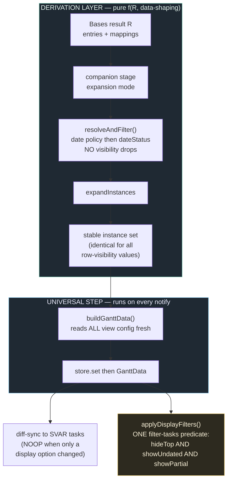

# fix: Decouple view-display options from instance derivation (#161 residual per-option loop)

## Summary

The original #161 storm (the bulk `getTasks()`/enrichment re-read re-poking Bases) is **already fixed** on this branch by the data-layer work (enrichment cache + idempotent backstop + coalescer + `reuseTasks`). What remains is a **residual, per-option loop**: after that fix, `Hide-top` stopped looping (it was pulled out of the instance derivation) but `Show-undated` / `Show-partial` **still loop**, because they are still baked into the derivation — toggling them produces a *different* instance array, the controller's `snapshotsEqual` sees a real change and notifies, and the SVAR diff churns the chart while Bases re-fires the toggle.

This plan applies the **same single architecture** that already cured `Hide-top` to the whole row-visibility class: the controller's instance derivation becomes a pure function of **R (matched Bases result) + data-shaping config**, and **every row-visibility option** is applied in the view as **one composed SVAR `filter-tasks` predicate** over a stable array. Because the array no longer varies with these options, the controller emits a no-op and the view does a cheap filter re-apply — no churn.

This is **one architecture for the row-visibility display class**, not a claim of universality over everything. **Search** changes R (it filters the matched entries), so it is a genuinely different mechanism and is investigated separately (U6), not lumped into this fix.

The first task is a **falsification step**: prove the array-instability mechanism by measurement before building on it (the team has chased wrong root causes before — this one gets evidence, not assertion).

---

## Problem Frame

**Two distinct loops, only one of them still open.**

1. **Original storm (FIXED).** The committed record (`docs/solutions/integration-issues/gantt-bases-getvalue-renotify-storm.md`) triangulated the original loop to a data-read re-poke: with rendering disabled the vault *still* stormed ("the render is innocent; the feedback is in `refreshSource`"), and the `onDataUpdated` stack showed zero plugin frames (Bases re-notifies autonomously). The data-layer fix (cache + idempotent backstop + coalescer + `reuseTasks`) addressed this and is confirmed via the dynamic repro (Level-A jest burst with negative controls + Level-B fast-fixture e2e). *Note: that solution doc's headline "`getValue` re-poke" framing is imprecise and is corrected in U7.*

2. **Residual per-option loop (OPEN — this plan).** After (1), the user reported: *"Worked as expected for hide-top, however the other settings still trigger the loop. Tasks with no dates, tasks with one date…"* This is the natural experiment that identifies the mechanism: `Hide-top` was moved to a `filter-tasks` display filter (instance set unchanged on toggle) and stopped looping; `Show-undated`/`Show-partial` are still applied inside `resolveAndFilter` (instance set *changes* on toggle) and still loop. The differentiator is precisely whether the option mutates the derived array.

**Why per-option patching is the wrong shape (the senior signal the user raised).** Symptoms sharing one root must be cured at the root. The root here is "row-visibility logic living in the derivation"; the cure is to move *all* of it to one presentation-layer filter, so a future row-visibility option inherits the fix for free (no per-option special-casing).

**The universal step already exists.** Every config change already flows through one path — the coalescer's `refreshSource()` + always-`refreshData()` → `buildGanttData()` (reads *all* config fresh) → `store.set()`. The defect is not the step; it is that some config items still mutate the derived array inside it. This plan moves the row-visibility items off the array, so the universal step stays a no-op for all of them.

---

## Requirements

Carried from origin (`docs/brainstorms/2026-06-27-view-option-churn-root-fix-requirements.md`):

- **R1** — The instance set is **identical** regardless of any row-visibility option value (Hide-top, Show-undated, Show-partial). Provable deterministically (no Bases, no WDIO).
- **R2** — Each row-visibility option hides/shows rows via SVAR `filter-tasks` over the stable array (a `sync NOOP`, scroll-stable), never by re-derivation.
- **R3** — Toggling any of these options under a re-firing Bases config value does **not** loop or wander scroll.
- **R4** — UI labels, `.base` file syntax, and codeblock config keys (`tngantt_hideTopLevelSubtasks`, `tngantt_showUndatedTasks`, `tngantt_showPartialDateTasks`) are **unchanged**; only the internal application path changes.
- **R5** — Adding a future row-visibility option requires no per-option churn special-casing — it composes into the same predicate.
- **R6** — Data-shaping config (field mappings, expansion mode, default duration) legitimately continues to re-derive; it is out of the display class.
- **R7** — Search's mechanism is determined before its layer is chosen; the display-class fix does not depend on that outcome.
- **R8** *(new — from the date-semantics decision below)* — When `Show-undated` is OFF, an **undated parent of a dated child stays visible** (accepted behavior, see KTD4). The user is given a **heads-up notice** that undated parents are retained so the behavior isn't surprising.

---

## Key Technical Decisions

### KTD1 — Two layers: derivation = f(R, data-shaping); presentation = composed filter

`recompute()` → `buildSnapshot()` → `resolveAndFilter()` produces the **full** instance set (every task resolved through the date policy, tagged with `dateStatus`), with **no** visibility logic. The view composes all row-visibility options into one `filter-tasks` predicate. A stable array is the only thing that makes a Bases re-fire a no-op; one predicate makes the rule universal and extensible (R1/R2/R5).

### KTD2 — Row-visibility is the scope boundary, by churn class

The catastrophic churn is **row add/delete + reorder**. Exactly three options drive it: Hide-top, Show-undated, Show-partial — the in-scope display class. Other display options mutate the array more cheaply and are **not** reported as looping:
- `showDateIndicators` → rewrites each task's `type` string (an *update*-only diff; in-place, no scroll reset).
- `arrowMode` (`primary`/`all`) → changes the *links* array only.

These are audited and **deferred** (see Scope Boundaries), not silently expanded into this change. This keeps the change at the reported root without scope creep.

### KTD3 — `dateStatus` rides each task into SVAR `custom` (verified diff-safe)

The date predicate needs each row's policy classification at filter time. `RenderInstance.dateStatus` already exists; carry it onto `SvarTask.custom.dateStatus` in `buildSvarTasks`. **This cannot inflate the task-update diff:** the diff fingerprint is `taskStateKey` (`ganttSync.ts:321`), which folds `text/start/end/progress/type/parent/open/showHasDeps/isVirtual/isCollapsed/properties/incomingDeps` — `custom.dateStatus` is *not* in that set (verified, feasibility review). Mirrors the existing `isTopLevelPlacement` carry.

### KTD4 — SVAR `filter-tasks` tree semantics (verified in bundled source) + accepted date-filter behavior

Verified in `node_modules/@svar-ui/gantt-store/dist/index.js`: `filter-tasks` calls `tasks.filterTree(predicate, open)`; the recursive walker keeps a node iff **the node OR any descendant** passes (`return (r || a) && e.id!==0`); with `open: false` it does **not** force-expand collapsed branches. Consequences:
- Hide-top works because the **whole** duplicate subtree carries `isTopLevelPlacement: true` (the flag propagates to children in `InstanceExpansion`), so every node returns false → the subtree hides. Confirmed in the user's vault.
- **Date filters: an undated/partial ancestor of a dated descendant stays visible** (the descendant passes). **This is an accepted product decision** (maintainer, 2026-06-27): undated parents remaining is fine and aligns with the planned future "extend relationships to parents for wider context." It is *not* treated as a regression. The only obligation is a user heads-up (R8 / U8).

**Clear path caveat (for U4):** the existing clear uses `api.exec('filter-tasks', { open: false })` with no `key`. The predicate must always be passed as `filter` (a function), never as a `{key, value}` column filter — otherwise the clear path semantics change. Keep the function form.

### KTD5 — The "universal config-update step" stays; only array-mutation moves off it

The coalescer already calls `refreshSource()` then **always** `refreshData()` (pushing the latest view config even when the snapshot is unchanged), so a display-only toggle reaches the view. Keep this. It is the universal step the user described; the change is only that the in-scope options no longer alter the array it pushes.

### KTD6 — Cleanup is gated on the existing repro; nothing "known-inert" is deleted on a guess

The #161 scaffolding is removed **only after a controlled check against the dynamic repro** (the Level-A jest burst + the storm e2e, which fire the trigger via `controller.onConfigChanged()`). Specifically:
- The `onConfigChanged` settle hook (`basesConfigRefresh.ts` + `configChangeInFlight` suppression) is **NOT assumed inert.** The project's own e2e harness fires the #161 trigger *through* `controller.onConfigChanged()` and its comment claims the real toolbar does too — which **contradicts** the earlier "Bases never calls onConfigChanged" note. That contradiction is unresolved, so the hook moves to the **audit** bucket: keep unless the repro proves the suppression never catches a real fire. (`installBasesConfigRefreshHook` returns `null` when `controller.onConfigChanged` is absent — the empirical question is whether it exists and fires on this Bases version.)
- `reuseTasks`/`computeEntrySignature` and the 500ms coalescer were proven load-bearing by the negative-control repro — **keep**.
- Only purely diagnostic code (`[OGDBG]` logs, the `config.set` logging wrapper, `__OG_DISABLE_REUSE`) is deleted outright.

### KTD7 — `DatePolicyConfig`'s visibility fields are removed from the controller in one move with their last reader

`DatePolicyConfig` still carries `showUndatedTasks`/`showPartialDateTasks` and they are still read by the `[OGDBG] build` log (`GanttController.ts:1151`). They no longer influence derivation. To keep one source of truth per layer (the view reads the keys; the controller does not), **drop them from `DatePolicyConfig`** — but this is coupled to removing/altering that diagnostic log line. Sequence it with the OGDBG strip (U7), or pull both into U1; do not delete the fields without updating the log (it would break the build). The controller's `policyConfig` retains only `defaultDuration` as a derivation input.

---

## High-Level Technical Design



Data-shaping config changes (mappings/expansion/duration) re-enter at the top (R changes → new snapshot → real diff). Row-visibility changes enter only at `applyDisplayFilters()` (array unchanged → NOOP sync + cheap filter re-apply).

---

## Implementation Units

### U0. Falsification step — prove the array-instability mechanism before building on it

**Goal:** Replace assertion with measurement. Demonstrate that a row-visibility toggle changes the instance array under the **old** derivation (drops undated/partial) and is **identical** under the **new** derivation (tag-only), at the controller seam — deterministically, no Bases/WDIO.
**Requirements:** R1, R3 (evidence).
**Dependencies:** none — runs first.
**Files:** `test/unit/GanttController.test.ts` (a focused characterization test; may be temporary scaffolding folded into U1's permanent tests).
**Approach:** With a fixture mixing complete/`placeholder`/`inferred-*` tasks, drive the controller through an oscillating `Show-undated` value and capture `getInstances()` identity + whether `recompute` would notify. Assert: old behavior → arrays differ → notify (reproduces the residual loop at the seam); new behavior → arrays identical → no notify. If the new behavior does **not** produce identical arrays, **stop and re-diagnose** — the mechanism is not what we think.
**Test scenarios:**
- Old `resolveAndFilter` (drop) + oscillating Show-undated → `getInstances()` differs between values; `snapshotsEqual(prev, next)` is false.
- New `resolveAndFilter` (tag) + oscillating Show-undated → `getInstances()` identical; `snapshotsEqual` true → no notify.
**Verification:** the contrast holds; the residual loop's seam-level cause is now evidenced, not assumed.

### U1. Derivation produces the full, stable instance set tagged with `dateStatus`

**Goal:** `resolveAndFilter` resolves every task through the date policy and tags `dateStatus`, dropping **nothing** for visibility. Lock R1.
**Requirements:** R1, R6.
**Dependencies:** U0 (evidence the change is correct).
**Files:**
- `src/controller/GanttController.ts` (`resolveAndFilter` — already tags, doesn't drop; finalize `DatePolicyConfig` shape per KTD7)
- `src/controller/datePolicy.ts` (`PARTIAL_DATE_STATUSES` — already exported)
- `test/unit/GanttController.test.ts`
**Approach:** Confirm `{ ...task, start, end, dateStatus }` for all tasks. Apply KTD7 (drop `showUndatedTasks`/`showPartialDateTasks` from the controller policy, coupled with the OGDBG log line). Note: `instancesEqual` (`GanttController.ts:1320`) **already** compares `dateStatus`, so the controller-seam guard for R1/R3 already holds — `dateStatus` is a pure function of the (unchanged) dates + `defaultDuration`, so a visibility toggle can't change it; a `defaultDuration` change legitimately *does* diff (R6, not churn).
**Patterns to follow:** the `isFetched`/`isTopLevelPlacement` "tag, don't drop" pattern in `InstanceExpansion`.
**Test scenarios:**
- Covers R1. Across all 8 combinations of (showUndated × showPartial × hideTop), `getInstances()` returns the **same set and order** — assert instance ids identical.
- Each resolved instance carries the expected `dateStatus` (one case per status).
**Verification:** unit suite green; cross-combination equality passes.

### U2. Carry `dateStatus` onto `SvarTask.custom`

**Goal:** The SVAR task exposes `custom.dateStatus` for the view predicate.
**Requirements:** R2 (enabler).
**Dependencies:** U1.
**Files:** `src/bases/ganttSync.ts` (already applied this session); `test/unit/ganttSync.test.ts`.
**Approach:** `custom.dateStatus: DateStatus` from `inst.dateStatus`. Diff-safety is **verified, not open** (KTD3): `taskStateKey` excludes `custom.dateStatus`. The U2 test is a regression guard for that invariant, not a discovery.
**Patterns to follow:** the `isTopLevelPlacement` carry in the same `custom` block.
**Test scenarios:**
- A built `SvarTask` carries `custom.dateStatus` equal to its instance's `dateStatus` (one per status).
- Regression guard: `taskStateKey` for two builds of the same instance is equal regardless of `custom.dateStatus` presence (locks KTD3).
**Verification:** mapping + guard tests green.

### U3. Flow `showUndatedTasks` / `showPartialDateTasks` through `GanttData`

**Goal:** The view receives the two date toggles like `hideTopLevelSubtasks` — via the store, from the **same** config keys.
**Requirements:** R2, R4.
**Dependencies:** none (parallel to U1/U2).
**Files:**
- `src/bases/types/gantt-view-data.ts` (add `showUndatedTasks: boolean; showPartialDateTasks: boolean;`)
- `src/bases/register.ts` (`buildGanttData` ~L731–740 populates them, mirroring `hideTopLevelSubtasks`; reuse `readDatePolicyConfig`, which already parses both keys with the `!== false` default-shown rule)
**Approach:** No new keys (R4). Keep the controller's `policyConfig` and the view read independent (per-layer source of truth, KTD7).
**Patterns to follow:** `hideTopLevelSubtasks` wiring in `buildGanttData` + its `GanttData` doc comment.
**Test scenarios:** `buildGanttData` sets both flags `true` by default and `false` only on explicit `false`.
**Verification:** flags present in the store payload; defaults show-everything.

### U4. Compose all row-visibility options into one presentation filter

**Goal:** Replace `applyTopLevelFilter()` with `applyDisplayFilters()` — one `filter-tasks` predicate combining Hide-top ∧ Show-undated ∧ Show-partial — driven by one effect re-running on every store update and any toggle flip.
**Requirements:** R2, R3, R5.
**Dependencies:** U2, U3.
**Files:** `src/bases/GanttContainer.svelte` (`applyTopLevelFilter` → `applyDisplayFilters`; the dedicated post-sync `$effect` ~L545; new `$derived` for `showUndated`/`showPartial`); a small pure helper module + its unit test.
**Approach:** Extract a **pure, exported** predicate `shouldHideRow(custom, opts)` (own module) so it's unit-testable without SVAR and is the R5 extension seam. A row is hidden when:
`(hideTop ∧ custom.isTopLevelPlacement)` **or** `(¬showUndated ∧ dateStatus === 'placeholder')` **or** `(¬showPartial ∧ PARTIAL_DATE_STATUSES.has(dateStatus))`.
When all options are show-everything, clear with `api.exec('filter-tasks', { open: false })` — **predicate passed as `filter` (function), never `{key,value}`** (KTD4 caveat). Keep `open: false`. One effect depends on `$data`, `hideTopLevel`, `showUndated`, `showPartial`.
**Technical design (directional):**
```
isHidden(custom, {hideTop, showUndated, showPartial}) =
     (hideTop      && custom.isTopLevelPlacement)
  || (!showUndated && custom.dateStatus === 'placeholder')
  || (!showPartial && PARTIAL_DATE_STATUSES.has(custom.dateStatus))
filter-tasks predicate = (t) => !isHidden(t.custom, opts)
```
**Patterns to follow:** existing `applyTopLevelFilter` + its dedicated `$effect` (GanttContainer ~L520–549).
**Test scenarios:**
- Covers R2. `isHidden` truth table: each option independently hides only its class; default hides nothing.
- Composition: hideTop + showUndated-off hides a duplicate root and an undated leaf; a complete task is never hidden.
- Documents KTD4: an undated parent with a dated child is **retained** by `filterTree` (assert the SVAR-exec outcome keeps the parent), confirming R8's accepted behavior.
**Verification:** truth-table unit green; live toggle shows no churn (U5).

### U5. Test-contract update + churn-free verification

**Goal:** Replace "derivation drops undated/partial" tests with the new contract; prove the toggle is a `sync NOOP` end to end.
**Requirements:** R1, R2, R3.
**Dependencies:** U1–U4.
**Files:** `test/unit/GanttController.test.ts`, `test/unit/companionResolve.test.ts`, `test/unit/ganttSync.test.ts`; `test/specs/gantt-resultset-storm.perf.e2e.ts` and/or the existing fast-fixture loop e2e; `test/specs/_local-clone-storm.e2e.ts` (local-only; never commit).
**Approach:** The deterministic instance-set equality (U1) is the primary R1/R3 guard. Add the predicate test (R2). For e2e, extend the **existing** fast-fixture loop spec (per `test-fastest-level-not-redundant-e2e`) to toggle Show-undated/Show-partial and assert no `sync DIFF` with non-zero add/delete + scroll preserved. The storm e2e triggers via `controller.onConfigChanged()` — reuse that trigger.
**Execution note:** Update the failing date-drop unit tests first (they are red now from the in-progress derivation change); red→green confirms the contract flip.
**Test scenarios:**
- Toggling Show-undated/Show-partial in the controller path does not change `getInstances()` output.
- e2e: a date-option toggle produces no structural `sync DIFF`; scroll preserved.
**Verification:** full unit suite green; loop e2e green for all three options; clone spec (local) NOOP both directions.

### U6. Investigate Search and decide its layer (execution-time)

**Goal:** Determine whether Search's loop is Bases-autonomous or our-feedback, then choose the minimal mitigation. Execution-gated; the display-class fix does not depend on it.
**Requirements:** R7.
**Dependencies:** independent of U1–U5.
**Approach:** **Start from the existing instrument and the known config-case answer** — for the config-toggle class the `[OGDBG] onDataUpdated-stack` instrument already showed *zero plugin frames ⇒ Bases re-notifies autonomously* (solution doc). Re-run that same instrument for the **search** path (search genuinely changes entries, so its oscillation profile is not yet captured):
1. Reproduce a search type + clear; read the logged `onDataUpdated` stack frames.
2. **Bases-internal frames** → autonomous oscillation; search changes R so the array can't be stabilized — verify the 500ms coalescer catches it; mitigate at the Bases-interaction layer only if not.
3. **Our-plugin frames** → our re-read re-pokes; `reuseTasks` can't apply (entries genuinely change) — design a search-specific settle without touching the stable-array work.
4. Record the finding in `docs/solutions/`; implement the chosen mitigation only then.
**Verification:** search type+clear settles to a stable render with no unbounded `onDataUpdated` burst.

### U7. Cleanup gated on the repro; correct the solution doc

**Goal:** Strip diagnostics; audit (not guess) the loop-breaking scaffolding; fix the durable record.
**Requirements:** code-quality; honesty of the institutional record.
**Dependencies:** U1–U5 green; U6 decided (some scaffolding relates to the notify path).
**Files:**
- **Delete outright (pure diagnostics):** all `[OGDBG]` logs (`register.ts`, `GanttController.ts` incl. the L1151 build log, `GanttContainer.svelte`); the `config.set` logging wrapper; `__OG_DISABLE_REUSE`.
- **Audit against the dynamic repro, keep unless proven dead (KTD6):** the `onConfigChanged` settle hook + `configChangeInFlight` suppression + `basesConfigRefresh.ts` (+ its test) — remove **only** if the repro shows the suppression never catches a real fire; otherwise keep and document why. `reuseTasks`/coalescer — keep (proven load-bearing).
- **Correct:** `docs/solutions/integration-issues/gantt-bases-getvalue-renotify-storm.md` — fix the imprecise "`getValue` re-poke" headline; record the two-loop picture (original read-re-poke storm vs. residual per-option array-instability loop) and the two-layer fix.
- **Decide:** the `_local-*` specs (never commit) — keep locally or remove.
**Approach:** Separate commit from the behavioral fix. The `OGDBG` `sync NOOP`/`sync DIFF` logs that U5's e2e asserts on must be replaced with a stable non-debug signal **or** the e2e re-pointed *before* the logs are deleted.
**Test scenarios:** `Test expectation: none — cleanup`; the U5 suites staying green after each removal is the regression guard.
**Verification:** suite green; no `[OGDBG]`/`__OG_DISABLE_REUSE`/logging-wrapper references; settle-hook disposition documented; solution doc corrected.

### U8. Heads-up notice that undated parents are retained when Show-undated is OFF

**Goal:** Tell the user (per R8) that turning off Show-undated keeps undated *parents of dated children* visible, so the accepted KTD4 behavior isn't surprising.
**Requirements:** R8, R4 (no key/label changes).
**Dependencies:** U4 (filter behavior in place).
**Files:** `src/bases/types/gantt-view-data.ts`, `src/bases/register.ts`, `src/bases/GanttContainer.svelte` (notice surface), `src/bases/viewOptions.ts` (if an option-panel description is the chosen surface).
**Approach:** Prefer a **contextual in-view notice** reusing the existing `dateMappingNotice` surfacing pattern: when Show-undated is OFF **and** the filter actually retained ≥1 undated/partial ancestor, show a small line (e.g. *"N undated parent(s) kept to show their dated subtasks."*). Contextual = only shows when relevant (no standing noise). If Bases option panels support help text, an option-description line is an acceptable simpler alternative (decision-time discoverability); choose based on what Bases supports, defaulting to the in-view notice.
**Patterns to follow:** `dateMappingNotice` build + surface (`register.buildDateMappingNotice`, the view's notice render).
**Test scenarios:**
- Notice text builder returns a message when Show-undated is OFF and ≥1 undated ancestor is retained; returns nothing otherwise (Show-undated ON, or no retained undated ancestors).
- Covers R4: no config key or label is added/changed.
**Verification:** notice appears only in the relevant case; copy is accurate.

---

## Scope Boundaries

### In scope
- Hide-top, Show-undated, Show-partial → one composed `filter-tasks` presentation filter over a stable derivation.
- Heads-up notice for retained undated parents (R8).
- Cleanup gated on the dynamic repro; correcting the solution doc.
- Determining Search's mechanism (investigation); minimal mitigation only if the finding is unambiguous.

### Deferred to follow-up work
- **`showDateIndicators` / `arrowMode` as pure CSS/class toggles** (KTD2 — cheaper, unreported diffs; separable).
- **"Extend relationships to parents for wider context"** — the maintainer's planned future option; out of this change but consistent with KTD4's retained-parent behavior.
- **Search mitigation beyond the minimal fix**, if U6 shows it's a Bases-side bug better reported upstream.

### Out of scope (genuine non-goals)
- Changing any UI label, `.base` syntax, or config key (R4).
- Data-shaping config behavior (mappings, expansion, default duration) — correctly re-derives (R6).
- Base filter behavior — a legitimate, finite R change; left as-is.

---

## Risks & Mitigations

- **R-A — Removing `reuseTasks`/coalescer reintroduces a storm.** Proven load-bearing by the negative-control repro. **Mitigation:** KTD6 keeps them; never remove on a guess.
- **R-B — Settle-hook disposition is genuinely unresolved.** The e2e harness fires the trigger via `onConfigChanged` (implying it's live) while an earlier note called it inert. **Mitigation:** KTD6/U7 audit it against the repro before any removal; do not act on the "inert" claim.
- **R-C — `custom.dateStatus` inflating the diff.** **Resolved (not a risk):** `taskStateKey` excludes it (KTD3); U2 adds a regression guard.
- **R-D — Date-filter tree semantics (undated parent retained).** **Accepted behavior** (KTD4/R8), not a regression — mitigated by the U8 notice.
- **R-E — Deleting an OGDBG log an e2e asserts on.** **Mitigation:** U7 re-points the assertion to a stable signal first.
- **R-F — The mechanism is mis-diagnosed.** **Mitigation:** U0 measures it before any further build; stop-and-re-diagnose gate if the measurement disagrees.

---

## Alternatives Considered

- **Do nothing further (the loop is "already fixed").** The data-layer fix cured the *original* storm, but the user empirically still sees `Show-undated`/`Show-partial` loop (Problem Frame #2). U0 measures this so we don't ship a fix for a non-problem — but the residual loop is real, so this baseline is rejected.
- **Per-option fixes (status quo trajectory).** Patch each looping option as reported. Rejected: the symptom-level approach the user flagged; `hide-top` working while `show-undated` loops is the proof it doesn't converge.
- **Keep visibility in derivation, make notify idempotent under re-fire.** Rejected: the array still differs per toggle value, so any render of the re-fired values churns; stabilizing the array is the only durable cure.
- **Suppress the oscillation at the Bases-config layer (the settle-hook path) as the primary fix.** Its production efficacy is unconfirmed (KTD6/R-B). Rejected as primary; retained pending the U6/U7 audit and as a possible *Search* mitigation.

---

## Sequencing

U0 first (falsification). U1, U2, U3 then (U2 depends on U1's `dateStatus` shape). U4 depends on U2+U3. U5 depends on U1–U4. U8 depends on U4. U6 is independent and execution-gated. U7 last (after U1–U5 green and U6 decided).
