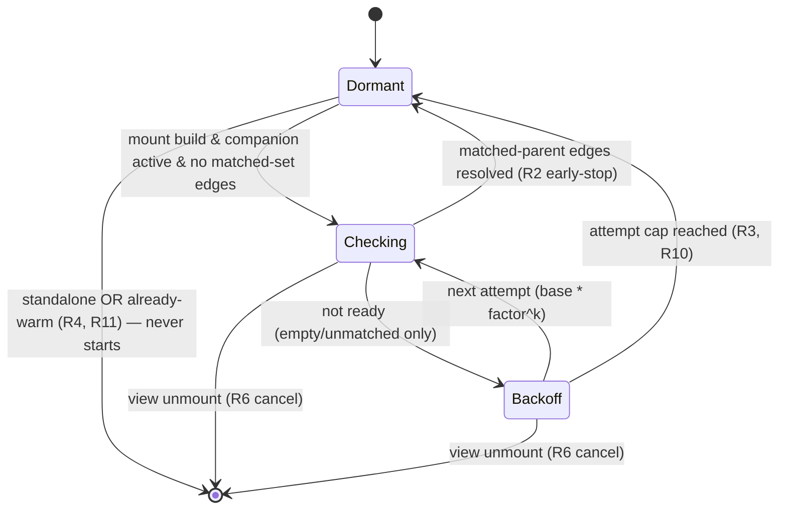

# fix: Gantt enrichment-cache readiness re-check (heal Show-all after relationships warm)

## Summary

Add a bounded, view-owned re-check window that heals Gantt Show-all/Inherit when TaskNotes' relationship index warms *after* the first build. After mount, while companion mode is active and the index has resolved no edges for the matched set, the view re-fetches the relationship index on a count + exponential-backoff schedule (via a narrow controller trigger), stopping early on a positive matched-parent signal or at an attempt cap, then going dormant. Builds on PR #166 (the fully-cold fix); this closes the relationship-lag gap and completes the dormant U7 reactivity seam.

## Problem Frame

PR #166 fixed the *fully-cold* case: `getRelationshipIndex()` now returns `null` when the TaskNotes task list is cold, so the controller stops caching a spuriously-empty index. But a second cold-start condition remains: relationship resolution **lags** file resolution (verified — `test/specs/gantt-perf-fullstack.perf.e2e.ts:259-262`: `subtasks()`/`parents()` can be empty even after every file is indexed and after `lifecycle.ready()`). In that window `tasks.list()` is warm (≥1 task), so the index is **non-null** and #166 caches it as authoritative with empty relationships — and the existing `if (!this.relationshipIndex)` guard never re-fetches it. There is no self-heal: on a warm restart Obsidian loads its persisted `metadataCache` without firing per-file `changed` events, so no TaskNotes `task.*` event fires, `enrichmentDirty` never flips, and Show-all stays stuck at matched-only until a manual edit. Documented as issue #161 §11. See origin: `docs/brainstorms/2026-06-28-gantt-readiness-recheck-requirements.md`.

There is no TaskNotes "relationships ready" event; the only known signal is to re-read and observe whether matched-set edges appeared — so the heal is a bounded poll, not an event subscription.

---

## Requirements

Traced to the origin doc's R-IDs (full text there). This plan implements R1–R13 and AE1–AE9.

- **Heal behavior:** R1 (re-fetch while non-null index has no matched-set edges), R2 (early-stop only on a positive matched-parent signal, never on emptiness), R3 (stop at the cap, then dormant), R4 (already-warm mount incurs no re-fetch), R11 (standalone = no-op).
- **Bound & scheduling:** R5 (named, injectable count/base-delay/backoff constants), R6 (view-owned scheduler, cancelled on unmount; no fire against a torn-down controller), R13 (a re-check observing warmed relationships is never silently dropped by the 500ms coalescer or the latest-wins `recomputeSeq` guard).
- **Perf & non-regression:** R7 (narrow trigger — flip `enrichmentDirty` + `refreshSource({reuseTasks:true})`, NOT `onExternalSourceChange`), R8 (steady-state identical to today), R9 (no #161 loop), R10/R12 (warmup bounded to ≤ N full-vault scans per mount).

---

## Key Technical Decisions

- **Narrow re-fetch trigger, not `onExternalSourceChange`** (R7). `onExternalSourceChange` also resets `taskNotesResolved=false` (re-creating the TaskNotes source + re-awaiting `lifecycle.ready()`) and refreshes without `reuseTasks` (re-reading every Bases entry — the read #161's storm fix avoids). The window needs only to bust the index cache, so U1 adds a minimal controller method that flips `enrichmentDirty` and recomputes with `reuseTasks:true`. `enrichmentDirty` is private with no public setter today (GanttController.ts:345; only `onExternalSourceChange` at :513 flips it), so a small new public method is required — confirmed feasible (feasibility review).

- **Early-stop on a positive matched-parent signal only — never on emptiness** (R2). An empty/unchanged index is indistinguishable from a warmup lull, so any "content-stable across two attempts" or "any global edge" signal false-stops mid-warmup and leaves Show-all permanently under-expanded (this was a regression caught in doc review round 2). The only safe positive signal is "the index resolved a relationship edge touching a *currently-matched* task," computable at build time as a matched path appearing in `childrenByPath`/`parentsByPath` keys (childrenByPath is keyed by parent path — companionResolve.ts:55). The attempt cap is the **sole** backstop for the no-edges case.

- **View-owned, injectable bounded-backoff scheduler** (R5, R6). A new pure module mirrors the existing `src/bases/coalesce.ts` coalescer: injectable scheduler with **arrow-wrapped** timers (the F2 "Illegal invocation" lesson — bare `{setTimeout}` called as a method throws in Electron) and a fake scheduler in tests. The view owns its lifecycle (created per mount, cancelled on unmount/remount) exactly like `refreshCoalescer` (register.ts).

- **No-drop via bounded retry, not fighting `recomputeSeq`** (R13). Rather than special-casing the latest-wins guard (GanttController.ts:1033), the window's check reads the matched-parent signal from the controller's *current* snapshot after each re-check resolves. If a racing config refresh discarded a readiness recompute, the signal simply reads "not ready yet" and the next bounded attempt retries — a dropped attempt costs one retry, never a missed heal. The re-check calls the controller directly (not through the 500ms `refreshCoalescer`), so coalescer in-flight suppression cannot swallow it.

- **Deterministic Jest, no flaky timing-race e2e.** The bug is a timing race against `metadataCache` warmup; a real-Obsidian e2e would be flaky and, if it waited for readiness, could not reproduce the bug by construction. The scheduler (U2) and controller surface (U1) are unit-tested with an injected clock + a scripted sequence of index readings; the existing `gantt-readonly-render` e2e remains the integration smoke. (Aligns with the `test-at-fastest-level` learning.)

---

## High-Level Technical Design

The readiness window as a state machine (per mount):

Each `Checking` step calls the controller's narrow re-fetch (R7) then reads the matched-parent signal (R2). `Dormant` = no scheduler, no re-checks, steady-state behavior identical to today (R8).

---

## Implementation Units

### U1. Controller readiness surface — narrow re-fetch trigger + matched-parent signal

- **Goal:** Give the view a minimal way to (a) bust only the relationship-index cache and recompute, and (b) read whether the current snapshot resolved any matched-set relationship edge.
- **Requirements:** R1, R2, R7, R8.
- **Dependencies:** PR #166 (base — `getRelationshipIndex` null/non-null contract).
- **Files:** `src/controller/GanttController.ts`, `test/unit/GanttController.test.ts`.
- **Approach:**
  - Add a public method (e.g. `recheckRelationshipIndex(): Promise<void>`) that sets `enrichmentDirty = true` and calls `this.refreshSource({ reuseTasks: true })` — so the next build clears + re-fetches the index (buildSnapshot:1103/1111) while skipping the base `getTasks()` re-read and NOT re-resolving the TaskNotes source. Distinct from `onExternalSourceChange`.
  - Compute a readiness signal during `buildSnapshot` and expose it (e.g. `readinessStatus(): { companionActive: boolean; matchedEdgesResolved: boolean }`). `companionActive = this.companionAccessor !== null`. `matchedEdgesResolved = ` at least one matched (raw) task path appears as a key in `relationshipIndex.childrenByPath` OR `relationshipIndex.parentsByPath` (covers Show-all child pull and Inherit parent nesting). Empty index ⇒ false.
  - **Persist the signal to a private field** (e.g. `lastReadiness`) so `readinessStatus()` (a later call site, distinct from the build) reads the last build's result — `buildSnapshot` returns only `{expansion, sourceLinks}` and carries no readiness data. **Write the field only after the `recomputeSeq` latest-wins guard** (GanttController.ts:~1039) so a discarded stale build cannot leave a false signal.
- **Patterns to follow:** existing public async controller methods (`onExternalSourceChange`); the companion stage + `recomputeSeq` latest-wins guard in `buildSnapshot`.
- **Test scenarios:**
  - `recheckRelationshipIndex()` re-fetches the index on the next build (relationship-index call count increments) WITHOUT calling `createTaskNotesSource` again and WITHOUT re-reading base entries (reuseTasks honored). `Covers R7.`
  - Two overlapping `recheckRelationshipIndex()` calls are latest-wins safe (no clobber; stale recompute discarded).
  - `readinessStatus().matchedEdgesResolved` is **true** when `childrenByPath` has an entry for a matched parent path. `Covers AE1.`
  - **false** when only an *unmatched* parent has children (matched parents cold). `Covers AE7.`
  - **false** on an all-empty index (never satisfied by emptiness). `Covers AE7.`
  - `companionActive` is false in standalone (no `companionAccessor`). `Covers AE6.`
- **Verification:** new controller method + signal are unit-covered; existing cache/loop regression tests still green.

### U2. Bounded-backoff readiness scheduler (pure, injectable module)

- **Goal:** A view-agnostic, deterministically-testable scheduler that fires up to N attempts with exponential backoff, stops early when a check reports ready, and is cancellable.
- **Requirements:** R3, R5, R6, R10, R12.
- **Dependencies:** none (pure).
- **Files:** `src/bases/readinessWindow.ts` (new), `test/unit/readinessWindow.test.ts` (new).
- **Approach:** factory `createReadinessWindow({ maxAttempts, baseDelayMs, backoffFactor, scheduler })` returning `{ start(check), cancel() }`. `check: () => boolean | Promise<boolean>` returns ready. On not-ready, schedule the next attempt at `baseDelayMs * backoffFactor^k` until `maxAttempts`, then stop (dormant). Stop early on ready. Constants live in one named place (R5), injectable for tests. Scheduler defaults to **arrow-wrapped** `window.setTimeout`/`clearTimeout` (F2 lesson).
- **Patterns to follow:** `src/bases/coalesce.ts` (injectable scheduler, arrow-wrapped timers) and `test/unit/coalesce.test.ts` (fake scheduler, incl. a real-timer regression test).
- **Test scenarios (deterministic, fake scheduler):**
  - Runs at most `maxAttempts` then stops — no further timers scheduled. `Covers AE2.`
  - Stops early when `check()` returns ready at attempt k < N; no later attempts fire. `Covers AE1.`
  - Never stops while `check()` stays not-ready — runs to the cap. `Covers AE7.`
  - Inter-attempt delays follow `baseDelayMs * backoffFactor^k`. `Covers AE8.`
  - `cancel()` before a pending attempt prevents it firing; `cancel()` is idempotent. `Covers AE4.`
  - Default real-timer scheduler does not throw `Illegal invocation` (F2 regression guard).
- **Verification:** scheduler behavior fully unit-covered with a fake clock; no real time elapses in tests.

### U3. Readiness orchestration helper + view wiring — start condition, standalone guard, cancellation, no-drop

- **Goal:** Drive the scheduler from the GanttView lifecycle: start only when warranted, re-check via U1, stop on the matched-parent signal, never fire against a torn-down controller, and guarantee a warmed re-check is not silently dropped. **Extract the orchestration into an injectable pure helper so the lifecycle behavior is unit-testable without Obsidian** (the view class extends `BasesView`, mounts Svelte, and needs Obsidian DOM — it cannot be unit-tested directly; this mirrors how `coalesce.ts` and `basesConfigRefresh.ts` are extracted with injected deps + callbacks).
- **Requirements:** R1, R4, R6, R8, R9, R11, R13.
- **Dependencies:** U1, U2.
- **Files:** `src/bases/readinessController.ts` (new — the orchestration helper), `test/unit/readinessController.test.ts` (new — AE3/AE4/AE6/AE9/AE5 + start-condition scenarios), `src/bases/register.ts` (instantiate the helper with real deps in `mountGantt`, cancel in `unmountGantt`/`onunload`). No new flaky e2e; `test/specs/gantt-readonly-render.e2e.ts` remains the integration smoke. (`GanttController.test.ts` stays scoped to U1's controller method/signal.)
- **Approach:**
  - The helper takes injected deps: a controller surface (`recheckRelationshipIndex`, `readinessStatus`), the U2 scheduler (or its factory), and an `isConnected`/alive predicate — so its start/stop/cancel logic runs under a fake clock with stubbed deps, no Obsidian.
  - After the initial mount build, read `controller.readinessStatus()`. Start the window **only** if `companionActive && !matchedEdgesResolved` — this makes standalone (R11) and already-warm (R4) natural no-ops.
  - The window's `check` = `async () => { await controller.recheckRelationshipIndex(); return controller.readinessStatus().matchedEdgesResolved; }`. Reading the signal *after* the re-check resolves is the no-drop mechanism (R13): if a racing config refresh discarded the readiness recompute, the signal reads not-ready and the bounded schedule retries. The re-check bypasses the 500ms `refreshCoalescer` (direct controller call) so coalescer suppression can't swallow it.
  - `register.ts` creates the helper per mount and `cancel()`s it in `unmountGantt`/`onunload` and on remount, alongside `refreshCoalescer.cancel()`; stale fires are guarded by the existing `mountToken`/`isConnected` checks (and the controller's `disposed` early-return), passed into the helper as the alive predicate.
- **Patterns to follow:** `src/bases/coalesce.ts` and `src/bases/basesConfigRefresh.ts` (view-lifecycle logic extracted into injectable, fake-clock-testable helpers); the `refreshCoalescer` lifecycle in `register.ts` (create per mount, `isConnected` re-check at fire time, cancel on unload); `mountToken`.
- **Test scenarios** (against the helper with stubbed controller + fake scheduler):
  - Companion active + cold (no matched edges) at mount → window starts; a later re-check resolves matched edges → window stops and the expanded set reflects the children. `Covers AE1.`
  - Standalone (`companionAccessor === null`) → window never starts; no scheduler created. `Covers AE6.`
  - Already-warm at mount (`matchedEdgesResolved` true) → window never starts. `Covers AE3.`
  - Unmount while an attempt is pending → window cancelled; no re-check runs against the torn-down controller; no throw. `Covers AE4.`
  - A readiness re-check racing a config refresh (simulate a `recomputeSeq` bump between attempt and read) → the warmed index still reaches the view on a subsequent bounded attempt; nothing silently dropped. `Covers AE9.`
  - Over an unchanging matched set, recompute/notify count does not grow beyond the bounded attempts; an unchanged-snapshot re-check does not notify (idempotent backstop). `Covers AE5.`
- **Verification:** window starts/stops per the state machine; lifecycle cancellation proven; no-loop assertion holds.

### U4. Calibrate constants against the perf harness; confirm non-regression

- **Goal:** Set the backoff constants from measured relationship-lag and confirm steady-state and warmup-cost requirements hold.
- **Requirements:** R5, R12, R8.
- **Dependencies:** U2, U3.
- **Files:** `src/bases/readinessWindow.ts` (constant values), `test/perf/*` (measurement only — no new flaky e2e).
- **Execution note:** Measurement task. Run the perf harness to observe typical/p99 relationship-lag after `lifecycle.ready()` (per the origin Key Decision); set `maxAttempts`/`baseDelayMs`/`backoffFactor` so the window covers typical warmup without piling onto the in-progress cold `metadataCache` scan (R12). If a single short delay reliably covers the measured lag, simplify to one delayed re-check and drop the backoff (per the origin's stated escape hatch).
- **Test scenarios:** `Test expectation: none for the literal constant values.` Verify via the existing perf harness that steady-state build/notify behavior is unchanged (R8) and that warmup stays within ≤ N full-vault scans (R12). Record the measured lag and chosen constants in the commit/PR.
- **Verification:** perf harness shows no steady-state regression; chosen constants documented with their measurement basis.

---

## Scope Boundaries

**In scope:** the bounded readiness re-check window (U1–U4), the narrow controller trigger, the matched-parent signal, the standalone no-op guard, and the no-drop contract.

### Deferred to Follow-Up Work
- The `metadataCache.on('resolved')` accelerant — evaluated and deferred in the origin (fires when relationships are coldest, repeats on every edit so the listener leaks past dormancy, and the backoff already covers cold-start). Revisit only if harness measurement shows base delays are too slow.
- A "loading relationships…" UX affordance during the window (heal stays silent: matched-only → fills in).

### Outside this work
- The #161 P2 render-freeze at large instance counts (separate, open).
- Non-TaskNotes live updates (out of scope by design).
- An upstream TaskNotes "relationships-ready" event (not ours to add).

---

## Dependencies / Assumptions

- **Base = PR #166** (`fix/show-all-readiness-index-cache`): `getRelationshipIndex()` returns `null` for not-ready and a non-null index (incl. empty maps) for ≥1 task (authoritative, cached). If #166's caching semantics change in review, U1's signal/trigger and the start condition must be re-verified against merged `main`, not the PR diff (see origin: Dependencies).
- Relationship resolution lags file/`lifecycle.ready()` resolution (verified: `test/specs/gantt-perf-fullstack.perf.e2e.ts:259-262`).
- A matched task path in `childrenByPath`/`parentsByPath` keys is a sufficient positive "warmed" signal; a matched set with genuinely no edges is bounded by the attempt cap (accepted residual — the window narrows, not closes, the gap on vaults slower than the cap).

---

## Risks & Mitigations

- **Re-introducing the #161 loop / per-notify scan.** Mitigation: re-checks are bounded (U2 cap), go fully dormant after (R8), bypass the coalescer rather than feeding it, and rely on the idempotent recompute backstop for no-op suppression (AE5). The narrow trigger (R7) avoids the heavier `onExternalSourceChange` path.
- **Warmup-window scan cost on large vaults.** Mitigation: ≤ N full-vault scans per mount (R10/R12), backoff tuned (U4) not to pile onto the cold scan; the early-return-on-cold-tasks path in `getRelationshipIndex` keeps cold attempts cheap.
- **Cap loses the warmup race (heal never fires).** Accepted residual (origin Scope Boundaries) — degrades to today's manual-edit recovery, now rarer; U4 calibration keeps it small.

---

## Sources & Research

- Origin requirements: `docs/brainstorms/2026-06-28-gantt-readiness-recheck-requirements.md` (two ce-doc-review rounds applied).
- `src/controller/GanttController.ts` — `buildSnapshot` enrichment cache (`enrichmentDirty`/`relationshipIndex`, :1102-1119), `onExternalSourceChange` (:505/513), `refreshSource({reuseTasks})` (:475), `recomputeSeq` latest-wins (:1033), `dispose`.
- `src/datasource/TaskNotesSource.ts` — `getRelationshipIndex` (#166 null/non-null contract), `getParents`.
- `src/datasource/companionResolve.ts` — `RelationshipIndex` (`childrenByPath` keyed by parent path, :55).
- `src/bases/register.ts` — `mountGantt`/`onunload`/`unmountGantt`, `refreshCoalescer` lifecycle, `mountToken`, `isConnected`.
- `src/bases/coalesce.ts` + `test/unit/coalesce.test.ts` — injectable arrow-wrapped scheduler pattern (F2 lesson).
- `test/specs/gantt-perf-fullstack.perf.e2e.ts:259-282` — relationship-lag evidence + readiness poll.
- `docs/bug-reports/2026-06-24-resultset-render-loop-161.md` — §5 row 4 (index-fetch cleared as loop driver → perf risk, not loop), §11 (this bug).
- Learnings: `docs/solutions/.../test-at-fastest-level...`, `.../no-heavy-diagnostics-on-hot-paths.md`.
