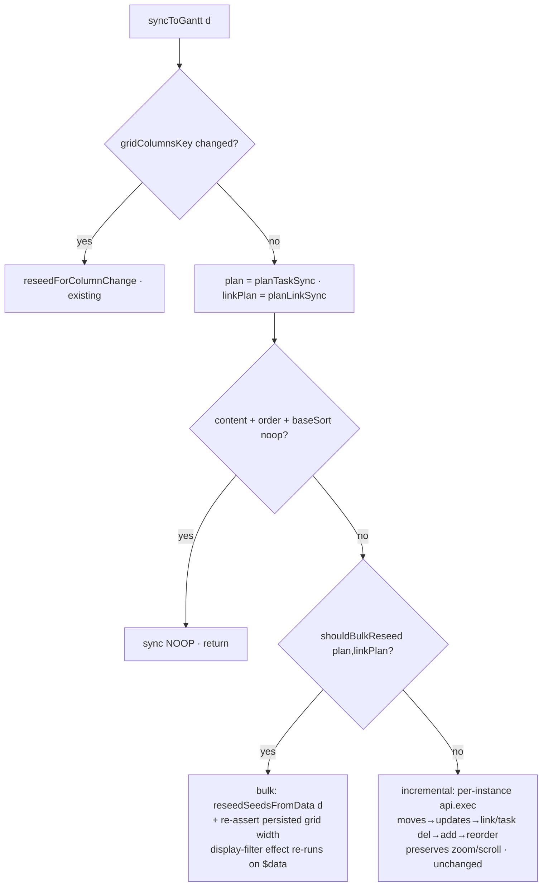

# fix: Bulk-reseed the Gantt diff-sync on large resultset changes (#161 U6)

## Summary

A Bases search→clear over the Gantt view causes a ~25-second churn: each transient
resultset change tears down and rebuilds the **entire** companion-expanded instance
set through hundreds/thousands of per-instance `api.exec('add-task'/'delete-task'/…)`
calls (~114k DOM mutations, ~4s each). A short burst of such changes (search
keystrokes + Bases re-notifies) serialises into ~25s because each render blocks long
enough to escape the 500ms coalescer.

The fix: when a single `syncToGantt` diff is **large**, stop applying it instance-by-instance
and instead **bulk-reseed** the SVAR store in one operation — reusing the existing,
proven `reseedSeedsFromData()` path (already used for column-config and theme-flip
changes). Small diffs keep the incremental path (which preserves zoom/scroll). The
decision is extracted to a pure, unit-tested function; the end-to-end behaviour is
validated against the faithful `vault-as-code` repro built during the #161
investigation.

This is a **render-layer** fix entirely within our control — Bases is untouched, exactly
per the maintainer's model that Bases delivers a constant matched set and the loop lives
in our enrich/render pipeline.

---

## Problem Frame

**Observed (timeline captured 2026-06-28 on the faithful generated vault, confirmed to
match Main-test):** one search "abc" → delete triggers the resultset to swing
full → empty → full several times. On each "full" swing `mutations` jumps ~114,000
while only ~16 rows are visible, and `recompute`/`coalescer`/`syncDiff` each tick ~12
with `reuseFalse` dominating. The churn runs ~25s, then self-terminates (bounded, not
infinite).

**Root cause:** every resultset change is `reuseTasks=false` → a full re-read + full
companion re-expansion → `syncToGantt` emits a per-instance `api.exec` for the whole
expanded set (now ~1000s of instances because relationships resolve). The per-instance
diff is correct but catastrophically expensive at this scale, and the cost defeats the
coalescer's ability to collapse the burst.

**Why per-instance exists today:** the incremental diff was introduced deliberately so
small changes (a drag, a single edit, a config toggle) preserve SVAR view state (zoom,
scroll, selection) instead of remounting. That goal is correct for *small* diffs; it is
the wrong trade-off for *wholesale* set replacement, where view state is meaningless
because the displayed set changed entirely.

**Non-goals / boundaries:** see Scope Boundaries. We do not touch Bases notify handling,
the coalescer window, the `reuseTasks` gate, or the companion-expansion algorithm.

---

## Requirements

- **R1.** A large resultset change (e.g. search→clear over the matched set) must settle in
  a bounded, small render budget — no multi-second-per-swing churn, no ~25s burst.
- **R2.** Small changes (drag/resize commit, single field edit, row-visibility toggle,
  ephemeral column sort) must keep the incremental path and preserve SVAR view state
  (zoom, scroll, selection) exactly as today.
- **R3.** The bulk path must produce a chart **identical in content** to what the
  incremental path would have produced (same tasks, links, parent tree, Base order,
  active row-visibility filter, persisted divider width).
- **R4.** The bulk-vs-incremental decision must be a pure, unit-tested function — no new
  untested logic baked into the `.svelte` component.
- **R5.** The fix must be validated end-to-end against the faithful `vault-as-code` repro
  (search→clear settles within a bounded mutation/recompute budget).
- **R6.** No regression to existing diff-sync behaviours covered by current e2es
  (column-config reseed, theme-flip reseed, ephemeral column sort R6/R8, dependency
  link add/remove, drag persistence).

Traceability: R1/R5 ← bug report §1, §9.3 and the 2026-06-28 timeline capture; R2/R3/R6
← `src/bases/GanttContainer.svelte` `syncToGantt`/`reseedSeedsFromData` invariants;
R4 ← project "extract-and-test" discipline (`docs/solutions/.../register-ts-coverage-not-glue`).

---

## Key Technical Decisions

### KTD1 — Reuse `reseedSeedsFromData()` for the bulk path, do not introduce `provide-data`

The component already has a correct bulk-replace: `reseedSeedsFromData(d)` reassigns the
`<Gantt>` `$state` seed props (`initialTasks`/`initialLinks`), which triggers SVAR's
internal `reinitStore` effect — a single virtualized re-init — then re-syncs the applied
maps and re-asserts order/ephemeral sort. It is exercised today by column-config and
theme-flip changes. Routing large data diffs through it is a one-branch change that
reuses a proven path, versus adopting a separate SVAR bulk action (`provide-data`/`parse`)
that would add new API surface and a second code path to maintain. Simpler, lower risk,
more maintainable. (See origin §9.3, which proposed a bulk replace; this realises it via
the existing reseed rather than a new action.)

### KTD2 — Decide by diff magnitude, extracted as a pure function in `ganttSync.ts`

Add `shouldBulkReseed(plan, linkPlan, opts)` to `src/bases/ganttSync.ts` (where
`planTaskSync`/`planLinkSync` already live). It returns true when the total structural
operation count (`adds + deletes + moves` (+ link adds/deletes)) exceeds a threshold.
Keeping it pure and colocated with the existing plan logic makes it unit-testable in
isolation and keeps `GanttContainer.svelte` thin (it just asks the question and branches).

### KTD3 — Threshold is a named constant with a clear rationale, not a magic number

Pick a conservative default (directional: ~150 structural ops) that sits well above any
realistic interactive edit (a drag is 1–3 ops; a row-visibility toggle is 0 — it is a
display filter, not a task-set change) and well below a wholesale set swap (hundreds to
thousands). Exact value is tuned in U2 against the repro; it lives as a named constant
with a comment, overridable in one place. Reseeding slightly too eagerly only costs a
zoom/scroll reset on an already-large change (R2 still holds for genuinely small diffs).

### KTD4 — Large diffs accept a zoom/scroll reset; small diffs never do

The incremental path's whole purpose is preserving view state across small changes. On a
wholesale set replacement the prior scroll/zoom is meaningless, so the reseed's view-state
reset (already accepted for column/theme reseeds) is the correct trade-off. This keeps the
two paths' contracts crisp: small = preserve state, large = cheap correct re-render.

---

## High-Level Technical Design

`syncToGantt(d)` gains one decision branch before the per-instance loop. Column-change and
content-noop short-circuits are unchanged.

The `filter-tasks` display filter is a **separate** `$effect` keyed on `$data` and runs
after either branch, so the active row-visibility filter re-applies in both cases (R3).

---

## Implementation Units

### U1. Pure bulk-vs-incremental decision in `ganttSync.ts`

**Goal:** A single, pure predicate that decides when a diff is large enough to bulk-reseed,
plus the named threshold constant — fully unit-testable, no Svelte/DOM dependency.

**Requirements:** R1, R4.

**Dependencies:** none.

**Files:**
- `src/bases/ganttSync.ts` — add `BULK_RESEED_OP_THRESHOLD` constant and
  `shouldBulkReseed(plan: TaskSyncPlan, linkPlan: LinkSyncPlan, opts?: { threshold?: number }): boolean`.
- `test/unit/ganttSync.test.ts` — extend (or create alongside the existing ganttSync unit
  tests if present) with the scenarios below.

**Approach:** Sum the structural ops from the existing plan shapes
(`plan.adds.length + plan.deletes.length + plan.moves.length`, plus
`linkPlan.adds.length + linkPlan.deletes.length`; `updates` are cheap in-place field
writes and are **excluded** so a bulk field-only refresh of a stable set stays incremental).
Return `sum > (opts?.threshold ?? BULK_RESEED_OP_THRESHOLD)`. Keep the constant exported and
documented with the KTD3 rationale.

**Patterns to follow:** the pure-function + named-constant style already in `ganttSync.ts`
(`planTaskSync`, `planLinkSync`); the project's extract-and-test discipline.

**Test scenarios** (`test/unit/ganttSync.test.ts`):
- Empty plan (all zero) → false.
- A small interactive edit (e.g. 1 move, 2 updates) → false.
- Updates-only of a large set (0 adds/deletes/moves, 500 updates) → false (field refresh
  stays incremental — guards R2 for value-only refreshes).
- A wholesale add of N > threshold tasks (e.g. 800 adds) → true.
- A wholesale delete of N > threshold tasks → true.
- A mixed swap just over the threshold (adds+deletes+moves = threshold+1) → true; exactly
  at the threshold → false (boundary).
- Link-driven magnitude: 0 task ops but link adds+deletes > threshold → true.
- Custom `opts.threshold` overrides the default (inject a tiny threshold, assert flip).

**Verification:** `npm test` green for the new cases; the function has no import from
Svelte/DOM (pure module).

---

### U2. Route large diffs through the bulk reseed in `syncToGantt`

**Goal:** Wire the decision into `syncToGantt` so large diffs bulk-reseed (cheap, virtualized,
view-state reset) and small diffs keep the incremental path unchanged.

**Requirements:** R1, R2, R3, R6.

**Dependencies:** U1.

**Files:**
- `src/bases/GanttContainer.svelte` — in `syncToGantt`, after the content-noop guard and
  before the `syncing`/per-instance block, add: `if (shouldBulkReseed(taskPlan, linkPlan)) { … bulk … return; }`.

**Approach:** In the bulk branch, wrap in the existing `syncing` guard and call
`reseedSeedsFromData(d)` (re-inits tasks/links, re-syncs applied maps, re-baselines
`appliedOrderKey`/`appliedBaseSortKey`, re-asserts an active ephemeral sort), then
`applyPersistedGridWidth()` (a store re-init can recompute the grid/divider width — mirror
what `reseedForColumnChange` does so a large data refresh doesn't silently reset the
persisted divider). Do **not** touch `columns` (no column change). The `applyDisplayFilters`
`$effect` already re-runs on the `$data` update, re-applying the active row-visibility
filter — confirm it fires after the reseed (it tracks `$data`, set by `store.set` in
register.ts, which is the same update that drove this sync). Keep the `[OGDBG]` marker
(`sync BULK-RESEED ops=…`) for observability, consistent with the existing `sync DIFF`/`sync NOOP`/`sync RESEED` lines.

**Patterns to follow:** `reseedForColumnChange` (the proven reseed caller — same
`reseedSeedsFromData` + `applyPersistedGridWidth` sequence, minus the `columns` reassignment);
the existing `dlog('[OGDBG] sync …')` instrumentation.

**Execution note:** Validate against the repro before/after — the same `_local-clone-search`
harness that captured the 25s churn; expect the post-fix run to settle within a small bounded
mutation budget.

**Test scenarios** (component/e2e — the `.svelte` wiring is covered behaviourally, the
decision itself is unit-tested in U1):
- Large swap (search→clear over the matched set) → bulk branch taken (`sync BULK-RESEED`
  logged, no thousands of `add-task`/`delete-task` execs), chart shows the full set, settles
  fast. Covered by U3's repro gate.
- Small drag/resize commit → incremental branch, zoom/scroll preserved (existing
  `gantt-*` e2es continue to pass — R2/R6).
- Row-visibility toggle (Hide-top / Show-undated) → still a content-noop for the task set
  (display filter), neither branch reshapes tasks — existing `gantt-resultset-storm`/loop
  contracts hold (R6).
- Column-config change and theme flip → unchanged reseed paths still fire (R6).

**Verification:** the relevant existing e2es pass unchanged; the repro gate (U3) shows the
search→clear settling within budget.

---

### U3. Commit the `vault-as-code` repro infrastructure + a bounded-settle regression gate

**Goal:** Make the faithful repro reproducible and turn it into a regression gate, while
keeping private data out of the repo.

**Requirements:** R5, R6.

**Dependencies:** U2.

**Files:**
- `scripts/vault-as-code.mjs` — commit (code only: extract/generate/verify; redacts
  TaskNotes secrets; no vault data embedded).
- `scripts/profile-maintest.mjs` — commit (one-time structural profiler; code only).
- `test/specs/_local-clone-search.e2e.ts` — keep as the maintainer-runnable end-to-end gate
  (gitignored `_local-*`); update its search→clear scenario classifier to assert a **bounded
  settle** (post-fix budget: e.g. `syncDiff`/`recompute` bounded and the mutation total within
  a ceiling), so it fails on the pre-fix 25s churn and passes after.
- `.gitignore` — ensure the generated fixture (`test/fixtures/maintest.vaultcode.json`) and
  generated vaults stay ignored pending the privacy decision (Deferred).
- `README` / `docs/solutions/` pointer (lightweight) — record the repro recipe
  (`extract` → `generate` → run the `_local` spec) so it is discoverable.

**Approach:** The generator scripts contain no private content and are valuable durable
infrastructure — commit them. The **fixture** (real frontmatter, secrets already redacted)
is a separate privacy decision and stays local/gitignored for now; the regression gate runs
locally against a freshly generated vault. Tighten the existing `_local-clone-search` scenario
verdict so it encodes the fix's success criterion (bounded settle) rather than just logging.

**Patterns to follow:** the existing `_local-*` spec conventions; the bounded-vs-runaway
classifier already in `_local-clone-search.e2e.ts`.

**Test scenarios:**
- `node scripts/vault-as-code.mjs verify <fixture> <vault>` → PASS (0 frontmatter
  mismatches) — fidelity holds (already verified).
- `_local-clone-search` search→clear scenario → classifier reports **bounded settle within
  budget** post-fix (would report runaway/over-budget pre-fix).

**Verification:** `verify` PASS; the `_local` gate passes post-fix and is documented as the
manual/local regression for #161 U6.

---

## Scope Boundaries

### In scope
- The diff-magnitude decision (U1), the bulk-reseed wiring (U2), and the repro/regression
  infrastructure (U3).

### Deferred to Follow-Up Work
- **Committing the `vault-as-code` fixture** (real frontmatter, secrets redacted) for CI —
  a privacy decision the maintainer flagged as separate ("before we address privacy").
- **Direct-frontmatter read** for the source (avoid bulk `entry.getValue()` entirely) —
  the storm doc's deeper follow-up; orthogonal to this render-cost fix.
- **Threshold auto-tuning / adaptive bulk** — fixed named constant is sufficient now.
- **Wiring the repro into CI** as a gated job — depends on the fixture-commit decision.

### Out of scope (not this fix)
- Bases notify handling, the coalescer window, the `reuseTasks` gate, the companion-expansion
  algorithm, and SVAR virtualization internals. The maintainer's model holds: Bases delivers a
  constant matched set; this fix is purely our render cost.

---

## Risks & Dependencies

- **R-A (medium): reseed correctness parity.** A data-only reseed must reproduce exactly what
  the incremental path would (parent tree, Base order, ephemeral sort, links, display filter,
  persisted grid width). *Mitigation:* reuse `reseedSeedsFromData` verbatim (already handles
  order/ephemeral sort/links) + explicit `applyPersistedGridWidth`; confirm the `filter-tasks`
  `$effect` re-runs; lean on the existing column/theme reseed e2es (R6) which already exercise
  this path.
- **R-B (low): threshold mis-set.** Too low → unnecessary zoom/scroll resets on medium edits;
  too high → residual churn. *Mitigation:* conservative named constant tuned against the repro;
  `updates` excluded so field-only refreshes never trip it.
- **R-C (low): ephemeral column sort during a bulk reseed.** *Mitigation:* `reseedSeedsFromData`
  already re-applies an active ephemeral sort after re-init (R8 path); covered by the
  expansion-sorting e2e.
- **Dependency:** SVAR `@svar-ui/svelte-gantt` 2.7.0 reinit-on-seed-prop-change behaviour
  (already relied upon by column/theme reseed).

---

## System-Wide Impact

- **Users:** search→clear / filter changes over large Gantt sets become near-instant instead
  of a ~25s churn; small interactions are unchanged (still preserve zoom/scroll).
- **Developers:** one new pure tested function + one decision branch; the bulk path reuses an
  existing, already-tested mechanism. Net complexity is low and the two render contracts
  (small=preserve, large=cheap) are now explicit.
- **Tests/CI:** new Jest unit coverage (committable); the faithful e2e stays local pending the
  fixture privacy decision.

---

## Sources & Research

- Origin: `docs/bug-reports/2026-06-24-resultset-render-loop-161.md` (§1 symptoms, §9.3 bulk
  replace recommendation, §12 code locations).
- Diff-sync architecture: `src/bases/GanttContainer.svelte` (`syncToGantt`,
  `reseedSeedsFromData`, `reseedForColumnChange`), `src/bases/ganttSync.ts`
  (`planTaskSync`/`planLinkSync`).
- Learnings: `docs/solutions/integration-issues/svar-gantt-diff-sync-interactions.md`;
  `docs/solutions/.../register-ts-coverage-not-glue` (extract-and-test discipline);
  `docs/solutions/.../consult-svar-docs-first` (reuse the documented/existing path, do not
  hand-roll).
- Empirical: the 2026-06-28 `__ogStop()` timeline on the faithful `vault-as-code` vault,
  maintainer-confirmed to match Main-test (~25s bounded; ~114k mutations per full swing while
  ~16 rows visible).
