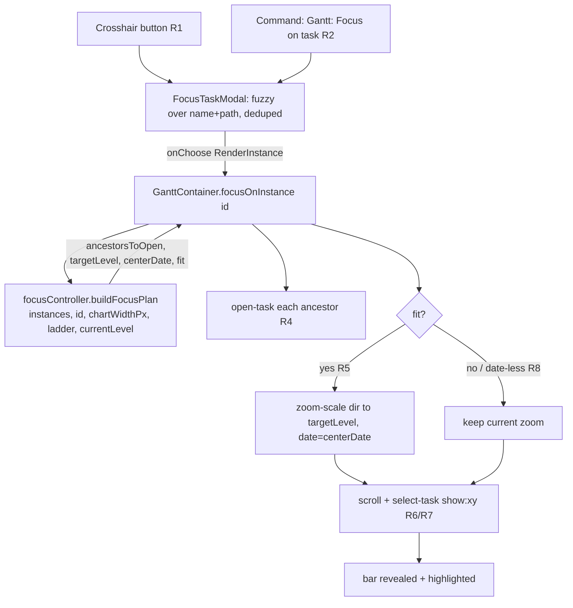

# Focus on a specific task Implementation Plan

> **For agentic workers:** implement task-by-task. Pure logic is extracted into a testable module; the Svelte view and Obsidian modal are thin glue.

**Goal:** Let the user jump the Gantt to any single task — a crosshair button (and an Obsidian command) opens a fuzzy search of every task in the chart; picking one expands only the needed ancestors, zooms so the whole bar shows at ≤50% of the chart width, scrolls it into view, and highlights it.

**Architecture:** A **pure `focusController` module** computes the navigation decisions (which ancestors to open, which zoom-ladder level to land on, the center date) from data only — no DOM/SVAR/Obsidian — mirroring how `GanttController` logic is split from the Svelte glue. A **`FocusTaskModal`** (Obsidian `FuzzySuggestModal`) collects the user's choice. **`GanttContainer.svelte`** owns a `focusOnInstance(id)` orchestrator that applies those decisions via the SVAR API (`open-task`, `zoom-scale`, scroll, `select-task`) and renders the crosshair button. A plugin **command** reaches the active Gantt view's focus entry. Highlight reuses the just-merged select-first behaviour (selecting a task no longer activates it — PR #188), so "highlight without activation" is simply selecting the target.

**Tech Stack:** TypeScript (strict), Svelte 5 runes, SVAR Svelte Gantt (`@svar-ui/svelte-gantt`), Obsidian API (`FuzzySuggestModal`, `setIcon`, `addCommand`), Jest (unit), WebdriverIO + `wdio-obsidian-service` (e2e).

## Global Constraints

- **TypeScript `strict`, no `any`.** Type Obsidian/SVAR interactions properly.
- **Test-first: red → green → refactor.** Jest unit for the pure module; WebdriverIO e2e for the wired flow.
- **Conventional commits, atomic; branch first** — work on `feat/gantt-focus-task` (already created). **No AI attribution.**
- **Pure decision logic is extracted and unit-tested; the Svelte view consumes pure helpers + the SVAR `api`, no new Obsidian-internal coupling in the pure module.**
- **SVAR: use documented actions only** — `open-task`, `zoom-scale`, `scroll-chart`, `select-task` (with `show`). Never hand-roll what SVAR provides (memory `consult-svar-docs-first`).
- **Icons: Obsidian Lucide via `setIcon` (`crosshair`)** — never a `wxi-*` font icon (renders blank here; memory `gantt-svar-icon-shortlist`).
- **Zoom is the existing discrete 7-level ladder** (`src/bases/zoomConfig.ts`), stepped by `api.exec('zoom-scale', { dir: ±1, date })`. Best-fit selects a ladder level; it does **not** introduce continuous zoom.

---

## Problem Frame

The chart can hold hundreds of task rows across collapsed parents and a wide time range. There is no way to jump to a known task — the user must scroll/zoom/expand by hand. This adds a **Focus** affordance: search by name, pick, and the chart reveals the task (expand only what's needed, zoom to frame the bar, scroll both axes, highlight). It builds on the select-first primitive (PR #188): "highlight without activation" = select the task.

Scope is **navigation only** — no edits, no note opening. The search lists tasks already in the chart (matched **and** relationship-extended instances); it does not fetch new tasks.

---

## Requirements

- **R1.** A **crosshair** button in the floating control stack (beside zoom ±/collapse) opens the focus search. Icon via `setIcon(el, 'crosshair')`.
- **R2.** An Obsidian command **"Gantt: Focus on task…"** opens the same search for the active Gantt view (command-palette / hotkey reachable).
- **R3.** The search is a native `FuzzySuggestModal` listing **every render instance currently in the chart** (matched + extended), **deduped by `sourcePath`** to the primary instance. Fuzzy match runs over **task name + source path**; each row shows the name (primary) and the source path (secondary).
- **R4.** On selection, **only the necessary ancestors** of the target are expanded — walk the parent chain and `open-task` each collapsed ancestor; untouched branches stay as they are.
- **R5.** **Best-fit zoom:** step the existing ladder to the **most zoomed-in** level where the bar is fully visible and its pixel width is **≤ 50% of the chart (chart-area) width**. Center the view on the bar.
- **R6.** **Scroll the bar into view on both axes** (vertical row + horizontal date range).
- **R7.** **Highlight** the target by selecting it (reuses select-first: selecting does not activate). No note/modal opens.
- **R8.** **Date-less / partial tasks** (milestone, no end, unscheduled) skip best-fit zoom: reveal at the **current** zoom centered on `start` (when present), then select. A task with no usable date is still listed and still expands+scrolls+selects.
- **R9.** Focus is navigation-only: it never opens a note, opens the editor, or mutates data. Ancestor expansion uses the `OG_ECHO_SOURCE` tag so it does not trigger persist/echo paths.

---

## Key Technical Decisions

- **KTD1 — Pure `focusController` for all decisions.** Ancestor-chain resolution and best-fit-level selection live in a DOM-free module taking plain data (instances, target id, chart width px, the zoom ladder, current level). Returns a `FocusPlan` the view applies. This is the testable core; the view/modal are glue. (Mirrors `GanttController`/`InstanceExpansion` split.)
- **KTD2 — Best-fit is approximate by design.** The ladder gives discrete cell-width *ranges* per level, not a fixed px/day. `focusController` estimates pixels-per-day per level (from the level's min scale unit and a representative cell width) and picks the most zoomed-in level whose estimated bar width ≤ 50% of chart width and ≥ a small visibility floor. Exact pixel fit is **not** guaranteed (the spec accepted best-fit over continuous zoom). The view then steps `zoom-scale` by `targetLevel − currentLevel`, passing the bar midpoint `date` so SVAR zooms around the task.
- **KTD3 — Scroll via documented SVAR actions.** Prefer `api.exec('select-task', { id, show: 'xy' })` to scroll the row into view on both axes *and* set the selection highlight in one call (select-first makes this non-activating). If `show:'xy'` proves insufficient horizontally for the framed range, supplement with `api.exec('scroll-chart', { date: barMidpoint })`. Decided at implementation against the real DOM.
- **KTD4 — Ancestors via `open-task` + echo tag.** Expand with `api.exec('open-task', { id, mode: true, eventSource: OG_ECHO_SOURCE })` per collapsed ancestor (the exact call shape already used at `GanttContainer.svelte:305-307`), so the collapse-state intercept treats it as our own write.
- **KTD5 — Command reaches the active view via a registered focus entry.** The Svelte view publishes a `focusEntry` callback up through `register.ts` when it mounts (per active leaf); the plugin command (`main.ts`) uses a `checkCallback` that fires the entry for the active Gantt leaf. The button calls the same entry directly. Exact handle storage is an execution detail deferred to U4.
- **KTD6 — Dedup + ordering.** List one entry per `sourcePath` (primary instance = `sourceToInstances[path][0]`), so a multi-parent task appears once; focusing targets its primary placement. Ordering follows the instance order already in the chart.

---

## High-Level Technical Design

Focus pipeline (button or command → modal → orchestrator → SVAR):



---

## Output Structure

New files:

```
src/bases/
  focusController.ts        # pure: FocusPlan computation (no DOM/SVAR/Obsidian)
  FocusTaskModal.ts         # Obsidian FuzzySuggestModal<RenderInstance> glue
test/unit/
  focusController.test.ts   # unit tests for the pure module
test/specs/
  gantt-focus-task.e2e.ts   # real-Obsidian e2e
```

Modified: `src/bases/GanttContainer.svelte` (orchestrator + crosshair button), `src/bases/register.ts` + `src/main.ts` (command + focus-entry wiring).

---

## Implementation Units

### U1. Pure `focusController` module

**Goal:** Compute the focus plan — ancestors to open, target zoom level (or keep), center date, and whether a best-fit was possible — from data only.

**Requirements:** R4, R5, R8 (decision parts); supports R6/R7 via `centerDate`.

**Dependencies:** none.

**Files:**
- Create: `src/bases/focusController.ts`
- Test: `test/unit/focusController.test.ts`

**Approach:**
- Input types (plain): a list/maps of instances with `{ id, sourcePath, parent?, start, end }`, the target `id`, `chartWidthPx`, the zoom `levels` array (from `GanttZoomConfig`), and `currentLevel`.
- `resolveAncestorsToOpen(instances, targetId, isCollapsed)` → ordered `string[]` of ancestor instance ids that are currently collapsed, walking `parent` up to root. Skips already-open ancestors ("only necessary").
- `estimatePixelsPerDay(level)` → number, from the level's smallest scale unit (`hour|day|week|month|quarter|year`) and a representative cell width (midpoint of the level's `minCellWidth`/`maxCellWidth`). Pure and unit-testable.
- `selectZoomLevel({ durationDays, chartWidthPx, levels, pxPerDay })` → `number | null`: the most zoomed-in level index whose `durationDays * pxPerDay(level) ≤ 0.5 * chartWidthPx` and `≥ VISIBILITY_FLOOR_PX`; clamps to level 0 for very long bars and the finest level for very short bars; returns the chosen index.
- `buildFocusPlan(input)` → `FocusPlan { ancestorsToOpen: string[]; targetLevel: number | null; centerDate: Date | null; fit: boolean }`. When the target has a usable `start`+`end`, compute `durationDays`, `centerDate = midpoint`, `targetLevel = selectZoomLevel(...)`, `fit = true`. When date-less/partial (R8): `targetLevel = null` (keep current), `centerDate = start ?? null`, `fit = false`.
- Export named constants `VISIBILITY_FLOOR_PX` and the `FocusPlan` type. No DOM, no SVAR, no Obsidian imports.

**Patterns to follow:** `src/controller/InstanceExpansion.ts` (RenderInstance shape, `sourceToInstances`/parent maps) and the pure-helper style of `src/bases/taskNotesInteractions.ts` (`resolveClickActivation`).

**Test scenarios** (`test/unit/focusController.test.ts`):
- `resolveAncestorsToOpen`: target nested 3 deep with all ancestors collapsed → returns all three, root-first order; with the middle ancestor already open → returns only the collapsed ones; target at top level → returns `[]`; multi-parent target → walks the **primary** parent chain only.
- `estimatePixelsPerDay`: a `day`-min-unit level yields ≈ representative-cell-width px/day; a `month`-min-unit level yields ≈ cellWidth/30; a `year` level ≪ a `day` level (monotonic: coarser unit → fewer px/day).
- `selectZoomLevel`: a short bar (few days) → a fine (high-index) level; a multi-month bar → a coarser (low-index) level; a bar that exceeds 50% at every level → level 0; a bar that fits at every level → the finest level; the chosen level's estimated bar width is ≤ 50% of `chartWidthPx` whenever any level satisfies it.
- `buildFocusPlan`: complete start+end → `fit=true`, `centerDate=midpoint`, numeric `targetLevel`; milestone (start only, no end) → `fit=false`, `targetLevel=null`, `centerDate=start`; no dates → `fit=false`, `targetLevel=null`, `centerDate=null`; `ancestorsToOpen` reflects collapsed ancestors.

**Verification:** all scenarios green via `npx jest test/unit/focusController.test.ts`.

---

### U2. `FocusTaskModal` (fuzzy search)

**Goal:** A native fuzzy modal listing deduped chart instances; returns the chosen `RenderInstance`.

**Requirements:** R3.

**Dependencies:** U1 (shares the instance shape; not strictly required to compile).

**Files:**
- Create: `src/bases/FocusTaskModal.ts`
- Test: `test/unit/focusController.test.ts` (extend) **or** keep modal logic thin and test the extracted pure helpers here.

**Approach:**
- Extract two **pure** helpers (place in `focusController.ts` so they're unit-tested without Obsidian): `dedupeInstancesBySource(instances)` → one entry per `sourcePath` (primary instance) preserving chart order; `focusItemText(instance)` → the fuzzy-match string `"<name> <sourcePath>"` (name + path, R3).
- `FocusTaskModal extends FuzzySuggestModal<RenderInstance>`: `getItems()` returns `dedupeInstancesBySource(instances)`; `getItemText(i)` returns `focusItemText(i)`; `renderSuggestion` shows the task name as the primary line and the source path as a muted secondary line; `onChooseItem(i)` calls the injected `onChoose(i.id)` callback. Constructor takes `(app, instances, onChoose)`.
- No business logic in the modal beyond wiring — the dedupe/text/decision logic is pure and tested in U1's file.

**Patterns to follow:** Obsidian `FuzzySuggestModal` usage; `setIcon` import already in `GanttContainer.svelte:11`.

**Test scenarios** (extend `test/unit/focusController.test.ts`):
- `dedupeInstancesBySource`: input with a multi-parent task (two instances, same `sourcePath`) → one entry (the primary, index-0 instance); order preserved; matched + extended both present.
- `focusItemText`: returns a string containing both the task name and the source path.
- `Test expectation` for the modal class itself: none — thin Obsidian glue, covered by the U5 e2e (instantiating `FuzzySuggestModal` needs a real Obsidian app).

**Verification:** helper scenarios green; modal compiles under `npm run typecheck`.

---

### U3. View orchestration + crosshair button

**Goal:** `GanttContainer` applies a `FocusPlan` to the SVAR chart and exposes a crosshair button that opens the modal.

**Requirements:** R1, R4, R5, R6, R7, R8, R9.

**Dependencies:** U1, U2.

**Files:**
- Modify: `src/bases/GanttContainer.svelte`

**Approach:**
- Add `focusOnInstance(id: string)`: read `chartWidthPx` from the chart scroll container (the `.wx-chart` area width, excluding the grid), read `currentLevel` from `zoomConfig.level`/the live zoom state, call `focusController.buildFocusPlan(...)` with the current `instances` + ladder. Then, in order: (a) `open-task` each `plan.ancestorsToOpen` with `{ mode: true, eventSource: OG_ECHO_SOURCE }`; (b) if `plan.fit && plan.targetLevel != null`, step `zoom-scale` by `targetLevel − currentLevel` (one `exec` per step, or a single call if SVAR accepts a delta), passing `date: plan.centerDate`; (c) scroll + highlight via `api.exec('select-task', { id, show: 'xy' })`, supplemented by `api.exec('scroll-chart', { date: plan.centerDate })` only if needed (KTD3). Expansion/scroll/zoom may need to be sequenced across a tick so SVAR re-lays-out rows before scrolling — defer exact `await tick()`/`requestAnimationFrame` choreography to implementation.
- Add a crosshair button to the floating control stack (near the existing zoom ±/collapse controls): a button element with `setIcon(el, 'crosshair')`, `aria-label="Focus on task"`, click → `new FocusTaskModal(app, instances, (id) => focusOnInstance(id)).open()`. `app` is already available to the view.
- Reuse the existing instance list (`instances` / `idToSourcePath` derivations) and the collapse-state set (`collapsedIds`) to tell `focusController` which ancestors are collapsed.
- Guard: focus performs no activation and no persist — only `open-task` (echo-tagged), `zoom-scale`, scroll, and `select-task` (non-activating post-#188).

**Patterns to follow:** existing floating controls + zoom buttons and `toggleAllCollapse`/`open-task` usage (`GanttContainer.svelte:284-318, ~1709-1770`); `setIcon` already imported.

**Test scenarios:** integration behaviour is covered by the U5 e2e (driving real SVAR layout/scroll). `Test expectation` at the unit level: none for the Svelte glue — the decision logic it calls is unit-tested in U1.

**Verification:** crosshair button renders; clicking opens the modal; choosing a task expands ancestors, steps zoom, and the bar becomes selected and in view (confirmed by U5).

---

### U4. Command registration + active-view focus entry

**Goal:** "Gantt: Focus on task…" opens the focus search for the active Gantt view.

**Requirements:** R2.

**Dependencies:** U3.

**Files:**
- Modify: `src/bases/register.ts` (publish/store a per-leaf focus entry when a Gantt view mounts), `src/main.ts` (register the command)

**Approach:**
- The Svelte view exposes a `focusEntry()` (opens the modal) via an existing prop/callback seam to `register.ts`; `register.ts` keeps a handle to the focus entry of the currently active Gantt leaf (set on mount/activate, cleared on unmount).
- `main.ts` `addCommand({ id: 'focus-task', name: 'Focus on task…', checkCallback })` (mirrors the existing `this.addCommand` at `main.ts:42`): `checkCallback(checking)` returns true only when the active leaf is a Gantt view with a registered focus entry; when not `checking`, invokes the entry.
- Exact storage of the active-view handle (registry map vs. active-leaf lookup) is an execution detail — choose the one consistent with how `register.ts` already tracks the active Bases view.

**Patterns to follow:** `src/main.ts:42` (`this.addCommand`); `src/bases/register.ts` view lifecycle / active-leaf handling.

**Test scenarios:** `Test expectation: none` at unit level (Obsidian command wiring); the command path is exercised manually and, where the harness allows triggering a command, in U5.

**Verification:** the command appears in the palette while a Gantt view is active, is hidden/disabled otherwise, and opens the same modal as the button.

---

### U5. Desktop e2e

**Goal:** Prove the wired flow in real Obsidian: focus a task collapsed under a parent → parent expands, bar is in view and selected.

**Requirements:** R1, R3, R4, R6, R7 (and R5 best-effort).

**Dependencies:** U3 (button), U2, U1.

**Files:**
- Create: `test/specs/gantt-focus-task.e2e.ts`

**Approach:**
- Boot against a fixture with a **collapsed parent** hiding a known child (reuse/extend `test/vaults/gantt-readonly` — it already has Phase A/B parents + children; collapse a parent in the spec via the collapse-all control or an `open-task` exec, or add a small dedicated fixture if needed). TaskNotes disabled (`plugins: ["tasknotes-gantt"]`), Bases enabled — same boot pattern as `test/specs/gantt-readonly-render.e2e.ts`.
- Steps: ensure the chart renders bars; collapse the target's parent so the child bar is not rendered; click the crosshair button (`.og-bases-gantt` floating control) to open the modal; type the child task name; select it. Assert: (a) the parent is now expanded and the child's `.wx-bar` exists/visible; (b) a `.wx-selected` highlight is present on the target (R7); (c) the target bar is within the chart viewport (bounding-rect within the `.wx-chart` scroll area) (R6).
- Best-fit zoom (R5) assertion is best-effort: assert the scale changed toward a finer level when the bar was long, OR document it as manually verified if the DOM signal is brittle (note the limitation in the spec, per the project's no-silent-cap rule).

**Patterns to follow:** `test/specs/gantt-readonly-render.e2e.ts` (boot + Bases enable + open `.base` + wait for `.wx-bar`); `test/specs/gantt-fullscreen.e2e.ts` (floating-control button interaction).

**Test scenarios:**
- Covers R4/R6/R7: focus a child under a collapsed parent → parent expands, child bar rendered, `.wx-selected` present, bar rect within the chart viewport.
- Covers R3: the modal lists the target by name; typing filters to it.
- Edge: focusing a top-level task (no ancestors) → no expansion needed, bar selected and in view.

**Verification:** the spec passes via the targeted WDIO run; the same code paths the command (U4) uses are exercised through the button.

---

## Scope Boundaries

### In scope
- Crosshair button + command; fuzzy modal over name+path (deduped); expand-only-necessary ancestors; best-fit ladder zoom; both-axis scroll; select-highlight; date-less handling.

### Deferred to Follow-Up Work
- **Continuous zoom-to-fit** (exact ≤50% rather than nearest ladder level) — would re-architect the seeded-once zoom config; revisit only if discrete jumps feel coarse in practice.
- **Multi-parent placement choice** (focus a *specific* duplicate placement rather than the primary) — primary-instance targeting is the chosen default (KTD6).

### Outside this product's identity
- Editing, opening notes, or any data mutation from focus (navigation-only, R9).
- Fetching tasks not already in the chart (focus searches the current instance set only).

---

## Risks & Dependencies

- **Best-fit accuracy (KTD2).** Discrete ladder + estimated px/day means the bar may land well under 50% on some levels. Accepted (spec chose best-fit). Mitigation: `selectZoomLevel` picks the *most zoomed-in* satisfying level so the bar is as large as possible while ≤50%.
- **Scroll/expand sequencing.** Expanding ancestors changes row layout; scrolling must happen after SVAR re-lays-out. Mitigation: sequence scroll after a tick/animation frame; verified by U5 (bar-in-viewport assertion). Deferred exact choreography to implementation.
- **`select-task show:'xy'` sufficiency (KTD3).** May not frame the horizontal range as desired. Mitigation: supplement with `scroll-chart { date: centerDate }`; decided against the real DOM.
- **Command→active-view handle (KTD5).** Depends on how `register.ts` tracks the active Bases view; resolved in U4 against existing lifecycle code.
- **Dependency:** builds on the merged select-first behaviour (PR #188) so selecting the target highlights without activating.

---

## Test Strategy

- **Unit (`test/unit/focusController.test.ts`)** — the full `focusController` matrix (ancestors, px/day, level selection, plan building, dedupe, item text). Fast, DI-free, no Obsidian/SVAR.
- **Desktop e2e (`test/specs/gantt-focus-task.e2e.ts`)** — real Obsidian: expand + scroll + select on focus. Mirrors existing gantt e2es; TaskNotes disabled.
- Test-first per unit (red → green). Lint + typecheck 0 errors before each commit.

---

## Deferred Implementation Unknowns

- Exact `await tick()` / `requestAnimationFrame` sequencing between `open-task`, `zoom-scale`, and scroll.
- Whether `select-task { show:'xy' }` alone frames the bar or needs a `scroll-chart` supplement.
- Exact way to read the live current zoom level and the chart-area pixel width from the SVAR state/DOM.
- Exact active-view focus-entry storage in `register.ts`.
- Whether the e2e collapses a parent via the collapse control or a direct `open-task` exec, and whether a dedicated fixture is warranted over reusing `gantt-readonly`.
