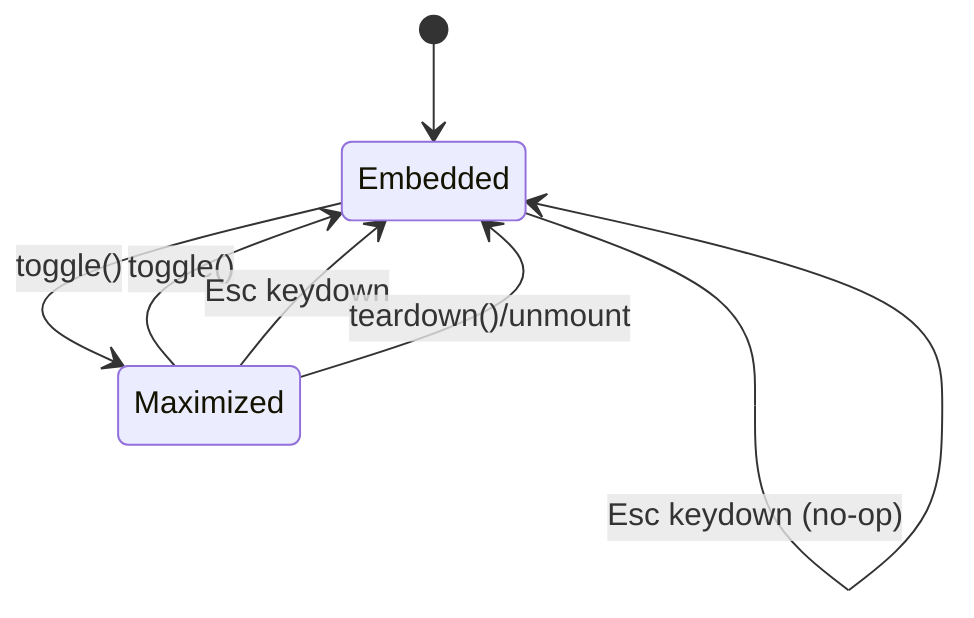

# feat: Gantt maximize within Obsidian so popups stay visible

## Summary

Replace the Gantt's native-browser full screen (SVAR's `<Fullscreen>` component, which drives the browser Fullscreen API and the top layer) with a **maximize-within-Obsidian** mode: the Gantt's own container is promoted to fill the Obsidian window, layered just below Obsidian's modal layer. Obsidian popups — the TaskNotes Edit Modal, command palette, context menus, suggesters, Notices — then render above the maximized Gantt instead of being hidden. The user-facing "Full screen" toggle label, icon, and `aria` semantics are unchanged.

---

## Problem Frame

Full screen today wraps the chart in `<Fullscreen>` from `@svar-ui/svelte-core` (see `src/bases/GanttContainer.svelte` around the `.gtcell` block). That component calls the native browser Fullscreen API, which promotes the chart subtree to the browser **top layer** and paints only that subtree plus its `::backdrop`. Obsidian's popups are plain high-`z-index` elements appended to `document.body`, outside the chart subtree, so the browser does not render them at all while full screen is active. This is structural, not a `z-index` ordering bug.

The user-visible cost: double-clicking a bar to open the TaskNotes Edit Modal appears to do nothing (the modal opens but is unpaintable behind the chart); the command palette and any hotkey-driven popup behave the same. The only escape is to exit full screen first — paid on every edit or command, not as a rare edge case.

The brainstorm (see origin) resolved this with maintainer sign-off: drop the native Fullscreen API and maximize within Obsidian's own stacking context, where Obsidian's modal layer already sits above the workspace by design. The problem stops existing rather than being patched per-popup. "Fullscreen" only needs to fill the Obsidian window, not the monitor — so the native API earns nothing here.

---

## Requirements

Traceability to origin requirements (`R1`–`R7`), flows (`F1`–`F3`), and acceptance examples (`AE1`–`AE4`).

**Maximize behavior**
- R1. Activating the toggle expands the Gantt to fill the Obsidian window (covering sidebars, tab bar, ribbon), staying inside Obsidian's window chrome. (origin R1, F-none)
- R2. While maximized, all Obsidian popups render fully visible and interactive above the Gantt: TaskNotes Edit Modal, command palette, bar context menus, suggesters, Notices. (origin R2, F1, F2, AE1, AE2)
- R3. The in-chart controls (the floating Full-screen toggle and zoom/focus/collapse controls) stay visible and usable while maximized. (origin R3)
- R4. The mode exits via the same toggle and via Esc, restoring the prior embedded size, scroll, and layout with no residual styling. (origin R4, F3, AE3)

**Affordance and continuity**
- R5. The toggle keeps its "Full screen" / "Exit full screen" label, icon, tooltip, and `aria` semantics (including pressed state). (origin R5)
- R6. Entering/exiting does not re-initialize the SVAR store — zoom, scroll, and selection survive the transition. (origin R6, AE4)

**Layering correctness**
- R7. The maximized Gantt sits below Obsidian's modal/popover layer and above the workspace, anchored to an Obsidian layer token rather than a hardcoded numeric value that a theme can override. (origin R7, AE2)

---

## Key Technical Decisions

- **Maximize the Gantt's own container in place; do not touch Obsidian's modal DOM.** A reactive maximized state toggles a class on the Svelte root (`.og-bases-gantt`, already `bind:this={rootEl}`) that applies `position: fixed; inset: 0` full-window styling. We never move, wrap, or mutate Obsidian's modal/popover DOM (the brainstorm's "no reparenting of foreign DOM" decision; secure and maintainable). Promoting *our own* container is explicitly in bounds.

- **Anchor the maximized `z-index` to Obsidian's `--layer-modal` token, positioned just beneath it.** Directional: `calc(var(--layer-modal) - 1)`. This sits above the workspace/sidedock layers and below modal, notice, menu, and tooltip layers, so every Obsidian popup floats above the Gantt and the value tracks theme overrides of the modal layer (R7). The exact expression is implementation-time; the decision is "anchor to the Obsidian token, not a literal."

- **Drop the SVAR `<Fullscreen>` component and re-own Esc + toggle state.** Remove the `Fullscreen` import and wrapper; the floating toggle snippet wires to our own `toggleMaximize` handler and `isMaximized` state instead of SVAR's `toggle`/`inFull`. Esc-to-exit and the toggle's active state, previously supplied by the component, move to a small extracted controller. This reverses the prior "use SVAR's component" decision deliberately and with sign-off (see origin Key Decisions).

- **Extract maximize state into a DI-friendly controller so it is unit-testable in the node Jest env.** The state machine (enter/exit/toggle, Esc-to-exit only while maximized, idempotent teardown) lives in a plain `.ts` module that accepts an injected keydown registrar (default `document`), mirroring the DI style of `src/bases/readinessController.ts` and `src/bases/scheduler.ts`. The Svelte component owns only DOM/CSS wiring.

- **Override the chart-area height reactively when maximized.** `.og-chart-area` carries an inline `height: ${hostHeightPx}px` (the viewport-sizing fix). A CSS class cannot override an inline style, so the inline height becomes `isMaximized ? '100%' : ${hostHeightPx}px`, letting the chart fill the window while maximized and restoring the computed embedded height on exit.

---

## High-Level Technical Design

Layering once maximized (anchored to Obsidian's own tokens):

```
document.body
├── .app-container
│     └── … workspace … .og-bases-gantt.is-maximized   z = calc(var(--layer-modal) - 1)   ← fills window
└── .modal-container                                    z = var(--layer-modal)              ← palette / Edit Modal
      .menu  (context menus)                            z = var(--layer-menu)
      .notice-container                                 z = var(--layer-notice)
```

State machine owned by the extracted controller:



Directional only — prose and per-unit fields are authoritative.

---

## Implementation Units

### U1. Extract a maximize controller

- **Goal:** A plain, unit-testable state holder for maximize: toggle/enter/exit, Esc-to-exit while maximized, idempotent teardown, and a state-change callback the component subscribes to.
- **Requirements:** R4, R6 (state only; no DOM).
- **Dependencies:** none.
- **Files:**
  - `src/bases/maximizeController.ts` (new)
  - `test/unit/maximizeController.test.ts` (new)
- **Approach:** Factory returning `{ isMaximized, toggle, enter, exit, destroy }` plus a subscribe/notify hook (or an `onChange` callback passed in). Accept an injected keydown registrar with the shape `(handler) => () => void` (register, returns an unregister), defaulting to one bound to `document` so the node Jest env can pass a fake. Esc handler calls `exit()` only when currently maximized; `exit()` and `destroy()` are idempotent and unregister the listener. No `position`/CSS concerns here — this module is DOM-free except the injected registrar.
- **Execution note:** Test-first — write the controller spec red before the module.
- **Patterns to follow:** DI + factory style of `src/bases/readinessController.ts` and `src/bases/scheduler.ts`; node-env Jest tests in `test/unit/`.
- **Test scenarios:**
  - `toggle()` flips `isMaximized` false→true→false and fires the change callback each time.
  - Esc via the injected registrar calls `exit()` and clears state **only when maximized**; Esc while embedded is a no-op (Covers AE3 at the state level).
  - `exit()` called twice and `destroy()` after `exit()` do not throw and unregister exactly once (idempotent teardown).
  - `destroy()` unregisters the keydown listener (fake registrar records the unregister call).
  - The injected registrar is used (no reference to a real global `document` in the module's logic path under test).

### U2. Swap `<Fullscreen>` for in-place maximize in GanttContainer

- **Goal:** Replace the SVAR fullscreen wrapper with the maximize mechanism, wiring the existing floating toggle and reactive chart-area height to the controller state.
- **Requirements:** R1, R3, R5, R6.
- **Dependencies:** U1.
- **Files:**
  - `src/bases/GanttContainer.svelte` (modify)
- **Approach:** Remove `import { Fullscreen } from '@svar-ui/svelte-core'` and the `<Fullscreen toggleButton={fullscreenToggle}>…</Fullscreen>` wrapper around the `.gtcell` content. Instantiate the U1 controller in the component; expose reactive `isMaximized`. Render the existing `fullscreenToggle` snippet directly inside `.gtcell` (so it stays visible while maximized), passing our `toggleMaximize` and `isMaximized` in place of SVAR's `toggle`/`inFull`; keep the snippet's label/icon/`aria` logic intact (R5). Add `class:is-maximized={isMaximized}` to the `.og-bases-gantt` root. Change `.og-chart-area`'s inline height to `isMaximized ? '100%' : ${hostHeightPx}px` (R1 fill / R6 restore). Tear the controller down on component destroy. Confirm the `FullscreenToggleAction` type alias still fits the snippet signature or adjust to the new handler shape. Do **not** seed/re-init the SVAR store (R6 — the diff-sync `$effect` and one-time seed are untouched).
- **Patterns to follow:** existing `fullscreenToggle` snippet and `bind:this={rootEl}`; the diff-sync/no-reinit discipline already documented in the component.
- **Test scenarios:** behavior is proven at the e2e layer (U4); this unit has no standalone Jest surface beyond compilation. `Test expectation: covered by U4 e2e` (component wiring is not independently unit-tested — no node-testable seam beyond U1).

### U3. Maximized-state styling

- **Goal:** CSS that makes `.og-bases-gantt.is-maximized` fill the Obsidian window, sit just below the modal layer, and present an opaque themed background; restore cleanly on exit.
- **Requirements:** R1, R2, R7.
- **Dependencies:** U2.
- **Files:**
  - `src/bases/GanttContainer.svelte` (modify — `<style>` block)
- **Approach:** Add a scoped rule: `.og-bases-gantt.is-maximized { position: fixed; inset: 0; z-index: calc(var(--layer-modal) - 1); background: var(--background-primary); }` and ensure the chart region fills (height chain already handled by U2's reactive inline height; add `height: 100%`/`width: 100%` as needed). Remove the now-obsolete CSS comments that describe the native top layer. Keep the floating toggle/zoom controls' existing `z-index: 100` (they are children of the maximized container, so they stack within it, not against Obsidian modals). Verify no leftover style when the class is absent (R4 restore).
- **Patterns to follow:** existing `.zoom-controls-stack` / `.og-fullscreen-toggle` absolute-positioning rules; Obsidian CSS variables (`--layer-modal`, `--background-primary`).
- **Test scenarios:** `Test expectation: none — pure styling, verified via U4 e2e (window-fill + modal-above + restore).`

### U4. Rewrite the full-screen e2e for maximize + popup-above proof

- **Goal:** Replace the native-fullscreen assertions with maximize assertions and add the load-bearing proof that an Obsidian modal renders above the maximized Gantt.
- **Requirements:** R1, R2, R4, R6, R7.
- **Dependencies:** U2, U3.
- **Files:**
  - `test/specs/gantt-fullscreen.e2e.ts` (modify — drop `document.fullscreenElement` / `.wx-fullscreen` checks; assert the maximize class + popup layering instead; rename describe/spec text away from "native <Fullscreen>")
- **Approach:** Boot the existing `test/vaults/gantt-viewport` fixture. Use Obsidian's command palette as the proxy modal (always available, body-appended at `--layer-modal`) so the proof holds for every modal type without needing TaskNotes in the fixture. Assert via `document.elementFromPoint` at the viewport center that the topmost element while the palette is open is inside the palette/modal container, not the Gantt — the direct evidence that popups float above (R2/R7).
- **Patterns to follow:** existing spec's `reloadObsidian` + Bases-enable + bar-render wait harness; `executeObsidian`/`execute` helpers.
- **Test scenarios:**
  - Covers AE-none. Clicking the toggle maximizes: `.og-bases-gantt.is-maximized` exists, the container's client rect fills the window, and `document.fullscreenElement` is `null` (no native fullscreen). The toggle `aria-label` flips to "Exit full screen" (R1, R5).
  - Covers AE1/AE2. While maximized, opening the command palette (`app.commands.executeCommandById('command-palette:open')`) results in the palette/modal being the topmost element at viewport center (`elementFromPoint`), i.e. visible above the Gantt (R2, R7).
  - Covers AE3. Pressing Esc (and, separately, clicking the toggle) removes `.is-maximized`, restores the embedded size, and leaves no residual full-window styling; the workspace sidebars are visible again (R4).
  - Covers AE4. A marker set on a `.wx-bar` survives an enter→exit cycle — the chart is not remounted and selection/zoom persist (R6).

---

## Risks & Dependencies

- **Stacking-context / containment trap (primary risk).** If an Obsidian ancestor of `.og-bases-gantt` applies `transform`, `filter`, `contain: layout/paint/strict`, or `will-change`, then `position: fixed` resolves against that ancestor instead of the viewport — maximize would fill only the leaf, not the window (breaking R1). The U4 window-fill assertion catches this empirically. **Mitigation if it fires (execution-time contingency):** promote the maximized container — our own node only, never Obsidian's modal DOM — to a non-contained top-level host (e.g., `document.body`/`.app-container`) on enter and restore it on exit, with lifecycle guards so an unmount/leaf-change while maximized restores first. Deferred unless U4 proves it necessary (see Deferred to Follow-Up Work).
- **Inline-height override.** Because `.og-chart-area` height is an inline style, the maximized fill must come from the reactive inline value (U2), not a CSS class — a class rule would lose to the inline style. Captured as a KTD; flagged here so it is not missed in review.
- **Esc collision.** Esc must exit maximize without swallowing Esc needed by an open Obsidian modal. Since modals capture Esc at the document level while open and our handler only calls `exit()` when maximized, confirm during U4 that closing a palette with Esc does not also drop maximize in the same keystroke (resolve ordering at execution time if observed).

---

## Scope Boundaries

In scope: the four units above — the maximize mechanism, its styling, the controller, and the e2e rewrite.

Out of scope (origin non-goals):
- True OS/monitor fullscreen (presentation mode). Window-fill is sufficient; the native API is being removed.
- Auto-exit-on-popup behavior. Explicitly rejected upstream (flickers the view).
- Changing how/when/which TaskNotes popups or menus are triggered — only the layering context changes.
- Renaming the affordance away from "Full screen."

### Deferred to Follow-Up Work
- Promote-to-top-level-host contingency for the stacking-context trap (above) — implement only if the U4 window-fill assertion shows in-place `position: fixed` does not cover the window.
- Popout-window support: behavior when the Gantt leaf runs in an Obsidian popout window (separate `window`/`document` and modal layering) was flagged in the brainstorm as untested; not in this plan's scope.

---

## Sources & Research

- `src/bases/GanttContainer.svelte` — current `<Fullscreen>` wiring (`.gtcell` block, `fullscreenToggle` snippet, `.og-chart-area` inline height, `.og-bases-gantt` root with `bind:this={rootEl}`), and the CSS comments documenting the native top-layer rationale being replaced.
- `src/bases/register.ts` — view mount: `containerEl = parentEl.createDiv({ cls: 'og-bases-gantt-root' })` at `height/width: 100%`, the host of the Svelte root.
- `src/bases/readinessController.ts`, `src/bases/scheduler.ts` — DI/factory pattern to mirror for the maximize controller (U1).
- `test/specs/gantt-fullscreen.e2e.ts` — existing spec being rewritten; its `reloadObsidian` + Bases-enable harness is reused.
- `jest.config` — `testEnvironment: node`, `testMatch: **/*.test.ts`, roots include `src` and `test`; node env is why U1 injects its keydown registrar rather than touching `document`.
- Origin requirements: `docs/brainstorms/2026-06-30-gantt-maximize-popup-visibility-requirements.md`.
