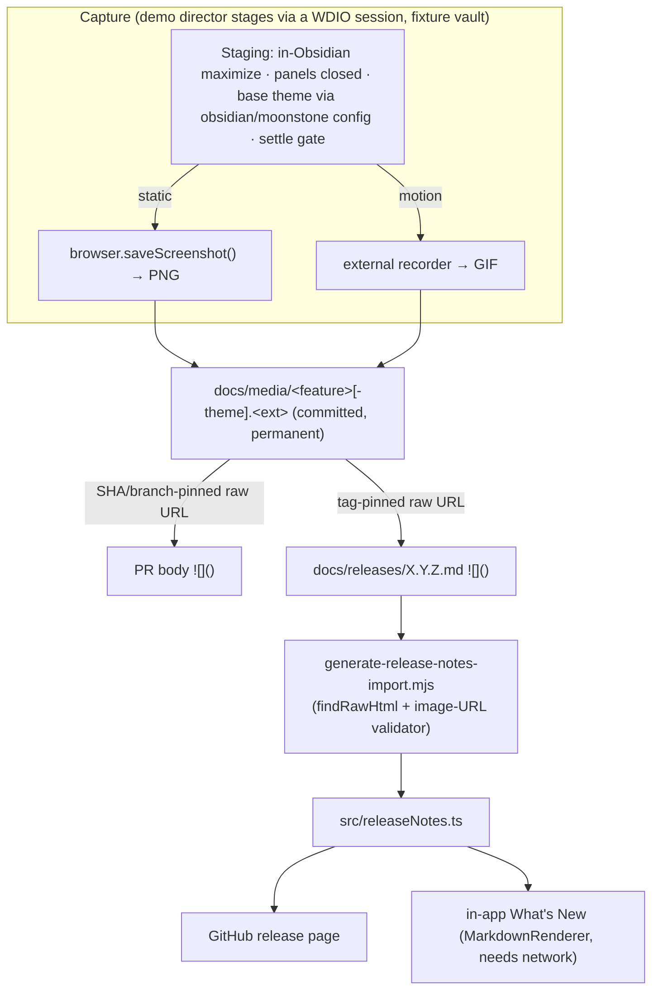

# feat: Release & PR visual-assets convention and `/release` wiring

## Summary

Standardize how UI-change visuals (animated GIFs / static images) are captured,
stored, and referenced across PRs and release notes. Assets live in the repo
under `docs/media/`, named by feature, referenced only by pinned
`raw.githubusercontent` markdown image URLs — never catbox, never raw HTML. A
committed convention doc is the source of truth; `/release` reuses a feature's
committed asset (re-pinned to the release tag) or prompts the maintainer when a
UI-affecting change shipped without one; a small WDIO-driven helper automates the
static-screenshot capture path; and the release-notes generator gains a validator
that enforces the image-URL rules mechanically.

---

## Problem Frame

Release 0.1.0-beta.3 already produced the right artifact by hand — a GIF
committed at `docs/releases/assets/0.1.0-beta.3-focus.gif`, referenced by a
tag-pinned raw URL — but nothing about that pattern is documented or encoded, so
the author couldn't recall where it lived and the file is now untracked at HEAD.
`/release` ([.claude/commands/release.md](.claude/commands/release.md)) says
nothing about visuals, and the PR path relies on `ce-demo-reel`'s catbox default
(an external host with link-rot risk and no provenance). The stakes are higher
than a normal PR image because release notes render in two places — the GitHub
release page and the in-app "What's New" view
([src/release/ReleaseNotesView.ts](src/release/ReleaseNotesView.ts)) — and the
in-app view ships inside the plugin bundle for the life of every install, so any
referenced image must remain reachable and immutable indefinitely.
(see origin: docs/brainstorms/2026-07-01-release-visual-assets-requirements.md)

---

## Requirements

Traceability back to the origin requirements doc (R/F/AE IDs preserved).

### Storage convention
- R1. A committed convention doc is the single source of truth for asset
  location, naming, referencing form, permanence, and the demo-director
  checklist. → U1
- R2. Assets live in one shared folder `docs/media/`, named by feature/slug, not
  by version. → U1, U2
- R3. Light/dark takes of the same feature are distinct files under a documented
  theme-suffix convention. → U1, U2, U4
- R4. Assets are referenced only by absolute `raw.githubusercontent` markdown
  image URLs; PR references pin to a commit SHA/branch, release references pin to
  the tag; relative paths never used; raw HTML ``/`<video>` never used. →
  U1, U2, U3, U5, U6

### Permanence
- R5. Once a shipped release references an asset, that asset and its pinned ref
  are permanent — never deleted, renamed, or moved, and the shipped release tag
  is never deleted or force-moved. → U1, U3
- R6. Re-recording updates the file at HEAD for future references without
  invalidating older releases, which stay pinned to their original tag/bytes. →
  U1

### Demo director
- R7. Staging defaults the capturing agent applies with judgment: window
  maximized (via the plugin's in-Obsidian maximize, **not** native fullscreen);
  side panels closed; base theme (light/dark) by relevance, both when it matters.
  → U1, U4
- R8. Capture is driven against real Obsidian via a WDIO session so staging
  choices are honored. → U4
- R9. Per change, the director chooses animated GIF, static image, or none, and
  records the choice. → U1

### `/release` orchestration
- R10. `/release` identifies UI/UX-affecting changes since the last release tag.
  → U5
- R11. For each, it reuses the feature's committed asset, embedded pinned to the
  new release tag. → U5
- R12. When a UI-affecting change shipped without an asset, it flags and prompts
  the maintainer and routes the reminder into `docs/backlog.md`. → U5
- R13. `/release` stays draft-only — never tags, commits, or publishes. → U5

### PR-time capture path
- R14. The PR/commit flow captures visual evidence into `docs/media/` instead of
  catbox, so the asset exists for later reuse. → U6
- R15. The PR body embeds the asset by its commit/branch-pinned raw URL. → U6, U2

**Flows:** F1 (PR-time capture) → U4, U6; F2 (release drafting, asset present) →
U5; F3 (release drafting, asset missing) → U5.

---

## Key Technical Decisions

- **Markdown `` image syntax only — a hard constraint, not a style
  choice.** `findRawHtml()` in [scripts/releaseFiles.mjs](scripts/releaseFiles.mjs)
  throws and fails the build/CI on any raw HTML tag in a notes file. Animated
  GIFs work as markdown images (beta.3 proved it); ``/`<video>`/`<picture>`
  are impossible. The convention mandates markdown image syntax and the new
  validator enforces it.

- **Capture splits into an automated static path and a guided motion path.**
  `browser.saveScreenshot()` is native WDIO, so static-image capture (base-theme
  toggle + in-Obsidian maximize + screenshot against a fixture vault) is
  automatable inside a WDIO session. WDIO cannot record GIFs — motion capture
  stays guided/ad-hoc with an external recorder while the session stages and
  drives. (see origin Key Decisions)

- **Light/dark is set via Obsidian's base-theme config, not `setTheme()`.**
  `wdio-obsidian-service`'s `setTheme(name)` selects a *community theme*, not the
  light/dark base color scheme. Obsidian light/dark is `document.body.classList`
  `theme-dark`/`theme-light`, driven by the `obsidian`/`moonstone` config — which
  the plugin's own [src/…/themeResolver.ts](src/) reads. U4 switches the base
  scheme via `executeObsidian` (set the `theme` config + trigger a css-change /
  `changeTheme`) and asserts the body class; `setTheme()` is reserved for
  community-theme selection only.

- **"Maximized" means the plugin's in-Obsidian maximize overlay, never native
  fullscreen.** Native fullscreen uses the browser top layer and hides Obsidian
  popups (modals, menus, Notices), so any demo of a modal interaction would
  capture a blank/occluded popup. Drive `.og-fullscreen-toggle` → `.is-maximized`
  (see [docs/solutions/architecture-patterns/obsidian-plugin-fullscreen-maximize-not-native.md](docs/solutions/architecture-patterns/obsidian-plugin-fullscreen-maximize-not-native.md)).

- **A shared pure asset-reference module** (`scripts/visualAssets.mjs`) holds
  path/URL/validation logic so the validator (U3) and the capture helper (U4)
  agree on the same rules; `/release` and the PR flow follow the same rules as
  documented recipes. It is `.mjs` because the release scripts are plain Node ESM
  with no build step. The owner/repo slug lives in a single plain-`.mjs` source
  (`scripts/repoInfo.mjs`) that both the module and the TypeScript
  `releaseNoteLinks.ts` consume — a plain-node `.mjs` must **not** import the
  `.ts` module.

- **Permanence is a convention guard, not a git guarantee.** A tag-pinned raw URL
  resolves against whatever the tag currently points at, and git tags are
  technically mutable. The convention therefore forbids deleting or force-moving a
  shipped release tag (R5), and the validator (U3) enforces asset *presence* and
  URL *form* — neither can verify remote reachability of an arbitrary ref.

- **Capture runs against a disposable in-repo fixture vault** (`test/vaults/*`
  copied to a temp dir), never the live `OBSIDIAN_TEST_VAULT`. To keep static
  captures stable, the helper fixes the window/viewport size and anchors the
  fixture's task dates to a fixed reference (Gantt bars position relative to
  "today"); pixel-identical re-records are still not guaranteed and are reviewed,
  not diffed.

- **Capture scaffolding stays separate from the functional e2e suite** — it runs
  from its own WDIO config, so it neither gates CI nor distorts the test pyramid.
  (see [docs/solutions/tooling-decisions/test-at-the-fastest-level-not-redundant-e2e.md](docs/solutions/tooling-decisions/test-at-the-fastest-level-not-redundant-e2e.md))

- **Missing-asset reminders go to `docs/backlog.md`, not PR-body residuals** —
  matching the repo's active-vs-parked convention (see
  [docs/solutions/workflow-issues/bidirectional-issue-housekeeping-and-backlog.md](docs/solutions/workflow-issues/bidirectional-issue-housekeeping-and-backlog.md)).

---

## High-Level Technical Design

One committed asset fans out to two render targets via two pinned refs, and is
produced by a two-path capture pipeline:



*Directional — the prose in each unit is authoritative.*

---

## Output Structure

New/changed paths introduced by this plan:

```text
docs/
  conventions/visual-assets.md      # U1 — source of truth
  media/                            # U2 — greenfield asset pool (created on first capture)
  backlog.md                        # U5 — appended to when an asset is missing
scripts/
  repoInfo.mjs                      # U2 — single source of the owner/repo slug (.mjs)
  visualAssets.mjs                  # U2 — pure path/URL/validation module
  releaseFiles.mjs                  # U3 — extend with image-URL validation
test/
  unit/visualAssets.test.ts         # U2 tests
  unit/releaseCI.test.ts            # U3 tests (extend existing)
  wdio/wdio.capture.conf.mts        # U4 — dedicated capture config (mirrors wdio.perf.conf.mts)
  wdio/captureDemo.mjs              # U4 — pure staging helper (imported by the capture spec)
  wdio/capture/demo.capture.ts      # U4 — thin spec that binds a browser session and calls the helper
.claude/commands/release.md         # U5 — wire to the convention
AGENTS.md                           # U1 — link the new convention
docs/conventions/git-workflow.md    # U6 — pointer to the PR-time capture recipe
package.json                        # U4 — add a `capture:demo` script
```

---

## Implementation Units

### U1. Visual-assets convention doc

- **Goal:** Write the source-of-truth convention and link it from `AGENTS.md`.
- **Requirements:** R1, R2, R3, R4, R5, R6, R7, R9; AE3, AE4.
- **Dependencies:** none.
- **Files:** `docs/conventions/visual-assets.md` (create), `AGENTS.md` (modify —
  add a linked bullet in the "Always-apply standards" block).
- **Approach:** Follow the terse format of existing convention docs
  ([docs/conventions/naming.md](docs/conventions/naming.md),
  [docs/conventions/git-workflow.md](docs/conventions/git-workflow.md)): `# Title`,
  one-line intent, `##` sections with bullets. Cover: folder (`docs/media/`) and
  feature-slug naming; theme-suffix rule (e.g. `focus-on-task-dark.gif` /
  `-light.gif`, no suffix when single-theme); **markdown `` only, never
  raw HTML** (cite the `findRawHtml` build failure); pinned-URL forms (PR → SHA or
  branch, release → tag) with a worked example matching beta.3's; permanence rules
  (never delete/rename a shipped asset; **never delete or force-move a shipped
  release tag**; re-records update HEAD only, with pixel-identical re-records not
  guaranteed); the demo-director checklist (in-Obsidian maximize not native,
  panels closed by default, **base theme via the `obsidian`/`moonstone` config not
  `setTheme`**, disposable fixture vault, fixed viewport + date-anchored fixture
  data, GIF via external recorder + static via the WDIO capture helper, and the
  GIF/static/none decision).
- **Patterns to follow:** existing `docs/conventions/*.md` shape; `AGENTS.md`
  per-section linking style.
- **Test scenarios:** Test expectation: none — documentation unit; correctness is
  reviewed, not asserted.
- **Verification:** The doc exists, is linked from `AGENTS.md`, and a reader can
  produce a compliant asset + reference without asking follow-ups.

### U2. Shared asset-reference module

- **Goal:** One pure module for asset path construction, pinned-URL construction,
  and image-reference validation, reused by the validator and capture helper, with
  the owner/repo slug in a single plain-`.mjs` source.
- **Requirements:** R2, R3, R4, R15.
- **Dependencies:** U1 (rules the module encodes).
- **Files:** `scripts/repoInfo.mjs` (create — export the owner/repo slug),
  `scripts/visualAssets.mjs` (create), `test/unit/visualAssets.test.ts` (create).
- **Approach:** Export pure functions — build a repo-relative asset path from
  `(slug, { theme?, ext })` → `docs/media/<slug>[-<theme>].<ext>`; build a raw URL
  from `(repoPath, ref)` → `https://raw.githubusercontent.com/<slug>/<ref>/<repoPath>`
  using the slug from `scripts/repoInfo.mjs`; a function that extracts the
  repo-relative path out of a raw URL (ignoring the ref segment); and a validation
  predicate over a markdown image URL reporting whether it is an absolute pinned
  `raw.githubusercontent` URL for this repo (rejecting relative paths, non-repo
  hosts, and catbox/litterbox). No I/O. `.mjs` ESM so `scripts/releaseFiles.mjs`
  can import it under plain node. Put the owner/repo slug in `scripts/repoInfo.mjs`
  and have both this module and (via Vite bundling) `releaseNoteLinks.ts` consume
  it; **no plain-node `.mjs` imports the `.ts` module.**
- **Patterns to follow:** existing `scripts/*.mjs` ESM style; converge the
  hardcoded slug in
  [scripts/update-release-index.mjs](scripts/update-release-index.mjs) and the
  `REPO_URL` in [src/release/releaseNoteLinks.ts](src/release/releaseNoteLinks.ts)
  onto `scripts/repoInfo.mjs` where low-cost.
- **Test scenarios:**
  - Happy path: `("focus-on-task", { ext: "gif" })` → `docs/media/focus-on-task.gif`.
  - Theme suffix: `("focus-on-task", { theme: "dark", ext: "gif" })` →
    `docs/media/focus-on-task-dark.gif`.
  - URL build: `("docs/media/focus-on-task.gif", "0.1.0-beta.3")` → the exact
    beta.3-shaped raw URL for this repo's slug.
  - Path extraction: a tag-pinned raw URL → the repo-relative path, ref ignored.
  - Validator accepts a tag-pinned raw URL for this repo.
  - Validator accepts a SHA/branch-pinned raw URL for this repo.
  - Validator rejects a relative path (`docs/media/x.gif`, `./x.gif`).
  - Validator rejects a non-repo / non-raw host and a `catbox`/`litterbox` URL.
  - Edge: empty slug and unknown extension are handled deterministically (throw or
    documented default — name the choice in the test).
- **Verification:** `npm test` green for the new suite; no I/O performed.

### U3. Release-notes image-URL validator

- **Goal:** Fail the build when a release-notes file references an image by a
  relative path or an unpinned URL, or references a repo asset absent at HEAD —
  extending the existing raw-HTML guard, with an honestly-scoped guarantee.
- **Requirements:** R4, R5; AE1, AE5.
- **Dependencies:** U2.
- **Files:** `scripts/releaseFiles.mjs` (modify — add image-URL validation beside
  `findRawHtml`), `test/unit/releaseCI.test.ts` (modify — extend), or a new
  `test/unit/releaseImages.test.ts` if the CI suite is already large.
- **Approach:** Parse markdown image references (``) from each notes
  file (outside code fences, mirroring `findRawHtml`'s fence handling). For each,
  apply U2's validator; throw a clear error naming the file and offending URL on a
  relative or unpinned reference. For references whose URL resolves (via U2's path
  extractor, ignoring the ref) to a repo path under `docs/media/` **or** the legacy
  `docs/releases/assets/`, verify that path exists at HEAD and throw if missing —
  the error names both the missing path and the release-notes file. **Scope the
  guarantee explicitly:** this only covers notes files still present under
  `docs/releases/` (the generator never parses aged-out notes that have left that
  directory / the bundle window), so state in-code and in U1 that out-of-window
  releases are not mechanically checked. Keep autolink allowances intact.
- **Patterns to follow:** `findRawHtml` fence-skipping and throw-with-context style
  in [scripts/releaseFiles.mjs](scripts/releaseFiles.mjs); how
  `test/unit/releaseCI.test.ts` exercises the existing validator.
- **Test scenarios:**
  - `Covers AE1.` A notes file with a valid tag-pinned raw image URL whose repo
    path is present at HEAD passes.
  - `Covers AE5.` A notes file referencing a `docs/media/` path absent at HEAD
    throws with the file + path named.
  - A tag-pinned URL is matched by path (ref ignored), not skipped because its ref
    segment is a tag rather than HEAD.
  - A legacy `docs/releases/assets/` path is handled per the documented decision.
  - A relative-path image (``) throws.
  - An unpinned or non-repo host image throws.
  - Image syntax inside a fenced code block is ignored (not validated).
  - A file with no images passes unchanged (regression guard).
- **Verification:** `npm test` green; deliberately breaking a fixture URL fails the
  build with an actionable message.

### U4. Static-image WDIO capture helper

- **Goal:** A runnable capture path that stages real Obsidian and writes a
  deterministic static screenshot into `docs/media/`, separate from the functional
  e2e suite.
- **Requirements:** R3, R7, R8; AE4.
- **Dependencies:** U1, U2.
- **Files:** `test/wdio/wdio.capture.conf.mts` (create — dedicated capture config
  mirroring `test/wdio/wdio.perf.conf.mts`, pointing its specs glob at the capture
  spec), `test/wdio/capture/demo.capture.ts` (create — thin spec that binds a
  `browser` session and calls the helper), `test/wdio/captureDemo.mjs` (create —
  pure staging helper using `scripts/visualAssets.mjs` for output naming/path),
  `package.json` (modify — add a `capture:demo` script).
- **Approach:** A loose `.mjs` cannot acquire a `browser` session — `browser` binds
  only inside a WDIO runner — so capture runs via its own config/spec, not as a
  bare helper. Following the established spec pattern
  ([test/specs/gantt-fullscreen.e2e.ts](test/specs/gantt-fullscreen.e2e.ts),
  [test/specs/gantt-theme-toolbar.e2e.ts](test/specs/gantt-theme-toolbar.e2e.ts)):
  copy an in-repo fixture vault to a temp dir with a **fixed window/viewport size**
  and **date-anchored task data**, `reloadObsidian`, enable Bases, open a `.base`.
  Stage — set the base theme via `executeObsidian` (`obsidian`/`moonstone` config +
  css-change, **not** `setTheme`), drive `.og-fullscreen-toggle` to `.is-maximized`,
  ensure side panels closed — then apply a **settle gate** (wait for `.is-maximized`
  present and stable, the `theme-dark`/`theme-light` class on `body`, and an
  `ensureGanttReady`-style chart-render wait) before `browser.saveScreenshot()` to
  the U2-computed `docs/media/` path (one file per theme when both requested).
  Parameterize by feature slug, target `.base`, and theme set. Motion/GIF capture is
  out of this helper (documented in U1 as the external-recorder path).
- **Execution note:** This is capture scaffolding, not a functional test — its own
  config keeps it out of `test/specs/*.e2e.ts` so it never gates CI.
- **Patterns to follow:** the separate-config pattern of
  [test/wdio/wdio.perf.conf.mts](test/wdio/wdio.perf.conf.mts); the fixture-copy +
  `reloadObsidian` + `executeObsidian` Bases-enable sequence in `test/specs/*.e2e.ts`;
  the maximize interaction and settle waits in `gantt-fullscreen.e2e.ts` /
  `gantt-theme-toolbar.e2e.ts`.
- **Test scenarios:**
  - Happy path (smoke, run via the capture config): invoking `capture:demo` for a
    fixture feature in dark theme writes a non-empty PNG at the expected
    `docs/media/` path with `body.theme-dark` asserted before capture; both themes
    writes two suffixed files.
  - Output path/naming assertions are covered by U2's pure tests — this unit adds a
    smoke check that a real capture produces a non-empty file at that path.
  - Failure path: a missing/blank Gantt render, or the settle gate timing out,
    aborts with a clear message rather than saving a mid-transition or empty frame.
- **Verification:** `npm run capture:demo` (or `wdio run test/wdio/wdio.capture.conf.mts`)
  against a fixture produces the expected file(s); the capture never appears in the
  per-PR e2e run.

### U5. Wire `/release` to the convention

- **Goal:** Teach `/release` to include visuals for UI-affecting changes using the
  convention, staying draft-only.
- **Requirements:** R4, R9, R10, R11, R12, R13; F2, F3; AE1, AE2, AE3.
- **Dependencies:** U1, U2 (URL forms).
- **Files:** `.claude/commands/release.md` (modify — add a visuals step to the
  drafting procedure), `docs/backlog.md` (modify — append a reminder entry when a
  UI-affecting change lacks an asset).
- **Approach:** Add a step after change-set gathering: identify UI/UX-affecting
  changes (by PR labels/paths, falling back to maintainer confirmation); for each,
  reuse the feature's committed `docs/media/` asset and embed it as a markdown
  image pinned to the new release tag (per U1/U2 forms); when a UI-affecting change
  has no committed asset, flag it, prompt the maintainer (offer direct-and-capture
  fresh via U4 or proceed without), and append a reminder entry to
  `docs/backlog.md`. Reinforce the existing "strip raw HTML / markdown only" rule
  and keep the command draft-only (no tag/commit/publish).
- **Patterns to follow:** existing step structure and the "Strip raw HTML" rule in
  [.claude/commands/release.md](.claude/commands/release.md); backlog entry shape in
  [docs/backlog.md](docs/backlog.md).
- **Test scenarios:** Test expectation: none — this is agent-guidance prose in a
  markdown command file, not executable code. Behavior is exercised through the
  real release drafting flow and reviewed by the maintainer; the mechanical
  guarantees (URL form, asset presence) are enforced by U3 at build time.
- **Verification:** A dry drafting run over a change set with a committed asset
  embeds the correct tag-pinned markdown image; a run with a missing asset prompts
  and writes a backlog reminder; the command never tags/commits/publishes.

### U6. PR-time capture-and-commit guidance

- **Goal:** Document the PR-time path that replaces catbox — capture into
  `docs/media/`, commit, and embed a SHA/branch-pinned raw URL in the PR body.
- **Requirements:** R14, R15; F1.
- **Dependencies:** U1, U2.
- **Files:** `docs/conventions/visual-assets.md` (modify — add a "PR-time capture"
  section), `docs/conventions/git-workflow.md` (modify — add a pointer to it).
- **Approach:** Document the procedure: stage + capture (U4 for static, external
  recorder for motion), commit the asset under `docs/media/`, and embed it in the
  PR body as a markdown image pinned to the branch or commit SHA (per U2). Note
  explicitly that `ce-demo-reel` may be used as the capture/record engine but its
  output is redirected into the repo rather than uploaded to catbox, and that the
  skill itself is not edited (plugin-cache, non-durable).
- **Patterns to follow:** convention-doc format; the branch-first, no-AI-attribution
  rules in [docs/conventions/git-workflow.md](docs/conventions/git-workflow.md).
- **Test scenarios:** Test expectation: none — documentation unit.
- **Verification:** A contributor can capture, commit, and reference a PR asset
  without touching catbox, and the resulting URL passes U3 when later reused in
  release notes.

---

## Scope Boundaries

### Deferred for later
- Committed, reproducible per-demo director scripts (deterministic WDIO demo specs
  that re-record identically). This plan ships a *generic* staging helper (U4), not
  per-demo scripts. (see origin: Scope Boundaries)

### Deferred to Follow-Up Work
- Automated GIF recording. WDIO only captures stills; motion capture remains a
  guided external-recorder step. A future unit could wrap an ffmpeg/headless
  recorder around the WDIO staging, but it is not in this plan.
- Relocating the aged-out beta.3 asset into the tracked `docs/media/` pool. Its
  release note has left the bundle window and its raw URL is tag-pinned, so it
  renders independent of HEAD; restoring it into the tracked tree is optional
  housekeeping, not a blocker.
- A `/ce-compound` learning capturing the catbox→repo rationale and the
  demo-director checklist once this lands (strong candidate flagged by learnings
  research).

### Outside this product's identity
- Editing `ce-demo-reel` itself — it is a shared plugin-cache skill; changes there
  are non-durable. The repo owns only the convention, the validator, the helper,
  and the orchestration prose.
- Git LFS / binary-asset optimization — over-engineering for a solo plugin;
  feature-named sharing already minimizes duplication.
- Version-named asset folders / per-release duplication (the beta.3 filename shape),
  superseded by the shared feature-named pool.
- `<video>`/`<picture>` embeds in release notes — impossible under the generator's
  raw-HTML guard; markdown images only.
- Offline in-app rendering of images — committed-but-remote assets need network
  access; broken-offline is an accepted tradeoff. (see origin: Scope Boundaries)

---

## Risks & Dependencies

- **The permanence guard is bounded — name the bounds honestly (R5).** The
  validator (U3) enforces URL *form* and asset *presence at HEAD for in-window
  releases*; it cannot verify that a tag/ref remains reachable on GitHub, and
  aged-out notes files (outside the bundle/on-disk window) are not checked at all.
  Permanence also depends on the convention rule that shipped release tags are
  never deleted or force-moved — a mutable-ref risk the plan mitigates by
  convention, not by git enforcement. All three bounds are stated in U1/U3.
- **Base-theme control was mis-scoped in early research — corrected.** `setTheme()`
  selects a community theme, not light/dark; U4 uses the `obsidian`/`moonstone`
  config and asserts `body.classList`. An implementer following the original
  "setTheme handles light/dark" assumption would produce identical screenshots for
  both takes.
- **Capture requires its own WDIO wiring.** A loose helper `.mjs` cannot bind a
  `browser` session; U4 adds a dedicated config + spec (mirroring the perf config)
  and a `capture:demo` script. Without this the helper is unrunnable.
- **Capture depends on the WDIO harness environment** (Node 20, disposable fixture
  vault, AV-cert setup per
  [docs/solutions/developer-experience/windows-build-and-e2e-environment-setup.md](docs/solutions/developer-experience/windows-build-and-e2e-environment-setup.md)).
  The one walled path — the full production vault through WDIO — is not used;
  capture uses `test/vaults/*` fixtures.
- **Single-source the owner/repo slug.** U2 introduces `scripts/repoInfo.mjs`; a
  plain-node `.mjs` must not import the TypeScript `releaseNoteLinks.ts`, or the
  release `version` script breaks.
- **UI-change detection in U5 is heuristic.** PR labels/paths may under- or
  over-detect; the maintainer-confirmation fallback bounds the risk and keeps
  `/release` honest (report "no asset captured" plainly).

---

## Sources & Research

- Origin requirements:
  [docs/brainstorms/2026-07-01-release-visual-assets-requirements.md](docs/brainstorms/2026-07-01-release-visual-assets-requirements.md).
- Release pipeline + the load-bearing raw-HTML guard:
  [scripts/releaseFiles.mjs](scripts/releaseFiles.mjs) (`findRawHtml`),
  [scripts/generate-release-notes-import.mjs](scripts/generate-release-notes-import.mjs),
  [scripts/update-release-index.mjs](scripts/update-release-index.mjs),
  [src/release/ReleaseNotesView.ts](src/release/ReleaseNotesView.ts),
  [src/release/releaseNoteLinks.ts](src/release/releaseNoteLinks.ts) (`REPO_URL`),
  [docs/releases/unreleased.md](docs/releases/unreleased.md),
  [docs/RELEASING.md](docs/RELEASING.md).
- Reference-form precedent: commit `57e9ba1` (beta.3 GIF, tag-pinned raw URL).
- WDIO harness + capabilities:
  [test/wdio/wdio.conf.mts](test/wdio/wdio.conf.mts),
  [test/wdio/wdio.perf.conf.mts](test/wdio/wdio.perf.conf.mts),
  [scripts/e2e-local.mjs](scripts/e2e-local.mjs),
  [test/specs/gantt-fullscreen.e2e.ts](test/specs/gantt-fullscreen.e2e.ts),
  [test/specs/gantt-theme-toolbar.e2e.ts](test/specs/gantt-theme-toolbar.e2e.ts);
  `wdio-obsidian-service` (`setTheme` = community theme; `saveScreenshot` native).
- Learnings:
  in-Obsidian maximize
  ([docs/solutions/architecture-patterns/obsidian-plugin-fullscreen-maximize-not-native.md](docs/solutions/architecture-patterns/obsidian-plugin-fullscreen-maximize-not-native.md)),
  headless e2e verification
  ([docs/solutions/developer-experience/headless-e2e-verification-for-ui-work.md](docs/solutions/developer-experience/headless-e2e-verification-for-ui-work.md)),
  fixture/vault discipline
  ([docs/solutions/developer-experience/windows-build-and-e2e-environment-setup.md](docs/solutions/developer-experience/windows-build-and-e2e-environment-setup.md)),
  backlog routing
  ([docs/solutions/workflow-issues/bidirectional-issue-housekeeping-and-backlog.md](docs/solutions/workflow-issues/bidirectional-issue-housekeeping-and-backlog.md)),
  capture-vs-e2e separation
  ([docs/solutions/tooling-decisions/test-at-the-fastest-level-not-redundant-e2e.md](docs/solutions/tooling-decisions/test-at-the-fastest-level-not-redundant-e2e.md)).
- Convention format + `AGENTS.md` linking:
  [docs/conventions/](docs/conventions/), [AGENTS.md](AGENTS.md).
