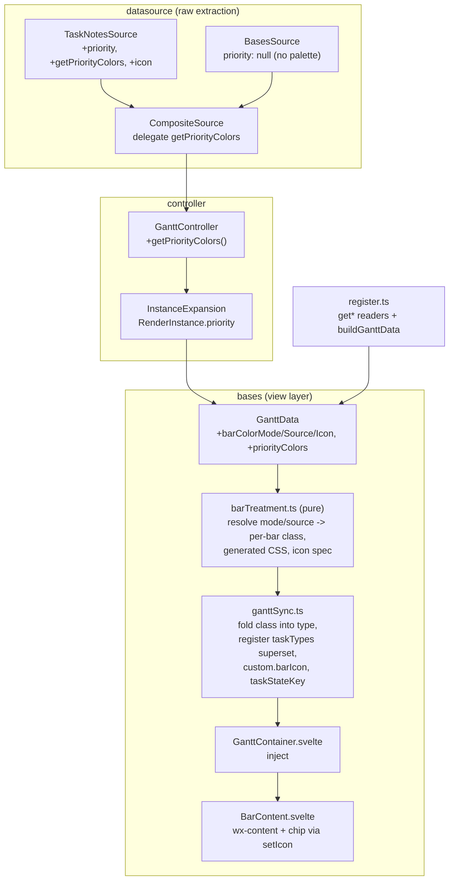

# feat: Per-view Gantt bar color mode/source + icon treatments

## Summary

Add three independent per-view Bases options to the Gantt view — **Bar Color Mode**
(`fill` | `strip`), **Color Source** (`default` | `status` | `priority` | `theme`), and
**Task Icon** (`none` | `status` | `priority`) — that together control how each task bar
is colored and whether it carries a status/priority icon chip. This generalizes today's
always-on status fill ([src/bases/statusColor.ts](src/bases/statusColor.ts)) into an opt-in,
configurable system and adds priority as a first-class coloring/icon dimension.

The approach routes each concern to its most-native SVAR seam: fill/strip color via SVAR
custom task-type classes + a generated scoped `<style>` (no per-task inline CSS exists in
SVAR); the icon chip via SVAR's `taskTemplate` prop + Obsidian `setIcon`; color decisions
in a pure, unit-tested `barTreatment` module generalizing `statusColor.ts`.

## Problem Frame

Bars are currently **always** filled by TaskNotes status color when a status has a
configured color (U5, shipped in [docs/plans/2026-06-17-002-feat-gantt-status-coloring-plan.md](docs/plans/2026-06-17-002-feat-gantt-status-coloring-plan.md)).
Users cannot turn it off, color by priority, use a lighter strip accent, show an icon, or
have bars adapt to their Obsidian theme. This plan delivers that control while preserving
the architectural qualities of the current implementation — a pure testable color module,
declarative virtualization-safe CSS, and no hand-rolling of SVAR-native behavior — and
without regressing the SVAR store's no-re-init invariant that the diff-sync design protects.

See origin for the full problem framing, key decisions, and the layout study
(`docs/brainstorms/ideas/Gantt Status Treatments (standalone).html`).

---

## Requirements

Grouped by concern. Origin R-IDs cross-referenced where a plan requirement maps directly
(see origin: [requirements doc](docs/brainstorms/2026-07-02-gantt-bar-color-icon-treatments-requirements.md)).

**Settings**
- R1. Three new per-view Bases options, persisted via `config.get`/`set`, read through pure
  co-located `read*` helpers: `tngantt_barColorMode` (`fill`|`strip`, default `fill`),
  `tngantt_barColorSource` (`default`|`status`|`priority`|`theme`, default `default`),
  `tngantt_barIcon` (`none`|`status`|`priority`, default `none`). Dropdown `options` are
  `Record<string,string>` value→label maps, never arrays. (origin R1–R3)
- R2. All three settings are independent; every Mode × Source × Icon combination produces a
  coherent result. Mode has a visible effect only when Source ≠ `default`.

**Color rendering**
- R3. `source = status` colors each bar (whose task's status has a configured color) by that
  color — as the fill (`mode = fill`) or the left strip (`mode = strip`). `fill`/`status`
  reproduces today's behavior. (origin R4)
- R4. `source = priority` behaves as R3 but keyed on the task's priority and the priority
  palette. (origin R5)
- R5. `source = theme` colors bars from Obsidian theme CSS variables with distinct parent and
  child roles, re-tinting live on theme change (variables late-bound, no re-render). (origin R6, R11)
- R6. `source = default` applies no plugin coloring; bars render SVAR/theme default. (origin R7)
- R7. Coloring is emitted as one generated, deduped `<style>` scoped under `.og-bases-gantt`,
  one rule per present value: fill via `background-color … !important`; strip via
  `.wx-bar.<slug>::before` while the body keeps default styling. No per-bar inline styles or
  components for the color path; the controller's derived instance array is identical for any
  setting value (view-layer only — avoids the #161 re-render storm). (origin R8)

**Icon rendering**
- R8. `icon = status` / `icon = priority` shows a neutral chip (left of the text) whose content
  is resolved from the icon source independent of the color source: a glyph via Obsidian
  `setIcon` when the value's config carries an icon, else a colored dot (config color) —
  mirroring TaskNotes. A value absent from the palette shows no chip — intentional parity with
  TaskNotes (which renders an indicator only when a config exists); that bar is visually identical
  to `icon = none`. (origin R9)
- R9. `icon = none` shows no chip; bar content is visually identical to pristine SVAR, with the
  task text and all existing `.wx-content`/date-status hooks preserved and progress unaffected.
  (origin R10, R10a)

**Obsidian-Theme colors**
- R10. Theme-source colors reference Obsidian CSS variables (hardcoded this pass): parent bars
  fill/strip `var(--interactive-accent)` with text `var(--text-on-accent)`; child bars
  `color-mix(in srgb, var(--interactive-accent) 28%, var(--background-primary))` with text
  `var(--text-normal)`; in `strip` mode the strip takes the accent and the body stays
  `var(--background-secondary)`. Driven via CSS variables in the generated stylesheet, never a
  hand-rolled theme class-swap. (origin R11)

**Data layer**
- R11. `SourceTask` gains `priority: string | null`; palette types gain optional `icon?: string`;
  a `PriorityColor` type and `DataSource.getPriorityColors?()` mirror the status equivalents.
  (origin R12, R13)
- R12. `TaskNotesSource` reads `task.priority` and exposes `getPriorityColors()` from
  `api.catalog?.priorities?.() ?? api.model?.config?.()?.priorities` (guarded), and maps an
  optional `icon` on the status palette; `CompositeSource` and `GanttController` delegate the
  new accessor. Standalone `BasesSource` exposes no palette, so `status`/`priority` degrade to
  `default`. (origin R14, R15)

**Coexistence & migration**
- R13. Date-status indicators and instance cues are unchanged and coexist: fill stays
  `background-color !important`; the strip uses `::before` (no collision with the
  `og-replicated` `::after` or `og-context` opacity). (origin R16, R17)
- R14. Defaults are `default`/`default`/`none`; existing views lose automatic status fills on
  upgrade until reconfigured. A release note states bar coloring is now opt-in per view.
  (origin R18)

---

## Key Technical Decisions

- KTD1. **Generalize `statusColor.ts` into a pure `barTreatment` module (view layer, not
  derivation).** The three options are pure display concerns; applying them in the controller's
  instance derivation would oscillate the derived array on every Bases config re-fire and
  re-trigger the #161 render storm (see origin, and `docs/solutions/architecture-patterns/view-display-options-in-presentation-not-derivation.md`).
  The module is dependency-free (no Obsidian/Svelte) so the full Mode × Source × values matrix
  unit-tests in isolation, exactly like `statusColor.ts`/`datePolicyConfig.ts`.

- KTD2. **Fill/strip via SVAR custom task-type classes + a generated scoped `<style>`; the strip
  is a `::before`.** SVAR exposes no per-task inline CSS — the only hooks are (a) a bar `type`
  id that `taskTypeCss` emits as bare class(es) on `.wx-bar`, and (b) scoped CSS. Fill sets
  `background-color`; strip draws a fixed 3px left `::before` accent while the body keeps default
  styling. This reuses the exact mechanism the status-coloring feature proved.

- KTD3. **One stable, always-passed `taskTemplate` (BarContent); the chip is gated per-task by
  `custom.barIcon`.** Revises the brainstorm's "engage the template only when icon ≠ None":
  research shows live-toggling the `taskTemplate` prop risks the SVAR store re-init the codebase
  deliberately avoids everywhere (diff-sync). A stable template set once at mount carries zero
  remount risk and lets icon toggle live (`none`↔`status`↔`priority`) via diff-sync. BarContent
  renders `<div class="wx-content">{text}</div>` verbatim when there is no chip, so R9's
  visual-pristine guarantee holds; the reproduction is a single div, so SVAR-internal coupling
  is minimal.

- KTD4. **Icon rendering delegates to Obsidian `setIcon`; glyph when a configured icon exists,
  else a colored dot.** Mirrors TaskNotes' own indicators (`setIcon(el, config.icon)`, colored-dot
  fallback via `borderColor = config.color`). No hardcoded Lucide knowledge — correct for Lucide
  or any plugin-registered icon. **Installed TaskNotes 4.11.0 exposes no `icon` field** on
  status/priority config, so the colored-dot path is the primary, must-test path today; the glyph
  path is future-proofing exercised only when a user has configured icons.

- KTD5. **Register the SVAR task-type superset from BOTH palettes (status + priority slugs) plus
  the theme role class, unconditionally at mount.** SVAR whole-string-matches a bar's `type`
  against registered ids, so every composed form must be pre-registered. A bar carries at most one
  treatment class (the active source's), positioned consistently between `datestatus-flagged` and
  the cues, so the registration is the union of treatment classes × (`datestatus-flagged`?) × cues
  — not a status×priority cross-product. Registering both palettes lets Source switch live without
  remount; a palette *content* change still needs a reopen (matches existing status behavior). This
  is the most error-prone seam — composition order is pinned by `ganttSync` unit tests.

- KTD6. **`source = theme` uses CSS variables emitted in the generated stylesheet, not a
  hand-rolled theme class-swap.** A prior hand-rolled class swap caused the "heavy lines"
  regression and was reversed (`docs/solutions/integration-issues/gantt-theme-toggle-bases-refresh-loop.md`).
  Theme colors are trusted literals authored by us, so they bypass the `SAFE_COLOR` guard that
  still validates palette (user-config) colors. Any `config.set` on a theme remount must be
  no-op-guarded.

- KTD7. **Priority is companion-only this pass.** The value comes from TaskNotes
  (`task.priority`) and the palette from `catalog.priorities()`; no Bases `priorityProperty`
  mapping is added (deferred — see Scope Boundaries). Standalone degrades to `default`, which is
  the intended behavior since By-Priority needs the palette anyway. `PriorityColor` is modeled as
  `{ value, color, icon? }` (the installed build has `weight` and no `isCompleted`/`icon`).

- KTD8. **Defaults `default`/`default`/`none` (opt-in).** Deliberately changes today's always-on
  status fill; existing views render neutral until reconfigured. Called out in the release note.
  Acceptable while the plugin is `0.1.0-beta`.

---

## High-Level Technical Design

The feature threads priority + palettes through the existing data pipeline (dashed = new
plumbing) and applies treatments purely at the view layer via three seams: the generated
`<style>`, the SVAR `type` class composition, and the `taskTemplate` chip.



Bar `type` composition (SVAR whole-string match; one treatment class per bar):

```text
"[datestatus-flagged] [<treatment-slug> | og-parent] [og-replicated] [og-context]"
   e.g.  "og-status-<hash>"                      (fill/strip, source=status)
         "datestatus-flagged og-prio-<hash>"     (source=priority, incomplete dates)
         "og-parent og-context"                  (source=theme, parent, out-of-filter)
```

---

## Implementation Units

### U1. Data-layer types + barrel exports

- Goal: Add the raw shapes the rest of the feature reads — priority on tasks, icon on palettes,
  the priority palette type + accessor.
- Requirements: R11
- Dependencies: none
- Files:
  - [src/datasource/types.ts](src/datasource/types.ts) — add `priority: string | null` to
    `SourceTask`; add `icon?: string` to `StatusColor`; add `PriorityColor` (`{ value: string;
    color: string; icon?: string }`); add `getPriorityColors?(): Promise<PriorityColor[]>` to
    `DataSource`.
  - [src/datasource/index.ts](src/datasource/index.ts) — export `PriorityColor`.
- Approach: Pure interface additions mirroring `StatusColor`/`getStatusColors`. `PriorityColor`
  intentionally omits `isCompleted` (priorities have `weight`, not completion) and keeps `icon`
  optional (absent in installed TaskNotes).
- Patterns to follow: `StatusColor` at `src/datasource/types.ts` and its barrel export.
- Test scenarios: `Test expectation: none — type-only additions, exercised by U2's tests.`
- Verification: Typecheck passes; `PriorityColor` importable from the datasource barrel.

### U2. Priority + palette read path (source → render instance)

- Goal: Make priority and the priority palette flow from TaskNotes through to render instances,
  with standalone degrading cleanly.
- Requirements: R11, R12
- Dependencies: U1
- Files:
  - [src/datasource/TaskNotesSource.ts](src/datasource/TaskNotesSource.ts) — add `priority?` to
    `TaskNotesTaskInfo`; map `priority: task.priority ?? null` in `toSourceTask`; add
    `priorities?()` to the `TaskNotesApi.catalog` type; implement `getPriorityColors()` mirroring
    `getStatusColors()` (`api.catalog?.priorities?.() ?? api.model?.config?.()?.priorities`,
    guarded, `{ value, color, icon? }`); add `icon` to the `getStatusColors()` mapping.
  - [src/datasource/CompositeSource.ts](src/datasource/CompositeSource.ts) — delegate
    `getPriorityColors()` (`this.enrichment?.getPriorityColors?.() ?? Promise.resolve([])`).
  - [src/controller/GanttController.ts](src/controller/GanttController.ts) — add
    `getPriorityColors()` mirroring `getStatusColors()`.
  - [src/controller/InstanceExpansion.ts](src/controller/InstanceExpansion.ts) — add
    `priority: string | null` to `RenderInstance`; copy `priority: task.priority` in `makeInstance`.
  - [src/datasource/BasesSource.ts](src/datasource/BasesSource.ts) — set `priority: null` in
    `toSourceTask` for type completeness (no palette accessor).
  - Tests: [test/unit/TaskNotesSource.test.ts](test/unit/TaskNotesSource.test.ts),
    [test/unit/CompositeSource.test.ts](test/unit/CompositeSource.test.ts).
- Approach: Straight mirror of the status path at every seam. The priority accessor path is
  verified against installed TaskNotes 4.11.0 (`catalog.priorities()` → `{ id, value, label,
  color, weight }`).
- Execution note: Implement `getPriorityColors()` test-first with a fixture shaped like the real
  API (asserting real data flows, not merely "doesn't throw") — the guardrail that would have
  caught the historical status-palette wrong-path silent-empty bug.
- Patterns to follow: `getStatusColors()`, `toSourceTask`, and the `catalog`/`model.config()`
  guarded read in `TaskNotesSource`; the delegation idiom in `CompositeSource`;
  `test/unit/CompositeSource.test.ts` `delegates getStatusColors` cases.
- Test scenarios:
  - `getPriorityColors()` returns mapped `{ value, color }` entries from `catalog.priorities()`.
  - Falls back to `model.config().priorities` when `catalog.priorities` is absent.
  - Maps an `icon` when present on an entry; omits it when absent.
  - Returns `[]` when the accessor throws or returns a non-array (silent degrade).
  - `toSourceTask` sets `priority` from `task.priority`, and `null` when unset.
  - `getStatusColors()` now includes `icon` when the status config carries one.
  - CompositeSource delegates `getPriorityColors` to enrichment; returns `[]` when enrichment
    absent or lacks the accessor.
- Verification: A TaskNotes-backed source yields priority values + a non-empty priority palette;
  a Bases-only source yields `priority: null` and no palette; unit suites green.

### U3. `barTreatment` pure module (generalizes `statusColor.ts`)

- Goal: The single source of truth for turning (mode, source, palettes, instance) into a per-bar
  treatment class, the generated stylesheet, and the icon-chip spec.
- Requirements: R2, R3, R4, R5, R6, R7, R8, R10
- Dependencies: U1
- Files:
  - [src/bases/barTreatment.ts](src/bases/barTreatment.ts) — new module. Exports: slug helpers
    for status and priority values (reuse the `statusSlug` hash/sanitize approach, distinct
    prefixes e.g. `og-status-` / `og-prio-`); a treatment-class resolver
    `(source, instance, isParent) → class | null` (status slug / priority slug / `og-parent` role
    when `isParent` in theme mode / `null` for default). Parent-ness is NOT a property of a lone
    `RenderInstance` — it is derived from a whole-array scan (`parentIds`) — so the `ganttSync`
    caller (which already builds `parentIds`) supplies `isParent`; the resolver must not attempt to
    infer it. A stylesheet builder `(mode, source, statusColors,
    priorityColors, instances) → css` emitting fill (`background-color !important`) or strip
    (`::before`) rules for present palette values, or the theme parent/child variable rules; and
    an icon-spec resolver `(iconSource, instance, statusColors, priorityColors) → { iconName?:
    string; color: string } | null`.
  - Absorbs the `SAFE_COLOR` guard and slug logic from `statusColor.ts` (palette colors validated;
    theme literals trusted/bypassed).
  - Tests: [test/unit/barTreatment.test.ts](test/unit/barTreatment.test.ts).
- Approach: Pure, dependency-free. Fill and strip share the same per-bar treatment class; only the
  generated CSS differs (background vs `::before`). The strip is a **fixed 3px** left accent
  (matching the layout study), independent of row height / zoom. Fill-mode text keeps the default
  bar text color for `status`/`priority` sources (inheriting the existing `statusColor.ts`
  precedent — no per-color contrast heuristic this pass); only theme mode sets a text color (R10).
  Theme mode emits exactly two rules (parent role, child default) using the R10 variables; it needs
  no palette. Keep `statusColor.ts` as a thin re-export shim if other call sites import it, or
  migrate them in U4.
- Execution note: Test-first; this module carries the behavioral matrix and must be locked before
  the `ganttSync`/container wiring depends on it.
- Patterns to follow: [src/bases/statusColor.ts](src/bases/statusColor.ts) (module shape,
  `statusSlug`, `SAFE_COLOR`, deduped rule emission) and its test
  [test/unit/statusColor.test.ts](test/unit/statusColor.test.ts) (incl. the CSS-injection-guard case).
- Test scenarios:
  - `fill`/`status`: emits `background-color !important` rules only for present statuses with a
    safe color; dedupes; scoped under `.og-bases-gantt`.
  - `strip`/`status`: emits `.wx-bar.<slug>::before` accent rules (fixed 3px width), not background fills.
  - `fill`/`priority` and `strip`/`priority`: same, keyed on the priority palette.
  - `theme`: emits parent (`og-parent`) and child rules using the R10 CSS variables; no palette
    consulted; emitted even when palettes are empty.
  - `default`: emits no rules; treatment-class resolver returns `null` for every instance.
  - Empty/absent palette with `source = status|priority`: no rules (degrade to default).
  - Treatment-class resolver returns the right prefix per source; `og-parent` only when the caller
    passes `isParent = true` in theme mode (the resolver never infers parent-ness itself).
  - Icon-spec: returns `{ iconName, color }` when the value's config has an icon; `{ color }`
    (dot) when it doesn't; `null` when the value is absent from the palette or `iconSource = none`.
  - Slug: emoji/space/symbol status & priority values produce safe, collision-resistant,
    distinct-prefixed classes; a malformed palette color is skipped (no rule), not injected.
- Verification: `barTreatment.test.ts` covers every Mode × Source branch and the icon-spec
  matrix; unit suite green.

### U4. `ganttSync` integration — class fold, taskType registration, icon spec, fingerprint

- Goal: Wire the pure treatment decisions into the SVAR task objects and the registered type
  superset, and ensure icon changes re-sync.
- Requirements: R2, R3, R4, R5, R7, R8, R9
- Dependencies: U2, U3
- Files:
  - [src/bases/ganttSync.ts](src/bases/ganttSync.ts) — in `buildSvarTasks`, replace the inline
    `statusSlug` push with the `barTreatment` treatment-class resolver, passing the `isParent`
    flag computed from the existing `parentIds` set (folding the treatment class into the composed
    `type` in its fixed position); attach `custom.barIcon` from the icon-spec resolver; fold
    `barIcon` into `taskStateKey` so an icon change re-issues the SVAR `update-task`. Generalize
    `buildStatusTaskTypes` into a treatment-type builder that registers
    status slugs + priority slugs + the `og-parent` role, each alone and combined with
    `datestatus-flagged`, feeding `buildInstanceCueTaskTypes` so the cue cross-product covers them.
  - `buildSvarTasks`/the treatment builder take the new `barColorMode`/`barColorSource`/`barIcon`
    + `priorityColors` inputs.
  - Tests: [test/unit/ganttSync.test.ts](test/unit/ganttSync.test.ts).
- Approach: A bar carries at most one treatment class, so registration is a union not a
  cross-product (KTD5). Composition order (`datestatus-flagged` → treatment → cues) must match the
  registration order — pin it with tests. When `source = default` or `icon = none`, no treatment
  class / no `custom.barIcon` is added (pristine).
- Execution note: Test-first on the composition + registration parity (the whole-string-match
  contract is the highest-risk seam).
- Patterns to follow: existing `statusSlug` push, `taskStateKey` fields (`properties`,
  `incomingDeps`), `buildStatusTaskTypes`, `buildInstanceCueTaskTypes`, and the
  `INSTANCE_CUE_SUFFIXES` whole-string contract in `ganttSync.ts`.
- Test scenarios:
  - `source = status`: the composed `type` includes the status slug in the fixed position; every
    produced `type` form is present in the registered superset.
  - `source = priority`: composed `type` includes the priority slug; registered superset covers it.
  - `source = theme`: instances passed `isParent = true` get `og-parent`; children get no treatment
    class; both registered (incl. `datestatus-flagged`/cue combinations). Parent-ness is derived
    from `parentIds`, not from a lone instance.
  - `source = default`: no treatment class added to `type`.
  - `icon = status`/`priority`: `custom.barIcon` set from the icon-spec; `icon = none`: absent.
  - `taskStateKey` changes when `barIcon` changes (icon toggles re-sync); unchanged when it doesn't.
  - Registration order matches composition order (guards SVAR whole-string match).
- Verification: `ganttSync.test.ts` green; no composed `type` a bar can produce is missing from the
  registered set.

### U5. View options + readers

- Goal: Expose the three settings in the Bases view options panel with pure, tested readers.
- Requirements: R1, R2
- Dependencies: none
- Files:
  - [src/bases/viewOptions.ts](src/bases/viewOptions.ts) — add three `dropdown` options to
    `ganttViewOptions` with `Record<string,string>` label maps; add `readBarColorMode`/
    `readBarColorSource`/`readBarIcon` co-located readers (default + coercion, unknown → default).
  - Tests: [test/unit/viewOptions.test.ts](test/unit/viewOptions.test.ts).
- Approach: Mirror `tngantt_defaultScale`/`tngantt_dependencyArrowMode` dropdowns and the
  `readShowToolbar`/`readExpandedRelationships` reader pattern. Always show the source dropdown and
  degrade silently rather than gating on companion availability (origin decision).
- Patterns to follow: existing dropdown options and `read*` helpers in `viewOptions.ts`; their
  tests in `test/unit/viewOptions.test.ts`.
- Test scenarios:
  - Each reader returns its default for unset/`null`/`''`/unknown values.
  - Each reader returns the stored value when it is a valid enum member.
  - Option definitions use `Record<string,string>` maps (guards the `[object Object]` bug).
- Verification: Options render as labeled dropdowns in the Bases panel; reader unit tests green.

### U6. register.ts + GanttData wiring

- Goal: Thread the readers and the priority palette into the reactive `GanttData` the container
  consumes.
- Requirements: R1, R12
- Dependencies: U2, U5
- Files:
  - [src/bases/types/gantt-view-data.ts](src/bases/types/gantt-view-data.ts) — add
    `barColorMode`, `barColorSource`, `barIcon`, and `priorityColors: PriorityColor[]` fields.
  - [src/bases/register.ts](src/bases/register.ts) — add `getBarColorMode()`/`getBarColorSource()`/
    `getBarIcon()` wrappers over the readers; add `controller.getPriorityColors()` to the
    `buildGanttData` `Promise.all`; place the three values + `priorityColors` on the assembled
    `GanttData` literal (alongside `statusColors`).
- Approach: Threaded as store fields (not mount props) so live config changes flow through diff-sync
  — the same treatment as `showDateIndicators`/`hideTopLevelSubtasks`. No-op-guard any incidental
  `config.set`.
- Patterns to follow: `getShowToolbar`/`getMaxHeight`/`getArrowMode` wrappers and the
  `buildGanttData` `Promise.all` + literal assembly in `register.ts`; the `statusColors` field in
  `gantt-view-data.ts`.
- Test scenarios: `Test expectation: none — wiring/assembly covered end-to-end by U8's e2e and by
  the reader/accessor unit tests in U2/U5.` (extract-and-test keeps the decision logic in U2/U3/U5;
  do not coverage-exclude this wiring.)
- Verification: Changing any of the three options updates the container's derived inputs; a
  TaskNotes-backed view populates `priorityColors`.

### U7. GanttContainer rendering + BarContent.svelte

- Goal: Apply the generated treatment stylesheet, register the type superset, and render the icon
  chip via a stable `taskTemplate`.
- Requirements: R5, R7, R8, R9, R10, R13
- Dependencies: U3, U4, U6
- Files:
  - [src/bases/GanttContainer.svelte](src/bases/GanttContainer.svelte) — derive the three options +
    `priorityColors` from the store; replace the `buildStatusStyleRules` `$derived` with the
    `barTreatment` stylesheet builder injected via the managed `<style>` element (reuse the
    `data-og-status` element or a sibling `data-og-bartreatment`); build the `svarTaskTypes` const
    from the generalized treatment builder; pass `taskTemplate={BarContent}` on `<Gantt>` (stable,
    always); add the strip `::before` and neutral-chip CSS under `.og-bases-gantt`; feed the new
    inputs through `toInputs`.
  - [src/bases/BarContent.svelte](src/bases/BarContent.svelte) — new. Renders
    `<div class="wx-content">{data.text}</div>` plus, when `data.custom.barIcon` is set, a neutral
    chip containing either a `setIcon` glyph (tinted by the spec color) or a colored dot. Uses the
    Svelte 5 runes conventions and the `setIcon` action precedent (`lucideIcon`).
- Approach: The stylesheet builder and type superset come straight from U3/U4; theme colors are
  late-bound CSS variables so a theme flip re-tints without a re-render. `taskTemplate` is set once
  (KTD3) — no live prop toggling. BarContent renders exactly the pristine `.wx-content` when there
  is no chip. **Chip layout:** the chip is ~16px square (matching the existing in-chart icon
  sizing), seated left of `.wx-content` with a small gap; the icon glyph/dot centers within it. On
  bars too narrow for chip + text, the chip stays (it is the compact signal) and the text
  truncates/ellipsizes first — the chip is never dropped in favor of text.
- Execution note: Verify at implementation time that setting `taskTemplate` once at mount does not
  perturb the diff-sync/no-re-init behavior (expected: stable prop, no effect); if a concern
  surfaces, keep the template stable rather than toggling it.
- Patterns to follow: the `statusStyleCss` `$derived` + managed `<style data-og-status>` effect,
  the `--og-context-opacity` CSS-variable effect, the `svarTaskTypes` const, the `<Gantt>` markup,
  the `.wx-bar.og-replicated::after` / `.og-context` CSS, and the `lucideIcon` action — all in
  `GanttContainer.svelte`.
- Test scenarios: `Test expectation: none at unit level — BarContent is thin DOM glue over the
  pure specs from U3; the treated-bar DOM is covered by U8's e2e.` (Decision logic is unit-tested
  in U3/U4.)
- Verification: With `source = theme`, bars gain `og-parent`/child styling from theme variables and
  re-tint on a light/dark switch; with `icon = status/priority`, a chip renders (dot for the
  installed TaskNotes); with `default`/`none`, bars are visually pristine.

### U8. e2e spec + release note

- Goal: Prove the wiring end-to-end at the fastest reliable level, and document the migration.
- Requirements: R6, R9, R10, R14
- Dependencies: U7
- Files:
  - [test/specs/gantt-bar-treatments.e2e.ts](test/specs/gantt-bar-treatments.e2e.ts) — new spec
    (or extend `gantt-status-coloring.e2e.ts`).
  - [docs/releases/unreleased.md](docs/releases/unreleased.md) — add the opt-in migration note plus
    an accessibility line: a color-only source is not colorblind-safe on its own; pairing Color
    Source with the matching Task Icon is the accessible configuration.
- Approach: The default fixture boots without TaskNotes (no palette), so assert what is testable
  there: `default`/`none` = pristine (no treatment classes, empty treatment `<style>`, no chip);
  `source = theme` = bars carry `og-parent`/child classes and the injected theme `<style>` (theme
  needs no palette). Gate readiness on the exact treated-bar DOM (the injected rule / `::before` /
  `og-parent` class), folded into `ensureGanttReady`'s budget — not a generic "any `.wx-bar`" wait.
  Real status/priority color + glyph assertions need a stub TaskNotes palette and stay deferred
  (as the existing status-coloring spec already defers), covered instead by U3/U4 unit tests.
- Execution note: If the spec enables TaskNotes to source a real palette, mirror the self-healing
  `activateBaseLeaf` so the view isn't unmounted by a leaf-steal mid-run.
- Patterns to follow: [test/specs/gantt-status-coloring.e2e.ts](test/specs/gantt-status-coloring.e2e.ts)
  (fixture boot, Bases enable, `ensureGanttReady`, class-absence assertions) and the readiness-gating
  discipline in `docs/solutions/developer-experience/column-sort-e2e-first-mount-header-race.md`.
- Test scenarios:
  - Covers R6/R9. `default`/`none`: bars render, carry no `og-status-*`/`og-prio-*`/`og-parent`
    class, the treatment `<style>` is empty, and no chip element is present.
  - Covers R10. `source = theme`: bars carry the `og-parent` (parent) / child classes and the
    injected theme rules reference the Obsidian CSS variables.
  - Readiness gates on the specific treated-bar DOM, not a generic bar/header wait.
- Verification: `npm run e2e:local` passes the new spec on first run; the release note states bar
  coloring is now opt-in per view and names the accessible (color + matching icon) configuration.

---

## Scope Boundaries

**In scope:** the three per-view options; fill/strip/theme coloring; status/priority icon chips
(dot-primary, glyph future-proof); priority data plumbing from the TaskNotes companion; the pure
`barTreatment` module; one focused e2e; the migration note.

### Deferred to Follow-Up Work
- A Bases-mapped `priorityProperty` FieldMapping (property-agnostic, like `statusProperty`) to
  enable **standalone** priority coloring without the TaskNotes companion. Not needed now because
  By-Priority is companion-gated by the palette (KTD7).
- A stub-TaskNotes-palette e2e that asserts real status/priority fills, strips, and glyph chips
  (the existing status-coloring spec already defers the real-color e2e).
- User-selectable Obsidian theme variables (parent/child are hardcoded this pass, per origin).

### Outside this iteration's identity
- Coloring/icons on the TaskList view (Gantt view only).
- Any change to dependency-edge behavior or TaskNotes reltype-awareness.

---

## Risks & Dependencies

- **SVAR task-type whole-string-match registration (highest risk).** Every composed `type` a bar
  can produce must be pre-registered, and composition order must match registration order. Adding
  priority slugs + the theme role widens the registered superset. Mitigation: KTD5's union (not
  cross-product) model + `ganttSync` unit tests that pin order and assert every producible `type`
  is registered.
- **`taskTypeCss` is an internal (non-public) SVAR reliance** already accepted for date-status and
  status coloring; the fill/strip path inherits it. Mitigation: assert the emitted class in the e2e;
  the "consult SVAR docs first / don't deviate from documented API" rule holds — the documented
  `taskTypes` + `taskTemplate` seams are used, not a deviation.
- **TaskNotes version drift.** Installed 4.11.0 exposes `catalog.priorities()` but no `icon` field;
  a future TaskNotes may change the palette shape. Mitigation: guarded accessors degrade to `[]`;
  the fixture-shaped test asserts real data; re-verify the accessor against the installed `main.js`
  if TaskNotes is upgraded.
- **Theme remount interaction.** A light/dark flip remounts the chart (`<Willow>`/`<WillowDark>`
  swap); CSS-variable-driven theme colors re-tint without extra work, but any `config.set` on that
  path must be no-op-guarded to avoid the refresh loop
  (`docs/solutions/integration-issues/gantt-theme-toggle-bases-refresh-loop.md`).
- **Migration visibility.** Defaults make existing views neutral (KTD8/R14); the risk is user
  surprise. Mitigation: the release note.

---

## Sources & Research

- Origin requirements: [docs/brainstorms/2026-07-02-gantt-bar-color-icon-treatments-requirements.md](docs/brainstorms/2026-07-02-gantt-bar-color-icon-treatments-requirements.md)
- Direct ancestor mechanism: [docs/plans/2026-06-17-002-feat-gantt-status-coloring-plan.md](docs/plans/2026-06-17-002-feat-gantt-status-coloring-plan.md)
- TaskNotes palette API path + verify-against-installed discipline:
  [docs/solutions/integration-issues/tasknotes-status-palette-wrong-api-path.md](docs/solutions/integration-issues/tasknotes-status-palette-wrong-api-path.md)
- View-display options belong in presentation, not derivation (#161 churn):
  [docs/solutions/architecture-patterns/view-display-options-in-presentation-not-derivation.md](docs/solutions/architecture-patterns/view-display-options-in-presentation-not-derivation.md)
- Theme refresh-loop + "heavy lines" theming regression:
  [docs/solutions/integration-issues/gantt-theme-toggle-bases-refresh-loop.md](docs/solutions/integration-issues/gantt-theme-toggle-bases-refresh-loop.md)
- SVAR custom task-type behavior + dropdown `Record` requirement:
  [docs/solutions/tooling-decisions/svar-gantt-summary-type-constraints.md](docs/solutions/tooling-decisions/svar-gantt-summary-type-constraints.md)
- Test at the fastest level + register.ts extract-and-test:
  [docs/solutions/tooling-decisions/test-at-the-fastest-level-not-redundant-e2e.md](docs/solutions/tooling-decisions/test-at-the-fastest-level-not-redundant-e2e.md)
- e2e readiness-gating discipline:
  [docs/solutions/developer-experience/column-sort-e2e-first-mount-header-race.md](docs/solutions/developer-experience/column-sort-e2e-first-mount-header-race.md)
- Property-agnostic field resolution (informs the deferred `priorityProperty`):
  [docs/solutions/architecture-patterns/property-agnostic-field-resolution.md](docs/solutions/architecture-patterns/property-agnostic-field-resolution.md)
- SVAR `taskTemplate` / `taskTypes` API: bundled `svar-svelte` skill (`gantt/index.md`); installed
  `Bars.svelte` (`node_modules/@svar-ui/svelte-gantt/src/components/chart/Bars.svelte`).
- TaskNotes icon rendering (`setIcon`, colored-dot fallback): `../tasknotes/src/ui/taskCardPrimaryIndicators.ts`.
- Verified accessor: installed TaskNotes 4.11.0 `catalog.priorities()` → `{ id, value, label,
  color, weight }`; task `priority` defaults to `"normal"`; no `icon` field on palette config.
