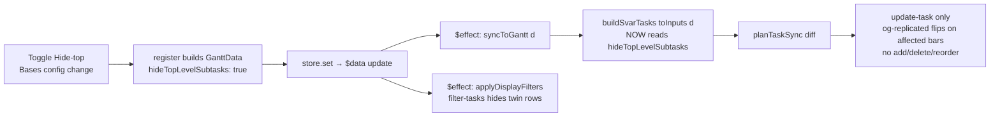

# fix: Replicated hatch should count only visible instances (exclude Hide-top-suppressed twins)

## Summary

The diagonal "replicated" hatch (`og-replicated`) is drawn on any note whose `countBySource > 1`, where the count runs over the **entire stable instance array**. That array always contains the `alsoTopLevel` top-level twin of every matched, nested task — a twin that is *display-filtered out* when "Hide top-level subtasks" is on. So with Hide-top on (a common setting), single-parent nested tasks are shown exactly once but counted twice, and get hatched incorrectly.

This plan implements **Option A**: compute `isReplicated` over the note's **visible** instances by excluding the Hide-top-suppressed twin, entirely in the view layer (`buildSvarTasks`), and let the existing `$data → syncToGantt` path apply the change live when Hide-top toggles. The controller's visibility-free derivation — the #161 invariant — is not touched.

---

## Problem Frame

**Symptom (verified with the maintainer):** In a view with "Hide top-level subtasks" **on**, every matched task that is nested under a displayed parent is hatched, even though each such note has a single parent and appears on screen exactly once. Genuine roots are not hatched.

**Root cause (traced end-to-end):**
1. `resolveCompanionTree` sets `alsoTopLevel = !isFetched && hasDisplayedParent` for every matched, nested task — unconditionally, regardless of the Hide-top toggle ([src/datasource/companionResolve.ts:138](src/datasource/companionResolve.ts)).
2. `expandInstances` emits an **extra top-level instance** (`isTopLevelPlacement: true`) for each `alsoTopLevel` task, so a single-parent task has 2 instances ([src/controller/InstanceExpansion.ts:404-409](src/controller/InstanceExpansion.ts)).
3. "Hide top-level subtasks" only *display*-filters that twin via `shouldHideRow` / SVAR `filter-tasks`; the instance stays in the array (the deliberate #161 decoupling) ([src/bases/rowVisibility.ts:52-57](src/bases/rowVisibility.ts)).
4. `buildSvarTasks` computes `countBySource` over the whole array with no knowledge of the toggle, so the hidden twin inflates the count → `isReplicated = true` → hatch ([src/bases/ganttSync.ts:208-214](src/bases/ganttSync.ts), [src/bases/ganttSync.ts:263](src/bases/ganttSync.ts)).

The stale comment at [src/bases/ganttSync.ts:205](src/bases/ganttSync.ts) still claims it counts "the *displayed* instances" — true before #161, false after the instance set was decoupled from the toggle.

**Why the date filters are not implicated:** every instance of a note shares one `dateStatus` (all built from one source task — [src/controller/InstanceExpansion.ts:490](src/controller/InstanceExpansion.ts)), so Show-undated / Show-partial hide *all* copies of a note or none — they can never turn "2 copies" into "1 copy." Collapse and scroll never remove instances from the array. Therefore **Hide-top is the only display state that can split a note's copy count**, and it is the only flag this fix must consider. (Edge-of-edge: SVAR `filterTree` keeps a hidden ancestor if a descendant passes — an undated note nested with a dated child in one place but not another could theoretically show 1 of 2; out of scope, see Scope Boundaries.)

---

## Requirements

The cue must mean: **"this note is on screen more than once."** Concretely, hatch iff the count of the note's instances that are **not** currently Hide-top-suppressed is `> 1`. (Maintainer-confirmed rule; "visible" = matched + Show-all-extended, with collapsed/nested still counting.)

| # | Scenario | Visible instances | Expected |
|---|---|---|---|
| R1 | Multi-parent, both nested placements present | 2 | **hatch** |
| R2 | Multi-parent collapsed to one by the fan-out guard (`isCollapsed`) | 1 | no hatch |
| R3 | Single parent, Hide-top **on** (nested shown, twin hidden) | 1 | no hatch (the bug) |
| R4 | Single parent, Hide-top **off** (root + nested both shown) | 2 | **hatch** |
| R5 | Genuine root (no displayed parent, one instance) | 1 | no hatch |

> **"Collapsed" disambiguation (R2).** R2 refers to the **fan-out *guard*** — a note with >50 parents reduced to a single `isCollapsed` instance by [InstanceExpansion.ts](src/controller/InstanceExpansion.ts) — which genuinely leaves **1 instance in the array**. It is **not** the parent fold/expand chevron (SVAR `open`/`collapsedIds`): folding a parent hides descendant rows visually but leaves every instance in the array, so it **never** changes the count. A multi-parent note with a folded parent is still the R1 case (count 2 → hatched). Scroll and viewport likewise never affect the count. "Visible" here means *present in the matched + Show-all-extended instance set*, not *currently painted*.

---

## Key Technical Decisions

**KTD1 — Count over visible instances by excluding the Hide-top-suppressed twin, in `buildSvarTasks`.** Change the `countBySource` accumulation so an instance is counted unless it is a twin that Hide-top is currently hiding:

```text
count an instance toward replication  ⇔  NOT (hideTopLevelSubtasks AND inst.isTopLevelPlacement)
isReplicated = count(sourcePath) > 1
```

This is the minimal faithful encoding of the rule and satisfies R1–R5 (directional; not implementation-spec). Rationale vs. the earlier "always exclude `isTopLevelPlacement`" proxy: that proxy fails R4 (Hide-top off, root+nested → should hatch but wouldn't). Gating the exclusion on `hideTopLevelSubtasks` is what makes R3 and R4 both correct.

**KTD2 — View layer only; derivation stays visibility-free.** The flag is read in `buildSvarTasks` (presentation), never in `GanttController.resolveAndFilter` / `companionResolve` / `expandInstances`. `getInstances()` and `snapshotsEqual` remain visibility-free, preserving the #161 R1 invariant ([src/controller/GanttController.ts:1453-1457](src/controller/GanttController.ts)). This is the load-bearing constraint — putting the flag back into the derivation would revive #161 engine 2.

**KTD3 — Live update rides the existing `$data → syncToGantt` path; no new effect.** `hideTopLevelSubtasks` already rides on `GanttData` ([src/bases/register.ts:834](src/bases/register.ts)) and `syncToGantt` already runs on every store update ([src/bases/GanttContainer.svelte:592-596](src/bases/GanttContainer.svelte)). Today a Hide-top toggle pushes new `GanttData` → `syncToGantt` → `buildSvarTasks` runs but no-ops (count ignores the flag). Once `buildSvarTasks` reads the flag, the same path produces different `type` strings for the affected bars → `planTaskSync` emits **update-only** ops → the hatch flips live. No new subscription, no reactive wiring to add.

**KTD4 — The toggle stays update-only (no add/delete/reorder), so it can't churn.** Because the instance array is identical for either flag value (same ids, same order), `planTaskSync` produces `updates` only; `orderFingerprint` is unchanged; `shouldBulkReseed` is not tripped; scroll/zoom are preserved. Per the #161 architecture doc's own scope boundary, `type`-changing options are the sanctioned lower-severity class ([docs/solutions/architecture-patterns/view-display-options-in-presentation-not-derivation.md:37](docs/solutions/architecture-patterns/view-display-options-in-presentation-not-derivation.md)) — the same class as the existing `showDateIndicators` toggle.

**KTD5 — No task-type registry change.** `REPLICATED_TYPE` / `buildInstanceCueTaskTypes` registration is unchanged; only *when* a bar receives `og-replicated` changes. The composed-type ordering (replicated before context) is untouched.

---

## High-Level Technical Design

Data flow on a Hide-top toggle (why the live update is free and churn-safe):



The controller path (`onDataUpdated → recompute(reuseTasks) → snapshotsEqual`) stays a visibility-free no-op; all of the change lives on the right-hand `register → $data → syncToGantt` branch.

---

## Implementation Units

### U1. Count replication over visible instances in `buildSvarTasks`

**Goal:** Fix the false-positive hatch by threading `hideTopLevelSubtasks` into the SVAR-task builder and excluding the Hide-top-suppressed twin from the replication count.

**Requirements:** R1–R5.

**Dependencies:** none.

**Files:**
- `src/bases/ganttSync.ts` — add `hideTopLevelSubtasks: boolean` to `SvarTaskInputs`; destructure it in `buildSvarTasks` (default `false`); guard the `countBySource` accumulation ([src/bases/ganttSync.ts:208-214](src/bases/ganttSync.ts)); refresh the stale "displayed instances" comment at [src/bases/ganttSync.ts:205](src/bases/ganttSync.ts).
- `src/bases/GanttContainer.svelte` — in `toInputs(d)`, pass `hideTopLevelSubtasks: d.hideTopLevelSubtasks ?? false` ([src/bases/GanttContainer.svelte:468](src/bases/GanttContainer.svelte)).
- `test/unit/ganttSync.test.ts` — extend the `inputs()` helper with `hideTopLevelSubtasks` (default `false`); add the scenarios below.

**Approach:** Keep the existing single pass that builds `primaryBySource` and `countBySource`; only the `countBySource` increment becomes conditional (`!(hideTopLevelSubtasks && inst.isTopLevelPlacement)`). `primaryBySource` selection is unaffected. `isReplicated` at [src/bases/ganttSync.ts:263](src/bases/ganttSync.ts) reads the adjusted count unchanged. Note that when Hide-top is off the twin is a real second visible placement and legitimately counts (R4), so the exclusion must be gated on the flag, not unconditional.

**Patterns to follow:** mirror how `showDateIndicators` is threaded through `SvarTaskInputs` → `buildSvarTasks` → per-task `type` and how its unit tests are written ([test/unit/ganttSync.test.ts](test/unit/ganttSync.test.ts) "does not flag when date indicators are off"). Use the existing `inst()` / `inputs()` factories.

**Test scenarios** (each asserts `isReplicated` in `custom` and presence/absence of `REPLICATED_TYPE` in `type`):
- Covers R1. Two instances of one `sourcePath`, both `isTopLevelPlacement: false` (multi-parent) → both `isReplicated: true`, `type` contains `og-replicated`.
- Covers R3. One nested instance (`isTopLevelPlacement: false`) + one twin (`isTopLevelPlacement: true`), `hideTopLevelSubtasks: true` → nested instance `isReplicated: false`, no `og-replicated`. (The bug fix.)
- Covers R4. Same two instances, `hideTopLevelSubtasks: false` → both `isReplicated: true`, `og-replicated` present. (Preserves hide-off behavior.)
- Covers R5. Single instance, no twin → `isReplicated: false`.
- Covers R2. Single `isCollapsed: true` instance for a `sourcePath` → `isReplicated: false` (count is 1 regardless of flag).
- Default-arg guard: `inputs()` omitting `hideTopLevelSubtasks` behaves as `false` (twin counts) — so callers that don't set it keep hide-off semantics.
- Regression: an unrelated dated leaf with a status-color class still composes `type` correctly (no `og-replicated`) — ensures the count change didn't perturb type composition.

**Verification:** `npm test` (Jest) green, including the new scenarios and the existing `buildSvarTasks` / instance-cue suites. `svelte-check` clean for the new `SvarTaskInputs` field and `toInputs` wiring.

### U2. Confirm live toggle + churn-safety (verification, no new production code)

**Goal:** Verify the end-to-end behavior the fix relies on: flipping Hide-top flips the hatch live via an **update-only** diff, with no row add/delete/reorder and preserved scroll.

**Requirements:** R3 ⇄ R4 transition; KTD3, KTD4.

**Dependencies:** U1.

**Files:**
- `test/unit/ganttSync.test.ts` — a `planTaskSync` assertion: diffing `buildSvarTasks` output for the same instances with `hideTopLevelSubtasks` false vs. true yields a plan with `updates` on the affected bars and **empty** `adds`/`deletes`/`moves`. This locks KTD4 at the fastest level.
- (Optional, only if the unit assertion is deemed insufficient) `test/specs/*.e2e.ts` — extend an existing render/toggle spec to assert the hatch class appears/disappears on a Hide-top toggle without a row-count change. Prefer not to add a new heavyweight spec if the `planTaskSync` unit assertion + existing toggle e2e already cover it (see [docs/solutions] "test at the fastest reliable level").

**Approach:** This unit is primarily a guardrail proving the existing `$data → syncToGantt → planTaskSync` path (already exercised for `showDateIndicators`) yields update-only ops for this new `type` dependency. No production wiring is added — U1 is the whole behavioral change.

**Test scenarios:**
- `planTaskSync(before, after)` where `before`/`after` are `buildSvarTasks` outputs differing only in `hideTopLevelSubtasks` → `updates.length > 0`, `adds.length === 0`, `deletes.length === 0`, `moves.length === 0`.

**Verification:** `npm test` green. If the optional e2e is added, `npm run e2e:local` passes the affected spec (real-Obsidian gate per project convention).

---

## Scope Boundaries

**In scope:** the replication-count predicate in `buildSvarTasks`, its `SvarTaskInputs` field + `toInputs` wiring, and unit coverage of R1–R5 plus the update-only diff guarantee.

### Deferred to Follow-Up Work
- **`filterTree` ancestor-keep edge case:** an undated note nested with a dated child in one placement but not another could, under Show-undated off, be visible once but counted twice. This requires mirroring the full `shouldHideRow` (date filters + ancestor-keep) inside the count and is disproportionate to its likelihood. Revisit only with a concrete repro.

### Out of scope (non-goals)
- Changing when `alsoTopLevel` twins are *emitted* or *display-filtered* (that machinery is correct; only the count misread it).
- Any change to the controller derivation, `snapshotsEqual`, or the `filter-tasks` predicate.
- The `og-context` (Show-all) dimming cue — unrelated and correct.

---

## Risks & Loop-Safety (#161)

The one real risk is reviving a #161 storm engine. The fix clears all three:

| #161 engine | Fed by this change? | Why |
|---|---|---|
| 1. Data-layer `getValue` re-poke | No | `buildSvarTasks` adds zero reads; `reuseTasks` gate untouched. |
| 2. Presentation-layer derivation churn | No | Flag lives in the view; instance array stays visibility-free → toggle is update-only, not add/delete/reorder (KTD2, KTD4). |
| 3. Config-write echo | No | The change reads `hideTopLevelSubtasks`; it writes no config. |

Precedent: `showDateIndicators` is already a per-view toggle that flips a bar `type` through `buildSvarTasks` on the same path, and it does not churn. **Behavior change to note honestly:** a Hide-top toggle is no longer a *pure* `filter-tasks` pass — it now also emits a handful of `update-task` ops for the also-top-level bars. This is within the doc's sanctioned lower-severity class and preserves scroll/zoom, but it is strictly more work than the zero-diff filter it is today.

---

## Sources & Research

In-session root-cause trace (2026-07-02) across `barTreatment.ts`, `ganttSync.ts`, `InstanceExpansion.ts`, `companionResolve.ts`, `rowVisibility.ts`, `GanttContainer.svelte`, `register.ts`, `viewOptions.ts`, and `GanttController.ts`. Loop-safety grounded in [docs/solutions/architecture-patterns/view-display-options-in-presentation-not-derivation.md](docs/solutions/architecture-patterns/view-display-options-in-presentation-not-derivation.md) (scope boundary line 37; three-engine model) and [docs/solutions/integration-issues/gantt-bases-getvalue-renotify-storm.md](docs/solutions/integration-issues/gantt-bases-getvalue-renotify-storm.md). Diff-sync (`planTaskSync`, `shouldBulkReseed`, update-only path) per [docs/solutions/integration-issues/svar-gantt-diff-sync-interactions.md](docs/solutions/integration-issues/svar-gantt-diff-sync-interactions.md).
