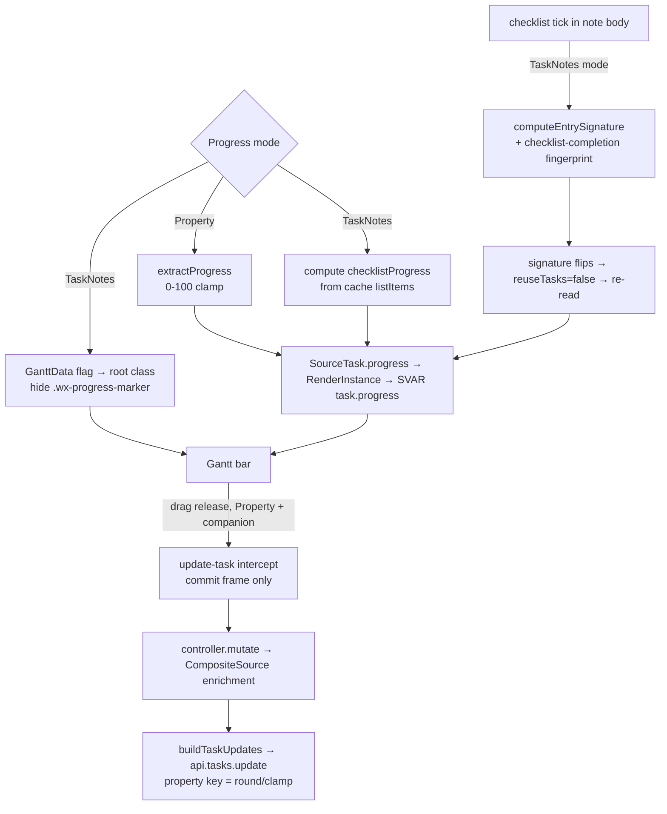

# Progress Persistence - Plan

## Goal Capsule

- **Objective:** Give the Gantt bar a chosen progress source per view — TaskNotes' computed value or a user-defined numeric property — and persist progress by dragging the bar handle when the property source is used.
- **Product authority:** Maintainer (renatomen). Product decisions are confirmed.
- **Open blockers:** None. The two feasibility questions the brainstorm deferred are resolved (see Key Technical Decisions): the custom-property write reuses a proven path, and live refresh on checklist change is handled by extending the entry-signature.
- **Product Contract preservation:** Product Contract unchanged — R1–R12 and AE1–AE5 carried forward verbatim.

---

## Product Contract

### Summary

Add a per-view "Progress mode" setting with two modes. **TaskNotes Progress** drives the bar from the value TaskNotes shows on its task card (its computed `checklistProgress`) as a read-only bar that updates automatically when the underlying checklist changes. **Property** reads a numeric 0–100 property, clamps out-of-range values to the nearest boundary, and — when TaskNotes is present — persists a drag of the bar's progress handle back to that property on handle release.

### Problem Frame

Progress on the Gantt bar is read-only today and stubbed to derive nothing: `TaskNotesSource` sets `progress: null` and the update path deliberately drops `progress` ("milestone 1 — progress derived/read-only"). Users have two distinct expectations that the current single behavior can't serve: some want progress to reflect TaskNotes' own computed completion (so ticking a checklist item in the note moves the bar without touching the Gantt), and others want progress to be a value they set and own on a property (so dragging the bar records where a task actually stands). One global behavior forces a choice the user should be making per view. This is the milestone that turns progress from display-only into a sourced, and optionally editable, value.

### Key Decisions

- **Mirror TaskNotes' computed value; do not invent a different definition.** TaskNotes Progress mode reflects the same completion TaskNotes computes for its card: completed ÷ total top-level checklist items, as a percentage. See KTD1 for how it is read.
- **Migration-aware default.** New views default to TaskNotes Progress. A view that already has a Progress Property configured defaults to Property mode, so existing behavior is preserved and no view silently switches what it displays.
- **Persistence is companion-only.** Standalone Bases mode is already a read-only timeline (`BasesSource.capabilities.write = false`, no mutate path). A standalone Property bar reads a property but cannot persist a drag — consistent with dates, which also don't persist standalone.
- **Read-only source hides its editing affordance.** In TaskNotes Progress mode the value is computed, so the bar's progress drag-handle is hidden rather than shown and silently snapped back.
- **No debounce.** Persistence fires only on handle release. The `update-task` intercept already discards mid-gesture (`inProgress`) frames, so one release produces one write.

### Requirements

**Progress mode setting**

- R1. A per-view "Progress mode" setting offers two values: `TaskNotes Progress` and `Property`.
- R2. The setting defaults to `TaskNotes Progress` for a new view, except a view that already has a Progress Property configured defaults to `Property`.
- R3. When TaskNotes is not present (standalone Bases mode), the `TaskNotes Progress` option is not offered; the view operates in `Property` mode. This mirrors how companion-only relationship controls are hidden in standalone mode.

**TaskNotes Progress mode**

- R4. In `TaskNotes Progress` mode the bar's progress reflects the value TaskNotes shows on its task card (its computed `checklistProgress` percentage), not any Gantt-side or property value.
- R5. When the underlying computed value changes (e.g. a checklist item is ticked in the note), the bar's progress updates to match without a manual Gantt refresh.
- R6. When TaskNotes reports no computed progress for a task (e.g. the note has no checklist), the bar shows 0% (empty progress).
- R7. In `TaskNotes Progress` mode the bar's progress drag-handle is hidden or non-interactive; the value cannot be edited from the Gantt.

**Property mode**

- R8. `Property` mode reads the numeric value of the view's Progress Property as the bar's progress.
- R9. Values are treated as a 0–100 percentage; a value below 0 coalesces to 0 and a value above 100 coalesces to 100, on both read and write.
- R10. When TaskNotes is present, releasing a drag of the bar's progress handle persists the resulting percentage to the view's Progress Property on that task.
- R11. Persistence occurs on handle release only, producing a single write per gesture; no mid-drag writes and no debounce.
- R12. In standalone Bases mode, `Property` mode reads the property but the progress handle does not persist (the timeline is read-only).

### Acceptance Examples

- AE1. Covers R5. **Given** a view in TaskNotes Progress mode showing a task whose note has a 2-of-4-item checklist (bar at 50%), **when** the user ticks a third item in the note, **then** the bar moves to 75% without a manual Gantt refresh.
- AE2. Covers R7. **Given** a view in TaskNotes Progress mode, **when** the user looks at a bar, **then** no progress drag-handle is available and attempting to drag progress does nothing.
- AE3. Covers R9, R10. **Given** a view in Property mode with TaskNotes present, **when** the user drags a bar's progress handle to ~117% and releases, **then** the Progress Property is written as 100.
- AE4. Covers R2. **Given** an existing view that already has a Progress Property configured, **when** the Progress mode setting is introduced, **then** that view defaults to Property mode and its displayed progress is unchanged.
- AE5. Covers R12. **Given** a standalone Bases view (no TaskNotes) in Property mode, **when** the user drags a bar's progress handle and releases, **then** the value is not persisted.

### Scope Boundaries

- Computing progress from child task-notes (relationship subtasks) is out of scope — TaskNotes does not expose that; TaskNotes Progress mode mirrors the card's `checklistProgress`.
- A standalone (non-companion) frontmatter write path is out of scope — persistence stays behind the TaskNotes companion.
- Persisting progress in TaskNotes Progress mode is out of scope — the value is computed and read-only there.

#### Deferred to Follow-Up Work

- A **synthetic "Progress" grid column** for TaskNotes Progress mode. Grid columns today are built only from Bases visible properties ([gridColumns.ts:79-116](src/bases/gridColumns.ts#L79-L116)); a computed value has no property id, so a column for it requires a new synthetic-column concept (descriptor, cell rendering, width persistence, sort). Deferred. Note: in **Property** mode a progress column already works today with no code — the user adds the numeric property to the Base's columns.

---

## Planning Contract

### Key Technical Decisions

- KTD1. **Read TaskNotes Progress by computing `checklistProgress` plugin-side from the note's metadata-cache `listItems`, not from a Bases formula column.** Reads always come from `BasesSource` (the composite's read base; TaskNotes hardcodes `progress: null`), and there is no TaskNotes API returning computed progress. The computed value is derived from the same source data TaskNotes uses — top-level `- [x]` ÷ total top-level checklist items × 100 — read cache-safely from `metadataCache.getFileCache(path).listItems`. The compute lives on `BasesSource` (which already holds `this.app`), not on `BasesDataAdapter` — the adapter is constructed with no `App`/`metadataCache` ([BasesSource.ts:50](src/datasource/BasesSource.ts#L50), [register.ts:398](src/bases/register.ts#L398)) and cannot reach the cache without a DI change. **Alternative rejected:** mapping progress to the Bases `formula.checklistProgress` / `file.tasks` column reads via `entry.getValue`, which is the exact path the #161 refresh-storm guard avoids, requires the user to configure a formula column, and may need 0–1→0–100 scaling.
- KTD2. **Live refresh (R5) by folding checklist-completion state into `computeEntrySignature` when in TaskNotes Progress mode.** The refresh gate currently reads only frontmatter values ([register.ts:369-395](src/bases/register.ts#L369-L395)); a body checklist edit changes `listItems`, not frontmatter, so today the signature wouldn't flip and `reuseTasks` would skip the re-read. Folding a per-file checklist-completion fingerprint (from the cache, no `getValue`) into the signature for this mode flips it on a checklist tick → re-read → recompute. **Alternative rejected:** relying on a TaskNotes change event is uncertain (unconfirmed whether a body checklist toggle emits one).
- KTD3. **Hide the progress handle via scoped CSS on `.wx-progress-marker`, not SVAR's global `readonly`.** SVAR exposes no per-task progress-handle disable; `readonly` disables all drag/resize/link/editor interaction — too broad, since date-drag must still work. A mode flag on the reactive `GanttData` applies a root class that hides the progress marker and makes the progress area non-interactive, mirroring the repo's existing scoped-class/generated-stylesheet bar-treatment pattern.
- KTD4. **Persist the Property-mode value through the proven custom-field write path.** `applyDateWrite` already writes an arbitrary frontmatter key via `updates[key] = value` through `api.tasks.update` ([TaskNotesSource.ts:951-959](src/datasource/TaskNotesSource.ts#L951-L959), "confirmed vs 4.11.0 main.js"). A resolved progress-write target mirrors `dateWrites`; `buildTaskUpdates` writes a rounded, clamped 0–100 integer to the property key. The controller strips the Bases prefix when resolving `progressProperty` (a prefixed id like `note.progress`) into `progressWrite.key`, reusing the existing `bareProperty` helper ([GanttController.ts:997,1002](src/controller/GanttController.ts#L997)) that already bares start/end — otherwise the value writes to a `note.progress` frontmatter key and never round-trips on re-read. Only fields present in the patch are written, so a progress commit never clobbers dates/status/title.
- KTD5. **Resolve the mode default at read time; do not store a migration value.** A reader normalizes the stored `tngantt_progressMode` and, when unset, resolves per R2/R3: `property` when a Progress Property is configured or when standalone; otherwise `tasknotes`. Mirrors the existing `readBarColorSource` / `readExpandedRelationships` readers.

### High-Level Technical Design

Two modes feed one `task.progress` value on the SVAR bar; only Property mode has a write-back edge, and only TaskNotes mode extends the refresh signature.

### Assumptions

- The persisted percentage is stored as an integer 0–100 (rounded on release).
- The Progress Property mapping already present in view options (`tngantt_progressProperty`) is the property source for Property mode; no new mapping is introduced.
- The `checklistProgress` algorithm matches TaskNotes': only top-level checklist items count (nested items excluded); no checklist items → treated as no progress (bar 0%).

### Deferred to Implementation

- Confirm the SVAR `update-task` payload carries the final `progress` on the committing frame (`inProgress` falsy). If SVAR only emits progress mid-gesture, capture the last observed value at commit. Verified against the running Gantt during U6.

### Sequencing

U1 → U2 establish the setting and thread the mode. U3 (read) and U5 (hide handle) depend on U2. U4 (refresh) depends on U3. U6 (persistence) depends on U2 and is independent of U3–U5. Recommended order: U1, U2, U3, U4, U5, U6.

---

## Implementation Units

### U1. Progress mode setting + reader

- **Goal:** Add the `tngantt_progressMode` dropdown (companion-gated) and a pure reader that resolves the effective mode per R1–R3 and the migration default (R2).
- **Requirements:** R1, R2, R3.
- **Dependencies:** none.
- **Files:** `src/bases/viewOptions.ts`, `src/bases/viewOptions.test.ts`, `src/bases/fieldMappingConfig.ts` (reference the existing `tngantt_progressProperty` key; clarify its placeholder to say it applies when Progress mode = Property).
- **Approach:** Add a `dropdown` option `{ tasknotes: 'TaskNotes Progress', property: 'Property' }` to `ganttViewOptions`, rendered only when `companionAvailable` (place alongside the other companion-gated controls). Add `readProgressMode(get, { companionAvailable, hasProgressProperty })` returning `'tasknotes' | 'property'`: explicit stored value wins (normalized); when unset, return `'property'` if `!companionAvailable || hasProgressProperty`, else `'tasknotes'`. Mirror `readBarColorSource`/`readExpandedRelationships`.
- **Patterns to follow:** `relationshipOptions()` companion-gating and `readBarColorSource`/`readExpandedRelationships` readers in `src/bases/viewOptions.ts`.
- **Test scenarios:**
  - Covers R1. Option set includes both `tasknotes` and `property` values with correct labels when `companionAvailable`.
  - Covers R3. Option omitted from the returned array when `companionAvailable === false`.
  - Covers R2. `readProgressMode` with unset value returns `property` when `hasProgressProperty`, `tasknotes` otherwise.
  - Covers R3. `readProgressMode` with unset value returns `property` when `!companionAvailable` even with no property configured.
  - Explicit stored `'tasknotes'`/`'property'` is honored; junk/empty coalesces to the unset-default path.

### U2. Thread progress mode into controller config and field mappings

- **Goal:** Make the resolved mode available to the read path and the view without a remount, alongside the existing option-change-applies-on-recompute behavior.
- **Requirements:** R1 (enabling), supports R4/R7/R8/R10.
- **Dependencies:** U1.
- **Files:** `src/bases/register.ts` (add `getProgressMode()`; include mode in the mappings/config passed to the controller and in the reactive `GanttData`), `src/controller/GanttController.ts` (carry `progressMode` on the config/mappings snapshot), `src/bases/register.test.ts`, `src/controller/GanttController.test.ts`.
- **Approach:** Add `getProgressMode()` wrapping `readProgressMode` with `companionAvailable` and `hasProgressProperty` (derived from the resolved `progressProperty`). Thread the value into `buildFieldMappings()`/the controller config so `BasesSource` reads it (U3) and into `GanttData` so the container reads it (U5). Follow the existing pattern where a view-option change applies on the next recompute (no remount), like `expandedRelationships`.
- **Patterns to follow:** `getBarColorMode()` / `getThemeMode()` getters and the reactive-`GanttData` flow in `src/bases/register.ts`.
- **Test scenarios:**
  - `getProgressMode` returns the reader's result given companion availability and configured property.
  - Mode is present on the mappings/config snapshot handed to the controller.
  - Changing the mode option triggers a recompute path (no remount), consistent with other per-view options.

### U3. Compute checklistProgress in TaskNotes mode (read)

- **Goal:** In TaskNotes Progress mode, populate `SourceTask.progress` from the note's checklist items instead of the Progress Property (R4, R6). Property mode read is unchanged (R8, R9).
- **Requirements:** R4, R6, R8, R9.
- **Dependencies:** U2.
- **Files:** `src/datasource/BasesSource.ts` (add `computeChecklistProgress(entry): number | null` reading `this.app.metadataCache.getFileCache(file).listItems`; branch `toSourceTask` on mode), `src/datasource/BasesSource.test.ts`.
- **Approach:** Place `computeChecklistProgress` on `BasesSource`, not `BasesDataAdapter` — the adapter is constructed without `App`/`metadataCache` and cannot reach the cache, whereas `BasesSource` already holds `this.app` (KTD1). It resolves the entry's `TFile`, reads `listItems` from the cache, counts top-level items (`typeof item.task === 'string'`, excluding nested `item.parent >= 0`), returns `round(completed/total*100)` or `null` when total is 0. Cache-safe: no `entry.getValue`. In `toSourceTask`, when `mappings.progressMode === 'tasknotes'` set `progress = computeChecklistProgress(entry)`; else keep `this.adapter.extractProgress(entry, progressProperty)`. `ganttSync` already maps `progress ?? 0`, satisfying R6.
- **Patterns to follow:** TaskNotes' own `calculateChecklistProgress` (algorithm reference, `../tasknotes/src/ui/taskCardProperties.ts`); existing `extractProgress`/`extractValue` cache access in `BasesDataAdapter`.
- **Test scenarios:**
  - Covers R4. 2 completed of 4 top-level items → 50.
  - Covers R6. No checklist items → `null` → bar renders 0.
  - Nested checklist items are excluded from the count.
  - Covers R8. In `property` mode the property value is read (compute path not taken).
  - Covers R9. In `property` mode a read value below 0 clamps to 0 and above 100 clamps to 100 (regression guard on the pre-existing `extractProgress` clamp).
  - `x`/`X` completion marker both count as completed; other markers count as total-but-incomplete.

### U4. Live refresh on checklist change

- **Goal:** A checklist edit in a note body refreshes the bar in TaskNotes Progress mode (R5) without breaking the #161 storm guard in other modes.
- **Requirements:** R5.
- **Dependencies:** U3.
- **Files:** `src/bases/register.ts` (`computeEntrySignature`), `src/bases/entrySignature.ts` (helper to fold checklist-completion state), `src/bases/entrySignature.test.ts`, `src/bases/register.test.ts`, e2e spec under `test/specs/` (live-refresh, AE1).
- **Approach:** When `progressMode === 'tasknotes'`, extend the per-entry signature contribution with a compact checklist-completion fingerprint derived from the cache `listItems` (e.g. counts of completed/total top-level items). Read from `metadataCache` only — never `entry.getValue`. In non-TaskNotes modes the signature is unchanged, so the existing frontmatter-only behavior and #161 guard are untouched.
- **Patterns to follow:** `frontmatterSignatureKeys` and the JSON-encoded per-field signature in `src/bases/entrySignature.ts` / `computeEntrySignature`.
- **Test scenarios:**
  - Covers R5. Toggling a checklist item's completion changes the computed signature (TaskNotes mode) → `reuseTasks` resolves false on the next notify.
  - A frontmatter-only edit unrelated to progress does not spuriously flip the checklist fingerprint.
  - In `property` mode the signature is identical to today (no checklist contribution) — regression guard.
  - Covers AE1 (e2e). Ticking a checklist item in a note (2-of-4 → 3-of-4) moves the bar from 50% to 75% without a manual Gantt refresh — proves the signature flip actually re-renders the bar, which the unit test alone does not.

### U5. Hide the progress handle in TaskNotes mode

- **Goal:** Remove the progress drag affordance when the value is computed (R7), leaving date drag/resize intact.
- **Requirements:** R7.
- **Dependencies:** U2.
- **Files:** `src/bases/GanttContainer.svelte` (consume the mode flag from `GanttData`; apply a root class; scoped `<style>` hiding `.wx-progress-marker` and disabling pointer events on the progress area), `src/bases/ganttSync.ts` (carry the flag onto `GanttData` if not already threaded in U2), e2e spec under `test/specs/` (progress-handle visibility).
- **Approach:** Add a boolean like `progressReadonly` (true when mode is `tasknotes`) to `GanttData`; the container toggles a root class (e.g. `og-progress-readonly`). Scoped CSS: `.og-progress-readonly :global(.wx-progress-marker) { display: none }` plus non-interactive progress area. Do not use SVAR global `readonly` (KTD3). The exact SVAR marker class (`.wx-progress-marker`) comes from the SVAR skill reference; the sibling `.wx-progress-percent` is confirmed in-repo ([GanttContainer.svelte:2487](src/bases/GanttContainer.svelte#L2487)). Confirm the marker selector against the rendered DOM during implementation — a mismatch surfaces in the R7 e2e gate.
- **Patterns to follow:** the `datestatus-flagged .wx-progress-percent` scoped-CSS block and the `showToolbar` reactive-flag flow already in `GanttContainer.svelte`.
- **Test scenarios:**
  - Covers R7 (e2e). In TaskNotes Progress mode the rendered bar exposes no progress marker; date drag still persists.
  - In Property mode the progress marker is present (regression guard).
  - Unit: mode → root-class mapping.

### U6. Persist progress drag in Property mode

- **Goal:** On handle release in Property mode with a companion present, write the clamped, rounded percentage to the Progress Property (R9, R10, R11); no-op standalone (R12).
- **Requirements:** R9, R10, R11, R12.
- **Dependencies:** U2.
- **Files:** `src/datasource/types.ts` (extend `TaskPatch` with a resolved progress-write target), `src/datasource/TaskNotesSource.ts` (`buildTaskUpdates` writes the property key), `src/controller/GanttController.ts` (resolve `progressProperty` → write target; gate on `mode === 'property'`, companion writable), `src/bases/GanttContainer.svelte` (emit a progress patch from the `update-task` commit frame), plus the matching `*.test.ts` files.
- **Approach:** Add `progressWrite?: { key: string }` to `TaskPatch` and carry the numeric `progress`. In the container's existing `update-task` intercept, on a committing frame (`inProgress` falsy) with a changed `task.progress`, and only when the container's mode flag is `property` and not `readOnly`, call `onMutate` with a progress patch. `controller.mutate` resolves the `progressProperty` into `progressWrite`, **stripping the Bases prefix via the existing `bareProperty` helper** (so `note.progress` → `progress`), and forwards. `buildTaskUpdates`: when `progressWrite` and `progress` are present, `updates[progressWrite.key] = clamp0to100(round(progress))`. Standalone → `readOnly`/non-writable composite → no write (R12), same gate the date-drag path uses.
- **Patterns to follow:** `applyDateWrite` custom-field write and the `dateWrites` resolution in `TaskNotesSource`; the `bareProperty` prefix-stripping already applied to start/end in `GanttController` ([GanttController.ts:997,1002](src/controller/GanttController.ts#L997)); the date-drag commit handling and `readOnly` gate in the `update-task` intercept in `GanttContainer.svelte`; echo-suppression `MutationContext` used by the date path.
- **Test scenarios:**
  - Covers R9, R10. `buildTaskUpdates` with `progress: 117` writes `100`; with `progress: -5` writes `0`; with `progress: 62.4` writes `62`.
  - Covers R10. A progress-only patch writes only the property key — dates/status/title untouched.
  - Covers R11. Only the committing frame (`inProgress` falsy) triggers a write; `inProgress` frames do not.
  - Covers R12. In standalone/non-writable mode the drag produces no write.
  - Covers R7 boundary. In `tasknotes` mode the container does not emit a progress patch even if a progress event arrives.
  - `Execution note:` Verify against the running Gantt that the final progress arrives on the commit frame (see Deferred to Implementation); write a failing integration test for the container→mutate contract first.

---

## Verification Contract

| Gate | Command | Applies to | Done signal |
|---|---|---|---|
| Type + build | `npm run build` | all units | Compiles with no type errors; single-file plugin builds. |
| Unit tests | `npm test` (Jest) | U1–U6 | New `*.test.ts` scenarios pass; existing suites green. |
| E2E | `npm run e2e:local` | U4, U5, U6 | Live-refresh (AE1), progress-handle-visibility (R7), and Property-mode persistence (R10) specs pass against real Obsidian. |

- Test-first for U6's container→mutate contract and U3's compute function (AAA, one behavior per test).
- E2E is a first-class gate for the handle-visibility (R7) and drag-persistence (R10) behaviors — run the relevant spec, do not defer.

## Definition of Done

- R1–R12 satisfied; AE1–AE5 demonstrably hold (AE1/AE2 via e2e, AE3 clamp via unit, AE4 default via unit, AE5 via standalone gate).
- Progress mode setting appears per-view, companion-gated (R3), with the migration-aware default (R2).
- TaskNotes Progress mode shows computed checklist progress, refreshes on checklist edit (R5), and exposes no editable handle (R7).
- Property mode persists a clamped, rounded percentage on release when companion is present (R9–R11) and no-ops standalone (R12).
- `npm run build`, `npm test`, and the relevant `npm run e2e:local` specs are green.
- Synthetic progress grid column remains deferred (not implemented); Property-mode column-via-Base behavior documented in release notes if user-facing docs are updated.

---

## Sources & Research

- Source composition — `CompositeSource` reads from `BasesSource` (read-only truth), TaskNotes enriches writes/deps; progress hardcoded `null` on the TaskNotes side: [CompositeSource.ts:20-92](src/datasource/CompositeSource.ts#L20-L92), [BasesSource.ts:32-84](src/datasource/BasesSource.ts#L32-L84), [TaskNotesSource.ts:845-848](src/datasource/TaskNotesSource.ts#L845-L848).
- Existing progress read + 0–100 clamp: [BasesDataAdapter.ts:528-531](src/bases/services/BasesDataAdapter.ts#L528-L531); `extractValue` routing of `formula.*`/computed via `getValue`: [BasesDataAdapter.ts:305-329](src/bases/services/BasesDataAdapter.ts#L305-L329).
- Progress currently dropped from the write patch: [TaskNotesSource.ts:912-940](src/datasource/TaskNotesSource.ts#L912-L940); custom-field write precedent (`applyDateWrite`): [TaskNotesSource.ts:951-959](src/datasource/TaskNotesSource.ts#L951-L959).
- Refresh gate reads frontmatter only (R5 risk + fix site): [register.ts:369-395](src/bases/register.ts#L369-L395), [register.ts:622-639](src/bases/register.ts#L622-L639).
- View-option + reader patterns: [viewOptions.ts:100-134](src/bases/viewOptions.ts#L100-L134), [viewOptions.ts:306-384](src/bases/viewOptions.ts#L306-L384); `onMutate` wiring: [register.ts:680-682](src/bases/register.ts#L680-L682).
- Grid columns are Bases-property-only (deferred synthetic column): [gridColumns.ts:79-116](src/bases/gridColumns.ts#L79-L116).
- SVAR: no per-task progress-handle disable (`readonly` is global); `.wx-progress-marker` CSS hook — SVAR gantt skill reference.
- TaskNotes `checklistProgress` algorithm reference: `../tasknotes/src/ui/taskCardProperties.ts` `calculateChecklistProgress`.
