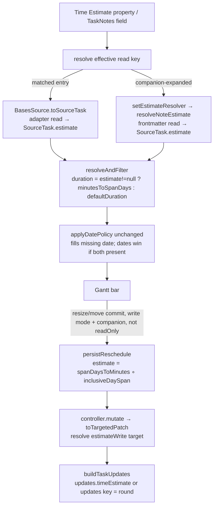

# Time Estimate Duration Sync - Plan

## Goal Capsule

- **Objective:** Let a task's Time Estimate (minutes) drive its Gantt bar length wherever a real date is missing, and — in a write-enabled mode — write the estimate back when the bar is resized, alongside the dates.
- **Product authority:** Maintainer (renatomen). Product decisions are confirmed.
- **Execution profile:** Test-first for the pure conversion module, the readers, the per-task duration derivation, and the write mapping; e2e for the resize→write round-trip and estimate-driven inference. Land as dependency-ordered commits (U1→U7).
- **Open blockers:** None. One item is verified during implementation, not before: whether TaskNotes' update API accepts the canonical `timeEstimate` field (KTD5 carries a direct-property fallback).
- **Product Contract preservation:** Product Contract unchanged — R1–R17 and AE1–AE6 carried forward verbatim.

---

## Product Contract

### Summary

Add a per-view "Time Estimate Update" mode (`Don't Update` / `TaskNotes Field` / `Property`, default `Don't Update`) and a companion "Time Estimate" property mapping. The resolved estimate feeds the existing date-inference engine as a per-task duration: it fills a missing start or end, or places a dateless task from today. Reading applies in all modes; the mode governs only whether resizing a bar writes the estimate back. When it does, a resize writes `start`, `end`, and `estimate` together.

### Problem Frame

The Gantt already infers a missing date from a duration ([datePolicy.ts](src/controller/datePolicy.ts)), but that duration is a single per-view "Default duration" measured in whole days — every partial or dateless task gets the same bar length regardless of how much work it actually represents. TaskNotes already stores a per-task `timeEstimate` (minutes) that captures exactly that magnitude, but the Gantt neither reads it nor writes it. So a task estimated at two days and one estimated at two hours draw identical bars, and resizing a bar to reflect a revised estimate has nowhere to record the change. This milestone connects the estimate the user already maintains to the timeline that should reflect it, in both directions.

### Key Decisions

- **Minutes map to bar length via a flat 1440 min/day conversion, isolated behind one seam.** 1440 minutes (24h) = one calendar day — a lossless, intuitive placeholder. The conversion is a single `minutes ↔ span-days` module so the future working-time schedule (weekends, holidays, working hours) replaces that one function without touching the read or write paths. An "hours per working day" factor now would be a half-implemented working-time assumption with no calendar behind it; rejected.
- **The estimate is a per-task duration feeding the existing inference, not a new inference path.** `datePolicy` already resolves a missing date from a duration; the estimate (converted to days) becomes a per-task override of the per-view Default duration. When a task has no usable estimate, the per-view Default duration remains the fallback. Almost no new inference logic.
- **Read is always on; the mode gates only writes.** The estimate shapes rendering in all three modes, including `Don't Update`. The mode decides only whether a resize writes the estimate back.
- **Read and write resolve the estimate source symmetrically.** The "Time Estimate" view property if the user set one; else TaskNotes' configured `timeEstimate` field when the companion is present; else the per-view Default duration. You read the estimate from the same place you would write it.
- **Dates win when a complete-dated task's estimate disagrees.** Inference only ever *fills* a missing date, so a task with both real dates already ignores the estimate for rendering. No new conflict rule is needed on the read side.
- **One write rule: a resize or move in a write mode writes `start` + `end` + `estimate` together.** This mirrors the existing date-write path (resize already writes both dates today) plus one field. The estimate is computed from the same new dates, so dates and estimate agree by construction at write time.

### Requirements

**Mode setting and property mapping**

- R1. A per-view "Time Estimate Update" setting offers three values: `Don't Update`, `TaskNotes Field`, `Property`. It defaults to `Don't Update`.
- R2. A per-view "Time Estimate" property setting selects the property used for the estimate. Its resolution depends on the mode: in `Property` mode it is the property the user picked; in `TaskNotes Field` mode, when left empty, it resolves to the property TaskNotes has configured for `timeEstimate`; in `Don't Update` mode it is used only for reading (see R6).
- R3. The `TaskNotes Field` option is offered only when the TaskNotes companion is present. In standalone Bases mode the option is not shown.
- R4. A Time Estimate value is a non-negative integer number of minutes. A missing, zero, non-integer, or otherwise non-finite value is treated as "no estimate."

**Reading: estimate drives date inference (all modes)**

- R5. The resolved estimate is converted to a whole-day duration and used as the per-task duration in date inference, in every mode including `Don't Update`.
- R6. The read source resolves as: the "Time Estimate" view property if set; else TaskNotes' configured `timeEstimate` field when the companion is present; else the per-view Default duration. In standalone Bases mode the TaskNotes-field fallback is unavailable, so only an explicitly-set "Time Estimate" property drives inference (else the Default duration).
- R7. A task with only a start date and a usable estimate renders `[start, start + (duration − 1)]` (inferred end). `duration` is the inclusive day count (`minutesToSpanDays`), so a 1-day duration is a single-day bar — matching the `[start, start + (D−1)]` convention in `datePolicy` (R11).
- R8. A task with only an end/due date and a usable estimate renders `[end − (duration − 1), end]` (inferred start).
- R9. A task with no dates and a usable estimate renders `[today, today + (duration − 1)]` (placeholder anchored at today).
- R10. A task with no usable estimate renders exactly as today — inference falls back to the per-view Default duration, and a task with neither date nor estimate follows the current placeholder behavior.
- R11. Minutes convert to days as `max(1, ceil(minutes / 1440))`, so every task with a usable estimate renders at least a one-day bar. The day count is inclusive, consistent with the existing date-policy span convention, so the read and write conversions round-trip.
- R12. When a task has both real dates, they are used as-is for rendering and the estimate is ignored (dates win).

**Writing: resize persists the estimate (write modes only)**

- R13. In `Don't Update` mode, resizing or moving a bar writes dates exactly as today; the estimate is never written.
- R14. In `TaskNotes Field` or `Property` mode, committing a resize or move writes `start`, `end`, and `estimate` together. The estimate written is the bar's span converted to minutes (`span-days × 1440`), computed from the same dates being written.
- R15. `TaskNotes Field` mode writes the estimate through TaskNotes' `timeEstimate` field; `Property` mode writes it to the selected "Time Estimate" property.
- R16. Writing occurs on gesture commit only (one write per gesture), matching the existing drag/resize persistence.
- R17. In standalone Bases mode the timeline is read-only: no estimate (and no date) is written regardless of the selected mode.

### Acceptance Examples

- AE1. Covers R7, R11. Given a task with start = Mon and estimate = 2880 min (2 days) and no end, when the view renders, then the bar spans `[Mon, Tue]`.
- AE2. Covers R9, R11. Given a task with no dates and estimate = 120 min, when the view renders, then the bar is a one-day placeholder at today (`ceil(120/1440) = 1`).
- AE3. Covers R12. Given a task with start = Mon, end = Fri, and estimate = 120 min, when the view renders, then the bar spans `[Mon, Fri]` (dates win; the estimate is ignored).
- AE4. Covers R14, R15. Given a task in `Property` mode with a "Time Estimate" property, when the user resizes its bar to a 3-day span and releases, then start, end, and `4320` (3 × 1440) are written, the estimate to the selected property.
- AE5. Covers R13. Given a task in `Don't Update` mode, when the user resizes its bar, then the dates are written as today and the estimate property is left unchanged.
- AE6. Covers R6, R17. Given a standalone Bases view (no TaskNotes) with no "Time Estimate" property set, when a task has only an estimate on TaskNotes' field, then inference falls back to the Default duration (no TaskNotes-field read standalone) and resizing writes nothing.

### Scope Boundaries

#### Deferred for later

- A working-time **schedule/calendar** (weekends, holidays, working hours) that counts only working minutes and skips non-working days. The 1440 min/day conversion seam is designed to be replaced by it.
- **Sub-day / hour-granular bars.** The chart stays day-granular; a sub-day estimate renders as a one-day bar and a resize rewrites it to a whole-day multiple (accepted precision loss).
- **Schedule-conflict detection** — visually highlighting inconsistencies (children outside a parent's date range, unmet dependency ordering), letting the user navigate them one by one and suggesting corrections, without auto-correcting.
- **Re-deriving the estimate when dates are edited outside the Gantt.** After a resize materializes dates, a later date edit in TaskNotes' modal can leave the stored estimate stale; nothing re-syncs it. Accepted for now.

#### Outside this milestone

- A user-facing "minutes per day" conversion setting. The conversion is fixed at 1440 now and the schedule supersedes it later.
- A standalone (non-companion) write path. Persistence stays behind the TaskNotes companion, consistent with dates and progress.

### Dependencies / Assumptions

- The write path assumes the TaskNotes companion, reusing the existing custom-field write mechanism used by date and progress persistence.
- TaskNotes' `timeEstimate` is stored in minutes and exposed via its field mapping (`fieldMapping.timeEstimate`); the plugin resolves the mapped property rather than hardcoding a property name.
- Resizing a bar already writes both dates today ([GanttContainer.svelte](src/bases/GanttContainer.svelte#L1644-L1692)); this feature adds the estimate to that existing commit, so materializing a previously-inferred date on resize is pre-existing behavior, not introduced here.

---

## Planning Contract

### Key Technical Decisions

- KTD1. **The minutes↔days conversion is one pure, dependency-free module** (`src/controller/durationConversion.ts`) exposing `MINUTES_PER_DAY = 1440`, `minutesToSpanDays(minutes) → max(1, ceil(minutes / 1440))` (R11), `spanDaysToMinutes(days) → days × 1440`, and `inclusiveDaySpan(start, end) → whole calendar days inclusive`. This is the single seam the future working-time schedule replaces. Keeping `inclusiveDaySpan` and `minutesToSpanDays` consistent guarantees the read↔write round-trip: a resize that does not change the span rewrites the same minutes value (no spurious drift). Mirrors the pure-module style of [datePolicy.ts](src/controller/datePolicy.ts).
- KTD2. **The estimate becomes a per-task duration override inside `resolveAndFilter`; `applyDatePolicy` is unchanged.** Today `resolveAndFilter` passes one view-level `defaultDuration` to every task ([GanttController.ts:1334-1345](src/controller/GanttController.ts#L1334-L1345)). Change it to `const duration = task.estimate != null ? minutesToSpanDays(task.estimate) : defaultDuration` per task. Because `applyDatePolicy` already ignores the duration when both dates are present, R12 (dates win) falls out for free with no new branch.
- KTD3. **Reading mirrors the progress feature exactly: `SourceTask.estimate` is populated by both sources.** For matched Bases entries, `BasesSource.toSourceTask` reads the effective estimate property via the adapter (numeric parse; invalid/0 → `null` per R4). For companion-expanded tasks (relationship descendants with no Bases entry), the controller injects a resolver — `setEstimateResolver`, mirroring the existing `setProgressResolver` seam ([GanttController.ts:929-944](src/controller/GanttController.ts#L929-L944)) — backed by a new `resolveNoteEstimate(app, path, bareKey)` that reads frontmatter cache-safely, mirroring [noteProgress.ts](src/datasource/noteProgress.ts).
- KTD4. **The effective read key resolves to a Bases property id: the view "Time Estimate" property if set, else — with companion — TaskNotes' configured `timeEstimate` property, note-prefixed.** `FieldConfig` gains `timeEstimateProp: string | null`, read from `config.fieldMapping.timeEstimate` in `TaskNotesSource.getFieldConfig` ([TaskNotesSource.ts:607-643](src/datasource/TaskNotesSource.ts#L607-L643)). The controller resolves the effective id in `selectSource` (`timeEstimateProperty || (companion ? toNoteProperty(timeEstimateProp) : null)`), reusing the imported `toNoteProperty`/`bareProperty` helpers. Standalone with no view property → `null` → Default-duration fallback (R6).
- KTD5. **Writing mirrors `progressWrite`: a resolved `estimateWrite` target on the patch.** `TaskPatch` gains `estimate?: number` and `estimateWrite?: { kind: 'tasknotesField' } | { kind: 'property'; key: string }`. The controller resolves `estimateWriteTarget` in `selectSource` (`property` mode + view property → `{ kind: 'property', key: bareProperty(...) }`; `tasknotes` mode + companion → `{ kind: 'tasknotesField' }`; else `null`) and populates `estimateWrite` in `toTargetedPatch` when `patch.estimate` is present, exactly as it does for progress ([GanttController.ts:708-732](src/controller/GanttController.ts#L708-L732)). `buildTaskUpdates` writes `updates.timeEstimate` (tasknotesField) or `updates[key]` (property) as a rounded integer. **Verify at implementation** that TaskNotes' `api.tasks.update` accepts the canonical `timeEstimate` field (same verification posture as `applyDateWrite` against 4.11.0); if it does not, fall back to writing the resolved `timeEstimateProp` frontmatter key directly — the read uses the same property either way, so the round-trip holds.
- KTD6. **A resize writes `start` + `end` + `estimate` together, gated by a `GanttData` write-enabled flag.** In `persistReschedule` ([GanttContainer.svelte:1644-1692](src/bases/GanttContainer.svelte#L1644-L1692)), when the new `timeEstimateWriteEnabled` flag is set and the view is not `readOnly`, add `estimate: spanDaysToMinutes(inclusiveDaySpan(newStart, newEnd))` to the `onMutate` patch. The estimate is not mirrored onto sibling instances (it is not a rendered bar property), only the dates are. The existing `readOnly` gate delivers R17 (standalone never writes) with no new check.
- KTD7. **The mode dropdown is companion-gated (like Progress mode); the "Time Estimate" property is always shown.** `readTimeEstimateMode(get, ctx)` returns `property`/`tasknotes` on an explicit value (`tasknotes` only with companion), else `dont-update` (R1 default). Standalone shows the property (drives read-inference, R6) but not the mode control — writes never fire standalone, so a mode control there would be inert. Mirrors `progressModeOption`/`readProgressMode` in [viewOptions.ts:160-176,456-467](src/bases/viewOptions.ts#L160-L176).
- KTD8. **A matched entry's estimate edit refreshes the bar by folding the estimate property into the entry signature.** `register.computeEntrySignature` builds its frontmatter-key set from the mapped start/end/progress/status/priority/parent properties, and `reuseTasks` skips re-reading the source when the signature is unchanged. Because the estimate now drives the bar span, its resolved property key must be added to `frontmatterSignatureKeys` (mirroring how `progressProperty` was folded in for the progress feature), so editing the estimate flips the signature and forces a re-read/re-inference. Read resolution (R6) is mode-independent, so no mode tag is needed. Without this, a matched task's estimate change would not move its bar until a manual refresh.

### High-Level Technical Design

One estimate value feeds the date-inference engine as a per-task duration (all modes); only a write mode adds a write-back edge on resize.

### Assumptions

- The persisted estimate is a rounded non-negative integer (minutes).
- `ExpandableTask` extends `SourceTask`, so adding `estimate` there rides through expansion into `resolveAndFilter` (which already spreads `...task`). Verify the type chain during U4.
- The view "Time Estimate" property is a Bases property id (read via the adapter); TaskNotes' configured `timeEstimate` property is a bare frontmatter name that note-prefixes to a Bases id and bares back to a frontmatter key for the resolver/write.

### Deferred to Implementation

- Confirm TaskNotes' `api.tasks.update` accepts the canonical `timeEstimate` field (KTD5). Verified against the running TaskNotes during U6; failing that, the direct-property fallback applies.
- The exact numeric-parse helper for the estimate read (reuse the adapter's existing numeric extraction used by `extractProgress`, or a small local coercion) — settle against real adapter code in U4.

### Sequencing

U1 (conversion module) and U2 (settings) are independent and can land first in either order. U3 (threading) depends on U2. U4 (read) depends on U3. U5 (inference) depends on U1 + U4. U6 (write) depends on U1 + U3. U7 (e2e) depends on U5 + U6. Recommended order: U1, U2, U3, U4, U5, U6, U7.

---

## Implementation Units

### U1. Minutes↔days conversion module

- **Goal:** A pure, dependency-free conversion seam between estimate-minutes and bar-span-days (R11), isolated so a future schedule replaces only this module.
- **Requirements:** R11 (enabling R5, R14).
- **Dependencies:** none.
- **Files:** `src/controller/durationConversion.ts`, `test/unit/durationConversion.test.ts`.
- **Approach:** Export `MINUTES_PER_DAY = 1440`, `minutesToSpanDays(minutes)`, `spanDaysToMinutes(days)`, `inclusiveDaySpan(start, end)`. `minutesToSpanDays` clamps to `max(1, ceil(m / 1440))`. `inclusiveDaySpan` counts whole calendar days inclusive between two day-normalized dates. No Obsidian, no Svelte.
- **Patterns to follow:** the pure-module style and day arithmetic in [datePolicy.ts](src/controller/datePolicy.ts).
- **Execution note:** Test-first — these are pure functions with exact expected values.
- **Test scenarios:**
  - Covers R11. `minutesToSpanDays(120)` → 1; `(1440)` → 1; `(1441)` → 2; `(2880)` → 2; `(4320)` → 3.
  - `minutesToSpanDays(0)`/negative/`NaN` handled by the caller (documented) — assert the boundary the module guarantees (`max(1, …)` never returns 0 for a positive input).
  - `spanDaysToMinutes(3)` → 4320; round-trips with `minutesToSpanDays` for whole-day inputs.
  - `inclusiveDaySpan(Mon, Tue)` → 2; `(Mon, Mon)` → 1; `(Mon, Fri)` → 5.
  - Round-trip: `spanDaysToMinutes(inclusiveDaySpan(start, end))` then `minutesToSpanDays` returns the same span for whole-day ranges.

### U2. Time Estimate mode setting, property mapping, and reader

- **Goal:** Add the `tngantt_timeEstimateMode` dropdown (companion-gated), the "Time Estimate" property mapping (always shown), and a pure reader resolving the effective mode per R1–R3.
- **Requirements:** R1, R2, R3, R4.
- **Dependencies:** none.
- **Files:** `src/bases/viewOptions.ts`, `test/unit/viewOptions.test.ts`, `src/bases/fieldMappingConfig.ts` (add `timeEstimate` to `FIELD_MAPPING_KEYS`), `src/bases/types/field-mapping.ts` (add `TimeEstimateMode` type and `timeEstimateMode?`/`timeEstimateProperty?` to `FieldMappings`).
- **Approach:** Add `timeEstimateModeOption()` — `dropdown`, key `tngantt_timeEstimateMode`, default `'dont-update'`, options `{ 'dont-update': "Don't update", tasknotes: 'TaskNotes field', property: 'Property' }`, pushed into the Timeline group only when `companionAvailable`. Add a `property` option keyed `FIELD_MAPPING_KEYS.timeEstimate` (placeholder describing the R2/R6 resolution), placed in the Timeline group next to "Default task duration (days)", always shown. Add `readTimeEstimateMode(get, { companionAvailable })`: `raw === 'property'` → `property`; `raw === 'tasknotes' && companionAvailable` → `tasknotes`; else `dont-update`.
- **Patterns to follow:** `progressModeOption` / `readProgressMode` / `isProgressReadonly` and the group composition in [viewOptions.ts:160-176,365-389,456-479](src/bases/viewOptions.ts#L160-L176).
- **Test scenarios:**
  - Covers R1. Option set includes all three values with correct labels when `companionAvailable`; defaults to `dont-update`.
  - Covers R3. Mode dropdown omitted when `companionAvailable === false`; the "Time Estimate" property option is present in both cases.
  - Covers R1/R3. `readTimeEstimateMode`: explicit `property` → `property`; explicit `tasknotes` with companion → `tasknotes`; `tasknotes` without companion → `dont-update`; unset/junk → `dont-update`.

### U3. Thread mode + property into controller config and field mappings

- **Goal:** Make the resolved mode, the effective read key, and the write target available to the read/write paths and the view without a remount.
- **Requirements:** R2, R6 (enabling), supports R5/R14/R15/R17.
- **Dependencies:** U2.
- **Files:** `src/bases/register.ts` (add `getTimeEstimateMode()`; include `timeEstimateMode`/`timeEstimateProperty` in the mappings passed to the controller; compute `timeEstimateWriteEnabled` for `GanttData`; fold the estimate property into `computeEntrySignature`), `src/bases/entrySignature.ts` (add the estimate key to `frontmatterSignatureKeys`), `src/controller/GanttController.ts` (resolve effective read key + `estimateWriteTarget` in `selectSource`; carry them like `progressWriteTarget`), `src/datasource/TaskNotesSource.ts` + `src/datasource/types.ts` (extend `FieldConfig` with `timeEstimateProp`), `src/bases/types/gantt-view-data.ts` (add `timeEstimateWriteEnabled`), and matching `*.test.ts`.
- **Approach:** `getTimeEstimateMode()` wraps `readTimeEstimateMode` with `companionAvailable`. Thread `timeEstimateMode`/`timeEstimateProperty` into `buildFieldMappings`. In `selectSource`, resolve the effective read id (`timeEstimateProperty || (companion ? toNoteProperty(fieldConfig.timeEstimateProp) : null)`) and `estimateWriteTarget` per KTD5. Extend `getFieldConfig` to read `fieldMapping.timeEstimate` into `timeEstimateProp`. Compute `timeEstimateWriteEnabled = mode !== 'dont-update' && estimateWriteTarget != null` for `GanttData`. Fold the resolved effective estimate property key into `computeEntrySignature`'s `frontmatterSignatureKeys` so a matched entry's estimate edit forces a re-read (KTD8), mirroring how `progressProperty` is folded in.
- **Patterns to follow:** `getProgressMode`/`getProgressReadonly`, the `progressWriteTarget` resolution ([GanttController.ts:896-932](src/controller/GanttController.ts#L896-L932)), the `progressProperty` fold in `computeEntrySignature` ([register.ts:390-401](src/bases/register.ts#L390-L401)), and the reactive-`GanttData` flow.
- **Test scenarios:**
  - `getTimeEstimateMode` returns the reader's result given companion availability.
  - `getFieldConfig` exposes `timeEstimateProp` from `fieldMapping.timeEstimate` (and `null` when unset).
  - Effective read id resolves to the view property when set; to the note-prefixed TaskNotes field when unset + companion; `null` standalone with no view property (R6).
  - `estimateWriteTarget`: `{ kind: 'property', key }` in property mode with a mapped property; `{ kind: 'tasknotesField' }` in tasknotes mode + companion; `null` in `dont-update` or standalone.
  - `timeEstimateWriteEnabled` is false in `dont-update` and when no write target resolves.
  - Covers KTD8. Changing a matched entry's estimate frontmatter value flips the computed entry signature (→ `reuseTasks` resolves false); an unrelated frontmatter edit does not.

### U4. Read the estimate into SourceTask

- **Goal:** Populate `SourceTask.estimate` (minutes) for matched entries and companion-expanded tasks, per the effective read key (R6); invalid/zero → `null` (R4).
- **Requirements:** R4, R6.
- **Dependencies:** U3. (No dependency on U1 — the read path stores raw minutes; the minutes→days conversion first happens in U5.)
- **Files:** `src/datasource/types.ts` (add `estimate: number | null` to `SourceTask`), `src/datasource/BasesSource.ts` (read the effective estimate property in `toSourceTask`), `src/datasource/noteEstimate.ts` (new `resolveNoteEstimate(app, path, bareKey)`), `src/datasource/TaskNotesSource.ts` (apply an injected estimate resolver to companion-expanded tasks; add `setEstimateResolver`), `src/controller/GanttController.ts` (inject the resolver in `selectSource`, mirroring `setProgressResolver`), and matching `*.test.ts`.
- **Approach:** Add `estimate` to `SourceTask`. In `BasesSource.toSourceTask`, when an effective estimate id is configured, read it via the adapter and coerce to a non-negative integer or `null` (R4). Add `resolveNoteEstimate` reading `metadataCache` frontmatter by bare key (cache-safe), mirroring [noteProgress.ts](src/datasource/noteProgress.ts). Wire `setEstimateResolver` on the enrichment source and apply it when building companion-expanded `SourceTask`s.
- **Patterns to follow:** [noteProgress.ts](src/datasource/noteProgress.ts) + `resolveNoteProgress`; `extractProgress` numeric read in `BasesDataAdapter`; the `setProgressResolver` wiring ([GanttController.ts:929-944](src/controller/GanttController.ts#L929-L944)).
- **Test scenarios:**
  - Covers R4. Value `120` → 120; `0`/`""`/`"abc"`/`-5`/`12.5` → `null` (or the documented coercion) so inference falls back to Default duration.
  - Covers R6. `resolveNoteEstimate` reads the frontmatter key when present; `null` when the file/cache/value is missing.
  - Matched entry reads the view property when configured; the note-prefixed TaskNotes field when only that is resolvable (companion).
  - Companion-expanded task gets its estimate from the injected resolver, not a Bases entry.

### U5. Per-task duration in date inference

- **Goal:** Feed each task's estimate (converted to days) into `applyDatePolicy` as its duration, falling back to the view Default duration (R5, R7–R11); dates still win when both present (R12).
- **Requirements:** R5, R7, R8, R9, R10, R11, R12.
- **Dependencies:** U1, U4.
- **Files:** `src/controller/GanttController.ts` (`resolveAndFilter`), `test/unit/GanttController.test.ts`.
- **Approach:** In `resolveAndFilter`, replace the single `defaultDuration` argument with a per-task `duration = task.estimate != null ? minutesToSpanDays(task.estimate) : defaultDuration`, passed into `applyDatePolicy`. No change to `applyDatePolicy` itself.
- **Patterns to follow:** the existing `resolveAndFilter` loop ([GanttController.ts:1334-1345](src/controller/GanttController.ts#L1334-L1345)).
- **Execution note:** Test-first against the pure derivation.
- **Test scenarios:**
  - Covers R7. Start-only + estimate 2880 → `[start, start+1]` (`inferred-end`, 2-day span).
  - Covers R8. End-only + estimate 2880 → `[end−1, end]` (`inferred-start`).
  - Covers R9. No dates + estimate 120 → placeholder `[today, today]` (1-day) at today.
  - Covers R10. No estimate → falls back to view `defaultDuration` (regression: identical to today).
  - Covers R12. Both dates + estimate 120 → `[start, end]` unchanged (`complete`), estimate ignored.

### U6. Persist the estimate on resize

- **Goal:** On resize/move commit in a write mode with a companion, write `start` + `end` + `estimate` together (R14–R16); no-op standalone/`Don't Update` (R13, R17).
- **Requirements:** R13, R14, R15, R16, R17.
- **Dependencies:** U1, U3.
- **Files:** `src/datasource/types.ts` (add `estimate?`/`estimateWrite?` to `TaskPatch`), `src/datasource/TaskNotesSource.ts` (`buildTaskUpdates` writes the estimate), `src/controller/GanttController.ts` (populate `estimateWrite` in `toTargetedPatch`), `src/bases/GanttContainer.svelte` (add the estimate to the `persistReschedule` patch when `timeEstimateWriteEnabled` and not `readOnly`), and matching `*.test.ts`.
- **Approach:** Extend `TaskPatch` per KTD5. In `toTargetedPatch`, add `estimateWriteTarget` to the early-return guard alongside `startWriteTarget`/`endWriteTarget`/`progressWriteTarget` (so an estimate-only patch is not dropped); when `patch.estimate !== undefined` and a target resolved, set `estimateWrite`. `buildTaskUpdates`: `tasknotesField` → `updates.timeEstimate = round(estimate)`; `property` → `updates[key] = round(estimate)`. In `persistReschedule`, add `estimate: spanDaysToMinutes(inclusiveDaySpan(newStart, newEnd))` to the `onMutate` patch under the write-enabled + not-`readOnly` gate; do not mirror the estimate onto sibling rows.
- **Patterns to follow:** `progressWrite` in `TaskPatch` + `buildTaskUpdates` ([TaskNotesSource.ts:932-967](src/datasource/TaskNotesSource.ts#L932-L967)); `toTargetedPatch` progress resolution ([GanttController.ts:708-732](src/controller/GanttController.ts#L708-L732)); the `persistReschedule` date write + `readOnly` gate ([GanttContainer.svelte:1644-1692](src/bases/GanttContainer.svelte#L1644-L1692)).
- **Execution note:** Write a failing test for the container→mutate contract first; verify the TaskNotes-field write against the running Gantt (KTD5) with the direct-property fallback ready.
- **Test scenarios:**
  - Covers R14, R15. `buildTaskUpdates` with `estimate: 4320` + `{ kind: 'property', key }` writes `key = 4320`; with `{ kind: 'tasknotesField' }` writes `timeEstimate = 4320`; a fractional value rounds to an integer.
  - Covers R14. A resize patch writes start, end, AND estimate together; the estimate equals `spanDaysToMinutes(inclusiveDaySpan(start, end))`.
  - Covers R13. In `dont-update` mode the container omits `estimate` from the patch even though dates are written.
  - Covers R17. In standalone/`readOnly` mode the drag produces no write (existing gate).
  - A progress-only or date-only patch never writes the estimate (no `estimateWrite`).

### U7. End-to-end coverage

- **Goal:** Prove estimate-driven inference renders and the resize→write round-trip persists against real Obsidian (AE1/AE2, AE4).
- **Requirements:** R7, R9, R11 (render); R14, R15 (write).
- **Dependencies:** U5, U6.
- **Files:** `test/specs/gantt-time-estimate.e2e.ts` (new).
- **Approach:** One spec renders a start-only task with an estimate and asserts the bar's inferred span (AE1) and a dateless task's placeholder span (AE2). A second flow resizes a bar in Property mode and asserts the "Time Estimate" property is written as the expected minutes (AE4). Follow the existing date-handling and drag-persistence e2e patterns.
- **Patterns to follow:** [gantt-date-handling.e2e.ts](test/specs/gantt-date-handling.e2e.ts); existing drag-persistence specs under `test/specs/`.
- **Execution note:** e2e is a first-class gate for the write round-trip — run the spec, do not defer.
- **Test scenarios:**
  - Covers AE1 (e2e). Start-only + 2880-min estimate renders a 2-day bar.
  - Covers AE2 (e2e). No-date + 120-min estimate renders a 1-day placeholder at today.
  - Covers AE4 (e2e). Resizing a Property-mode bar to 3 days writes `4320` to the "Time Estimate" property.

---

## Verification Contract

| Gate | Command | Applies to | Done signal |
|---|---|---|---|
| Type + build | `npm run build` | all units | Compiles with no type errors; single-file plugin builds. |
| Unit tests | `npm test` (Jest) | U1–U6 | New `*.test.ts` scenarios pass; existing suites green. |
| E2E | `npm run e2e:local` | U5, U6, U7 | Estimate-driven inference (AE1/AE2) and Property-mode write round-trip (AE4) pass against real Obsidian. |

- Test-first for U1 (conversion), U4 (estimate readers), U5 (per-task duration), and U6's container→mutate contract (AAA, one behavior per test).
- E2E is a first-class gate for the resize→write round-trip (AE4) — run the relevant spec, do not defer.

## Definition of Done

- R1–R17 satisfied; AE1–AE6 demonstrably hold (AE1/AE2/AE4 via e2e; AE3 dates-win and AE5/AE6 gating via unit).
- The "Time Estimate Update" mode (companion-gated, default `Don't Update`) and the always-shown "Time Estimate" property appear per-view.
- Estimate-driven inference fills missing dates in all modes (R5–R11) and defers to real dates when both are present (R12).
- A write-mode resize persists `start` + `end` + `estimate` together (R14–R16); `Don't Update` and standalone never write the estimate (R13, R17).
- The minutes↔days conversion lives in one module; no "minutes per day" setting is introduced; the schedule remains deferred.
- Abandoned-attempt code removed; `npm run build`, `npm test`, and the relevant `npm run e2e:local` specs are green.

---

## Sources & Research

- Structural precedent (mode dropdown + optional property mapping + companion-gated write on drag): [progress-persistence plan](docs/plans/2026-07-05-001-feat-progress-persistence-plan.md); mode-aware read resolution in [noteProgress.ts](src/datasource/noteProgress.ts); view-option + reader patterns in [viewOptions.ts:160-176,456-479](src/bases/viewOptions.ts#L160-L176).
- Existing duration-anchored inference and the `defaultDuration` (days) input this feature makes per-task: [datePolicy.ts](src/controller/datePolicy.ts), [datePolicyConfig.ts](src/bases/datePolicyConfig.ts), [GanttController.ts:1334-1345](src/controller/GanttController.ts#L1334-L1345).
- Resize/move persistence writing both dates on commit (the write path the estimate joins), and the `progressWrite` resolution to mirror: [GanttContainer.svelte:1644-1692](src/bases/GanttContainer.svelte#L1644-L1692), [GanttController.ts:708-732,896-944](src/controller/GanttController.ts#L708-L732), [TaskNotesSource.ts:932-967](src/datasource/TaskNotesSource.ts#L932-L967).
- Field-mapping and source types to extend: [types.ts](src/datasource/types.ts) (`SourceTask`, `TaskPatch`, `FieldConfig`), [field-mapping.ts](src/bases/types/field-mapping.ts).
- TaskNotes `timeEstimate` field (minutes, user-mapped via `fieldMapping.timeEstimate`, in the API): `../tasknotes/src/api/TaskNotesAPI.ts` (field id `timeEstimate`); `getFieldConfig` reads `config.fieldMapping` at [TaskNotesSource.ts:607-643](src/datasource/TaskNotesSource.ts#L607-L643).
