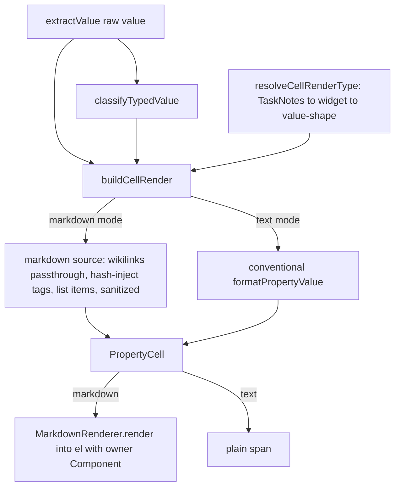
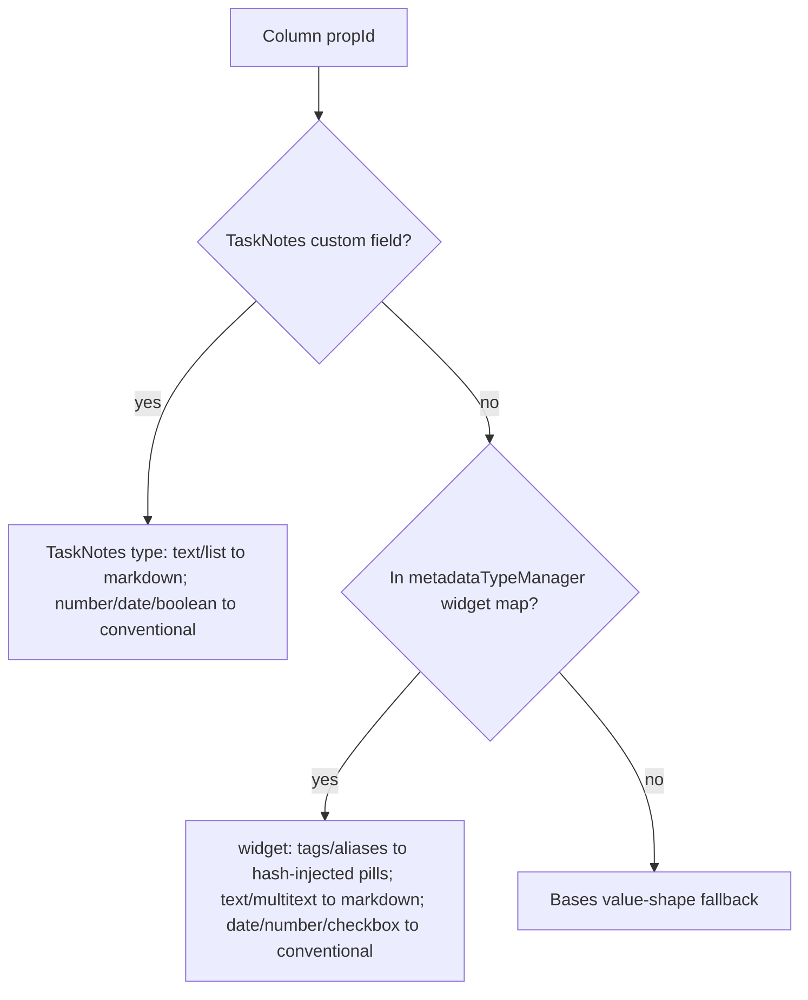

# Grid Markdown Cell Rendering - Plan

## Goal Capsule

- **Objective:** Render Gantt grid property cells as Obsidian markdown — clickable wikilinks, tag pills, emphasis, and bulleted/numbered lists — instead of plain text, with column type resolved from TaskNotes → Obsidian widget map → Bases value shape, and the cell built edit-aware for a later inline-edit increment.
- **Product authority:** Maintainer (Renato).
- **Product Contract preservation:** Product Contract unchanged — R1–R11 and AE1–AE6 carried forward verbatim from the requirements-only artifact.
- **Open blockers:** None block implementation. Several items are execution-time verifications, not blockers (see Open Questions): Svelte-context reach into SVAR-mounted cells, native link/hover wiring, async-render teardown under SVAR virtualization, and multi-value list layout.

---

## Product Contract

### Summary

Property columns in the Gantt grid render their values through Obsidian's own `MarkdownRenderer` rather than as a plain-text span, so wikilinks become clickable internal links, tag values become tag pills, and emphasis and lists render as they do in a note. A column's render type resolves in priority order — TaskNotes custom-field config, then Obsidian's `metadataTypeManager` widget, then the Bases value shape — and the cell is structured so a future inline-edit mode drops in without re-architecting it.

### Problem Frame

Today every property column routes through `src/bases/PropertyCell.svelte`, which formats the value to a string and drops it into a plain ``. A cell holding `[[Sarah]]` shows the literal brackets; an `assignee` list of `[[Justin]], [[Hayden]]` shows raw markup; a `tags` value of `t/note` shows bare text with no pill and no `#`. The grid sits beside notes where these same values render richly, so the raw-text cells read as broken. Nothing in the current pipeline knows a field's semantic type (tags vs text vs date) or delegates rendering to Obsidian — the value is stringified by shape and displayed as-is.

### Key Decisions

- **Delegate rendering to Obsidian's `MarkdownRenderer`.** Rather than hand-roll a wikilink/tag parser, hand a small markdown source string to Obsidian and let it emit native internal links (with hover preview and unresolved-link styling), tag pills, emphasis, and lists. The cost is an async, per-cell render that we watch on large grids; SVAR virtualizes rows, so only visible cells render.
- **Type resolves TaskNotes → Obsidian widget → value shape.** TaskNotes custom-field config wins because the user deliberately defines a field's shape there, and it carries the editing metadata (type + autosuggest). Obsidian's `metadataTypeManager` widget is the fallback and the only source that expresses `tags`. Bases value shape is the final fallback. `metadataTypeManager` is an internal, undocumented Obsidian API read via a cast — accepted because TaskNotes already depends on it.
- **Render now, edit later.** This round is display-only for property columns. The cell is built edit-aware — a seam that can later swap the rendered view for a raw-text editor and write the value back — but inline editing and write-back are a defined follow-up increment, not this scope.
- **Suppress cell-breaking markdown.** Embeds, images, headings, and code blocks are suppressed so a cell can never expand its row height; only wikilinks, tags, emphasis, and lists render.

### Requirements

**Rendering**

- R1. Text-like property cells render their value as Obsidian markdown via `MarkdownRenderer`, replacing the current plain-text span in `src/bases/PropertyCell.svelte`.
- R2. Wikilinks (`[[target]]`, `[[target|alias]]`) render as clickable internal links that open the target note, with Obsidian's native hover preview and unresolved-link styling.
- R3. A multi-value cell (several wikilinks, or a list) renders each value as Obsidian naturally renders it — plain clickable links, no custom pill styling for links.
- R4. Bold/italic emphasis and bulleted/numbered lists render.

**Type resolution**

- R5. Each column's render type resolves in priority order: TaskNotes custom-field config (when TaskNotes is installed and the column maps to a user field by frontmatter key) → Obsidian `metadataTypeManager` widget → Bases value shape.
- R6. Text and list types render as markdown; `date`, `number`, and `boolean` types keep the existing conventional formatting (`formatPropertyValue`), not markdown.

**Tags**

- R7. A column whose resolved type is the Obsidian `tags` (or `aliases`) widget renders each value as a tag pill. Because Obsidian stores tag values without `#`, each value is `#`-prefixed before rendering so `MarkdownRenderer` emits the pill.

**Interaction**

- R8. Rendered tags are clickable and trigger Obsidian's native tag search; rendered wikilinks open and hover-preview natively — interactivity ships in this round, carried by delegating to Obsidian's renderer.

**Edit-aware seam**

- R9. The cell is structured so a future inline-edit mode can swap the rendered view for a raw-text editor and commit the value back, without re-architecting the cell. No write-back in this round.
- R10. When a column maps to a TaskNotes custom field, that field's `type` and `autosuggestFilter` are surfaced by the type-resolution seam for the future editor (editor kind and folder/tag/property-scoped autocomplete). Surfaced now, wired in the follow-up.

**Rendering safety**

- R11. Embeds (`![[...]]`), images, headings, and code blocks are suppressed; only wikilinks, tags, emphasis, and lists render, so a cell cannot expand its row height.

### Acceptance Examples

- AE1. Covers R7. Given a column typed `tags` by the widget map holding `t/note`, When the cell renders, Then it shows a `#t/note` tag pill.
- AE2. Covers R2, R3. Given an `assignee` cell holding `[[Justin]], [[Hayden]]`, When the cell renders, Then two clickable internal links appear, each resolving through `metadataCache.getFirstLinkpathDest`.
- AE3. Covers R5. Given a field configured as a TaskNotes custom field of type `text` that the Obsidian widget map types `tags`, When the cell renders, Then it renders as markdown text (TaskNotes wins), not tag pills.
- AE4. Covers R6. Given a column resolved to `number`, `date`, or `boolean`, When the cell renders, Then it keeps its existing conventional formatting, not markdown.
- AE5. Covers R7. Given a non-tags text field whose value contains a literal `#urgent`, When the cell renders, Then Obsidian renders `#urgent` as a tag pill natively with no injection — and a bracketed link is not treated as a tag.
- AE6. Covers R11. Given a text cell value containing `![[image.png]]` or a `# Heading`, When the cell renders, Then the embed/heading is suppressed and the row height is unchanged.

### Scope Boundaries

**Deferred for later**

- Inline editing and property write-back — the seam is built (R9, R10) but no edit UI or write path ships this round.
- Wiring the TaskNotes-scoped autosuggest editor (folder/tag/property-filtered autocomplete) — surfaced at the seam, wired with the edit follow-up.

**Outside this round**

- The name/title column stays plain (SVAR tree title). Rich rendering applies to property columns only.

### Sources / Research

- `src/bases/PropertyCell.svelte` — current plain-text cell; SVAR-mounts with `{api, row, column, onaction}` only, no `app` handle, reads `row.custom.properties[column.id]`.
- `src/bases/GanttContainer.svelte` — `app` prop stops here (line ~172); `buildSvarColumns` (~1209) attaches `cell = PropertyCell`; `columns` is `$state`, rebuilt fresh on column-config change; `reseedForColumnChange` (~921).
- `src/bases/ganttSync.ts` — row source path on `row.custom.sourceTaskId` (~306); `properties` attached per instance (~321).
- `src/bases/propertyValues.ts` — `TypedValueKind` (`date|number|boolean|text|list|link|empty`), `classifyTypedValue`, `classifyString`, `linkDisplay` (collapses `[[x]]` to display text — raw lost), `WIKILINK_RE`, `buildEntryProperties` keyed by sourcePath.
- `src/bases/propertyFormat.ts` — `formatPropertyValue`, the conventional formatter kept for `date/number/boolean`.
- `src/bases/gridColumns.ts` — `GridColumn` (`id`, `propId`, `isName`); descriptor carries no type info.
- `src/bases/register.ts` — `buildGanttData` (~844-933) assembly seam: `getVisiblePropertyIds`, `buildEntryProperties`, `buildGridColumns`, `this.gridAdapter`, `this.app`, `GanttData`.
- `src/datasource/TaskNotesSource.ts` — plugin detection (`resolveApi`, `TASKNOTES_PLUGIN_ID`, `MIN_TASKNOTES_API_VERSION`); `getFieldConfig` (~628-667) reads `model.config().userFields`+`fieldMapping`, filtered to `type==='date'`; local `TaskNotesUserField`/`TaskNotesModelConfig` (~247-267).
- `src/release/ReleaseNotesView.ts:78-79` — `MarkdownRenderer.render(app, md, el, sourcePath, component)` precedent.
- `../tasknotes/src/bases/basesViewAdapters.ts` — `getObsidianPropertyType(app, name)` cast + `metadataTypeManager.properties[name.toLowerCase()].widget ?? .type`; list-widget set `["multitext","tags","aliases"]`.
- `../tasknotes/src/types/settings.ts:12-19` — `UserMappedField` (`type: text|number|date|boolean|list`, `autosuggestFilter?`).
- `../tasknotes/src/suggest/FileSuggestHelper.ts:22-27` — `FileFilterConfig` (`includeFolders` etc.).

---

## Planning Contract

### Key Technical Decisions

- KTD1. **Render via Obsidian `MarkdownRenderer.render(app, source, el, sourcePath, owner)`.** Mirror `src/release/ReleaseNotesView.ts`. `sourcePath` is the row's note path (`row.custom.sourceTaskId`) so links resolve relative to that note; `owner` is a lifecycle `Component` (see KTD7).
- KTD2. **Type-resolution precedence: TaskNotes user-field config → Obsidian widget → Bases value shape.** TaskNotes has no tags/link type, so tag pills reach only non-TaskNotes fields via the widget map (AE3). The widget accessor reads `.widget ?? .type`, lowercasing the property name, mirroring the TaskNotes adapter.
- KTD3. **Compute per-cell render descriptors at build time; keep the cell dumb.** Because `app` does not reach a SVAR-mounted cell and `.svelte` is outside Jest, all type/markdown logic lives in pure modules assembled in `register.ts` `buildGanttData`. The cell consumes a `CellRender` (`{mode:'text', text}` | `{mode:'markdown', source}`) and only needs `app` for the markdown branch.
- KTD4. **Preserve the raw property value.** The current link `TypedValue` stores display text only (`[[Sarah]]` → `Sarah`), which `MarkdownRenderer` cannot turn back into a link. Carry the raw extracted value alongside the classified `TypedValue` so the markdown-source builder sees `[[Sarah]]`.
- KTD5. **Thread `app` + lifecycle owner to the cell via Svelte context (primary), `row.custom` as the proven fallback.** `setContext` in `GanttContainer`, `getContext` in `PropertyCell`. No context bridge exists today and SVAR mounts the cells, so U6 verifies context reaches the cell before building on it. Fallback carries `app` + the owning `Component` on `row.custom` — the already-proven cell channel that today carries `properties` and `sourceTaskId` (`app` is per-view, identical for every row) — not the SVAR-normalized `api`/`column` objects, which may strip unknown fields. If `app` is unreachable at render time, the cell degrades to the plain-text/formatted value, never emitting raw markdown source (which would reproduce the original bug).
- KTD6. **Suppress cell-breaking markdown at the source, backed by a height clamp.** The markdown-source builder strips embeds (`![[...]]`), images, headings, and fenced/indented code before handing the string to `MarkdownRenderer`. Raw HTML and other tall block grammar (tables, blockquotes) the string denylist can't reliably catch are neutralized by the KTD8 height clamp instead — the clamp, not the denylist, is R11's guarantee. Pre-sanitizing a string is simpler and more testable than post-walking rendered DOM; the clamp is the DOM-level backstop.
- KTD7. **Per-cell `Component` lifecycle, cleaned up on Svelte teardown.** Each markdown render owns a `Component` created in the cell's `$effect` and unloaded in its teardown, so SVAR node reuse/virtualization cannot leak render children or leave stale content. `metadataTypeManager` access is guarded (optional-chained cast) and falls through to the value-shape branch when absent.
- KTD8. **Markdown cell layout contract.** The markdown container is clamped to the grid's fixed row height and column width by CSS (`max-height` + `overflow: hidden`, single-line flow with ellipsis for horizontal overflow), preserving the current cell's truncation and full-value hover affordance (`title`/`aria-label`) for clipped multi-value cells. This is what lets R4 (lists) and R3 (multi-value cells) coexist with R11's fixed-height guarantee: allowed block content renders but is visually clamped rather than growing the row. During async render the cell shows the plain-text/formatted value as a placeholder that `MarkdownRenderer` replaces on completion, so virtualized fast-scroll shows no empty flash.

### High-Level Technical Design

The value pipeline, from Bases extraction to a rendered cell:

Type resolution precedence (R5):

### Assumptions

- SVAR row virtualization keeps async per-cell rendering affordable (only visible cells render); confirmed previously by the perf harness.
- TaskNotes absence is a supported state — the resolver skips the TaskNotes branch cleanly and the existing `TaskNotesSource` gating returns `null` without throwing.
- `MarkdownRenderer` with a valid `sourcePath` + owning `Component` yields Obsidian's native internal-link and tag handlers (click/hover) without manual event wiring — verified in U6, fallback registers handlers on `a.internal-link` / `a.tag`.

### Sequencing

U1, U2 (independent, parallel); then U3 and U4 in parallel (U4 is pure and consumes U3's type only at the call site, so it needs no code from U3) → U5 (build descriptors) → U6 (cell rendering + context) → U7 (e2e). U1–U4 are pure and Jest-first; U6 is the only Svelte/Obsidian-runtime unit; U7 is the real-Obsidian gate.

---

## Implementation Units

### U1. Widen the TaskNotes user-field type seam

- **Goal:** Expose all TaskNotes user fields (not just `date`) keyed by frontmatter key, carrying `type` and `autosuggestFilter`, so the resolver and the future editor can consume them.
- **Requirements:** R5, R10.
- **Dependencies:** none.
- **Files:** `src/datasource/TaskNotesSource.ts`, `test/unit/TaskNotesSource.test.ts`.
- **Approach:** Add a method (e.g. `getUserFieldTypes()`) that reads `model.config().userFields` and returns a map `frontmatterKey → { type, autosuggestFilter? }` for every enabled field, without the `type === 'date'` filter used by `getFieldConfig`. Widen local `TaskNotesUserField.type` to the `text|number|date|boolean|list` union and add optional `autosuggestFilter`. Leave `getFieldConfig` (date-only) untouched — it feeds a different consumer. Keep the existing gating/null-on-throw contract.
- **Patterns to follow:** `getFieldConfig` (~628-667) and its `makeConfigApi`/`fieldConfigFrom` test helpers in `test/unit/TaskNotesSource.test.ts` (~357-459).
- **Test scenarios:**
  - Happy: config with mixed-type user fields returns every enabled field keyed by `key`, each with its `type`.
  - A field carrying `autosuggestFilter` surfaces that filter verbatim.
  - `enabled === false` (legacy shape) is excluded; a field missing `key` is dropped.
  - Absent `model.config`, or `config()` throwing, returns an empty map (not a throw).
- **Verification:** New `getUserFieldTypes` unit tests green; existing `getFieldConfig` tests unaffected.

### U2. Obsidian widget-type accessor

- **Goal:** Read a property's Obsidian widget type via the internal `metadataTypeManager`, guarded against absence.
- **Requirements:** R5, R7.
- **Dependencies:** none.
- **Files:** `src/bases/obsidianPropertyType.ts`, `test/unit/obsidianPropertyType.test.ts`.
- **Approach:** `getObsidianPropertyWidget(app, propertyName): string | null` — cast `app as unknown as { metadataTypeManager?: { properties?: Record<string,{type?:string;widget?:string}> } }`, read `properties[propertyName.toLowerCase()]`, return `widget ?? type` when a string, else `null`. Mirror the TaskNotes adapter shape exactly.
- **Patterns to follow:** `../tasknotes/src/bases/basesViewAdapters.ts` `getObsidianPropertyType`; the `as unknown as App` fakes in `test/unit/BasesSource.test.ts` (~66-79).
- **Test scenarios:**
  - Happy: a property present in the map returns its widget (`tags`, `multitext`, `aliases`, `text`, `datetime`).
  - Name lookup is case-insensitive (property registered lowercase).
  - `metadataTypeManager` absent, `properties` absent, or entry absent → `null`.
  - Non-string widget/type → `null`.
- **Verification:** Unit tests green with a faked `app`.

### U3. Cell render-type resolver

- **Goal:** Resolve a column's render directive from the three sources in priority order.
- **Requirements:** R5, R6, R7, R10.
- **Dependencies:** U1, U2.
- **Files:** `src/bases/cellRenderType.ts`, `test/unit/cellRenderType.test.ts`.
- **Approach:** Pure function `resolveCellRenderType(propId, deps): CellRenderType` where `deps` injects `taskNotesFieldType(key)` (from U1), `obsidianWidget(name)` (from U2), and the classified `TypedValue.kind`. Strip the `note.`/`file.` prefix from `propId` to get the property name/key. Precedence: TaskNotes type (map `text|list` → markdown, `number|date|boolean` → conventional) → widget (`tags|aliases` → markdown+tags, `multitext|text` → markdown, `date|datetime|number|checkbox` → conventional) → value-shape (`text|list|link` → markdown, `date|number|boolean|empty` → conventional). Return `{ display: 'markdown' | 'conventional', tags: boolean, fieldMeta?: { type, autosuggestFilter } }` — `fieldMeta` carried for R10 (editor follow-up), unused this round.
- **Patterns to follow:** injected-collaborator DI in `test/unit/gridColumns.test.ts` and `test/unit/propertyValues.test.ts`.
- **Test scenarios:**
  - Covers AE3. TaskNotes `text` field + widget says `tags` → `{display:'markdown', tags:false}` (TaskNotes wins).
  - Widget `tags` on a non-TaskNotes field → `{display:'markdown', tags:true}`.
  - Widget `datetime`/`number`/`checkbox` → `{display:'conventional'}`.
  - No TaskNotes, no widget entry, value kind `link` → `{display:'markdown'}`; kind `date` → `{display:'conventional'}`.
  - `note.assignee` and `assignee` both resolve the same (prefix stripped, lowercased).
  - TaskNotes field carries `fieldMeta.autosuggestFilter` through.
- **Verification:** Unit tests green covering all three precedence tiers.

### U4. Markdown source builder + sanitizer

- **Goal:** Turn a raw property value + render type into the markdown source string handed to `MarkdownRenderer`, suppressing cell-breaking constructs.
- **Requirements:** R2, R3, R4, R7, R11.
- **Dependencies:** none (pure; consumes U3's type at the call site).
- **Files:** `src/bases/cellMarkdownSource.ts`, `test/unit/cellMarkdownSource.test.ts`.
- **Approach:** `buildCellMarkdownSource(rawValue, renderType): string`. Pass `[[wikilinks]]` and emphasis through unchanged. For `tags` render type, `#`-prefix each token that is not already `#`-prefixed and not bracketed (AE1); leave literal `#tags` in free text alone (AE5). Render an array value as either space-separated inline tokens (links/tags) or a bulleted list depending on natural Obsidian output — default to inline for links/tags, list items for list-typed multiline content; final shape confirmed in U7. Sanitize: strip image/embed syntax (`![[...]]`, ``), leading heading markers, and fenced/indented code fences before returning (AE6).
- **Patterns to follow:** `WIKILINK_RE` and `linkDisplay` parsing in `src/bases/propertyValues.ts`; pure-function tests in `test/unit/propertyFormat.test.ts`.
- **Test scenarios:**
  - Covers AE1. tags render type, value `t/note` → `#t/note`; value `#t/done` (already prefixed) stays `#t/done`.
  - Covers AE2. link value `[[Justin]]` passes through unchanged; list `["[[Justin]]","[[Hayden]]"]` produces both links.
  - Emphasis `**bold**` / `*italic*` passes through; a bulleted list value renders list items (R4).
  - Covers AE6. `![[image.png]]`, ``, `# Heading`, and a fenced code block are each stripped from the output.
  - Covers AE5. free-text `see #urgent` keeps `#urgent`; a bracketed `[[#urgent]]` is not turned into a tag.
- **Verification:** Unit tests green; sanitizer proven to drop every suppressed construct.

### U5. Build per-cell render descriptors in the value pipeline

- **Goal:** Assemble a `CellRender` per visible cell, preserving raw values, so the cell receives a ready-to-render descriptor.
- **Requirements:** R1, R5, R6.
- **Dependencies:** U3, U4.
- **Files:** `src/bases/cellRender.ts`, `src/bases/propertyValues.ts`, `src/bases/register.ts`, `src/bases/ganttSync.ts`, `test/unit/cellRender.test.ts`.
- **Approach:** Define `CellRender = { mode: 'text'; text: string } | { mode: 'markdown'; source: string }` in `src/bases/cellRender.ts` with a pure `buildCellRender(rawValue, typedValue, renderType)` that returns markdown mode (via U4) for `display:'markdown'` and text mode (via `formatPropertyValue`) otherwise. Preserve the raw value: extend `buildEntryProperties` to retain the raw extracted value alongside the `TypedValue` (KTD4), or compute the descriptor inside the properties build. In `register.ts` `buildGanttData`, construct the resolver deps (`this.app` for U2, the TaskNotes source for U1) and produce a `Map<sourcePath, Record<propId, CellRender>>` flowing into `GanttData` alongside/replacing the current `propertyValues`. Carry the `CellRender` on the SVAR task `custom` bag in `ganttSync.ts` `buildSvarTasks` and fold its `source`/`text` into the diff-sync fingerprint (`taskStateKey`/`propertiesKey`) — today that fingerprint folds `formatPropertyValue(properties[k])`, so a wikilink/tag whose target changes via an external edit would not re-issue `update-task` and the rendered cell would go stale. Keep `sourceTaskId` on the row for `sourcePath`.
- **Patterns to follow:** `buildEntryProperties` (~179-198) and the `buildGanttData` assembly (~844-933); the `custom` bag + `taskStateKey`/`propertiesKey` fingerprint in `src/bases/ganttSync.ts`; `PropertyExtractor` DI in `test/unit/propertyValues.test.ts`.
- **Test scenarios:**
  - Covers AE4. A `date`/`number`/`boolean`-resolved value → `{mode:'text', text}` matching `formatPropertyValue`.
  - A link/tags/text-resolved value → `{mode:'markdown', source}` with the raw preserved (`[[Sarah]]` present in `source`, not `Sarah`).
  - Empty value → text mode empty string (no markdown render).
  - Map is keyed by sourcePath; out-of-result companion rows still get descriptors.
  - The diff-sync fingerprint changes when a cell's rendered content changes, so an external field edit re-renders the cell.
- **Verification:** Unit tests green; `buildGanttData` produces descriptors without breaking existing `propertyValues` tests; the fingerprint reflects descriptor content.

### U6. Render markdown in PropertyCell and thread `app`

- **Goal:** Make the cell render markdown descriptors via `MarkdownRenderer`, and give SVAR-mounted cells access to `app` + a lifecycle owner.
- **Requirements:** R1, R2, R3, R4, R8, R9, R11.
- **Dependencies:** U5.
- **Files:** `src/bases/PropertyCell.svelte`, `src/bases/GanttContainer.svelte`, `src/bases/register.ts`.
- **Approach:** Provide `app` and the owning view `Component` to cells via Svelte `setContext` in `GanttContainer` / `getContext` in `PropertyCell` (KTD5), with `register.ts` supplying the BasesView instance as the owning `Component`. Verify context reaches the SVAR-mounted cell first; if it does not, fall back to carrying `app` + owner on `row.custom` (the proven channel, per KTD5) rather than the SVAR-normalized `api`/`column`. In `PropertyCell`, read the `CellRender` from `row.custom`: for `mode:'text'` keep the current `` (with its `title` hover + ellipsis); for `mode:'markdown'`, render into a bound element in an `$effect` via `MarkdownRenderer.render(app, source, el, row.custom.sourceTaskId, owner)`, creating a per-render `Component` owner and unloading it in the effect teardown (KTD7). Apply the KTD8 layout clamp to the markdown container (max-height/overflow, single-line ellipsis, `title` full-value hover) so lists/multi-value content cannot grow the row. Show the plain-text value as a placeholder until the async render resolves. If `app` is unreachable, degrade to the plain-text value — never emit raw `source`. Structure the render/edit split so a later edit mode can replace the rendered view (R9) — keep the descriptor-driven branch isolated. Verify native link-open/tag-search and hover; register handlers on `a.internal-link`/`a.tag` only if not native (R8).
- **Execution note:** Verify Svelte-context reach and native click/hover behavior early with a throwaway check before building the full render path — both are load-bearing assumptions.
- **Patterns to follow:** `MarkdownRenderer.render` call in `src/release/ReleaseNotesView.ts:78-79`; the current cell's `title` + `overflow/ellipsis` styling in `src/bases/PropertyCell.svelte`; `app` prop wiring and `$state`/`$effect` idioms in `src/bases/GanttContainer.svelte`.
- **Test scenarios:** Test expectation: none at unit level — `.svelte` is excluded from Jest; behavior is covered by U7 e2e. Pure descriptor logic is already covered in U5.
- **Verification:** In a real vault the grid shows clickable wikilinks and tag pills; date/number cells unchanged; a multi-value/list cell stays clamped to the row height with the full value on hover; no empty-flash on virtualized fast-scroll; no console errors on scroll/virtualization.

### U7. e2e: markdown cell rendering in a real Obsidian grid

- **Goal:** Prove the rendered grid produces real internal links and tag pills, in real Obsidian.
- **Requirements:** R1, R2, R7, R8, R11.
- **Dependencies:** U6.
- **Files:** `test/specs/gantt-markdown-cells.e2e.ts`, and a fixture note under `test/vaults/gantt-companion/` with an `assignee` wikilink list and a `tags` value if not already present.
- **Approach:** Follow `test/specs/gantt-column-sort.e2e.ts`: hermetic temp-vault copy, enable `bases`, `reloadObsidian` with both plugins, `ensureGanttReady` gated on the target property column header. Assert within `.og-grid-cell`: an `a.internal-link` (or `a`) with the expected link text for the assignee cell, and an `a.tag` pill for the tags cell. Read DOM into a plain object then `expect`, per the `readSortState` pattern.
- **Test scenarios:**
  - Covers AE2. assignee cell renders clickable internal link(s) for `[[Justin]]`/`[[Hayden]]`.
  - Covers AE1. tags cell renders a `#`-prefixed tag pill for a `tags` value stored without `#`.
  - Covers AE6. a value containing an embed/heading/raw-HTML `` does not increase the row height / does not render the embed.
  - A multi-value list cell (several wikilinks) stays clamped to the row height and exposes the full value on hover (KTD8).
- **Verification:** `npm run e2e:local` passes the new spec alongside the existing suite (CI parity).

---

## Verification Contract

| Gate | Command | Applies to | Done signal |
|---|---|---|---|
| Unit | `npm test` | U1–U5 | New suites green; existing bases/datasource suites unaffected |
| Types | `npm run typecheck` | all | `svelte-check` clean (no `any`, strict) |
| e2e | `npm run e2e:local` | U6, U7 | New `gantt-markdown-cells` spec green; full suite CI-parity |

- Feature-bearing pure units (U1–U5) are test-first: write the failing Jest spec, then implement.
- U6/U7 are verified against real Obsidian — the e2e gate is first-class here since rendering is only observable at runtime.

---

## Definition of Done

- R1–R8 and R11 are implemented and observably true in a real vault; R9–R10 are satisfied as seams (edit-aware structure + TaskNotes `type`/`autosuggestFilter` surfaced), with write-back explicitly deferred.
- AE1–AE6 are each covered by a named unit or e2e scenario.
- `npm test`, `npm run typecheck`, and `npm run e2e:local` all pass.
- Date/number/boolean columns keep their prior formatting (no regression).
- `metadataTypeManager` and TaskNotes access are guarded so a missing internal API or absent TaskNotes degrades to the value-shape branch without throwing.
- Product Contract unchanged; deferred items remain in Scope Boundaries.

---

## Open Questions

**Deferred to Planning — resolved:** type source (TaskNotes → widget → value shape), tag detection (widget `tags`/`aliases`), suppression mechanism (source-level sanitization), descriptor-at-build-time architecture.

**Deferred to Implementation (execution-time verification):**

- Does Svelte `setContext` in `GanttContainer` reach a SVAR-mounted `PropertyCell`? If not, use the per-view accessor fallback (U6, KTD5).
- Do `MarkdownRenderer` outputs get Obsidian's native internal-link and tag click/hover handlers via `sourcePath` + `owner`, or is manual registration on `a.internal-link` / `a.tag` needed (U6, R8)?
- Multi-value list layout: inline links vs bulleted list — pick to match Obsidian's natural rendering, confirmed in U4/U7.
- Exact per-cell `Component` teardown under SVAR node reuse to avoid leaks/stale renders (U6, KTD7).
- TaskNotes `list` field double-registered with the Obsidian `tags` widget: TaskNotes-first precedence (KTD2) resolves it to markdown-list, so its values render as bare text rather than pills. Decide whether a TaskNotes `list` field should still consult the widget map for `tags`/`aliases` to preserve pill rendering — a refinement to KTD2/AE3, deferred rather than applied so it does not silently override the maintainer's TaskNotes-first decision.
- Render type is read from `metadataTypeManager` at build time; changing a property's widget (e.g. text→tags) does not fire `reseedForColumnChange`, so a cell keeps its stale render mode until the next Gantt rebuild. Confirm whether this needs an explicit refresh trigger or is acceptable.
