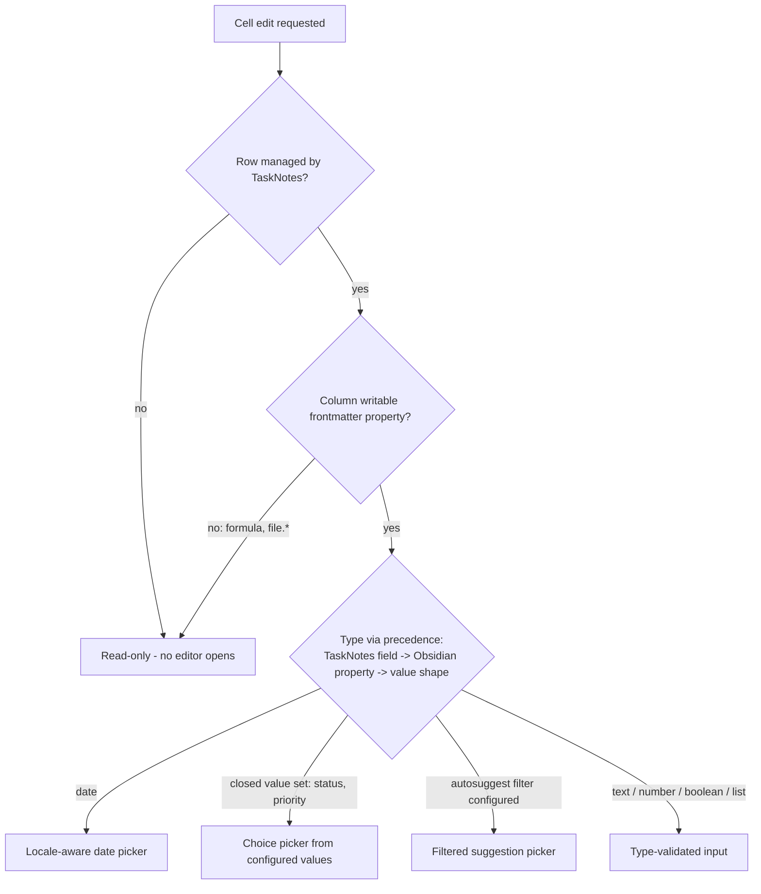

# Gantt Grid Locale Dates and Inline Cell Editing - Plan

## Goal Capsule

- **Objective:** Dates in gantt grid columns render in the user's locale format, and every grid column on a TaskNotes-managed row is editable directly in the grid — type-aware editors, locale-aware date input, restricted-choice pickers where TaskNotes constrains values — with edits synchronised back to TaskNotes. Definition of done: all columns added to the gantt grid can be edited in place and persist through TaskNotes, respecting property types and user locale; non-TaskNotes rows stay read-only.
- **Authority:** This plan > repo conventions (AGENTS.md, docs/conventions/) > implementer judgment. The maintainer delegated in-flight decisions not fixed here (editor styling, exact feedback wording, minor interaction details) to the implementing agent, guided by project precedent.
- **Execution profile:** Test-first (red→green→refactor). New logic lands in small pure modules with Jest coverage; the SVAR/Obsidian glue stays thin. WDIO e2e against real Obsidian is a first-class gate — run the new spec, never defer it. Branch first; open a PR and stop for maintainer review.
- **Stop conditions (surface, don't guess):** the TaskNotes suggestion surface (`FileSuggestHelper`) turns out unreachable from the installed plugin at runtime in a way R9's fallback can't absorb; the bundled SVAR editor API materially differs from the documented `column.editor` contract; any change that would alter the Product Contract's scope.

---

## Product Contract

### Summary

Locale-aware date display plus inline, type-aware cell editing for the gantt grid. Editor selection reuses the type-resolution precedence shipped with markdown cell rendering (TaskNotes field type, then Obsidian property type, then value shape). Edits write to the underlying note and round-trip through TaskNotes sync; rows and columns without a writable backing remain read-only.

### Problem Frame

Grid date cells render a hardcoded `YYYY-MM-DD` regardless of the user's locale, so users outside ISO-date habits read every date in a foreign format. Changing any property from the grid requires leaving it — opening the TaskNotes edit modal or the note itself — which breaks flow for the scan-and-adjust work a grid invites. The markdown cell-rendering work resolved each column's type and surfaced TaskNotes field metadata precisely so an editor could follow; the display half exists, the editing half does not.

### Key Decisions

- **One type system for display and editing.** Editor selection follows the same precedence already used for cell rendering: TaskNotes field type first, then Obsidian `metadataTypeManager` property type, then value shape. No parallel type-resolution path.
- **Editability is row-level, then column-level.** TaskNotes-managed rows are editable; rows from other notes are fully read-only. On an editable row, any column backed by a writable frontmatter property is editable — not only TaskNotes-known fields.
- **Locale comes from the system's regional settings, not a setting and not Obsidian's UI language.** Date format is a regional preference; Obsidian's language setting is a translation choice. No new plugin setting; frontmatter storage format is untouched.
- **SVAR-native editors first.** SVAR grid columns support inline editors natively (`text`, `combo`, `datepicker`, `richselect`, `multiselect`); per the project's SVAR-first rule, use them, adding custom editor config only for shapes SVAR does not ship.
- **Fields with constrained value sets edit through restricted choice, not free text.** TaskNotes-configured statuses/priorities and autosuggest-filtered fields offer only their allowed or suggested values.
- **Autosuggest is an enhancement, not a dependency.** Fields with a TaskNotes autosuggest filter get filtered suggestions when the TaskNotes suggestion API is reachable at edit time; otherwise they degrade to validated free-text editing and the feature still ships.
- **Editable cells carry a minimal discoverability affordance.** Some visual cue (e.g. cursor/hover treatment) distinguishes writable cells from read-only ones, driven by the same per-cell editability data; the exact visual treatment stays with the delegated styling judgment. Without it, silent no-op interactions on locked cells read as the feature being broken.



### Requirements

**Locale-aware date display**

- R1. Date values in grid columns render in the user's locale date format, replacing the hardcoded `YYYY-MM-DD` display.
- R2. Locale affects display and input only; persisted frontmatter values keep TaskNotes' canonical format.

**Inline editing**

- R3. On a TaskNotes-managed row, every grid column backed by a writable frontmatter property is editable directly in the grid — parent rows included.
- R4. Date fields edit through a date picker that displays and accepts locale-formatted dates.
- R5. Non-date fields edit through a type-appropriate input (text, number, boolean, list) whose validation blocks type-invalid values from persisting.
- R6. A rejected edit persists nothing, visibly signals rejection, and the cell returns to its prior value. Rejection includes cross-field violations (an edit that would put a task's start after its end).

**Type resolution**

- R7. Editor selection resolves each column's type with the same precedence as cell rendering: TaskNotes field type, then Obsidian property type, then value shape.

**Restricted-choice editing**

- R8. Fields carrying a TaskNotes autosuggest filter (custom fields, mapped fields such as projects) offer suggestions restricted to that filter, sourced from TaskNotes' suggestion API.
- R9. When the suggestion API is unreachable at edit time, those fields degrade to validated free-text editing.
- R13. Fields whose values TaskNotes constrains to a configured set (status, priority) edit through a closed-choice picker offering only the configured values.

**Persistence and sync**

- R10. A committed edit persists to the underlying note and the grid shows the persisted value after TaskNotes sync, without stale or flickering intermediate values.

**Read-only rules**

- R11. Rows not managed by TaskNotes are read-only; no edit affordance opens on them.
- R12. Columns without a writable frontmatter backing (Bases formulas, `file.*` computed values) are read-only on every row.

### Acceptance Examples

- AE1. **Covers R1.** Given a German-locale system and a task due `2026-07-11`, the due column shows `11.07.2026`.
- AE2. **Covers R2, R4, R10.** Given a TaskNotes row, when the user picks a new due date from the locale-formatted picker, the note's frontmatter holds the canonical date format and the cell shows the locale-formatted new value after sync.
- AE3. **Covers R11.** Given a row from a non-TaskNotes note, when the user triggers editing on any cell, no editor opens.
- AE4. **Covers R12.** Given a formula column on a TaskNotes row, when the user triggers editing, no editor opens.
- AE5. **Covers R8.** Given a projects field whose autosuggest filter restricts to a tag, when the user edits that cell, suggestions contain only notes matching the filter.
- AE6. **Covers R5, R6.** Given a number-typed field, when the user enters non-numeric text and commits, the value is rejected with visible feedback and the cell reverts.
- AE7. **Covers R6.** Given a task with start `2026-07-10` and due `2026-07-20`, when the user edits start to `2026-07-25`, the edit is rejected with visible feedback and nothing is written.

### Scope Boundaries

- The TaskNotes edit modal and context menus are unchanged — inline editing is added alongside them, not instead of them.
- No change to how values are stored: locale never leaks into frontmatter.
- Timeline-scale date labels (SVAR zoom scales) are out of scope; this work covers grid column cells.
- Column sorting persistence (the other half of the parked backlog entry) stays parked.
- No refactor of `src/bases/GanttContainer.svelte` — new logic lands in new pure modules; the component gains only thin wiring.

**Deferred to Follow-Up Work**

- Inline editing of the name column — the title is writable, but SVAR's cell-edit bridge cannot distinguish a name edit by key (every task copy carries `text`), so title edits stay with the TaskNotes modal in v1; the name column resolves no editor descriptor.
- Rich list editing (chip/tag editor for plain list fields) — v1 edits plain lists as comma-separated text; autosuggest-filtered lists already get pickers.
- Localizing SVAR timeline scale labels via the same locale source.

### Dependencies / Assumptions

- TaskNotes exposes `FileSuggestHelper.suggest(plugin, query, limit, filterConfig)` with `FileFilterConfig` scoping, and its custom-field metadata carries `autosuggestFilter` — verified in the TaskNotes source (`../tasknotes`, `src/suggest/FileSuggestHelper.ts`). Reachability from the installed plugin instance is verified at implementation time against the shipped `main.js` (see the wrong-API-path learning in Sources); R9 is the fallback.
- The bundled SVAR gantt (2.7.0) supports per-column inline editors (`column.editor`: `text` | `combo` | `datepicker` | `richselect` | `multiselect` | custom config) — verified in `node_modules/@svar-ui` typings and source.
- TaskNotes' status and priority catalogs are already consumed by the plugin (`catalog.statuses()` / `catalog.priorities()` via `src/datasource/TaskNotesSource.ts` color readers) and can back the R13 pickers.

---

## Planning Contract

*Product Contract preservation: changed per confirmed scoping synthesis — added R13 and AE7; R3 now names parent rows in scope (research confirmed parents render as ordinary tasks, not SVAR summaries, so no summary exception exists); R6 gained the cross-field clause; the three former Outstanding Questions (write channel, edit trigger, list editor shape) are resolved in KTD2, KTD6, and KTD8 below; locale Key Decision sharpened to system regional settings. Document review added the discoverability-affordance Key Decision and moved the name column to Deferred (SVAR's bridge cannot attribute a name edit by key).*

### Key Technical Decisions

- KTD1. **Classify cell-edit gestures in the existing `update-task` intercept before any editor ships.** SVAR's embedded grid bridges its `update-cell` event into a gantt `update-task` action carrying a full shallow task copy plus one flat key set to the edited column's value (`node_modules/@svar-ui/svelte-gantt/src/components/grid/Grid.svelte`). Because that copy always carries `start`/`end`, the current gesture heuristics in `src/bases/cascadeGate.ts` would misroute a cell edit into `persistReschedule` — issuing a wrong date write and silently dropping the edited value. A third gesture class ("cell edit") is the foundation everything else depends on. Detection is by **value-diff, not key presence**: the edited column is the configured non-name column id whose flat value differs from the row's stored `custom.properties` value — committed flat keys persist on the SVAR task copy across edits, so after the first edit a copy carries multiple flat column keys and key presence alone cannot identify the edited one. Zero diffs classifies as a no-op cell edit. One caveat the validator must absorb: SVAR's bridge coerces numeric-looking strings before emitting (`"2026"` arrives as number 2026), so compare and cast per the column's resolved type, and record leading-zero loss as a known v1 limitation.
- KTD2. **Writes extend the existing patch layer; no new write channel.** Add a generic resolved field-write member to `TaskPatch` following the established `progressWrite`/`estimateWrite` pattern: the controller resolves the write target (mapped fields via `FieldMappings`, everything else by frontmatter key), `buildTaskUpdates` applies it, and `TaskNotesSource.mutate` calls `api.tasks.update` as today. Custom fields write as **top-level keys keyed by frontmatter `key`** — never nested under `userFields` — per the documented write-path learning. Clearing commits `null` (removes the value), mirroring the existing date-clear precedent; empty list commits `[]`.
- KTD3. **Per-row editability is a new per-instance signal; the controller gates defensively.** No row-level write gate exists today — `capabilities.write` is view-global and `CompositeSource` would delegate a write for any Base-matched path to `api.tasks.update`, risking TaskNotes frontmatter grafted onto a plain note. A row is editable iff TaskNotes enrichment resolved task info for its path; the flag threads through `buildSvarTasks` onto `row.custom` (like `properties`/`cellRenders`), and `GanttController.mutate` independently refuses field writes for paths without task info. Editors are only attached where row and column are both writable; SVAR's global `readonly` prop is untouched.
- KTD4. **Column writability extends `resolveCellRenderType`, not a parallel resolver.** A new pure module maps the existing `CellRenderType` (plus column id prefix) to an editor descriptor: `date → datepicker`, `boolean/number/text → validated input`, `status/priority → richselect from catalogs`, `autosuggestFilter present → suggestion picker`, `formula.*/file.*/name column → none`. One precedence chain serves display and editing (R7). Two SVAR wiring facts are load-bearing: (a) `column.editor` accepts SVAR's `TEditorHandler` — a `(row, column) => descriptor | null` function the store honors natively at every editor-open path, which is how per-row read-only is enforced for double-click and keyboard triggers alike; (b) SVAR seeds the open editor's value from the flat row key, so every editor-attached column must also carry a `column.getter` reading the raw `custom.properties` value — without it editors open blank and the datepicker defaults to today.
- KTD5. **Locale is snapshotted per data-assembly pass from the system's regional settings.** The snapshot source is `Intl.DateTimeFormat().resolvedOptions().locale`, read once per `GanttData` build (not lazily inside the formatter) so a mid-session locale change cannot leave half-stale cells, with an injectable override for tests and e2e (a `window.__tnGanttDebug`-style hook). Caveat to verify in the dev vault: Electron's resolved locale may track Obsidian's UI language rather than the OS regional format — if it does, surface to the maintainer under the stop conditions before proceeding. Display formats via `Intl.DateTimeFormat`; the SVAR datepicker localizes via SVAR's `<Locale>` wrapper with a custom `formats.dateFormat` derived from the same snapshot — SVAR's nine bundled locale packs cannot represent arbitrary regional formats. No fingerprint hazard: `entrySignature` reads raw frontmatter, and `taskStateKey` compares both sides through the same live formatter.
- KTD6. **Date cell edits are single-edge writes with bar-resize semantics.** Editing a start or due cell adjusts that one date — no subtree cascade (cascades belong to bar *moves*). Cross-field validation rejects start > end before any write (R6/AE7). Parent rows edit like any other row; they are ordinary SVAR tasks, not summaries.
- KTD7. **Commit and failure UX follows the drag-persist house pattern.** Client-side validation rejects before any write. Accepted edits apply optimistically, await the mutation with the existing timeout, and on failure revert via an echo-tagged exec plus an Obsidian `Notice` — the same shape as `persistReschedule`/`persistProgress`. While a row's mutation is pending, suppress opening another editor on that row (mirroring the `syncing` idiom) so a failed write's revert cannot stomp a second in-flight edit. Every new interceptor is gated by the `syncing` flag and `OG_ECHO_SOURCE` echo classification from day one. Edit trigger: SVAR's native grid editor trigger (double-click on the cell). **Grid double-click is currently spoken for**: SVAR's grid fires `show-editor` on double-clicks for editor-less columns, and the existing intercept routes that to the configured TaskNotes activation — so today every grid double-click runs that action. The decided behavior: inline editors take precedence on editable cells; the TaskNotes activation remains for chart bars and for grid cells with no editor descriptor. Both behaviors are pinned by tests, and the change is called out in the PR/demo media.
- KTD8. **Suggestion pickers are a custom inline editor; stock richselect only where options are synchronous.** SVAR resolves editor config synchronously at open and snapshots `config.options`, and its stock combo only client-filters that static snapshot — an async `FileSuggestHelper.suggest` call can never feed it. Autosuggest fields therefore use a custom suggest editor registered via `registerInlineEditor` (exported from `@svar-ui/svelte-grid`) that awaits the adapter per keystroke and renders its own loading, no-matches, and degraded-to-free-text states — the degraded state visibly signaled, not a silent editor swap. Reachability is checked per edit, not cached at mount. Status/priority use the stock richselect (catalogs are synchronous). Autosuggest-filtered list fields (e.g. projects) commit picked values as list entries; plain list fields edit as comma-separated text parsed to a list on commit.

### High-Level Technical Design

The commit pipeline reuses the existing write path end to end; only the classification step and the field-write resolution are new:

```mermaid
sequenceDiagram
  participant Ed as SVAR cell editor
  participant Grid as SVAR grid (bundled)
  participant GC as GanttContainer intercept
  participant Ctl as GanttController
  participant Src as TaskNotesSource
  participant TN as TaskNotes API
  Ed->>Grid: commit value (update-cell)
  Grid->>GC: update-task (task copy + flat edited key)
  GC->>GC: classify gesture: cell edit (new) / reschedule / progress
  GC->>GC: validate (type, cross-field); reject -> revert + Notice
  GC->>Ctl: onMutate(instanceId, field-write patch)
  Ctl->>Ctl: per-row gate; resolve write target (mapping or frontmatter key)
  Ctl->>Src: mutate(path, patch, context with correlationId)
  Src->>TN: tasks.update(path, updates)
  TN-->>GC: change event (echo-suppressed via correlationId)
```

Editor attachment is declarative: `buildSvarColumns` asks the editability module for each column's editor descriptor and attaches `column.editor` as SVAR's `TEditorHandler` — a `(row, column)` function returning the descriptor for editable rows and `null` otherwise, which the store honors natively at every editor-open path (double-click and keyboard alike). Each editor-attached column also carries a `column.getter` into `custom.properties` so the editor opens seeded with the current raw value.

---

## Implementation Units

### U1. Cell-edit gesture classification

- **Goal:** The `update-task` intercept recognizes an inline cell edit as its own gesture and extracts the edited column id and value, so cell edits stop misrouting into the reschedule path.
- **Requirements:** Foundation for R3, R10 (KTD1).
- **Dependencies:** None. Must land before any editor is attached.
- **Files:** `src/bases/cascadeGate.ts`, `src/bases/GanttContainer.svelte` (thin wiring), `test/unit/cascadeGate.test.ts` (extend; create if absent).
- **Approach:** Extend `classifyUpdateEvent` with a cell-edit class detected by value-diff (KTD1): among the configured non-name grid column ids (passed in from the current column set), the edited column is the one whose flat value on the event's task copy differs from the row's stored `custom.properties` value; zero diffs is a no-op cell edit. Comparison is type-aware (the bridge may have coerced a numeric-looking string). Echo (`OG_ECHO_SOURCE`) and `syncing`-window events keep their existing classification precedence.
- **Execution note:** Test-first; this is a pure-function change with deterministic inputs.
- **Test scenarios:**
  - Task copy with one flat key differing from stored properties classifies as cell edit, and the extracted column/value are correct.
  - The same event shape with `start`/`end` present still classifies as cell edit, not reschedule (the misroute this unit exists to prevent).
  - A task copy carrying TWO flat column keys (a stale key from a prior committed edit plus the freshly edited one) extracts only the column whose value differs.
  - Re-committing the same value (zero diffs) classifies as a no-op cell edit, not a write.
  - A bridge-coerced value (`"2026"` arriving as number 2026 in a text column) still diffs correctly against the stored string.
  - Existing reschedule and progress gestures classify unchanged (regression pin).
  - Echo-tagged and syncing-window events are ignored regardless of shape.
  - A flat key not in the configured column set does not classify as cell edit.
- **Verification:** Unit suite green; existing drag e2e specs unaffected.

### U2. Generic field-write path with defensive row gate

- **Goal:** The patch layer can persist a value to any writable property on a TaskNotes-managed row, and refuses writes to rows TaskNotes does not manage.
- **Requirements:** R10, R11 (write half), KTD2, KTD3.
- **Dependencies:** None (parallel to U1).
- **Files:** `src/datasource/types.ts`, `src/controller/GanttController.ts`, `src/datasource/TaskNotesSource.ts`, `src/datasource/CompositeSource.ts`, `test/unit/GanttController.write.test.ts`, `test/unit/TaskNotesSource.test.ts`.
- **Approach:** Add a resolved field-write member to `TaskPatch` (pattern: `progressWrite`/`estimateWrite`). `toTargetedPatch` resolves mapped fields through `FieldMappings` (never a hardcoded property table) and all other properties by frontmatter key. `buildTaskUpdates` writes custom fields as top-level keys; `null` clears; `[]` empties a list. `GanttController.mutate` refuses field writes for paths without resolved task info.
- **Execution note:** Derive the write-shape fixture from the real TaskNotes `main.js`/`data.json` shape, not an assumed one — the prior write bug passed unit tests because the mock shared the wrong assumption.
- **Test scenarios:**
  - Field write to a TaskNotes custom field lands as a top-level frontmatter key (by `key`, not nested under `userFields`).
  - Field write to a mapped field (e.g. the start mapping) resolves through `FieldMappings` to the configured property.
  - `null` value clears the property; empty list writes `[]`.
  - Write attempt for a path with no task info is refused and surfaces as a failed mutation (no `tasks.update` call).
  - `tasks.update` rejection propagates as a thrown mutation error (feeds U5's revert path).
- **Verification:** Unit suite green; no behavior change to existing drag/progress writes.

### U3. Per-row and per-column editability model

- **Goal:** Every rendered row carries an editability flag, and every column resolves an editor descriptor (or none), so the grid knows exactly which cells are editable.
- **Requirements:** R3, R11, R12, R13 (resolution half), R7, KTD3, KTD4.
- **Dependencies:** None.
- **Files:** new `src/bases/cellEditability.ts` (pure), `src/bases/ganttSync.ts` (thread the row flag through `buildSvarTasks`), `src/bases/cellRenderType.ts` (only if the descriptor needs an extra field), `test/unit/cellEditability.test.ts`.
- **Approach:** Row editability = TaskNotes enrichment resolved task info for the instance's source path; threaded on `row.custom` alongside `properties`/`cellRenders`. Column editor resolution consumes `resolveCellRenderType`'s output plus the column id prefix: `formula.*`/`file.*`/the name column → none; date → datepicker; status/priority → closed choice; `autosuggestFilter` → suggestion picker; boolean/number/text/list → validated input. The row flag also drives the discoverability affordance (writable cells get the cue class; read-only cells don't).
- **Test scenarios:**
  - Row with TaskNotes task info → editable; row without → not editable (including companion/Show-all fetched rows backed by plain notes).
  - `formula.*`, `file.*`, and the name column resolve to no editor on any row.
  - A TaskNotes date-typed custom field resolves to the date editor; a text field to text; a field with `autosuggestFilter` to the suggestion picker; status/priority to closed choice.
  - Precedence: TaskNotes field type wins over Obsidian widget type; widget over value shape (mirror the `cellRenderType` test style).
- **Verification:** Unit suite green.

### U4. Locale-aware date display

- **Goal:** Grid date cells render in the user's regional format; storage and fingerprints are untouched.
- **Requirements:** R1, R2 (display half), KTD5. Covers AE1.
- **Dependencies:** None — independently shippable.
- **Files:** new `src/bases/dateLocale.ts` (locale snapshot + `Intl.DateTimeFormat` formatting, pure given a locale string), `src/bases/propertyFormat.ts`, the `GanttData` assembly seam that threads the snapshot (follow how other per-render inputs reach `buildSvarTasks`), `test/unit/dateLocale.test.ts`, `test/unit/cellRender.test.ts` (update the hardcoded `2026-06-17` expectations).
- **Approach:** Snapshot `Intl.DateTimeFormat().resolvedOptions().locale` once per data-assembly pass and pass it into formatting; `formatDate` formats via `Intl.DateTimeFormat` with that locale. Expose a test-only locale override (a `window.__tnGanttDebug`-style hook) so the U8 e2e spec can force a deterministic locale. Deterministic per pass, so `taskStateKey` diffing stays coherent.
- **Execution note:** Verify in the dev vault that the resolved locale reflects the OS regional setting when Obsidian's UI language differs; if it tracks the UI language instead, surface to the maintainer per the stop conditions before proceeding.
- **Test scenarios:**
  - Covers AE1. A date formats per a given locale (`de-DE` → `11.07.2026`, `en-US` → `7/11/2026`); assert with injected locale strings, not the test machine's environment.
  - Formatting is a pure function of (date, locale): same inputs, same output.
  - Non-date values and the boolean checkmark path are unchanged.
  - `entrySignature` inputs are unaffected by the display format (regression pin at the unit level).
- **Verification:** Unit suite green; existing markdown-cells e2e spec still passes (it asserts non-date cells).

### U5. Editor attachment, basic editors, and commit/revert UX

- **Goal:** Editable cells open SVAR editors on the native trigger; text/number/boolean/plain-list edits validate, commit through the new write path, and revert with a Notice on failure. Read-only rows and columns never open an editor.
- **Requirements:** R3, R5, R6, R10, R11, R12, KTD6 (validation half), KTD7. Covers AE3, AE4, AE6.
- **Dependencies:** U1, U2, U3.
- **Files:** `src/bases/GanttContainer.svelte` (attach `column.editor` from U3's descriptors; commit handler; row gate at editor open), new `src/bases/cellEditValidation.ts` (pure: parse/validate per editor kind, incl. comma-separated list parsing), `test/unit/cellEditValidation.test.ts`.
- **Approach:** `buildSvarColumns` attaches `editor` as a `TEditorHandler` returning the descriptor for editable rows and `null` otherwise (gates every open path natively, keyboard included), plus a `getter` reading the raw `custom.properties` value so editors open seeded with the current value (KTD4). Writable cells get the discoverability cue class. On the cell-edit gesture (U1), cast the bridged value back per the column's resolved type, validate; reject → revert via echo-tagged exec + Notice, no write; accept → optimistic apply, `onMutate` with the existing timeout, failure → revert + Notice ("Couldn't save…" house wording). Suppress editor open on a row whose mutation is still pending. Grid double-click precedence per KTD7: editors on editable cells, TaskNotes activation preserved for editor-less cells.
- **Execution note:** Add characterization coverage around the existing `update-task` intercept branches before wiring the new handler into `GanttContainer` — this file's echo/reseed invariants are the project's most churn-sensitive area.
- **Test scenarios:**
  - Covers AE6. Non-numeric text into a number field: rejected, revert exec fired, no `onMutate` call, Notice shown.
  - Valid text edit commits: optimistic apply, `onMutate` carries the field write, no revert.
  - Mutation failure (rejected promise / timeout): revert exec fired with echo tag, Notice shown.
  - Covers AE3/AE4 at unit level: the editor handler returns `null` for a non-editable row and for a no-descriptor column (this gate covers double-click and keyboard open paths alike).
  - Editor getter reads the raw stored value, not the formatted display text (a date cell's editor seeds with the stored date, not today).
  - A numeric-looking string committed in a text column persists as a string (bridge-coercion cast).
  - Boolean toggle commits the typed boolean, not a string; comma-separated list input commits a list value.
  - Escape/cancel closes the editor with no write (SVAR-native path — assert no `onMutate`).
  - Editor open is suppressed on a row with a pending mutation.
  - Double-click on an editor-less grid cell still runs the configured TaskNotes activation; on an editable cell it opens the editor instead (regression pin for both).
- **Verification:** Unit suite green; manual smoke in the dev vault (`npm run build` installs to vault) confirming an end-to-end text edit persists into frontmatter.

### U6. Locale-aware date picker editor

- **Goal:** Date cells edit through SVAR's datepicker showing and accepting the user's regional format; commits ride the date write path with cross-field validation.
- **Requirements:** R2 (input half), R4, R6 (cross-field), KTD5, KTD6. Covers AE2, AE7.
- **Dependencies:** U4, U5.
- **Files:** `src/bases/GanttContainer.svelte` (SVAR `<Locale>` wrapper with `formats.dateFormat` derived from the U4 snapshot; date editor attachment), new custom inline date editor component (registered via `registerInlineEditor` from `@svar-ui/svelte-grid`), `src/bases/dateLocale.ts` (Intl locale → SVAR strftime-token `dateFormat` derivation), `src/bases/cellEditValidation.ts` (date + cross-field rules), `test/unit/dateLocale.test.ts`, `test/unit/cellEditValidation.test.ts`.
- **Approach:** SVAR's stock inline datepicker is pick-only (its value element swallows keydown; no text input), so typed locale input requires a custom inline date editor registered via `registerInlineEditor`: a text input parsing strictly against the derived locale format plus the SVAR Calendar dropdown, emitting through the documented editor→`update-cell` commit path unchanged. Derive SVAR's `dateFormat` token string from the same locale snapshot (e.g. `de-DE` → `%d.%m.%Y`) and provide it via `<Locale>` so picker and typed input agree with the grid's display format — typed input parses with that exact format, never a heuristic (kills the `01/02/2026` ambiguity). A date commit resolves through the existing `dateWrites` targeting (mapped start/due or a custom date field); single-edge semantics, no cascade. Reject start > end pre-write.
- **Test scenarios:**
  - Covers AE7. Editing start past due: rejected, revert, Notice, no write.
  - Locale → SVAR `dateFormat` derivation for representative locales (day-first, month-first, year-first).
  - A picked date commits the canonical `YYYY-MM-DD` value to the write path while the cell displays the locale form (AE2's unit-level half).
  - Typed date text parses strictly against the locale format; a non-conforming string rejects.
  - Editing a date cell on a parent row commits a single-edge write and triggers no subtree cascade.
  - Clearing the date commits `null` (via U2's clear semantics).
- **Verification:** Unit suite green; manual smoke: pick a date in the dev vault, confirm frontmatter stays canonical and the bar moves.

### U7. Restricted-choice editors: status/priority and autosuggest

- **Goal:** Status and priority cells offer only TaskNotes-configured values; autosuggest-filtered fields offer TaskNotes-filtered suggestions, degrading to free text when the API is unreachable.
- **Requirements:** R8, R9, R13, KTD8. Covers AE5.
- **Dependencies:** U5.
- **Files:** new `src/bases/suggestOptions.ts` (pure option-building + a thin TaskNotes adapter: catalogs for status/priority, `FileSuggestHelper.suggest` with the field's `FileFilterConfig` for autosuggest), new custom inline suggest editor component (registered via `registerInlineEditor`), `src/bases/GanttContainer.svelte` (richselect editor configs + registration), `test/unit/suggestOptions.test.ts`.
- **Approach:** Closed sets build stock `richselect` options from the already-consumed catalogs (synchronous, so the stock editor works). Autosuggest fields use the custom suggest editor per KTD8: it awaits the adapter per keystroke and renders its own three states — loading while `suggest()` is pending, an explicit no-matches state, and a visibly-signaled degraded-to-free-text state when the API is unreachable (probed per edit, guarded plugin access in the `resolveUserFieldTypes` style). Verify the suggestion surface against TaskNotes' shipped `main.js` before relying on it, per the wrong-API-path learning. Picked values for list-shaped fields commit as list entries.
- **Test scenarios:**
  - Covers AE5 at unit level: options built through a stubbed suggest call pass the field's filter config verbatim and map results to committable values.
  - Status/priority options come only from the catalogs; committing writes the configured value string.
  - Suggest adapter unreachable (plugin absent / call throws) → the editor shows its degraded free-text state for that edit; a later edit re-probes.
  - Pending suggest call → loading state; resolved-empty → no-matches state (distinct from loading).
  - A picked suggestion on a list-shaped field commits a list containing the picked entry (preserving existing entries per the field's semantics).
- **Verification:** Unit suite green; manual smoke against the dev vault with a filter-configured projects field.

### U8. End-to-end spec and fixture vault

- **Goal:** The full editing loop is proven against real Obsidian: locale display, inline commit to frontmatter, read-only gating, and restricted choice.
- **Requirements:** R1–R13 end-to-end. Covers AE1–AE7.
- **Dependencies:** U4, U5, U6, U7.
- **Files:** new `test/vaults/gantt-inline-edit/` (fixture: a `.base`, TaskNotes task notes incl. a custom date field and a filter-configured projects field, one plain non-TaskNotes note, a formula column), new `test/specs/gantt-inline-edit.e2e.ts`.
- **Approach:** Follow `test/specs/gantt-markdown-cells.e2e.ts` exactly: selector-contract comment block up front, `activateBaseLeaf()`, typed `GridState`-style extraction via `browser.executeObsidian`, assertions on frontmatter after commit. Force a deterministic locale for the AE1 assertion via U4's test-only locale override rather than depending on the CI machine's region.
- **Test scenarios:**
  - Covers AE1. Date cell text matches the forced locale's format.
  - Covers AE2. Commit a date edit; assert frontmatter canonical value + cell display.
  - Covers R10's no-flicker clause: after a successful commit, the cell shows the committed value immediately and never displays the pre-edit value again before the TaskNotes echo confirms the write.
  - Covers AE3/AE4. Double-click on a non-TaskNotes row cell and on a formula column opens no editor.
  - Covers AE6. Invalid number commit reverts and writes nothing.
  - Covers AE5. Projects cell suggestions restricted to the fixture's filter (skip gracefully if the installed TaskNotes build lacks the surface, per R9).
- **Verification:** `npm run e2e:local` green for the new spec and the existing gantt specs.

---

## Verification Contract

| Gate | Command | Applies to |
|---|---|---|
| Unit tests | `npm test` | every unit; new pure modules fully covered |
| Types | `npm run typecheck` | every unit (note: `test/wdio/*.mts` escapes it — prove e2e config by running it) |
| Lint | `npm run lint` | every unit |
| Build (installs to dev vault) | `npm run build` | U5–U8 smoke checks |
| E2E vs real Obsidian | `npm run e2e:local` | U8 mandatory; re-run existing gantt specs after U1 and U5 |

Quality gates: SonarCloud on the PR (new code in `src/bases/register.ts`/views counts toward `new_coverage` — extract-and-test, never exclude); CI green before review; the automated Codex PR review is fetched, evaluated, and addressed before done.

---

## Definition of Done

- All units landed; R1–R13 satisfied and AE1–AE7 demonstrated by unit or e2e coverage as mapped above.
- `npm test`, `npm run typecheck`, `npm run lint`, `npm run build` clean; `npm run e2e:local` green including the new spec.
- No abandoned or experimental code in the diff; no volatile refs in comments (pre-commit hook enforces).
- The parked backlog entry's inline-editing half is promoted to a GitHub issue and removed from `docs/backlog.md`.
- PR opened from a feature branch with demo media for the UI change per the visual-assets convention (`docs/media/`, staged via the WDIO demo flow), then **stop for maintainer review — do not merge**.

---

## Sources / Research

- docs/plans/2026-07-10-001-feat-grid-markdown-cell-rendering-plan.md — the type-precedence design this extends; deferred inline editing and the autosuggest editor to this follow-up.
- docs/solutions/design-patterns/svar-grid-cell-obsidian-markdown-rendering.md — the SVAR-mounted cell recipe (app via context, `row.custom` pass-through, click interception, DOM reuse across virtualized scroll).
- docs/solutions/integration-issues/svar-gantt-diff-sync-interactions.md — the `syncing` echo-guard contract every new interceptor must honor.
- docs/solutions/integration-issues/tasknotes-custom-field-write-top-level-key.md — the custom-field write shape (top-level key) and the real-shape-fixture discipline.
- docs/solutions/integration-issues/svar-gantt-column-sort-property-values-and-typing.md — property-column values live in `task.custom.properties[propId]`; permissive typing against SVAR's contravariant signatures.
- docs/solutions/architecture-patterns/property-agnostic-field-resolution.md — resolve fields from `FieldMappings`, never a hardcoded property table.
- docs/solutions/integration-issues/tasknotes-status-palette-wrong-api-path.md — the wrong-API-path cautionary tale behind the "verify against the shipped `main.js`" rule in KTD8/U7.
- `node_modules/@svar-ui/svelte-gantt/src/components/grid/Grid.svelte` — the `update-cell` → `update-task` bridge that KTD1 classifies (including its numeric-string coercion and `show-editor` fallback for editor-less columns); `@svar-ui/grid-store` typings for `column.editor`/`TEditorHandler`/`getter`; `@svar-ui/svelte-grid` `registerInlineEditor` for the custom date and suggest editors; `@svar-ui/core-locales` for the `<Locale>` `formats.dateFormat` shape.
- src/bases/ganttSync.ts (`buildSvarTasks`) — parents are ordinary tasks, not SVAR summaries; hierarchy via `parent`/`open`.
- TaskNotes source (`../tasknotes`): `src/suggest/FileSuggestHelper.ts` (suggest API + `FileFilterConfig`), `src/api/runtime-api.ts` (`tasks.update`, `TaskNotesTaskPatch`), `src/types.ts` (`TaskInfo` — canonical `YYYY-MM-DD` dates).
