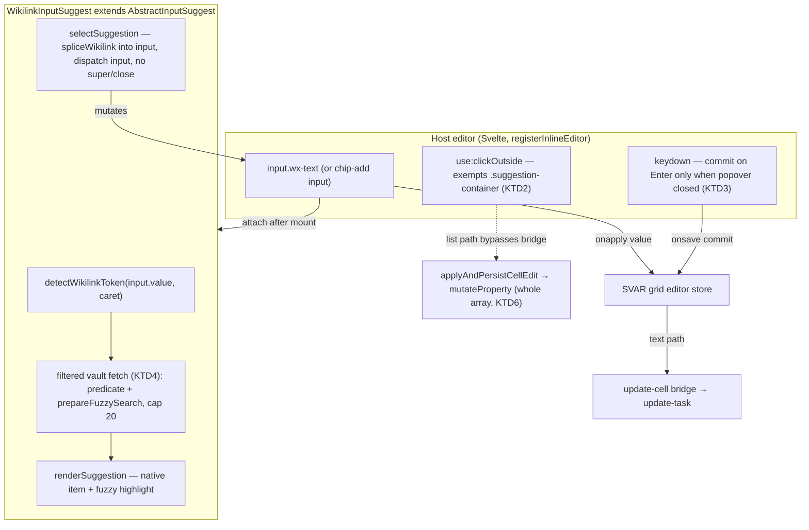

# Gantt Native Inline Editing - Plan

## Goal Capsule

- **Objective:** Replace the gantt grid's hand-rolled `[[` suggesters with Obsidian's native link suggester (filter-aware, fuzzy, plugin-rendered), and make list fields editable inline as truncated, removable chips that seed and commit raw wikilinks.
- **Product authority:** Maintainer dialogue, 2026-07-11. The native-suggester direction is a maintainer-directed reversal of the prior text-cell plan's KTD1 (docs/plans/2026-07-11-002-feat-gantt-text-cell-obsidian-editing-plan.md), which chose a SVAR dropdown to avoid grid-integration risk.
- **Execution profile:** Test-first for pure logic (filter engine, token/splice reuse); Svelte editor components and native-popover behavior are covered by WDIO e2e against real Obsidian (`npm run e2e:local`), which is a first-class gate here. Run `npm run perf:isolated` before pushing any unit that adds a module-scope `obsidian` import.
- **Stop conditions / blockers:** None blocking. Sequencing: PR #232 (branch `feat/gantt-text-cell-editor`) lands on `main` first — it carries the raw-markdown seed fix (`editorSeedFor`), Tab-commit sync, and the read-only gate this plan builds on, and it removed the hover pencil affordance. This plan starts from that merged `main`.
- **Tail ownership:** Focused PRs per unit cluster; open a PR and hold for maintainer review (no auto-merge). Address the Codex auto-review on each PR before considering it done.

---

## Product Contract

### Summary

Replace the gantt grid's hand-rolled inline `[[` suggesters with Obsidian's native link suggester, scoped by the field's TaskNotes autosuggest filter when one is configured. Make list-type user fields editable inline as truncated, removable chips that handle mixed link and plain-text items, seeding and committing raw wikilinks. Editing is still entered through today's double-click / F2 — no gesture changes.

### Problem Frame

The shipped text-cell editor renders `[[` suggestions in a custom SVAR dropdown. Tested against a real vault it works poorly next to Obsidian's own suggester: no fuzzy matching, no native styling, no integration with plugins that decorate note suggestions (icons, renamed displays). Users expect the suggester they see everywhere else in Obsidian.

List-type user fields (the maintainer's real `assignee` field) are worse off: they route to the stock text editor, which shows the resolved display form instead of the raw wikilinks and offers no suggestions at all. Existing items cannot be seen or re-edited inline.

### Key Decisions

- **Native `AbstractInputSuggest` over any hand-rolled dropdown.** Obsidian's public suggest API delivers fuzzy search, native styling, keyboard navigation, and plugin-rendered items for free. This reverses the prior plan's KTD1, at the maintainer's direction after vault testing.
- **One unified suggester surface.** The text path and the filtered-suggest path both move to the native suggester; the two custom editors this replaces do not survive alongside it.
- **Chips for list fields, not TaskNotes' comma-joined input.** Chips truncate long link labels cleanly in a narrow cell and give per-item remove affordances. Accepted cost: a richer interaction model than TaskNotes' own list input.
- **The field's autosuggest filter is applied locally.** TaskNotes' filtered file helper is unreachable from a companion plugin, so the filter semantics are re-implemented over Obsidian's metadata cache. This constraint holds for any suggester choice — it is a requirement, not a trade-off of the native option.
- **Entry is unchanged.** Inline editing is still entered through the existing double-click / F2 path; all click behavior, TaskNotes click-action settings, ctrl-click, and bar gestures are preserved. No hover buttons.
- **Full markdown editing stays in the modal.** The in-cell experience covers `[[` completion only; heading/block/alias hints and live decorations remain behind TaskNotes' own editor, reached through the preserved click actions and the right-click menu.

### Requirements

**Suggester**

- R1. Typing `[[` in an inline cell editor opens Obsidian's native link suggester (fuzzy matching, native styling, plugin-rendered items), not a custom dropdown.
- R2. When the TaskNotes user field has an autosuggest filter configured, suggestions are limited to notes matching that filter (its tag, folder, and property dimensions); without a filter, all vault notes are offered.
- R3. Picking a suggestion splices the full `[[Note]]` at the caret, preserving surrounding text; it never replaces the whole field value.
- R4. The suggester works in both single-value text editors and list-chip editors.

**Single-value text cells**

- R5. The editor seeds with the raw stored markdown (`[[Chuck Norris]]`, aliases intact), matching what read mode renders — never the resolved display form.

**List cells (chips)**

- R6. A list-type user field is editable inline: existing items render as chips, each removable individually.
- R7. Chips truncate long labels; the truncation width has a sensible default and is user-adjustable in the view configuration.
- R8. A list may mix wikilink items and plain-text items; both render and commit correctly side by side.
- R9. A chip whose item is a wikilink behaves as a real Obsidian link: hovering triggers page preview / Hover Editor when that plugin is enabled.
- R10. New items are added through the same native suggester (R1–R2); typed plain text can also be added as a non-link item.
- R11. Commits persist raw values — wikilinks stay wikilinks with aliases intact; the round-trip through edit mode never rewrites an item the user did not touch.

**Editability**

- R15. Editability cues appear only on TaskNotes-managed rows in write-capable views; non-TaskNotes rows and read-only views stay read-only.

### Key Flows

- F1. Linking inside a text cell
  - **Trigger:** User double-clicks an editable text cell and types `[[proj` mid-text.
  - **Steps:** The native suggester opens with vault notes (filtered per R2), fuzzy-matched on `proj`; the user picks; `[[Project X]]` splices at the caret; Enter or an outside click commits.
  - **Outcome:** The raw wikilink persists; read mode renders it as a link.
- F2. Editing a list field
  - **Trigger:** User double-clicks their `assignee` cell (a list field with two existing wikilink items).
  - **Steps:** Both items appear as truncated chips; the user removes one via its chip control, types `[[al`, picks "Alice" from the filtered native suggester; a new chip appears; commit.
  - **Outcome:** The list persists as raw wikilinks, one removed and one added; untouched items are byte-identical.

### Acceptance Examples

- AE1. **Covers R1, R2.** Given a field whose filter requires tag `#ws`, when the user types `[[` in that cell, then only `#ws`-tagged notes appear in Obsidian's native suggester; a field with no filter offers all vault notes.
- AE2. **Covers R5, R11.** Given `assignee: "[[People/Chuck Norris|Chuck]]"`, when the user opens the editor and commits without changes, then the stored value is byte-identical — alias and path intact.
- AE3. **Covers R6–R8.** Given a list field holding `[[Project Massachussets Vengeance 2]]` and `urgent`, when the cell enters edit mode, then two chips render — the first truncated with the full name available on hover, the second as plain text — and each can be removed independently.
- AE4. **Covers R9.** Given a chip for `[[Q3 Roadmap]]` and the Hover Editor plugin enabled, when the user hovers the chip, then the hover editor opens for that note.

### Scope Boundaries

- The full in-cell markdown editor — `#` heading, `^` block, `|` alias hints, live decorations — stays behind TaskNotes' own editor (it requires Obsidian-internal editor APIs).
- Touch/mobile: the native suggester is desktop-oriented; no dedicated mobile affordance is added.
- Parity with TaskNotes' comma-joined list input is deliberately not kept — chips replace it inline.
- Status, priority, boolean, and date editors are untouched — they keep their shipped richselect / custom-date editors.
- Non-TaskNotes rows remain read-only, unchanged.

#### Deferred to Follow-Up Work

- Native `[[` completion inside TaskNotes-managed read-only surfaces is out of scope; read-only stays read-only.

### Dependencies / Assumptions

- TaskNotes' `FileSuggestHelper` remains unreachable from companion plugins (docs/solutions/integration-issues/tasknotes-filesuggesthelper-not-reachable.md); the filter is re-implemented locally.
- `AbstractInputSuggest` is a public, stable Obsidian API in the installed 1.13.1 typings; TaskNotes' `UserFieldSuggest` uses the same class over a plain input, which is the pattern to mirror.
- TaskNotes' autosuggest filter shape is `FileFilterConfig`: `requiredTags?: string[]`, `includeFolders?: string[]`, `propertyKey?: string`, `propertyValue?: string` (verified against TaskNotes source). Matching mirrors `matchesTagConditions` (any-of, hierarchical, `-` exclusion) and `matchesProjectProperty` (case-insensitive, key-present, multi-value), plus the plugin's `excludedFolders` and alias/title ranking — all re-implemented locally (KTD4). R2 covers all four fields.
- The pure modules from the prior series — `src/bases/wikilinkToken.ts` and `src/bases/vaultWikilinkSuggest.ts` — are reusable under the native suggester; `editorSeedFor` (`src/bases/cellEditCommit.ts`) already seeds text/suggest editors with the raw markdown source.
- PR #232's fixes are on `main` before this work starts.

### Product Contract preservation

Changed from the requirements-only version, at maintainer direction (2026-07-11): removed the hover-button gesture requirements (former R12–R14), the gesture-misfire problem framing, and flow F3 (no accidental actions) / former AE5. Editing entry stays as shipped. The suggester, chips, filter, and raw-value requirements are unchanged. R-IDs are not renumbered — former R12–R14 are retired, leaving a gap before R15.

---

## Planning Contract

### Key Technical Decisions

- KTD1. **Swap the popup surface, keep SVAR's editor lifecycle.** Each editor stays a `registerInlineEditor(type, Component)` editor honoring the `{editor, onapply, onsave, oncancel}` contract, opened by SVAR on double-click / F2 through the existing `resolveRowEditor` gate. Only the suggestion popup changes: from a SVAR `Dropdown` to an Obsidian `AbstractInputSuggest` attached to the editor's `<input>`. This keeps focus, commit, and virtualization behavior inside the vendor-supported seam (docs/solutions/design-patterns/svar-custom-inline-editor-pattern.md). Reversing the prior SVAR-Dropdown decision is a documented-API deviation of the sanctioned stacking-context-exception class (precedent PR #191); the maintainer's direction this session is the recorded sign-off.

- KTD2. **Exempt the native popover from the editor's clickOutside — the central risk.** Obsidian renders the suggestion popover as `.suggestion-container` on `document.body`, topologically outside the editor wrapper, so the editor's `use:clickOutside` would fire `onsave(true)` (commit + close) on the pick's mousedown before the suggester's `selectSuggestion` runs — the exact clickOutside class the shipped SVAR-Dropdown exemption solved. The editor's clickOutside handler must treat a target inside `.suggestion-container` as inside the editor (check `target.closest('.suggestion-container')` on the armed mousedown), so a pick lands instead of committing. The selector is undocumented; keep it in one named constant with a caveat comment.

- KTD3. **Key arbitration between the popover and the editor.** While the native popover is open, Obsidian's keymap `Scope` consumes ArrowUp/Down/Enter/Escape to navigate/pick/close. The editor commits on Enter only when the popover is closed, and lets Escape close the popover first (a second Escape reaches SVAR's editor-cancel). The editor detects popover-open by the presence of `.suggestion-container`. This subsumes the prior "no-match Enter commits" behavior: with no matches Obsidian closes the popover, so Enter reaches the editor and commits the literal text.

- KTD4. **Apply the filter locally, mirroring TaskNotes' matching, per query.** TaskNotes' `FileSuggestHelper` is unreachable, so re-implement its *verified* semantics (source-checked, not naive equality — the naive version ships a wrong candidate set): `requiredTags` matches a note that has **any** required tag, with hierarchical tag matching (`#a/b` satisfies `#a`) and `-`-prefixed exclusion tags (`FilterUtils.matchesTagConditions`); notes in the plugin's `excludedFolders` are dropped; `includeFolders` is a path-prefix include (no active-folder resolution — a companion plugin has no active-folder context); property matching is case-insensitive with an empty `propertyValue` meaning "key present" and array/multi-value frontmatter matching any element (`matchesProjectProperty`). Rank survivors over basename **plus title and aliases** (mirroring `FileSuggestHelper`'s field set, so a note reachable by its alias in TaskNotes' own suggester is reachable inline) with `prepareFuzzySearch`, attaching each survivor's `SearchResult` to its item for native `renderResults` highlighting; cap at `VAULT_SUGGEST_LIMIT` (20). This runs only while a `[[` token is open (bounded, on demand) — never on refresh paths, never via bulk `entry.getValue()`. The filter scopes *suggestions*, not row visibility.

- KTD5. **Seed chips from the shipped raw-read path; add a row carrier only if needed.** The `list` TypedValue keeps only display text today (`classifyArray` strips brackets/aliases) and the cell's markdown render source joins items lossily (a plain item with a comma is ambiguous). Primary approach — the minimum change: seed the chips at editor-open from `rawStoredValueOf` (metadata-cache frontmatter) + `normalizeStoredList`, the shipped direct-path precedent that already round-trips raw list entries verbatim; no pipeline change. Escape hatch, only if a per-row raw carrier proves necessary: extend the `list` TypedValue with a `rawItems: string[]` populated in `classifyArray` (verbatim string / `{file:{path}}` → path), index-aligned with `value`, flowing via existing `row.custom.properties` plumbing and fingerprint-safe (the diff-sync fingerprint reads `kind`+`value` only).

- KTD6. **Commit the whole list once through the direct path.** The chips editor composes the final raw `string[]` for the session and persists it in a single `applyAndPersistCellEdit(..., { refreshRow: true })` call (the existing list direct path), never through SVAR's `update-cell` bridge (its `v *= 1` coercion turns `[]` into `0` and cannot represent wikilink lists). `mutateProperty` already writes a whole array verbatim for a registered non-canonical user field. Compose one array per session — the single-flight `pendingCellEdits` gate drops a second in-flight commit, so remove+add must not be two writes. Canonical TaskNotes keys are refused by `resolvePropertyPatch`; only registered non-canonical user fields are editable (the same constraint the current append path lives under).

- KTD7. **Perf-shim the `AbstractInputSuggest` import.** A module-scope `import { AbstractInputSuggest } from 'obsidian'` in a mounted Svelte component breaks the vitest perf gate while jest/typecheck stay green. Export the symbol from `test/perf/isolated/obsidian-shim.ts` and verify with `npm run perf:isolated` before pushing.

- KTD8. **Icons and CSS discipline for chips.** Chip remove/glyph controls cannot use `wxi-*` font icons (fonts disabled → blank); use a text `×` or an inline-SVG / `-webkit-mask` + `background-color: currentColor` glyph. Any `.wx-*` selector the chip CSS adds must be container-scoped under `.og-bases-gantt` (SVAR reuses class names) and injected as a Svelte-compiled `<style>` (injected plugin CSS loses the cascade to SVAR's hashed styles), with `!important` where it fights a SVAR scoped rule; verify winners via `getComputedStyle`.

- KTD9. **Hover-link on link chips.** Register a hover-link source at plugin load (`registerHoverLinkSource`) and trigger the untyped `hover-link` event on a link chip's hover with `{ event, source, hoverParent, targetEl, linktext, sourcePath }` (community-convention payload; wrap behind a local typed helper). Keep a stable `HoverParent` so Page preview / Hover Editor attaches correctly.

### High-Level Technical Design

The single-value editor and the chips editor share one native-suggester primitive. The primitive owns `[[`-token detection, the filtered fetch, native rendering, and caret splice; the host editors own seeding, commit, and the clickOutside/key arbitration against SVAR.

Editor-kind routing (in `cellEditability.ts` / `svarEditorConfigFor`) after the rework:

- `text` kind → single-value native editor (no filter).
- `suggest` kind, single-value → single-value native editor (with filter).
- `suggest` kind, list-shaped, and `list` kind → chips editor (with filter when present).
- `number`, `boolean`, `date`, `choice-status`, `choice-priority` → unchanged.

### Assumptions and Constraints

- The suggester is constructed against the editor's rendered `HTMLInputElement` after mount (it cannot attach to a Svelte abstraction). It is fire-and-forget (GC via DOM removal, like TaskNotes); it lives as long as the input, so it must not capture heavy references.
- No `fuzzySearch(PreparedQuery, …)` / `prepareQuery` exists in 1.13.1 — use `prepareFuzzySearch`/`prepareSimpleSearch` prepared callbacks and `renderResults` for highlighting.
- The `hover-link` event and the `.suggestion-container` DOM are community convention, not typed API — isolate both behind local constants/helpers with caveat comments.
- After a bulk reseed (>150 structural ops) SVAR clears `filter-tasks` state; this plan does not add row filtering, so no re-apply seam is needed — but any suggestion cache must not assume row-state persistence.

### Sequencing

U1 (filter engine) depends on nothing. U2 (suggester primitive) depends on U1. U3 (single-value editor) and U4 (chips editor) both depend on U2. U5 (truncation setting) and U6 (hover-link) layer onto U4. U7 is the e2e migration; its specs ship *with* the editor that produces them — the migration is organized per editor and lands in the same PR, so there is no separate e2e PR gating on U3/U4. Suggested PR clustering: PR-1 = U1 + U2 + U3 + its migrated single-value e2e (replaces `og-text`/single `og-suggest`); PR-2 = U4 + U5 + U6 + its chips/filter e2e. Each PR carries the e2e that satisfies its own Verification and the DoD per-PR gate. Keep PRs focused; hold each for maintainer review.

---

## Implementation Units

### U1. Local file-filter engine

- **Goal:** A pure predicate + fuzzy-ranked vault query that scopes `[[` suggestions by a TaskNotes `FileFilterConfig`, replacing the unreachable `FileSuggestHelper`.
- **Requirements:** R2.
- **Dependencies:** none.
- **Files:** `src/bases/fileFilter.ts` (new, pure predicate), `src/bases/vaultWikilinkSuggest.ts` (extend `createVaultWikilinkFetcher` to accept an optional filter + fuzzy rank), `test/unit/fileFilter.test.ts` (new).
- **Approach:** `fileFilter.ts` exposes `matchesFileFilter(candidate, config, excludedFolders)` over a small candidate shape (`{ tags: string[], path: string, frontmatter: Record<string, unknown>, aliases: string[], title: string }`) so it is Obsidian-free and unit-testable. Mirror TaskNotes' verified semantics (KTD4): `requiredTags` — **any** match, hierarchical (`#ws/alpha` satisfies required `#ws`), a `-`-prefixed exclusion tag rejects a note carrying it; `excludedFolders` path-prefix reject; `includeFolders` path-prefix include (empty ⇒ any); property — case-insensitive equality, empty `propertyValue` ⇒ key-present, array/multi-value frontmatter matches any element. The fetcher builds each candidate from `getAllTags(getFileCache(f))`, `f.path`, `getFileCache(f)?.frontmatter`, its aliases (`parseFrontMatterAliases`), and mapped title; applies the predicate; ranks survivors with `prepareFuzzySearch(query)` over basename + title + aliases (best field score); sorts; caps at `VAULT_SUGGEST_LIMIT`. Item shape becomes `{ value, display, path?, match? }` where `match` is the `SearchResult` U2 hands to `renderResults`.
- **Patterns to follow:** existing `createVaultWikilinkFetcher` structure; TaskNotes' `FileSuggestHelper` matching (`FilterUtils.matchesTagConditions`, `matchesProjectProperty`) and its basename/title/aliases scoring — re-implemented locally, not called; property resolution reads the filter's own `propertyKey` (a raw frontmatter key from TaskNotes config), not a plugin FieldMapping.
- **Test scenarios:**
  - `matchesFileFilter` — no filter ⇒ all pass; a single required tag present/absent; **multiple required tags: a note with ANY one passes (union, not intersection)**; hierarchical match (`#ws/alpha` satisfies required `#ws`); a `-`-prefixed exclusion tag rejects a note carrying it; `excludedFolders` prefix rejects; `includeFolders` prefix match and non-match, empty ⇒ any; property case-insensitive equality, empty `propertyValue` ⇒ key-present passes and key-absent fails, array frontmatter matches any element; combined dimensions AND together.
  - Covers AE1. Ranking: a query matching a note's ALIAS (not its basename) still returns it; a query matching two candidates orders the higher fuzzy score first; empty query returns the capped set; cap never exceeded.
- **Verification:** `npm test` green; the predicate is Obsidian-free (no import from `obsidian`).

### U2. Native wikilink suggester primitive

- **Goal:** A `WikilinkInputSuggest extends AbstractInputSuggest` that turns a plain `<input>` into an Obsidian-native `[[` suggester backed by the U1 fetcher, splicing at the caret on select.
- **Requirements:** R1, R3, R4.
- **Dependencies:** U1.
- **Files:** `src/bases/wikilinkInputSuggest.ts` (new), `test/perf/isolated/obsidian-shim.ts` (export `AbstractInputSuggest`), `src/bases/wikilinkToken.ts` + `src/bases/vaultWikilinkSuggest.ts` (reuse, no change expected).
- **Approach:** Construct with `(app, inputEl, fetcher)`. `getSuggestions` reads `this.getValue()` + the live caret (`inputEl.selectionStart`), runs `detectWikilinkToken`; no open token ⇒ return `[]` (native popover stays closed); token ⇒ `await fetcher(token.query)`. `renderSuggestion(item, el)` renders the display with `renderResults` fuzzy highlight and lets plugin-decorated file rendering show through. `selectSuggestion(item, evt)` overrides the base: `spliceWikilink` the item into `inputEl.value` at the token bounds, set caret after the insert, dispatch a bubbling `input` event so the host editor's bound state updates, refocus — following TaskNotes' `selectSuggestion` pattern (do not call `super`, do not `close()`). Force-open on focus/click if a token is already present (mirror `openSuggestionsOnFieldSelection`). Construct after mount; store no heavy refs.
- **Patterns to follow:** TaskNotes `UserFieldSuggest` (`../tasknotes/src/modals/taskModalSuggests.ts:138`) for the input-mutation `selectSuggestion` and focus-open; `AbstractInputSuggest` 1.13.1 signatures (getSuggestions protected; renderSuggestion/selectSuggestion public).
- **Execution note:** The token/splice logic is already unit-tested (`wikilinkToken`); this unit's new logic is DOM/Obsidian-bound, so prove it through U7's e2e rather than a component unit harness. Extract any pure "build inserted `[[Note]]` string" helper and unit-test it if it emerges.
- **Test scenarios:** `Test expectation: none at unit level (Obsidian-bound); covered by U7 e2e.` Add a unit test only if a pure helper is extracted (e.g. token→insert string).
- **Verification:** `npm run perf:isolated` passes (shim export present); typecheck clean; the class compiles against installed `obsidian.d.ts`.

### U3. Single-value native editor (text + single-value suggest)

- **Goal:** Replace `TextCellEditor` (and the single-value branch of `SuggestCellEditor`) with one editor that hosts a plain input + `WikilinkInputSuggest`, seeds raw markdown, and solves the clickOutside/key arbitration against SVAR.
- **Requirements:** R1, R3, R4, R5, R15.
- **Dependencies:** U2.
- **Files:** `src/bases/TextCellEditor.svelte` (rewrite to native suggester), `src/bases/SuggestCellEditor.svelte` (single-value path folds into the native editor; retire the SVAR `Dropdown` + degraded-state UI), `src/bases/inlineEditors.ts` (registration), `src/bases/cellEditCommit.ts` (`svarEditorConfigFor` wiring for text + single-value suggest; keep `editorSeedFor` raw seeding), `src/bases/GanttContainer.svelte` (`withTextEditorWiring`/`withSuggestWiring` pass the U1 filter through the config), `src/bases/cellEditability.ts` (routing note — single-value suggest → native editor).
- **Approach:** On mount, render the input, seed from `editorSeedFor` (raw markdown), construct `WikilinkInputSuggest(app, inputEl, filteredFetcher)`. The filtered fetcher = `createVaultWikilinkFetcher(app, sourcePath, filter)` where `filter` is the field's `autosuggestFilter` (undefined ⇒ all vault). Commit rides the existing text path (`onapply(text)` on input, `onsave()` on Enter/blur). Implement KTD2 (clickOutside exemption for `.suggestion-container`) and KTD3 (Enter commits only when popover closed; Escape closes popover first). Remove the degraded free-text state — the native suggester always has the vault to draw on.
- **Patterns to follow:** the shipped `TextCellEditor.svelte` clickOutside/onapply/onsave structure (keep the parts that work: raw seed via `editorSeedFor`, `onapply` on input for Tab-sync); `svar-custom-inline-editor-pattern.md` (Enter must save-or-stopPropagation; every editor-attached column needs a getter).
- **Test scenarios (delivered in U7):**
  - Covers R5/AE2: opening a wikilink-valued text cell seeds the raw `[[…]]` (aliases intact); commit-without-change round-trips byte-identical.
  - Covers R1/R3/AE1: typing `[[` opens the native `.suggestion-container`; a filtered field shows only matching notes; a mouse pick splices `[[Note]]` at the caret preserving surrounding text and is NOT lost to clickOutside (the KTD2 regression guard).
  - Key arbitration: Enter with the popover open picks the highlighted suggestion; Enter with no popover commits; Escape closes the popover without cancelling the edit, a second Escape cancels.
  - Regression: `number`/`list`/date/status editors are unaffected.
- **Verification:** all rewritten inline-edit e2e green; `npm run perf:isolated` green.

### U4. Chips list editor

- **Goal:** A new editor for list-kind fields that renders existing items as removable truncated chips, adds items via the native suggester (link or plain text), and commits the whole raw list once through the direct path.
- **Requirements:** R6, R8, R10, R11, R15; R9 via U6.
- **Dependencies:** U2; the raw-list carrier (this unit).
- **Files:** `src/bases/ChipsListEditor.svelte` (new), `src/bases/inlineEditors.ts` (register a new editor type), `src/bases/cellEditCommit.ts` (`svarEditorConfigFor` routes list + list-suggest to the chips editor; direct-commit callback wiring), `src/bases/cellEditability.ts` (route `list` and list-shaped `suggest` to chips), `src/bases/GanttContainer.svelte` (seed chips from `rawStoredValueOf`; wire the direct-commit callback), `test/unit/cellEditCommit.test.ts` (routing + list-array commit shape). Escape-hatch only (KTD5), if a per-row carrier proves necessary: `src/bases/propertyValues.ts` (extend `list` TypedValue with `rawItems`) + `test/unit/propertyValues.test.ts`.
- **Approach:** Seed the chips at editor-open from `rawStoredValueOf` + `normalizeStoredList` (KTD5 primary). Each chip shows the display label (basename/alias for a link, verbatim for plain), truncated by CSS ellipsis to the configured width (U5), with a remove control (KTD8 glyph). **Empty list** (no items yet) renders no chip row — just the add-input with an "Add entry…" placeholder, mirroring the shipped `SuggestCellEditor`. An add-input hosts `WikilinkInputSuggest` (with filter); a picked suggestion pushes a raw `[[Note]]` chip; typed plain text + Enter on the add-input pushes a plain chip. **Lifecycle:** the whole edit persists on commit — an outside-click / blur composes the final ordered raw `string[]` and calls `applyAndPersistCellEdit(instanceId, columnId, finalArray, { refreshRow: true })` once (KTD6), never the bridge; Enter in the add-input only pushes a chip (it does not commit); Escape cancels the whole session, reverting in-session adds/removes to the seeded list (no write). Chips are keyboard-removable — a focusable remove control, or Backspace/Delete on a focused chip — since editing is entered by F2. Remove-then-add in one session is a single write.
- **Patterns to follow:** the shipped list direct path (`handleSuggestListCommit` / `appendListEntry` / `applyAndPersistCellEdit`, `taskNotesSuggest.ts`, `GanttContainer.svelte`); `normalizeStoredList` for raw-entry shaping; `svar-grid-cell-obsidian-markdown-rendering.md` (in-cell controls `stopPropagation` on click AND mousedown; `app` via context, per-row data via `row.custom`; render into a fresh child for virtualized recycling).
- **Test scenarios:**
  - Unit (`cellEditCommit`): `svarEditorConfigFor` routes `list` and list-shaped `suggest` to the chips editor type and single-value kinds unchanged; the composed commit is a whole `string[]` through the direct-commit callback, never a bridge string.
  - Escape-hatch unit (`propertyValues`, only if the `rawItems` carrier is built): `classifyArray` on `["[[WS Alpha]]", "urgent"]` yields `rawItems: ["[[WS Alpha]]","urgent"]` index-aligned with `value`; a `{file:{path}}` item yields its path; the fingerprint still reads `kind`+`value` only.
  - e2e (U7) Covers R6/R8/AE3: mixed link+plain list renders two chip kinds; remove the middle chip; untouched entries persist byte-identical (`[[WS Alpha]]` never round-trips to display form); an empty list shows only the add-input placeholder.
  - e2e Covers R10/R11: add a link via the native suggester and a plain item; commit persists the full raw array in order; Escape after an in-session remove reverts to the seeded list (no write).
- **Verification:** unit suite green; chips e2e green; a whole-list remove+add persists as one write (no lost second commit).

### U5. Chip truncation view setting

- **Goal:** A `tngantt_`-prefixed view-config option controlling chip label truncation length, defaulted sensibly.
- **Requirements:** R7.
- **Dependencies:** U4.
- **Files:** `src/bases/viewOptions.ts` (`appearanceOptions()` — add the option), `src/bases/register.ts` (options builder already wires `ganttViewOptions`), `src/bases/ChipsListEditor.svelte` (consume the value; CSS `max-width`/`text-overflow: ellipsis`).
- **Approach:** Mirror the divider-width (`tngantt_tableWidth`) precedent: a numeric/text option in `appearanceOptions()`, read into the assembly pass and threaded to chips via the existing context/data channel. Default to a width that fits a typical narrow cell; clamp to a sane minimum.
- **Patterns to follow:** `tngantt_tableWidth` option definition + persistence (PR #219); `tngantt_` key prefix (silent mismatch otherwise); options as a `Record<string,string>` if a dropdown (not an array).
- **Test scenarios:** unit — the option default resolves when unset and a set value is honored (test at the pure resolution level if a resolver exists); e2e (U7) — a long chip label is visually truncated and the full text is available on hover.
- **Verification:** the option appears in the Bases view-config menu; chips truncate at the configured width.

### U6. Hover-link on link chips

- **Goal:** Link chips behave as real Obsidian links — hovering triggers page preview / Hover Editor.
- **Requirements:** R9.
- **Dependencies:** U4.
- **Files:** `src/bases/register.ts` or the plugin `onload` (register a hover-link source once), a small hover helper (e.g. `src/bases/hoverLink.ts`), `src/bases/ChipsListEditor.svelte` (fire the event on link-chip hover).
- **Approach:** `registerHoverLinkSource(id, { display, defaultMod })` at load. On a link chip's `mouseover`, trigger the untyped `hover-link` event with `{ event, source: id, hoverParent, targetEl, linktext, sourcePath }` behind a local typed helper. Keep a stable `HoverParent`. Keep the handler trivial (hot path — no diagnostics).
- **Patterns to follow:** Obsidian `registerHoverLinkSource` docs; `no-heavy-diagnostics-on-hot-paths.md` (trivial hover handlers); markdown-cell anchor handling in `PropertyCell.svelte` as the existing link-open precedent.
- **Test scenarios:** e2e (U7) Covers R9/AE4 — with Hover Editor enabled, hovering a link chip opens the hover editor for that note; skip-guard when the plugin/preview is absent (mirror the `taskNotesHasEditModal` skip pattern).
- **Verification:** hovering a link chip shows the native page preview (or is cleanly skipped when unavailable).

### U7. E2E migration and fixtures

- **Goal:** Migrate the inline-edit e2e suite to the native suggester and chips, add filter and mixed-list fixtures, and re-establish the clickOutside-survival regression guard for the native popover.
- **Requirements:** R1–R11, R15 (behavioral coverage).
- **Dependencies:** U3, U4 (and U5/U6 for their assertions).
- **Files:** `test/specs/gantt-inline-edit.e2e.ts` (rewrite per the inventory), a possible new `test/specs/gantt-chips-edit.e2e.ts`, `test/vaults/gantt-edit/*` (fixtures), `test/vaults/gantt-edit/Edit.base` (exclude new helper notes from rows).
- **Approach:** Swap suggestion selectors from `.og-suggest-item`/`.og-suggest-panel` to document-wide `.suggestion-container .suggestion-item` (precedent: the richselect picker already queries document-wide). Keep double-click as the entry gesture (no change). Rewrite the two REPLACE cases: the degraded-suggest/append-one test becomes chips render/remove/verbatim-preserve; the no-match-Enter test becomes "Enter with no popover commits literal text". Re-prove the pick-not-lost-to-clickOutside guard against the native container (KTD2). Drive every popover keyboard assertion with a single synchronous in-page dispatch (native popovers are transient — the fullscreen-spec Escape-race rationale applies). Gate readiness on the specific target cell/editor, not "any header present" (column-sort flake class). Add fixtures: a `workstream` list seeded with mixed items (`["[[WS Alpha]]", "Ad-hoc item"]`) and an aliased entry on a second row; a `workstreams/` folder + a root decoy for `includeFolders`; a frontmatter property + a decoy for `propertyKey`/`propertyValue`. Add all new notes to `Edit.base` exclusions.
- **Patterns to follow:** the e2e inventory in this plan's research; existing helpers (`typeEditorToken`, `pickSuggestItem`, `commitEditorValue`, `readEditorInputValue`, `frontmatterValue`) survive with selector swaps; `readAffordancePresent`/`clickAffordance` are gone with the pencil; `column-sort-e2e-first-mount-header-race.md` (readiness on the exact element).
- **Test scenarios:** the full behavioral set enumerated in U1–U6 test scenarios, plus preserved happy-path/no-flicker/optimistic-apply/de-DE-date/status-picker coverage from the current suite. Verify filter dimensions (tags AND folders AND property) each with a decoy.
- **Execution note:** `.mts` harness changes escape svelte-check/eslint — verify by running WDIO. Gate freshly-generated vault specs on cold-index completion.
- **Verification:** `npm run e2e:local` green for the inline-edit + chips specs; no dropped coverage versus the pre-rework suite (map each retired test to its replacement).

---

## Verification Contract

| Gate | Command | Applies to |
|---|---|---|
| Unit tests | `npm test` | U1, U4, U5 (pure logic), and the full suite as a regression gate |
| Typecheck | `npm run typecheck` | all units |
| Lint | `npx eslint` on touched files | all units |
| Perf shim gate | `npm run perf:isolated` | U2, U3, U4 (any module-scope `obsidian` import) |
| E2E vs real Obsidian | `npm run e2e:local` (or targeted: `node node_modules/vite/bin/vite.js build` then `node node_modules/@wdio/cli/bin/wdio.js run ./test/wdio/wdio.conf.mts --spec test/specs/gantt-inline-edit.e2e.ts`) | U3, U4, U5, U6, U7 |
| Regression specs | run `gantt-markdown-cells.e2e.ts` and `gantt-locale-dates.e2e.ts` | U3, U4 (shared cell/render surface) |

CI parity: the SonarCloud new-code coverage gate (80%) counts the new `.ts` modules — keep `fileFilter.ts` and the `propertyValues`/`cellEditCommit` additions unit-covered; the Svelte editors are e2e-covered as designed. Address the Codex auto-review on each PR before considering it done.

---

## Definition of Done

- All Verification Contract gates pass, including `npm run e2e:local` for the migrated inline-edit and chips specs and `npm run perf:isolated`.
- The native Obsidian suggester replaces the SVAR dropdown for text and single-value suggest fields; filtered fields show only filter-matching notes; picks splice at the caret and are not lost to clickOutside.
- List fields edit as truncated, removable chips over mixed link + plain items; commits persist the whole raw array once through the direct path with untouched items byte-identical; link chips trigger hover preview.
- Editing entry is unchanged (double-click / F2); no gesture, click-action, or bar behavior regressed; status/priority/date/boolean editors are untouched.
- The two custom SVAR-dropdown editors and their degraded-state UI are removed, not left alongside the native suggester; no abandoned-approach code remains in the diff.
- Each PR is opened, CI is green, the Codex review is addressed, and the PR is held for maintainer review (no auto-merge).
- Per unit: U1 predicate is Obsidian-free and unit-covered; U2 compiles against installed typings and passes the perf gate; U3/U4 pass their e2e scenarios; U5 option appears in the view-config menu; U6 hover works or is cleanly skipped; U7 maps every retired test to a replacement with no coverage loss.
