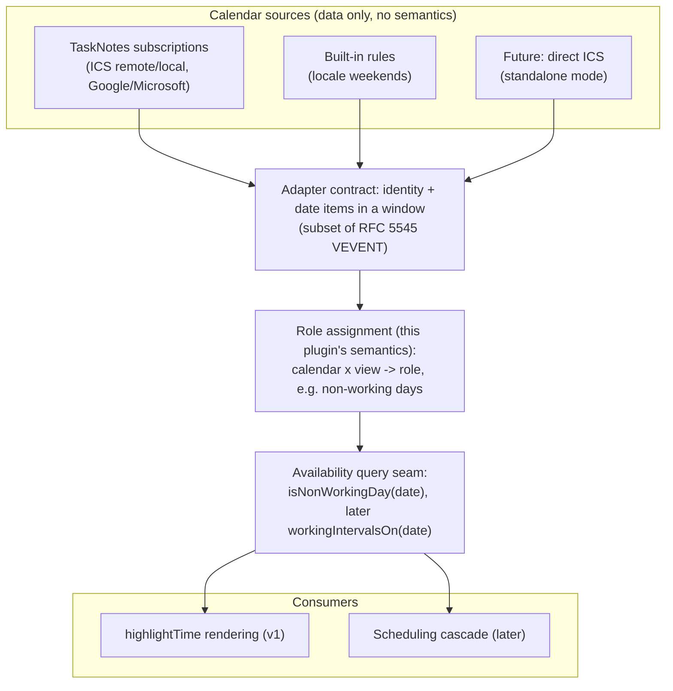
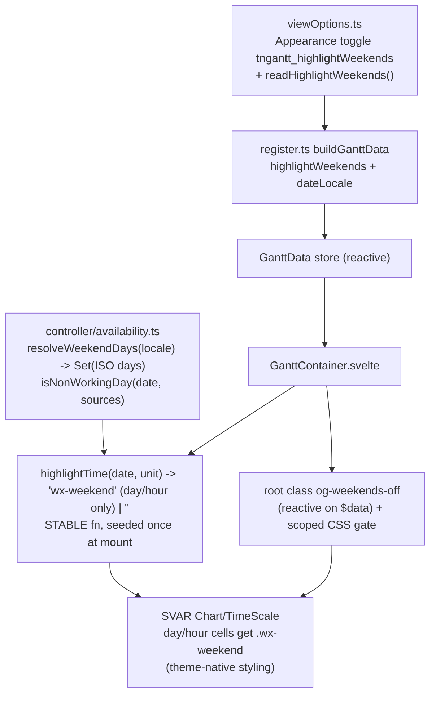

# Gantt Weekend Highlighting - Plan

## Goal Capsule

- **Objective:** Ship a "Highlight weekends" view option that shades weekend day-columns in the gantt chart, with weekend days derived from the user's locale. Internally, the weekend check flows through a non-working-day seam — the first brick of the calendar architecture — but no calendar entity, UI, or vocabulary ships in this delivery.
- **Product authority:** The Product Contract below, confirmed in dialogue with the maintainer on 2026-07-12. The Planning Contract and Implementation Units execute it; where they conflict, the Product Contract wins.
- **Stop conditions:** Surface (don't guess) any change that would alter product scope — new user-visible calendar vocabulary, a default flip, or a standards-constraint (R9–R12) conflict.
- **Open blockers:** None. Future calendar phases are blocked on TaskNotes calendar API exposure (see Outstanding Questions), not this delivery.
- **Product Contract preservation:** Unchanged, except Outstanding Questions — the two Deferred-to-Planning items, the live-toggle mechanism (now KTD2) and the option naming/persistence key (now KTD4), are resolved in place by the Planning Contract.

---

## Product Contract

### Summary

Add a per-view "Highlight weekends" toggle that shades weekend day-columns in the timeline via SVAR's free `highlightTime` hook, defaulting on, with weekend days resolved from the user's locale. The check runs through an internal availability seam so future calendars plug in behind it without touching the render path.

### Problem Frame

Gantt charts conventionally shade non-working days; this plugin shades none, so weekend spans read as ordinary working time and multi-day bars visually overstate available effort.

The larger vision — confirmed in this brainstorm and captured under Vision Context below — is a calendar system: working/non-working days and schedules, built on the iCalendar standards family, consuming calendars users already maintain (public-holiday feeds, per-project schedules) through TaskNotes' subscription infrastructure. Weekend highlighting is the first baby step. The risk this contract guards against is shipping it in a shape the calendar system would have to unwind.

### Key Decisions

- **Standards adherence is a hard architectural constraint, not a preference.** Every calendar-domain semantic this plugin introduces — now or in any later phase — must be unambiguously and losslessly expressible in the iCalendar standards family, identified exactly as: **RFC 5545** (Internet Calendaring and Scheduling Core Object Specification — events, recurrence rules), **RFC 7953** (Calendar Availability — available/unavailable schedules), and **RFC 9253** (Support for iCalendar Relationships — dependency reltypes and GAP, already the basis of the plugin's dependency capability). No other calendar standard or proprietary model is authoritative. Enforced by requirements R9–R12.
- **TaskNotes owns calendar data; this plugin owns calendar semantics.** Verified against TaskNotes 4.11.1: its `ICSSubscriptionService` provides subscriptions (remote URL and in-vault `.ics`), caching, refresh, and recurrence expansion — but TaskNotes has no working/non-working concept anywhere, so role semantics ("this calendar means non-working days") must live here regardless of source.
- **Defer TaskNotes calendar consumption until the data is exposed on its stable API.** The stable JS API (`TaskNotesRuntimeApiV1`) has no calendar surface today; the internal `icsSubscriptionService` singleton is reachable but undocumented and version-fragile, and coupling to internals has bitten this project before. No TaskNotes coupling ships in this delivery.
- **Hand-roll availability outside SVAR, feeding its free extension points.** SVAR's Calendars feature is PRO-only; the bundled free 2.7.0 stubs `createCalendar` to return null, so there is nothing to activate. Its pro model is a strict semantic subset of the RFC family (weekly hours + four exception rule types, day-level only), so building RFC-shaped loses nothing. The free tier provides the `highlightTime` hook and ships `.wx-weekend` styling in its chart components — the same class SVAR's own holidays demo returns.
- **Weekend days derive from the user's locale, with no override in v1.** `Intl.Locale` weekInfo supplies the weekend set (e.g. Sat/Sun for `en-US`, Fri/Sat for `ar-EG`); fallback is Sat/Sun. A user whose working week differs from their locale has no recourse until calendars arrive — accepted in dialogue.
- **The toggle defaults on**, matching the convention of `showDateIndicators`: shading is the industry-standard reading of a gantt timeline, and the option exists for opting out.

### Requirements

**Weekend highlighting behavior**

- R1. A per-view option "Highlight weekends" shades weekend day-columns across the chart timeline area. Default: on.
- R2. Weekend days are derived from the user's locale week data; when locale data is unavailable, fall back to Saturday and Sunday.
- R3. Shading appears at zoom levels whose timeline cells are day or hour granularity; coarser zoom levels (week/month/quarter/year cells) render unchanged. This is the hook's documented boundary, not a defect.
- R4. Toggling the option applies live — no chart remount, no loss of zoom or scroll position — consistent with the plugin's other live view options.
- R5. Shading is theme-correct in both light and dark themes, using SVAR's theme-native weekend styling.
- R6. Behavior is identical in standalone mode and TaskNotes-companion mode; this feature has no TaskNotes dependency.

**Non-working-day seam (internal architecture)**

- R7. The render path obtains weekend status through an internal availability query ("is this date non-working?"), not an inline weekday test — the seam is the unit the calendar system later extends.
- R8. The seam's contract accommodates multiple future calendar sources composing per view (feeds, rules, exceptions), while v1 ships exactly one internal source: locale weekends. No user-visible calendar concept, entity, or setting appears in v1.

**Standards adherence (architectural constraints)**

- R9. All calendar-domain semantics introduced by this delivery or any later phase must be losslessly expressible in the iCalendar standards family: RFC 5545, RFC 7953, RFC 9253. These three RFCs are the named, exclusive authority; no proprietary calendar model (including SVAR PRO's) may become a boundary contract.
- R10. Internal models may be pragmatic, but every boundary-crossing shape — persisted calendar configuration, imports, subscriptions, exports — must have an unambiguous, documented mapping to and from the standards family at the time it is introduced.
- R11. Day-level availability operates on local calendar dates, matching iCalendar all-day (DATE value) semantics, so a non-working day never shifts across a timezone boundary.
- R12. The v1 locale-weekend source must itself be expressible as an RFC 7953 availability rule (a weekly recurring non-working pattern), demonstrating that the seam speaks the standard from day one.

### Acceptance Examples

- AE1. **Covers R1, R2, R3.** Given a view at day-level zoom under an `en-US` locale, when the chart renders, then Saturday and Sunday columns are shaded and weekday columns are not.
- AE2. **Covers R2.** Given an `ar-EG` locale, when the chart renders at day-level zoom, then Friday and Saturday columns are shaded.
- AE3. **Covers R3.** Given the view is zoomed to month-level cells, when the chart renders, then no per-day shading appears and no errors occur.
- AE4. **Covers R4.** Given a rendered chart with shading visible, when the user turns "Highlight weekends" off, then shading disappears without a remount and zoom/scroll are preserved.
- AE5. **Covers R5.** Given the dark theme is active, when weekends are shaded, then the shading uses the dark theme's weekend treatment.
- AE6. **Covers R6.** Given a vault without TaskNotes, when a gantt view renders at day-level zoom, then weekend shading behaves exactly as in a companion vault.

### Scope Boundaries

**Deferred for later phases**

- Calendar entities, management UI, and role assignment ("non-working days" as user-facing vocabulary) — arrives when calendars are implemented behind the scenes.
- TaskNotes calendar consumption — blocked on stable API exposure; the internal-singleton shortcut is rejected.
- ICS subscriptions inside this plugin (standalone mode's eventual path).
- Scheduling effects of non-working time: drag snapping, duration math, and the RFC 9253 GAP calendar-time vs working-time interpretation.
- Displaying calendar events in the gantt (the "TaskNotes calendar view with gantt capabilities" vision).
- Weekend-day override configuration.

**Possibly never**

- Working hours / sub-day schedules (per-day time ranges) — explicitly judged beyond this plugin's ambition in dialogue.

### Vision Context (later phases)

The calendar system this delivery seeds, agreed in dialogue as four layers:

- Calendars are reusable named things; a view applies N of them with roles (many-to-many). Composition across calendars is a capability SVAR PRO cannot express — one place this vision exceeds it. Subscriptions (live feeds) are the other.
- The scheduling integration point is this plugin's own cascade logic, not SVAR's: calendar-aware scheduling later means the cascade consults the same availability seam the renderer uses.
- RFC 9253's GAP parameter is an ISO 8601 duration (calendar time), while project schedulers conventionally count lag in working time — a decision the scheduling phase must make explicitly (see Outstanding Questions).

### Dependencies / Assumptions

- `Intl.Locale` weekInfo is available in Obsidian's Electron (Chromium-family V8; verified in Node 24: `ar-EG` → weekend `[5,6]`, `en-US` → `[6,7]`). The Sat/Sun fallback covers absence.
- SVAR free 2.7.0 (bundled) provides the `highlightTime` hook and `.wx-weekend` styling; its calendar feature is a PRO-only null stub (`createCalendar` returns null — verified in the installed bundle).
- TaskNotes 4.11.1's stable JS API exposes no calendar data (verified against source); this is a dependency only for later phases, none for this delivery.

### Outstanding Questions

**Future-phase questions (not blocking this delivery)**

- GAP interpretation when scheduling becomes calendar-aware: calendar days or working days.
- The path to TaskNotes calendar exposure: upstream a `calendars` namespace onto its stable API (fork + upstreaming precedent exists) vs waiting.
- Composition semantics when multiple calendars apply to one view (union of non-working is the presumed default; working-day exception calendars would need precedence rules).
- Whether the v1 "Highlight weekends" toggle is absorbed into calendar-role vocabulary, migrates, or persists alongside it when calendar entities arrive — decide before the calendar phase ships to avoid two overlapping controls for the same semantic.

### Sources / Research

- SVAR free-tier hook: [highlightTime property](https://docs.svar.dev/svelte/gantt/api/properties/highlighttime/), [holidays demo](https://docs.svar.dev/svelte/gantt/samples/#/holidays/willow), [GanttHolidays.svelte source](https://github.com/svar-widgets/gantt/blob/main/svelte/demos/cases/GanttHolidays.svelte), [customization article](https://svar.dev/blog/svelte-gantt-chart-customizations/).
- SVAR PRO calendars (reference only, per R9): [calendars guide](https://docs.svar.dev/svelte/gantt/guides/scheduling/calendars/) — `weekHours` + `rules` (date/range/recurring/nth-weekday), day-level only, one calendar per task/chart.
- Bundled-package verification: `node_modules/@svar-ui/gantt-store/dist/index.js` (`createCalendar` null stub), `node_modules/@svar-ui/svelte-gantt/src/components/chart/Chart.svelte` (`.wx-weekend` styling, the calendar-derived class path, and the `holidays` derived that gates `highlightTime` to day/hour min-units and re-runs when the reactive `highlightTime` state changes).
- TaskNotes 4.11.1 investigation (source at the sibling `tasknotes` repo): `src/services/ICSSubscriptionService.ts` (subscriptions, `ICSEvent` with `allDay` + date-only strings, caching/refresh), `src/api/runtime-api.ts` (`TaskNotesRuntimeApiV1` — no calendar namespace), `src/api/CalendarsController.ts` (HTTP-only calendar routes, opt-in), settings-level `showWeekends` is display-only.
- Standards: [RFC 5545](https://datatracker.ietf.org/doc/html/rfc5545), [RFC 7953](https://datatracker.ietf.org/doc/html/rfc7953), [RFC 9253](https://datatracker.ietf.org/doc/html/rfc9253). Prior in-repo RFC 9253 grounding: [docs/brainstorms/2026-06-18-gantt-dependency-types-and-scheduling-requirements.md](../brainstorms/2026-06-18-gantt-dependency-types-and-scheduling-requirements.md).
- In-repo grounding for the live-toggle design: [docs/solutions/architecture-patterns/view-display-options-in-presentation-not-derivation.md](../solutions/architecture-patterns/view-display-options-in-presentation-not-derivation.md) (display options are presentation-layer; stable arrays cannot churn), [docs/solutions/integration-issues/svar-gantt-injected-css-scoped-specificity.md](../solutions/integration-issues/svar-gantt-injected-css-scoped-specificity.md) (overriding SVAR's scoped styles), [docs/solutions/integration-issues/svar-gantt-diff-sync-interactions.md](../solutions/integration-issues/svar-gantt-diff-sync-interactions.md) (seed-once store discipline).

---

## Planning Contract

### Key Technical Decisions

- **KTD1 — The availability seam is a pure module at `src/controller/availability.ts`.** It owns locale weekend resolution, the availability-source shape, and the composed "is this date non-working?" query. Controller placement (beside `datePolicy.ts`, `durationConversion.ts`) matches the future consumer: the scheduling cascade lives in controller-layer logic, and the view is just the first caller. No Obsidian or DOM imports — unit-testable in isolation (satisfies R7/R8).
- **KTD2 — Live toggle = stable `highlightTime` function + reactive CSS gate (resolves the former open question).** `highlightTime` is passed once at mount and never reassigned — SVAR reads it into store state (`api.getReactiveState().highlightTime`) and consumes it inside deriveds, so it belongs to the seed-once prop set the container never churns. The function classifies only day/hour cells: it returns SVAR's `wx-weekend` class when `unit` is `day` or `hour` and the date is a weekend (an hour cell classifies by its enclosing local date), and `''` for every coarser unit — SVAR's own day/hour gate covers only the chart body's `holidays` derived, while `TimeScale.svelte` invokes the function for every header cell at every zoom, so an ungated closure would tint month/week header cells that start on a weekend (violating R3/AE3). The toggle drives a root-element class (e.g. `og-weekends-off`) from the reactive `$data` store, and scoped CSS suppresses the shading when off. This is the established live-option pattern (`contextOpacity` custom property, `progressReadonly` root class): no SVAR re-init, no internal `setState`, zoom/scroll untouched — R4 by construction, and #161-safe because the task array never changes.
- **KTD3 — Locale source is the existing display-locale snapshot.** The weekend set derives from `GanttData.dateLocale` (produced by `resolveDateLocale()`, which already honors the `__tnGanttDebug.localeOverride` test hook — giving e2e/locale tests determinism for free). Resolved once at mount like the grid's date-locale context: the Intl default is session-constant. `Intl.Locale(...).weekInfo` (or `getWeekInfo()` — both accessor shapes exist across V8 versions) supplies `weekend: number[]` (ISO day numbers); absent or throwing → fallback `[6, 7]` (Sat/Sun) per R2.
- **KTD4 — Option key `tngantt_highlightWeekends`, display name "Highlight weekends", Timeline group (beside Default Scale), default on (resolves the former open question).** Read as `get(key) !== false` so unset means on — the exact `showDateIndicators` pattern. Timeline placement reflects that shading is a timeline-scale concern (it only renders at day/hour scales). Plumbing follows the standard chain: toggle in `viewOptions.ts` `timelineOptions()` + pure `readHighlightWeekends()` reader → `register.ts` `buildGanttData` → `GanttData.highlightWeekends` → container derived.
- **KTD5 — Return SVAR's native `wx-weekend` class; document the RFC 7953 projection in the seam (satisfies R5, R12).** `wx-weekend` inherits the bundled theme's light/dark treatment (Chart.svelte and TimeScale.svelte ship scoped styles for it) — no custom shading CSS to maintain. The seam module documents the locale-weekend source as an RFC 7953 weekly non-working pattern and exports the ISO-day ↔ iCalendar BYDAY mapping (`1→MO … 7→SU`); a unit test asserts the round-trip so the standards claim is executable, not prose.

### High-Level Technical Design

Data flow of the option and the render path (new pieces bold in the labels):

R3's zoom boundary is enforced jointly: the `holidays` derived in SVAR's `Chart.svelte` evaluates `highlightTime` only when the min scale unit is `day` or `hour` (the chart body), while `TimeScale.svelte` calls the function for every header cell at every zoom — so the closure's own day/hour unit gate (KTD2) is what keeps headers clean at coarse zooms.

### Assumptions

Inferred plan-level bets, recorded because pipeline mode skipped the interactive scoping confirmation:

- The seam lives in `src/controller/` (not `src/bases/`) on the strength of the future scheduling consumer; moving it later is a rename, not a redesign.
- The e2e assertion extends the existing `test/specs/gantt-date-handling.e2e.ts` rather than adding a new spec — its vault mounts at the day-scale default and the readiness wait already exists there, and a presence assertion is cheap (fastest-reliable-level testing).
- Locale-variance behavior (AE2) is proven at unit level via injected locale strings, not e2e — driving a real Obsidian through locale changes is slow and the seam is pure.
- A one-line draft entry in `docs/releases/unreleased.md` follows the repo's release-notes convention.

---

## Implementation Units

### U1. Availability seam module

- **Goal:** A pure availability module answering "is this date non-working?" from composable sources, with the locale-weekend source as its only v1 source.
- **Requirements:** R2, R7, R8, R11, R12 (KTD1, KTD3, KTD5).
- **Dependencies:** None.
- **Files:** `src/controller/availability.ts` (new), `test/unit/availability.test.ts` (new).
- **Approach:** Export (names directional): `resolveWeekendDays(locale: string): ReadonlySet<number>` (ISO 1–7; `Intl.Locale` weekInfo with `getWeekInfo()` accessor fallback; invalid/absent → `Set([6,7])`); an availability-source shape (a predicate over local calendar dates) with a `localeWeekendSource(weekendDays)` constructor; `buildAvailability(sources[])` returning `{ isNonWorkingDay(date: Date): boolean }` as the union of sources (R8 — v1 passes one source, the contract takes many); a pure `weekendHighlightClass(date, unit, availability)` helper returning `'wx-weekend'` only when `unit` is `'day'` or `'hour'` and the date is non-working, else `''` (the value `highlightTime` delegates to — the KTD2 unit gate lives here, unit-testable); the ISO-day ↔ RFC 7953/5545 `BYDAY` code mapping (`1→MO … 7→SU`) exported for the standards round-trip test. Day classification uses local date parts (`getDay()`-family, converted to ISO day numbers — mind the 0=Sunday offset), never UTC (R11). JSDoc on the module names RFC 7953 and states the weekly non-working projection (R12, R10).
- **Patterns to follow:** `src/controller/datePolicy.ts` (pure controller-layer module consumed by the view), `src/bases/dateLocale.ts` (Intl guarded by try/catch with graceful fallback, memoization commentary style).
- **Test scenarios:**
  - `resolveWeekendDays('en-US')` → `{6, 7}`; `resolveWeekendDays('ar-EG')` → `{5, 6}`.
  - Covers AE2 (unit-level per Assumptions). Junk locale (`'zz-notreal'`, `''`) and an environment where weekInfo/getWeekInfo are absent (mock a Locale without them) → fallback `{6, 7}` without throwing.
  - `isNonWorkingDay` true for a Saturday and Sunday `Date`, false Monday–Friday, across a month boundary and a year boundary.
  - Local-date semantics: a `Date` at 23:59 local on a Saturday classifies as non-working regardless of what UTC day it falls on (R11).
  - Union composition: two sources (locale weekends + a stub marking one fixed Wednesday) → both classify non-working; the empty-source list → nothing non-working (R8).
  - Covers AE3 (unit-level). `weekendHighlightClass` returns `''` for units `'week'`/`'month'`/`'quarter'`/`'year'` even on a weekend date; returns `'wx-weekend'` for unit `'day'` on a Sunday and unit `'hour'` on a Saturday; `''` for a weekday at any unit.
  - BYDAY round-trip: weekend set for `ar-EG` projects to `['FR','SA']` and back (R12).
- **Verification:** `npm test` green; the module imports nothing from `obsidian` or the DOM.

### U2. View option plumbing

- **Goal:** The per-view "Highlight weekends" toggle exists, persists, and flows through the reactive data path with default on.
- **Requirements:** R1 (default), R4 (reactive path), R6 (no TaskNotes involvement) (KTD4).
- **Dependencies:** None (parallel with U1).
- **Files:** `src/bases/viewOptions.ts`, `src/bases/register.ts`, `src/bases/types/gantt-view-data.ts`, `test/unit/viewOptions.test.ts`.
- **Approach:** Add the toggle to `appearanceOptions()` (beside "Show date-status indicators") with key `tngantt_highlightWeekends`, default `true`; add pure `readHighlightWeekends(get): boolean` returning `get(...) !== false`; wire a `highlightWeekends: boolean` field into `GanttData` (JSDoc: flows through the reactive data path like `showDateIndicators` so the toggle is live) and populate it in `register.buildGanttData`.
- **Patterns to follow:** `readShowToolbar` / `getShowDateIndicators` reader pattern; `GanttData.showToolbar` field JSDoc shape.
- **Test scenarios:**
  - `readHighlightWeekends`: unset → `true`; explicit `false` → `false`; explicit `true` → `true`; junk (`'no'`, `0`, `null`) → `true` (mirrors the `!== false` contract).
  - `ganttViewOptions()` contains a toggle with key `tngantt_highlightWeekends`, default `true`, in the Appearance group, present in both companion and standalone option sets (R6).
- **Verification:** `npm test` green; option visible in the Bases view-options panel under Appearance.

### U3. Container wiring: highlightTime + CSS gate

- **Goal:** Weekend cells render shaded via the seam, and the toggle applies live without remount or zoom/scroll loss.
- **Requirements:** R1, R3, R4, R5, R6 (KTD2, KTD3, KTD5).
- **Dependencies:** U1, U2.
- **Files:** `src/bases/GanttContainer.svelte`.
- **Approach:** At mount, resolve the weekend set once from `initialData.dateLocale` (U1's `resolveWeekendDays`) and build a stable `highlightTime(date, unit)` closure that delegates to U1's `weekendHighlightClass` over a `buildAvailability([localeWeekendSource(...)])` query (day/hour-gated per KTD2); pass it to `<Gantt>` alongside the other seed-once props (never reassigned — same discipline as `tasks`/`zoom`). Derive `highlightWeekends` from `$data` (default `true`) and reflect it as a root-element class (off-state class, e.g. `og-weekends-off`); a scoped CSS rule under the view root resets both `background` and `color` on `.wx-weekend` (chart-body cells and scale-header cells) to their non-weekend values when the class is present — SVAR's scoped styles set both properties, so a background-only override would leave header labels tinted — with specificity per the injected-CSS solution doc.
- **Execution note:** After wiring, verify the off-state CSS actually beats the bundled theme's scoped `.wx-weekend` rules in a real render before writing the e2e assertion — specificity against SVAR's compiled scoped styles is the one empirical risk in this unit.
- **Test scenarios:** The classification logic is U1's (pure, unit-tested); this unit's observable behavior is covered by the e2e scenarios in U4 (shading presence, zoom boundary) and AE4's live-toggle contract. Test expectation here: none beyond U4's e2e — the unit is view glue over tested pieces, consistent with how `contextOpacity`/`progressReadonly` wiring is covered.
- **Verification:** `npm run typecheck` and `npm run lint` green; manual (or U4 e2e) confirmation that shading appears at day zoom, disappears when toggled off with zoom/scroll preserved (AE4), and follows the active theme (AE5).

### U4. E2E assertion

- **Goal:** A real-Obsidian check that weekend shading renders by default at day-level zoom.
- **Requirements:** R1, R3, R6 (AE1, AE3, AE6 — the dates vault is standalone-shaped, so the assertion is also the standalone proof).
- **Dependencies:** U3.
- **Files:** `test/specs/gantt-date-handling.e2e.ts`.
- **Approach:** Extend the existing date-handling spec — its `gantt-dates` vault leaves `tngantt_defaultScale` unset, so the view mounts at the day-scale default where day cells render. (The readonly-render fixture is NOT a valid target: `test/vaults/gantt-readonly/Gantt.base` pins `tngantt_defaultScale: month`, where no day cells exist and its own scale test depends on that.) After the spec's existing `.wx-bar` readiness wait, assert `.wx-weekend` cells are present under `.og-bases-gantt` (count > 0). Optionally, zoom out via the floating zoom controls until the min unit is coarser than day and assert `.wx-weekend` cells are absent across the whole view root — headers included, now meaningful given the KTD2 unit gate (AE3); keep it if stable, drop it if it flakes — the boundary is also unit-locked in U1.
- **Test scenarios:**
  - Covers AE1 (presence at day zoom, default on) and AE6 (vault without TaskNotes).
  - Covers AE3 when the zoom-out assertion proves stable.
- **Verification:** `npm run e2e:local` passes with the extended spec (13/13 parity per the local-probes caveat).

### U5. Release-notes draft line

- **Goal:** The unreleased draft mentions the new option.
- **Requirements:** R1 (documentation of the shipped surface).
- **Dependencies:** U3.
- **Files:** `docs/releases/unreleased.md`.
- **Approach:** One user-facing line: weekend highlighting on by default, locale-aware, toggle in Appearance.
- **Test scenarios:** Test expectation: none — docs-only.
- **Verification:** Entry present and accurate to the shipped behavior.

---

## Verification Contract

| Gate | Command | Applies to | Done signal |
|---|---|---|---|
| Unit tests | `npm test` | U1, U2 | All suites green, new `availability.test.ts` + extended `viewOptions.test.ts` included |
| Types | `npm run typecheck` | U1–U3 | `svelte-check` clean |
| Lint | `npm run lint` | U1–U3 | Clean |
| E2E (real Obsidian) | `npm run e2e:local` | U3, U4 | Full suite green including the extended date-handling spec — run it, per the repo's e2e-first-class rule; move gitignored `test/specs/_local-*.e2e.ts` probes aside first if present |

Build sanity: `npm run build` bundles without new warnings (the feature adds no new dependency).

---

## Definition of Done

- All five units implemented; R1–R12 each traceable to a unit or verification method — R9/R11 via the seam module's shape and docs, R12 via U1's BYDAY round-trip test, R10 creates no v1 obligation (this delivery ships no boundary-crossing calendar shape; R10 binds each future phase at introduction time).
- AE1–AE6 hold: AE1/AE6 via the e2e spec; AE3 via U1's coarse-unit tests, plus U4's optional e2e absence assertion when stable; AE2 via unit tests; AE4/AE5 via U3 verification.
- Every Verification Contract gate green locally; e2e actually run, not deferred.
- No new dependencies; no TaskNotes API surface touched; no SVAR internal `setState` added.
- No stray experimental code from abandoned approaches remains in the diff.
- `CONCEPTS.md` already carries the availability vocabulary (added at brainstorm time); no further doc debt.
