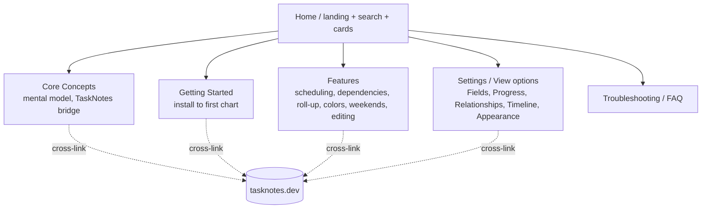

# TaskNotes Gantt Documentation Site - Plan

## Goal Capsule

- **Objective:** Publish a canonical, searchable documentation website for TaskNotes Gantt on GitHub Pages that lets users — including those who have never used TaskNotes — set up the plugin and understand every shipped feature without filing an issue.
- **Product authority:** Maintainer (renatomen). Solo project; GitHub Issues = active work.
- **Open blockers:** None. The generator decision is now resolved (Material for MkDocs — see KTD1). Real demo-image capture is deferred to a maintainer-driven tng-demo pass (KTD4); the autonomous build ships content with image placeholders.
- **Execution profile:** Docs-only, no runtime behavior change. Verification is a strict site build (`mkdocs build --strict`), not unit tests. The only source edit is slimming `README.md`.
- **Product Contract preservation:** unchanged — planning added HOW without altering any R-ID.

---

## Product Contract

### Summary

Build a GitHub Pages documentation site that becomes the authoritative source for TaskNotes Gantt: a left-sidebar reference with built-in search, mirroring the [tasknotes.dev](https://tasknotes.dev) structure and look, where every shipped feature and setting gets its own unambiguous, image-backed chapter (the interdependent behaviors like dependency-arrow modes and parent↔child cascades that a feature list can't convey). The README shrinks to a short overview plus feature list that links into the site. The site cross-links heavily to tasknotes.dev so Gantt-first users who don't know TaskNotes can still orient.

### Problem Frame

TaskNotes Gantt has a dense, interdependent feature surface with real consequences — dragging a parent moves its whole subtree, a child's dates reshape the parent's span, and the `Dependency Arrows: All instances` setting changes what gets drawn. A feature list cannot convey any of this. A user reading a setting name in the README has no way to know what it does or what it affects. Each of these settings needs a chapter that states its behavior unambiguously and shows it with images.

Two forces compound the problem. First, the plugin is a companion to TaskNotes, so its behavior is expressed in TaskNotes' vocabulary (`scheduled`, `due`, `blockedBy`, statuses, field mappings) — but a growing share of users arrive for the Gantt without knowing TaskNotes at all, and today nothing bridges that gap. Second, setup spans Obsidian, the Bases core plugin, TaskNotes, and view-option mappings; getting a first chart on screen is where new users get stuck and reach for the issue tracker.

The README already tries to carry all of this and is near its limit. Growing it further produces a second "complete" authority that drifts from the plugin. The remedy is a real docs site that owns depth, with the README demoted to a front door.

### Key Decisions (product framing)

- **Site becomes canonical; README demoted.** One source of truth. The README keeps only a concise overview and feature list and links into the site for every "how".
- **Mirror tasknotes.dev's information architecture and visual style.** The shared audience already knows that shape, and a sibling look ("almost a clone, minus name and logo") reinforces the companion relationship. Concept-first ordering front-loads the interdependent-behavior warnings before the knobs.
- **Complete coverage of shipped features at launch; "beta" is a confidence label, not a maturity gap.** Every current setting gets a real chapter — no "coming soon" stubs. Features not yet built are absent until they ship.
- **Docs refreshed per release, not per PR.** Maintenance rides the existing tng-release / tng-demo rituals and the in-repo location, fitting the solo cadence.

### Requirements

**Positioning and coverage**

- R1. The site is the canonical, authoritative documentation for TaskNotes Gantt. The README is reduced to a short overview and feature list whose entries link into the site for any behavioral detail.
- R2. Coverage is complete for every shipped feature and view-option/setting at launch. Each user-facing setting has its own chapter. No stubs for shipped functionality; not-yet-built features are absent, not marked "coming soon".

**Content depth**

- R3. Each chapter states the behavior unambiguously, including consequences and cross-setting interactions — e.g. `Dependency Arrows: All instances` scope, a parent drag moving the child subtree, and a child's date change reshaping the parent span.
- R4. Every chapter describing a visible behavior includes demonstrating imagery: screenshots for static states, GIFs for behaviors (drag-to-reschedule, resize, dependency create/delete, cascade).
- R5. A Core Concepts layer explains the mental model before the settings: TaskNotes as system of record, dates become bars, `blockedBy` becomes arrows, statuses become colors, parent/child roll-up, and the limits of read-only (no-TaskNotes) mode.

**Information architecture**

- R6. Navigation mirrors the tasknotes.dev spine — Home, Core Concepts, Getting Started, Features, Settings / View options (exhaustive reference), Integrations / Companion, Troubleshooting / FAQ — presented as a left sidebar with built-in client-side search and a card-based homepage.
- R7. Getting Started is a linear path from zero to a working chart: install (BRAT or manual + build-provenance verify), enable Bases, add the TaskNotes Gantt view, map start/end (and optional parent) properties, first render.

**TaskNotes cross-referencing**

- R8. Wherever a TaskNotes concept is invoked, the docs cross-link to the relevant tasknotes.dev page rather than re-explaining it, and a short "New to TaskNotes?" bridge appears early (Core Concepts / Getting Started). Cross-linking is a first-class, recurring requirement, not an occasional courtesy.
- R9. The docs clearly distinguish companion mode (TaskNotes installed — read/write, arrows, status colors, native editing) from standalone mode (read-only timeline over any Base), and state which features exist in each.

**Visual design**

- R10. MVP styling is vanilla: rely on the chosen theme's defaults, no hand-written CSS to maintain (a small `extra.css` cloned from tasknotes.dev is allowed, not authored fresh).
- R11. Match tasknotes.dev's colors, typography, and layout so the site reads as a sibling of TaskNotes. Achieved by inheriting tasknotes.dev's Material theme configuration rather than authoring a new one (see KTD1).

**Publishing and assets**

- R12. Hosted on GitHub Pages. MVP uses the default `github.io` URL and a GitHub Actions build. A custom domain is deferred.
- R13. Demo imagery is produced through the existing tng-demo pipeline (real Obsidian, clean base theme, WDIO staging), committed under `docs/media/`, and referenced by pinned `raw.githubusercontent` URLs per the existing visual-assets conventions.

**Maintenance**

- R14. The site sources live in this repository. Refreshing affected chapters is part of cutting each release (tng-release / tng-demo); a release is not done until shipped behavior is reflected in the docs.

#### Site information architecture



### Key Flows

- F1. New Gantt-first user, unfamiliar with TaskNotes
  - **Trigger:** User lands on the site knowing only that they want a Gantt in Obsidian.
  - **Steps:** Homepage card routes to Getting Started; a "New to TaskNotes?" bridge links out to tasknotes.dev for the task model; the linear setup path takes them through install, Bases, adding the view, and property mapping; they reach a first rendered chart.
  - **Outcome:** A working Gantt without prior TaskNotes knowledge, and a clear sense of what TaskNotes adds.
  - **Covers R7, R8, R9.**

- F2. Existing user looks up one confusing setting
  - **Trigger:** User sees an option in the view (e.g. `Dependency Arrows: All instances`) and wants to know exactly what it does.
  - **Steps:** Built-in search or the Settings reference leads to that setting's chapter; the chapter states the behavior, its consequences, and its interactions, with an image.
  - **Outcome:** The user self-serves the answer instead of filing an issue.
  - **Covers R2, R3, R4, R6.**

### Success Criteria

- A user who has never used TaskNotes can reach a working Gantt using only the site.
- Every shipped setting is findable via search and has an unambiguous chapter (image or a marked image placeholder pending the tng-demo pass).
- Inbound GitHub issues that are really "how do I / what does this setting do" measurably drop as users self-serve.
- The site reads as a sibling of tasknotes.dev to someone who knows that site.

### Scope Boundaries

**Deferred for later**

- Custom domain (MVP uses `github.io`).
- Documentation for not-yet-built features (non-FS dependency authoring, edit-modal Save/Delete) until they ship.
- Interactive or embedded live demos beyond static images/GIFs.
- Localization / multiple languages.

**Outside this effort**

- Re-explaining TaskNotes' own features — those live on tasknotes.dev and are linked, not duplicated.

### Dependencies / Assumptions

- Assumes tasknotes.dev stays available and reasonably stable as a cross-link and visual reference.
- Assumes the tng-demo pipeline can capture the required GIFs/screenshots in real Obsidian (confirmed workable on this machine).
- Requires GitHub Pages enabled for the repository (source = GitHub Actions).

---

## Planning Contract

### Key Technical Decisions

- KTD1. **Generator: Material for MkDocs, cloning tasknotes.dev's theme block.** Verified that tasknotes.dev runs Material for MkDocs (`mkdocs.yml` present in `callumalpass/tasknotes`). Cloning its `theme` configuration — `material` theme; `deep purple`/`purple` palette with auto/light(`default`)/dark(`slate`) toggle; `Lexend` text + `JetBrains Mono` code fonts; `navigation.sections`, `navigation.top`, `navigation.tracking`, `search.suggest`, `search.highlight`, `content.code.copy`, `toc.follow`; and the `pymdownx` markdown-extension set (`admonition`, `pymdownx.superfences`, `pymdownx.details`, `attr_list`, `md_in_html`, `def_list`, `footnotes`, `toc` permalinks, twemoji) — delivers R11 visual parity almost for free while authoring stays pure Markdown (R10). Material's built-in client-side search satisfies the core "users self-serve" goal with no plugin.
- KTD2. **Site lives in a dedicated top-level `website/` directory,** not the repo's existing `docs/` (which holds plans, conventions, and solutions). `mkdocs.yml` sits in `website/` with `docs_dir: docs` resolving to `website/docs/`. This avoids MkDocs ingesting the engineering `docs/` tree.
- KTD3. **Publish via GitHub Actions** (Material's recommended path), not the classic branch-based Jekyll auto-build — MkDocs requires a build step. A workflow installs pinned `mkdocs-material` from `website/requirements.txt`, runs `mkdocs build --strict`, and deploys with the official Pages actions (`upload-pages-artifact` + `deploy-pages`, `permissions: pages: write, id-token: write`). Enabling Pages with source = GitHub Actions is a one-time manual step (Definition of Done).
- KTD4. **Real demo-image capture is deferred to a maintainer-driven tng-demo pass.** The autonomous build ships complete structure and prose with clearly-marked image placeholders (e.g. an `!!! note "📷 demo pending"` admonition or a placeholder asset). Rationale: capturing real-Obsidian screenshots/GIFs needs the tng-demo pipeline plus maintainer review and cannot be produced reliably in an autonomous run. Final images follow R13 (committed to `docs/media/`, referenced by pinned `raw.githubusercontent` URLs).
- KTD5. **The Settings reference mirrors the plugin's own five option groups** from `src/bases/viewOptions.ts` — Fields, Progress, Relationships, Timeline, Appearance — plus the toolbar theme mode. That file is the authoritative inventory. Companion-only controls (the whole Relationships group, Progress mode, Time Estimate Update) carry an explicit companion/standalone marker per R9.
- KTD6. **Cross-linking is implemented as a reusable snippet,** not ad-hoc links: a "New to TaskNotes?" admonition pattern plus inline links to specific tasknotes.dev pages (`core-concepts`, `features/task-management`, the API pages where relevant) wherever a TaskNotes concept appears (R8).

### Assumptions (auto-resolved in pipeline mode)

- A1. MVP uses the `github.io` URL; custom domain deferred (R12).
- A2. The site is content-complete at PR time but not image-complete: real demo images are the deferred tng-demo follow-up (KTD4).
- A3. The README is slimmed in the same PR (R1), retaining the submission-critical Requirements, Transparency & disclosure, and build-provenance sections (each pointing to the site for depth) while moving usage/feature how-to into the site.
- A4. Python + MkDocs is a new toolchain in this Node repo, used only in CI and optional local preview; `website/requirements.txt` pins `mkdocs-material`.

### Output Structure

```text
website/
  mkdocs.yml                     # cloned theme block; nav; markdown_extensions
  requirements.txt               # pinned mkdocs-material
  docs/
    index.md                     # homepage: hero + grid cards + search
    core-concepts.md
    getting-started.md
    features/
      scheduling.md
      dependencies.md
      parent-child.md
      appearance.md              # colors, icons, weekends, indicators
      editing.md
    settings/
      index.md
      fields.md
      progress.md
      relationships.md
      timeline.md
      appearance.md
    troubleshooting.md
    stylesheets/
      extra.css                  # optional, cloned/minimal
    includes/
      new-to-tasknotes.md        # reusable cross-link snippet
.github/workflows/docs.yml       # build + deploy to Pages
README.md                        # slimmed (R1)
```

The per-unit `**Files:**` lists remain authoritative; the tree is a scope declaration, adjustable if implementation reveals a better layout.

### Sequencing

U1 → U2 establish the buildable, deployable shell first (fail fast on tooling). U3–U6 author content in parallel-friendly order once the shell builds. U7 (README slim) can land any time after U1 exists to link to. Image capture is deferred follow-up work.

---

## Implementation Units

### U1. Scaffold MkDocs site and theme parity

- **Goal:** A buildable Material for MkDocs site under `website/` that visually parallels tasknotes.dev, with a card-based homepage.
- **Requirements:** R6, R10, R11.
- **Dependencies:** none.
- **Files:** `website/mkdocs.yml`, `website/requirements.txt`, `website/docs/index.md`, `website/docs/stylesheets/extra.css`, `.gitignore` (append `website/site/`).
- **Approach:** In `mkdocs.yml` set `site_name: TaskNotes Gantt Documentation`, `repo_url`/`repo_name` → `renatomen/tasknotes-gantt`, `site_url` → the project `github.io` URL. Clone the `theme`, `markdown_extensions`, and `extra_css` blocks from tasknotes.dev's `mkdocs.yml` (see KTD1) verbatim except site-identity fields. `index.md` uses Material grid cards (`<div class="grid cards" markdown>` with `attr_list`/`md_in_html`) linking to Getting Started, the Settings reference, Dependencies, and Troubleshooting, plus a hero line and a hero screenshot placeholder. Pin `mkdocs-material` in `requirements.txt`.
- **Patterns to follow:** tasknotes.dev `mkdocs.yml` (fetched during planning) as the theme template; Material for MkDocs "grid cards" for the homepage.
- **Test scenarios:** Test expectation: none — scaffold/config. **Verification:** `cd website && pip install -r requirements.txt && mkdocs build --strict` exits 0 with no warnings; the homepage renders cards and the theme shows the deep-purple palette with a working light/dark toggle and search box.

### U2. GitHub Pages deployment workflow

- **Goal:** Pushes that touch the site build and deploy it to GitHub Pages automatically.
- **Requirements:** R12.
- **Dependencies:** U1.
- **Files:** `.github/workflows/docs.yml`.
- **Approach:** Trigger on `push` to the default branch filtered to `website/**` (plus manual `workflow_dispatch`). Job: checkout, `setup-python`, `pip install -r website/requirements.txt`, `mkdocs build --strict -f website/mkdocs.yml`, then deploy via `actions/upload-pages-artifact` + `actions/deploy-pages` with `permissions: pages: write, id-token: write` and the `github-pages` environment. Do not weaken `--strict`.
- **Patterns to follow:** the repo's existing `.github/workflows/` conventions for triggers and pinned action versions; Material for MkDocs' official GitHub Pages Actions deployment.
- **Test scenarios:** Test expectation: none — CI config. **Verification:** the workflow runs green on a push under `website/`; the Pages deployment publishes and the site is reachable at the `github.io` URL.

### U3. Core Concepts and Getting Started

- **Goal:** The mental-model layer and the zero-to-first-chart path, both heavy with tasknotes.dev cross-links.
- **Requirements:** R5, R7, R8, R9.
- **Dependencies:** U1.
- **Files:** `website/docs/core-concepts.md`, `website/docs/getting-started.md`, `website/docs/includes/new-to-tasknotes.md`.
- **Approach:** Core Concepts explains TaskNotes as system of record, dates→bars, `blockedBy`→arrows, statuses→colors, parent/child roll-up, and the read-only (standalone) mode's limits — opening with the reusable "New to TaskNotes?" bridge (U6/KTD6) and linking each TaskNotes term to its tasknotes.dev page. Getting Started is a numbered path: install (BRAT and manual + `gh attestation verify` provenance), enable the Bases core plugin, add the TaskNotes Gantt view to a Base, map Start/End (and optional Parent) properties, first render. Mark companion-only steps clearly (R9).
- **Patterns to follow:** README's existing "With TaskNotes / Without TaskNotes / Requirements / Installation / Usage" prose as source material; Material admonitions for the bridge and warnings.
- **Test scenarios:** Test expectation: none — prose. **Verification:** `mkdocs build --strict` resolves every internal and cross-link; a reader can follow install→first-chart with no undefined TaskNotes term.

### U4. Feature guides

- **Goal:** One unambiguous chapter per feature area, including consequences and cross-setting interactions.
- **Requirements:** R3, R4, R9.
- **Dependencies:** U1, U3.
- **Files:** `website/docs/features/scheduling.md`, `website/docs/features/dependencies.md`, `website/docs/features/parent-child.md`, `website/docs/features/appearance.md`, `website/docs/features/editing.md`.
- **Approach:** Scheduling — bars from Start/End, drag-to-reschedule, resize duration, undated/partial-date handling, time-estimate inference. Dependencies — the four RFC 9253 reltypes, `Dependency Arrows` Primary-vs-All-instances scope and what "All instances" additionally draws, create/delete FS by dragging, gap/lag. Parent/child — roll-up nesting, parent drag moves the subtree, child date change reshaping the parent span, and the `Parent date updates` Ask/Auto/Never interaction. Appearance — status/priority colors, bar color mode/source, task icons, weekend highlighting (and its day/hour-scale-only behavior), date-status indicators. Editing — click/modal/menu behavior, TaskNotes context menu, companion-only nature. Each visible behavior gets an image placeholder (KTD4). Mark companion vs standalone per feature (R9).
- **Patterns to follow:** README feature descriptions; `src/bases/*` behavior as the source of truth for what each feature does.
- **Test scenarios:** Test expectation: none — prose. **Verification:** `mkdocs build --strict` passes; each chapter names the setting(s) it depends on and their consequences; every behavioral claim has an image or a marked placeholder.

### U5. Settings / View-options reference

- **Goal:** An exhaustive, authoritative chapter set covering every shipped view option, grouped as the plugin groups them.
- **Requirements:** R2, R3, R9.
- **Dependencies:** U1.
- **Files:** `website/docs/settings/index.md`, `website/docs/settings/fields.md`, `website/docs/settings/progress.md`, `website/docs/settings/relationships.md`, `website/docs/settings/timeline.md`, `website/docs/settings/appearance.md`.
- **Approach:** Enumerate every option from `src/bases/viewOptions.ts` under its native group — Fields (Task Name, Start Date, End Date, Parent, Status, Priority, Time Estimate Property, Time Estimate Update), Progress (Progress Property, Progress mode), Relationships (Expanded relationships, Expanded items opacity, Hide top-level subtasks), Timeline (Default Scale, Highlight weekends, Default task duration, Dependency Arrows, Parent date updates, Show tasks with no dates, Show tasks with only one date), Appearance (Bar color mode, Bar color source, Task icon, Show date-status indicators, Show toolbar, Min/Max height, Table width) — plus the toolbar theme mode. For each: default, allowed values, behavior, and a companion-only/standalone marker (R9) where the code gates it. Cross-link deep behaviors to the matching feature guide (U4). Image placeholders where a setting is visual.
- **Patterns to follow:** `src/bases/viewOptions.ts` is the inventory and the source for defaults, value maps, and companion-only gating; Material `def_list`/tables for the value/default rows.
- **Test scenarios:** Test expectation: none — reference prose. **Verification:** every option key in `src/bases/viewOptions.ts` appears in exactly one settings chapter with its correct default and value set; `mkdocs build --strict` passes.

### U6. Troubleshooting, navigation wiring, and cross-link snippet

- **Goal:** A FAQ/troubleshooting page, the reusable TaskNotes bridge, and the full nav tree.
- **Requirements:** R6, R8.
- **Dependencies:** U1, U3, U4, U5.
- **Files:** `website/docs/troubleshooting.md`, `website/docs/includes/new-to-tasknotes.md` (finalize), `website/mkdocs.yml` (nav).
- **Approach:** Troubleshooting covers the common gotchas that generate issues — no bars (Start/End not mapped), no arrows or status colors (TaskNotes not installed / standalone mode), weekend shading absent at week/month scale, progress handle read-only (mode/property mismatch), etc. Finalize the "New to TaskNotes?" snippet used across pages (KTD6). Wire the complete `nav:` in `mkdocs.yml` mirroring the IA (Home, Core Concepts, Getting Started, Features, Settings, Troubleshooting), matching the tasknotes.dev section shape.
- **Patterns to follow:** tasknotes.dev `nav:` structure; `docs/solutions/integration-issues/*` for real gotcha material.
- **Test scenarios:** Test expectation: none — prose/config. **Verification:** the rendered sidebar shows the full tree; every page is reachable from nav; `mkdocs build --strict` passes with no orphaned pages.

### U7. Slim the README to a front door

- **Goal:** README becomes a concise overview + feature list that links into the canonical site.
- **Requirements:** R1.
- **Dependencies:** U1 (needs the site to link to).
- **Files:** `README.md`.
- **Approach:** Keep a one-paragraph description, the feature list (as a list, each item linking to its site chapter), a one-line install summary linking to Getting Started, and the submission-critical Requirements, Transparency & disclosure, and build-provenance sections (A3) — each pointing to the site for depth. Move usage/feature how-to detail out to the site. Add a prominent "📖 Full documentation: <site URL>" link near the top.
- **Patterns to follow:** current `README.md` sections; preserve the "Relationship to TaskNotes", License, and disclosure content.
- **Test scenarios:** Test expectation: none — docs. **Verification:** README no longer duplicates how-to depth; every feature-list item and the transparency/requirements sections link to the site; no broken links.

### Deferred to Follow-Up Work

- **Demo image capture (tng-demo pass).** Capture real-Obsidian screenshots and GIFs for every placeholder in U3–U5 via the tng-demo pipeline, commit to `docs/media/`, and swap placeholders for pinned `raw.githubusercontent` URLs (R4, R13, KTD4). Maintainer-driven; required before the docs are "launch-complete".
- **Custom domain** (R12).
- **Docs for not-yet-built features** — non-FS dependency authoring, edit-modal Save/Delete — when they ship.

---

## Verification Contract

| Gate | Command / action | Applies to | Done signal |
|---|---|---|---|
| Strict build | `cd website && mkdocs build --strict` | U1, U3–U7 | Exit 0, zero warnings, no broken internal links |
| Local preview | `cd website && mkdocs serve` | U1, U3–U6 | Theme parallels tasknotes.dev; search, light/dark toggle, nav all work |
| CI deploy | Push under `website/**`; watch the docs workflow | U2 | Workflow green; site live at the `github.io` URL |
| Settings completeness | Diff option keys in `src/bases/viewOptions.ts` against the settings chapters | U5 | Every key documented exactly once with correct default/values |
| Repo tests intact | Existing `npm test` / e2e | whole change | Unchanged and green (docs-only; only `README.md` edited in `src`-adjacent scope) |

No new Jest or WebdriverIO tests are warranted — this change ships no runtime behavior. `mkdocs build --strict` is the effective test.

---

## Definition of Done

- `website/` Material for MkDocs site builds under `--strict` and visually parallels tasknotes.dev (deep-purple palette, Lexend/JetBrains Mono, sectioned left nav, built-in search).
- Content units authored: Core Concepts, Getting Started, all five Feature guides, the full Settings reference covering every `src/bases/viewOptions.ts` option, and Troubleshooting — with tasknotes.dev cross-links and companion/standalone markers throughout.
- Image placeholders present everywhere a behavior is shown, with the tng-demo capture tracked as follow-up.
- `.github/workflows/docs.yml` present and green; Pages configured with source = GitHub Actions (one-time manual step performed by the maintainer).
- `README.md` slimmed to a front door per R1, retaining Requirements, Transparency & disclosure, and provenance.
- No behavior change to the plugin; existing tests unaffected.

---

## Sources & Research

- [README.md](../../README.md) — current feature surface, companion vs read-only modes, transparency and build-provenance sections the site absorbs and reorganizes.
- [src/bases/viewOptions.ts](../../src/bases/viewOptions.ts) — authoritative inventory of every view option, grouping, default, value map, and companion-only gating (drives U5 and the Settings IA).
- [tasknotes.dev](https://tasknotes.dev) and `callumalpass/tasknotes` `mkdocs.yml` — verified Material for MkDocs; the theme/nav/extensions template cloned in U1 (KTD1).
- [docs/conventions/visual-assets.md](../conventions/visual-assets.md) — media placement and pinned-URL conventions for the deferred image pass (R13).
- [docs/architecture/standards-alignment.md](../architecture/standards-alignment.md) — RFC 5545 / 9253 grounding for the dependency and scheduling chapters (U4).
- [docs/solutions/integration-issues/](../solutions/integration-issues/) — real gotcha material for Troubleshooting (U6).
