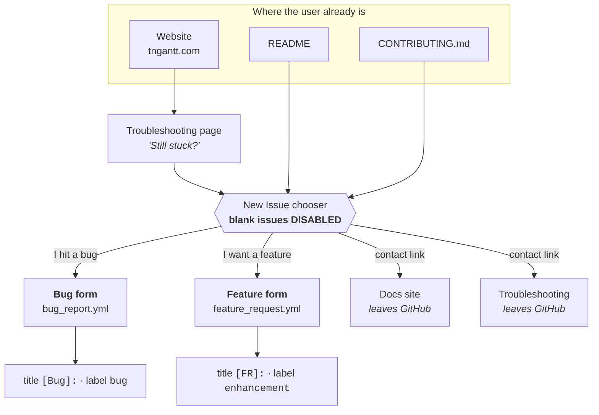
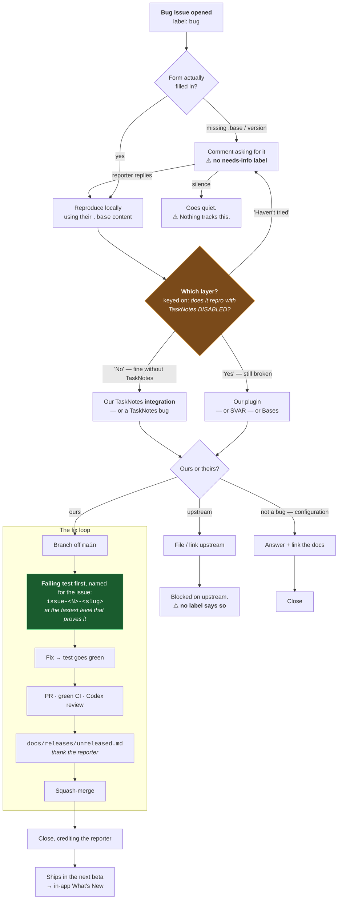
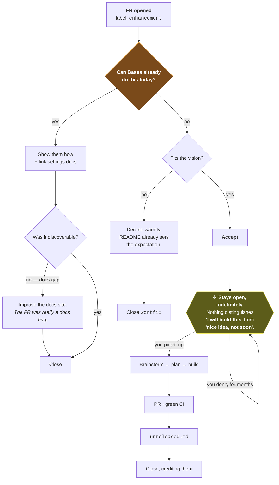
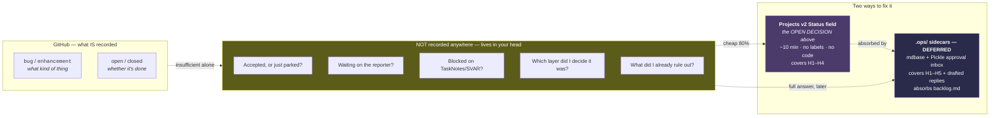

# Issue Intake Infrastructure - Plan

> **PAUSED 2026-07-14 — read this first on resume.**
>
> Nothing has been implemented. The plan is implementation-ready **except** for one
> decision that was surfaced after the plan was written and is not yet made:
> **should a GitHub Projects v2 `Status` field carry lifecycle state?** (See
> *Open Decision: lifecycle stages*, below.) That decision changes R5's accepted
> consequence and would add a sixth unit — settle it before starting U1.
>
> Everything else is decided. Paused to do bug-fixing first.

## Goal Capsule

**Objective.** The plugin website is live at `tngantt.com` and invites feedback, but the repository has no intake path: no issue templates, and only a one-line pointer telling a user how to report anything. Build the intake layer so an inbound report arrives actionable.

**Product authority.** Maintainer (`renatomen`), decided in the 2026-07-13 brainstorm.

**Open blockers.** None.

**Product Contract preservation.** Changed: **R4** — planning research found the reporting funnel *partly exists* (`CONTRIBUTING.md` has a "Reporting bugs and requesting features" section; `website/docs/troubleshooting.md` ends with a "Still stuck?" issue link). The brainstorm asserted neither existed. R4 is narrowed from *build a funnel* to *upgrade a thin one*. All other requirements (R1, R2, R3, R5, R6, R7) are unchanged.

---

## Problem Frame

The plugin sits in a four-layer stack: **Obsidian Bases → TaskNotes Gantt → SVAR Gantt → TaskNotes (optional)**. A symptom like "the bar didn't move" can originate in any of them, and two of those layers we do not control. This is the defining property of our triage problem, and one TaskNotes does not share — so the intake design must diverge from theirs precisely here.

Today there is no `.github/ISSUE_TEMPLATE/` directory at all. Reports arrive as blank textareas: no plugin version, no Obsidian version, no `.base` view configuration, no console output, and no signal about which layer failed. Every report therefore costs at least one round-trip before triage can even begin.

**Scope boundary.** This plan covers the **intake layer only**. The `.ops`/`mdbase`/Pickle triage stack is deliberately deferred — see Deferred Work.

---

## Product Contract

### R1 — Bug report form

A structured GitHub issue form (`.github/ISSUE_TEMPLATE/bug_report.yml`) collecting what is needed to reproduce a bug in a four-layer stack:

- **Environment**: TaskNotes Gantt version, Obsidian version, operating system.
- **Layer disambiguation** — the field set that distinguishes us from TaskNotes:
  - Is TaskNotes installed, and if so which version?
  - Does the problem still reproduce with **TaskNotes disabled**? (A required choice. This single answer splits the triage tree in half.)
- **The `.base` file content** — the view configuration is our equivalent of a stack trace, since behavior is driven by it. Rendered as YAML.
- **What happened vs. what was expected**, and steps to reproduce.
- **Console output** from Obsidian developer tools.
- **Screenshot or recording**, since most of our surface is visual.

Only the description and the TaskNotes-disabled question are required; the rest are optional-but-prompted, following TaskNotes' pattern of asking without gatekeeping. Carries the `bug` label and a `[Bug]: ` title prefix.

The form must instruct reporters to strip private vault content, paths, and credentials before posting.

### R2 — Feature request form

A deliberately light form (`.github/ISSUE_TEMPLATE/feature_request.yml`), following TaskNotes' judgment that heavy FR forms suppress submissions without improving them.

It must, however, ask one question TaskNotes' does not: **can this already be achieved through Bases configuration?** TaskNotes' own agent guidance states that not all requests need implementing, and that the first triage step is to establish whether Bases can already do it. Surfacing that at intake moves the check upstream to the person best placed to answer it.

Carries the `enhancement` label and an `[FR]: ` title prefix.

### R3 — Intake routing

`.github/ISSUE_TEMPLATE/config.yml` with `blank_issues_enabled: false` and contact links to the documentation site.

**Single backlog.** GitHub Issues is the one inbound list. Discussions stay **disabled** — a deliberate choice: discussions tend to be abandoned and become redundant once correlated issues attract the real attention.

### R4 — Reporting funnel (revised — upgrade, not create)

The funnel exists but is thin. Upgrade the three touchpoints so a user can find the reporting path from where they already are, and so it points at the new forms:

- `README.md` — the Status section already says *"I genuinely welcome feedback and requests"* but links nowhere. Give it the link.
- `CONTRIBUTING.md` — the existing one-line "Reporting bugs and requesting features" section becomes a real pointer to the forms.
- `website/docs/troubleshooting.md` — the "Still stuck?" link already exists; point it at the bug form specifically rather than the issues index.

### R5 — Label set

**Minimal, in the TaskNotes mould — add no new taxonomy.** In practice this resolves to **zero label changes**; it is recorded so the decision is not revisited.

- **Keep the stock set**: `bug`, `enhancement`, `documentation`, `question`, `duplicate`, `wontfix`, `good first issue`, `help wanted`, `invalid`.
- **Keep the three domain labels already earning their keep** on roadmap issues #86–#91: `epic`, `dependencies`, `scheduling`.
- **Keep** `automated`, `clean`, `sync`. Verified as applied to **16 historical PRs each**. No current workflow applies them, so they are orphaned from retired automation — but they are real history, not junk. **Do not delete.**
- **Add nothing.** No funnel axis (`needs-info` / `accepted` / `parked`), no upstream axis, no area axis.

The forms apply `bug` and `enhancement`, both of which already exist.

**Accepted consequence — recorded deliberately.** With a single backlog and no funnel labels, nothing on an issue distinguishes *accepted work* from *a parked wish* from *waiting on the reporter*. TaskNotes tolerates this only because that state lives in their `.ops/` sidecars, not in their labels. Until `.ops/` exists here, that state lives in the maintainer's head. Judged acceptable at the current volume (11 open issues), and it is the primary trigger for building the deferred triage layer.

### R6 — Known wart: the `dependencies` collision

`dependencies` currently carries **two meanings simultaneously**: the RFC 9253 task-dependency domain (12 issues) and Dependabot's conventional meaning (17 PRs).

**Decision: leave it.** npm version-update PRs are already disabled (`open-pull-requests-limit: 0` in `.github/dependabot.yml`), so Dependabot only opens rare security PRs; the collision is real but nearly dormant, and it spans two lists (issues vs. PRs) that are rarely read together. Renaming is the cheap fix if it ever bites — GitHub retags automatically on rename, losing no history.

### R7 — Issue-named regression tests

Adopt TaskNotes' convention: a fixed issue leaves behind a regression test named for it.

- e2e: `test/specs/issues/issue-<N>-<slug>.e2e.ts`
- unit: `test/unit/issues/issue-<N>-<slug>.test.ts`

Near-zero cost, fits the existing test-first culture, and it is the highest-compounding item here: it converts every bug report into a permanent guarantee.

---

## Planning Contract

### Key Technical Decisions

**KTD1 — GitHub issue *forms* (YAML), not issue *templates* (markdown).**
Forms give typed, required fields and dropdowns; markdown templates give a pre-filled textarea a reporter can delete wholesale. The four-layer disambiguation (R1) only works if the TaskNotes-disabled question is a *required control* rather than a prompt the reporter can silently ignore. TaskNotes uses forms; so do we.

**KTD2 — The `.base` content field is the single highest-value field, and it is ours alone.**
Behavior is driven by the Base view configuration. Without it, most bug reports are unreproducible regardless of what else they contain. TaskNotes asks for it too, but as one of several; for us it is closer to a stack trace. Render it as `yaml`.

**KTD3 — "Does it reproduce with TaskNotes disabled?" is a required dropdown, not free text.**
This is the only field that structurally splits the triage tree. As free text it degrades to "I think so"; as a required three-way choice (`Yes` / `No` / `Haven't tried`) it is machine-scannable and honest — `Haven't tried` is a legitimate answer and must be offered, or reporters will guess.

**KTD4 — No CI validation of the form YAML; verify once, manually.**
A malformed issue form silently vanishes from the New Issue chooser with no local signal and no CI failure — a real trap. But these are two static files that will change roughly never, and a permanent CI job to guard a one-time risk is carrying cost with no ongoing benefit. Verification is a one-time manual smoke of the New Issue chooser after merge (see Verification Contract).

**KTD5 — The issue-named test convention needs no config change.**
Verified: the WDIO spec glob is `../specs/**/*.e2e.ts` (recursive, with `**/*.perf.e2e.ts` excluded) in `test/wdio/wdio.conf.mts`, and Jest uses `testMatch: ["**/*.test.ts"]` rooted at `test/`. A new `issues/` subdirectory under either is picked up automatically. R7 is therefore a documentation-and-habit unit, not a plumbing one — no directories are created speculatively; the first real issue-fix creates its own.

**KTD6 — The forms carry the README's expectation-setting.**
The README explicitly disclaims an SLA: *"I genuinely welcome feedback and requests; I just can't promise to answer quickly."* Forms that thank a reporter without repeating that would imply a responsiveness the project has deliberately declined to promise. Each form's intro markdown block carries the same tone, linking to the development-cadence page.

### Requirements Trace

| Unit | Advances |
|---|---|
| U1 | R1, KTD1, KTD2, KTD3, KTD6 |
| U2 | R2, KTD6 |
| U3 | R3 |
| U4 | R4 |
| U5 | R7, KTD5 |
| — | R5, R6 are deliberate no-ops; no unit implements them |

---

## Implementation Units

### U1. Bug report form

**Goal.** A structured form that yields a triageable bug report on first submission.

**Requirements.** R1. Applies KTD1, KTD2, KTD3, KTD6.

**Dependencies.** None.

**Files.**
- Create `.github/ISSUE_TEMPLATE/bug_report.yml`

**Approach.** GitHub issue-form YAML: `name`, `description`, `title: "[Bug]: "`, `labels: ["bug"]`, then a `body` array.

Field order, front-loading what makes the report actionable:

1. `markdown` intro — thanks, the privacy warning (strip vault content, paths, credentials), and the KTD6 expectation-setting line linking to `https://tngantt.com/development-cadence/`.
2. `input` — **TaskNotes Gantt version** (required).
3. `input` — **Obsidian version** (required).
4. `dropdown` — **Does it still reproduce with TaskNotes disabled?** Options: `Yes — still broken without TaskNotes`, `No — works fine once TaskNotes is disabled`, `Haven't tried`. **Required** (KTD3).
5. `input` — **TaskNotes version** (optional; blank means not installed).
6. `textarea` — **What happened, and what did you expect?** Required.
7. `textarea` — **Steps to reproduce.** Optional.
8. `textarea` — **Your `.base` file content**, `render: yaml` (KTD2). Description must explain *where to find it* — a reporter who doesn't know Bases stores a `.base` file will otherwise skip the single most valuable field.
9. `textarea` — **Console output**, `render: text`. Description points to Obsidian developer tools.
10. `textarea` — **Screenshot or recording.** Optional.
11. `input` — **Operating system.** Optional.

**Patterns to follow.** TaskNotes' `bug_report.yml` (`callumalpass/tasknotes`) is the structural model — the intro-markdown-then-fields shape, `render:` on paste-heavy textareas, and optional-but-prompted fields. Diverge on the layer-disambiguation fields, which it does not have.

**Test expectation: none** — static YAML config with no runtime surface. Covered by the Verification Contract's manual smoke.

**Verification.** The form appears in the repo's New Issue chooser; the TaskNotes-disabled dropdown blocks submission when unset; a submitted issue is titled `[Bug]: …` and carries the `bug` label.

---

### U2. Feature request form

**Goal.** A light FR form that front-loads the "can Bases already do this?" triage question.

**Requirements.** R2. Applies KTD6.

**Dependencies.** None.

**Files.**
- Create `.github/ISSUE_TEMPLATE/feature_request.yml`

**Approach.** `title: "[FR]: "`, `labels: ["enhancement"]`. Deliberately short:

1. `markdown` intro — the same KTD6 expectation-setting as U1, plus a line noting that not every request will be built, and that Bases is powerful enough that some requests are already achievable today.
2. `textarea` — **What do you want to do, and why?** Required. Prompt for the *problem*, not just the proposed solution.
3. `textarea` — **Have you tried achieving this through Bases configuration?** Optional. Description links to the settings docs.

Resist adding more. TaskNotes' FR form is a single box; ours adds exactly one field with a clear triage payoff.

**Patterns to follow.** TaskNotes' `feature_request.yml` — its brevity is the pattern, not an oversight.

**Test expectation: none** — static YAML config.

**Verification.** Appears in the New Issue chooser; a submission is titled `[FR]: …` and carries `enhancement`.

---

### U3. Intake routing

**Goal.** Blank issues become impossible; every issue enters through a form.

**Requirements.** R3.

**Dependencies.** U1, U2 (the chooser should not go live with forms missing).

**Files.**
- Create `.github/ISSUE_TEMPLATE/config.yml`

**Approach.** `blank_issues_enabled: false`, plus `contact_links` to the documentation site (`https://tngantt.com/`) and the troubleshooting page (`https://tngantt.com/troubleshooting/`). No Discussions link — Discussions stay disabled per R3.

**Verification.** The New Issue chooser shows exactly the two forms plus the contact links, and offers no blank-issue escape hatch.

**Execution note.** This is the unit whose failure mode is silent (KTD4). Land it with U1/U2 and smoke the chooser immediately after merge.

---

### U4. Upgrade the reporting funnel

**Goal.** A user who hits a bug finds the path to the form from wherever they already are.

**Requirements.** R4 (revised).

**Dependencies.** U1, U3 (links should not point at forms that don't exist yet).

**Files.**
- Modify `README.md` — the `## 💜 Status & pace` section already says *"I genuinely welcome feedback and requests"*. Make that sentence carry the link to the issue chooser.
- Modify `CONTRIBUTING.md` — expand the existing `## Reporting bugs and requesting features` section (currently one line) to name the two forms and state plainly what a good bug report contains: version, `.base` content, and the TaskNotes-disabled answer.
- Modify `website/docs/troubleshooting.md` — the existing `## Still stuck?` section links to the issues *index*; point it at the bug form directly (`/issues/new?template=bug_report.yml`) and mention what the form will ask for.

**Approach.** Editing three existing sections; no new pages, no `mkdocs.yml` nav change. Material for MkDocs already renders a GitHub link from `repo_url`, so the site-wide affordance exists — this is about the in-context paths.

**Patterns to follow.** Match the README's existing voice in the Status section (warm, candid, expectation-setting) rather than introducing process language.

**Test expectation: none** — documentation edits with no runtime surface.

**Verification.** From the live site's Troubleshooting page, a reader reaches the bug form in one click. `mkdocs build` succeeds with no broken-link warnings.

---

### U5. Document the issue-named regression-test convention

**Goal.** Every future bug fix leaves behind a regression test named for its issue.

**Requirements.** R7. Applies KTD5.

**Dependencies.** None (independent of U1–U4).

**Files.**
- Modify `docs/conventions/testing.md` — add the convention under the existing `## Test Structure` section.
- Modify `CONTRIBUTING.md` — one line under Conventions, cross-referencing the above.

**Approach.** Document, don't scaffold. State the two paths (`test/specs/issues/issue-<N>-<slug>.e2e.ts`, `test/unit/issues/issue-<N>-<slug>.test.ts`), state that both globs already pick them up with no config change (KTD5), and state the rule: **a bug fix that closes an issue lands with a test named for that issue**, at the fastest level that actually proves it.

That last clause matters and must be written explicitly — the repo's existing convention is to test at the fastest reliable level, and a naive reading of "every issue gets an e2e" would push slow, redundant e2e coverage for bugs a unit test proves faster. The issue-named convention governs *naming and traceability*, not *test level*.

Do not create the `issues/` directories speculatively. Empty directories are not tracked by git and would only add noise; the first real issue-fix creates its own.

**Test expectation: none** — documentation only.

**Verification.** `docs/conventions/testing.md` states the convention, the paths, and the fastest-reliable-level caveat.

---

## Verification Contract

Local gates (the repo's standard pre-commit set):

- `npm run lint` and `npm run typecheck` pass (the Husky pre-commit hook enforces both).
- `mkdocs build` succeeds from `website/` with no broken-link warnings (U4).
- No unit or e2e tests are added by this plan; the existing suites must remain green but are not otherwise exercised.

**Post-merge manual smoke (KTD4) — the only real verification this plan has, and it must actually be performed:**

1. Open `https://github.com/renatomen/tasknotes-gantt/issues/new/choose`.
2. Confirm **both** forms render — a missing form means malformed YAML, which fails silently.
3. Confirm there is **no** "Open a blank issue" escape hatch.
4. Confirm the contact links to the docs site resolve.
5. Open the bug form and confirm the **TaskNotes-disabled dropdown blocks submission** when left unset.

## Definition of Done

- `.github/ISSUE_TEMPLATE/` contains `bug_report.yml`, `feature_request.yml`, and `config.yml`.
- Blank issues are disabled; the New Issue chooser has been smoke-tested against all five steps above.
- README, CONTRIBUTING, and the website Troubleshooting page all route a user to the bug form.
- `docs/conventions/testing.md` documents the issue-named regression-test convention, including the fastest-reliable-level caveat.
- **No label was created, renamed, or deleted** (R5, R6).
- Landed as a single `chore:` PR from a branch off `main`, behind green CI.

---

## Scope Boundaries

### Non-goals

- **Discussions.** Deliberately not enabled.
- **A funnel/status label taxonomy.** Deliberately declined; revisit only alongside `.ops/`.
- **Creating, renaming, or deleting any label.** See R5 and R6.
- **A pull-request template.** Not part of this problem; the maintainer is the sole PR author today.
- **Automated triage, stale bots, or auto-labelling workflows.**
- **CI validation of the issue-form YAML.** See KTD4.

### Deferred to follow-up work

- **Renaming the `dependencies` label** if the Dependabot collision ever actually bites (R6).
- **Backfilling issue-named regression tests** for already-fixed issues. The convention applies going forward only; retrofitting 11 issues' worth of tests is not worth it.

---

## Deferred Work — the `.ops/` triage layer

Recorded so the decision is not re-litigated from scratch. This is the **intended successor to `docs/backlog.md`** and the resolution of the R5 accepted consequence.

The end-state, modelled on TaskNotes:

1. Each GitHub issue gets a **markdown sidecar** in a gitignored `.ops/` directory — an **mdbase** typed collection (`mdbase.yaml` + `_types/*.md` schemas, validated with `mdbase validate .`). Frontmatter holds queryable state (`local_status`, layer attribution, `draft_issue_comment`, `draft_close_reason`); the body holds analysis, plan, and handoff context.
2. An agent investigates and reproduces, then drafts its analysis and proposed reply **into the sidecar**.
3. The agent files a **Pickle** request into a local human-approval inbox; the maintainer approves **inside Obsidian** (`pickle-obsidian`); only on approval does anything post to GitHub. The agent never writes to GitHub directly — that inversion is what makes the system safe at volume.

Reference implementations, all public: `callumalpass/ops`, `callumalpass/mdbase` (+ `mdbase-spec`, `mdbase-cli`), `callumalpass/pickle`, `callumalpass/pickle-obsidian`, `callumalpass/pickle-obsidian-skill`, `callumalpass/tickle`.

**Trigger to build it:** when inbound volume outgrows what can be held in the maintainer's head — i.e. when the R5 accepted consequence starts costing real time. Not worth ~4 moving parts (including a Rust server and a daemon) at 11 open issues.

**When it lands, it should absorb `docs/backlog.md`,** delivering the single backlog that motivated R3.

---

## Open Decision: lifecycle stages (BLOCKS U1 — settle before implementing)

Raised 2026-07-14, after the plan was written. **Not yet decided.**

**The question:** can GitHub represent a configurable lifecycle stage without labels?

**What was verified empirically** (via `gh`, against this repo):

| Mechanism | Verdict |
|---|---|
| `state` | `open` / `closed`. Binary, not configurable. |
| `state_reason` | Fixed enum (`completed` / `not_planned` / `duplicate` / `reopened`). Only meaningful after close. |
| **Native Issue Types** (`type`) | **Unavailable.** `GET /issues/types` returns 404 — Issue Types are **organization-only**, and `renatomen` is a User account. |
| `milestone` | One per issue. Already in use as roadmap phases (M0–M4), not stages. |
| **Projects v2 custom fields** | **This is the mechanism.** A single-select `Status` field with self-defined options is literally "configurable stages". Not checked whether a project already exists — the local `gh` token lacks the `read:project` scope (`gh auth refresh -s read:project`). |

**Why it matters here.** R5 accepts the consequence that accepted-vs-parked, waiting-on-reporter, and blocked-upstream state "lives in the maintainer's head" until `.ops/` is built. **Projects v2 may make that consequence unnecessary.** A `Status` single-select (`Triage → Accepted → Blocked (upstream) → Parked → In progress → Done`) plus a `Layer` single-select (`ours / SVAR / Bases / TaskNotes`) would carry that state with **no new labels**, preserving R5 intact.

Three properties make it fit the constraints that drove R3 and R5:

- **It is not a second inbox.** The field renders in the issue's own right sidebar and is set from there. This is the structural difference from Discussions — Discussions rot because they are a *separate destination you must remember to visit*; a project field is an *annotation on the thing you are already looking at*.
- **It does not touch labels.** The minimal-label decision (R5) survives completely.
- **It is agent-readable and writable** — `gh project item-edit` and the GraphQL API — with built-in automations (auto-add new issues, auto-set Status on close).

**What it does not do.** Projects v2 gives *status*. `.ops/` gives *status + investigation write-up + drafted reply + human approval gate*. They are not competitors: Projects v2 is the cheap 80%, and a later `.ops/` would absorb it.

**If adopted,** this becomes U6 (roughly ten minutes of setup, no code), R5's "accepted consequence" paragraph is deleted, and the three ⚠️ nodes in the workflow diagrams below disappear.

---

## Open Questions

- Whether the `config.yml` contact links should also point somewhere for *questions*, given Discussions are off. Currently they point at the docs site and Troubleshooting; if question-shaped issues become noisy, revisit.

---

## Workflow Diagrams

The lifecycle these forms create, including the parts deliberately **not** built. The ⚠️ nodes
are the visible cost of minimal labels (R5) — they are what the Open Decision above would remove.

### Intake — how anyone reaches an issue at all

The two contact links deliberately send people **off GitHub** to the docs. That is the
substitute for Discussions: a "how do I do X" question should be answered by documentation,
not become an issue.

### Bug lifecycle — the four-layer triage

Every field in the bug form exists to serve the one orange decision node.

The green node is the compounding one: every closed bug leaves a permanently-named regression
test, so the backlog gets *safer* over time rather than just longer.

### Feature-request lifecycle — the Bases gate

### Where triage state actually lives

### Open questions on the workflow itself (unanswered)

1. Do accepted FRs stay **open forever**? Drawn that way (TaskNotes does exactly this — 2,100 open). Closing aggressively would change the FR lifecycle's shape.
2. **Upstream bugs**: drawn as "file upstream, keep ours open, remember it's blocked." Closing ours and letting the upstream issue be the record would remove one ⚠️ node.
3. **Docs-gap FRs**: drawn as spawning a docs improvement. Should that become its own `documentation` issue, or be fixed silently?

---

## Sources & Research

- `callumalpass/tasknotes` — `.github/ISSUE_TEMPLATE/{bug_report,feature_request,config}.yml` (structural model for U1–U3); `AGENTS.md` (the `.ops`/Pickle references and the "check whether Bases can already do it" triage principle behind R2); `e2e/issues/` and `tests/unit/issues/` (129 specs — the model for R7).
- `callumalpass/ops`, `mdbase`, `pickle`, `pickle-obsidian` — the deferred triage stack.
- Label usage verified against the live repo via `gh` (2026-07-13): `automated`/`clean`/`sync` on 16 PRs each; `dependencies` on 12 issues and 17 PRs.
- Glob recursion verified in `test/wdio/wdio.conf.mts` and `jest.config.js` (KTD5).
