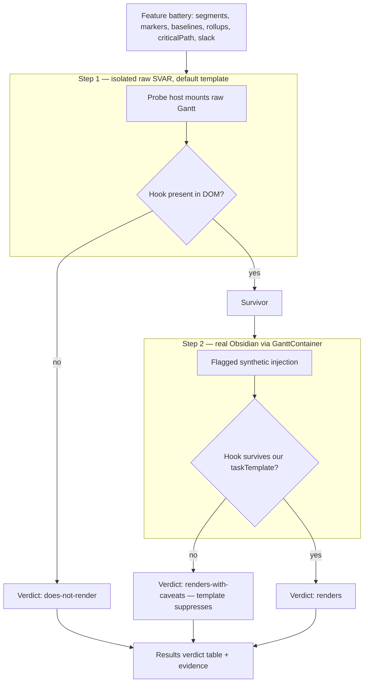

# SVAR Pro-Gated Feature Probe - Plan

## Goal Capsule

- **Objective:** Empirically determine which SVAR-Gantt "Pro"-documented features actually render in the plugin's bundled free/OSS build (`@svar-ui/svelte-gantt@^2.7.0`), starting with split-task/segments and markers.
- **Product authority:** Maintainer (Renato). The probe is an internal spike; there is no end-user.
- **Execution profile:** Throwaway spike. Observational specs are the deliverable; a "does-not-render" verdict is a valid result, not a test failure.
- **Open blockers:** None for building the probe. One flagged non-blocker: whether SVAR's license permits shipping features that render from the OSS bundle (Outstanding, not resolved here).

---

## Product Contract

Product Contract preservation: unchanged from the requirements-only source. Planning added the Planning Contract, Implementation Units, Verification Contract, and Definition of Done below.

### Summary

Build a disposable probe harness that feeds each SVAR "Pro"-documented feature the input it expects and observes whether the plugin's bundled free runtime renders it. Test in two steps — an isolated standalone Svelte sandbox first, then a real-Obsidian confirmation for anything that renders — and produce a per-feature render/does-not-render verdict with visual evidence.

### Problem Frame

SVAR's docs gate split-task, markers, baselines, and similar features behind a "Pro" tier, but SVAR Svelte Gantt is GPL-licensed open source and the plugin's bundled types already carry `segments?` and `splitTasks?`. So it is unknown whether "Pro" is a code boundary (the render path is stripped from the free build) or only a commercial-license boundary (the code is present and runs). That uncertainty currently blocks any decision to pursue features like rendering a discontinuous task — e.g. a recurring series — as spaced segments, where the plugin's present single `start→end` bar is actively misleading. A cheap probe settles the code-boundary question before any product design is invested.

### Key Decisions

- **Isolated sandbox before Obsidian.** The plugin renders bars through a custom `taskTemplate` → `BarContent.svelte`, and SVAR's segment/bar features are part of its default bar drawing. Testing in a clean sandbox first separates "the free runtime does not support it" from "our custom template suppresses it," so a negative result identifies which — rather than a false "no."
- **Render-ability, not ship-ability.** The probe answers whether a feature draws. Whether the plugin is licensed to ship it is a separate call, flagged but not resolved.
- **Rendering output, not authoring UX.** The probe judges visual output only; the Pro editing surfaces (split toolbar/menu, segment editor) are out of scope.

### Requirements

**Probe method and harness**

- R1. Provide a disposable standalone Svelte page that imports the same `@svar-ui/svelte-gantt` version the plugin bundles, uses SVAR's default templates (no custom `taskTemplate`), and renders a hardcoded dataset. It is scratch code, not a shipped plugin path.
- R2. Test each feature in two steps: (1) the isolated sandbox, to determine whether the free runtime renders it at all; (2) only for features that render, a real-Obsidian confirmation through the plugin's `GanttContainer`, including whether the feature survives the custom `taskTemplate` / `BarContent` for bar-level features.
- R3. Record a per-feature verdict — renders / renders-with-caveats / does-not-render — each backed by a captured visual observation (screenshot or written note) as evidence.

**Feature battery**

- R4. Split-task / segments: supply a task carrying a `segments` array and check whether spaced sub-bars render in one row. Note whether the `splitTasks` config flag is required, no-ops, or errors in the free build.
- R5. Markers: supply the `markers` array and check whether vertical marker lines render.
- R6. Sibling advanced-config features — baselines, rollups, `criticalPath`, slack — each probed by the same supply-the-input-and-observe method as R4/R5. Membership of this sibling set may be trimmed during planning.

**Outcome**

- R7. Produce a per-feature yes/no result table with evidence, sufficient for the maintainer to decide which features are worth pursuing as real features later.

### Scope Boundaries

- No product design of any probed feature. Rendering a recurring series (virtual or materialised) as segments — including windowing, per-occurrence completion styling, and subtasks-onto-parent — is deferred to a follow-up brainstorm. TaskNotes already ships `generateRecurringInstances` and a per-occurrence scheduled→due span mode, so that thread is warm when picked up.
- No data-source or adapter integration, no recurrence expansion, no persistence.
- No Pro authoring UX (split toolbar/menu, segment editor).
- No license or legal resolution.
- Probe code is throwaway; it is not intended to merge into shipped plugin rendering paths and may live on a spike branch.

### Outstanding Questions

**Deferred beyond this spike**

- Licensing: whether SVAR's license permits shipping "Pro" features that render from the OSS bundle.

---

## Planning Contract

### Key Technical Decisions

- KTD1. **Reuse the existing vitest-browser browser-runner for Step 1**, not a fresh Vite dev page, but under a dedicated probe config — not the perf config's include. `test/perf/isolated/` already runs real components in headless Chromium via `vitest-browser-svelte` + playwright, but its `include` matches only `*.perf.ts` under `test/perf/isolated/`; pointing `probe:svar` at that config would silently collect zero probe specs. Add `test/probe/vitest.config.ts` mirroring the perf config's svelte + browser-provider setup (dropping the obsidian alias if the raw host imports only `@svar-ui/svelte-gantt`) with `include: test/probe/**/*.probe.ts`. This resolves the "sandbox shape" open question and gives a real browser with no Obsidian for near-zero setup cost.
- KTD2. **Step 1 mounts the raw SVAR `<Gantt>` with default templates**, not the plugin's `GanttContainer`. `GanttPerfHost.svelte` mounts our container (custom `taskTemplate`), which would confound the runtime-support question; a new host importing `Gantt` directly from `@svar-ui/svelte-gantt` isolates the runtime answer.
- KTD3. **The render signal is presence of SVAR's documented CSS hooks** — `.wx-segments` / `.wx-segment` / `.wx-split` (segments), `.wx-baseline`, `.wx-rollup` / `.wx-task-rollup`, `.wx-critical`, `.wx-slack`, and the marker element — within the rendered DOM. Exact selectors and required inputs are verified against 2.7.0 at execution time; the SVAR skill (`.agents/skills/svar-svelte/gantt/index.md`) lists them.
- KTD4. **Verdicts are soft-recorded, not hard-asserted.** Each spec hard-gates only harness sanity (a plain task renders a `.wx-bar`) and a negative control (absent input → hook absent). Per-feature presence/absence is logged and written to a results artifact, so a genuine "does-not-render" is data, never a red suite that a CI-autofix loop would try to repair. Negative controls key on the per-item hook (e.g. `.wx-marker`, `.wx-segment`), not a container SVAR may always emit empty (e.g. `.wx-markers`).
- KTD5. **Step 2 injects feature inputs behind a throwaway probe flag** in the `GanttContainer` / `ganttSync` seam, gated off by default. Feature-enabling config (markers, baselines, `criticalPath`, slack, rollups) are `<Gantt>`-level props, so the seam touches the shipped component markup, not just task data — the flag-off path must leave the rendered output byte-unchanged. The probe is disposable and must not alter the shipped rendering path when the flag is off.

### High-Level Technical Design

### Assumptions

- The SVAR 2.7.0 OSS runtime includes the "Pro"-documented feature code (the bundled types carry `segments?` and `splitTasks?`). The probe validates this empirically; a genuinely absent feature yields a "does-not-render" verdict, which is a valid outcome rather than a plan failure.
- A dedicated `test/probe/vitest.config.ts` (KTD1) hosts the probe specs; the perf config's `include` is not reused because it matches only `*.perf.ts` under `test/perf/isolated/`.

### Sequencing

U1 → U2 → U3 (U2, U3 depend on the U1 host). U4 depends on the Step-1 survivors from U2/U3. U5 depends on U2–U4 verdicts.

---

## Implementation Units

### U1. Isolated raw-SVAR probe host

- **Goal:** A minimal Svelte host that mounts the raw `@svar-ui/svelte-gantt` `<Gantt>` with SVAR default templates over a hardcoded dataset, parameterized by which feature inputs/props to enable, and raises a render-complete sentinel.
- **Requirements:** R1, R2 (step 1).
- **Dependencies:** none.
- **Files:** `test/probe/SvarFeatureProbeHost.svelte` (new); `test/probe/fixtures.ts` (new, hardcoded tasks/links/segments/markers/baselines fixtures).
- **Approach:** Import `Gantt` directly (mirror the import in `src/bases/GanttContainer.svelte:7`); do not use `BarContent`/`taskTemplate`. Wrap `<Gantt>` in an explicit fixed-height container (a raw `<Gantt>` does not self-size the way `GanttContainer` does, and SVAR measures `chartHeight=0` → no bars → sentinel never fires). Accept props toggling each feature's input+config (segments+`splitTasks`, `markers`, `baselines`, `rollups`, `criticalPath`, `slack`). Raise a `data-render-complete` sentinel keyed on `.wx-bar` / `.wx-row` presence after mount — do not copy `GanttPerfHost`'s chart-height-gated settle logic, which depends on `GanttContainer`'s height resolution.
- **Patterns to follow:** `test/perf/isolated/GanttPerfHost.svelte` for the mount + sentinel; `test/perf/vitest.config.ts` for the browser runner.
- **Test scenarios:** Test expectation: none — host scaffolding, exercised by U2/U3 specs.
- **Verification:** The host compiles and mounts under the vitest-browser runner; a plain task renders a `.wx-bar` (harness sanity, asserted in U2).

### U2. Split-task/segments and markers probe specs (Step 1 core)

- **Goal:** Vitest-browser specs that mount the U1 host and record whether segments and markers render, plus the harness-sanity and negative-control hard gates.
- **Requirements:** R2 (step 1), R3, R4, R5, KTD4.
- **Dependencies:** U1.
- **Files:** `test/probe/svar-features.probe.ts` (new); `test/probe/vitest.config.ts` (new, per KTD1); `package.json` script `probe:svar` pointing at the probe config.
- **Approach:** For each feature, mount the host with the feature enabled, wait for the sentinel, query the documented hook (KTD3), and log + accumulate a verdict record. Hard-assert only harness sanity and negative control; soft-record feature presence.
- **Execution note:** Write the specs to observe, not to demand a render — a `does-not-render` verdict must leave the suite green.
- **Test scenarios:**
  - Harness sanity (hard gate): a plain task (no feature inputs) renders at least one `.wx-bar` within a `.wx-row`.
  - Negative control (hard gate): with no segments and no markers, none of `.wx-segment` / `.wx-segments` / the marker element are present.
  - Covers R4: a task with a 2-entry `segments` array and `splitTasks` enabled — record the count of `.wx-segment` (or `.wx-segments` container) elements within a single row; verdict = renders when ≥2 distinct segment pieces appear.
  - R4 flag check: the same `segments` array with `splitTasks` NOT set — record whether segment pieces still render (determines whether the flag is required, no-ops, or errors).
  - Covers R5: a `markers` array — record whether the marker element renders.
- **Verification:** `npm run probe:svar` (or the vitest-browser invocation) passes the two hard gates and emits segment/marker verdict records.

### U3. Sibling advanced-config probe specs (Step 1 remainder)

- **Goal:** Extend the Step-1 battery to baselines, rollups, `criticalPath`, and slack, recording each verdict by the same method.
- **Requirements:** R2 (step 1), R3, R6, KTD4.
- **Dependencies:** U1.
- **Files:** `test/probe/svar-features.probe.ts` (extend); `test/probe/fixtures.ts` (extend).
- **Approach:** Per feature, supply the minimal input (base_start/base_end for baselines, `rollup: true` children for rollups, a critical link/config for `criticalPath`, slack config) plus its enabling prop, and record presence of `.wx-baseline` / `.wx-rollup` (or `.wx-task-rollup`) / `.wx-critical` / `.wx-slack`.
- **Execution note:** Exact per-feature inputs and selectors are execution-time discovery against 2.7.0 — verify each before asserting; if a feature needs data the fixtures lack, add a minimal hardcoded fixture rather than wiring the real generator.
- **Test scenarios:**
  - Covers R6 (baselines): task with base dates → record `.wx-baseline` presence.
  - Covers R6 (rollups): summary with `rollup: true` children → record `.wx-rollup` / `.wx-task-rollup` presence.
  - Covers R6 (criticalPath): linked tasks with `criticalPath` enabled → record `.wx-critical` presence.
  - Covers R6 (slack): task with slack enabled → record `.wx-slack` presence.
- **Verification:** The spec run emits a verdict record for each of the four sibling features without failing the suite on absence.

### U4. Real-Obsidian confirmation for Step-1 survivors (Step 2)

- **Goal:** For features that rendered in Step 1, confirm they survive in real Obsidian through `GanttContainer` — the custom-`taskTemplate` interaction check for bar-level features.
- **Requirements:** R2 (step 2), R3.
- **Dependencies:** U2, U3 (consumes their survivor list).
- **Files:** `test/specs/svar-pro-feature-probe.e2e.ts` (new); a flagged probe-injection seam in `src/bases/GanttContainer.svelte` and/or `src/bases/ganttSync.ts` (off by default, per KTD5).
- **Approach:** Behind the probe flag, inject a synthetic task carrying the survivor feature inputs (and set the corresponding `<Gantt>` prop), render via the real view, and assert the documented hook appears in the live Obsidian DOM. Mirror the mount/readiness pattern in `test/specs/gantt-readonly-render.e2e.ts`.
- **Execution note:** Keep the injection strictly behind the flag; with the flag off, the shipped render path is byte-unchanged. This is scratch, not a shipped feature.
- **Test scenarios:**
  - For each Step-1 survivor: with the probe flag on, its hook is present in the real Obsidian DOM.
  - Bar-level survivor (segments) specifically: if the hook rendered in Step 1 (default template) but is absent here (our `taskTemplate`), record verdict = renders-with-caveats (template suppresses) — the disambiguation the two-step method exists for.
- **Verification:** The e2e passes for survivors; any survivor whose hook is absent under our template is recorded as renders-with-caveats, not a hard failure.

### U5. Per-feature verdict table and evidence

- **Goal:** Consolidate the Step-1 and Step-2 verdicts into a durable per-feature result table with evidence pointers (R7).
- **Requirements:** R3, R7.
- **Dependencies:** U2, U3, U4.
- **Files:** `docs/solutions/integration-issues/svar-pro-feature-render-support.md` (new, with `module` / `tags` / `problem_type` frontmatter per the docs/solutions convention).
- **Approach:** Table columns: feature, Step-1 verdict, required prop/flag, Step-2 (Obsidian/template) verdict, evidence (spec name + screenshot path). Add a one-line note on the licensing caveat (render-ability ≠ ship-ability).
- **Test scenarios:** Test expectation: none — documentation of observed results.
- **Verification:** All six battery features have a row with a Step-1 verdict; survivors additionally carry a Step-2 verdict; each verdict cites its evidence.

---

## Verification Contract

| Gate | Command | Applies to | Done signal |
|---|---|---|---|
| Step-1 probe | `npm run probe:svar` (vitest-browser) | U1, U2, U3 | Harness-sanity + negative-control gates pass; verdict record emitted for all 6 features |
| Step-2 confirm | `npm run e2e` (WDIO, probe spec) | U4 | Survivor hooks present in real Obsidian; suppressed bar-level features recorded, not failed |
| Typecheck | `npm run typecheck` | U4 flagged seam | No new errors |
| Lint | `npm run lint` | U1–U4 touched files | Clean |
| Results | manual read | U5 | Verdict table complete with evidence for all 6 features |

Note: `.mts` WDIO config and probe host `.svelte` files are outside `svelte-check` / eslint coverage — validate them by running the probe and e2e, not by typecheck/lint alone.

---

## Definition of Done

- The isolated raw-SVAR probe host and Step-1 specs exist and run green on the harness gates, with a recorded verdict for every battery feature (segments, markers, baselines, rollups, `criticalPath`, slack).
- Step-2 e2e confirms each Step-1 survivor in real Obsidian, distinguishing renders from renders-with-caveats (template suppression).
- The per-feature verdict table is written to the findings doc with evidence pointers and the licensing caveat.
- All probe code is isolated behind the Step-2 flag or under `test/probe/`; with the flag off, no shipped rendering path changes.

---

## Sources / Research

- SVAR skill `.agents/skills/svar-svelte/gantt/index.md`: `segments` as a common task field, `splitTasks` and `markers` under "Pro And Advanced Config", the `.wx-segment` / `.wx-segments` / `.wx-split` / `.wx-baseline` / `.wx-rollup` / `.wx-critical` / `.wx-slack` CSS hooks, and `parseTaskDates(..., { splitTasks })`.
- Bundled SVAR types carry `segments?: Partial<ITask>[]` and `splitTasks?: boolean`, so the segment concept ships inside the free build.
- Existing isolated browser harness to reuse: `test/perf/isolated/GanttPerfHost.svelte`, `test/perf/isolated/render.perf.ts`, `test/perf/vitest.config.ts` (`npm run perf:isolated`).
- Injection seam: `src/bases/GanttContainer.svelte` imports `Gantt` from `@svar-ui/svelte-gantt` (line 7) and wires seed props to `<Gantt>`; bars render via `taskTemplate` → `src/bases/BarContent.svelte`. Pipeline is single-range (`src/datasource/types.ts`, `src/controller/InstanceExpansion.ts`, `src/bases/ganttSync.ts`); no code references `segments`, `markers`, or `splitTasks`.
- Obsidian render e2e pattern: `test/specs/gantt-readonly-render.e2e.ts`, `test/wdio/wdio.conf.mts`.
- Deferred thread for the follow-up: TaskNotes `generateRecurringInstances(task, startDate, endDate)` and its calendar-level span-per-occurrence mode.
