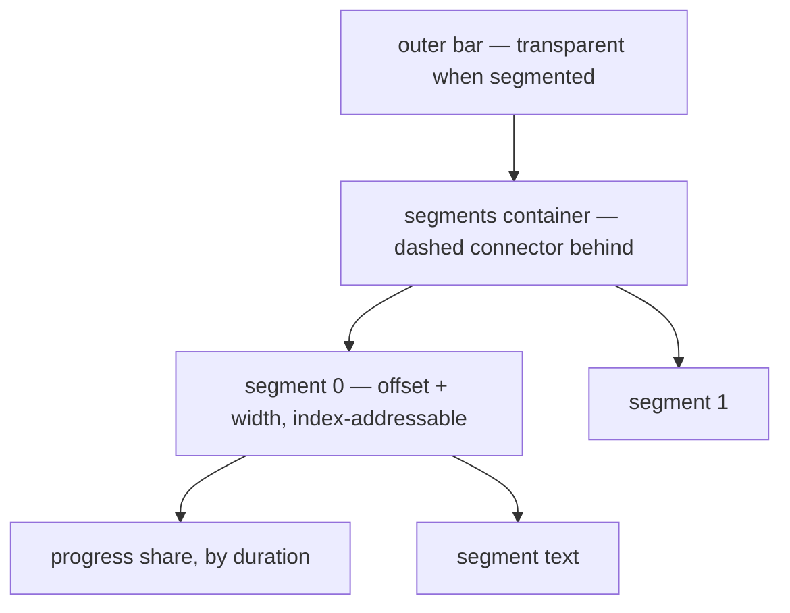
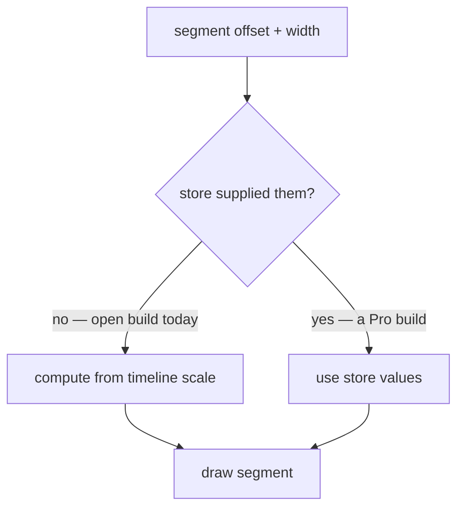
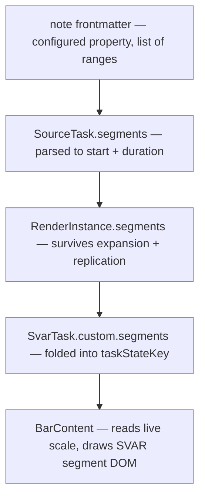

# Split-Task Segment Rendering - Plan

## Goal Capsule

- **Objective:** Render a task as spaced segments in a single Gantt row — a faithful hand-rolled equivalent of SVAR's Pro-gated split-task rendering — plus a minimal explicit segment source so it is demoable in a real vault.
- **Product authority:** Maintainer (Renato). Product Contract below is authoritative over the Planning Contract.
- **Execution profile:** Test-first for the pure layers (range parsing, position math, state-key encoding); rendering is proved by the isolated probe harness and a real-Obsidian e2e rather than by unit assertions.
- **Landing:** Local commits only. Do not open a pull request — the maintainer verifies segments rendering in a vault first.
- **Stop conditions:** Stop and surface if segments cannot be carried through the existing three-stage pipeline without a side channel, or if making the outer bar transparent would require changing shipped bar rendering for unsegmented tasks.
- **Open blockers:** None.

---

## Product Contract

Product Contract unchanged from the requirements-only source. Planning added the Planning Contract, Implementation Units, Verification Contract, and Definition of Done, and resolved two questions that were parked for planning.

### Summary

Draw a task whose activity is discontinuous as several spaced sub-bars inside one row, matching SVAR's split-task output exactly, fed by a SVAR-shaped `segments` array on the task. Segments are individually hoverable and clickable but not editable. A minimal author-declared range source populates segments now; recurrence-driven population comes later.

### Problem Frame

A task that is only active in bursts — an eight-week course with a class every other week, a recurring series — currently renders as one continuous bar from start to due. That bar is not merely coarse, it is wrong: it asserts activity across gaps where nothing happens.

SVAR solves this with split-task rendering, but that feature is Pro-gated: our installed MIT "open" edition forces `splitTasks` off inside the store's `init` and strips the Pro segment-positioning code, so no config can enable it (see `docs/solutions/integration-issues/svar-pro-feature-render-support.md`). The plugin already replaces SVAR's bar body with its own template, so the rendering seam we need is one we already own.

### Key Decisions

- **Clone SVAR's output rather than invent our own.** The segment data shape, DOM structure, class names, and coordinate convention all match SVAR's split-task. This costs a small amount of position math and buys a near-seamless path to the Pro build if we ever take it.
- **Positions come from the store when available, from us when not.** The open build never computes segment positions, so the renderer computes them from the timeline scale; if a build ever supplies them, the renderer prefers those. This single fallback is the whole migration seam.
- **"Remove the overlay and enable the flag" is not the migration.** The plugin's custom bar template always takes precedence over SVAR's native segment rendering, so our renderer stays in play even on a Pro build. Migration means the data and DOM stay put and the position helper goes away.
- **Render and light interaction only.** Structural editing is excluded because the eventual segment source is computed occurrences, where dragging one segment has no defensible meaning.
- **Stay inside the MIT grant.** Both installed SVAR packages are MIT, so adapting their segment markup is permitted with the notice retained; the paid build and any un-gating of the community reset are out.

### Requirements

**Segment data contract**

- R1. A task may carry a `segments` array in SVAR's split-task shape: each segment declares a `start` and a `duration`, with optional display text and an identifier that may be auto-assigned. There is no `end` field.
- R2. The renderer treats that array as its only input and stays ignorant of how segments were produced.

**Rendering fidelity**

- R3. A task with segments renders SVAR's split-task DOM: a segments container holding one segment element per entry, each addressable by its index and positioned by an explicit offset and width within the bar.
- R4. A dashed connector spans the full width of the bar behind the segments, matching SVAR's treatment.
- R5. The outer bar renders transparent when segmented, so the segments are the only visible pieces.
- R6. The task's overall progress is distributed across segments in proportion to their durations, and the whole-bar progress fill is suppressed when segmented.
- R7. Segments inherit the parent task's bar treatment — colour and icon chip — so a segmented bar still reads as one task.
- R8. Only ordinary tasks segment; a segments array on a summary or milestone is ignored.
- R9. A task without segments renders exactly as it does today.

**Positioning**

- R10. Each segment's offset and width derive from the timeline scale using the same date-to-pixel relationship SVAR uses, expressed relative to the parent bar's left edge.
- R11. The renderer prefers store-supplied segment positions when present and computes them otherwise.
- R12. Segment positions stay aligned with the bar across zoom and scale changes.

**Interaction**

- R13. Each segment is an individually addressable hover and click target.
- R14. Hovering a segment shows a tooltip for that segment.
- R15. Clicking a segment activates the task through the plugin's existing click behaviour.
- R16. Segments cannot be dragged, resized, split, or edited, and nothing about them is written back to notes.

**Interim segment source**

- R17. An explicit, author-declared set of date ranges on a note becomes that task's segments, so segmented bars are demoable without the recurrence work.
- R18. The interim source is optional and additive: notes that do not use it are unaffected.

**Licensing**

- R19. The implementation stays within the MIT licence of the installed SVAR packages: only MIT-covered code is reused or adapted, with its copyright and permission notice retained, and the work neither requires the paid build nor re-enables Pro features by defeating the community gate.

### Visualizations

Rendered structure of a segmented bar — what R3 through R7 produce:

Where segment positions come from — the migration seam in R10 and R11:

### Acceptance Examples

- AE1. Two segments, one row.
  - **Given:** a task with two segments separated by a gap.
  - **Then:** two segment elements render inside one row, the outer bar is transparent, and the dashed connector spans the gap.
  - **Covers R3, R4, R5.**
- AE2. Progress spans segments.
  - **Given:** a segmented task that is partially complete.
  - **Then:** completion fills earlier segments before later ones, in proportion to their durations, and no whole-bar progress fill is drawn.
  - **Covers R6.**
- AE3. No segments, no change.
  - **Given:** a task with no segments array.
  - **Then:** the bar renders exactly as it does today, with no segments container present.
  - **Covers R9.**
- AE4. Segments ignored on non-tasks.
  - **Given:** a summary or milestone carrying a segments array.
  - **Then:** it renders as it does today, unsegmented.
  - **Covers R8.**
- AE5. Zoom keeps alignment.
  - **Given:** a segmented task, and the timeline zoom changes.
  - **Then:** every segment stays aligned to its dates and within the parent bar.
  - **Covers R12.**
- AE6. Segment click behaves like bar click.
  - **Given:** a segmented task.
  - **When:** a segment is clicked.
  - **Then:** the underlying note opens, as clicking the bar does today.
  - **Covers R15.**

### Success Criteria

- A segmented bar is visually indistinguishable from SVAR's split-task rendering of the same data.
- Adopting a Pro build would require enabling the flag and deleting the position fallback — no change to the segment data or the rendered DOM.
- Unsegmented bars are unchanged, visually and behaviourally.

### Scope Boundaries

- Populating segments from recurrence — virtual or materialised occurrences, windowing, per-occurrence completion styling — stays deferred to its own brainstorm. This feature only consumes a segments array.
- Structural segment editing: drag, resize, split actions, editor and context-menu targets, and any write-back.
- The other Pro-gated features: markers, baselines, rollups, critical path, slack.
- Using the paid SVAR build, or patching the community gate to re-enable Pro features.
- Per-segment click targeting of a specific occurrence, which only becomes meaningful once occurrences exist.

### Dependencies and Assumptions

- Both installed SVAR packages are MIT licensed with no commercial carve-out found, so adapting their segment markup with the notice retained is permitted. This is a reading of the shipped licence files, not legal advice.
- The plugin keeps a custom bar template, so our renderer remains the one drawing segments even if the underlying build changes.
- The open build does not compute segment positions, so the renderer must.
- Segments inherit the parent task's treatment rather than carrying their own.

### Outstanding Questions

**Deferred beyond this feature**

- Whether a segment should ever target its own occurrence rather than the parent task, once occurrences exist.
- Whether pursuing the paid SVAR build is ever worthwhile.

---

## Planning Contract

> **Parked pending the spike.** This plan is the production feature, deferred while `docs/plans/2026-07-18-003-chore-split-task-render-spike-plan.md` answers the elegance question. The spike proved the rendering works and corrected several decisions below — see "Spike findings" at the end of this contract before executing.

### Key Technical Decisions

- KTD1. **Segments ride the existing three-stage pipeline as a top-level field.** A segment value flows `SourceTask` → `RenderInstance` → `SvarTask.segments`, the same route every other display value takes. It must sit on the task's **top-level `segments` field, not under `custom`**: SVAR reads `task.segments` for its split class, its segment branch, and the store's layout recursion, so any other carrier silently destroys the Pro-migration seam.
- KTD2. **Authors declare inclusive date ranges; the internal shape stays SVAR's.** The note property holds a list of `start..end` ranges, which the parser converts to SVAR's `{ start, duration }` segment shape. Ranges are what an author can write correctly; duration is what SVAR positions with, so the conversion happens once at the edge and the stored shape stays Pro-identical (R1, R17).
- KTD3. **The segments property name is configured, never hardcoded.** It joins `FIELD_MAPPING_KEYS` with a `tngantt_` prefix, gets a `''` default, and is surfaced as a view option — mirroring `timeEstimateProperty`. Required by `docs/solutions/architecture-patterns/property-agnostic-field-resolution.md`, and the `noBarePluginConfigKeys` guard test enforces the prefix.
- KTD4. **Read the property from the metadata cache, never through the Bases value system.** `BasesSource` resolves the bare key and reads `metadataCache` frontmatter, as `extractEstimateMinutes` does. Reading via `entry.getValue` re-triggers the notify storm documented in `docs/solutions/integration-issues/gantt-bases-getvalue-renotify-storm.md`. The property must also join the values feeding `frontmatterSignatureKeys`, or edits will not refresh the chart.
- KTD5. **`taskStateKey` folds a deterministic segment encoding.** The diff fingerprint must include segments so an edit re-issues the task, but the encoding uses formatted values rather than raw `Date` objects — `ganttSync.ts` warns that non-deterministic serialization makes every refresh look like a change and causes a re-render storm. Stability across identical refreshes is a required test, not just change detection.
- KTD6. **Positions are computed in the template from the live scale, not at sync time.** Segment offsets depend on zoom, which changes after a sync, so computing them in `ganttSync` would go stale. `BarContent` already receives SVAR's `api` prop (declared, currently unused) and can read the reactive scale directly. The renderer prefers store-supplied positions when present, which is the Pro migration seam (R10, R11, R12).
- KTD7. **Adapt SVAR's `BarSegments` markup rather than reimplementing it.** Both packages are MIT, so adapting with the copyright and permission notice retained is permitted and yields exact DOM fidelity (R19).
- KTD8. **Transparency of the outer bar comes from a registered cue class, not from editing shipped bar CSS.** SVAR whole-string-matches registered task types, so a segmented cue folded into `type` must also be registered alongside the existing instance-cue types; the accompanying rule follows the plugin's existing injected-stylesheet approach. This keeps unsegmented bars byte-unchanged (R9).

### Spike findings that supersede decisions above

The spike (`test/probe/`, run with `npm run probe:svar`; reference files `segmentLayout.ts`, `svarContract.ts`, `SegmentBar.svelte`, `segments.css`, `svar-contract.probe.ts`) built and proved the renderer, then hardened it into the reference implementation the port should copy. Apply these before executing this plan:

- **The bar is the ruler — no pixel formula at all.** Do not reproduce SVAR's `diff * cellWidth` layout (the first cut did, and needed `_scales.start`, `cellWidth`, `task.$x`, and SVAR's rounding to be right). Each segment is a *proportion of its bar's date span*, rendered as CSS percentages; the browser scales them against whatever width the bar has. This supersedes KTD6 and most of U4: the pure helper computes fractions, not pixels. Zoom tracking becomes a CSS property, not a recompute, and the `inclusive`-diff ambiguity cancels (same flag in numerator and denominator — a full-span segment is exactly 100% under any semantics; unit tests prove it under two different diff doubles).
- **Transparency by stamping SVAR's own `wx-split` class, not by CSS override.** SVAR's fill rule is `.wx-task:not(.wx-split)` and it ships `.wx-bars .wx-split.wx-bar { background: transparent }` for Pro split bars — the off-switch is designed in. The template stamps `wx-split` on its parent bar (a Svelte attachment; Pro's own `class:wx-split={$splitTasks && task.segments}` binding is unreachable in the MIT build). This deletes the transparency CSS entirely, needs no `!important`, no `:has()`, and inherits SVAR's split-aware selection styling. It fully supersedes KTD8's registered-cue-type machinery. (Earned-specificity via extra ancestor classes does NOT work: Svelte scoping hashes lift SVAR's rules to equal specificity.)
- **All internals behind one runtime-validated snapshot.** The only private API left is `getState()._scales.diff` + `.lengthUnit` (plus the documented `durationUnit`), read through a single `scaleSnapshot()` helper that validates shape and returns null when SVAR moves — the template then degrades to an ordinary continuous bar. An upgrade can switch the feature off; it can never break the chart. Snapshot-not-subscription is safe because SVAR re-creates task objects on every layout-affecting change.
- **Contract tests use SVAR as its own oracle.** The load-bearing test renders a plain task over dates D and asserts a segment covering D lands on exactly the same pixels — no formula knowledge, so any SVAR layout change diverges loudly. Sibling contracts pin: template-is-direct-child-of-bar, the whole-bar progress wrapper we suppress, the `wx-split` rule pair, and zoom keeping the segment/bar ratio invariant.
- **SVAR's whole-bar progress fill must be suppressed explicitly.** SVAR only skips its own progress wrapper when `splitTasks` is true — forced false here — so it paints a fill spanning the whole bar under the segments. One global rule (`.wx-bars .wx-bar.wx-split > .wx-progress-wrapper { display: none }`); the child combinator preserves per-segment fills. This is the only CSS the feature owns.
- **The segments container CSS must be adapted, but segment CSS is inherited.** `.wx-segments` and the dashed connector live in `BarSegments.svelte`'s scoped block and do not apply to our markup; the `.wx-bar :global(.wx-segment)` rules in `Bars.svelte` do apply through the bar ancestor.
- **A theme wrapper is required.** Without `Willow` (or the dark variant) the SVAR CSS variables are undefined and every bar computes to transparent.
- **Date math must be calendar-aware.** Segment `end = start + duration` uses calendar-day addition (`setDate`), never milliseconds — a ms-based day drifts across DST. All other arithmetic is SVAR's own `diff`.
- **Segment shape guard at the boundary.** SVAR types `segments` as `Partial<ITask>[]`; a tiny `isSegmentSpan` guard (start is a Date, duration is a number) filters malformed entries so one bad segment cannot break its siblings. A Pro build's own `$x`/`$w`, when present, are honoured verbatim — that is the entire migration seam.

### High-Level Technical Design

How a declared range reaches a drawn segment — the four stages each unit touches:

### Assumptions

- The authored range list is small per note (a handful of ranges), so parsing cost is irrelevant and no caching layer is needed.
- Segment display text is not authored in this feature; segments render without text, matching SVAR's behaviour when a segment carries none.
- A segment tooltip shows the segment's own date range; the task-level tooltip content is otherwise unchanged.
- Overlapping or unsorted authored ranges are tolerated rather than rejected — they are sorted by start and drawn as given.

### Sequencing

U1 → U2 → U3 establish the data path. U4 is independent and can proceed in parallel. U5 depends on U3 and U4. U6 and U7 both depend on U5.

---

## Implementation Units

### U1. Configurable segments property

- **Goal:** Add a configured, property-agnostic setting naming the note property that holds segment ranges.
- **Requirements:** R17, R18, R19.
- **Dependencies:** none.
- **Files:** `src/bases/fieldMappingConfig.ts`, `src/bases/types/field-mapping.ts`, `src/bases/viewOptions.ts`, `test/unit/readFieldMappings.test.ts`, `test/unit/viewOptions.test.ts`, `test/unit/noBarePluginConfigKeys.test.ts`.
- **Approach:** Add a `segments` entry to `FIELD_MAPPING_KEYS` with a `tngantt_` prefix, an empty default in the base defaults, a read line in `readFieldMappings`, an optional field on `FieldMappings`, and a property-type view option composed into the Gantt view options.
- **Patterns to follow:** `timeEstimateProperty` end to end — its key, default, read line, `FieldMappings` field, and standalone property option.
- **Test scenarios:**
  - Defaults to empty, so no property name is assumed when unconfigured.
  - A configured value is returned by the mapping reader.
  - The option is present in the Gantt view options with a property type and an empty default.
  - The new key is `tngantt_`-prefixed, satisfying the bare-config-key guard.
- **Verification:** The mapping reader and view-option tests pass, and the guard test still passes.

### U2. Parse declared ranges into segments on the source task

- **Goal:** Turn the configured property's authored ranges into a `segments` value on `SourceTask`.
- **Requirements:** R1, R17, R18.
- **Dependencies:** U1.
- **Files:** `src/datasource/noteSegments.ts` (new), `src/datasource/types.ts`, `src/datasource/BasesSource.ts`, `src/bases/entrySignature.ts`, `test/unit/noteSegments.test.ts` (new), `test/unit/BasesSource.test.ts`, `test/unit/entrySignature.test.ts`.
- **Approach:** A pure parser coerces the authored list of inclusive `start..end` ranges into SVAR-shaped `{ start, duration }` entries, sorted by start, skipping malformed entries. `BasesSource` resolves the bare property key and reads the value from the metadata cache, never through the Bases value system. Add the property to the values feeding the frontmatter signature so edits refresh.
- **Execution note:** Write the parser test-first; its edge cases are the substance of this unit.
- **Patterns to follow:** `src/datasource/noteEstimate.ts` for the coercion module shape, and `extractEstimateMinutes` in `BasesSource` for the cache-safe read.
- **Test scenarios:**
  - A two-range list parses to two segments with correct start and duration.
  - An absent or empty property yields no segments.
  - Malformed entries are skipped while valid siblings survive.
  - Unsorted ranges come back sorted by start.
  - A single-day range yields a positive duration rather than zero.
  - Reading uses the metadata cache, not the Bases value system.
  - The configured property contributes to the frontmatter signature, so an edit changes it.
- **Verification:** Parser and source tests pass; editing the property in a vault changes the computed signature.

### U3. Carry segments to the chart task

- **Goal:** Thread the segment value through instance expansion onto the SVAR task without destabilising the diff fingerprint.
- **Requirements:** R1, R2, R8.
- **Dependencies:** U2.
- **Files:** `src/controller/InstanceExpansion.ts`, `src/bases/ganttSync.ts`, `test/unit/InstanceExpansion.test.ts`, `test/unit/ganttSync.test.ts`.
- **Approach:** Add the segment value to `RenderInstance` and to `SvarTask.custom`, and fold a deterministic formatted encoding of it into `taskStateKey`. Ignore segments for summary and milestone rows.
- **Execution note:** Add the state-key stability test before wiring the fold — a non-deterministic encoding is the failure this unit exists to avoid.
- **Patterns to follow:** how `barIcon` is folded into `taskStateKey`, and the existing warning there about non-deterministic serialization.
- **Test scenarios:**
  - Segments survive expansion onto the render instance.
  - Replicated instances of one source note each carry the segments.
  - `taskStateKey` is byte-identical across two syncs of unchanged segments.
  - `taskStateKey` changes when a segment's start or duration changes.
  - A task with no segments produces the same state key as before this change.
  - Covers AE4. A summary or milestone carrying segments is not marked segmented.
- **Verification:** Expansion and sync tests pass, including the state-key stability case.

### U4. Segment position math

- **Goal:** Convert a segment's dates plus the live timeline scale into a bar-relative offset and width.
- **Requirements:** R10, R12.
- **Dependencies:** none.
- **Files:** `src/bases/segmentLayout.ts` (new), `test/unit/segmentLayout.test.ts` (new).
- **Approach:** A pure function mirroring SVAR's date-to-pixel relationship — the scale's difference function against the scale start, multiplied by cell width — then rebased against the parent bar's own offset so the result is relative to the bar, matching SVAR's segment coordinate convention.
- **Execution note:** Implement test-first; correctness here is entirely arithmetic and cheap to pin.
- **Patterns to follow:** the store's task-layout computation, whose formula this mirrors.
- **Test scenarios:**
  - A segment starting at the bar start yields a zero offset.
  - A segment starting later yields an offset matching the scaled date difference.
  - Width follows the segment's duration at the current cell width.
  - Doubling cell width doubles both offset and width, proving zoom rescaling.
  - Results are bar-relative, not timeline-absolute.
  - A zero or negative duration yields a non-negative width rather than an inverted box.
- **Verification:** The layout tests pass, including the zoom-rescaling case.

### U5. Render segments in the bar template

- **Goal:** Draw SVAR's split-task DOM for a segmented task inside the plugin's own bar template.
- **Requirements:** R3, R4, R5, R6, R7, R9, R11, R19.
- **Dependencies:** U3, U4.
- **Files:** `src/bases/BarContent.svelte`, `src/bases/ganttSync.ts`, `src/bases/barTreatment.ts`, `test/unit/barTreatment.test.ts`.
- **Approach:** `BarContent` branches when the task carries segments: it reads the reactive scale through the `api` prop it already receives, computes each segment's box via the U4 helper, and emits SVAR's segments container with one indexed segment element each, per-segment progress distributed by duration, and the dashed connector. It prefers store-supplied positions when present. A registered cue class marks the bar as segmented so the injected stylesheet can render the outer bar transparent, leaving unsegmented bars untouched.
- **Execution note:** Adapt SVAR's `BarSegments` markup directly, retaining its MIT copyright and permission notice in the adapted file.
- **Patterns to follow:** SVAR's `BarSegments.svelte` for the DOM and progress distribution; the existing instance-cue task-type registration for the segmented cue; the injected-stylesheet approach in `barTreatment.ts` for the transparency rule.
- **Test scenarios:**
  - The segmented cue class is registered as a task type, so SVAR emits it.
  - The injected stylesheet contains the outer-bar transparency rule scoped to the segmented cue.
  - The transparency rule does not match an unsegmented bar.
  - Per-segment progress distribution fills earlier segments before later ones for a partially complete task.
- **Verification:** Treatment tests pass, and a segmented task renders segment elements in the probe harness (U6).

### U6. Prove the rendering

- **Goal:** Verify segmented rendering in the isolated harness and in real Obsidian.
- **Requirements:** R3, R4, R5, R6, R8, R9, R12.
- **Dependencies:** U5.
- **Files:** `test/probe/segments-render.probe.ts` (new), `test/vaults/gantt-segments/` (new fixture notes and base view), `test/specs/gantt-segments.e2e.ts` (new).
- **Approach:** A probe spec mounts the plugin's container over a segmented task and asserts the SVAR-shaped segment DOM. A fixture vault with a note declaring ranges plus a base view drives the real-Obsidian e2e, which asserts the same structure end to end and checks an unsegmented control note is unchanged.
- **Patterns to follow:** `test/probe/` for the isolated mount, and `test/specs/gantt-bar-treatments.e2e.ts` for the fixture-vault and base-opening pattern.
- **Test scenarios:**
  - Covers AE1. A two-range note renders two segment elements in one row with the connector present and the outer bar transparent.
  - Covers AE3. A control note without the property renders one ordinary bar and no segments container.
  - Covers AE4. A parent row carrying ranges renders unsegmented.
  - Covers AE5. After a zoom change, segment offsets and widths rescale and stay within the bar.
  - Covers AE2. A partially complete segmented task fills earlier segments first.
- **Verification:** The probe spec and the new e2e both pass against a real Obsidian instance.

### U7. Per-segment hover and click

- **Goal:** Make each segment an individually addressable hover and click target routed through existing behaviour.
- **Requirements:** R13, R14, R15, R16.
- **Dependencies:** U5.
- **Files:** `src/bases/GanttContainer.svelte`, `src/bases/taskNotesInteractions.ts`, `test/unit/taskNotesInteractions.test.ts`, `test/specs/gantt-segments.e2e.ts`.
- **Approach:** Resolve the segment index from the clicked element and route activation through the existing click-activation path, targeting the parent task's note. The tooltip resolves the hovered segment and shows its date range. No drag, resize, split, or write-back is wired.
- **Patterns to follow:** the existing click-activation resolution and tooltip wiring in `GanttContainer`.
- **Test scenarios:**
  - Clicking within a segment resolves to the parent task's activation target.
  - Clicking the transparent outer bar outside any segment resolves to the same target.
  - Segment elements expose their index so a hover can identify which segment is under the cursor.
  - Covers AE6. In the e2e, clicking a segment opens the underlying note.
  - No drag or resize handler is attached to segment elements.
- **Verification:** Interaction unit tests pass and the e2e click case opens the note.

---

## Verification Contract

| Gate | Command | Applies to | Done signal |
|---|---|---|---|
| Unit tests | `npm test` | U1–U5, U7 | All pass, including state-key stability and zoom rescaling |
| Typecheck | `npm run typecheck` | all units | No new errors |
| Lint | `npm run lint` | all units | Clean |
| Isolated render | `npm run probe:svar` | U5, U6 | Segment DOM present for a segmented task |
| Real Obsidian | `npm run e2e` | U6, U7 | `gantt-segments` spec passes, control note unchanged |
| Build | `npm run build` | all units | Bundle builds |

`.svelte` and `.mts` files fall outside parts of the typecheck and lint coverage, so the probe and e2e runs are the real proof for the rendering units rather than static analysis alone.

---

## Definition of Done

- Every requirement R1–R19 is satisfied or explicitly deferred in Scope Boundaries.
- Acceptance examples AE1–AE6 are covered by the probe spec or the e2e spec.
- A note declaring ranges renders spaced segments in a real vault, matching SVAR's split-task appearance.
- A note without the configured property renders exactly as before, and the segments cue does not appear in its markup.
- The segments property is configurable, defaults to empty, and no Obsidian property name is hardcoded.
- `taskStateKey` is stable across refreshes of unchanged segments — no re-render storm.
- Adapted SVAR markup retains its MIT copyright and permission notice.
- Dead-end or experimental code from abandoned approaches is removed before declaring done.
- Work is committed locally; no pull request is opened.

---

## Sources / Research

- `docs/solutions/integration-issues/svar-pro-feature-render-support.md` — why split-task is unreachable in the installed edition, and the three routes considered.
- `docs/solutions/architecture-patterns/property-agnostic-field-resolution.md` — the governing rule behind KTD3.
- `docs/solutions/integration-issues/gantt-bases-getvalue-renotify-storm.md` — why KTD4 reads the metadata cache instead of the Bases value system.
- `docs/solutions/integration-issues/svar-gantt-diff-sync-interactions.md` — diff-sync behaviour that KTD5's state-key fold must respect.
- `docs/solutions/tooling-decisions/svar-gantt-summary-type-constraints.md` — parents render as ordinary tasks, which is why R8 excludes summaries from segmenting.
- `docs/solutions/integration-issues/svar-gantt-injected-css-scoped-specificity.md` and `svar-shared-classname-selector-leak.md` — constraints on the KTD8 transparency rule.
- SVAR's split-task rendering, for the shape being cloned: `node_modules/@svar-ui/svelte-gantt/src/components/chart/BarSegments.svelte` and `chart/Bars.svelte`.
- Segment coordinate convention and date-to-pixel relationship: the layout function in `node_modules/@svar-ui/gantt-store/dist/index.js`.
- Plugin-side seams: `src/bases/BarContent.svelte`, `src/bases/GanttContainer.svelte`, `src/bases/ganttSync.ts`, `src/bases/barTreatment.ts`, `src/datasource/BasesSource.ts`, `src/bases/fieldMappingConfig.ts`, `src/bases/viewOptions.ts`, `src/bases/entrySignature.ts`.
- `test/probe/` — the isolated SVAR harness, reusable for asserting rendered segment structure.
