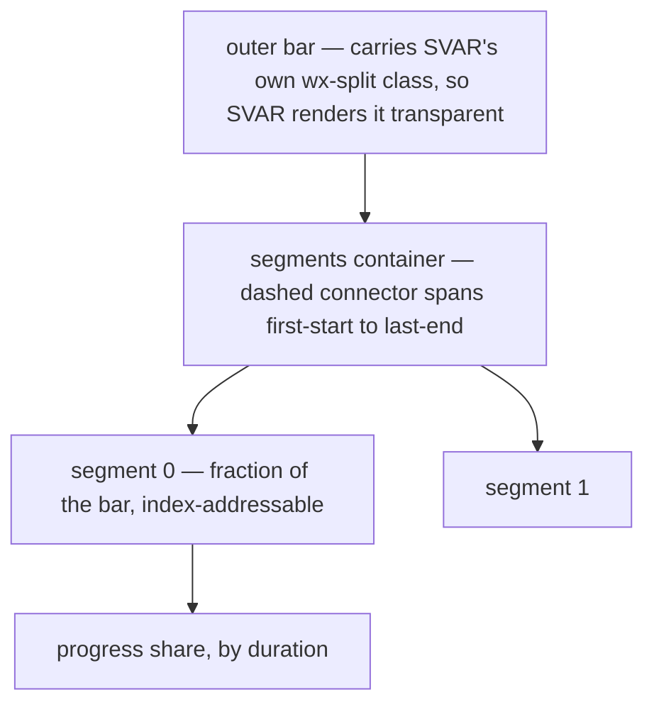
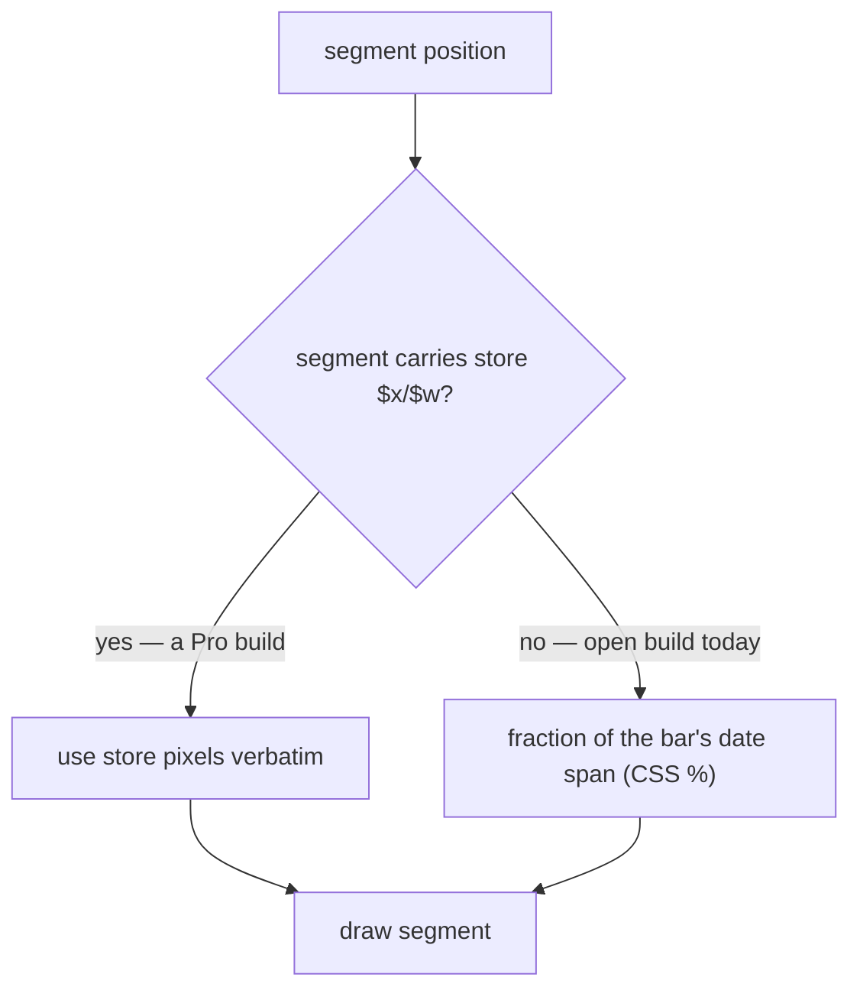
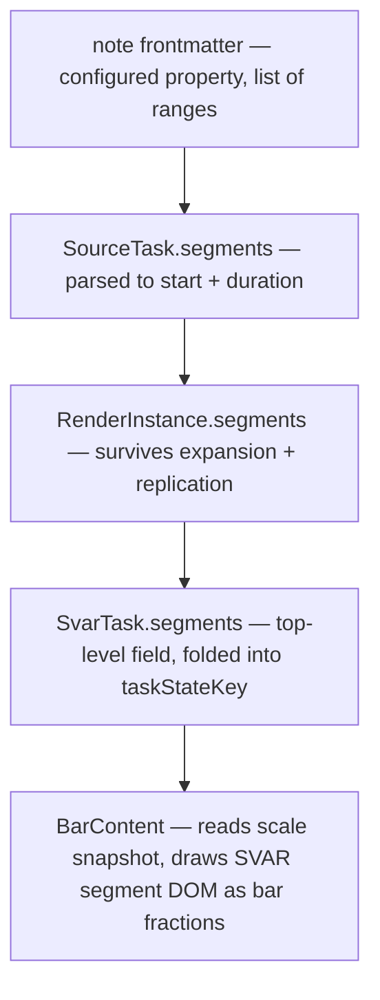

# Split-Task Segment Rendering - Plan

## Goal Capsule

- **Objective:** Render a task as spaced segments in a single Gantt row — a faithful hand-rolled equivalent of SVAR's Pro-gated split-task rendering — plus a minimal explicit segment source so it is demoable in a real vault.
- **Product authority:** Maintainer (Renato). Product Contract below is authoritative over the Planning Contract.
- **Execution profile:** Test-first for the pure layers (range parsing, segment geometry, state-key encoding); rendering is proved by porting the spike's isolated probes and a real-Obsidian e2e rather than by unit assertions.
- **Reference implementation:** The spike on this branch (`test/probe/`, `npm run probe:svar`, `npm run demo:segments`) already built and proved the renderer. This plan ports it into `src/` behind a real data source. The reusable technique is captured in `docs/solutions/design-patterns/reproducing-gated-svar-gantt-features.md`.
- **Landing:** Local commits only. Do not open a pull request — the maintainer verifies segments rendering in a vault first.
- **Stop conditions:** Stop and surface if segments cannot be carried through the existing three-stage pipeline without a side channel, or if the interim data source cannot resolve its property through the configured field mapping.
- **Open blockers:** None.

---

## Product Contract

Product Contract preserved from the requirements-only source, with three corrections the spike proved and this reconciliation folded in — changed: R4 (connector spans the segment run, not the whole bar, because a full-width connector trails a bare dash past the last segment when the task span exceeds its segments), R8 (reframed from a summary/milestone type-guard, which can never fire since the plugin only emits `type:'task'` bars, to a data-source responsibility), R10 (positioning is a fraction of the already-laid-out bar, not a reproduction of SVAR's pixel formula). Planning added the Planning Contract, Implementation Units, Verification Contract, and Definition of Done.

### Summary

Draw a task whose activity is discontinuous as several spaced sub-bars inside one row, matching SVAR's split-task output exactly, fed by a SVAR-shaped `segments` array on the task. Segments are individually hoverable and clickable but not editable. A minimal author-declared range source populates segments now; recurrence-driven population comes later.

### Problem Frame

A task that is only active in bursts — an eight-week course with a class every other week, a recurring series — currently renders as one continuous bar from start to due. That bar is not merely coarse, it is wrong: it asserts activity across gaps where nothing happens.

SVAR solves this with split-task rendering, but that feature is Pro-gated: our installed MIT "open" edition forces `splitTasks` off inside the store's `init` and strips the Pro segment-positioning code, so no config can enable it (see `docs/solutions/integration-issues/svar-pro-feature-render-support.md`). The plugin already replaces SVAR's bar body with its own template, so the rendering seam we need is one we already own.

### Key Decisions

- **Clone SVAR's data shape and DOM rather than invent our own.** The segment array, DOM structure, class names, and coordinate convention all match SVAR's split-task, so a future move to the paid build is near-drop-in.
- **The bar is the ruler — no pixel math.** SVAR already solved date-to-pixel when it laid the bar out, so each segment is a fraction of the bar's date span rendered as a CSS percentage. This is what makes zoom tracking free and keeps the renderer independent of SVAR's internal rounding. A Pro build's own segment positions, if present, are honoured verbatim — the whole migration seam.
- **Satisfy SVAR's own condition instead of overriding its CSS.** The bar is made transparent by stamping SVAR's own `wx-split` class, which disarms its fill rule and arms its own transparent rule. No cue-type registration, no injected transparency CSS, no `!important`.
- **Render and light interaction only.** Structural editing is excluded because the eventual segment source is computed occurrences, where dragging one segment has no defensible meaning.
- **Stay inside the MIT grant.** Both installed SVAR packages are MIT, so adapting their segment markup is permitted with the notice retained; the paid build and any un-gating of the community reset are out.

### Requirements

**Segment data contract**

- R1. A task may carry a `segments` array in SVAR's split-task shape: each segment declares a `start` and a `duration`, with optional display text and an identifier that may be auto-assigned. There is no `end` field.
- R2. The renderer treats that array as its only input and stays ignorant of how segments were produced.

**Rendering fidelity**

- R3. A task with segments renders SVAR's split-task DOM: a segments container holding one segment element per entry, each addressable by its index and positioned within the bar.
- R4. A dashed connector runs behind the segments from the first segment's start to the last segment's end, matching SVAR's treatment for Pro-shaped data and leaving no bare tail when the task span is wider.
- R5. The outer bar renders transparent when segmented, so the segments are the only visible pieces.
- R6. The task's overall progress is distributed across segments in proportion to their durations, and the whole-bar progress fill is suppressed when segmented.
- R7. Segments inherit the parent task's bar treatment — colour and icon chip — so a segmented bar still reads as one task.
- R8. The renderer draws segments for any task carrying them; the segment sources attach segments only to leaf task notes, not to aggregate or parent rows.
- R9. A task without segments renders exactly as it does today.

**Positioning**

- R10. Each segment is positioned as a fraction of the parent bar's own date span, so it lands where SVAR would draw a bar covering the same dates.
- R11. The renderer prefers store-supplied segment positions when present and computes the fraction otherwise.
- R12. Segment positions stay aligned with the bar across zoom and scale changes.

**Interaction**

- R13. Each segment is an individually addressable hover and click target.
- R14. Hovering a segment shows a tooltip for that segment.
- R15. Clicking a segment activates the task through the plugin's existing click behaviour.
- R16. Segments cannot be dragged, resized, split, or edited, and nothing about them is written back to notes.

**Interim segment source**

- R17. An explicit, author-declared set of date ranges on a note becomes that task's segments, so segmented bars are demoable without the recurrence work.
- R18. The interim source is optional and additive: notes that do not use it are unaffected.

**Licensing**

- R19. The implementation stays within the MIT licence of the installed SVAR packages: only MIT-covered code is reused or adapted, with its copyright and permission notice retained, and the work neither requires the paid build nor re-enables Pro features by defeating the community gate.

### Visualizations

Rendered structure of a segmented bar — what R3 through R7 produce:

Where a segment's position comes from — the migration seam in R10 and R11:

### Acceptance Examples

- AE1. Two segments, one row.
  - **Given:** a task with two segments separated by a gap, its span ending at the last segment's end.
  - **Then:** two segment elements render inside one row, the outer bar is transparent, and the dashed connector spans the gap with no tail past the last segment.
  - **Covers R3, R4, R5.**
- AE2. Progress spans segments.
  - **Given:** a segmented task that is partially complete.
  - **Then:** completion fills earlier segments before later ones, in proportion to their durations, and no whole-bar progress fill is drawn.
  - **Covers R6.**
- AE3. No segments, no change.
  - **Given:** a task with no segments array.
  - **Then:** the bar renders exactly as it does today, with no segments container present and no `wx-split` class added.
  - **Covers R9.**
- AE4. Aggregate rows are not segmented.
  - **Given:** a parent or aggregate row.
  - **Then:** the sources give it no segments, so it renders as an ordinary bar.
  - **Covers R8.**
- AE5. Zoom keeps alignment.
  - **Given:** a segmented task, and the timeline zoom changes.
  - **Then:** every segment stays aligned to its dates and within the parent bar.
  - **Covers R12.**
- AE6. Segment click behaves like bar click.
  - **Given:** a segmented task.
  - **When:** a segment is clicked.
  - **Then:** the underlying note opens, as clicking the bar does today.
  - **Covers R15.**
- AE7. Connector leaves no tail.
  - **Given:** a task whose end date is later than its last segment's end.
  - **Then:** the dashed connector stops at the last segment, not at the bar's right edge.
  - **Covers R4.**

### Success Criteria

- A segmented bar is visually indistinguishable from SVAR's split-task rendering of the same data.
- Adopting a Pro build would require enabling the flag and deleting the fraction fallback — no change to the segment data or the rendered DOM.
- Unsegmented bars are unchanged, visually and behaviourally.

### Scope Boundaries

- Populating segments from recurrence — virtual or materialised occurrences, windowing, per-occurrence completion styling — stays deferred to its own brainstorm. This feature only consumes a segments array.
- Structural segment editing: drag, resize, split actions, editor and context-menu targets, and any write-back.
- The other Pro-gated features: markers, baselines, rollups, critical path, slack.
- Using the paid SVAR build, or patching the community gate to re-enable Pro features.
- Per-segment click targeting of a specific occurrence, which only becomes meaningful once occurrences exist.

### Dependencies and Assumptions

- Both installed SVAR packages are MIT licensed with no commercial carve-out found, so adapting their segment markup with the notice retained is permitted. This is a reading of the shipped licence files, not legal advice.
- The plugin keeps a custom bar template, so our renderer remains the one drawing segments even if the underlying build changes.
- The production `GanttContainer` already mounts within a SVAR theme, so the CSS-variable dependency the spike hit only in its bare isolated harness does not arise in the plugin.
- The open build does not compute segment positions, so the renderer computes fractions itself.
- Segments inherit the parent task's treatment rather than carrying their own.

### Outstanding Questions

**Deferred beyond this feature**

- Whether a segment should ever target its own occurrence rather than the parent task, once occurrences exist.
- Whether pursuing the paid SVAR build is ever worthwhile.

---

## Planning Contract

The Key Technical Decisions below are what the spike proved, folded in place — there is no separate "findings" layer to reconcile against. Where a decision reads differently from the first draft of this plan, the spike is why.

### Key Technical Decisions

- KTD1. **Segments ride the existing three-stage pipeline as a top-level field.** A segment value flows `SourceTask` → `RenderInstance` → `SvarTask.segments` — a new **top-level** field on `SvarTask`, not under `custom`. SVAR reads `task.segments` for its split class, its segment branch, and (on a Pro build) its layout recursion, so any other carrier silently destroys the migration seam. A side channel would also bypass instance expansion and break for replicated rows.
- KTD2. **Authors declare inclusive date ranges; the internal shape stays SVAR's.** The note property holds a list of `start..end` ranges, which the parser converts once to SVAR's `{ start, duration }` segment shape. Ranges are what an author writes correctly; duration is SVAR's shape. Duration is measured in calendar days, and the renderer's `end = start + duration` uses calendar-day addition, never milliseconds, so a segment does not drift across a DST boundary (R1, R17).
- KTD3. **The segments property name is configured, never hardcoded.** It joins `FIELD_MAPPING_KEYS` with a `tngantt_` prefix, gets a `''` default, and is surfaced as a view option — mirroring `timeEstimateProperty` end to end. Required by `docs/solutions/architecture-patterns/property-agnostic-field-resolution.md`, and the `noBarePluginConfigKeys` guard test enforces the prefix.
- KTD4. **Read the property from the metadata cache, and add it to the signature in `register.ts`.** `BasesSource` resolves the bare key and reads `metadataCache` frontmatter, as `extractEstimateMinutes` does — never `entry.getValue`, which re-triggers the notify storm in `docs/solutions/integration-issues/gantt-bases-getvalue-renotify-storm.md`. The property must also join the mapping values passed to `frontmatterSignatureKeys` in `register.ts`'s `computeEntrySignature` (not `entrySignature.ts`, which only holds generic helpers), or edits will not refresh the chart.
- KTD5. **`taskStateKey` folds a deterministic segment encoding.** Fold the segments into the diff fingerprint so an edit re-issues the task, encoding each as an ISO date plus its numeric duration (deterministic — the storm risk is real for `TypedValue` wrappers but a plain `{ start: Date, duration: number }` already serialises stably). A stability test across identical refreshes is cheap insurance, not optional.
- KTD6. **The bar is the ruler: geometry is a fraction of the bar, computed in the template.** Do not reproduce SVAR's `diff * cellWidth` pixel formula (it would couple to `_scales.start`, `cellWidth`, `task.$x`, and SVAR's rounding). Each segment's offset and width are its date span as a fraction of the bar's date span, emitted as CSS percentages; the browser rescales them on zoom for free. The one borrowed internal is `getState()._scales.diff` + `.lengthUnit`, read through a single validated `scaleSnapshot()` helper that returns null when SVAR moves it, so the bar degrades to its continuous form rather than breaking. Store-supplied `$x`/`$w` are preferred when present (R10, R11, R12).
- KTD7. **Adapt SVAR's `BarSegments` markup and its container CSS.** Both packages are MIT, so adapting with the copyright and permission notice retained is permitted and yields exact DOM fidelity. `.wx-segments` and the dashed connector live in `BarSegments.svelte`'s scoped block and must be copied; the `.wx-bar :global(.wx-segment)` rules in `Bars.svelte` apply through the bar ancestor and are inherited free (R19).
- KTD8. **Transparency by stamping SVAR's own `wx-split` class, not by a cue type or an override.** The template adds `wx-split` to its parent bar — the exact class Pro's own `class:wx-split={$splitTasks && task.segments}` binding would set. SVAR's fill rule `.wx-task:not(.wx-split)` then disarms and its own `.wx-bars .wx-split.wx-bar { background: transparent }` applies. This needs no registered cue task-type, no injected transparency rule, and no `!important` — earned-specificity was tried and fails because Svelte scoping hashes equalise SVAR's rules. Unsegmented bars never get the class, so they are byte-unchanged (R5, R9).
- KTD9. **The one CSS rule the feature owns suppresses SVAR's whole-bar progress fill.** SVAR only skips its own progress wrapper when `splitTasks` is true, forced false here, so it paints a fill spanning the whole bar under the segments. A single global rule (`.wx-bars .wx-bar.wx-split > .wx-progress-wrapper { display: none }`) hides it; the child combinator preserves the per-segment fills nested deeper (R6).
- KTD10. **Contract tests use SVAR's own rendering as the oracle.** The load-bearing verification renders a plain task over dates D and asserts a segment covering D lands on the same pixels — no formula knowledge, so any SVAR layout change diverges loudly. Sibling contract tests pin: the reactive-state keys `scaleSnapshot` reads, the direct-child-of-`.wx-bar` DOM assumption behind the `wx-split` stamp and the progress-suppression rule, and that SVAR still emits the wrapper KTD9 hides.

### High-Level Technical Design

How a declared range reaches a drawn segment — the four stages each unit touches:

### Assumptions

- The authored range list is small per note (a handful of ranges), so parsing cost is irrelevant and no caching layer is needed.
- Segment display text is not authored in this feature; segments render without text, matching SVAR's behaviour when a segment carries none.
- A segment tooltip shows the segment's own date range; the task-level tooltip content is otherwise unchanged.
- Overlapping or unsorted authored ranges are tolerated rather than rejected — they are sorted by start and drawn as given, and a malformed entry is skipped without breaking its siblings.

### Sequencing

U1 → U2 → U3 establish the data path. U4 (pure geometry) is independent and can proceed in parallel. U5 depends on U3 and U4 and carries its own isolated-probe proof. U6 (real-Obsidian e2e) and U7 (interaction) both depend on U5.

---

## Implementation Units

### U1. Configurable segments property

- **Goal:** Add a configured, property-agnostic setting naming the note property that holds segment ranges.
- **Requirements:** R17, R18, R19.
- **Dependencies:** none.
- **Files:** `src/bases/fieldMappingConfig.ts`, `src/bases/types/field-mapping.ts`, `src/bases/viewOptions.ts`, `test/unit/readFieldMappings.test.ts`, `test/unit/viewOptions.test.ts`, `test/unit/noBarePluginConfigKeys.test.ts`.
- **Approach:** Add a `segments` entry to `FIELD_MAPPING_KEYS` with a `tngantt_` prefix, an empty default in the base defaults, a read line in `readFieldMappings`, an optional field on `FieldMappings`, and a property-type view option composed into the Gantt view options.
- **Patterns to follow:** `timeEstimateProperty` end to end — its key, default, read line, `FieldMappings` field, and standalone property option.
- **Test scenarios:**
  - Defaults to empty, so no property name is assumed when unconfigured.
  - A configured value is returned by the mapping reader.
  - The option is present in the Gantt view options with a property type and an empty default.
  - The new key is `tngantt_`-prefixed, satisfying the bare-config-key guard.
- **Verification:** The mapping reader and view-option tests pass, and the guard test still passes.

### U2. Parse declared ranges into segments on the source task

- **Goal:** Turn the configured property's authored ranges into a `segments` value on `SourceTask`.
- **Requirements:** R1, R17, R18.
- **Dependencies:** U1.
- **Files:** `src/datasource/noteSegments.ts` (new), `src/datasource/types.ts`, `src/datasource/BasesSource.ts`, `src/bases/register.ts`, `test/unit/noteSegments.test.ts` (new), `test/unit/BasesSource.test.ts`.
- **Approach:** A pure parser coerces the authored list of inclusive `start..end` ranges into SVAR-shaped `{ start, duration }` entries, sorted by start, skipping malformed entries (mirroring the spike's `isSegmentSpan` guard). `BasesSource` resolves the bare property key and reads the value from the metadata cache, never through the Bases value system. Add the segments mapping value to the `frontmatterSignatureKeys([...])` array in `register.ts`'s `computeEntrySignature` so edits refresh.
- **Execution note:** Write the parser test-first; its edge cases are the substance of this unit.
- **Patterns to follow:** `src/datasource/noteEstimate.ts` for the coercion module shape; `extractEstimateMinutes` in `BasesSource` for the cache-safe read; the `timeEstimateProperty` line in `computeEntrySignature` for the signature fold; `test/probe/segmentLayout.ts` `isSegmentSpan` for the guard.
- **Test scenarios:**
  - A two-range list parses to two segments with correct start and duration.
  - An absent or empty property yields no segments.
  - Malformed entries are skipped while valid siblings survive.
  - Unsorted ranges come back sorted by start.
  - A single-day range yields a positive duration rather than zero.
  - Reading uses the metadata cache, not the Bases value system.
  - The configured property contributes to the frontmatter signature, so an edit changes it.
- **Verification:** Parser and source tests pass; editing the property in a vault changes the computed signature.

### U3. Carry segments to the chart task

- **Goal:** Thread the segment value through instance expansion onto the top-level `SvarTask.segments` field without destabilising the diff fingerprint.
- **Requirements:** R1, R2.
- **Dependencies:** U2.
- **Files:** `src/controller/InstanceExpansion.ts`, `src/bases/ganttSync.ts`, `test/unit/InstanceExpansion.test.ts`, `test/unit/ganttSync.test.ts`.
- **Approach:** Add the segment value to `RenderInstance` and to a new **top-level** `segments` field on `SvarTask` (not `custom`), and fold a deterministic ISO-plus-duration encoding into `taskStateKey`.
- **Execution note:** Add the state-key stability test before wiring the fold — a non-deterministic encoding is the failure this unit exists to avoid.
- **Patterns to follow:** how `barIcon` is folded into `taskStateKey`, and the existing warning there about non-deterministic serialization.
- **Test scenarios:**
  - Segments survive expansion onto the render instance.
  - Replicated instances of one source note each carry the segments.
  - `taskStateKey` is byte-identical across two syncs of unchanged segments.
  - `taskStateKey` changes when a segment's start or duration changes.
  - A task with no segments produces the same state key as before this change.
- **Verification:** Expansion and sync tests pass, including the state-key stability case.

### U4. Segment geometry (port the spike's pure helper)

- **Goal:** Convert a task's segments plus the timeline scale into per-segment bar-fraction boxes, progress spend, and the connector run — no pixel math.
- **Requirements:** R4, R6, R10, R12.
- **Dependencies:** none.
- **Files:** `src/bases/segmentLayout.ts` (new), `test/unit/segmentLayout.test.ts` (new).
- **Approach:** Port `test/probe/segmentLayout.ts` verbatim in spirit. Each segment's `left`/`width` is `scale.diff(segStart, taskStart, lengthUnit) / scale.diff(taskEnd, taskStart, lengthUnit, inclusive)` — a fraction, not pixels. `segmentProgresses` spends the task's progress across segments in duration order in one pass. `connectorRun` returns first-start to last-end. `segmentEnd` uses calendar-day addition. `isSegmentSpan` guards the shape.
- **Execution note:** This is a straight port of proven, tested code — bring its test suite with it, including the two-diff-semantics independence proof.
- **Patterns to follow:** `test/probe/segmentLayout.ts` and `test/probe/segmentLayout.test.ts`.
- **Test scenarios:**
  - A full-span segment fills the whole bar under two different `diff` semantics (inclusive-flag independence).
  - A later segment's offset is its fraction of the span; width follows its own span measured in the scale's length unit, not the raw duration number.
  - Progress fills earlier segments before later ones; a zero-duration segment does not divide by zero.
  - `connectorRun` spans first-start to last-end and stops short of the bar when the task span is wider.
  - A malformed entry is rejected by `isSegmentSpan`.
- **Verification:** The ported layout tests pass.

### U5. Render segments in the bar template (port the spike's renderer)

- **Goal:** Draw SVAR's split-task DOM for a segmented task inside the plugin's own bar template, with its own isolated-probe proof.
- **Requirements:** R3, R4, R5, R6, R7, R9, R11, R19.
- **Dependencies:** U3, U4.
- **Files:** `src/bases/BarContent.svelte`, `src/bases/svarContract.ts` (new), `src/bases/segments.css` (new), `test/probe/segments-render.probe.ts`, `test/probe/svar-contract.probe.ts` (both already exist from the spike; adapt to import from `src/`).
- **Approach:** Port `test/probe/SegmentBar.svelte` into `BarContent`: when the task carries segments (guarded by `isSegmentSpan`), read `scaleSnapshot(api)`, compute pieces via U4, and emit SVAR's `.wx-segments` container with one indexed segment each, per-segment progress, and the connector positioned to `connectorRun` via CSS vars. Stamp SVAR's `wx-split` class on the parent bar with an attachment (KTD8). Prefer store-supplied `$x`/`$w`. `segments.css` carries the single progress-suppression rule (KTD9). `svarContract.ts` is the one internals choke-point. No cue-type registration, no `barTreatment.ts` change, no injected transparency rule.
- **Execution note:** Adapt SVAR's `BarSegments` markup and container CSS directly, retaining the MIT copyright and permission notice in the adapted file. Verify `BarContent`'s existing icon-chip path (R7) still renders on a segmented bar.
- **Patterns to follow:** `test/probe/SegmentBar.svelte`, `test/probe/svarContract.ts`, `test/probe/segments.css`; the reusable technique in `docs/solutions/design-patterns/reproducing-gated-svar-gantt-features.md`.
- **Test scenarios (isolated probe, self-contained — no Obsidian):**
  - A two-segment task renders two indexed `.wx-segment` elements in one row, visibly spaced.
  - The outer bar carries `wx-split` and computes transparent; the segments keep their fill.
  - The oracle: a segment covering dates D lands on the same pixels as a plain bar covering D.
  - SVAR's whole-bar progress wrapper is present but suppressed; per-segment fills survive and fill earlier segments first.
  - The connector stops at the last segment when the task span is wider (no tail).
  - An unsegmented task gets no `wx-segments` and no `wx-split`.
  - A Pro-supplied `$x`/`$w` is honoured verbatim.
- **Verification:** `npm run probe:svar` passes (render probe + contract probe) against `BarContent`.

### U6. Prove the rendering in real Obsidian

- **Goal:** Verify segmented rendering end to end in a real vault.
- **Requirements:** R3, R4, R5, R9, R12, R17.
- **Dependencies:** U5.
- **Files:** `test/vaults/gantt-segments/` (new fixture notes and base view), `test/specs/gantt-segments.e2e.ts` (new).
- **Approach:** A fixture vault with a note declaring ranges plus a base view drives the e2e, which asserts the SVAR segment structure end to end, that an unsegmented control note is unchanged, and that the connector leaves no tail.
- **Patterns to follow:** `test/vaults/gantt-estimate/` and `test/specs/gantt-time-estimate.e2e.ts` for the fixture-vault-plus-configured-property pattern; `test/specs/gantt-bar-treatments.e2e.ts` for base opening.
- **Test scenarios:**
  - Covers AE1. A two-range note renders two segment elements in one row with the connector present and the outer bar transparent.
  - Covers AE7. The connector stops at the last segment when the note's due date is later.
  - Covers AE3. A control note without the property renders one ordinary bar and no segments container.
  - Covers AE5. After a zoom change, segments stay aligned and within the bar.
  - Covers AE2. A partially complete segmented task fills earlier segments first.
- **Verification:** `npm run e2e:local` passes the `gantt-segments` spec.

### U7. Per-segment hover and click

- **Goal:** Make each segment an individually addressable hover and click target routed through existing behaviour, without letting SVAR's inherited drag path fire.
- **Requirements:** R13, R14, R15, R16.
- **Dependencies:** U5.
- **Files:** `src/bases/GanttContainer.svelte`, `src/bases/taskNotesInteractions.ts`, `src/bases/DependencyTooltip.svelte`, `test/unit/taskNotesInteractions.test.ts`, `test/specs/gantt-segments.e2e.ts`.
- **Approach:** Resolve the segment index from the clicked element and route activation through the existing click-activation path, targeting the parent task's note. The tooltip shows the hovered segment's date range. In companion (write-capable) mode SVAR is not readonly and its `getMoveMode` re-targets to the nearest `data-segment` node, so a drag started on a segment would resize the whole task — suppress that (R16) by stopping the gesture on segment elements in the container's existing capture-phase listener, or by not exposing `data-segment` to SVAR's drag path.
- **Execution note:** Confirm the tooltip content component's actual prop shape before building segment copy on it — SVAR's default resolver passes `{ api, data: { task, segmentIndex } }`, which differs from how the current tooltip destructures `data`.
- **Patterns to follow:** the existing click-activation resolution and tooltip wiring in `GanttContainer` and `DependencyTooltip.svelte`.
- **Test scenarios:**
  - Clicking within a segment resolves to the parent task's activation target.
  - Clicking the transparent outer bar outside any segment resolves to the same target.
  - Hovering a segment shows a tooltip carrying that segment's date range.
  - A drag gesture starting inside a segment produces no `update-task` or date write.
  - Covers AE6. In the e2e, clicking a segment opens the underlying note.
- **Verification:** Interaction unit tests pass and the e2e click and no-write cases hold.

---

## Verification Contract

| Gate | Command | Applies to | Done signal |
|---|---|---|---|
| Unit tests | `npm test` | U1–U4, U7 | All pass, including state-key stability and the geometry semantics-independence proof |
| Isolated render | `npm run probe:svar` | U5 | Render probe + contract oracle pass against `BarContent` |
| Real Obsidian | `npm run e2e:local` | U6, U7 | `gantt-segments` spec passes; control note unchanged; no connector tail |
| Typecheck | `npm run typecheck` | all units | No new errors |
| Lint | `npm run lint` | all units | Clean |
| Build | `npm run build` | all units | Bundle builds |

`.mts` WDIO files fall outside typecheck and lint; `.svelte` files are typechecked and linted, but static analysis cannot prove rendered DOM — the probe and e2e runs are the real proof for the rendering units. `npm run e2e:local` (build + install + drive) is the gate, not bare `npm run e2e`.

---

## Definition of Done

- Every requirement R1–R19 is satisfied or explicitly deferred in Scope Boundaries.
- Acceptance examples AE1–AE7 are covered by the isolated probe (U5) or the e2e (U6).
- A note declaring ranges renders spaced segments in a real vault, matching SVAR's split-task appearance, with no connector tail.
- A note without the configured property renders exactly as before — no `wx-segments`, no `wx-split` class.
- The segments property is configurable, defaults to empty, and no Obsidian property name is hardcoded.
- `taskStateKey` is stable across refreshes of unchanged segments — no re-render storm.
- Adapted SVAR markup retains its MIT copyright and permission notice; no cue-type registration or injected transparency CSS was added.
- Dead-end or experimental code from abandoned approaches is removed before declaring done.
- Work is committed locally; no pull request is opened.

---

## Sources / Research

- `docs/solutions/design-patterns/reproducing-gated-svar-gantt-features.md` — the reusable technique proven by the spike (wx-split judo, bar-as-ruler, contract choke-point, library-as-oracle, connector run). The primary reference for U4/U5.
- `docs/solutions/integration-issues/svar-pro-feature-render-support.md` — why split-task is unreachable in the installed edition, and the three routes considered.
- `docs/solutions/architecture-patterns/property-agnostic-field-resolution.md` — the governing rule behind KTD3.
- `docs/solutions/integration-issues/gantt-bases-getvalue-renotify-storm.md` — why KTD4 reads the metadata cache instead of the Bases value system.
- `docs/solutions/integration-issues/svar-gantt-diff-sync-interactions.md` — diff-sync behaviour that KTD5's state-key fold must respect.
- `docs/solutions/tooling-decisions/svar-gantt-summary-type-constraints.md` — parents render as ordinary tasks, which is why R8 is a data-source responsibility rather than a type-guard.
- `docs/solutions/integration-issues/svar-gantt-injected-css-scoped-specificity.md` and `svar-shared-classname-selector-leak.md` — context for why earned-specificity fails and the `wx-split` stamp is used instead.
- Reference implementation on this branch: `test/probe/segmentLayout.ts`, `svarContract.ts`, `SegmentBar.svelte`, `segments.css`, `svar-contract.probe.ts`, `segments-render.probe.ts`, `demo/`.
- SVAR's split-task rendering, for the shape being cloned: `node_modules/@svar-ui/svelte-gantt/src/components/chart/BarSegments.svelte` and `chart/Bars.svelte`.
- Plugin-side seams: `src/bases/BarContent.svelte`, `src/bases/GanttContainer.svelte`, `src/bases/ganttSync.ts`, `src/datasource/BasesSource.ts`, `src/bases/fieldMappingConfig.ts`, `src/bases/viewOptions.ts`, `src/bases/register.ts`.
