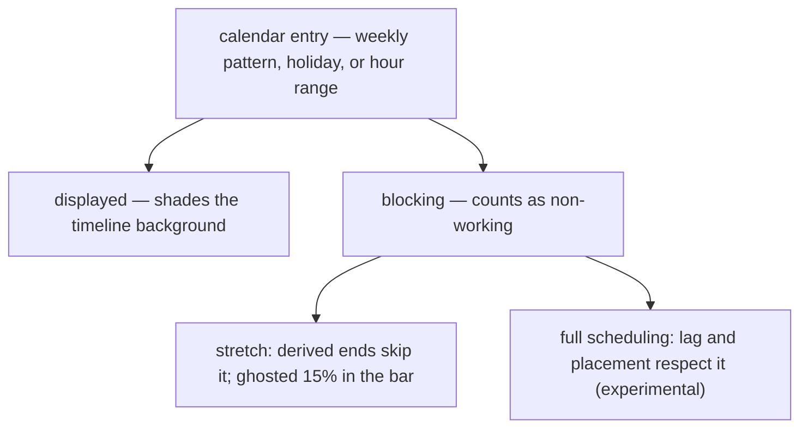
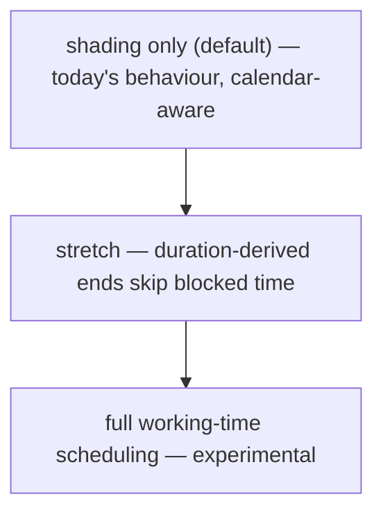
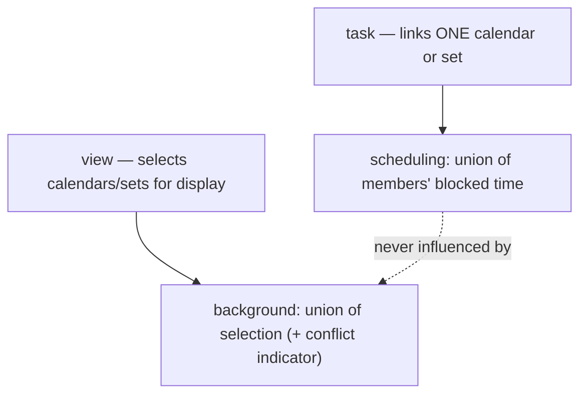

# Multi-Calendar Working Time - Plan

## Goal Capsule

- **Objective:** Multiple named calendars in the vault, associated to tasks, expressing displayed and blocking (non-working) time per the repo's iCalendar standards commitment — with an opt-in ladder from background shading through working-time stretching to full working-time scheduling.
- **Product authority:** Maintainer (Renato).
- **Open blockers:** None for planning. The RFC 9253 `GAP` interpretation (calendar-time vs working-time lag) blocks only the full-scheduling rung's implementation, not this plan.

---

## Product Contract

### Summary

Calendars are vault notes whose entries mark time as displayed on the chart and, independently, as blocking for scheduling; calendar sets group calendars and are usable wherever a calendar is. Tasks link one calendar or one set; unassociated tasks use a built-in display-only locale-weekend default that reproduces today's chart exactly. The view's background shades the union of explicitly selected calendars, while each task's scheduling follows only its own association. A per-view functionality selector opts into calendar-aware shading (default), working-time stretching of duration-derived tasks (blocked time ghosted at 15% inside the bar), or full working-time scheduling (experimental). Calendars carry a colour, available as a bar colour source. Gantt markers are calendar events flagged as markers — labeled vertical lines rather than column shading. An opt-in row-shading mode additionally tints each task's row by its own calendar's colour. Calendar and set notes open as visual editors, with raw markdown as the fallback.

### Problem Frame

The chart treats every day as equal. Weekend shading exists but is purely cosmetic and vault-wide: a three-working-day task starting Friday renders as ending Sunday, durations count calendar days, and no per-team or per-project schedule (a four-day week, a holiday calendar, working-hour ranges) can be expressed at all.

SVAR's own work-day calendar cannot fill this: it is Pro-gated in the installed MIT build (its config is reset at store init and its types are stubbed), and the repo's standards commitment (`docs/architecture/standards-alignment.md`) forbids any component library's calendar shape from becoming a boundary contract regardless. The model must be ours, RFC-shaped; the chart seams the plugin already owns — `highlightTime` (verified un-gated) and the custom bar template — do the rendering, following the proven gated-feature hand-roll pattern.

### Key Decisions

- **Displayed and blocking are independent properties of calendar time.** An entry shades the chart; an entry marked blocking additionally counts as non-working for scheduling. This maps directly to the standards family — display-only entries are transparent all-day events, blocking time is busy/unavailable availability — and it lets the default calendar shade weekends without asserting anyone's work schedule.
- **A calendar is a vault note; association is a wikilink.** The note's frontmatter defines the calendar; Obsidian's link maintenance makes renames safe, and calendars are inspectable, diffable, and travel with the vault. No parser is needed in v1; `.ics` arrives later as an import path where it is genuinely strongest (bulk holiday feeds).
- **The built-in default is display-only locale weekends.** Upgrade is a visual no-op, and no task's dates can ever move because of a calendar the user never chose. Scheduling behaviour is always authored, never inherited.
- **One per-view control, rungs opt-in, top rung experimental.** Shading only (default) → stretch → full scheduling. Users who care only about presentation never meet the scheduler.
- **Sets are calendars.** A calendar set is a named collection of calendars, usable anywhere a calendar is — a task links one calendar or one set, a view displays one or more. Sets are flat: their members must be calendars, never other sets. Stretch and scheduling over a set union its members' blocking time. This closes the multi-calendar need (NZ + AU + birthdays) without per-task multi-link tedium.
- **Presentation and scheduling are independent.** Which calendars shade the view's background is an explicit view-level multi-selection; each task's stretch and scheduling follow only its own associated calendar or set. Changing what the background shows can never move a task's dates.
- **Visual language is assigned by meaning.** Blocked time inside a stretched bar renders as a 15% ghost — the bar stays one continuous task. The split-bar gap language remains reserved for recurrence, so calendar gaps and occurrence gaps can never be confused.
- **Standards boundary holds.** Every calendar semantic must map losslessly to RFC 5545 / RFC 7953 (and RFC 9253 for dependency lag), per `docs/architecture/standards-alignment.md`. SVAR's Pro calendar is not used, patched, or imitated at any boundary.
- **Markers are flagged events, not a new entity.** A gantt marker is a display-only event with a marker flag — the same RFC object (transparent all-day event) with different presentation. A markers-only calendar note is a marker collection, so sets, the display picker, colour, and rename-safety apply with zero new machinery. SVAR's Pro `markers` (force-emptied by the same community reset) are not involved; rendering rides the un-gated `highlightTime` seam.
- **The note is the editor.** Calendar and set notes open as visual editors — the Kanban/Bases pattern this plugin's users already inhabit — with the standard open-as-markdown fallback. The file explorer and the display picker are the discovery surfaces; set notes act as scoped managers; no separate manager view is built.
- **Friendly keys, canonical values.** The schema uses self-explanatory key names with RFC vocabulary in the values — literal `RRULE` strings for recurring patterns (as TaskNotes stores recurrence), `BYDAY` codes, ISO dates. Compliance lives in a documented field-to-RFC mapping table shipped with the schema, per the standards doc's established-at-introduction rule.

### Requirements

**Calendar model and authoring**

- R1. A vault may define multiple named calendars, each a note whose frontmatter defines the calendar.
- R2. A calendar expresses a weekly recurring pattern, whole-day dates (holidays), and working-hour ranges, each losslessly mappable to the RFC 5545/7953 family.
- R3. Every entry is displayed as timeline shading; an entry additionally marked blocking counts as non-working for stretch and scheduling.
- R4. Working-hour ranges are part of the model from day one; their rendering and scheduling effects are day-granularity first, with hour-granularity effects deferred.
- R5. Calendar and set notes open as visual editors — the note is the editor, with the standard open-as-markdown fallback — and creation is available from the command palette and the calendar picker. Hand-writing the frontmatter remains a supported path, never a required one.
- R21. The schema pairs self-explanatory keys with canonical values: the recurring pattern is a literal `RRULE` string; dated entries live in two lists — `non_working` (blocking) and `events` (display-only) — each entry a bare date or an object; uniform hours may be authored as a single `working_hours` list of ranges, and when hours differ per day, availability blocks pair a pattern with hour ranges, mirroring the standard's own structure. The complement of `pattern` is blocking non-working time; a calendar with no `pattern` has a seven-day working week, so date-only calendars block just their dates. An optional `pattern_start` anchor date makes the full RRULE grammar evaluable (intervals, counts, until); an `events` entry may itself carry an rrule, which is how display-only recurring shading is authored.
- R26. A calendar or set whose frontmatter fails to parse, or whose pattern is invalid or unsupported, is visibly flagged and contributes nothing — it neither blocks nor unblocks time, and no task's dates change because of it. Fail-visible, never fail-open.
- R22. The schema ships with a documented field-to-RFC mapping table, established when the schema is introduced.
- R24. The calendar editor previews the authored pattern live in three switchable tabs: (1) a week view — seven day columns rendering the working pattern and hour ranges as time blocks, the only mode that shows hours, labelling hour ranges as authored-now, honoured when hour-granularity lands; (2) a zoomed-out gantt strip — background shading and marker lines rendered exactly as a real chart would, a rehearsal of the live view; (3) a year-at-a-glance grid in the GitHub-contributions style (weekday rows × week columns, sparse weekday labels, intensity legend) — weekly patterns read as horizontal bands, dated entries as cells, intensity/hue distinguishing blocking, display-only, and marker entries; month outlines and multi-year bands are optional refinements. Tabs may ship incrementally. Authors see the effect of the pattern they are creating before it touches any real view.

**Sets and association**

- R6. A task names its calendar by wikilink through a configured task property; no property name is hardcoded. The link may point at a calendar or at a calendar set. Association is authored on the task note itself (frontmatter or TaskNotes' own property UI); there is no in-chart association control.
- R7. A task naming no calendar uses the built-in default: display-only locale weekends — today's shading, asserting nothing about work.
- R8. Renaming a calendar or set note keeps task associations resolving, riding Obsidian's link maintenance (the default-on "Automatically update internal links" setting); when a link nonetheless breaks, R27's fail-safe applies.
- R18. A calendar set is a named collection of calendars, usable anywhere a single calendar is accepted. A set's own members must be calendars — the sole exception to that substitutability; sets do not nest.
- R19. Stretch and scheduling over a set treat the union of its members' blocking time as blocked.
- R27. An association that does not resolve to a valid calendar or set (dangling link, deleted note, wrong-type target) is visibly flagged; the task keeps the built-in default's display behaviour, and stretch and scheduling are suspended for it — its dates render as authored, never silently recomputed.

**Chart behaviour — functionality selector and display options**

- R9. A per-view selector chooses the level: shading only (default), stretch, or full working-time scheduling (experimental). Each level includes the ones below it.
- R10. Shading: the view's background shades the union of the non-working and displayed time of the calendars selected for display — adding a calendar only ever adds shading. The display multi-select is an always-available view control listing the calendars present with short descriptions; with zero calendars in the vault it opens to an empty state carrying the create action (the feature's front door), and the built-in default appears as a normal deselectable row — deselecting it turns weekend shading off, and the legacy weekend-highlight option maps onto that row's state. A selected set exposes per-member enable/disable. When multiple calendars are in effect, a sticky banner (the retained-ancestors notice pattern) surfaces it as a shortcut into the picker; where selected calendars disagree about a day, a discreet conflict indicator in the banner lists the calendars that treat a shaded day as working. Per-task calendars never repaint the shared background (R25's opt-in row shading overlays a task's own row without altering it), and the display selection never affects any task's scheduling.
- R11. Stretch: a task whose end derives from a duration or estimate skips its calendar's blocked time when computing the end — a three-working-day task starting Friday on a blocked-weekend calendar ends Tuesday. Symmetrically, a task whose start derives from a due date and duration derives the start backward, skipping blocked time; the authored date never moves.
- R12. A task with an explicitly authored start and end never has its dates changed at the shading or stretch levels.
- R13. Full scheduling (experimental): dependency lag and dependent-task placement respect blocked time; its concrete semantics — including the RFC 9253 `GAP` interpretation — are settled in that rung's own planning before implementation.
- R25. Per-task-calendar row shading, as an opt-in display option: each task row's background cells are tinted by that task's own calendar, in a light variant of the calendar's colour — SVAR Pro's "task calendars" appearance. Row-scoped and distinct from the shared column background (R10): within a tinted row the row shading wins; rows whose task has no association keep the shared background. The display picker doubles as the colour legend. Droppable without renegotiation if the planning-phase feasibility check proves expensive — no other requirement depends on it.

**Rendering language**

- R14. Blocked time inside a stretched bar renders as a 15%-opacity ghost of the bar, so the shaded background reads through; the bar remains one continuous task.
- R15. The split-bar gap language is reserved for recurrence/split-task rendering and is never used for calendar non-working time.
- R16. With no calendars authored and default settings, the chart is pixel-equivalent to today's.
- R23. An `events` entry flagged as a marker renders as a labeled vertical line at its date instead of column shading; its visibility follows the view's display selection, and its line colour follows the owning calendar or set.

**Calendar colour**

- R20. A calendar carries a colour, and "calendar" is available as a bar colour source with the existing fill and strip modes, selected in view settings. A set carries its own colour, which wins for tasks linked to the set.

**Standards and licensing**

- R17. No SVAR Pro feature is used or re-enabled; rendering uses un-gated seams (`highlightTime`, the custom bar template) following `docs/solutions/design-patterns/reproducing-gated-svar-gantt-features.md`.

### Authored shape (directional)

The user-facing frontmatter, per R21 — field names final in planning; the structure and semantics are decided. Bare dates are RFC-legal (a `DATE`-valued event with no end is one day long by the standard's own default); flow-style (`{...}`) and block-style entries are interchangeable YAML.

```yaml
# Calendars/Engineering.md
---
tngantt: calendar                  # marks the note; opens as the visual editor
description: Mon–Fri 9–17, NZ public holidays
color: "#2a9d8f"
pattern: "FREQ=WEEKLY;BYDAY=MO,TU,WE,TH,FR"   # literal RRULE — the working pattern
# pattern_start: 2026-01-05        # optional anchor — unlocks INTERVAL/COUNT/UNTIL (R21)
working_hours: ["09:00-17:00"]     # list allows split shifts
# general form when hours differ per day — one item per RFC AVAILABLE block:
# availability:
#   - pattern: "FREQ=WEEKLY;BYDAY=TU,TH"
#     hours: ["09:00-17:00"]
#   - pattern: "FREQ=WEEKLY;BYDAY=MO,WE,FR"
#     hours: ["09:00-12:00"]
non_working:                       # BLOCKING — shades and counts as non-working
  - 2026-12-25
  - date: 2026-02-06
    name: Waitangi Day
  - start: 2026-12-29              # inclusive range; boundary maps to exclusive DTEND
    end: 2027-01-02
    name: Summer shutdown
events:                            # DISPLAY-ONLY — shades, never blocks
  - date: 2026-04-10
    name: Good Friday
  - date: 2026-08-30               # marker: labeled vertical line instead of shading
    name: v1.0 release
    marker: true
  # - pattern: "FREQ=WEEKLY;BYDAY=SA,SU"        # recurring display-only shading (R21)
  #   name: Weekend
---
```

```yaml
# Calendars/APAC.md
---
tngantt: calendar-set
description: APAC coverage
color: "#e76f51"                   # the set's colour wins for set-linked tasks (R20)
calendars:
  - "[[NZ Holidays]]"
  - "[[AU Holidays]]"
  - "[[Birthdays]]"
---
```

### Visualizations

The two independent properties of calendar time, and where each acts:



The functionality ladder — each rung opt-in, containing the ones below:



Sets are calendars — one association rule everywhere, presentation separate from scheduling:



### Acceptance Examples

- AE1. Upgrade is a no-op.
  - **Given:** a vault with no calendar notes and default settings.
  - **Then:** the chart renders identically to today, including weekend shading.
  - **Covers R7, R16.**
- AE2. Stretch skips blocked time.
  - **Given:** a task with a three-working-day duration starting Friday, on a calendar that blocks weekends, at the stretch level.
  - **Then:** the task ends Tuesday, and Saturday–Sunday render as a 15% ghost inside the bar.
  - **Covers R3, R11, R14.**
- AE3. The display-only default never stretches.
  - **Given:** the same task on the built-in default calendar at the stretch level.
  - **Then:** its end is unchanged — nothing blocks, so nothing stretches.
  - **Covers R7, R11.**
- AE4. Authored dates never move.
  - **Given:** a task with explicit start and due dates crossing blocked time, at the stretch level.
  - **Then:** its dates render exactly as authored.
  - **Covers R12.**
- AE5. Renames are safe.
  - **Given:** tasks associated to a calendar note, with Obsidian's "Automatically update internal links" setting active (its default).
  - **When:** the note is renamed.
  - **Then:** every association still resolves.
  - **Covers R8.**
- AE6. Calendar gaps and recurrence gaps stay distinct.
  - **Given:** a recurring split task and a stretched task on the same chart.
  - **Then:** occurrence gaps render as bar splits; blocked time renders as in-bar ghost — the two languages never coincide.
  - **Covers R14, R15.**
- AE7. A set schedules as the union of its members.
  - **Given:** a task linked to a set containing NZ and AU holiday calendars, at the stretch level.
  - **Then:** its derived end skips days blocked by either calendar.
  - **Covers R18, R19.**
- AE8. Display selection never moves dates.
  - **Given:** a stretched task, and the user changes which calendars the view's background displays.
  - **Then:** the background shading changes; the task's start and end do not.
  - **Covers R10.**
- AE9. A marker renders as a line, not shading.
  - **Given:** a calendar selected for display containing an `events` entry flagged as a marker.
  - **Then:** a labeled vertical line renders at that date in the calendar's colour, and that date's column is not shaded by the entry.
  - **Covers R23.**
- AE10. Row shading follows each task's own calendar.
  - **Given:** row shading enabled, and adjacent tasks associated to a weekends-off calendar and a Wednesdays-off calendar.
  - **Then:** each row's cells tint that task's non-working days in its calendar's colour, while a task with no association keeps the shared background — and no task's dates change.
  - **Covers R25.**

### Success Criteria

- A team can express "we don't work Fridays and these are our holidays" as a calendar note, point tasks at it, and see both honest shading and honest working-time ends.
- Existing vaults upgrade with zero visible change until a user opts in.
- Every calendar semantic in the plugin can be shown to round-trip to RFC 5545/7953 shapes.
- Key vault dates — releases, holidays, shutdowns — are visible on the chart itself, without opening any note.
- A chart mixing several calendars is scannable by calendar at a glance (colour source, row shading).
- A first-time author produces a correct calendar through the editor and its previews without reading any RFC.

### Delivery Slices

Sequencing inside the committed scope — each slice shippable on its own, later slices addable without renegotiating earlier ones:

- **S1 — core:** calendar note schema + field-to-RFC mapping table, task association, built-in default, calendar-aware background shading, stretch in both directions with the 15% ghost. Hand-written frontmatter suffices at this slice. Covers AE1–AE6.
- **S2 — multi-calendar display:** sets, the display picker / sticky banner / conflict indicator, union background. Covers AE7–AE8.
- **S3 — authoring:** the note-as-editor with its preview tabs, shipped incrementally per R24.
- **S4 — chart identity:** markers (AE9), calendar as bar colour source, row shading (AE10; droppable per R25).

The experimental full-scheduling rung keeps its own later planning cycle regardless of slicing (R13).

### Scope Boundaries

- Toolbar quick actions — both the presentation switcher and the colour-source quick-toggle (status ↔ calendar ↔ …) — deferred until the feature settles; view settings are the only control for now.
- TaskNotes-brokered calendar feeds (Google / Outlook / ICS subscriptions) as calendar sources — phase two by choice, not blocked: TaskNotes' `icsSubscriptionService.getAllEvents()` is publicly reachable in-process today, but it is an unversioned internal surface, so we defer feed-backed calendars until TaskNotes commits to a stable calendar API rather than couple to plugin internals (verify against TaskNotes origin/main when picked up). They join behind the same availability seam.
- `.ics` import (bulk holiday feeds) — deferred alongside phase two.
- Hour-granularity rendering and scheduling effects of working-hour ranges.
- Recurrence-as-segments — its own deferred brainstorm; this feature only reserves the split-bar language for it.
- A "today" vertical line — a view-level freebie of the marker renderer (generated, never stored); can land with markers or after.
- Timed (non-all-day) markers — deferred with the other hour-granularity effects.
- Editing or writing back anything to TaskNotes; calendars are a plugin-side concept.

### Dependencies and Assumptions

- The availability seam exists and is the designed extension point: `src/controller/availability.ts` (`AvailabilitySource`, `buildAvailability`, locale-weekend source, `BYDAY` projection), wired through `highlightTime` — which is verified un-gated in the MIT SVAR build.
- `src/controller/durationConversion.ts`'s flat 1440-minute day is documented as the placeholder a working-time schedule replaces; `datePolicy.ts` spans are calendar-day only today.
- SVAR's own calendar is Pro-gated twice (config reset at store init, types stubbed) — verified; its `markers` are force-emptied by the same reset and confirmed non-rendering by the probe battery. Neither is a dependency.
- Marker rendering has an un-gated path: `highlightTime` classes per timeline cell plus the plugin's established injected-stylesheet pattern for per-date labels — no pixel math, no SVAR internals. Details belong to planning.
- Row shading (R25) is the one rendering surface with no column-level seam — `highlightTime` is column-scoped — so it needs a hand-rolled row-scoped layer (row order and cell height are available from the same reactive state the perf harness already reads, through the contract choke-point discipline). SVAR Pro's "task calendars" demo is the visual reference; feasibility is a planning task, flagged here honestly.
- The split-task production feature (`docs/plans/2026-07-18-002-feat-split-task-segment-rendering-plan.md`) is a planned follow-up, and the two features must share one rendering code path: both draw runs positioned as fractions of the bar — split-task paints them as separated segments, the calendar paints them solid-plus-ghost. The calendar implementation builds that substrate (from the `test/probe/` reference: bar-as-ruler fractions, contract choke-point) in shared form rather than privately, so the split-task follow-up reuses it instead of duplicating it.
- The sticky-banner + notice pattern for surfacing multiple calendars already exists in the plugin (the retained-ancestors notice); the multi-select modal is new surface.
- The note-as-editor (R5) rides Kanban-style markdown-view routing keyed on the `tngantt: calendar` frontmatter marker — a real, proven Obsidian mechanism, but not a clean registration like Bases `.base` views. Two risks planning must own: coexistence when another installed plugin also claims frontmatter-routed markdown views, and raw markdown as the guaranteed floor if the routing pattern ever breaks.
- The bar treatment system already supports fill and strip colour modes keyed on a colour source (status/priority/theme) — "calendar" joins as a source rather than inventing a styling mechanism.
- Decision-sketch renders that drove the treatment choice live at `test/probe/demo/` (`CalendarDemo.svelte` and companions), currently uncommitted.

### Outstanding Questions

**Deferred to planning**

- Final field-name polish of the authored shape, and validation/error behaviour for malformed frontmatter (the structure and semantics are decided; see Authored shape and R21–R22).
- The association property key and the selector's option naming.
- The editor's minimum viable surface within the note-as-editor paradigm (which fields get rich controls first).
- Row-shading details: the exact tint derivation from the calendar colour, and blending where a row tint overlaps the shared column background.

**Open product questions**

- Should a user-configured vault- or view-level default calendar exist for tasks that name no calendar (useful at team scale, where per-task association is tedious)? If added, it must preserve the invariant that only an explicit user choice can ever move dates.

**Deferred to the full-scheduling rung's own planning**

- The RFC 9253 `GAP` interpretation — calendar-time vs working-time lag — recorded as an open tension in `docs/architecture/standards-alignment.md`.

### Sources / Research

- `docs/architecture/standards-alignment.md` — the exclusive RFC 5545/7953/9253 authority, the boundary-mapping obligation, and the recorded `GAP` tension.
- `src/controller/availability.ts` — the shipped availability seam this feature extends.
- `src/bases/GanttContainer.svelte` (`highlightTime` wiring) and `src/bases/viewOptions.ts` (`tngantt_highlightWeekends`, option-group precedent).
- `src/controller/durationConversion.ts` and `src/controller/datePolicy.ts` — the calendar-time math the stretch rung supersedes.
- `docs/solutions/design-patterns/reproducing-gated-svar-gantt-features.md` — the gated-feature hand-roll pattern; `docs/solutions/integration-issues/svar-pro-feature-render-support.md` — the gate mechanism.
- `test/probe/` — the split-task reference implementation whose geometry and contract machinery the ghost treatment reuses; `test/probe/demo/` — the calendar treatment decision sketches.
- `src/bases/fieldMappingConfig.ts` — the configured-property pattern for the association property.
- TaskNotes mirror findings: subscription services and TimeBlocks exist; no working-hours model; `CalendarsController` is internal HTTP, not a plugin API.
