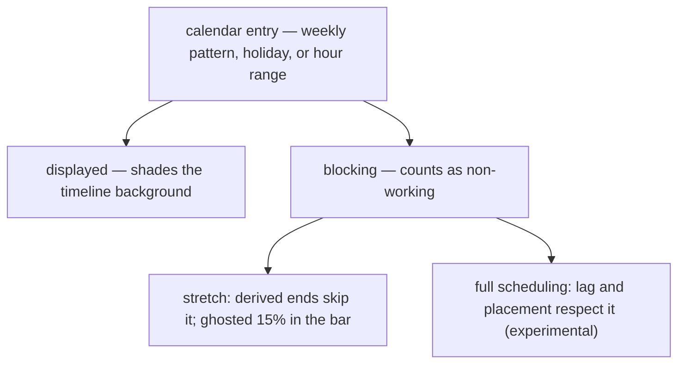
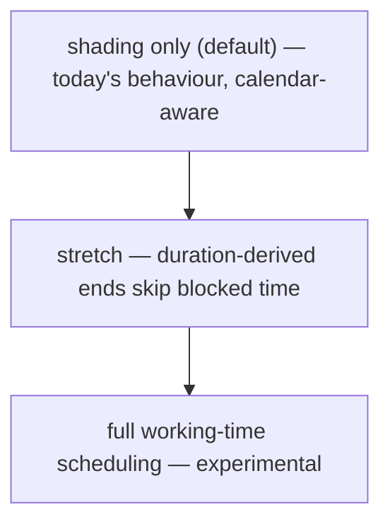
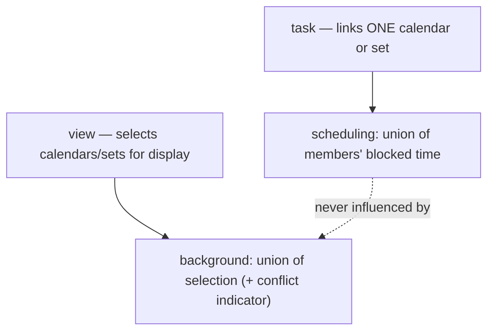
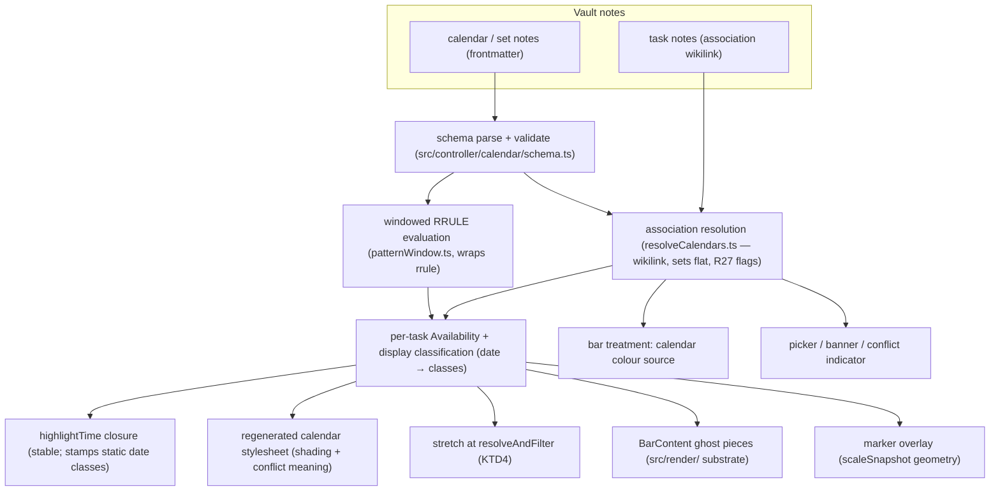
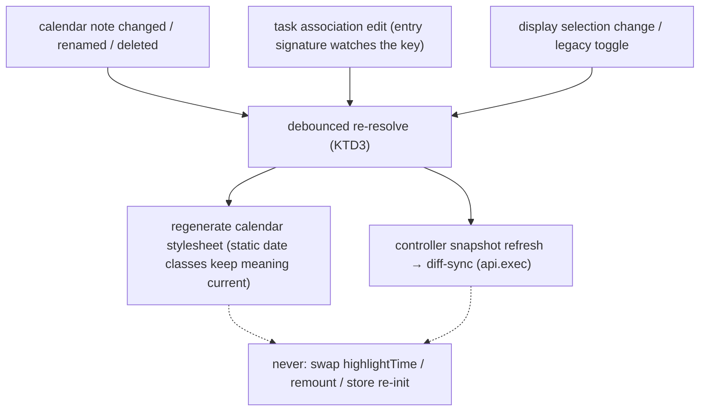
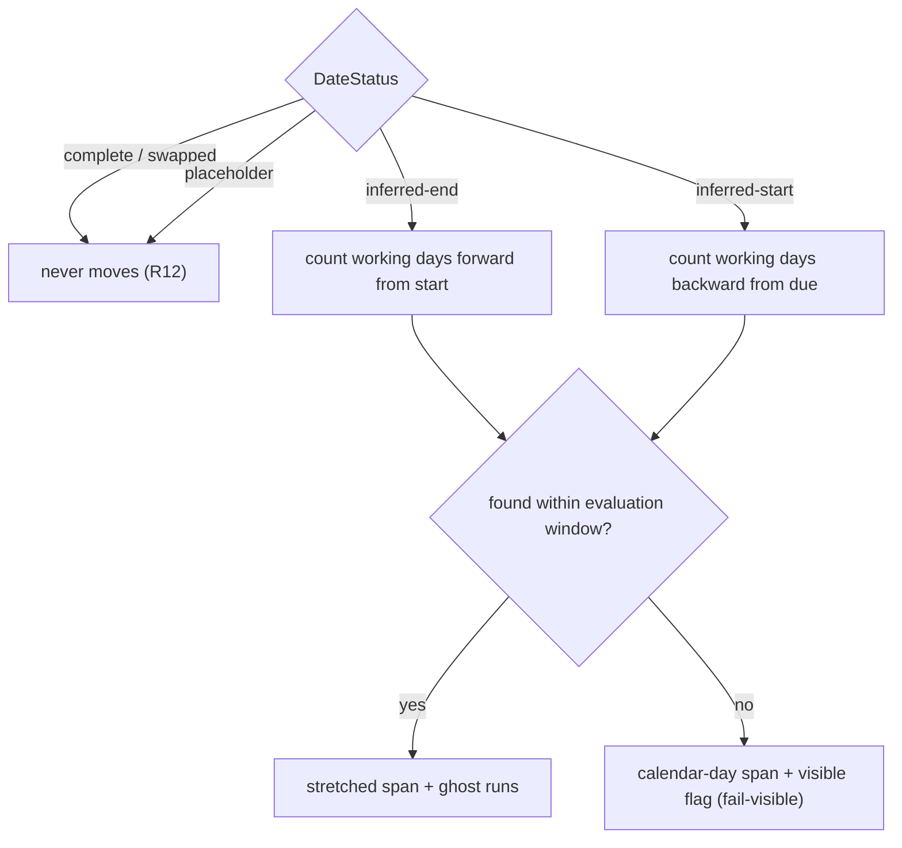

# Multi-Calendar Working Time - Plan

## Goal Capsule

- **Objective:** Multiple named calendars in the vault, associated to tasks, expressing displayed and blocking (non-working) time per the repo's iCalendar standards commitment — with an opt-in ladder from background shading through working-time stretching to full working-time scheduling.
- **Product authority:** Maintainer (Renato). Authority order during execution: user instructions > repo conventions (AGENTS.md and `docs/conventions/`) > this plan > implementer judgment on details the plan leaves open.
- **Execution profile:** Written for a fully autonomous run. Every fork has a decided default in the Planning Contract; completion is judged only by the Verification Contract's machine-checkable gates and the Definition of Done. Work the units in dependency order (execution order: slices S1 → S2 → S4 → S3).
- **Stop conditions:** Surface instead of guessing when (1) an approach would require patching, re-enabling, or weakening the SVAR community gate (R17 / licence — never do this); (2) a unit would need SVAR private state outside the `svarContract` choke-point beyond the documented reads (`_scales.diff`/`lengthUnit`/`durationUnit`, plus the `_scales.start`/`_scales.end` extension KTD6 documents); (3) code reality contradicts the Product Contract in a way that changes scope; (4) the e2e harness is environmentally broken (Obsidian cannot launch) — report it, never claim verification that did not run. U13 (row shading) has its own recorded drop rule and is not a stop condition.
- **Tail ownership:** Each unit lands as its own green-CI, squash-merged PR before the next unit begins (maintainer's standing authorization for this run). The run ends when all units are merged and the final deviations report is delivered.
- **Open blockers:** None. Both remaining Outstanding Questions are deferred (non-blocking).

---

## Product Contract

Preserved from the review-hardened requirements version (AE1–AE10 unchanged; R1–R27 unchanged except R4, extended at the maintainer's direction with the optional per-calendar timezone — authored and validated now, honoured at hour granularity). The former "Deferred to planning" Outstanding Questions are resolved in the Planning Contract below; the two that remain are deferred and non-blocking.

### Summary

Calendars are vault notes whose entries mark time as displayed on the chart and, independently, as blocking for scheduling; calendar sets group calendars and are usable wherever a calendar is. Tasks link one calendar or one set; unassociated tasks use a built-in display-only locale-weekend default that reproduces today's chart exactly. The view's background shades the union of explicitly selected calendars, while each task's scheduling follows only its own association. A per-view functionality selector opts into calendar-aware shading (default), working-time stretching of duration-derived tasks (blocked time ghosted at 15% inside the bar), or full working-time scheduling (experimental). Calendars carry a colour, available as a bar colour source. Gantt markers are calendar events flagged as markers — labeled vertical lines rather than column shading. An opt-in row-shading mode additionally tints each task's row by its own calendar's colour. Calendar and set notes open as visual editors, with raw markdown as the fallback.

### Problem Frame

The chart treats every day as equal. Weekend shading exists but is purely cosmetic and vault-wide: a three-working-day task starting Friday renders as ending Sunday, durations count calendar days, and no per-team or per-project schedule (a four-day week, a holiday calendar, working-hour ranges) can be expressed at all.

SVAR's own work-day calendar cannot fill this: it is Pro-gated in the installed MIT build (its config is reset at store init and its types are stubbed), and the repo's standards commitment (`docs/architecture/standards-alignment.md`) forbids any component library's calendar shape from becoming a boundary contract regardless. The model must be ours, RFC-shaped; the chart seams the plugin already owns — `highlightTime` (verified un-gated) and the custom bar template — do the rendering, following the proven gated-feature hand-roll pattern.

### Key Decisions

- **Displayed and blocking are independent properties of calendar time.** An entry shades the chart; an entry marked blocking additionally counts as non-working for scheduling. This maps directly to the standards family — display-only entries are transparent all-day events, blocking time is busy/unavailable availability — and it lets the default calendar shade weekends without asserting anyone's work schedule.
- **A calendar is a vault note; association is a wikilink.** The note's frontmatter defines the calendar; Obsidian's link maintenance makes renames safe, and calendars are inspectable, diffable, and travel with the vault. No parser is needed in v1; `.ics` arrives later as an import path where it is genuinely strongest (bulk holiday feeds).
- **The built-in default is display-only locale weekends.** Upgrade is a visual no-op, and no task's dates can ever move because of a calendar the user never chose. Scheduling behaviour is always authored, never inherited.
- **One per-view control, rungs opt-in, top rung experimental.** Shading only (default) → stretch → full scheduling. Users who care only about presentation never meet the scheduler.
- **Sets are calendars.** A calendar set is a named collection of calendars, usable anywhere a calendar is — a task links one calendar or one set, a view displays one or more. Sets are flat: their members must be calendars, never other sets. Stretch and scheduling over a set union its members' blocking time. This closes the multi-calendar need (NZ + AU + birthdays) without per-task multi-link tedium.
- **Presentation and scheduling are independent.** Which calendars shade the view's background is an explicit view-level multi-selection; each task's stretch and scheduling follow only its own associated calendar or set. Changing what the background shows can never move a task's dates.
- **Visual language is assigned by meaning.** Blocked time inside a stretched bar renders as a 15% ghost — the bar stays one continuous task. The split-bar gap language remains reserved for recurrence, so calendar gaps and occurrence gaps can never be confused.
- **Standards boundary holds.** Every calendar semantic must map losslessly to RFC 5545 / RFC 7953 (and RFC 9253 for dependency lag), per `docs/architecture/standards-alignment.md`. SVAR's Pro calendar is not used, patched, or imitated at any boundary.
- **Markers are flagged events, not a new entity.** A gantt marker is a display-only event with a marker flag — the same RFC object (transparent all-day event) with different presentation. A markers-only calendar note is a marker collection, so sets, the display picker, colour, and rename-safety apply with zero new machinery. SVAR's Pro `markers` (force-emptied by the same community reset) are not involved; rendering rides the un-gated `highlightTime` seam.
- **The note is the editor.** Calendar and set notes open as visual editors — the Kanban/Bases pattern this plugin's users already inhabit — with the standard open-as-markdown fallback. The file explorer and the display picker are the discovery surfaces; set notes act as scoped managers; no separate manager view is built.
- **Friendly keys, canonical values.** The schema uses self-explanatory key names with RFC vocabulary in the values — literal `RRULE` strings for recurring patterns (as TaskNotes stores recurrence), `BYDAY` codes, ISO dates. Compliance lives in a documented field-to-RFC mapping table shipped with the schema, per the standards doc's established-at-introduction rule.

### Requirements

**Calendar model and authoring**

- R1. A vault may define multiple named calendars, each a note whose frontmatter defines the calendar.
- R2. A calendar expresses a weekly recurring pattern, whole-day dates (holidays), and working-hour ranges, each losslessly mappable to the RFC 5545/7953 family.
- R3. Every entry is displayed as timeline shading; an entry additionally marked blocking counts as non-working for stretch and scheduling.
- R4. Working-hour ranges and an optional per-calendar timezone (IANA name) are part of the model from day one; effects are day-granularity first — dates evaluate as floating local calendar days, with the timezone stored, validated, and round-tripped — and hour-granularity effects (working hours interpreted in the calendar's timezone) deferred.
- R5. Calendar and set notes open as visual editors — the note is the editor, with the standard open-as-markdown fallback — and creation is available from the command palette and the calendar picker. Hand-writing the frontmatter remains a supported path, never a required one.
- R21. The schema pairs self-explanatory keys with canonical values: the recurring pattern is a literal `RRULE` string; dated entries live in two lists — `non_working` (blocking) and `events` (display-only) — each entry a bare date or an object; uniform hours may be authored as a single `working_hours` list of ranges, and when hours differ per day, availability blocks pair a pattern with hour ranges, mirroring the standard's own structure. The complement of `pattern` is blocking non-working time; a calendar with no `pattern` has a seven-day working week, so date-only calendars block just their dates. An optional `pattern_start` anchor date makes the full RRULE grammar evaluable (intervals, counts, until); an `events` entry may itself carry an rrule, which is how display-only recurring shading is authored.
- R26. A calendar or set whose frontmatter fails to parse, or whose pattern is invalid or unsupported, is visibly flagged and contributes nothing — it neither blocks nor unblocks time, and no task's dates change because of it. Fail-visible, never fail-open.
- R22. The schema ships with a documented field-to-RFC mapping table, established when the schema is introduced.
- R24. The calendar editor previews the authored pattern live in three switchable tabs: (1) a week view — seven day columns rendering the working pattern and hour ranges as time blocks, the only mode that shows hours, labelling hour ranges as authored-now, honoured when hour-granularity lands; (2) a zoomed-out gantt strip — background shading and marker lines rendered exactly as a real chart would, a rehearsal of the live view; (3) a year-at-a-glance grid in the GitHub-contributions style (weekday rows × week columns, sparse weekday labels, intensity legend) — weekly patterns read as horizontal bands, dated entries as cells, intensity/hue distinguishing blocking, display-only, and marker entries; month outlines and multi-year bands are optional refinements. Tabs may ship incrementally. Authors see the effect of the pattern they are creating before it touches any real view.

**Sets and association**

- R6. A task names its calendar by wikilink through a configured task property; no property name is hardcoded. The link may point at a calendar or at a calendar set. Association is authored on the task note itself (frontmatter or TaskNotes' own property UI); there is no in-chart association control.
- R7. A task naming no calendar uses the built-in default: display-only locale weekends — today's shading, asserting nothing about work.
- R8. Renaming a calendar or set note keeps task associations resolving, riding Obsidian's link maintenance (the default-on "Automatically update internal links" setting); when a link nonetheless breaks, R27's fail-safe applies.
- R18. A calendar set is a named collection of calendars, usable anywhere a single calendar is accepted. A set's own members must be calendars — the sole exception to that substitutability; sets do not nest.
- R19. Stretch and scheduling over a set treat the union of its members' blocking time as blocked.
- R27. An association that does not resolve to a valid calendar or set (dangling link, deleted note, wrong-type target) is visibly flagged; the task keeps the built-in default's display behaviour, and stretch and scheduling are suspended for it — its dates render as authored, never silently recomputed.

**Chart behaviour — functionality selector and display options**

- R9. A per-view selector chooses the level: shading only (default), stretch, or full working-time scheduling (experimental). Each level includes the ones below it.
- R10. Shading: the view's background shades the union of the non-working and displayed time of the calendars selected for display — adding a calendar only ever adds shading. The display multi-select is an always-available view control listing the calendars present with short descriptions; with zero calendars in the vault it opens to an empty state carrying the create action (the feature's front door), and the built-in default appears as a normal deselectable row — deselecting it turns weekend shading off, and the legacy weekend-highlight option maps onto that row's state. A selected set exposes per-member enable/disable. When multiple calendars are in effect, a sticky banner (the retained-ancestors notice pattern) surfaces it as a shortcut into the picker; where selected calendars disagree about a day, a discreet conflict indicator in the banner lists the calendars that treat a shaded day as working. Per-task calendars never repaint the shared background (R25's opt-in row shading overlays a task's own row without altering it), and the display selection never affects any task's scheduling.
- R11. Stretch: a task whose end derives from a duration or estimate skips its calendar's blocked time when computing the end — a three-working-day task starting Friday on a blocked-weekend calendar ends Tuesday. Symmetrically, a task whose start derives from a due date and duration derives the start backward, skipping blocked time; the authored date never moves.
- R12. A task with an explicitly authored start and end never has its dates changed at the shading or stretch levels.
- R13. Full scheduling (experimental): dependency lag and dependent-task placement respect blocked time; its concrete semantics — including the RFC 9253 `GAP` interpretation — are settled in that rung's own planning before implementation.
- R25. Per-task-calendar row shading, as an opt-in display option: each task row's background cells are tinted by that task's own calendar, in a light variant of the calendar's colour — SVAR Pro's "task calendars" appearance. Row-scoped and distinct from the shared column background (R10): within a tinted row the row shading wins; rows whose task has no association keep the shared background. The display picker doubles as the colour legend. Droppable without renegotiation if the planning-phase feasibility check proves expensive — no other requirement depends on it.

**Rendering language**

- R14. Blocked time inside a stretched bar renders as a 15%-opacity ghost of the bar, so the shaded background reads through; the bar remains one continuous task.
- R15. The split-bar gap language is reserved for recurrence/split-task rendering and is never used for calendar non-working time.
- R16. With no calendars authored and default settings, the chart is pixel-equivalent to today's.
- R23. An `events` entry flagged as a marker renders as a labeled vertical line at its date instead of column shading; its visibility follows the view's display selection, and its line colour follows the owning calendar or set.

**Calendar colour**

- R20. A calendar carries a colour, and "calendar" is available as a bar colour source with the existing fill and strip modes, selected in view settings. A set carries its own colour, which wins for tasks linked to the set.

**Standards and licensing**

- R17. No SVAR Pro feature is used or re-enabled; rendering uses un-gated seams (`highlightTime`, the custom bar template) following `docs/solutions/design-patterns/reproducing-gated-svar-gantt-features.md`.

### Authored shape (directional)

The user-facing frontmatter, per R21 — field names final in planning; the structure and semantics are decided. Bare dates are RFC-legal (a `DATE`-valued event with no end is one day long by the standard's own default); flow-style (`{...}`) and block-style entries are interchangeable YAML.

```yaml
# Calendars/Engineering.md
---
tngantt: calendar                  # marks the note; opens as the visual editor
description: Mon–Fri 9–17, NZ public holidays
color: "#2a9d8f"
pattern: "FREQ=WEEKLY;BYDAY=MO,TU,WE,TH,FR"   # literal RRULE — the working pattern
# pattern_start: 2026-01-05        # optional anchor — unlocks INTERVAL/COUNT/UNTIL (R21)
working_hours: ["09:00-17:00"]     # list allows split shifts
# timezone: Pacific/Auckland       # optional IANA zone — stored now, honoured at hour granularity (R4)
# general form when hours differ per day — one item per RFC AVAILABLE block:
# availability:
#   - pattern: "FREQ=WEEKLY;BYDAY=TU,TH"
#     hours: ["09:00-17:00"]
#   - pattern: "FREQ=WEEKLY;BYDAY=MO,WE,FR"
#     hours: ["09:00-12:00"]
non_working:                       # BLOCKING — shades and counts as non-working
  - 2026-12-25
  - date: 2026-02-06
    name: Waitangi Day
  - start: 2026-12-29              # inclusive range; boundary maps to exclusive DTEND
    end: 2027-01-02
    name: Summer shutdown
events:                            # DISPLAY-ONLY — shades, never blocks
  - date: 2026-04-10
    name: Good Friday
  - date: 2026-08-30               # marker: labeled vertical line instead of shading
    name: v1.0 release
    marker: true
  # - pattern: "FREQ=WEEKLY;BYDAY=SA,SU"        # recurring display-only shading (R21)
  #   name: Weekend
---
```

```yaml
# Calendars/APAC.md
---
tngantt: calendar-set
description: APAC coverage
color: "#e76f51"                   # the set's colour wins for set-linked tasks (R20)
calendars:
  - "[[NZ Holidays]]"
  - "[[AU Holidays]]"
  - "[[Birthdays]]"
---
```

### Visualizations

The two independent properties of calendar time, and where each acts:



The functionality ladder — each rung opt-in, containing the ones below:



Sets are calendars — one association rule everywhere, presentation separate from scheduling:



### Acceptance Examples

- AE1. Upgrade is a no-op.
  - **Given:** a vault with no calendar notes and default settings.
  - **Then:** the chart renders identically to today, including weekend shading.
  - **Covers R7, R16.**
- AE2. Stretch skips blocked time.
  - **Given:** a task with a three-working-day duration starting Friday, on a calendar that blocks weekends, at the stretch level.
  - **Then:** the task ends Tuesday, and Saturday–Sunday render as a 15% ghost inside the bar.
  - **Covers R3, R11, R14.**
- AE3. The display-only default never stretches.
  - **Given:** the same task on the built-in default calendar at the stretch level.
  - **Then:** its end is unchanged — nothing blocks, so nothing stretches.
  - **Covers R7, R11.**
- AE4. Authored dates never move.
  - **Given:** a task with explicit start and due dates crossing blocked time, at the stretch level.
  - **Then:** its dates render exactly as authored.
  - **Covers R12.**
- AE5. Renames are safe.
  - **Given:** tasks associated to a calendar note, with Obsidian's "Automatically update internal links" setting active (its default).
  - **When:** the note is renamed.
  - **Then:** every association still resolves.
  - **Covers R8.**
- AE6. Calendar gaps and recurrence gaps stay distinct.
  - **Given:** a recurring split task and a stretched task on the same chart.
  - **Then:** occurrence gaps render as bar splits; blocked time renders as in-bar ghost — the two languages never coincide.
  - **Covers R14, R15.**
- AE7. A set schedules as the union of its members.
  - **Given:** a task linked to a set containing NZ and AU holiday calendars, at the stretch level.
  - **Then:** its derived end skips days blocked by either calendar.
  - **Covers R18, R19.**
- AE8. Display selection never moves dates.
  - **Given:** a stretched task, and the user changes which calendars the view's background displays.
  - **Then:** the background shading changes; the task's start and end do not.
  - **Covers R10.**
- AE9. A marker renders as a line, not shading.
  - **Given:** a calendar selected for display containing an `events` entry flagged as a marker.
  - **Then:** a labeled vertical line renders at that date in the calendar's colour, and that date's column is not shaded by the entry.
  - **Covers R23.**
- AE10. Row shading follows each task's own calendar.
  - **Given:** row shading enabled, and adjacent tasks associated to a weekends-off calendar and a Wednesdays-off calendar.
  - **Then:** each row's cells tint that task's non-working days in its calendar's colour, while a task with no association keeps the shared background — and no task's dates change.
  - **Covers R25.**

### Success Criteria

- A team can express "we don't work Fridays and these are our holidays" as a calendar note, point tasks at it, and see both honest shading and honest working-time ends.
- Existing vaults upgrade with zero visible change until a user opts in.
- Every calendar semantic in the plugin can be shown to round-trip to RFC 5545/7953 shapes.
- Key vault dates — releases, holidays, shutdowns — are visible on the chart itself, without opening any note.
- A chart mixing several calendars is scannable by calendar at a glance (colour source, row shading).
- A first-time author produces a correct calendar through the editor and its previews without reading any RFC.

### Delivery Slices

Sequencing inside the committed scope — each slice shippable on its own, later slices addable without renegotiating earlier ones:

- **S1 — core:** calendar note schema + field-to-RFC mapping table, task association, built-in default, calendar-aware background shading, stretch in both directions with the 15% ghost. Hand-written frontmatter suffices at this slice. Covers AE1–AE6.
- **S2 — multi-calendar display:** sets, the display picker / sticky banner / conflict indicator, union background. Covers AE7–AE8.
- **S3 — authoring:** the note-as-editor with its preview tabs, shipped incrementally per R24.
- **S4 — chart identity:** markers (AE9), calendar as bar colour source, row shading (AE10; droppable per R25).

The experimental full-scheduling rung keeps its own later planning cycle regardless of slicing (R13).

### Scope Boundaries

- Toolbar quick actions — both the presentation switcher and the colour-source quick-toggle (status ↔ calendar ↔ …) — deferred until the feature settles; view settings are the only control for now.
- TaskNotes-brokered calendar feeds (Google / Outlook / ICS subscriptions) as calendar sources — phase two by choice, not blocked: TaskNotes' `icsSubscriptionService.getAllEvents()` is publicly reachable in-process today, but it is an unversioned internal surface, so we defer feed-backed calendars until TaskNotes commits to a stable calendar API rather than couple to plugin internals (verify against TaskNotes origin/main when picked up). They join behind the same availability seam.
- `.ics` import (bulk holiday feeds) — deferred alongside phase two.
- Hour-granularity rendering and scheduling effects of working-hour ranges.
- Recurrence-as-segments — its own deferred brainstorm; this feature only reserves the split-bar language for it.
- A "today" vertical line — a view-level freebie of the marker renderer (generated, never stored); lands with markers (U11).
- Timed (non-all-day) markers — deferred with the other hour-granularity effects.
- Editing or writing back anything to TaskNotes; calendars are a plugin-side concept.

### Dependencies and Assumptions

- The availability seam exists and is the designed extension point: `src/controller/availability.ts` (`AvailabilitySource`, `buildAvailability`, locale-weekend source, `BYDAY` projection), wired through `highlightTime` — which is verified un-gated in the MIT SVAR build.
- `src/controller/durationConversion.ts`'s flat 1440-minute day is documented as the placeholder a working-time schedule replaces; `datePolicy.ts` spans are calendar-day only today.
- SVAR's own calendar is Pro-gated twice (config reset at store init, types stubbed) — verified; its `markers` are force-emptied by the same reset and confirmed non-rendering by the probe battery. Neither is a dependency.
- Marker rendering has an un-gated path: an absolutely-positioned overlay whose geometry comes from the `svarContract` scale snapshot (the probe-proven reader) — SVAR's day/hour-only cell rendering rules out cell-class markers at zoomed-out scales.
- Row shading (R25) is the one rendering surface with no column-level seam — `highlightTime` is column-scoped — so it needs a hand-rolled row-scoped layer. SVAR Pro's "task calendars" demo is the visual reference; U13 carries the feasibility check and drop rule.
- The split-task production feature (`docs/plans/2026-07-18-002-feat-split-task-segment-rendering-plan.md`) is a planned follow-up, and the two features must share one rendering code path: both draw runs positioned as fractions of the bar — split-task paints them as separated segments, the calendar paints them solid-plus-ghost. This plan builds that substrate in shared form (U7) so the follow-up reuses it.
- The sticky-banner + notice pattern for surfacing multiple calendars already exists in the plugin (the retained-ancestors notice); the multi-select modal is new surface.
- The bar treatment system already supports fill and strip colour modes keyed on a colour source (status/priority/theme) — "calendar" joins as a source rather than inventing a styling mechanism.
- The note-as-editor (R5) rides Kanban-style markdown-view routing keyed on the `tngantt: calendar` frontmatter marker. Verified: neither this plugin nor the TaskNotes mirror has any frontmatter-routed view today — this is genuinely new plumbing. Two risks the plan owns in U14: coexistence when another installed plugin also claims frontmatter-routed views, and raw markdown as the guaranteed floor.
- Decision-sketch renders that drove the treatment choice live at `test/probe/demo/` (`CalendarDemo.svelte` and companions).

### Outstanding Questions

Both deferred; neither blocks implementation.

- Should a user-configured vault- or view-level default calendar exist for tasks that name no calendar (useful at team scale)? Deferred product enhancement; if added, it must preserve the invariant that only an explicit user choice can ever move dates.
- The RFC 9253 `GAP` interpretation — calendar-time vs working-time lag — deferred to the full-scheduling rung's own planning (R13); recorded as an open tension in `docs/architecture/standards-alignment.md`.

### Sources / Research

- `docs/architecture/standards-alignment.md` — the exclusive RFC 5545/7953/9253 authority, the boundary-mapping obligation, and the recorded `GAP` tension.
- `src/controller/availability.ts` — the shipped availability seam this feature extends.
- `src/bases/GanttContainer.svelte` (`highlightTime` wiring) and `src/bases/viewOptions.ts` (`tngantt_highlightWeekends`, option-group precedent).
- `src/controller/durationConversion.ts` and `src/controller/datePolicy.ts` — the calendar-time math the stretch rung supersedes.
- `docs/solutions/design-patterns/reproducing-gated-svar-gantt-features.md` — the gated-feature hand-roll pattern; `docs/solutions/integration-issues/svar-pro-feature-render-support.md` — the gate mechanism.
- `test/probe/` — the split-task reference implementation whose geometry and contract machinery the ghost treatment reuses; `test/probe/demo/` — the calendar treatment decision sketches.
- `src/bases/fieldMappingConfig.ts` — the configured-property pattern for the association property.
- TaskNotes mirror findings: subscription services and TimeBlocks exist; no working-hours model; `CalendarsController` is internal HTTP, not a plugin API; TaskNotes bundles `rrule@^2.8.1`.

---

## Planning Contract

### Key Technical Decisions

- KTD1. **RRULE evaluation uses the `rrule` npm library, wrapped and windowed.** Add `rrule` (the same library TaskNotes bundles at `^2.8.1`) as a runtime dependency, bundled into `main.js` like SVAR. It is wrapped in one evaluator module (`src/controller/calendar/patternWindow.ts`); the library type never appears at any boundary (internal models may be pragmatic; boundary shapes may not). Dates cross the wrapper as floating local Y/M/D: construct rrule inputs with `Date.UTC(y, m, d)` and read results back via UTC components — never local-time arithmetic through the library (DST safety, matching the repo's existing calendar-day discipline in `datePolicy.ts`). Evaluation is always over a finite window computed from pre-stretch spans (breaking the window↔stretch circularity): the timeline range plus a look-ahead/behind margin that starts at the longest task duration in view and doubles until the stretch search succeeds or a hard ceiling is hit — 8× the longest in-view duration plus the maximum authored blocked range across resolved calendars. The window is shared: one evaluation window per resolve pass, widened monotonically while any task's search fails, each widening materializing only the delta (occurrence sets extend, never rebuild); the memo key is (calendar note path, definition hash, window), reused across passes until a liveness input invalidates the definition. Nothing is materialized beyond the active window. A calendar's optional `timezone` (R4) is authored and validated but deliberately inert in v1 evaluation — all day-granularity math stays floating local calendar days; the zone becomes load-bearing when hour-granularity lands, which is why it ships in the schema now (v1-authored calendars need no migration). Rejected alternative: hand-rolling the grammar — the existing `BYDAY` projection covers plain weekly patterns, but R21 commits to intervals/counts/until and `events` rrules, and a partial hand-rolled grammar is exactly the silently-wrong-dates risk R26 forbids.
- KTD2. **Shading stays on the availability seam with static date-identity classes; all dynamics live in the injected stylesheet.** SVAR reads `highlightTime` into store state at init — a new prop reference re-inits the store and drops zoom/scroll — and its shading layer re-derives only on scale/viewport changes, so no in-place data mutation behind the closure can repaint existing cells (both verified against the installed sources). The stable closure therefore stamps *static* classes only: SVAR's theme-native `wx-weekend` for the session-constant locale default, plus a per-date identity class (`og-d-<date>`) on day/hour cells. What a date class *means* — shaded, conflicted, by which calendar — is decided entirely by the managed injected stylesheet, which re-resolution regenerates; CSS changes apply instantly to already-rendered cells, so liveness needs no SVAR repaint at all (the `og-weekends-off` CSS-gate precedent, generalized). The classifier keeps its own `unit === 'day' || 'hour'` gate (the scale header calls the hook ungated at every zoom).
- KTD3. **One liveness entry point feeding the existing reseed path.** Calendar-note content edits (via `metadataCache` `changed`), renames and deletions (via `vault` `rename`/`delete` — the metadata cache has no rename event), association edits, selection changes, and the legacy weekend toggle all funnel through one debounced re-resolve that (a) regenerates the calendar stylesheet (KTD2) and (b) refreshes chart data through the existing controller-snapshot/diff-sync path (`api.exec`) when task-affecting inputs changed, never a prop reassignment or remount. The data path also feeds the stylesheet structurally: after every controller snapshot refresh, the resolved calendar-identity set of the current result and the resolved timeline range are compared against the values the last stylesheet generation used, and the stylesheet regenerates when either differs — so task-side changes the watcher cannot see (a new association entering the result, autoScale range extension past the evaluated window) still reach shading. Timers go through the shared `src/bases/scheduler.ts` wrappers. The association property key joins `entrySignature`'s watched frontmatter keys — a field the signature does not watch is a field whose edits the chart will not see (`reuseTasks` gate). The `reuseTasks` gate itself is sacrosanct: never removed or weakened.
- KTD4. **Stretch intervenes at the single date-derivation hook and is presentational.** `GanttController.resolveAndFilter()` is where `applyDatePolicy` computes derived spans; a working-time stretch step runs there when the view's calendar mode is `stretch`, using only the task's own resolved availability. Only `inferred-end` (start + duration forward) and `inferred-start` (due + duration backward) stretch; `complete`/`swapped`/`placeholder` never move (R12). The search widens with the evaluation window (KTD1's doubling margin): only when the working days cannot be found by the hard ceiling (e.g. a fully-blocked calendar) does it fall back to the calendar-day span and flag the task — fail-visible, never a hang, and never a spurious flag merely because a long shutdown outsizes the initial margin. The authored anchor day renders as authored (ghosted if blocked) but does not consume duration. Stretched spans are never written back; when stretch is active, the resize write path counts working days (not calendar days) so estimate round-tripping is preserved.
- KTD5. **The probe substrate is promoted to shared production modules; one bar template renders everything.** `test/probe/segmentLayout.ts` and `test/probe/svarContract.ts` move to `src/render/` (shared with the split-task follow-up, per the five techniques in `docs/solutions/design-patterns/reproducing-gated-svar-gantt-features.md`). `BarContent.svelte` (already wired as the stable production `taskTemplate`) grows the ghost branch: blocked runs as bar-fraction pieces, non-working pieces at 15% opacity, `wx-split` stamped via the attachment so SVAR's own transparent rule applies. `svarContract.scaleSnapshot` remains the only reader of SVAR private state; `null` degrades to a plain bar. The split-task plan (`docs/plans/2026-07-18-002-feat-split-task-segment-rendering-plan.md`) references the same `src/render/` destination — reconciled in both documents.
- KTD6. **Markers are a plugin-owned overlay positioned from the contract choke-point — no new private-state readers.** SVAR creates per-column cells only at day/hour units, so cell-class markers would vanish at the week/month/quarter zooms users actually plan at (including the default month scale). Markers and the today line therefore render as an absolutely-positioned overlay in the chart area, with date→x computed from `svarContract.scaleSnapshot`, extended for this feature with `_scales.start` and `_scales.end` (read from the same store object as `diff`/`lengthUnit`, runtime-validated and pinned by the same oracle probe; `null` still hides the overlay gracefully): marker x = `diff(markerDate, start, lengthUnit) / diff(end, start, lengthUnit)` of the full-width chart area, so panning needs no recompute; geometry recomputes on the public `zoom-scale` event and on every re-resolve/data pass (covering autoScale range changes) — the same signal source U10's conflict memo uses. Line and label colour follow the owning calendar. Collisions group by rendered proximity, not merely identical dates: markers whose labels would overlap within a stated pixel tolerance stack deterministically by owning-calendar order and collapse to a count with a tooltip when crowded. The "today" line is a generated marker from the same renderer (never stored in any note). Markers are date-anchored and row-independent, so virtualization, collapse, and zoom level cannot hide them.
- KTD7. **Calendar colour joins the existing bar-treatment pipeline.** `BarColorSource` gains `'calendar'`; the task's resolved calendar identity (id = note path, display name, colour — set colour winning for set-linked tasks) threads through the instance pipeline into `TreatmentInstance`, `buildTreatmentStyle` emits one rule per present calendar colour, and `treatmentClassRegistry` registers the classes. Authored colours pass `isSafeColor`; unsafe values fall back to the theme default. Companion-independent: calendars are never gated on TaskNotes presence.
- KTD8. **Display selection persists as wikilink text and resolves live.** Selection state (`tngantt_displayCalendars`, per-member toggles nested under set entries) stores wikilink text, re-resolved on every re-resolve pass — Obsidian's link maintenance rewrites markdown links, not Bases config strings, so stored strings are best-effort and non-resolution flags the picker row (R27 pattern) instead of silently purging. Legacy mapping has one source of truth: when the new key is absent, the default row derives from `tngantt_highlightWeekends`; toggling the default row writes both keys. All new keys are `tngantt_`-prefixed (test-enforced); the association property goes through `FIELD_MAPPING_KEYS`.
- KTD9. **The functionality selector ships two rungs.** `tngantt_calendarMode` is a dropdown with `shade` (default) and `stretch`; the experimental full-scheduling value is added only after its own planning cycle (R13). Each rung includes the ones below.
- KTD10. **Note-as-editor intercepts `setViewState` pre-construction; persisted editor state always self-heals.** A registered view type plus a Kanban-style `WorkspaceLeaf.setViewState` interception (with an explicit reentrancy guard) that routes files bearing the trimmed, case-insensitive `tngantt: calendar` / `calendar-set` marker to the editor before the markdown view constructs — no markdown flash, no `file-open` loop. Primary editor leaf only — hover previews, embeds, canvas cards, and search results always render as markdown. An open editor leaf unavoidably serializes its view type into workspace state, so the markdown floor is a self-healing contract rather than a never-persist claim: plugin unload reverts open editor leaves to markdown; a persisted editor-typed leaf restores legitimately as the registered view and self-heals in-view — `CalendarEditorView` verifies the marker on `setState`/file load and swaps itself to markdown when the marker is absent, so deferred leaves (Obsidian 1.7+) heal lazily on reveal with no forced materialization and no sweep/interceptor contention; a workspace restored without the plugin falls through Obsidian's unknown-view handling with the note still openable as markdown. Marker removal while open reverts the leaf; if another plugin claims it, yield rather than fight. An explicit "Open as markdown" action is always available.
- KTD11. **Fail-visible surfaces are the shared calendar-status banner and the picker.** Invalid calendars/sets (R26) and unresolved associations (R27) surface in the calendar-status banner slot (U10 — one banner carrying whichever calendar notices apply, clicking through to the picker from either message) and as flagged picker rows whose checkboxes are disabled with the failure reason as the row's description; fail granularity is: invalid working `pattern` → whole calendar inert; a single malformed dated entry → that entry dropped and flagged (one typo must not silently unblock a holiday list); advanced grammar without `pattern_start` → invalid, naming the missing anchor; a set member that is not a calendar → member dropped and flagged, remaining members still union; an invalid `timezone` value → that field flagged and ignored, the calendar otherwise valid (the field is inert at day granularity per R4).

### High-Level Technical Design

Component and data flow — resolution happens once per change, in the controller/datasource layer; every consumer reads resolved values:



Liveness — every mutation funnels through one debounced re-resolve; the chart never re-initializes:



Stretch decision per task:



### Implementation Constraints

Hard rules from institutional learnings — violations are defects, not style choices:

- The `reuseTasks` / entry-signature gate is sacrosanct; new rendering inputs join the watch set, and nothing weakens the gate (`docs/solutions/architecture-patterns/resolve-config-defaults-at-one-seam.md`, corollary 2).
- Display toggles live in the presentation layer (CSS classes, `filter-tasks` over a stable array, store values) — never inside the controller derivation; guard every `config.set` against no-op writes (`docs/solutions/architecture-patterns/view-display-options-in-presentation-not-derivation.md`).
- Injected CSS: anchor to the `.og-bases-gantt` root, expect to need `!important` against SVAR's scoped hashes, scope every `.wx-*`/`.wxi-*` selector to a container, derive colours from theme primitives (`--text-normal`, `--background-primary`, `--interactive-accent`) or `color-mix`, and paint themed glyphs with `-webkit-mask` + `background-color: currentColor` (`docs/solutions/integration-issues/svar-gantt-injected-css-scoped-specificity.md` and siblings).
- Any editable date surface pins `Intl` to `calendar: 'gregory'`, `numberingSystem: 'latn'` on both format and parse (`src/bases/dateLocale.ts` / `dateEditParse.ts` precedent).
- Frontmatter of arbitrary notes is read via `app.metadataCache.getFileCache(...)?.frontmatter` — never Bases `entry.getValue` (the #161 storm surface).
- Production is silent: `dlog` gating respected; no stack captures or large stringify in per-cell/per-task paths.
- Decision logic lives in pure extracted modules with unit tests — `register.ts` and views are not coverage-excluded, and inline logic there counts as uncovered (extract-and-test rule).
- Readiness/early-stop signals key on exactly the data their consumer reads; partial-warmup states are not-ready (`docs/solutions/design-patterns/readiness-signal-keys-on-data-its-consumer-reads.md`).

Read before starting, in priority order: the two gated-feature docs (design pattern + gate mechanism), `svar-gantt-highlighttime-header-cell-zoom-gating.md`, `resolve-config-defaults-at-one-seam.md`, `view-display-options-in-presentation-not-derivation.md`, the injected-CSS trio, `svar-custom-inline-editor-pattern.md` + `intl-editable-dates-pin-gregorian-latin.md`, and `CONCEPTS.md` (canonical vocabulary: *Availability seam*, *Entry signature*, *Effective field mappings*, *Non-working day*).

### Sequencing

Execution order is **S1 → S2 → S4 → S3**: the editor slice (S3) is the only zero-precedent surface in either codebase, so it lands last, when every chart-visible behaviour already works and hand-written frontmatter (the S1 floor) is proven. Slice IDs keep their Product Contract numbering. Within slices, units run in dependency order per the index below.

---

## Implementation Units

| U-ID | Title | Key files | Depends on |
|---|---|---|---|
| U1 | Calendar schema + RFC mapping | `src/controller/calendar/schema.ts`, `src/controller/calendar/rfcMapping.ts`, `docs/architecture/calendar-rfc-mapping.md` | — |
| U2 | Windowed RRULE evaluation | `src/controller/calendar/patternWindow.ts`, `package.json` | U1 |
| U3 | Resolution, association, sets | `src/controller/calendar/resolveCalendars.ts`, `src/bases/fieldMappingConfig.ts` | U1 |
| U4 | Liveness + entry signature | `src/bases/entrySignature.ts`, `src/bases/register.ts` | U3 |
| U5 | Calendar-aware shading | `src/controller/availability.ts`, `src/bases/GanttContainer.svelte` | U2, U3, U4 |
| U6 | Working-time stretch | `src/controller/calendar/stretch.ts`, `src/controller/GanttController.ts` | U2, U3 |
| U7 | Ghost rendering (shared substrate) | `src/render/segmentLayout.ts`, `src/render/svarContract.ts`, `src/bases/BarContent.svelte` | U6 |
| U8 | Display selection state | `src/bases/calendarSelection.ts`, `src/bases/viewOptions.ts` | U3 |
| U9 | Picker modal + entry points | `src/bases/CalendarPickerModal.ts`, `src/main.ts` | U8 |
| U10 | Union shading, conflicts, banner | `src/bases/calendarConflicts.ts`, `src/bases/GanttContainer.svelte` | U5, U9 |
| U11 | Markers + today line | `src/bases/markerOverlay.ts`, `src/bases/GanttContainer.svelte` | U5, U8 |
| U12 | Calendar colour source | `src/bases/barTreatment.ts`, `src/bases/ganttSync.ts` | U3 |
| U13 | Row shading (droppable) | `src/bases/rowShading.ts` | U12, U7 |
| U14 | Editor routing shell | `src/editor/registerCalendarEditor.ts`, `src/editor/CalendarEditorView.ts` | U1 |
| U15 | Editor form surface | `src/editor/CalendarEditorForm.svelte`, `src/editor/editorState.ts` | U14 |
| U16 | Year-grid preview tab | `src/editor/YearGrid.svelte`, `src/editor/yearGridLayout.ts` | U15, U2 |
| U17 | Gantt-strip preview tab | `src/editor/GanttStripPreview.svelte` | U15, U5, U11 |
| U18 | Week-view preview tab | `src/editor/WeekPreview.svelte` | U15 |

### U1. Calendar schema + RFC mapping (S1)

- **Goal:** Parse and validate calendar/set note frontmatter into typed definitions; ship the field-to-RFC mapping with executable proof.
- **Requirements:** R1, R2, R4, R18, R21, R22, R26.
- **Files:** `src/controller/calendar/schema.ts`, `src/controller/calendar/rfcMapping.ts`, `docs/architecture/calendar-rfc-mapping.md`, `test/unit/calendarSchema.test.ts`, `test/unit/calendarRfcRoundTrip.test.ts`.
- **Approach:** Pure module: frontmatter object in, `CalendarDefinition | CalendarSetDefinition | InvalidDefinition` out, with per-field diagnostics. Marker match on `tngantt` is trimmed and case-insensitive. Entries accept bare date, `{date, name}`, `{start, end, name}` (inclusive end mapped to exclusive DTEND at parse), and `{pattern|rrule, name}` for recurring events; `marker: true` on events only. `working_hours` ranges are `HH:MM-HH:MM` strings (validated, stored, day-granular effects only per R4). Optional `timezone` is an IANA zone name validated by constructing `Intl.DateTimeFormat` with the zone in a try/catch — alias- and case-tolerant, so `Asia/Calcutta` and non-canonical casing are valid — with the authored string always stored verbatim, never the canonicalized resolution; an unknown zone flags the field and ignores it (the calendar stays valid — the field is inert at day granularity per R4). The zone's RFC mapping is component-level only: never a `TZID` parameter on DATE-valued properties (RFC 5545 forbids it), attaching to TIME-valued values only when hour-granularity mapping lands. Fail granularity per KTD11. `rfcMapping.ts` maps each construct to its RFC 5545/7953 shape (VAVAILABILITY/AVAILABLE, transparent VEVENT, DTEND exclusivity) and back — used by the round-trip tests and documented in the mapping table.
- **Patterns to follow:** `src/controller/availability.ts` (`BYDAY_BY_ISO_DAY` executable mapping + `test/unit/availability.test.ts`), `src/bases/fileFilter.ts` `matchesProperty` for marker matching.
- **Test scenarios:** valid full calendar (all fields) parses; set with three members parses; marker value tolerance (case, whitespace); bare date → one-day blocking entry; inclusive range `2026-12-29..2027-01-02` → exclusive end `2027-01-03`; no `pattern` → seven-day working week (date-only calendar blocks just its dates); valid `timezone` stored and round-tripped verbatim (including the alias `Asia/Calcutta` and non-canonical casing), unknown zone name → field flagged and ignored with the calendar still valid; a zoned calendar's day-granular RFC shapes carry no `TZID` parameter on DATE values; malformed single `non_working` entry → entry dropped, calendar valid, diagnostic present; unparseable frontmatter → `InvalidDefinition`; set member list containing a non-wikilink → member flagged; `marker: true` on a `non_working` entry → diagnostic (display-only feature); round-trip every authored construct through `rfcMapping` and back unchanged.
- **Verification:** `npm test`; mapping doc exists and names every schema field.

### U2. Windowed RRULE evaluation (S1)

- **Goal:** Evaluate `pattern`, availability-block patterns, and recurring `events` over a bounded window via the `rrule` library.
- **Requirements:** R2, R21, R26. **KTD1.**
- **Files:** `src/controller/calendar/patternWindow.ts`, `package.json` (add `rrule`), `test/unit/patternWindow.test.ts`.
- **Approach:** One wrapper: `(ruleString, patternStart | undefined, window) → Set<isoDate> | Invalid`. Floating-date convention per KTD1 (UTC in, UTC out, ISO `Y-M-D` at the boundary). Anchorless weekly `FREQ`+`BYDAY` evaluates without `pattern_start`; for anchorless patterns the wrapper always synthesizes a UTC-midnight dtstart at the window start (the library defaults dtstart to local now — time-of-day poisons the floating convention and past windows come back empty), and occurrence queries always use inclusive bounds — `between(after, before, true)`, since the default is exclusive and drops boundary dates. `INTERVAL`/`COUNT`/`UNTIL` without `pattern_start` → `Invalid` naming the missing anchor. A pattern matching zero days in a representative window → `Invalid`. Helper derives the blocking complement of a working pattern over the window (R21). Library types never escape the module.
- **Execution note:** Test-first — encode the DST-boundary and anchor cases red before wiring the library.
- **Test scenarios:** Mon–Fri pattern over a two-week window → weekends only in complement; `INTERVAL=2` weekly with anchor → alternating weeks (and without anchor → Invalid); `COUNT=5` stops after five occurrences; `UNTIL` respected; window bounds exclusive of out-of-range occurrences; evaluation across a DST transition yields the same calendar days as a non-DST window (floating-date proof); recurring display-only event rrule expands; garbage string → Invalid with message; weekly BYDAY set is identical regardless of wall-clock evaluation time (synthesized UTC-midnight dtstart); an occurrence exactly on the window start date is included (inclusive bounds).
- **Verification:** `npm test`; `npm run build` (bundle builds with the new dependency).

### U3. Resolution, association, sets (S1)

- **Goal:** Enumerate calendar notes, resolve each task's association wikilink to a calendar or flat set, and build per-task availability plus calendar identity.
- **Requirements:** R6, R7, R8, R18, R19, R27.
- **Files:** `src/controller/calendar/resolveCalendars.ts`, `src/bases/fieldMappingConfig.ts`, `src/bases/viewOptions.ts`, `src/bases/register.ts`, `src/bases/types/field-mapping.ts`, `test/unit/resolveCalendars.test.ts`, `test/unit/viewOptions.test.ts` (extend).
- **Approach:** Add `calendar` to `FIELD_MAPPING_KEYS` (`tngantt_calendarProperty`) and thread it through `readFieldMappings` / `buildFieldMappings` / the shared field-mapping options — property-agnostic, empty default. Resolution reuses the `resolveParentLink` mechanics (alias handling, `getFirstLinkpathDest` with source-path context) with the `#fragment` stripped first; duplicate basenames resolve nearest-wins exactly as parent links do. Calendar notes are enumerated from `metadataCache` frontmatter (via `matchesProperty`), parsed by U1. Sets: members must be calendars — a member that is a set, missing, or invalid is dropped and flagged, the rest union (KTD11). Output per task: `{availability, identity {id: notePath, name, color}, flags}`; unassociated → built-in default (display-only locale weekends); unresolved/wrong-type → R27 flags with default display. Identity for set-linked tasks carries the set's colour (R20).
- **Patterns to follow:** `src/bases/parentLink.ts` + its test; `src/datasource/noteEstimate.ts` for cache-safe frontmatter reads.
- **Test scenarios:** `[[Cal]]`, `[[Cal|alias]]`, `[[Cal#section]]` (fragment stripped) all resolve; dangling link → R27 flag + default display + suspended-stretch marker; link to a non-calendar note → same; set unions two members' blocking days; set containing a set-typed member → member dropped + flag, remaining member still effective; task with no association → default identity; set colour wins over member colour; rename simulated by path change with link text updated (AE5's unit-level proof).
- **Verification:** `npm test`; `test/unit/noBarePluginConfigKeys.test.ts` stays green.

### U4. Liveness + entry signature (S1)

- **Goal:** Calendar edits, renames, deletes, and association edits refresh the chart — through one debounced path, with zero store re-inits.
- **Requirements:** R8, R16 (no behaviour change when unused). **KTD3.**
- **Files:** `src/bases/entrySignature.ts`, `src/bases/register.ts`, `src/bases/calendarWatch.ts`, `test/unit/entrySignature.test.ts` (extend), `test/unit/calendarWatch.test.ts`.
- **Approach:** The mapped association property joins `frontmatterSignatureKeys` so `reuseTasks` sees association edits. `calendarWatch.ts` (pure logic + thin wiring) subscribes to `metadataCache` `changed` for content edits and `vault` `rename`/`delete` for renames and deletions (the metadata cache has no rename event, and the loose `Events.on` string overload lets a wrong registration type-check and silently never fire), filters to calendar/set notes (marker match) and the current result's association targets, debounces via the shared `scheduler.ts`, and invokes one re-resolve callback that U5 wires to stylesheet regeneration + controller refresh. No `config.set` writes on this path (no-op-write discipline).
- **Test scenarios:** association-property frontmatter edit changes the entry signature (and an unrelated frontmatter edit does not); calendar-note change event triggers exactly one re-resolve after the debounce despite N rapid events; rename and delete both trigger; a non-calendar note's change does not; a test asserts each subscription's event source and event name, so a mocked-away wrong registration fails; unsubscribe on unload leaves no timers (scheduler-wrapped).
- **Verification:** `npm test`.

### U5. Calendar-aware shading (S1)

- **Goal:** The background shades calendar time — union of task-associated calendars plus the built-in default — replacing the static weekend set without any store re-init.
- **Requirements:** R3, R7, R10 (S1 subset: no picker yet), R16. **KTD2.**
- **Files:** `src/controller/availability.ts`, `src/bases/GanttContainer.svelte`, `src/bases/register.ts` (GanttData threading), `test/unit/availability.test.ts` (extend), `test/specs/gantt-calendar-shading.e2e.ts`.
- **Approach:** Generalize the classifier per KTD2: the mount-time closure stamps static classes only — `wx-weekend` per the locale-weekend rule plus a per-date identity class (`og-d-<date>`) on day/hour cells; the `highlightTime` prop reference never changes and no SVAR repaint is ever needed. The re-resolve pass regenerates the managed calendar stylesheet that maps date classes to shading, and every controller snapshot refresh re-checks the (calendar set, range) pair, regenerating when stale (KTD3). S1 display set = built-in default (gated by `tngantt_highlightWeekends`, unchanged semantics) ∪ calendars associated to tasks in the current result; S2 replaces this with explicit selection. The unit gate stays in the classifier. AE1/R16: with no calendar notes the stylesheet contains no date rules and rendering is exactly today's locale-weekend behaviour.
- **Test scenarios (unit):** classifier returns `''` for `week|month|quarter|year` units even on shaded dates (each); default-only classification equals current weekend behaviour date-for-date; a calendar's `non_working` date shades; display-only `events` date shades; blocking complement of Mon–Fri shades Sat/Sun; regenerating the stylesheet changes which stamped date classes shade — with no new closure and no cell re-render.
- **Test scenarios (e2e, `gantt-calendar-shading.e2e.ts`):** Covers AE1. vault fixture without calendars renders weekend shading identical to the existing spec baseline; adding a calendar note with a holiday shades that column after edit (liveness through U4); zoom level preserved across the calendar edit (no re-init).
- **Verification:** `npm test`; `npm run e2e:local` (new spec green; existing specs unchanged).

### U6. Working-time stretch (S1)

- **Goal:** Duration-derived spans skip blocked time, both directions, capped and fail-visible; the mode selector ships.
- **Requirements:** R9 (two rungs), R11, R12. **KTD4, KTD9.**
- **Files:** `src/controller/calendar/stretch.ts`, `src/controller/GanttController.ts`, `src/bases/viewOptions.ts` (`tngantt_calendarMode` dropdown + reader), `src/bases/GanttContainer.svelte` (resize write path), `test/unit/workingTimeStretch.test.ts`, `test/unit/viewOptions.test.ts` (extend).
- **Approach:** `stretch.ts` is pure: `(span, dateStatus, availability, window) → {start, end, ghostRuns, flagged}`. Hooked in `resolveAndFilter` after `applyDatePolicy`, only when mode is `stretch` and the task's availability blocks anything. Ghost runs (blocked stretches inside the span, as `{start, duration}` day spans) ride the instance to U7. Resize write-back: when stretch is active, `patch.estimate` counts working days over the resized span via the same availability (round-trip preservation).
- **Execution note:** Test-first; the AE2 Friday→Tuesday case is the canonical red test.
- **Test scenarios:** Covers AE2 (three working days from Friday, weekends blocked → ends Tuesday, ghost runs Sat–Sun); Covers AE3 (default calendar → unchanged); Covers AE4 (`complete`/`swapped` never stretch); `inferred-start` derives backward skipping blocked days, due date unmoved; anchor on a blocked day renders as authored and consumes no duration; zero-duration → single day unchanged; fully-blocked calendar → calendar-day fallback + `flagged` at the hard ceiling; a short task crossing a long authored shutdown (the summer-shutdown shape) stretches correctly via window widening rather than flagging; Covers AE7 (set union blocks both members' days); mode `shade` → no stretch at all; resize with stretch active writes working-day estimate.
- **Verification:** `npm test`.

### U7. Ghost rendering on the shared substrate (S1)

- **Goal:** Blocked time inside stretched bars renders as the 15% ghost; the probe substrate becomes shared production code.
- **Requirements:** R14, R15, R17. **KTD5.**
- **Files:** `src/render/segmentLayout.ts`, `src/render/svarContract.ts` (promoted from `test/probe/`, probe imports updated), `src/bases/BarContent.svelte`, `src/bases/ganttSync.ts` (ghost runs onto `SvarTask.custom`), `src/bases/GanttContainer.svelte` (CSS), `test/unit/segmentLayout.test.ts` (moved), `test/probe/svar-contract.probe.ts` (repointed), `test/specs/gantt-calendar-stretch.e2e.ts`.
- **Approach:** Move, don't fork: probe files import from `src/render/` after promotion so the SVAR-as-oracle battery keeps guarding the shared geometry. `BarContent.svelte` gains the ghost branch — when `data.custom.ghostRuns` is present, render the bar as pieces (working solid, blocked at 15% opacity), stamp `wx-split` via the attachment, keep the icon-chip behaviour intact for non-calendar bars. Ghost runs join `taskStateKey`'s folded fingerprint in `ganttSync.ts` as a deterministic `ghostRunsKey` (start+duration per run) — the `barIcon` precedent at the same site — so a ghost-only change still issues its `update-task`. The split-task follow-up consumes the same modules with its own template branch.
- **Test scenarios:** geometry unit tests unchanged post-move; oracle probes green (`npm run probe:svar`); e2e Covers AE2 render half (ghost pieces present at ~15% computed opacity, background grid visible through them) and Covers AE6 (a stretched task and the probe's split rendering vocabulary never coincide on one bar); bars without ghost runs render byte-identical DOM to today (icon chip regression); same-span-different-ghost: a holiday moved Tue→Thu with task dates unchanged re-issues the task (fingerprint unit test).
- **Verification:** `npm test`; `npm run probe:svar`; `npm run e2e:local`.

### U8. Display selection state (S2)

- **Goal:** Explicit per-view display selection with per-member toggles, legacy weekend-toggle mapping, and live re-resolution.
- **Requirements:** R10 (state surface). **KTD8.**
- **Files:** `src/bases/calendarSelection.ts`, `src/bases/viewOptions.ts` (readers), `src/bases/register.ts` (threading), `test/unit/calendarSelection.test.ts`.
- **Approach:** Pure state module: parse/serialize `tngantt_displayCalendars` (wikilink text entries, nested member toggles for sets), compute the effective display set given resolved calendars, derive default-row state from `tngantt_highlightWeekends` when the new key is absent, and emit both-key writes when the default row toggles. The alias is two-way: a re-resolve observing the legacy key differing from the stored default-row state treats it as a default-row toggle and writes the new key (guarded, no-op-safe) — the legacy view-settings toggle keeps working after the picker first writes, per R10's one-state promise. Absent key → auto-selection (U5's S1 behaviour) so S2 is upgrade-invisible. Guarded writes only on real change.
- **Test scenarios:** absent key → auto set + default row from legacy toggle (both values); explicit selection overrides auto; deselecting default writes both keys `false`; selection entry whose link no longer resolves → flagged entry retained, contributes nothing; set entry with one member disabled → member excluded from union; serialize→parse round-trips; no-op reassert produces no write; flipping the legacy key after the new key exists updates the default row (reverse write, guarded).
- **Verification:** `npm test`; `noBarePluginConfigKeys` green.

### U9. Picker modal + entry points (S2)

- **Goal:** The always-reachable multi-select picker — the feature's front door.
- **Requirements:** R5 (create action), R10.
- **Files:** `src/bases/CalendarPickerModal.ts`, `src/main.ts` (command), `test/unit/CalendarPickerModal.test.ts`.
- **Approach:** An Obsidian `Modal` subclass (construction/test conventions from `FocusTaskModal`): rows for every calendar/set with name, short description, colour swatch. Native keyboard-operable controls throughout — real checkbox inputs, a native button/chevron toggles set expansion; opening focuses the first interactive row; Escape closes per Obsidian's default `Modal` behaviour, with no bespoke key handling beyond what native elements provide. A set row's own checkbox shows the native indeterminate state when only some members are enabled (clicking while indeterminate enables all). The built-in default is a normal deselectable row. Flagged rows for invalid/dangling entries render with the checkbox disabled and the failure reason (KTD11) as the row's description. Empty state carries the create action (scaffolds a calendar note in a `Calendars/` folder with unique name and the U1 frontmatter skeleton, then opens it). Entry points: a command-palette command (`checkCallback` gated on an active Gantt view) and the S2 banner as shortcut — no toolbar surface while the toolbar quick-actions Scope Boundary stays deferred. Selection changes write through U8 and take effect via the liveness path.
- **Test scenarios:** rows reflect resolved calendars incl. flags; toggling a row invokes the selection writer once; member toggle nests correctly; a partially-enabled set renders the indeterminate parent state, and clicking it enables all members; a flagged row's checkbox is disabled with the failure reason rendered; keyboard-only operation (focus lands on first row, checkbox toggles from keyboard, Escape closes); default row round-trips the legacy key; empty vault → empty state with create; create scaffolds valid-per-U1 frontmatter and a unique filename.
- **Verification:** `npm test`; picker behaviour also covered by U10's e2e.

### U10. Union shading, conflicts, banner (S2)

- **Goal:** Multi-calendar background as a monotonic union, with the sticky banner and conflict indicator.
- **Requirements:** R10, R19. Covers AE7, AE8.
- **Files:** `src/bases/calendarConflicts.ts`, `src/bases/GanttContainer.svelte` (banner + classification wiring), `src/controller/availability.ts` (multi-calendar classification), `test/unit/calendarConflicts.test.ts`, `test/specs/gantt-calendar-picker.e2e.ts`.
- **Approach:** Classification becomes the union over the effective display set (adding a calendar only adds shading); per-day conflict = some selected calendar treats a shaded day as working — computed lazily over the visible window, memoized, recomputed on pan/zoom, never per-frame. One shared calendar-status banner slot (joining the existing stack) carries whichever calendar notices apply — the more-than-one-calendar-in-effect notice and/or KTD11's fail-visible notice, as separate lines when both hold — and opens the picker on click from either message. The conflict indicator sits inside it as a hover/focus tooltip listing the disagreeing calendars by name, its hit-area distinct from the banner's click-to-picker region. Display selection feeds only the classification — never any task's availability (AE8 enforced structurally: separate `buildAvailability` instances).
- **Test scenarios (unit):** union is monotonic (superset selection ⇒ superset shading); conflict flags a day exactly when one calendar blocks it and another's working pattern covers it; memo invalidates on selection change and window move only.
- **Test scenarios (e2e):** Covers AE8 — change selection, background changes, a stretched task's bar geometry does not; banner appears at two calendars and opens the picker; conflict indicator visible on a constructed disagreement; zoom preserved across selection change.
- **Verification:** `npm test`; `npm run e2e:local`.

### U11. Markers + today line (S4)

- **Goal:** Flagged events render as labeled vertical lines; the today line ships as a generated marker.
- **Requirements:** R23. Covers AE9. **KTD6.**
- **Files:** `src/bases/markerOverlay.ts`, `src/bases/GanttContainer.svelte` (overlay layer), `test/unit/markerOverlay.test.ts`, `test/specs/gantt-calendar-markers.e2e.ts`.
- **Approach:** Markers render as an absolutely-positioned overlay layer in the chart area (KTD6): `markerOverlay.ts` is a pure geometry/layout module computing each marker's x-fraction from the `svarContract` scale snapshot (bar-as-ruler discipline; a `null` snapshot hides the overlay gracefully), with proximity-based grouping (markers whose rendered labels would overlap within a stated pixel tolerance group together, not only same-date markers), deterministic stacking offsets by calendar order, and collapse-to-count beyond a threshold — visible at every zoom level, independent of SVAR's day/hour-only cell rendering. Geometry recomputes on the `zoom-scale` event and every re-resolve/data pass (KTD6). Line and label colour follow the owning calendar (`isSafeColor`-guarded); labels are DOM text, not stylesheet content. Today line: a generated marker computed at render, styled distinctly, never stored. Visibility follows the display selection (a deselected calendar's markers disappear).
- **Test scenarios (unit):** one overlay entry per marker date with the oracle-checked x-fraction; two markers same date → stacked offsets; two markers on adjacent dates at month zoom whose labels would overlap → grouped (proximity rule); N>threshold → count collapse; deselected calendar contributes no entries; today-line entry present and dated today; null scale snapshot → empty overlay (graceful off).
- **Test scenarios (e2e):** Covers AE9 — marker renders as a labeled line in the calendar's colour and the column is not shaded by that entry; marker remains visible across zoom changes including week and month levels; today line visible.
- **Verification:** `npm test`; `npm run e2e:local`.

### U12. Calendar colour source (S4)

- **Goal:** "Calendar" joins the bar colour sources; set colour wins.
- **Requirements:** R20. **KTD7.**
- **Files:** `src/bases/barTreatment.ts`, `src/bases/viewOptions.ts` (dropdown value), `src/bases/ganttSync.ts` + `src/bases/register.ts` (identity threading onto instances), `test/unit/barTreatment.test.ts` (extend), `test/specs/gantt-bar-treatments.e2e.ts` (extend).
- **Approach:** Extend `BarColorSource` with `'calendar'`; `TreatmentInstance` grows the resolved calendar identity (id, colour); `resolveTreatmentClass` emits a memoized `og-cal-*` slug class; `buildTreatmentStyle` emits fill/strip rules per present calendar colour (`isSafeColor`-guarded, theme-default fallback); `treatmentClassRegistry` registers them. Unassociated tasks fall back to the default source. Not companion-gated.
- **Test scenarios:** fill and strip rules per calendar colour; set-linked task carries the set colour; unsafe colour falls back; unassociated task → default treatment; registry lists calendar classes; e2e — two tasks on differently-coloured calendars render distinct bar colours in both fill and strip modes.
- **Verification:** `npm test`; `npm run e2e:local`.

### U13. Row shading (S4 — droppable per R25)

- **Goal:** Opt-in per-task-calendar row tinting.
- **Requirements:** R25. Covers AE10.
- **Files:** `src/bases/rowShading.ts`, `src/bases/GanttContainer.svelte`, `src/bases/viewOptions.ts` (toggle), `test/unit/rowShading.test.ts`, `test/specs/gantt-calendar-row-shading.e2e.ts`.
- **Approach:** Hand-rolled row-scoped overlay: per visible row, tint that task's non-working day cells in a light `color-mix` variant of its calendar colour, recomputed on scroll (visible rows only). Row geometry comes from the same reactive state the perf harness reads, through `svarContract` — no new private-state readers.
- **Execution note:** Feasibility-first: the first task is a spike proving row geometry is reachable through the choke-point. **Drop rule (pre-authorized):** if the overlay requires SVAR private state beyond `svarContract` additions validated the same way, or destabilizes virtualization in e2e, drop this unit — record the finding in the PR description, waive AE10, and continue. No renegotiation needed (R25).
- **Test scenarios:** tint derivation from calendar colour is theme-relative (`color-mix`); rows without association untinted; unit-level geometry mapping; e2e Covers AE10 — adjacent tasks on different calendars tint their own rows, dates unchanged, scroll keeps overlay aligned.
- **Verification:** `npm test`; `npm run e2e:local` — or the recorded drop.

### U14. Editor routing shell (S3)

- **Goal:** Calendar/set notes open in a visual editor view; markdown remains the guaranteed floor.
- **Requirements:** R5. **KTD10.**
- **Files:** `src/editor/registerCalendarEditor.ts`, `src/editor/CalendarEditorView.ts`, `src/main.ts`, `test/unit/registerCalendarEditor.test.ts`, `test/specs/gantt-calendar-editor.e2e.ts` (routing scenarios).
- **Approach:** Register a view type; intercept `WorkspaceLeaf.setViewState` (Kanban-style, with an explicit reentrancy guard) to route primary-leaf opens whose frontmatter marker matches (trimmed, case-insensitive) to the editor before the markdown view constructs — no flash, no `file-open` loop. Hover preview, embeds, canvas, search render markdown untouched. Marker removed while open → swap back to markdown. Self-healing floor per KTD10: unload deregisters and reverts open editors to markdown; a restored editor-typed leaf verifies its marker in-view on `setState`/file load and swaps itself to markdown when the marker is absent (lazy healing — deferred leaves heal on reveal, no on-load sweep). If the leaf's view was claimed by another plugin, yield silently. Escape never closes or reverts the leaf (it is a view, not a modal) — only the always-available "Open as markdown" action (view menu + command) changes view mode.
- **Execution note:** This is the zero-precedent surface — build the routing shell with a placeholder body first and prove every routing scenario in e2e before U15 invests in the form.
- **Test scenarios (unit):** marker matcher tolerances; router decision table (primary leaf + marker → editor; preview/embed → markdown; no marker → markdown); reentrancy guard — routing a leaf does not re-enter the interceptor.
- **Test scenarios (e2e):** opening a calendar note shows the editor view with no markdown flash; hover preview of the same note shows markdown; removing the marker while open reverts; "Open as markdown" works; disabling the plugin leaves the note opening as plain markdown (the floor); a workspace persisted with the editor open restores as the editor while the marker is present, and a persisted editor leaf whose marker was removed while the plugin was disabled reopens as markdown (in-view self-heal).
- **Verification:** `npm test`; `npm run e2e:local`.

### U15. Editor form surface (S3)

- **Goal:** Edit every schema field through form controls; writes round-trip through frontmatter.
- **Requirements:** R5, R21, R26 surfacing.
- **Files:** `src/editor/CalendarEditorForm.svelte`, `src/editor/editorState.ts`, `test/unit/editorState.test.ts`, `test/specs/gantt-calendar-editor.e2e.ts` (extend).
- **Approach:** `editorState.ts` is the pure core: definition ↔ form state, field validation via U1, dirty tracking. Saves preserve hand-authored content: serialization edits only the changed frontmatter keys via targeted text-range edits, leaving untouched lines — YAML comments included — byte-identical (fallback if range editing proves unsafe: `app.fileManager.processFrontMatter` plus a one-time notice that form saves rewrite frontmatter); guarded, no-op-safe either way. An external change while the form is dirty never auto-overwrites: an in-view notice offers reload-and-discard or keep-editing (mirroring Obsidian's own external-modification handling); a clean form refreshes silently. On open, focus lands on the description field; tab order follows the visual top-to-bottom field order (description → colour → pattern → pattern_start → working_hours → timezone → availability → non_working → events). Controls: description, colour (swatch + `isSafeColor` validation), pattern + `pattern_start`, `working_hours` list, timezone (validated IANA name, labelled as honoured at hour granularity), availability blocks, `non_working` and `events` lists with per-entry add/remove and marker flag. Validation failures render as inline flags mirroring R26 language. Date inputs pin Intl per the constraint. Set notes get the member-list variant (wikilink entries via the existing vault-suggester fetcher). Creation command + picker create-action route here.
- **Test scenarios:** parse→form→serialize round-trips every authored-shape construct byte-stably, including hand-authored YAML comments surviving a form save (or the fallback's one-time notice, pinning whichever mechanism ships); invalid pattern shows the R26 flag and does not write; entry add/remove; hours range validation; external edit to a clean form refreshes silently, and to a dirty form raises the reload-or-keep notice with no data loss; keyboard-only traversal follows the declared tab order; set member add via suggester serializes as a wikilink.
- **Verification:** `npm test`; `npm run e2e:local` (edit round-trip scenario).

### U16. Year-grid preview tab (S3)

- **Goal:** The contributions-style year-at-a-glance preview.
- **Requirements:** R24 (tab 3 — first to ship).
- **Files:** `src/editor/YearGrid.svelte`, `src/editor/yearGridLayout.ts`, `test/unit/yearGridLayout.test.ts`.
- **Approach:** Pure layout module: weekday rows × ISO-week columns for a given year from the U1+U2 evaluation (blocking, display-only, and marker entries as distinct intensities/hues); sparse weekday labels; legend. Svelte component renders from the layout output live against the in-editor (unsaved) definition, re-evaluating through the same windowed evaluator.
- **Test scenarios:** 52/53-week years lay out correctly; blocking vs display-only vs marker cells classed distinctly; unsaved form edits reflect without writing; invalid definition renders the flag state, not a stale grid.
- **Verification:** `npm test`.

### U17. Gantt-strip preview tab (S3)

- **Goal:** A zoomed-out strip rendering shading and markers exactly as the live chart would.
- **Requirements:** R24 (tab 2).
- **Files:** `src/editor/GanttStripPreview.svelte`, `test/unit` coverage via the shared modules.
- **Approach:** Reuse the real classification + marker CSS builders (U5/U11) against the in-editor definition over a fixed multi-month window — the rehearsal is honest because it is the same code, not a lookalike.
- **Test scenarios:** strip cells match the classification for the same definition (shared-module equality test); markers appear as lines with labels.
- **Verification:** `npm test`.

### U18. Week-view preview tab (S3)

- **Goal:** Seven-day column preview showing working pattern and hour ranges.
- **Requirements:** R4, R24 (tab 1).
- **Files:** `src/editor/WeekPreview.svelte`, `src/editor/weekPreviewLayout.ts`, `test/unit/weekPreviewLayout.test.ts`.
- **Approach:** Pure layout from the definition's pattern + hours (uniform or per-day availability blocks) to day columns with time blocks; the only surface that shows hours, labelled "authored now — honoured when hour-granularity lands".
- **Test scenarios:** uniform hours render on working days only; per-day availability blocks render differing hours; split shifts render two blocks; no-pattern calendar renders seven working columns.
- **Verification:** `npm test`.

---

## Verification Contract

| Gate | Command | Proves |
|---|---|---|
| Unit suite + guards | `npm test` | Every unit's scenarios; `noBarePluginConfigKeys`; RFC round-trips; signature/liveness logic |
| Types | `npm run typecheck` | Strict TS across `src/` and Svelte components |
| Lint | `npm run lint` | Conventions incl. the new modules (0 errors) |
| Geometry oracle | `npm run probe:svar` | Promoted substrate still lands where SVAR lands (SVAR-as-oracle) |
| Real-Obsidian e2e | `npm run e2e:local` | New specs (`gantt-calendar-shading`, `-stretch`, `-picker`, `-markers`, `-row-shading`, `-editor`) plus the full existing suite (regression: AE1/R16) |

Every gate runs green before a slice is called complete; the e2e gate is first-class, never deferred (repo rule). New e2e specs follow the specific-header readiness-gate convention.

## Definition of Done

- All units complete in dependency order — U13 may instead exercise its recorded drop rule (finding documented in the PR, AE10 waived).
- All five Verification Contract gates green locally; CI green on the PR.
- AE1–AE9 each enforced by a named test (unit or e2e as assigned above); AE10 per U13's outcome.
- No SVAR private-state reads outside `src/render/svarContract.ts`; the community gate untouched (R17).
- The field-to-RFC mapping doc ships in the same slice as the schema, with round-trip tests (R22).
- Product Contract text and IDs unchanged by execution; genuine scope conflicts surfaced, not patched around.
- No abandoned experimental code in the diff; production logging silent.
- Landing (maintainer-directed for this run): one branch and one PR per implementation unit, branched off up-to-date `main` (`feat/calendar-u<N>-<slug>`), atomic conventional commits, each PR squash-merged once CI is green — standing authorization from the maintainer. Each PR body notes any deviation from the plan with justification; deviations are collected into a final report at DoD. After each unit's merge, durable learnings are compounded into `docs/solutions/`. No AI attribution anywhere.
- Best-effort: demo captures per `docs/conventions/visual-assets.md` staged via WDIO for the PR; if capture fails environmentally, note it in the PR rather than blocking.
