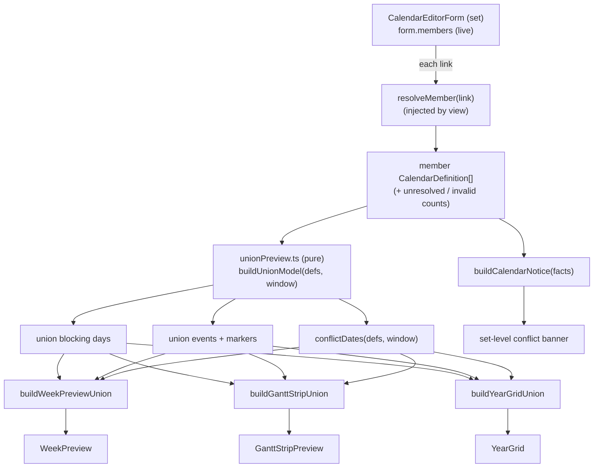

# feat: Calendar-set editor union preview tabs + conflict surfacing

## Summary

The calendar-**set** editor currently shows only Identity + Member calendars — no preview tabs — so a user building a set cannot see the combined working-time result of its members, nor whether the members conflict. Give the set editor the same **Week / Gantt strip / Year** preview tabs a single calendar has, but rendering the **union** of the set's member calendars, and surface member **conflicts**: a set-level banner that conflicts exist, plus each preview tab marking **where** the conflict days are.

This reuses the conflict + banner primitives already shipped for the main Gantt view (`conflictDates`, `buildCalendarNotice` in `src/bases/calendarConflicts.ts`; union-of-non-working in `src/controller/availability.ts`). The work is a union-aware layer feeding the existing preview components, not new charting.

**Product Contract source:** direct planning (`ce-plan-bootstrap`) — no upstream brainstorm; the WHAT is a maintainer request captured in this session.

---

## Problem Frame

- A calendar-set is a note (`tngantt: calendar-set`, `calendars: [[wikilinks]]`) whose meaning is the combination of its member calendars. The set editor (`src/editor/CalendarEditorForm.svelte`, `form.kind === 'calendar-set'`) exposes only Identity + Member calendars.
- The preview tabs (Week/Strip/Year) are gated on `form.kind === 'calendar'` and their layout builders (`buildWeekPreview`, `buildGanttStrip`, `buildYearGrid`) take a single `CalendarDefinition`; each `*LayoutFor()` wrapper returns `null` for a set.
- Nothing in the editor tells the user that two members **disagree** (one blocks a day another works) — the exact "conflict" the main view already stripes.

**Who is affected:** vault authors building calendar-sets; they currently have to open the Gantt view to see a set's combined effect and conflicts.

---

## Requirements

- **R1** — The calendar-set editor shows the same Week, Gantt strip, and Year preview tabs as a calendar editor (Edit stays the set's Identity + Member calendars form).
- **R2** — Each preview renders the **union** of the resolved member calendars: a day is non-working (blocking) in the union when **any** member blocks it; events and markers are the union across members.
- **R3** — Conflicts are surfaced. A **conflict day** is one where at least one member blocks it while another member's working pattern covers it (the existing `conflictDates` definition). Each preview tab visually marks conflict days distinctly from plain working/blocking.
- **R4** — A set-level **notification** states that conflicts exist (and how many), reusing `buildCalendarNotice`, shown in the set editor regardless of the active tab.
- **R5** — The preview reflects the **live** member list being edited (add/remove a member → previews and the conflict count update without saving), matching how the calendar editor's previews reflect unsaved edits.
- **R6** — Unresolved member links and invalid member calendars degrade gracefully: they are excluded from the union and counted in the banner as **two distinct categories** — `flaggedCount` (link doesn't resolve) and `invalidCount` (resolves but isn't a valid calendar, including a member that is itself a calendar-set — sets are flat) — never crashing the preview.

---

## Key Technical Decisions

- **KTD1 — Resolve members in the view, compute the union in a pure module.** The form is a pure component with no vault access; the view (`CalendarEditorView`) has `app`. The view injects a `resolveMember` callback (built on `resolveParentLink` + `parseCalendarFrontmatter`, mirroring the existing `attachMemberSuggest` injection) — see KTD6 for its discriminated return type. The form resolves `form.members` live through it and feeds the resolved (`kind: 'ok'`) `CalendarDefinition[]` to a new pure union module. Rationale: keeps `calendarEditorState`/layout modules pure and unit-testable; keeps vault I/O in the view.
- **KTD2 — Union model as precomputed day-fact sets, not a synthetic merged `CalendarDefinition`.** A set has no single working pattern to merge, so the union is expressed as computed sets over an evaluation window: `blocking` days (union), `conflict` days (`conflictDates`), plus union `events`/`markers`. The three layout builders gain a **union variant** that renders from these sets rather than deriving blocking from one pattern. Rationale: reuses the existing per-day/-cell render model; avoids inventing an ambiguous merged pattern.
- **KTD3 — Reuse `conflictDates` and `buildCalendarNotice` verbatim.** Both already exist and encode the agreed conflict semantics and banner wording. The plan wires them into the editor; it does not re-derive conflict logic.
- **KTD4 — Conflict is a per-day treatment that outranks working/blocking in the previews.** Each preview's day/cell/column model gains a `conflict: boolean`; components style it distinctly (a stripe/marker consistent with the main view's conflict-stripe treatment). Precedence: conflict > marker > blocking > event > working for display.
- **KTD5 — Evaluation window per tab, one canonical window for the count.** Each tab computes its union/conflict marking over its own window (Week: the union representative week per KTD7; Strip: content-spanning; Year: the selected year) so its marks are internally consistent. The **banner's single `conflictCount` is computed over one canonical window — the selected year (Jan 1–Dec 31 of the previewed year)** — and the banner wording names it (`N conflict days in <year>`) so the number reads as intentional against the tabs. The Year tab uses that same window, so its stripes match the banner exactly; Week/Strip show the subset falling in their narrower windows. Because `conflictDates` scans a finite window, conflicts outside the year are neither counted nor claimed — the year-scoped wording makes that honest rather than a silent zero.
- **KTD6 — `resolveMember` returns a discriminated result, and rejects non-calendars.** The injected resolver is `resolveMember(link) => { kind: 'ok'; definition } | { kind: 'unresolved' } | { kind: 'invalid' }`, not `CalendarDefinition | null` — a bare `null` collapses R6's two degradation categories (`flaggedCount` for unresolved links, `invalidCount` for resolves-but-not-a-valid-calendar). It returns `invalid` for any parsed note whose `kind !== 'calendar'` — including a member that is itself a **calendar-set** (sets are flat, mirroring `buildCalendarRegistry`'s "member is not a valid calendar (sets are flat)" rule) and an `invalid` parse. Only `kind: 'ok'` definitions flow into `buildUnionModel`.
- **KTD7 — One union representative week.** `representativeWeek` in `weekPreviewLayout.ts` anchors a single calendar to the Monday-week of its own first pattern occurrence; a union of members with different (monthly/anchored) patterns has no single such week. The union Week anchors to the **earliest first-occurrence across all members' rules** (generalizing `representativeWeek` over the member set), then evaluates every member and `conflictDates` over that one 7-day window — so a member whose occurrence falls outside an arbitrary week never previews blank or mis-marked.

---

## High-Level Technical Design

The view resolves live member links to definitions; a pure `unionPreview` module computes union day-facts + conflicts over the tab's window; conflict-aware layout builders feed the existing preview components; `buildCalendarNotice` drives the banner.

---

## Implementation Units

### U1. Union preview model (pure)

**Goal:** A pure module that turns resolved member calendars into the day-facts the previews need: union blocking days, union events, union markers, and conflict days over a given window.

**Requirements:** R2, R3, R6
**Dependencies:** none
**Files:**
- `src/editor/unionPreview.ts` (new)
- `test/unit/unionPreview.test.ts` (new)

**Approach:** Export `buildUnionModel(members: CalendarDefinition[], window: EvaluationWindow)` returning `{ blocking: Set<string>, conflicts: Set<string>, eventDays: Map<string, string>, markers: Marker[] }`. Union blocking by merging each member's non-working spans and pattern-complement blocking over the window. `dayFacts` in `calendarConflicts.ts` is currently **private** — extract a shared exported helper (or export it) so U1 and `conflictDates` share one blocking derivation rather than duplicating it. Conflicts come from `conflictDates(members, window)`. Event days are the union of each member's one-off events **and expanded `recurringEvents` (RRULE) occurrences over the window** — mirror `addRecurringEvents`/`eventDays` in `calendarShading.ts`/`yearGridLayout.ts` so the union does not silently drop a member's recurring events. Markers concatenate across members, **deduping identical dates**. Empty/one-member sets yield empty conflicts. Invalid/unresolved members are excluded by the caller (only `kind: 'ok'` definitions are passed in — see KTD6).

**Patterns to follow:** `src/bases/calendarConflicts.ts` (`dayFacts`, `conflictDates`); `src/controller/availability.ts` (`buildAvailability` union semantics); `src/editor/yearGridLayout.ts` (`eventDays` recurring expansion).

**Test scenarios:**
- Two members, one blocks a weekday the other works → that day in `conflicts`; a day both block → in `blocking`, not `conflicts`.
- Union event days include a member's recurring-event (RRULE) occurrences over the window, and dedupe identical dates across members.
- Single member → `conflicts` empty; `blocking` equals that member's blocking.
- Empty members → all sets empty.
- A member with only events (no pattern) never contributes conflicts (events never block — mirror the conflict module's rule).

`Execution note:` implement test-first — this is the semantic core and pure.

### U2. Conflict-aware week preview

**Goal:** Render the union in the Week tab, marking conflict weekdays.

**Requirements:** R1, R2, R3
**Dependencies:** U1
**Files:**
- `src/editor/weekPreviewLayout.ts`
- `src/editor/WeekPreview.svelte`
- `test/unit/weekPreviewLayout.test.ts`

**Approach:** Add `buildWeekPreviewUnion(members, ...)` producing `DayColumn[]` over **one union representative week** (KTD7 — anchored to the earliest first-occurrence across all members' rules), where a column is blocking if that week's day is in union blocking and gains `conflict: boolean` from U1's conflicts mapped onto the week. Add `conflict` to `DayColumn`. `WeekPreview.svelte` styles a conflict column distinctly (reuse the conflict-stripe visual vocabulary). Hours for the union: show the union of authored hours on working days — display-only, for render parity with the single-calendar week (not a separate requirement).

**Patterns to follow:** existing `buildWeekPreview`/`representativeWeek`; the main view's conflict-stripe styling.

**Test scenarios:**
- Union of two members marks the disagreed weekday `conflict: true` and does not mark an agreed working day.
- A union including a **monthly/anchored-pattern** member anchors the week to the earliest occurrence and renders that member's blocking (never blank).
- A weekday blocked by any member is `isWorking: false`.
- `conflict` outranks working/blocking in the column's rendered treatment (assert the flag; component styling covered by e2e).

### U3. Conflict-aware Gantt strip preview

**Goal:** Render the union in the Gantt strip tab over a content-spanning window, marking conflict day-cells.

**Requirements:** R1, R2, R3
**Dependencies:** U1
**Files:**
- `src/editor/ganttStripLayout.ts`
- `src/editor/GanttStripPreview.svelte`
- `test/unit/ganttStripLayout.test.ts`

**Approach:** Add `buildGanttStripUnion(members, ...)`. The window spans the union of all members' dated content (markers/events/non-working/anchors) via the existing `stripWindow` logic generalized over members. Each `StripCell` gains `conflict: boolean`; union markers concatenate. `GanttStripPreview.svelte` styles conflict cells with the stripe treatment.

**Test scenarios:**
- The window spans the earliest and latest dated content across all members.
- A conflict date's cell is `conflict: true`; union markers from all members appear.
- Members with no dated content fall back to the clamped default window without error.

### U4. Conflict-aware year grid preview

**Goal:** Render the union in the Year tab, marking conflict days.

**Requirements:** R1, R2, R3
**Dependencies:** U1
**Files:**
- `src/editor/yearGridLayout.ts`
- `src/editor/YearGrid.svelte`
- `test/unit/yearGridLayout.test.ts`

**Approach:** Add `buildYearGridUnion(members, year)`. Extend `DayClass` with `'conflict'` (highest precedence), or carry a parallel `conflict` flag; classify a day as conflict when in U1's conflicts, else marker/blocking/event/working from the union sets. `YearGrid.svelte` styles the conflict class.

**Test scenarios:**
- A conflict day classifies as `conflict` even when it is also blocking.
- Union blocking/events/markers classify correctly for a multi-member set across the year.
- Precedence holds: conflict > marker > blocking > event > working.

### U5. Wire the set editor: tabs, live union, and conflict banner

**Goal:** Show the preview tabs for a calendar-set, drive them from the live resolved members, and show the set-level conflict banner.

**Requirements:** R1, R4, R5, R6
**Dependencies:** U1, U2, U3, U4
**Files:**
- `src/editor/CalendarEditorForm.svelte`
- `src/editor/CalendarEditorView.ts`
- `test/specs/gantt-calendar-editor.e2e.ts`

**Approach:**
- View: add the discriminated `resolveMember` prop (KTD6) built on `resolveParentLink(this.app, stripSubpath(link), this.filePath)` + `parseCalendarFrontmatter(metadataCache.getFileCache(...).frontmatter)`, mapping every non-`calendar` kind (calendar-set, invalid) and unresolved link to the right discriminant. Inject like the existing suggester callbacks.
- Form: render the tab bar and preview panels for `form.kind === 'calendar-set'` too (not only `'calendar'`). Derive `resolved = form.members.map(resolveMember)`, split into `ok`/`unresolved`/`invalid`, and feed the `ok` definitions to the union layouts (`buildWeekPreviewUnion`, etc.) reactively so add/remove member updates them live.
- **Empty/degenerate state:** when zero members resolve `ok`, render guidance copy (e.g. "Add member calendars to preview the set's combined working time") instead of an empty all-working union grid that would masquerade as a real calendar. A one-member set previews normally and shows no conflict banner.
- **Banner:** derive `buildCalendarNotice({ displayedCount: okCount, conflictCount, invalidCount, flaggedCount: unresolvedCount })` over the canonical year window (KTD5). Surface it with a **status treatment, not the error `.og-cal-notice`**: neutral/muted when it only reports "Displaying N calendars", warning colour only when `conflictCount`/`invalidCount`/`flaggedCount > 0`; use `role="status"` (polite) — **not** `role="alert"` — so live member edits (R5) don't spam assertive screen-reader announcements. Prefer surfacing the attention line (conflicts/invalid/unresolved) and omitting a bare "Displaying N" in the editor context.
- **Conflict legibility:** add a small always-visible legend to the preview area (working · non-working · conflict) and a per-conflict-day `title`/tooltip naming the disagreeing members (e.g. "'Holidays' blocks; 'Core hours' works"), so a striped day is self-explaining. (Threading the disagreeing-member names to the day model may extend U1's per-day output; keep it minimal — a jump-to-member affordance stays deferred.)
- The Edit tab for a set keeps the Identity + Member calendars form; the union tabs are additive.

**Execution note:** e2e-first for the wiring — assert against real Obsidian since the resolver and reactivity are only observable there.

**Test scenarios (e2e, real Obsidian):**
- Covers R1: opening a calendar-set note shows Week/Gantt strip/Year tabs; clicking each renders its preview (grid/strip/year cells present).
- Covers R2/R3: a set whose two members disagree on a day shows a conflict marking in a preview tab and a banner reporting `N conflict days`.
- Covers R5: adding a member via the Member calendars field updates the conflict banner count without saving.
- Covers R6: a set with an unresolved member link, and one with a member that is itself a calendar-set, still render previews and count the unresolved link (`flaggedCount`) and the nested set (`invalidCount`) separately.
- Covers empty-state: a set with zero resolved members shows guidance copy, not an empty working grid.

---

## Scope Boundaries

**In scope:** set editor preview tabs rendering the member union; conflict day marking per tab; the set-level conflict/attention banner; live reflection of member edits.

**Out of scope (non-goals):**
- Changing the main Gantt view's existing union shading / conflict stripes (already shipped; only reused).
- Hour-level conflict detection (hours remain display-only, consistent with the calendar editor).
- Editing member calendars from the set preview (the previews are read-only; editing stays in each member's own editor).
- **Availability-block-only conflicts** — `conflictDates` derives the "covers" (working) side from a member's top-level working `pattern` only, so two members whose working days come *solely* from `availability` blocks won't register as conflicting. This matches the shipped main-view semantics; extending "covers" to availability blocks is a documented limitation, not part of this pass.

### Deferred to Follow-Up Work
- **P2c — per-calendar colour in column shading** (`docs/backlog.md`): applying each member's colour in the union preview/shading. Related but independent; keep out of this PR.
- A "jump to the conflicting member" affordance from a conflict day.

---

## Risks & Dependencies

- **R-risk1 — Layout-builder churn.** Extending three builders + three components risks regressing the single-calendar previews. Mitigation: add **union variants** alongside the existing single-definition builders rather than rewriting them; the calendar path stays on `buildWeekPreview`/etc. unchanged, and existing unit tests guard it.
- **R-risk2 — Live resolution performance.** Resolving members on every keystroke could be costly for large sets. Mitigation: sets are small (a handful of members); resolution is a cache lookup (`metadataCache`), and the derived layouts are lazy (evaluated only while a preview tab is active), mirroring the calendar editor.
- **R-risk3 — Conflict window mismatch (resolved by KTD5).** Computing conflicts over each tab's own window would make the banner count differ from a tab's visible marks, and — because `conflictDates` scans a finite window — could let the banner truthfully say zero while the set conflicts outside the visible window. Resolution: the banner counts over one canonical window (the selected year) and names it in its wording (`N conflict days in <year>`); the Year tab shares that window so its stripes match the banner, and Week/Strip show the in-window subset. This is a settled decision (KTD5), not deferred.

---

## Verification Contract

- Jest unit suites for U1–U4 pass (`npm test`), covering union semantics, conflict marking, and precedence.
- The calendar-editor e2e spec (`test/specs/gantt-calendar-editor.e2e.ts`) passes in real Obsidian including the new set-preview + conflict scenarios (`npm run e2e:local`, or the targeted `wdio --spec`).
- Typecheck and lint clean (`npm run typecheck`, `npm run lint`) — 0 errors.
- Coverage gate: new `.ts` modules (`unionPreview.ts` and the builder additions) are unit-covered; `.svelte` is coverage-excluded per project config.
- Single-calendar previews are unchanged (existing week/strip/year unit tests still green).

## Definition of Done

- A calendar-set note opened in the editor shows Week/Gantt strip/Year tabs rendering the member union, with conflict days marked per tab and a set-level banner stating conflicts exist when they do — all reflecting live member edits.
- Members that don't resolve or are invalid are excluded from the union and counted in the banner, never crashing the preview.
- All verification-contract gates green; the change ships behind squash-merge on green CI.
