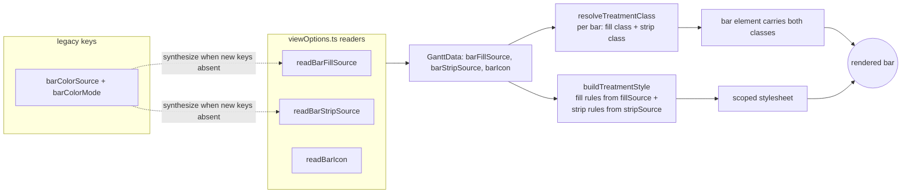

# Independent Bar Treatment Channels - Plan

## Goal Capsule

**Objective.** Decouple a Gantt view's bar colour into three independent channels — **Fill**, **Strip**, **Icon** — each with its own source, so a view can encode three data dimensions at once (e.g. *Fill by Calendar, Strip by Priority, Icon by Status*). Today a single `barColorSource` + `barColorMode(fill|strip)` pair drives fill and strip together; only the icon source is already independent. Folds in the two P2e rendering bugs, which share the coupling as their root.

**Product authority.** The Product Contract below (from a `ce-brainstorm` facilitation of section **D** of the date-provenance seed). Behaviour and scope are settled there; this plan adds the HOW.

**Open blockers.** None. The icon channel already proves the pattern; the change extends it to fill and strip and reworks one dispatch (`buildTreatmentStyle`) plus its readers and consumer.

## Product Contract

### Problem

A view can only encode **one** coloured dimension on the bar body-or-strip: `tngantt_barColorSource` picks the dimension and `tngantt_barColorMode` picks whether it paints the fill or the strip — the two are one coupled setting. A user who wants calendar identity *and* priority *and* status on the same bar cannot express it. The coupling also produces two visible rendering bugs (backlog **P2e**): *Strip + By status* paints the whole bar instead of just the strip, and *Fill + By calendar* draws a phantom strip. Only the icon source escaped the coupling.

### Actors

- **A1 — View author.** Someone configuring a Gantt (Bases) view's bar treatments who wants bars to carry more than one colour-coded dimension at a glance.

### Requirements

- **R1 — Three independent channels.** The view exposes a **Fill** source, a **Strip** source, and an **Icon** source as separate controls. Setting one never changes another. This replaces the `barColorSource` + `barColorMode` pair (the `fill|strip` mode concept goes away — you set both a fill source and a strip source directly).
- **R2 — Per-channel sources.** Fill and Strip each accept `none | default | theme | status | priority | calendar`. Icon stays `none | status | priority` (unchanged).
- **R3 — "none" and the neutral body.** A channel set to `none` draws nothing. The calm **neutral body** (today's strip-mode canvas) is a *consequence*, not a value: it appears automatically whenever a **strip is shown and the fill is `none`**, so a lone strip reads against a calm background. When **both** fill and strip are `none`, the bar falls back to the **default role treatment** (parent/child) so a bar is never invisible.
- **R4 — Allow all combinations.** No legibility guard or warning. Redundant (fill and strip on the same source) and busy (all three channels lit) combos are the author's choice — matching how the icon channel already behaves.
- **R5 — Lossless read-time migration.** Existing views render **identically** with no config rewrite. A view's legacy pair maps at read time: `mode=fill, source=X` → `Fill=X, Strip=none`; `mode=strip, source=X` → `Fill=none, Strip=X`. The stored `barColorSource`/`barColorMode` keys are left untouched; the new keys, when present, win. A fresh view defaults to `Fill=default, Strip=none, Icon=none` (today's out-of-box look).
- **R6 — P2e bug 1 fixed.** *Strip by status* (and any strip source) colours **only the left strip**; the bar body stays neutral. Pinned by e2e, since this is the reported regression.
- **R7 — P2e bug 2 fixed.** *Fill by calendar* (and any fill source) draws **no strip**; the strip channel is silent unless a strip source is set. Expected to dissolve with the decoupling; verified by e2e, any residual fixed.
- **R8 — Fidelity constraint.** No incidental change to existing bar styling — especially **non-calendar** bars — beyond the intended decoupling. The migration is fidelity-first: a config that renders a certain way today renders the same way after.

### Key Flows

- **F1 — Encode three dimensions.** The author sets Fill by Calendar, Strip by Priority, Icon by Status; every bar shows its calendar colour as the body, its priority colour as the left strip, and its status icon — all at once.
- **F2 — Existing view opens unchanged.** A view saved before this change renders exactly as it did; the author sees no difference until they choose to touch the new controls.
- **F3 — Turn a channel off.** Setting Strip to `none` removes the strip; the fill and icon are unaffected. Setting Fill to `none` while a strip is set yields the neutral-body + strip look.

### Acceptance Examples

- **AE1 — Three channels at once.** Fill=calendar, Strip=priority, Icon=status → a bar carries all three independently (body = calendar colour, left strip = priority colour, chip = status icon).
- **AE2 — Strip only paints the strip (bug 1).** Fill=none, Strip=status → the left strip is the status colour and the **body is neutral**, not the whole bar filled. *Covers R6.*
- **AE3 — Fill draws no phantom strip (bug 2).** Fill=calendar, Strip=none → body is the calendar colour and **no strip is drawn**. *Covers R7.*
- **AE4 — Legacy view is faithful.** A view with `{barColorMode: strip, barColorSource: status}` renders identically to today (neutral body + status strip) with **no rewrite** of its stored keys. *Covers R5.*
- **AE5 — Never invisible.** Fill=none, Strip=none → the bar shows the default role treatment (parent/child colours) and is clearly visible. *Covers R3.*
- **AE6 — Redundant combo allowed.** Fill=status, Strip=status → saves and renders with no warning. *Covers R4.*
- **AE7 — Non-calendar fidelity.** A non-calendar view using status fill renders unchanged from today. *Covers R8.*

### Scope Boundaries (out)

- **Provenance / informed-vs-derived (seed A), the drag prompt (B), retiring "incomplete" (C)** — the separate later bundle. D frees a visual channel that A will want, but A is not built here.
- **New visual vocabulary** — the channels reuse today's fill / strip / icon rendering exactly; no new bar treatments, patterns, or shapes are introduced.
- **Legibility guards or warnings** — explicitly not built (R4).

#### Deferred to Follow-Up Work

- **Retiring the legacy `barColorSource`/`barColorMode` keys** — kept indefinitely for back-compat; read-time synthesis, no rewrite. A future cleanup could migrate stored views to the new keys, but not here.

### Open Questions (→ resolved in planning)

- **OQ1 — Settings-panel layout.** *Resolved:* the "Bar color mode" + "Bar color source" dropdowns become **"Bar fill"** and **"Bar strip"** source dropdowns, sitting as an obvious pair above "Task icon" (see U2). Exact label wording is an implementer nicety.
- **OQ2 — Legacy-key lifetime.** *Resolved:* keep the legacy keys forever, synthesize the channels at read time, never rewrite (KTD2). No opportunistic write on next save — simplest and fully back-compatible.
- **OQ3 — Icon channel untouched.** *Resolved:* the icon source (`tngantt_barIcon`, `readBarIcon`) is unchanged; it only moves position in the settings panel alongside the two new dropdowns (U2), with an e2e assertion that it still renders (AE1).

---

## Product Contract preservation

Product Contract **unchanged** — the three OQs were resolved into planning decisions (KTD2, U2) without altering any R/A/F/AE. No product scope changed during planning.

## Key Technical Decisions

- **KTD1 — Two channel sources replace mode+source.** `buildTreatmentStyle` takes a **fill source** and a **strip source** (the `mode` parameter is removed) and emits fill-channel rules from the fill source and strip-channel rules from the strip source, independently. Advances R1, R2.
- **KTD2 — Read-time migration, never rewrite.** New readers `readBarFillSource` / `readBarStripSource` return the new `tngantt_barFillSource` / `tngantt_barStripSource` keys when present; otherwise they synthesize from the legacy `tngantt_barColorSource` + `tngantt_barColorMode` pair per the mapping in the HTD table. Stored config is never rewritten. Mirrors the existing `readBarColorSource` reader shape. Advances R5.
- **KTD3 — Neutral body is a render consequence, not a value.** The calm neutral body (`stripBodyRule`) is applied when a strip is present and the fill source is `none`. When both channels are `none`, the builder emits the **default role treatment** so a bar is never invisible. Advances R3.
- **KTD4 — Per-bar class resolution serves both channels.** `resolveTreatmentClass` emits the class(es) a bar needs for **both** its fill value and its strip value; the generated stylesheet targets fill-channel classes with fill rules and strip-channel classes with strip rules. A redundant same-source combo simply attaches both a fill and a strip rule to the one class. Advances R1, R4.
- **KTD5 — P2e bugs fixed inside the rebuilt strip path.** Both bugs are *properties the decoupled builder must satisfy*: strip rules paint only the `::before` strip and never the body (bug 1); fill sources emit no strip (bug 2). They are fixed in U1 and pinned by e2e in U5, not chased as separate patches. Advances R6, R7.
- **KTD6 — Fidelity-first migration.** Every legacy config renders identically post-change; especially non-calendar bars. The unit tests assert the migrated stylesheet output matches the pre-change output for representative legacy configs. Advances R8.

## High-Level Technical Design

**Migration mapping (read-time, no rewrite):**

| Legacy `barColorMode` | Legacy `barColorSource` | → Fill source | → Strip source |
|---|---|---|---|
| `fill` | `X` (any) | `X` | `none` |
| `strip` | `X` (any) | `none` | `X` |
| *(no legacy keys — fresh view)* | — | `default` | `none` |

When the new `tngantt_barFillSource` / `tngantt_barStripSource` keys are present, they are used directly and the legacy pair is ignored.

**Channel data flow** — where each channel is read, carried, and rendered:

The two independent inputs (`fillSource`, `stripSource`) meet at the bar: `resolveTreatmentClass` gives the bar the classes each channel needs, and `buildTreatmentStyle` emits the matching per-channel rules. That separation is what lets Fill and Strip carry different dimensions — and what removes the coupling behind both P2e bugs.

---

## Implementation Units

### U1. Style builder: two independent channels

- **Goal.** Rework the treatment style/class builders so fill and strip are independent: `buildTreatmentStyle` takes a fill source and a strip source (no `mode`), emitting fill rules from the fill source and strip rules from the strip source; `resolveTreatmentClass` emits the class(es) a bar needs for both channels. This is where both P2e bugs are fixed.
- **Requirements.** R1, R2, R3, R4, R6, R7, R8; KTD1, KTD3, KTD4, KTD5, KTD6.
- **Dependencies.** None (pure module; the consumer rewires in U4).
- **Files.** `src/bases/barTreatment.ts`, `test/unit/barTreatment.test.ts`.
- **Approach.** Replace `BarColorMode` + the single-`source` dispatch with a fill-source and strip-source pair on `TreatmentStyleInput`. Fill rules reuse `fillBodyRule`/`progressFillRule`; strip rules reuse `stripRule`; the neutral body (`stripBodyRule` + `stripContentPadRule`) is emitted when a strip source is active and the fill source is `none`. `default`/`theme` keep their role treatment per channel; `calendar` keeps its base-role + per-calendar layering, but only on the channel it is assigned to. `resolveTreatmentClass` returns the union of the fill-value class and the strip-value class for a bar. `effectiveSource` (empty-palette degrade to `default`) applies per channel.
- **Execution note.** Implement test-first — the two P2e bugs are characterization targets: write the failing "strip paints only the strip" and "fill emits no strip" assertions first, then build the decoupled emitter to green.
- **Patterns to follow.** The existing `buildValueRules` / `buildRoleStyle` / `paletteFor` structure in `src/bases/barTreatment.ts`; keep the thin-dispatch shape.
- **Test scenarios.**
  - Fill=status, Strip=none → each present status value gets a fill body rule; no `::before` strip rule emitted; no neutral-body rule.
  - Fill=none, Strip=status → each present status value gets a `::before` strip rule; the neutral body rule is emitted for all bars; **no** fill-body rule paints the body. *Covers AE2 / R6.*
  - Fill=calendar, Strip=none → per-calendar fill body rules; **no** strip rule anywhere. *Covers AE3 / R7.*
  - Fill=status, Strip=priority → status fill-body rules AND priority `::before` strip rules coexist, targeting their distinct value classes.
  - Fill=status, Strip=status (redundant) → the status value class carries both a fill body rule and a strip rule; builder does not dedupe them away. *Covers AE6 / R4.*
  - Fill=none, Strip=none → the default role treatment is emitted (parent/child), bar visible. *Covers AE5 / R3.*
  - Legacy-equivalent fill config (Fill=status, Strip=none) produces a stylesheet byte-equivalent to today's `mode=fill, source=status` output. *Covers R8 / KTD6.*
  - Legacy-equivalent strip config (Fill=none, Strip=status) produces output equivalent to today's `mode=strip, source=status`. *Covers R8.*
  - `resolveTreatmentClass` returns both a fill and a strip class when the two sources differ and the bar has both values; one class when they coincide; the default/no-op class when both are `none`.
  - Unsafe palette colour on either channel → that value is skipped (no rule), matching today's `isSafeColor` guard.

### U2. Readers, migration, and the Fill/Strip source dropdowns

- **Goal.** Add `readBarFillSource` / `readBarStripSource` with read-time synthesis from the legacy pair, and replace the "Bar color mode" + "Bar color source" view-option dropdowns with "Bar fill" and "Bar strip" source dropdowns. Icon dropdown unchanged.
- **Requirements.** R1, R2, R5; KTD2; OQ1, OQ2, OQ3.
- **Dependencies.** None (the readers/options are independent of U1's builder).
- **Files.** `src/bases/viewOptions.ts`, `test/unit/viewOptions.test.ts`.
- **Approach.** New readers coerce `tngantt_barFillSource` / `tngantt_barStripSource` to the source union (unknown → `default` for fill, `none`-capable per channel). When the new key is absent, synthesize from `tngantt_barColorSource` + `tngantt_barColorMode` per the HTD migration table. Replace the two `appearanceOptions()` dropdown entries (`tngantt_barColorMode`, `tngantt_barColorSource`) with `tngantt_barFillSource` (default `default`) and `tngantt_barStripSource` (default `none`), each offering `none | default | status | priority | calendar | theme`; keep the `tngantt_barIcon` dropdown as-is, positioned after them. Leave the legacy keys defined nowhere new — they are only read for migration.
- **Execution note.** Implement test-first — the migration mapping is the risk surface; write the legacy→channel synthesis cases first.
- **Patterns to follow.** `readBarColorSource` / `readBarColorMode` in `src/bases/viewOptions.ts`; the dropdown-declaration shape in `appearanceOptions()`.
- **Test scenarios.**
  - `readBarFillSource`: new key present (`status`) → `status`; new key absent + legacy `{mode: fill, source: priority}` → `priority`; new key absent + legacy `{mode: strip, source: priority}` → `none`; no keys at all → `default`; unknown value → `default`. *Covers AE4 / R5.*
  - `readBarStripSource`: new key present (`priority`) → `priority`; new key absent + legacy `{mode: strip, source: status}` → `status`; new key absent + legacy `{mode: fill, source: status}` → `none`; no keys → `none`; unknown → `none`.
  - New keys take precedence over legacy keys when both are present (new wins).
  - `appearanceOptions()` includes `tngantt_barFillSource` and `tngantt_barStripSource` dropdowns with the six source options each, and no longer includes `tngantt_barColorMode` / `tngantt_barColorSource`; `tngantt_barIcon` still present with its three options. *Covers OQ1, OQ3.*

### U3. Getters, GanttData type, and assembly

- **Goal.** Surface the two channel sources through the view: `register.ts` getters, the `GanttData` type, and the assembled snapshot handed to the controller.
- **Requirements.** R1, R2; KTD1.
- **Dependencies.** U2 (getters call the new readers).
- **Files.** `src/bases/register.ts`, `src/bases/types/gantt-view-data.ts`, `test/unit/` (register getter coverage if present for the existing getters).
- **Approach.** Add `getBarFillSource()` / `getBarStripSource()` wrappers over the U2 readers (mirroring `getBarColorSource`); replace `GanttData.barColorMode` + `barColorSource` with `barFillSource` + `barStripSource` (keep `barIcon`); populate them in the assembled `GanttData` literal (alongside `statusColors`, `barIcon`).
- **Patterns to follow.** `getBarColorSource()` / `getBarColorMode()` getters and the `GanttData` assembly around the existing `barColorMode`/`barColorSource`/`barIcon` fields.
- **Test scenarios.**
  - `getBarFillSource` / `getBarStripSource` return the reader result for a given config (new keys and legacy-migration cases).
  - The assembled `GanttData` carries `barFillSource`, `barStripSource`, `barIcon` and no longer carries `barColorMode` / `barColorSource`.

### U4. Consumer wiring

- **Goal.** Wire the two channel sources through the sync layer into `resolveTreatmentClass` and `buildTreatmentStyle`, replacing the single-source call.
- **Requirements.** R1, R2, R6, R7; KTD1, KTD4.
- **Dependencies.** U1 (builder signature), U3 (`GanttData` fields).
- **Files.** `src/bases/ganttSync.ts`, `src/bases/GanttContainer.svelte`, `test/unit/ganttSync.test.ts`.
- **Approach.** Replace the `barColorSource` input (and the mode consumed by the stylesheet) with `barFillSource` + `barStripSource`. `resolveTreatmentClass` is called with both channels so each bar carries both classes; `buildTreatmentStyle` is called with both sources. The calendar-identity-per-source-note resolution and the unassociated-task fallback are preserved.
- **Patterns to follow.** The current `resolveTreatmentClass(barColorSource, …)` call site and the `buildTreatmentStyle` invocation; the `TreatmentInput` shape in `src/bases/ganttSync.ts`.
- **Test scenarios.**
  - A bar with a status and a priority value, Fill=status + Strip=priority → carries both the status fill class and the priority strip class.
  - The generated stylesheet for a two-channel config contains both fill and strip rules.
  - Unassociated (no-calendar) task under Fill=calendar → falls back to the default role treatment, no calendar class.
  - Icon spec resolution is unaffected by the fill/strip change (still driven by `barIcon`).

### U5. End-to-end: three channels and the P2e regressions

- **Goal.** Prove the decoupled channels and lock the two P2e bugs against regression in real Obsidian.
- **Requirements.** R1, R5, R6, R7, R8; AE1–AE4, AE7.
- **Dependencies.** U1–U4.
- **Files.** `test/specs/gantt-bar-treatments.e2e.ts`, test-vault `.base` fixtures under `test/vaults/` (add/adjust a two-channel and a legacy-config view).
- **Approach.** Drive real views: (a) Fill=calendar + Strip=priority + Icon=status and assert all three render independently on a bar; (b) Fill=none + Strip=status asserts the body is neutral and only the strip is coloured; (c) Fill=calendar + Strip=none asserts no `::before` strip; (d) a view carrying the legacy `barColorMode`/`barColorSource` keys renders identically (neutral body + strip for strip-mode) without the new keys; (e) a non-calendar status-fill view is unchanged.
- **Execution note.** Run the spec with `npm run e2e:local` against real Obsidian; do not defer. The two P2e assertions are the regression tripwires.
- **Patterns to follow.** The existing `test/specs/gantt-bar-treatments.e2e.ts` structure and the `test/vaults/gantt-calendar-colour/*.base` fixtures.
- **Test scenarios.**
  - *Covers AE1.* Fill=calendar, Strip=priority, Icon=status → body colour = calendar, left strip = priority colour, status chip present — three distinct channels on one bar.
  - *Covers AE2 / R6.* Fill=none, Strip=status → left strip coloured, bar body neutral (not fully filled).
  - *Covers AE3 / R7.* Fill=calendar, Strip=none → body = calendar colour, no strip element rendered.
  - *Covers AE4 / R5.* A view with only legacy `{barColorMode: strip, barColorSource: status}` renders neutral body + status strip, identical to pre-change.
  - *Covers AE7 / R8.* A non-calendar status-fill view renders unchanged.

---

## Verification Contract

- **Unit.** `npm test` green, including the new `barTreatment` channel/migration cases and `viewOptions` reader-migration cases.
- **Types + lint.** `svelte-check` / eslint clean (strict, no `any`).
- **E2E.** `npm run e2e:local` green, including the new three-channel and P2e-regression scenarios in `gantt-bar-treatments.e2e.ts`, and the existing bar-treatment specs still passing (no regression).
- **Fidelity gate.** For representative legacy configs, the generated stylesheet matches pre-change output (asserted in unit tests, KTD6) and renders identically in e2e (AE4, AE7).

## Definition of Done

- U1–U5 landed; R1–R8 satisfied; AE1–AE7 covered by tests.
- Existing views render identically via read-time migration; no stored config rewritten (KTD2).
- P2e bug 1 (strip paints whole bar) and bug 2 (fill draws phantom strip) fixed and pinned by e2e (R6, R7).
- No incidental change to non-calendar bar styling (R8).
- Typecheck, lint, unit, and e2e all green.
- PR opened targeting `main`, behind green CI, for maintainer review.

## Sources & Research

- Origin: `docs/brainstorms/2026-07-20-date-provenance-and-treatment-channels-requirements.md` (section D) and `docs/plans/2026-07-22-003-feat-independent-treatment-channels-plan.md` requirements contract above.
- Backlog **P2e** (`docs/backlog.md`) — the two reported rendering bugs, triaged into this plan.
- Grounding read this session: `src/bases/barTreatment.ts` (`BarColorMode`/`BarColorSource`/`BarIconSource`, `buildTreatmentStyle`, `buildValueRules`, `buildRoleStyle`, `stripBodyRule`, `resolveTreatmentClass`), `src/bases/viewOptions.ts` (`appearanceOptions`, `readBarColorSource`/`readBarColorMode`), `src/bases/ganttSync.ts` (consumer), `src/bases/register.ts` (getters + assembly), `src/bases/types/gantt-view-data.ts` (`GanttData`). No external research — the pattern is fully local (the icon channel is the in-repo precedent).
