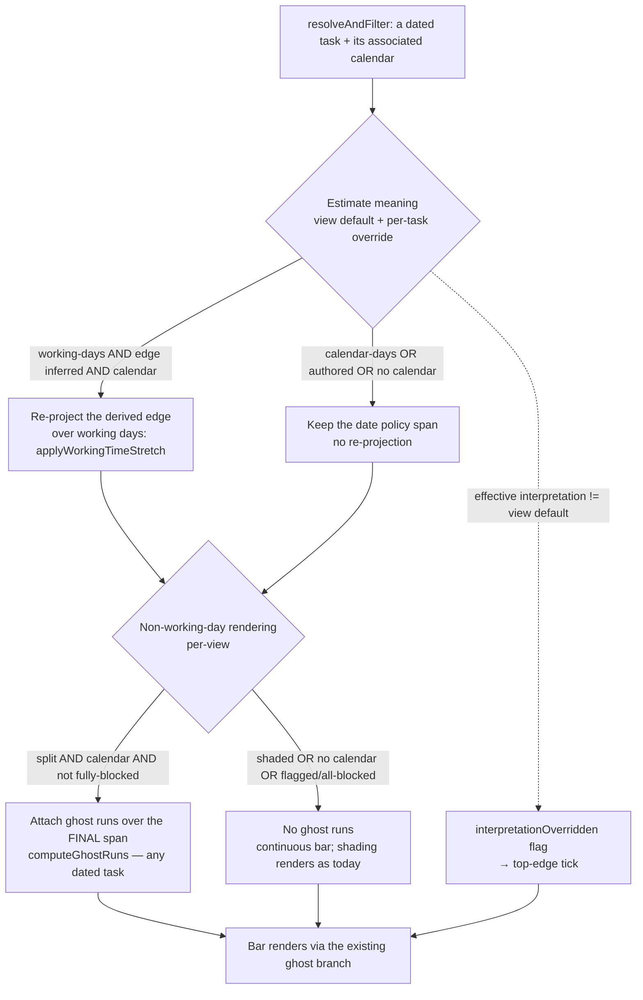

# Estimate Meaning and Non-Working-Day Rendering - Plan

## Goal Capsule

**Objective.** Let users decide what a time-estimate *means* — working effort or elapsed calendar time — and, independently, how non-working days are *drawn* — shaded in the background or as split segments. Today's single **Calendar mode** (`shade` / `stretch`) fuses those two concerns into one choice, which forces the tool to assume a workflow. Split them into two orthogonal settings, and make a per-task interpretation override discoverable on the bar.

**Product authority.** The Product Contract below, from a `ce-brainstorm` facilitation, with two post-brainstorm decisions folded in (see Product Contract preservation): migration is dropped (the maintainer re-configures views), and the per-task override gains an on-bar indicator.

**Open blockers.** None. Every seam already exists — the working-time stretch (`applyWorkingTimeStretch`), ghost runs, the per-task calendar association (a mapped property), the `datestatus-flagged` CSS-hook-via-custom-flag pattern, and the estimate-write path from the inferred-drag prompt.

---

## Product Contract

### Summary

Replace the single `calendarMode` with two independent settings: **Estimate meaning** (`working-days` vs `calendar-days`, a per-view default any task can override) and **Non-working-day rendering** (`shaded` vs `split`, per-view). Make every combination reachable — including the currently-impossible "elapsed-time dates with the non-working days drawn in" — never move a date the user authored, and mark a task whose interpretation differs from the view default with a small on-bar indicator.

### Problem Frame

An effort estimate carries two legitimate meanings, and different users hold different ones. A **wrench-time** estimator means working hours: "3 days" is 3 *working* days, so weekends should extend the bar and not consume the estimate. An **elapsed-time** estimator means calendar duration: "3 days" includes the weekend, so the bar should not extend — but they'd still like to *see* which days inside it are non-working.

Today the `stretch` mode bundles both jobs together: turning it on re-projects derived dates over working days **and** draws the blocked days as ghost segments; turning it off gives flat dates **and** plain background shading. The two are welded, so the elapsed-time user can never get flat dates *with* the non-working days drawn in — the tool has silently chosen the wrench-time interpretation for anyone who wants the visualization. TaskNotes and TaskNotes Gantt are power-user tools that avoid assuming a workflow; this fusion is exactly such an assumption.

### Actors

- A1. **Wrench-time estimator.** Estimates in working effort; wants a derived date to skip non-working days and, optionally, to see them marked.
- A2. **Elapsed-time estimator.** Estimates in calendar duration; wants derived dates flat and non-working days shown as decoration *without* extending the bar.

The same person may be either, per project or per task — which is why interpretation is overridable at the task level.

### Key Decisions

- **Two orthogonal axes, not one mode.** *Estimate meaning* is a semantic choice (where a derived date lands); *non-working-day rendering* is a display choice (how blocked days are drawn). Fusing them is the current limitation; separating them makes all four combinations reachable.
- **Interpretation is per-view default + per-task override; rendering is per-view only.** What an estimate means can genuinely vary task to task, so it earns a task-level override (mirroring the existing per-task calendar association). How the chart draws non-working days is a chart-wide style, so a per-task rendering knob isn't worth the surface.
- **Authored dates are never moved.** Only *derived* endpoints ever re-project. On an authored span, `split` reveals the non-working days already inside it; the endpoints are untouched.
- **The split visual is interpretation-neutral.** A split segment means "a non-working day within this span," never "this day did / didn't consume effort."
- **No migration.** `calendarMode` is removed outright; a view without the new settings uses the defaults (`calendar-days` + `shaded`). Pre-existing `shade` / `stretch` views are re-configured by the maintainer — there is a single user today and no compatibility burden, so the clean replacement is preferred over read-time coalescing (which could not reproduce `stretch`'s derivation-dependent rendering anyway).

### Requirements

**Estimate meaning (semantic — derived dates only)**

- R1. A per-view **Estimate meaning** setting with two values: `working-days` (a derived endpoint skips the task's non-working days) and `calendar-days` (a derived endpoint is flat calendar days). It affects only derived/inferred edges and is a no-op for fully-authored tasks.
- R2. A task may override the view default via a mapped property, mirroring the per-task calendar association. Unset → the view default applies.
- R3. `working-days` requires a resolved calendar via the availability seam; a task with no calendar behaves as `calendar-days` regardless of the setting.

**Non-working-day rendering (cosmetic — all dated tasks)**

- R4. A per-view **Non-working-day rendering** setting with two values: `shaded` (background tint, continuous bar) and `split` (non-working days inside a bar drawn as dimmed segments). It applies to every dated task, authored or derived.
- R5. A split segment is interpretation-neutral: it marks a non-working day within the span and never implies whether that day consumed effort.
- R6. Split never moves a date. On an authored task it reveals the non-working days already inside the authored span; the bar's endpoints are unchanged.
- R7. Split degrades to a continuous bar when it cannot faithfully tile: at low zoom, and when a span is fully non-working (a ceiling-flagged re-projection fallback, or an all-weekend short span) so a bar is never rendered as one solid dimmed block.

**Defaults & replacement**

- R8. New views (and any view without the new keys) default to `calendar-days` + `shaded`.
- R9. `calendarMode` and its `shade` / `stretch` values are removed. No automatic migration of existing views — they fall to the R8 defaults and are re-configured by the maintainer.

**Write path (interaction with the shipped inferred-drag prompt)**

- R10. When a bar resize writes a Time Estimate, it writes in the task's effective interpretation unit (working vs calendar days), matching the read so the estimate round-trips without drift. The write is silent — the inferred-drag prompt gains no unit UI.

**Discoverability**

- R11. A bar whose *effective* estimate-meaning differs from the view default carries a small on-bar **override indicator** (a top-edge tick) so the override is discoverable; hovering it names the interpretation. The indicator survives the crowded worst case (color strip + status icon + split segments + a 1-day bar) without competing with those elements.

### Acceptance Examples

- AE1. **Wrench + split (today's stretch).** An inferred-end task on a `working-days` + `split` view: the derived end skips non-working days and the blocked days render as dimmed segments. *Covers R1, R4.*
- AE2. **Elapsed + split on a concrete task (the previously-unreachable case).** An authored start + due task on a `calendar-days` + `split` view: the bar spans the authored dates unchanged, and the weekends inside render as segments. *Covers R4, R6.*
- AE3. **Elapsed + shaded.** A `calendar-days` + `shaded` view: derived dates are flat, non-working days are tinted in the background, the bar stays continuous. *Covers R8.*
- AE4. **Per-task override.** A `working-days`-default view with one task overridden to `calendar-days`: that task's derived end is flat while the rest skip non-working days. *Covers R2.*
- AE6. **Write round-trip.** Resize an inferred-end task on a `working-days` view: the estimate is written in working days, and reopening reproduces the same span. *Covers R10.*
- AE7. **Override indicator.** On the `working-days`-default view of AE4, the `calendar-days`-overridden task shows the top-edge tick and the others don't; hovering the tick names the interpretation. *Covers R11.*
- AE8. **Fully-blocked span degrades.** A 1-day placeholder that lands on a weekend under `split` renders as a continuous bar, not an all-dimmed block. *Covers R7.*

### Scope Boundaries

- **Moving authored dates** — never. `split` only reveals the non-working days already inside a concrete bar.
- **Per-task rendering-mode override** — out. Rendering (`shaded` / `split`) is a per-view style; only *interpretation* is overridable per task. R11's indicator makes that interpretation override visible — it is a discoverability marker, not a per-task rendering-mode knob.
- **Scheduling / critical-path** — out. Interpretation changes where derived dates land, which will matter once successor dates and critical path exist; that propagation is a separate future track.
- **The availability seam / calendar-association model** — unchanged; this feature consumes it, it doesn't alter it.

---

## Product Contract preservation

Product Contract **changed** in two ways, both from post-brainstorm review decisions the maintainer confirmed:

- **R9 rewritten and AE5 removed** — migration is dropped (single user, no compatibility burden; and `stretch`'s derivation-dependent rendering cannot be reproduced by a uniform per-view rendering axis, so a "renders identically" guarantee was unachievable). `calendarMode` is removed outright; views fall to the R8 defaults.
- **R11 + AE7 added** — the per-task override gains an on-bar indicator (the top-edge tick), resolving the review's discoverability finding. This is a per-task *visual*, consistent with "interpretation is overridable per task"; it is not a per-task rendering-mode override (still out of scope).

All other R/A/AE unchanged. R7 tightened to name the fully-blocked degrade case (AE8).

## Key Technical Decisions

- **KTD1 — Clean replacement, no migration.** Add `readEstimateMeaning` and `readNonWorkingRendering` (normalize-with-default: `calendar-days` / `shaded`). Remove the `tngantt_calendarMode` dropdown and `readCalendarMode`; its two consumers (register.ts ~601, ~1196) move to the new readers. No coalescing, no data rewrite — a view without the new keys renders at the defaults. Advances R8, R9.
- **KTD2 — The per-task override reuses the calendar-association FieldMapping pattern.** Add an `estimateMeaning` mapped property to `FIELD_MAPPING_KEYS` beside `calendar`, read into `FieldMappings`, exposed as a Fields-group property picker. Resolution is register-side (where per-task frontmatter is readable), not in the controller. Advances R2.
- **KTD3 — Split `stretch.ts`'s two jobs and un-gate the availability seam.** `applyWorkingTimeStretch` keeps only the *date re-projection* (working-days, inferred edges, `null` otherwise). Extract the blocked-run scan (`collectGhostRuns`) into an exported `computeGhostRuns(start, end, isBlocked)` over *any* final span. `resolveAndFilter` applies re-projection per the task's effective interpretation and attaches ghost runs per the view rendering mode, both from the same `isBlocked`. **A flagged or fully-blocked span attaches no ghost runs** (mirrors `applyWorkingTimeStretch`'s `ghostRuns: []` fallback) so it degrades to a continuous bar (R7/AE8). `buildDatePolicyConfig` provides the blocking seam whenever a calendar is present **and** either axis needs it — not gated on `stretch`. Advances R1, R3, R4, R5, R6, R7.
- **KTD4 — Split on concrete tasks needs no new rendering.** The bar renderer already draws any task carrying `ghostRuns` (the `BarContent` ghost branch; absent = continuous), and `canTileSubSpans` provides the span-agnostic zoom degrade. `ghostRuns` flows `ExpandableTask` → `InstanceExpansion` → `ganttSync` (`custom.ghostRuns`) independent of the stretch path, so authored spans carrying ghost runs render with no new code. `placeholder` / `swapped` need no special case beyond the fully-blocked suppression in KTD3. Advances R4, R6, R7.
- **KTD5 — The estimate write unit follows the effective interpretation, resolved register-side.** Gate the write inside register.ts's `countWorkingDays` closure (register.ts ~1196), which has `taskPath` + frontmatter access: it returns `null` when the task's effective interpretation resolves to `calendar-days`, so `persistReschedule`'s existing `?? inclusiveDaySpan` fallback writes calendar days. Do **not** thread a view-scalar interpretation to the container — a `GanttData` scalar cannot carry the R2 per-task override, and gating on blocking-presence would mis-write on a `calendar-days` + `split` view. Advances R10.
- **KTD6 — The override indicator is a top-edge tick via the `datestatus-flagged` pattern.** `resolveAndFilter` computes a per-task `interpretationOverridden` flag (effective interpretation ≠ view default); it folds onto the SVAR task `custom` and drives a CSS class + a top-edge tick pseudo-element, mirroring `datestatus-flagged` (`ganttSync.DATE_STATUS_TYPE`). A single neutral accent treatment on the top edge — the one slot the strip, icon, split segments, and resize handles don't claim; direction (working vs calendar) is a hover tooltip + the mapped grid column, not a second on-bar glyph. Advances R11.

## High-Level Technical Design

The resolve seam splits the fused mode into two independent gates, plus the override flag:

The left gate (interpretation) only ever moves a *derived* edge; the right gate (rendering) only ever *decorates* the final span; the override flag only ever *marks* the bar. They share the `isBlocked` seam but decide independently.

---

## Implementation Units

### U1. Two view-option settings + readers, replacing `calendarMode`

- **Goal.** Replace the `tngantt_calendarMode` dropdown with `tngantt_estimateMeaning` (`working-days` / `calendar-days`, default `calendar-days`) and `tngantt_nonWorkingRendering` (`shaded` / `split`, default `shaded`), with committed user-facing labels. No legacy coalescing.
- **Requirements.** R1, R4, R8, R9; KTD1.
- **Dependencies.** None.
- **Files.** `src/bases/viewOptions.ts`, `test/unit/viewOptions.test.ts`, `src/bases/register.ts` (getters).
- **Approach.** In `timelineOptions()`, replace the `tngantt_calendarMode` dropdown with the two new dropdowns (Record<string,string> option maps). Commit the labels: Estimate meaning → `working-days`: "Working days (skip non-working)", `calendar-days`: "Calendar days"; Non-working-day rendering → `shaded`: "Shaded background", `split`: "Split segments" (exact copy is an implementer nicety on top of these). Add `readEstimateMeaning(get)` / `readNonWorkingRendering(get)` (normalize unknown/absent → the default). Remove `readCalendarMode` (its consumers move in U3). Thread both to the controller config via `register.ts` getters.
- **Patterns to follow.** The `tngantt_calendarMode` dropdown + `readCalendarMode` (the thing being replaced); `normalizeCascadeMode` for normalize-with-default; the `tngantt_inferredDrag` three-value dropdown added in `2026-07-23-001`.
- **Test scenarios.**
  - `readEstimateMeaning`: explicit `working-days` / `calendar-days` pass through; unknown/absent → `calendar-days`.
  - `readNonWorkingRendering`: explicit `shaded` / `split` pass through; unknown/absent → `shaded`.
  - `ganttViewOptions()` includes both dropdowns with the committed labels and defaults, and no longer includes `tngantt_calendarMode`.

### U2. Per-task Estimate-meaning override property

- **Goal.** A task overrides the view Estimate meaning via a mapped property, resolved (register-side) with the view default as fallback.
- **Requirements.** R2; KTD2.
- **Dependencies.** U1.
- **Files.** `src/bases/fieldMappingConfig.ts`, `src/bases/viewOptions.ts` (Fields-group property picker), a pure `resolveEstimateMeaning` helper, `test/unit/readFieldMappings.test.ts` / `test/unit/viewOptions.test.ts`.
- **Approach.** Add `estimateMeaning: 'tngantt_estimateMeaningProperty'` to `FIELD_MAPPING_KEYS`, `estimateMeaningProperty` to `FieldMappings` (default `''`), read it in the mappings assembler — mirroring `calendar` / `calendarProperty` end to end. Add a Fields-group property picker (mirror `timeEstimatePropertyOption`). Add a pure `resolveEstimateMeaning(viewDefault, taskValue)` returning a valid task value else the view default. The per-task value is read register-side (where frontmatter is accessible), alongside the calendar association.
- **Patterns to follow.** `FIELD_MAPPING_KEYS.calendar` / `calendarProperty` and its read chain; `timeEstimatePropertyOption` for the picker.
- **Test scenarios.**
  - `resolveEstimateMeaning`: task `working-days` on a `calendar-days` view → `working-days`; unset → view default; junk → view default. *Covers AE4.*
  - The mappings assembler surfaces `estimateMeaningProperty` from `tngantt_estimateMeaningProperty`.

### U3. Decouple date-projection from ghost-run production in the resolve seam

- **Goal.** Interpretation drives re-projection (working-days, inferred only); rendering drives ghost runs (split, any dated task); a fully-blocked span produces none; the availability seam is provided whenever either axis needs it.
- **Requirements.** R1, R3, R4, R5, R6, R7; KTD3, KTD4.
- **Dependencies.** U1, U2.
- **Files.** `src/controller/calendar/stretch.ts`, `src/controller/GanttController.ts` (`resolveAndFilter`), `src/bases/register.ts` (`buildDatePolicyConfig`; the second consumer ~1196), `test/unit/workingTimeStretch.test.ts`, a new `test/unit/computeGhostRuns.test.ts`, `test/unit/GanttController.test.ts`.
- **Approach.** In `stretch.ts`, export `computeGhostRuns(start, end, isBlocked)` (extract the private `collectGhostRuns`); `applyWorkingTimeStretch` keeps only the date walk. In `resolveAndFilter`, resolve each task's effective interpretation (register-side resolver carried into the policy config) and read the view rendering mode: apply re-projection only when interpretation is `working-days`; attach `ghostRuns` (over the final span) only when rendering is `split`, a calendar is present, and the span is not fully blocked / flagged (else omit → continuous bar). In `buildDatePolicyConfig`, stop returning `base` on `!== 'stretch'`; provide `workingTimeStretch.blockingForTasks` whenever a calendar mapping is present and either axis is active, and carry the rendering mode + interpretation resolver into the policy config. Update the register.ts ~1196 consumer to the new axes. Note the re-projected end is end-of-day (`23:59:59.999`) — feed the ghost scan local-day ISO (existing `localIso`) so the last day isn't dropped.
- **Execution note.** `computeGhostRuns` and the unchanged re-projection are the decision surface; test them first. The resolve-seam wiring is proven by U5.
- **Patterns to follow.** The existing `applyWorkingTimeStretch` call in `resolveAndFilter`; `buildTaskBlocking` for the seam; `stretch.ts`'s existing `collectGhostRuns` and `localIso`.
- **Test scenarios.**
  - `computeGhostRuns` over an authored span crossing a weekend → the expected run(s); no blocked days → empty. *Covers AE2.*
  - Re-projection unchanged for a `working-days` inferred-end task (dates skip blocked days, ghost runs present). *Covers AE1.*
  - `calendar-days` interpretation with a calendar present → no re-projection (dates flat). *Covers AE3.*
  - Authored task + `split` → `ghostRuns` attached, `start`/`end` unchanged. *Covers AE2 / R6.*
  - Fully-blocked or ceiling-flagged span + `split` → no ghost runs (continuous bar). *Covers AE8 / R7.*

### U4. Estimate write follows the effective interpretation unit (register-side)

- **Goal.** A resize writes the Time Estimate in the task's effective unit (working vs calendar days), honoring the per-task override.
- **Requirements.** R10; KTD5.
- **Dependencies.** U1, U2.
- **Files.** `src/bases/register.ts` (the `countWorkingDays` closure ~1196), `test/unit/` for the resolver, plus `src/bases/GanttContainer.svelte` only if the existing `?? inclusiveDaySpan` fallback needs no change (confirm the closure returning `null` already routes there).
- **Approach.** In register.ts's `countWorkingDays` closure (it has `taskPath` + frontmatter access), resolve the task's effective interpretation via `resolveEstimateMeaning`; return `null` when it is `calendar-days`, so `persistReschedule`'s `spanDaysToMinutes(countWorkingDays ?? inclusiveDaySpan)` writes flat calendar days. No container-side interpretation threading.
- **Execution note.** The effective-interpretation resolution is pure and unit-testable; the full resize→write round-trip is U5 / manual (SVAR pixel-drag isn't scriptable, standalone Bases is read-only).
- **Patterns to follow.** The `countWorkingDays ?? inclusiveDaySpan` branch in `persistReschedule`; the register-side calendar-association read for the per-task property.
- **Test scenarios.**
  - The closure returns working-days for a `working-days` task with a calendar; `null` for a `calendar-days` task (→ flat write).
  - *Round-trip (AE6) is e2e / manual — see U5.*

### U5. End-to-end: axis combinations render and degrade

- **Goal.** Prove the combinations in real Obsidian, including the concrete-task split case and the fully-blocked degrade.
- **Requirements.** R1–R11; AE1–AE4, AE7, AE8.
- **Dependencies.** U1–U4, U6.
- **Files.** `test/specs/gantt-calendar-axes.e2e.ts`, fixtures under `test/vaults/gantt-calendar-axes/` (a calendar note; an inferred-end task, an authored start+due task, a task carrying the per-task override, and a 1-day placeholder landing on a weekend), plus base files per combination.
- **Approach.** Drive a real Gantt: `working-days` + `split` → the inferred bar stretches with dimmed segments (AE1); `calendar-days` + `split` → the authored bar keeps its span with weekend segments (AE2); `calendar-days` + `shaded` → continuous bar, background tint (AE3); a `working-days`-default view with one overridden task → the override renders flat AND shows the top-edge tick while the rest stretch and don't (AE4/AE7); the weekend placeholder under `split` → continuous bar, no all-dimmed block (AE8).
- **Execution note.** Run with `npm run e2e:local`; CI runs the e2e job on the PR. Render assertions mirror `gantt-calendar.e2e.ts`. The estimate-write round-trip (AE6) is contract-covered by U4's unit + manual, per the `gantt-time-estimate.e2e.ts` precedent.
- **Patterns to follow.** `test/specs/gantt-calendar.e2e.ts` (calendar view, stretched bars + shading); `test/specs/gantt-inferred-date-drag.e2e.ts` (fixtures + provenance-class render assertions).
- **Test scenarios.** *Covers AE1–AE4, AE7, AE8* as render assertions; AE6 write round-trip is unit + manual.

### U6. Per-task override indicator (top-edge tick)

- **Goal.** Mark a bar whose effective interpretation differs from the view default with a top-edge tick, hoverable for the direction.
- **Requirements.** R11; KTD6.
- **Dependencies.** U2, U3 (the effective interpretation is resolved in the resolve seam).
- **Files.** `src/controller/GanttController.ts` (`resolveAndFilter` — carry an `interpretationOverridden` flag on the resolved task, mirroring `stretchFlagged`), `src/bases/ganttSync.ts` (fold the flag onto the task `custom`, mirroring `ghostRuns` / `datestatus-flagged`), `src/bases/GanttContainer.svelte` (+ CSS — the tick pseudo-element on the class hook) and the tooltip copy, `test/unit/GanttController.test.ts` / `test/unit/ganttSync.test.ts`.
- **Approach.** In `resolveAndFilter`, set `interpretationOverridden` when the task's resolved interpretation ≠ the view default. Fold it onto the SVAR task `custom` in `ganttSync` (mirror the `datestatus-flagged` / `ghostRuns` fold + fingerprint). Add a CSS class + a top-edge tick `::before` (mirror the `.wx-bar.datestatus-flagged` CSS hook; a single muted accent, a11y-contrast in both themes). Tooltip names the interpretation ("Estimate meaning: working days — overrides the view's calendar-days default"). Design reference: the top-edge-tick recommendation from planning (single neutral treatment; direction via tooltip/grid, not a second glyph).
- **Execution note.** The flag + fold are unit-testable; the rendered tick is asserted in U5's e2e (AE7).
- **Patterns to follow.** `DATE_STATUS_TYPE` / `datestatus-flagged` (flag → `custom` → CSS-hook); the `ghostRuns` fold + `ghostRunsKey` fingerprint in `ganttSync`; the SVAR icon-shortlist caveat (hand-add any glyph CSS — icon fonts are disabled) — hence a CSS-drawn tick, not an icon-font glyph.
- **Test scenarios.**
  - `resolveAndFilter` sets `interpretationOverridden` true when the per-task override differs from the view default; false when unset or matching.
  - The flag folds onto the task `custom` and participates in the diff-sync fingerprint so toggling it re-renders. *Covers AE7 (render in U5).*

---

## Verification Contract

- **Unit.** `npm test` green, including the two readers (U1), the per-task resolver + mapping (U2), `computeGhostRuns` + the decoupled re-projection + fully-blocked suppression (U3), the register-side write resolver (U4), and the `interpretationOverridden` flag + fold (U6).
- **Types + lint.** `svelte-check` / eslint clean (strict, no `any`).
- **E2E.** `npm run e2e:local` green, including `gantt-calendar-axes` (AE1–AE4, AE7, AE8), with the existing calendar/stretch specs updated for the removed `calendarMode` (they now set the new axes).

## Definition of Done

- U1–U6 landed; R1–R11 satisfied; AE1–AE4, AE7, AE8 covered by tests, AE6 by the documented unit+manual exception.
- Estimate meaning and Non-working-day rendering are independent per-view settings; interpretation is overridable per task and marked with the top-edge tick; authored dates never move under `split`; a fully-blocked span degrades to a continuous bar.
- `calendarMode` is removed; views without the new settings render at the defaults (no migration).
- The estimate-write path writes in the task's effective unit.
- Typecheck, lint, unit, and e2e all green.
- PR opened targeting `main`, behind green CI, for maintainer review.

## Sources & Research

Grounding verified this session by reading the code directly:

- `src/controller/GanttController.ts` (`resolveAndFilter`, ~1600-1646) — the fusion point: `applyWorkingTimeStretch` re-projects dates and produces `ghostRuns` in one call, gated by the presence of `workingTimeStretch`; carries `stretchFlagged` (the pattern `interpretationOverridden` mirrors).
- `src/bases/register.ts` (`buildDatePolicyConfig`, ~601; `buildCalendarShading` ~1147; the `countWorkingDays` closure ~1196) — where the availability seam and the write closure are gated on `calendarMode === 'stretch'`, and where per-task frontmatter is readable.
- `src/controller/calendar/stretch.ts` — `applyWorkingTimeStretch` (re-projection, inferred-only, ceiling `ghostRuns: []` fallback), the private `collectGhostRuns` to extract, and `localIso`.
- `src/bases/fieldMappingConfig.ts` — `FIELD_MAPPING_KEYS.calendar` / `calendarProperty`, the per-task-property pattern to mirror.
- `src/bases/viewOptions.ts` — `readCalendarMode` + the `calendarMode` dropdown; `timeEstimatePropertyOption` for the picker.
- `src/bases/ganttSync.ts` — `DATE_STATUS_TYPE` / `datestatus-flagged` (flag → `custom` → CSS hook), the `ghostRuns` fold (~360-370, ~440-490) and `ghostRunsKey` fingerprint; `src/controller/segmentLayout.ts` `canTileSubSpans` (the zoom degrade); `src/controller/InstanceExpansion.ts` (~506, `ghostRuns` plumbing) — why split needs no new rendering.
- `src/bases/GanttContainer.svelte` (`persistReschedule`) — the `countWorkingDays ?? inclusiveDaySpan` estimate write to gate on interpretation.
- `docs/plans/2026-07-23-001-feat-inferred-date-drag-prompt-plan.md` — the shipped estimate-write path and the `datestatus-flagged`/custom-flag render pattern this reuses.
- No external research — the pattern is fully local (calendar-stretch, calendar-association, and the `datestatus-flagged` indicator are the in-repo precedents).
