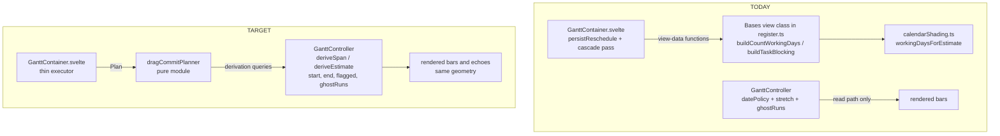
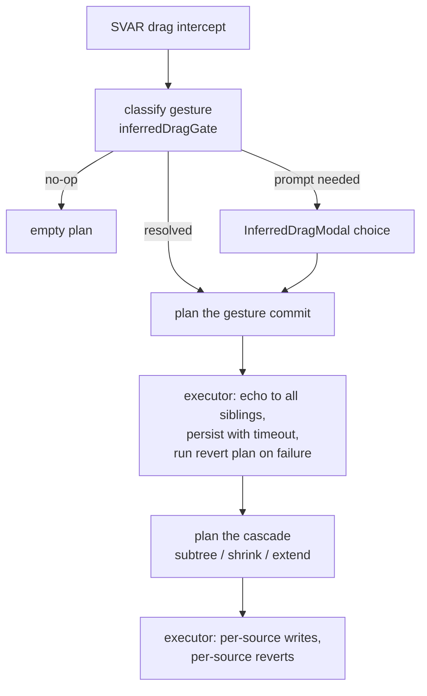

# Drag-Path Derivation Authority and Commit Planner - Plan

## Goal Capsule

- **Objective**: end the drag-path defect class — the write path re-computing what the read path already derives — by landing PR #336's proven core, unifying span↔estimate derivation behind the controller, extracting a pure drag-commit planner, and mechanically enforcing the regained ground. Small test-first PRs throughout.
- **Authority hierarchy**: this plan's Product Contract governs behavior; the origin reports (see Sources) supply rationale; repo conventions (AGENTS.md, docs/conventions/) govern style and workflow. Where the plan contradicts observed code reality, surface the deviation instead of guessing.
- **Execution profile**: one PR per implementation unit (U1 reuses the open #336 branch; U4 alone lands as three phased PRs per its unit), squash-merge, branch from main. Per-PR gate: CI green AND Codex (`chatgpt-codex-connector[bot]`) has reviewed the current head with zero unresolved threads — watch both verdict shapes (review objects and plain "no major issues" comments).
- **Stop conditions**: evidence that a session-settled decision cannot work (report, don't improvise); any behavior change beyond the pinned exceptions in R10/R13; a unit that cannot meet its Verification without touching another unit's scope.
- **Tail ownership**: the implementer owns Codex thread replies, #314 source-thread closure, and the campaign-ledger updates named in U1. Durable learnings write-ups happen post-campaign, outside this plan.

---

## Product Contract

### Summary

Land the open inferred-drag PR at its proven core, then remove the root cause of the review spiral: one derivation authority on the controller for span↔estimate answers (full geometry, explicit give-up flag), a pure planner that turns drag gestures into executable plans, CI ratchets that keep the oversized files shrinking, and targeted test hardening.

### Problem Frame

Roughly thirty Codex review rounds across the calendar and inferred-drag campaign kept finding one defect class in different clothes: the write path re-assembling knowledge — working-day counts, blocking windows, give-up flags, echo geometry — that the read path already derives, and drifting from it. Fixes inside the current shape spawned new defects; rounds 12/13 caused half of round 14's findings. The orchestration lives in a 3,951-line Svelte component reachable only through a 20–40-minute real-Obsidian loop, so its combinatorial space was explored by the reviewer instead of by tests. The full diagnosis and the rebuild-vs-refactor verdict live in the origin reports (see Sources); this plan executes their recommended structural fix.

### Requirements

**Dispose of the open work**

- R1. PR #336 lands with only its proven core — the live inferred-drag-mode config read, the estimate-aware instance comparison, the working-days meaning gate, the recovered undo/adjust fixes, and the seam fixtures — with the `workingDaysForEstimate` null-fallback and the projected-range echo reverted, and the two e2e cases the reverts orphan removed: the null-fallback pin and the derived-range-settling case that only passes with the echo (fixtures kept).
- R2. Shrink-fit correction and rollback mirror geometry to every sibling instance of the affected source note, landed with #336 via the existing mirroring idiom.
- R3. All six open Codex threads on #336 receive replies (fix citation or structural-deferral citation), the three #314 source threads close with citations after merge, and the campaign ledger reflects the disposition.

**One derivation authority**

- R4. Exactly one span↔estimate derivation exists, owned by the controller; no write-path consumer assembles blocking facts, windows, day floors, or flags.
- R5. Derivation results carry full render geometry and provenance — start, end, stretch give-up flag, ghost runs — and the flag comes from the stretch itself, never inferred from a day-count.
- R6. Read and write paths compute a task's availability window identically, including one-sided inferred spans: an estimate saved as working days re-derives to the same span after refresh.

**Drag-commit planner**

- R7. Bar-drag and progress-drag commits are decided by a pure planner — (gesture, instances, choice, derivation) in, a plan of writes/echoes/prompts out — and the container only executes plans.
- R8. Every geometry echo in a plan is source-keyed and covers all sibling instances of that source, or carries an explicit unmirrored-by-design marker (progress drags; ancestor-extend refresh-only) — a forgotten mirror is unrepresentable.
- R9. Echoes carry the authority's full render geometry, so split rendering never shows stale ghost runs after an echo.
- R10. The estimate field is written only when the derived working-day count differs from the stored estimate's day-count; a sub-day estimate survives any drag that leaves that count unchanged — including a resize spanning only blocked days, which writes dates and leaves the estimate untouched. (Behavior change, accepted as a defect fix: today every estimate-writable drag rewrites a 90-minute estimate to whole days.)
- R11. A gesture classified as a no-op produces an empty plan: no writes, no echoes.
- R12. The executor serializes plan execution per source note; a new gesture on a source with an in-flight execution never captures a stale revert baseline or drops a cascade.
- R13. Outside R10, drag behavior is preserved and pinned: whole-bar move of an inferred task keeps today's silent materialization; progress stays unmirrored; cascade gating (subtree move / shrink fit / ancestor extend) is unchanged.

**Hardening, ratchets, docs**

- R14. The seven assertion-less e2e cases end with real assertions on their polled values.
- R15. The RRULE round-trip and identity-by-name-not-path defect families have equivalence-class unit tests.
- R16. The three functions over the cognitive-complexity threshold are refactored below it via extract-and-test.
- R17. CI mechanically enforces the ratchets: `src/bases/GanttContainer.svelte` and `src/bases/register.ts` line counts never grow (baselines move only downward), and e2e test cases contain assertions.
- R18. `docs/architecture/overview.md` documents the calendar subsystem, the derivation-authority boundary, and the planner/executor split.
- R19. The lint gate fails on warnings — the current 102 (dominantly `no-explicit-any` and `no-unused-vars`, plus a few under other rule IDs) are resolved or individually justified first — and ESLint enforces cognitive-complexity (threshold 15) and a 500-line file-size limit on TypeScript and Svelte script blocks alike. The size limit carries a named legacy-exemption list — the two ratcheted files plus src/controller/GanttController.ts, src/datasource/TaskNotesSource.ts, src/editor/CalendarEditorForm.svelte, src/bases/ganttSync.ts, src/bases/barTreatment.ts, src/bases/viewOptions.ts — that may only shrink; the complexity rule needs no exemptions because U9 lands first. The downward ratchet itself stays exclusive to the two R17 files.

### Acceptance Examples

- AE1. Covers R5, R6. **Given** a Mon–Fri calendar and a working-days estimate, **when** a drag lands the span on Sat–Sun, **then** the derived span walks to Mon–Tue and is not flagged.
- AE2. Covers R5. **Given** a calendar whose blocked span outruns the stretch scan ceiling, **when** a span is derived, **then** the plain span is returned with the give-up flag set, and the flag reaches the caller as a result field.
- AE3. Covers R10. **Given** a task with a 90-minute estimate, **when** its bar is moved without resizing, **then** the persisted estimate is still 90 minutes.
- AE4. Covers R6. **Given** a one-sided inferred task whose estimate was just saved as working days, **when** the view refreshes, **then** the rendered span equals the span shown at save time.

### Scope Boundaries

**Deferred to Follow-Up Work**

- Undo authorship vs appearance (needs a field-clearing patch primitive and a maintainer product decision) — pinned by a planner-table row asserting today's restore-as-value behavior; tracked in docs/backlog.md.
- Routing whole-bar moves of inferred tasks through the prompt gate — a product question; today's silent materialization is pinned by R13 and recorded in docs/backlog.md as a product follow-up.
- The #266 viewport pan/zoom stylesheet-refresh deferral stays open by design.
- A shared e2e helpers module (specs currently hand-roll helpers per file) — decide the location when a helper is next needed by two specs.
- Durable docs/solutions write-ups for the RRULE and identity defect families, after the fixes land.
- Importing ESLint findings into Sonar (the Svelte-CI report's steps 2–5) — visibility-only duplication of a gate CI already enforces; revisit after U4 if central Sonar visibility is wanted. Note for that spike: `.svelte` files are unindexed by Sonar, so both import routes likely drop their issues unless an html-suffix mapping first forces indexing.

**Outside this plan's identity**

- No new features; no rebuilding of the healthy calendar/editor modules; hourly-granularity calendars stay deferred per the standing project decision.

### Sources

- docs/reports/2026-07-27-001-inferred-drag-campaign-handover.md — campaign post-mortem, round-14 thread inventory, Farley audit, the shrink-and-merge definition U1 executes.
- docs/reports/2026-07-27-002-rebuild-vs-refactor-gap-analysis.md — rebuild-vs-refactor verdict, evidence (churn locality, Codex taxonomy, Sonar record), workstream gap analysis.
- docs/solutions/architecture-patterns/shared-derivation-prevents-inert-schema-fields.md — the `workingComplement` precedent: one shared derivation, many consumers.
- docs/solutions/architecture-patterns/resolve-config-defaults-at-one-seam.md — one seam per resolved answer; reading a seam is not license to write through it.
- docs/solutions/integration-issues/svar-gantt-diff-sync-interactions.md — store-operation vocabulary, echo-guard, reseed thresholds the executor must respect.
- docs/solutions/tooling-decisions/test-at-the-fastest-level-not-redundant-e2e.md — replace e2e exploration with seam-level unit tables where a stable seam exists.
- docs/reports/2026-07-27 - Svelte - Sonar - CI - Improvement for consideration.md — external suggestion on Svelte CI quality; assessed and split in KTD12.

---

## Planning Contract

### Key Technical Decisions

- KTD1. **Strategic refactor over rebuild** (session-settled: user-approved — chosen over discarding everything since PR #264: the debt is localized to two files, the god component predates the discard boundary, and the merged review-round fixes are accumulated knowledge a rebuild would rediscover).
- KTD2. **The derivation authority lives on the controller, and the move is one motion.** Research corrected the origin reports here: the write-side builders (`buildCountWorkingDays`, `buildTaskBlocking`, `buildProjectDerivedSpan`) live on the Bases view class in `src/bases/register.ts`, not on `GanttController` — while the read-path stretch, date policy, and ghost-run computation already live inside the controller. Unifying derivation and correcting layering are the same relocation, executed as one unit (U2).
- KTD3. **Derivation returns full render geometry with provenance**: `{start, end, flagged, ghostRuns}`. The flag is `StretchResult.flagged` surfaced through, never re-derived; ghost runs come from the same call so every echo is complete. This kills the stale-ghost and flag-inference defect classes by construction.
- KTD4. **The planner is a dependency-free pure module in the cascadeGate/inferredDragGate convention** (`src/bases/`, JSDoc `@module` header, no Obsidian/Svelte/SVAR imports). It absorbs the `InferredGestureOutcome` type and the `settleInferredGesture` promise handoff into one Plan vocabulary, with two entry points mirroring today's two phases — gesture planning and cascade planning — so the same-tick coupling becomes explicit data flow. Placement is by ownership principle, not incumbent file location: the planner stays bases-side because it speaks the gesture and store vocabulary that must never enter the controller, while calendar-domain derivation (KTD2) moves controller-side.
- KTD5. **Plans speak the existing store-operation dialect.** Echoes render as `update-task` under the established echo-guard source; the executor translates plans into existing primitives and never invents a second sync dialect (per the diff-sync learning in Sources). This also keeps echoes invisible to the entry signature, preventing re-notify storms.
- KTD6. **Two test tables, not one.** A ~24-row derivation table (edge × meaning × blocking class × one-sidedness) and a ~40–60-row planner table (outcome × gesture × instances × tree role × cascade mode × persist result), each with impossible combinations named and excluded. One flat table over all dimensions was considered and rejected as dishonest. Row counts are smell checks, not budgets: U3 derives the reachable set mechanically from the constraints, and the count lands where it lands.
- KTD7. **Estimate writes are conditional** (R10): the planner emits an estimate write only when the derived day-count differs from the stored estimate's day-count. The one accepted behavior change; pinned by AE3 and a planner-table row.
- KTD8. **The executor serializes per source note** (R12); the planner stays pure with per-call capture. This closes the shared-mutable-gesture-state race class (stale revert baselines, coalesced cascades) at the executor without polluting the planner. A gesture queued behind an in-flight execution is re-planned at dequeue time from post-settlement task facts — never optimistic store geometry — so its writes and revert baselines reflect the world it actually executes in.
- KTD9. **Planner scope is bar drags plus progress drags only** (session-settled: user-approved — chosen over unifying all write paths: inline cell edits keep their existing commit path).
- KTD10. **Ratchets are CI mechanisms** (session-settled: user-approved — chosen over convention docs alone, per the repo's mechanism-over-memory learning): an inline guard step in the CI build job plus a checked-in script, modeled on the existing manifest-version guard and `scripts/check-bundle-hygiene.mjs`.
- KTD11. **The #336 revert set follows the branch-vs-root diagnostic**: both half-right patches (the null-fallback and the projected echo) are branch fixes for symptoms of the missing derivation authority, so both revert together in U1 and the root lands in U2–U4.
- KTD12. **Svelte CI quality: arm the existing ESLint mechanism now; defer the Sonar visibility plumbing.** The Svelte-CI report (see Sources) is verified on its core finding — Svelte files are already linted and type-checked, but warn-level rules cannot fail CI — and sound on its exclusions (no custom Sonar plugin, no SARIF import). Two corrections shape what this plan adopts: the "highest-return single change" hides a prerequisite (102 outstanding warnings must be resolved or justified before any zero-warning gate), and importing ESLint findings into Sonar adds central visibility of findings CI already gates, not new detection — while the genuinely new detection Sonar cannot provide (complexity and size rules on Svelte script blocks) goes unmentioned. Adopted as U8: the warning gate plus ESLint-native complexity/size rules. Deferred: the Sonar report import (see Scope Boundaries).

### High-Level Technical Design

Derivation topology — today's two stacks collapse into one authority:

Drag-commit flow through the planner:

Directional guidance, not implementation specification: the exact Plan type fields and entry-point signatures are finalized inside U3's constraints. In the target diagram, the planner's derivation arrow is data flow — derivation results are injected into the pure planner as inputs (KTD4); the planner never imports the controller.

### Sequencing

U1 → U9 → U8 → U2 → U3 → U4 → U7, then U5; U6 is independent after U1. U1 goes strictly first: the #336 branch touches the same files as U2–U4, and merging it first avoids conflict churn on an already fourteen-round PR. U9 precedes U8 so the complexity rule arms clean (the three over-threshold functions are already fixed). U8 lands before the structural units so the refactors run under the armed gate, but after U1 so a fresh gate isn't imposed on the open PR mid-review. U5 lands after U4 to serialize the ci.yml step additions both units make. U4 itself lands as three phased PRs (see the unit).

### Risks & Dependencies

- The gesture→cascade promise handoff is same-tick coupling; breaking its ordering silently kills cascades for inferred drags. U3 absorbs it into explicit Plan data; U4's smoke e2e covers the journey end to end.
- R10 changes observable behavior. It is fenced by AE3 and a planner-table row; any other observed behavior change is a stop condition.
- Ratchet friction: an unrelated PR adding lines to a ratcheted file fails CI by design; the remedy is a visible baseline update in that PR, never a silent bypass. Planned feature work that must grow a ratcheted file (the queued availability-block-editor plan touches GanttContainer.svelte) carries its baseline update as a deliberate, reviewed diff.
- Known-defect exposure window: U1's reverts re-introduce the two suppressed defects until U4 phase (b) lands the structural fix — an estimate-only drag over blocked days shows the optimistic dragged bar until a refresh. No release or beta is cut from main inside that window; if one becomes unavoidable, the interim behavior is re-verified acceptable first.
- Known e2e flakes (`gantt-column-sort` custom-sort-fn guard, `gantt-bar-channels` before-hook) can red-herring gate runs — re-run before diagnosing.
- Sonar new-code coverage can false-negative on jest-lcov; the gate check is issues = 0 plus verifying via the API that any failure is coverage-only.

---

## Implementation Units

### U1. Land PR #336 at its proven core

- **Goal**: dispose of the open PR without a round 15 — proven fixes stay, branch-fix patches revert, threads close honestly.
- **Requirements**: R1, R2, R3.
- **Dependencies**: none (first).
- **Files**: src/bases/GanttContainer.svelte, src/bases/calendarShading.ts, src/bases/register.ts, test/unit/calendarShading.test.ts, test/specs/gantt-inferred-drag-write.e2e.ts, docs/codex-review-backlog.md, docs/backlog.md.
- **Approach**:
  1. Revert the `workingDaysForEstimate` null-fallback in calendarShading.ts — restoring the prior counting call in the register.ts glue — and the projected-range echo in the cascade path (per KTD11). Drop the jest case pinning the null behavior (the rendering-floor case stays), and remove the two e2e cases the reverts orphan: the null-fallback pin ("keeps the fitted duration when the calendar blocks every day") and the derived-range-settling case that only passes with the echo. Fixtures stay for U2 and U4.
  2. Mirror shrink-fit correction and rollback to sibling instances by reusing the sibling-echo loop idiom from `persistReschedule` (R2).
  3. Delete the duplicated `InferredGestureOutcome` narration comment.
  4. Reply to all six threads: fixes cite commits; the three structural threads cite this plan; resolve all.
  5. After squash-merge: close the three #314 source threads with citations; update docs/codex-review-backlog.md and the docs/backlog.md entries this plan defers or supersedes.
- **Patterns to follow**: the sibling-echo loop in `persistReschedule`; GraphQL thread replies via `addPullRequestReviewThreadReply`.
- **Test scenarios**:
  - The drag e2e spec passes minus the two removed cases, via `npm run e2e:local -- --spec test/specs/gantt-inferred-drag-write.e2e.ts`.
  - Existing jest suites stay green, including the retained instance-comparison and meaning-gate coverage.
  - A shrink-fit drag on a multi-instance source updates every sibling row optimistically, and a failed persist reverts every sibling row (extend an existing shrink e2e case).
- **Verification**: CI green; Codex zero unresolved threads on the final head; #314 threads closed; ledger current.
- **Execution note**: keep the diff strictly subtractive-plus-mechanical; any non-mechanical fix belongs to U2–U4. The sibling-mirroring fix stays in scope because it reuses the existing mirror mechanism verbatim — the pattern that has historically ended review threads — and closes two open threads with working code instead of a deferral reply. Before pushing, verify on the branch that the kept fixes stay green after the reverts (their independence is asserted, not yet demonstrated).

### U2. Derivation authority on the controller

- **Goal**: one span↔estimate derivation with full geometry and explicit provenance; the write path asks, never assembles (R4–R6).
- **Requirements**: R4, R5, R6. Covers AE1, AE2, AE4.
- **Dependencies**: U1.
- **Files**: src/controller/GanttController.ts, src/controller/calendar/derivation.ts (new), src/controller/calendar/stretch.ts, src/bases/register.ts, src/bases/calendarShading.ts, src/bases/estimateMeaningResolve.ts, test/unit/derivation.test.ts (new), test/unit/calendarShading.test.ts, test/unit/estimateMeaningResolve.test.ts.
- **Approach**:
  1. Characterize before moving: pin `buildTaskBlocking`'s window-sizing, cache-key/epoch, and transient-build semantics with unit tests against the mocked Obsidian app — these Obsidian-coupled behaviors are what the pure derivation table cannot reach, and window sizing is a documented past drift point.
  2. Relocate the write-side builders (`buildCountWorkingDays`, `buildTaskBlocking`, `buildProjectDerivedSpan`) from the Bases view class onto the controller (KTD2), threading their view-owned inputs — per-view config reads, effective mappings, calendar-watch epoch, marked-note collection — through the provider-closure pattern the controller already uses for date-policy config, and moving the blocking memo pair with the builders so read and write paths share one cache; the view-data snapshot delegates to controller methods.
  3. Introduce `deriveSpan(taskFacts, estimateMinutes)` and `deriveEstimate(taskFacts, span)` returning `{start, end, flagged, ghostRuns}` (KTD3), built on `applyWorkingTimeStretch` and `computeGhostRuns`.
  4. Unify the window computation: one policy-resolved span feeds both the read pass's shading window and write-side derivation, including one-sided spans (R6).
  5. Retire `workingDaysForEstimate` and `unblockedDaysInSpan` as derivation surfaces; calendarShading.ts keeps only shading concerns.
- **Patterns to follow**: `workingComplement` in src/controller/calendar/workingDays.ts (one derivation, many consumers); the `stretch(overrides)` factory-fixture idiom in test/unit/workingTimeStretch.test.ts.
- **Test scenarios** — the derivation table (~24 rows; equivalence classes, not examples):
  - Dimensions: edge {start, end} × meaning {calendar-days, working-days} × blocking class {no calendar or broken association, span-has-working-days, locally-all-blocked-but-walkable, ceiling-exceeded} × pre-drag shape {two dates, one-sided}.
  - The locally-all-blocked-but-walkable row asserts the walk succeeds unflagged (the round-14 regression class).
  - The ceiling row asserts plain span plus `flagged: true` as a result field (AE2).
  - The one-sided working-days row asserts save-time and refresh-time spans are identical (AE4).
  - Calendar-days meaning never consults blocking facts; no-calendar collapses to the plain span.
  - Ghost runs in the result match the read path's rendering for the same facts.
- **Verification**: `npm test` green including the new table; `npm run e2e:local -- --spec test/specs/gantt-calendar-stretch.e2e.ts` green; grep shows no remaining caller of the retired counting functions.
- **Execution note**: test-first — the characterization tests (step 1) plus the derivation table pin current behavior before anything moves. The table proves the pure core; the characterization tests prove the Obsidian-coupled builder semantics. Neither alone covers the other's half.

### U3. The drag-commit planner

- **Goal**: all drag-commit decisions in one pure module with a table-driven test matrix (R7–R11, R13).
- **Requirements**: R7, R8, R9, R10, R11, R13. Covers AE3.
- **Dependencies**: U2.
- **Files**: src/bases/dragCommitPlanner.ts (new), test/unit/dragCommitPlanner.test.ts (new), src/bases/inferredDragGate.ts, src/bases/cascadeGate.ts.
- **Approach**:
  1. Define the Plan type: source-keyed writes; source-keyed echoes carrying the authority's full geometry (R9); an explicit unmirrored-by-design marker (R8); an optional prompt request; the empty plan (R11).
  2. Two entry points sharing the type (KTD4): gesture planning (classification, prompt resolution, main patch, sibling echoes, revert plan) and cascade planning (subtree move / shrink fit / ancestor extend, per-source writes and reverts).
  3. Compose the existing pure gates (`classifyDraggedEdge`, `resolveInferredEdge`, `computeMoveDelta`, `computeSubtreeMove`, `computeShrinkFit`, `computeMoveExtensions`) rather than re-deriving their logic.
  4. Encode the conditional estimate write (KTD7) and the pinned behaviors (R13).
- **Patterns to follow**: cascadeGate's dependency-free module shape and its event-classification style.
- **Test scenarios** — the planner table (~40–60 rows after exclusions):
  - Dimensions: outcome {write-as-today, prompt→estimate-only, prompt→estimate-and-dates, prompt→cancel, auto-estimate-only, auto-estimate-and-dates} × gesture {resize-start, resize-end, move, none, progress} × instances {1, N} × tree role {leaf, parent, has-ancestors} × cascade mode × persist result. Derive the reachable set mechanically — generate the cross-product, filter by the impossibility rules, assert the remainder fully enumerated; the ~40–60 figure is a smell check, not a budget.
  - Impossible combinations are asserted impossible, not silently skipped: prompts fire only on resize × matching inferred provenance × writable estimate; cancel produces no cascade; shrink and extend never co-occur; progress crosses no other dimension.
  - Every geometry-write row asserts sibling coverage or an explicit unmirrored marker (R8).
  - The 90-minute-estimate move row (AE3), the blocked-days-only resize row (dates write, estimate untouched — R10), and the no-op empty-plan row (R11).
  - Queue-interaction rows (KTD8): a gesture queued behind an in-flight execution re-plans at dequeue — "first fails after second queued" and "first succeeds then second executes".
  - The undo-restore row pins today's restore-as-value behavior (the Scope Boundaries deferral).
  - Revert plans: a failed main persist reverts all siblings; a failed subtree persist reverts per source; a failed ancestor extend leaves per-row state (pinned as today's behavior).
- **Verification**: `npm test` green; the planner module imports nothing from Obsidian, Svelte, or SVAR (grep check).
- **Execution note**: table rows first, in named groups per dimension slice; the module grows to make rows pass.

### U4. Thin executor and the container shrink

- **Goal**: GanttContainer executes plans; the god function is gone; the executor's async choreography is a tested module; the size ratchet locks the shrink (R7, R12, R17 line-count half).
- **Requirements**: R7, R12, R13, R17 (line-count ratchet).
- **Dependencies**: U3. Lands as three phased PRs — (a), (b), (c) below.
- **Files**: src/bases/GanttContainer.svelte, src/bases/register.ts, src/bases/dragExecutor.ts (new), test/unit/dragExecutor.test.ts (new), .github/workflows/ci.yml, scripts/check-size-ratchet.mjs (new), test/unit/checkSizeRatchet.test.ts (new), test/specs/gantt-inferred-drag-write.e2e.ts.
- **Approach**:
  1. Extract the executor as a mandatory module, not an optional helper: src/bases/dragExecutor.ts owns the per-source serialization queue, revert-baseline lifecycle, dequeue re-planning (KTD8), and post-await liveness checks, with injected async primitives so jest can drive its orderings. The code left in GanttContainer.svelte is pure wiring. One `echoSourceGeometry` helper is the sole echo emitter; the executor is the sole drag-path caller of the task-update store action, under the established echo-guard (KTD5).
  2. Phase (a): replace `persistProgress` alone with plan execution — the smallest slice that proves the planner/executor seam end to end (cascade-free, unmirrored by design).
  3. Phase (b): swap `persistReschedule` and `processSubtreeAndExtend` for plan execution with the full existing drag e2e spec green (updating only the estimate cases R10 changes), driving gesture-then-cascade from one executor loop that preserves today's ordering. The size ratchet lands in this PR: `scripts/check-size-ratchet.mjs` with checked-in baselines for the two files; a CI build-job step fails when a count exceeds its baseline; shrinking PRs update baselines downward.
  4. Phase (c), a trailing PR after phase (b) survives a Codex round: shrink the drag e2e spec to smoke journeys (the planner table now owns the matrix) — one inferred-drag prompt journey, one estimate-only cascade journey over blocked days that asserts echoed geometry and no re-notify storm (the echo-guard/entry-signature interplay only real Obsidian shows), one failure-revert journey.
- **Patterns to follow**: `scripts/check-bundle-hygiene.mjs` (standalone check script with testable exports); the existing inline CI guard steps (manifest version, release index).
- **Test scenarios**:
  - Executor module: a second gesture on the same source queues behind the in-flight execution and re-plans at dequeue from post-settlement facts; gestures on distinct sources proceed independently; failure mid-queue runs the revert plan without touching queued work; liveness loss after an await abandons cleanly.
  - Phase (b): the full drag spec green minus only the R10-updated estimate cases.
  - Phase (c): the three smoke journeys pass via `npm run e2e:local -- --spec test/specs/gantt-inferred-drag-write.e2e.ts`.
  - Ratchet script: a count above baseline fails; equal passes; lower passes and reports the new baseline.
  - Full jest and remaining e2e specs green (no behavior change outside R10).
- **Verification**: both ratcheted files strictly below their pre-U4 line counts; the ratchet step active in CI; grep shows no drag-path task-update caller outside the executor; the executor module has direct jest coverage of its orderings.
- **Execution note**: highest-risk unit — hence the three-PR phasing; prove each phase locally in real Obsidian before pushing.

### U5. e2e assertion fixes and the assertion ratchet

- **Goal**: no assertion-less e2e cases; the property is mechanically enforced (R14, R17 assertion half).
- **Requirements**: R14, R17 (assertion check).
- **Dependencies**: U1; lands after U4 to serialize the ci.yml step additions both units make (logically independent of U2–U4).
- **Files**: test/specs/gantt-calendar-editor.e2e.ts, test/specs/gantt-calendar-shading.e2e.ts, test/specs/gantt-calendar-stretch.e2e.ts, scripts/check-e2e-assertions.mjs (new), test/unit/checkE2eAssertions.test.ts (new), .github/workflows/ci.yml.
- **Approach**: the seven flagged cases are confirmed false positives — each gates via a `browser.waitUntil` predicate that throws on timeout. Append a real `expect` on the value each case already polls. The check script flags any e2e test case containing no `expect(` and excludes `test/specs/_local-*` (mirroring the eslint ignore) so the gitignored local probes never false-fail a local run; wire it as a CI build-job step.
- **Test scenarios**:
  - The three touched specs pass in real Obsidian via `npm run e2e:local -- --spec`.
  - Check script: a case with only `waitUntil` fails; a case with a trailing expect passes; all seven fixed cases pass.
  - Sonar reports zero assertion-less-test BLOCKERs on the PR (API check).
- **Verification**: focused e2e green; Sonar issue count via the API; the check step visible in CI.

### U6. Equivalence-class backfill for the two defect families

- **Goal**: the two recurring defect families get class-level tests (R15).
- **Requirements**: R15.
- **Dependencies**: U1; independent of U2–U5.
- **Files**: src/controller/calendar/rfcMapping.ts, src/controller/calendar/patternWindow.ts, src/controller/calendar/schema.ts, src/bases/calendarConflicts.ts, src/bases/calendarPickerModel.ts, and their matching test/unit files.
- **Approach**: RRULE family — round-trip invariants per accepted rule shape (format-after-parse preserves semantics or the rule is rejected loudly). Identity family — calendar identity resolves by path everywhere (conflict attribution, picker links with duplicate basenames).
- **Test scenarios**:
  - RRULE: for each supported FREQ shape, round-trip preserves COUNT, INTERVAL, and BYDAY; malformed inputs (negative INTERVAL, unbounded expansions) reject without freezing.
  - Identity: two calendars sharing a basename in different folders attribute conflicts distinctly and persist distinct picker selections.
- **Verification**: `npm test` green; Sonar API shows no new issues on the PR.

### U9. Complexity-trio extraction

- **Goal**: the three functions over the cognitive-complexity threshold drop below it via extract-and-test, clearing the way for U8's clean complexity gate (R16).
- **Requirements**: R16.
- **Dependencies**: U1; precedes U8 so the armed rule needs no undeclared disables.
- **Files**: src/bases/cellEditability.ts, src/controller/propertyPatchResolution.ts, src/bases/ganttSync.ts, and their matching test/unit files.
- **Approach**: extract each flagged function's decision core into a pure tested helper (extract-and-test, never coverage exclusion), leaving the host below the threshold.
- **Test scenarios**:
  - Each extracted helper gets parameterized cases covering its decision table.
  - Existing suites for the three files stay green (behavior unchanged).
- **Verification**: `npm test` green; Sonar API shows the three cognitive-complexity issues resolved with no new ones.

### U8. Arm the lint gate for TypeScript and Svelte

- **Goal**: warnings become failures and complexity becomes visible to ESLint everywhere Sonar is blind (R19) — landed before the structural refactors so they run under the armed gate.
- **Requirements**: R19.
- **Dependencies**: U1, U9 (the complexity rule arms clean only after the trio extraction).
- **Files**: eslint.config.mjs, package.json, src and test files carrying the current 102 warnings, .github/workflows/ci.yml (no change expected — the existing lint step inherits the gate).
- **Approach**:
  1. Triage the 102 warnings (dominantly `@typescript-eslint/no-explicit-any` and `no-unused-vars`, plus a few under other rule IDs): fix the mechanical ones; where a proper type is disproportionate (SVAR/Obsidian API boundaries), keep an explicit per-line disable with a reason.
  2. Promote the two warn-level rules to `error` in eslint.config.mjs and add `--max-warnings 0` to the lint script as the backstop for future warn-level rules.
  3. Add `eslint-plugin-sonarjs` (new devDependency) and enable its cognitive-complexity rule at 15 plus `max-lines` at 500 in both the TypeScript and Svelte config blocks, verifying once that the complexity rule reports inside a `.svelte` script block. File-level `max-lines` exemptions: exactly the R19 legacy list; the two ratcheted files remain governed by the U4 size ratchet.
- **Patterns to follow**: the existing per-block rule structure in eslint.config.mjs; the repo's mechanism-over-memory learning for gate placement.
- **Test scenarios**:
  - `npm run lint` exits non-zero when a warning-level finding is introduced (verify once locally with a scratch violation, then remove it).
  - `npm run lint` passes on the cleaned tree.
  - A new file exceeding the complexity threshold fails lint; the legacy-exempt files pass via their named exemptions.
- **Verification**: CI lint step green on the PR; zero warnings reported; the exemption list matches the R19 legacy list exactly.
- **Execution note**: the warning cleanup touches many files — land this immediately after U1 merges and before any structural branch opens, to keep rebase churn near zero.

### U7. Architecture and convention docs

- **Goal**: the map matches the territory; the non-mechanizable ratchets become written convention (R18).
- **Requirements**: R18.
- **Dependencies**: U4 (documents the end state).
- **Files**: docs/architecture/overview.md, docs/conventions/testing.md, AGENTS.md.
- **Approach**: overview.md gains the calendar subsystem topology — controller derivation authority, availability seam, planner/executor split, and the bases-layer size caution. testing.md gains the equivalence-class-over-example rule for pure derivation/planner modules and the "a verification loop over five minutes is a design defect" criterion. AGENTS.md's testing summary references both.
- **Test scenarios**: Test expectation: none — documentation-only unit; accuracy is reviewed against the merged U2–U4 code.
- **Verification**: every referenced path and module name exists; Codex review raises no accuracy findings. If Codex posts no verdict on this docs-only PR after a re-ping, CI green plus maintainer review satisfies the gate.

---

## Verification Contract

| Gate | Command / check | Applies to |
|---|---|---|
| Unit tests | `npm test` | every unit |
| Focused e2e | `npm run e2e:local -- --spec test/specs/<spec>.e2e.ts` | U1, U2, U4, U5 |
| Lint / typecheck | `npm run lint` and `npm run typecheck` | every unit |
| CI | build and e2e jobs green on the PR | every unit |
| Sonar | issues = 0 on the PR; a new-code-coverage-only failure is acceptable solely as the documented jest-lcov false-negative, verified via the API | every unit |
| Merge gate | Codex has reviewed the current head with zero unresolved threads (both verdict shapes) | every unit |

Operational notes: run `obsidian` CLI commands from PowerShell; never switch branches while a WDIO run is loading specs; move the gitignored `_local-*.e2e.ts` probes aside before full-glob e2e runs.

## Definition of Done

- R1–R19 satisfied and traceable to merged PRs.
- #336 merged at its proven core; the three #314 source threads closed with citations; docs/codex-review-backlog.md and docs/backlog.md reflect the end state.
- The derivation table, planner table, builder characterization tests, and executor-module tests exist, are green, and cover the named regression classes: locally-blocked-walkable, ceiling-flagged, one-sided re-derivation, sub-day estimate survival, blocked-days-only resize, sibling mirroring, dequeue re-planning.
- Both ratchets active in CI with committed baselines.
- `persistReschedule`, `persistProgress`, and `processSubtreeAndExtend` no longer exist in GanttContainer.svelte; the executor is the only drag-path task-update caller.
- docs/architecture/overview.md describes the shipped topology.
- No dead-end or experimental code from abandoned approaches remains in any merged diff.
- Deviations from this plan are reported in PR descriptions, not silently absorbed.
