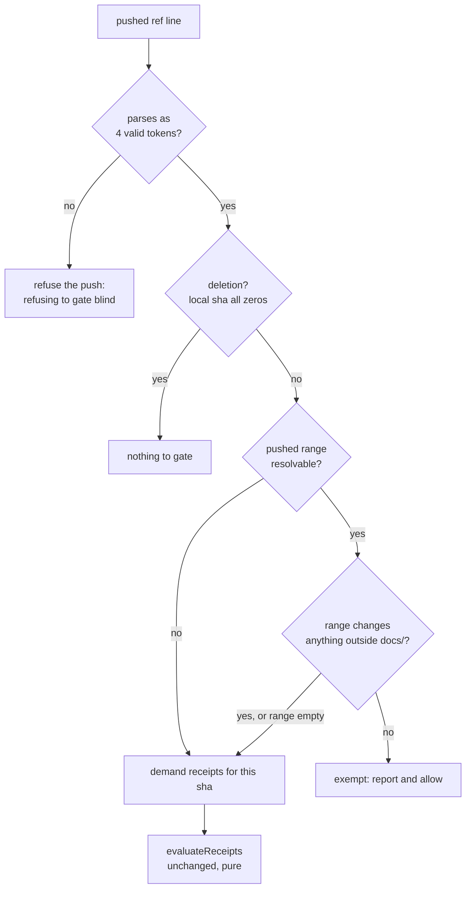

# Drag e2e Smoke Shrink and the Docs-Only Receipt Exemption - Plan

## Goal Capsule

- **Objective**: land the drag-derivation campaign's U4 phase (c) — the inferred-drag write spec drops from ten cases to three smoke journeys, because the merged planner and derivation tables now own the matrix — and mechanize the approved docs-only exemption in the pre-push review-receipts gate so it stops being a per-push judgment call.
- **Authority hierarchy**: the campaign plan (see Sources) governs requirements and the campaign's merge gate; this plan governs one PR's execution. Repo conventions (AGENTS.md, docs/conventions/) govern style and workflow. Where this plan contradicts observed code reality, surface the deviation instead of guessing.
- **Execution profile**: one PR, branched from `main` at `3ea482e`. Per-PR gate: CI green AND a Codex verdict attributed to the current head with zero unresolved threads. Every push additionally requires clean receipts from both local review layers.
- **Stop conditions**: any drag behavior change (this PR is test-and-tooling only — the `src/` tree is not touched); a retained journey that cannot be made to pass without changing production code; evidence that a settled decision cannot work.
- **Tail ownership**: the implementer owns the PR description's deviation notes, the Codex thread replies, and the coverage-ledger accuracy.

---

## Product Contract

### Summary

The inferred-drag write spec explores a combinatorial space that pure tests now own, at twenty-to-forty minutes per real-Obsidian loop. Cut it to the three journeys only real Obsidian can prove, with an explicit ledger recording where each retired case's coverage went. Separately, teach the pre-push receipts gate that a docs-only push needs no review receipts, so an exemption the maintainer already approved is enforced by the script rather than remembered by the pusher.

### Problem Frame

Two unrelated residues of the same campaign.

The drag spec grew one case per review round: ten cases, 572 lines, each booting a real Obsidian and driving real SVAR mouse events. U2's derivation table and U3's planner table have since absorbed the outcome matrix — outcome × gesture × instances × tree role × cascade mode × persist result — at unit speed. What e2e still uniquely proves is narrow: that the prompt seam engages in a real Obsidian, that echoes reach every placement of a source note through the real store, and that a committed write does not re-poke the entry-signature into a re-notify storm. Everything else is redundant exploration paid for at e2e prices.

The receipts gate refuses any push whose commits lack clean receipts from both local review layers. The maintainer approved a docs-only exemption, but approval that lives in a person's judgment is not a mechanism — the repo's own learning is that guarantees need a toolchain step, not a note. Today a docs-only push either burns two full review layers or gets waved through by hand, and only the second option is fast, so the gate quietly trains people to bypass it.

### Requirements

**Spec shrink**

- R1. `test/specs/gantt-inferred-drag-write.e2e.ts` contains exactly three test cases, each a journey rather than a matrix row.
- R2. The retained set includes an estimate-only cascade journey over blocked days that asserts the echoed geometry reaches every placement of the dragged source and that the write does not trigger a re-notify storm.
- R3. Every retired case's coverage is accounted for in a ledger committed with the change: retained in a journey, owned by a named unit-test module, or deliberately dropped with a stated reason.
- R4. No production code changes. The `src/` tree and both ratcheted files are untouched by this PR.

**Receipts gate**

- R5. A pushed ref whose entire pushed range changes nothing outside `docs/` requires no review receipts; the push is allowed and the exemption is reported on stdout.
- R6. A pushed range that touches anything outside `docs/` is gated exactly as today, including a range that mixes docs and non-docs changes.
- R7. The exemption is decided per pushed ref. In a multi-ref push, a docs-only ref is exempt while a code-bearing ref in the same push is still gated.
- R8. Any inability to determine the pushed range with confidence yields no exemption — the gate demands receipts. Failing closed is the only acceptable failure direction.
- R9. The docs-only predicate is a pure exported function testable without a git repository, matching the module's existing testable-exports shape.

### Acceptance Examples

- AE1. Covers R2. **Given** an inferred-end task on a working-week calendar with a second placement, **when** its end is dragged out across the blocked weekend and "Estimate only" is chosen, **then** the working-day estimate persists, no due date is authored, and both placements settle on the *derived* span rather than the one the gesture drew.
- AE2. Covers R5. **Given** a branch whose pushed commits touch only `docs/`, **when** the pre-push hook runs with no receipts recorded, **then** the push is allowed.
- AE3. Covers R6. **Given** a pushed range containing one docs commit and one `src/` commit, **when** the hook runs with no receipts, **then** the push is refused.
- AE4. Covers R7. **Given** one push carrying a docs-only branch and a code-bearing branch, **when** the hook runs with receipts for neither, **then** only the code-bearing ref is named in the refusal.

### Scope Boundaries

**Deferred to Follow-Up Work**

- Pruning fixture notes that no committed spec references after the shrink (`Undo Parent`, `Undo Child`, `Adjust Parent`, `Adjust Child`, `Ask Once`, `Ask Twice`, and `InferredDragAsk.base`). Deferred by KTD5; needs a maintainer confirmation that no gitignored local probe consumes them.
- A fault-injection seam that would let e2e drive a real persist failure. The executor's failure-revert orderings have direct jest coverage; adding the seam is new test infrastructure, not a shrink.
- Restoring a real-Obsidian proof for the working-days-over-a-weekend estimate round trip, if the derivation table plus `gantt-calendar-stretch.e2e.ts` prove insufficient in practice.

**Outside this plan's identity**

- No drag behavior changes, no production code, no changes to the two ratcheted files.
- The remaining campaign units (U7 docs, U5 e2e assertions, U6 equivalence backfill) are separate PRs and are not planned here.

### Sources

- docs/plans/2026-07-27-001-refactor-drag-derivation-authority-plan.md — the campaign plan; U4 phase (c) specifies this shrink, and its Verification Contract supplies the merge gate.
- docs/solutions/tooling-decisions/test-at-the-fastest-level-not-redundant-e2e.md — the criterion this shrink applies: before keeping a slow e2e, check whether a faster level already covers it.
- docs/solutions/tooling-decisions/layered-pre-push-review-gate.md — why the two-layer gate exists and why its exemptions must be mechanical.

---

## Planning Contract

### Key Technical Decisions

- KTD1. **Three journeys, not three representative rows** (session-settled: user-directed — chosen over keeping the ten-case matrix: the merged planner and derivation tables own the matrix at unit speed, so e2e keeps only what real Obsidian alone can prove). Governs R1.
- KTD2. **An estimate-only journey over blocked days is retained, asserting the echo-guard and entry-signature interplay** (session-settled: user-directed — chosen over dropping it as planner-covered: that interplay is observable only in real Obsidian). What is settled is the journey's *property*, not which fixture carries it: the settled instruction named the case, and the choice of calendar was a plan-time judgment. Planning first selected the all-blocked `Blocked Parent` pair; execution moved to the working-week `Seam Only`, whose blocked weekend satisfies the same property with an expected value the retired case already proved. The all-blocked variant is not merely a different fixture — it surfaced a production derivation question this PR cannot fix (D-1). Governs R2.
- KTD3. **"No re-notify storm" is asserted by reading the view's `dbgDataUpdates` counter, not by scraping console output.** The counter increments unconditionally on every `onDataUpdated` that reaches a mounted view — only its debug log is gated — so a bounded delta across the drag-and-settle window is a direct, always-available signal. Console scraping in Electron is unreliable and adding a production counter for a test would violate the repo's diagnostics-stay-cheap rule. Governs R2.
- KTD4. **The prompt journey ends with the "Don't ask again" leg, and the revert journey runs before it.** The persisted choice flips the view's mode for every later gesture on that base, so its round trip is only observable as the closing leg of the journey that sets it — and any journey needing a prompt on the same base must run first. This keeps the config round trip in e2e without spending a fourth case. Governs R1.
- KTD5. **Fixture notes stay; only spec cases are deleted** (session-settled: user-approved — chosen over pruning the orphaned fixtures in this PR: gitignored `test/specs/_local-*` probes are the maintainer's own debug tools and may consume those notes, so deleting them would break tooling invisibly). Unreferenced fixture notes are inert data, not dead code paths. The unreferenced set is recorded in Scope Boundaries for a confirmed follow-up.
- KTD6. **The docs-only exemption is decided per pushed ref, over that ref's whole pushed range** (session-settled: user-approved — chosen over exempting any push containing docs changes: a mixed push would smuggle unreviewed code through a docs-shaped hole). Because `parsePushedRefLines` already keys on each line's local sha — the ref tip — per-ref and per-sha are the same partition, so `evaluateReceipts` stays pure and unchanged; the exemption becomes a filter applied before it. Governs R5, R6, R7.
- KTD7. **`parsePushedRefLines` returns ref records, not bare shas.** Deriving a range needs each line's remote sha alongside its local sha, which the current return shape discards. Returning `{ localSha, remoteSha }` pairs keeps range derivation honest instead of re-parsing stdin twice; the caller derives the sha list it passes to `evaluateReceipts`. This changes an exported signature and its existing unit cases.
- KTD8. **Fail closed on every ambiguity** (R8): an unresolvable remote sha, a git invocation that errors, and an empty changed-path set all yield no exemption. Renames are read with rename detection disabled so a file moved out of `docs/` lists both paths and correctly defeats the exemption.
- KTD9. **`docs/` matches on a path boundary, and paths are read NUL-separated.** A prefix test would exempt `documentation/`; NUL separation avoids git's quoting of paths with spaces or non-ASCII characters, which this repo's docs tree contains.

### High-Level Technical Design

The gate's decision path, per pushed ref line:

Range derivation by remote-sha shape:

| Remote sha on the ref line | Pushed range | Rationale |
|---|---|---|
| A real commit present locally | `<remote-sha>..<local-sha>` | Exactly what the remote will gain, on git's own authority. |
| All zeros (a ref the destination lacks) | none — fail closed, no exemption | Nothing local is trustworthy enough to say where the range begins (see D-6). |
| Present but unresolvable locally | none — fail closed | An unfetched remote sha means the range is a guess (KTD8). |
| No stdin at all (manual run) | none — fail closed, gate HEAD | Preserves the manual-invocation contract. |
| Stdin unreadable | none — fail closed, refuse the push | Unknown pushed refs is not the same absence as no pushed refs. |

Directional guidance: the exact helper names and the shape of the git invocations are finalized in implementation.

### Sequencing

U1 → U2. The receipts gate is fast, self-contained, and unit-provable, so it lands first and gives the branch a green base before the slow real-Obsidian loop starts. The two units are otherwise independent.

### Risks & Dependencies

- The retained journeys carry more assertions per case than the cases they replace, so a single failure is less self-locating. Mitigated by keeping each journey's `timeoutMsg` specific, as the current spec already does.
- Journey ordering is load-bearing (KTD4). A future case inserted before the prompt journey on the main base will see a flipped mode and fail confusingly; the spec's ordering comment must say so.
- The re-notify bound (KTD3) is an empirical threshold. Set it from an observed clean run with headroom, and treat a tightening failure as a real regression signal rather than re-raising the bound reflexively.
- Deleting cases can orphan spec-local helpers. Lint now errors on unused declarations, so an orphaned helper fails the build rather than lingering — this is a mechanism, not a review burden.
- The known `gantt-column-sort` and `gantt-bar-channels` flakes can red-herring a gate run; re-run before diagnosing.

---

## Implementation Units

### U1. Docs-only exemption in the pre-push review-receipts gate

- **Goal**: an approved exemption becomes a mechanism — a docs-only push passes the gate without receipts, and everything else is gated exactly as before (R5–R9).
- **Requirements**: R5, R6, R7, R8, R9. Covers AE2, AE3, AE4.
- **Dependencies**: none.
- **Files**: scripts/check-review-receipts.mjs, test/unit/checkReviewReceipts.test.ts.
- **Approach**:
  1. Change `parsePushedRefLines` to return ref records carrying both shas per KTD7, and update `check` to derive its sha list from them. Update the existing parse cases to the new shape — the validation and deletion-skipping behavior they pin is unchanged.
  2. Add a pure exported predicate deciding whether a list of changed paths is confined to `docs/`, with boundary matching and the empty-list-is-not-exempt rule per KTD8 and KTD9.
  3. Add an unexported range-resolution helper implementing the remote-sha table above, returning the changed paths or a not-resolvable signal. Read paths NUL-separated with rename detection disabled.
  4. In `check`, partition the pushed refs into exempt and gated before calling `evaluateReceipts`; report each exemption on stdout so an allowed push still says why.
  5. Update the module's header comment to state the exemption and its fail-closed direction, without citing volatile references.
- **Patterns to follow**: the module's existing split — pure exported logic (`parsePushedRefLines`, `evaluateReceipts`) with git invocations in unexported helpers; the existing `console.error` refusal shape.
- **Test scenarios**:
  - The predicate returns true for a single `docs/` path, for nested `docs/a/b/c.md`, and for a multi-path list entirely under `docs/`.
  - The predicate returns false for a list containing `src/x.ts`, for `documentation/x.md`, and for a root file literally named `docs`.
  - The predicate returns false for an empty list (fail closed, per KTD8).
  - `parsePushedRefLines` returns the local and remote sha of each valid line, still skips deletions, still dedupes, and still surfaces malformed and bad-width lines as invalid.
  - A ref record whose remote sha is all zeros is distinguishable from one carrying a real sha, so range derivation can branch on it.
  - Covers AE4. Given two ref records where one range is docs-only and the other touches `src/`, only the code-bearing sha is passed to `evaluateReceipts`.
  - Covers AE3. A range mixing a `docs/` path and a `src/` path is not exempt.
  - A rename moving a file out of `docs/` lists both paths and is therefore not exempt.
- **Verification**: `npm test` green including the new cases; a manual no-stdin run still gates HEAD; a scratch docs-only commit passes the hook with no receipts recorded, and a scratch commit touching `src/` still refuses.
- **Execution note**: test-first. Write the predicate's boundary cases and the mixed-range case before the implementation — the fail-closed direction is the property most worth pinning, and it is the one an over-eager refactor would invert.

### U2. Shrink the inferred-drag write spec to three smoke journeys

- **Goal**: the spec keeps only what real Obsidian uniquely proves, with every retired case's coverage accounted for (R1–R4).
- **Requirements**: R1, R2, R3, R4. Covers AE1.
- **Dependencies**: none (independent of U1; sequenced second because its verification loop is slow).
- **Files**: test/specs/gantt-inferred-drag-write.e2e.ts, test/vaults/gantt-inferred-drag-write/Seam Container.md (new), test/vaults/gantt-inferred-drag-write/InferredDragSeam.base, docs/plans/2026-07-28-001-refactor-drag-e2e-smoke-shrink-plan.md (the ledger below is the committed record per R3).
- **Approach**:
  1. Rewrite the spec's header comment to describe the three journeys and the ordering constraint, replacing the current five-behavior enumeration.
  2. Author the revert journey first in file order: drag an inferred end on the main base, cancel the prompt, assert the bar returns to its pre-drag width and the note is byte-identical.
  3. Author the prompt journey second: assert the fixture renders write-enabled with the inferred bar flagged, drag an inferred end, choose "Estimate and dates", assert the estimate and materialized due date land and the ancestor window extends; then re-drag with "Don't ask again" checked and assert the very next gesture writes with no second prompt.
  4. Author the blocked-days echo journey third, on the seam base: give `Seam Only` a second placement in the disposable vault copy (the frontmatter-edit idiom the retired adjust case uses), snapshot the view's update counter, drag its end out across the blocked weekend, choose "Estimate only", then assert the working-day estimate persisted, no due date was authored, the authored start is untouched, both placements settled on the derived span, and the update-counter delta stayed within bound. Establish that bound from an observed clean run — a ceiling loose enough to always pass proves nothing.
  5. The second placement needs a parent, and the parent must be roomy enough that the derived span never outgrows it: a child that overflows its parent reaches the ancestor cascade even under "Estimate only", which raises a second modal and drowns the property under test. Add a fully authored container fixture rather than borrowing a tight-windowed one.
  6. Delete the seven retired cases and any helper the deletions orphan; lint's unused-declaration error is the check.
- **Patterns to follow**: the spec's existing `activateBaseLeaf` / `ensureGanttReady` self-healing idiom on every poll; the frontmatter-edit second-placement technique in the current adjust case; `switchBase` for the seam base.
- **Test scenarios** — the three journeys, and the ledger accounting for what leaves:

  | Retired case | Where its coverage lives now |
  |---|---|
  | renders the fixture with inferred bars flagged | Retained as the prompt journey's opening assertions |
  | writes only the grown estimate for "Estimate only" | Planner table (estimate-only outcome row); the estimate-only write shape is re-asserted by the blocked-days journey |
  | materialises the dragged end for "Estimate and dates" | Retained in the prompt journey |
  | writes nothing and restores the bar when cancelled | Retained as the revert journey |
  | still extends the parent window after an inferred-edge decision | Retained in the prompt journey |
  | keeps an estimate-only choice derived when the shrink cascade would fire | Planner table (estimate-only x cascade-reachable); the derived-end-stays-derived half is retained in the echo journey |
  | applies "Don't ask again" to the very next drag | Retained as the prompt journey's closing leg |
  | restores the estimate when the shrink cascade is undone | Planner table's undo-restore row, which pins today's restore-as-value behavior |
  | recomputes the estimate when the shrink cascade adjusts instead | Planner table (cascade mode × outcome); its multi-placement echo assertion moves into the blocked-days journey |
  | persists the working-day estimate for an estimate-only seam drag | Retained as the echo journey's spine, now also asserting both placements and the update bound |

  - Covers AE1. The blocked-days journey asserts both placements of the dragged source settle within half a day-column of the corrected geometry.
  - The blocked-days journey asserts the view's update counter advanced by no more than the agreed bound between the pre-drag snapshot and the settled write.
  - The revert journey asserts the note content is unchanged byte-for-byte, not merely that no due date appeared.
  - The prompt journey asserts no second modal appears within the existing negative-wait budget after the persisted choice.
- **Verification**: `npm run e2e:local -- --spec test/specs/gantt-inferred-drag-write.e2e.ts` green with exactly three passing cases; `npm run lint` and `npm run typecheck` green; `git diff --stat` shows no `src/` path and no change to either ratcheted file.
- **Execution note**: prove the journeys in real Obsidian before pushing — this is the unit whose only honest verification is the slow loop. Establish the re-notify bound from an observed clean run rather than guessing it, and record the observed value in the PR description.

---

## Verification Contract

| Gate | Command / check | Applies to |
|---|---|---|
| Unit tests | `npm test` | U1, U2 |
| Focused e2e | `npm run e2e:local -- --spec test/specs/gantt-inferred-drag-write.e2e.ts` | U2 |
| Lint / typecheck | `npm run lint` and `npm run typecheck` | U1, U2 |
| No production drift | `git diff --stat` against base shows no `src/` path | U2 |
| Size ratchets | `scripts/check-size-ratchet.mjs` passes untouched at its exact baselines | whole PR |
| Local review gate | Clean receipts from both layers against the pushed head | every push |
| CI | build and e2e jobs green on the PR | whole PR |
| Merge gate | Codex has reviewed the current head with zero unresolved threads | whole PR |

Operational notes: run `obsidian` CLI commands from PowerShell, never Git Bash. Never switch branches while a WDIO run is loading specs. Move the gitignored `test/specs/_local-*.e2e.ts` probes aside before any full-glob e2e run.

## Deviations and Findings from Execution

Recorded here rather than absorbed silently, per the Definition of Done.

- **D-1. The echo journey runs over a blocked weekend, not an all-blocked calendar.** The first draft dragged `Blocked Parent` (a calendar blocking every day in reach) and expected the plain fitted two days; real Obsidian persisted `timeEstimate: 1440` — one working day. The fixture's own body documents the opposite intent: fitting it back "must persist the plain fitted duration, not one working day". The flagged fallback appears to govern the span direction while the estimate direction counts working days, reaches zero, and floors to one — never consulting the give-up flag. That is a production-derivation question and R4 bars production changes here, so the journey was re-targeted onto `Seam Only`, whose expected value is empirically proven by the case it replaces. **Open finding, not fixed.** Nothing has ever exercised these fixtures: `Blocked Parent`, `Blocked Child`, and `Blocked Solid` were referenced by exactly one line — a bar list — so they rendered and were never dragged.
- **D-2. An estimate-only choice that grows the derived span still reaches the ancestor cascade.** Nesting the dragged note under a tight-windowed parent raised a second modal even though "Estimate only" authors no dates: the child's *rendered* span outgrew the parent, and the extend cascade fired on that. Plausibly correct — a parent should contain its child's rendered span regardless of provenance — but currently asserted nowhere. Designed around with a roomy container fixture so the journey stays about the echo property. **Deserves its own planner-table row; out of scope here.**
- **D-3. The revert journey covers the cancel path, not an injected persist failure.** No fault-injection seam exists to drive a real persist failure from e2e, and the executor's failure-revert orderings already have direct jest coverage. Adding the seam would be new test infrastructure, not a shrink.
- **D-4. The update bound is calibrated, not assumed.** A clean run advances the view's update tally by exactly one — the frontmatter write — because the echoes ride under the echo-guard and never reach the entry signature. The bound is set with headroom above that measurement; the first draft's ceiling was loose enough to pass with the echo-guard deleted.
- **D-6. A ref the destination does not have earns no exemption — the inferred base is gone.** The plan first derived a new branch's base from local remote-tracking refs. Successive review rounds found three distinct ways that reading exempts a push carrying code: it excludes commits held by any remote rather than the destination; the argument is glob-matched, so one remote name can match another's refs; and tracking refs answer about a stale moment. Three failures in one spot is the problem reporting that it has no cheap trustworthy answer, so the inference was deleted rather than patched a fourth time. A new branch's first push is gated; every push after it is eligible. Cost: one review per new docs branch. Bought: the invariant.
- **D-7. Both path readings pin the git behaviors local state can switch off.** Reviews found five ways a machine's own configuration silently narrows what the gate sees: replacement objects rewrite what `diff` and `log` report while the pack transfer sends the original; `log.diffMerges=off` suppresses merge paths even when merge diffs are requested by shorthand (measured here: 78 paths down to 27); a submodule ignore setting drops gitlink changes entirely; `log.showRoot=false` hides a root commit's own diff; and a graft file fakes ancestry for every history command, with no flag that disables it (measured: a range carrying three commits, one of them source-bearing, read as a single docs path). The first four are pinned explicitly. Grafts cannot be pinned, so their presence forfeits the exemption outright. The general rule this leaves behind: a gate must inspect what the push transfers, never a reading that local state can redefine — and where a reading cannot be made trustworthy, it must not be used at all.
- **D-5. Case count fell by seven; line count fell by about fifty.** The retired cases were short and the helpers they shared are the bulk of the file, while the echo journey added two. The win is wall-clock and combinatorial surface, not diff size.

## Definition of Done

- R1–R9 satisfied.
- The spec contains exactly three cases and passes in real Obsidian.
- The coverage ledger is committed and accurate — every retired case resolves to a retained journey, a named unit-test module, or a stated deliberate drop.
- A docs-only push passes the receipts gate with no receipts recorded; a mixed push does not.
- No `src/` file changed; both ratcheted files untouched at their exact baselines.
- Deviations from this plan — including the revert journey covering the cancel path rather than an injected persist failure — are reported in the PR description, not silently absorbed.
