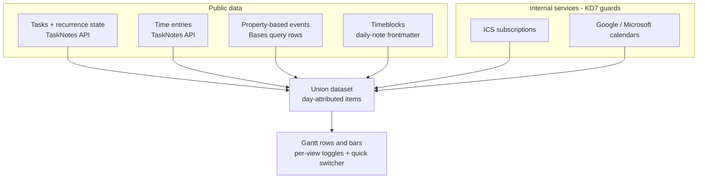
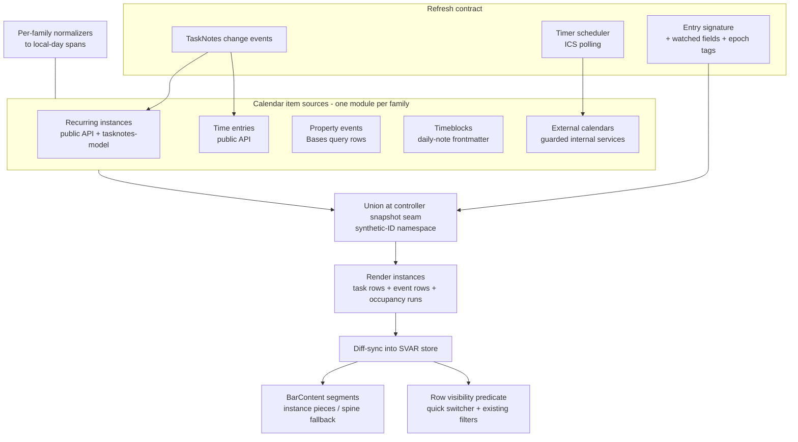

# TaskNotes Calendar-View Union - Plan

## Goal Capsule

- **Objective:** Let users see everything their TaskNotes calendar view shows — recurring task instances, time entries, timeblocks, property-based events, and external calendars (ICS / Google / Microsoft) — as read-only, day-granularity bars in the Gantt, shaped by the same per-view settings they already know from the calendar.
- **Authority hierarchy:** Product Contract Rs govern behavior; KTDs govern mechanism within their cited Rs; units override neither. The scope qualifiers confirmed at planning (R13–R16, R10's state qualifier, AE7–AE8) are user-confirmed product behavior.
- **Execution profile:** Three dependency-ordered slices, each independently shippable behind opt-in per-view toggles. Slice 1: recurring + time entries (public data only). Slice 2: property events + timeblocks + quick switcher. Slice 3: external calendars (internal-service access).
- **Stop conditions:** Stop and surface if TaskNotes internal services prove unreachable in a way the degrade path cannot absorb, or if segment tiling cannot faithfully render per-instance bars at day zoom — both would force a Product Contract change, not a silent workaround.
- **Tail ownership:** Each slice lands via the repo's normal PR flow behind green CI; docs updates (provider windows, parity limits) ship with slice 3.

---

## Product Contract

Product Contract preservation: preserved; clarified with user-confirmed qualifiers at planning — R10 amended (switcher state), R13–R16 and AE7–AE8 added (the six scope-confirmed defaults). No existing requirement re-scoped.

### Summary

Add every TaskNotes calendar item family to the Gantt as read-only, day-granularity bars, governed by per-view dataset settings that mirror the calendar's own toggles — opt-in per view, delivered in three dependency-ordered slices, with a display-time quick switcher to show/hide sources instantly.

### Problem Frame

The Gantt today ingests only tasks and their dependencies: one bar per task from its scheduled and due dates. A heavy calendar user's day is richer than that — recurring routines, tracked time, timeblocks, notes with date properties, and subscribed external calendars all appear on the TaskNotes calendar but vanish the moment they switch to the Gantt. They lose timeline context exactly when they want to plan against it. The evidence is the maintainer's own daily friction flipping between the two views; the goal is that a calendar-tuned dataset can be reproduced in the Gantt without relearning anything.

The word "calendar" is overloaded in this repo: the existing working-time calendar feature (non-working-day shading) is unrelated to this work, which is about calendar *items* as bars.

### Key Decisions

- KD1. **Settings parity through identity** — the Gantt offers the same per-view dataset toggles as the calendar, same names and semantics, rather than a mapping layer or a pointer at an existing calendar view. (session-settled: user-directed — chosen over pointing the Gantt at a calendar view's config: calendar users should find setup familiar and, where possible, identical.) Governs R2, R4.
- KD2. **Opt-in per view, defaults off** — every calendar family starts hidden in a Gantt view, even where the calendar defaults it on. (session-settled: user-directed — chosen over inheriting the calendar's on-defaults: calendar data is an opt-in extension of a task Gantt, not its baseline.) Governs R3.
- KD3. **Day is the rendering floor** — timed items round to whole days; a timed item covers every local day it touches. (session-settled: user-approved — chosen over start-day-only rounding: underlying data parity matters, visual concessions are expected.) Governs R5.
- KD4. **Non-task items are read-only in v1.** (session-settled: user-directed — chosen over editable bars: avoids corrupting sub-day data through day-coarse edits; keeps v1 simple.) Governs R9.
- KD5. **Recurring tasks render as one row with a bar per instance** in v1; the parent-plus-child-row-per-instance layout arrives later as a per-view layout setting. (session-settled: user-directed — chosen over shipping both layouts at once: prove the data first, then add layout choice.) Governs R6, R13, R16.
- KD6. **Flat event rows plus a quick source switcher** — non-task items get individual top-level rows, and clutter is managed by an instant, keyboard-operable show/hide affordance per source, not by a grouping hierarchy. (session-settled: user-directed — chosen over collapsible group rows per source: fast display-time control beats structural nesting.) Governs R10, R15.
- KD7. **External calendars ride TaskNotes' internal services** behind defensive guards while a public calendar read API is proposed upstream. (session-settled: user-approved — chosen over waiting for an upstream API or re-implementing fetching: zero duplicated fetch code now, clean migration path later.) Governs R11, R12.
- KD8. **Cheapest-dependency delivery order** — recurring + time entries, then property events + timeblocks + switcher, then external calendars. (session-settled: user-approved — chosen over one big release or visible-value-first: each slice proves data parity before the next.)
- KD9. **Floating-time semantics** — TaskNotes-native naive datetimes mean "this wall-clock time wherever the observer is" (RFC 5545 floating), matching the calendar's behavior; zone-carrying values convert to local time before day attribution. (session-settled: user-approved — chosen over a configured home-timezone pin: pinning would make Gantt bars disagree with the calendar and the stored data carries no zone to pin to.) Governs R8.
- KD10. **Multiple simultaneous ingestion sources as a first-class architecture** — the Gantt accepts several data sources at once; adapter boundaries are drawn by single-responsibility merit. (session-settled: user-directed — chosen over hardwiring calendar ingestion into the existing task adapter.)

---

### Requirements

**Dataset parity and settings**

- R1. The Gantt can render every item family the TaskNotes calendar shows: task date events (scheduled, due, scheduled-to-due span), recurring task instances, time entries, timeblocks, property-based events, and external calendar events (ICS subscriptions, Google, Microsoft).
- R2. Each family is controlled by per-view settings whose names and semantics match the calendar's toggles — including per-subscription and per-calendar visibility, recurring-instance sub-toggles (projected, completed, skipped), and the property-based event configuration (start, end, and title properties).
- R3. Every calendar family defaults to hidden in a Gantt view; a user must opt in per view. Once a family is enabled, its sub-toggles adopt the calendar's own defaults (completed and skipped recurring instances default to shown).
- R4. With equivalent toggles set, the Gantt's underlying dataset matches what the calendar shows for the same vault and date window; presentation differs (bars vs. calendar cells), data does not.
- R14. Property-based events are scoped by *this Gantt view's* Bases query — parity with the calendar holds when the queries match. Synthesized rows (external calendar events, timeblocks) are not Bases query rows and are exempt from the Bases toolbar search and filters, which continue to govern task and property-event rows only.
- R15. Non-task event rows cover each provider's full data window and remain a stable row set while the user scrolls or zooms; v1 imposes no row cap. Clutter control is the quick switcher (R10).

**Rendering**

- R5. Items render at day granularity: a bar covers every local calendar day the item touches, with a one-day minimum.
- R6. A recurring task occupies one row carrying a bar per instance in the visible window, visually distinguishing the next occurrence, projected instances, completed instances, skipped instances, and materialized occurrences; a materialized occurrence replaces the virtual instance for its date, matching calendar behavior.
- R7. Recurring instance dates are computed with the same engine and semantics the calendar uses (the public `@tasknotes/model` expansion, including its DTSTART handling), so the Gantt and calendar always agree on which days a task recurs.
- R8. Day attribution uses floating semantics for naive datetimes and converts zone-carrying values (ICS UTC times, offset-stamped time entries) to the observer's local time first.
- R13. Enabling the recurring family suppresses that task's plain scheduled→due bar and span, matching calendar behavior; disabling it restores the plain scheduled→due representation while completed/skipped recorded-instance bars still render — when recorded days lie outside the plain span, the row keeps the union envelope and renders the plain span as a solid piece alongside the recorded pieces. A recurring task with no scheduled date produces zero instance bars and keeps its current row behavior. Recorded and materialized instances follow dataset parity (R4): the calendar renders them even with its recurring toggle off, so the Gantt does too, including in a fresh default view.
- R16. Per-instance bars tile only at zoom levels where sub-day-faithful tiling is possible (day and hour units); at coarser zooms the recurring row degrades to a dashed series spine spanning first-to-last instance, never a solid bar claiming continuous occupancy.

**Interaction**

- R9. Non-task items are read-only: no drag, resize, or write-back in v1. Task bars keep their existing editability.
- R10. A quick source switcher lets the user show or hide any active source at display time — keyboard operable, effective immediately, no settings round-trip. Its state is session-scoped per view: it survives refreshes and resets when the view closes.

**Data access and resilience**

- R11. External calendar families consume TaskNotes' running internal services; when a service is missing or reshaped, the Gantt degrades gracefully — the family is absent, the rest of the view works, and the user gets a non-intrusive signal.
- R12. The Gantt inherits each provider's data window (ICS: expansion from each event's own start to now + 1 year, capped at 3000 instances per series; Google: 180 days back / 90 forward; Microsoft: 30 back / 90 forward — the providers' initial-sync defaults; incremental sync may add events beyond them) and communicates that emptiness beyond those windows is expected, not a bug.

---

### Key Flows

- F1. Enabling calendar data on a view
  - **Trigger:** A calendar-heavy user opens a Gantt view on their tasks Base.
  - **Steps:** They open view options; they recognize the same dataset toggles they use in the calendar; they enable the families they want (e.g., recurring instances, one ICS subscription); bars appear for those families.
  - **Outcome:** The Gantt shows the same items their calendar shows for those toggles. **Covers R1, R2, R3, R4.**
- F2. Decluttering mid-session
  - **Trigger:** A view with several sources active becomes visually noisy.
  - **Steps:** The user invokes the quick switcher (command or toolbar button, keyboard-friendly), hides two sources, compares the remaining ones, then re-shows them.
  - **Outcome:** Instant show/hide without touching settings; the view's toggle configuration is unchanged. **Covers R10.**

---

### Acceptance Examples

- AE1. **Covers R6, R7.** Given a weekly recurring task with two completed dates, one skipped date, and one materialized occurrence note, when its row renders over a four-week window at day zoom, then it shows distinct bars for completed, skipped, next, and projected instances on the days the calendar would show them, and the materialized date shows only the materialized note's bar.
- AE2. **Covers R5, R8.** Given a Google event from 23:00 to 01:00 local time, when it renders, then its bar covers both touched local days (a two-day bar), on the same days the calendar displays it.
- AE3. **Covers R3.** Given a vault whose calendar view shows ICS events and timeblocks by default, when the user creates a fresh Gantt view, then no calendar items render until they are toggled on — with one parity-mandated exception: a recurring task's recorded (completed/skipped) and materialized instances render on its row, because the calendar shows those even with its recurring toggle off and R4 parity governs (amendment made during implementation when live verification exposed the conflict between this example's original blanket wording and R4/R13).
- AE4. **Covers R8.** Given a task scheduled at a naive `09:00` created in New Zealand, when the vault is opened in England, then the bar sits on the same wall-clock day the calendar shows there (floating semantics, no zone shift).
- AE5. **Covers R11.** Given TaskNotes is installed but an expected internal calendar service is unavailable, when the Gantt loads, then task and public-data families render normally, external calendar families are absent, and the user sees a non-intrusive notice.
- AE6. **Covers R12.** Given a Microsoft calendar with events five months out, when the user scrolls the Gantt past the 90-day provider window, then bars appear only for events the provider's sync actually delivered (none, after a fresh initial sync), and the window limit is discoverable both in the docs and as a description line on that calendar's toggle rather than appearing as data loss.
- AE7. **Covers R6, R13.** Given a materialized occurrence note matched by the view's Base query, when the recurring family is enabled, then the note renders both as its own task row and as a visually marked materialized bar on the parent's recurring row — the dual representation is by design.
- AE8. **Covers R13.** Given a recurring task with recorded completed instances, when the recurring family toggle is turned off, then the task's plain scheduled→due bar returns and the recorded-instance bars still render.

---

### Scope Boundaries

- **Deferred for later:** editing non-task items from the Gantt (drag/resize/write-back); the parent-plus-child-row recurring layout as a selectable per-view setting (KD5) — also the escape hatch if coarse-zoom fidelity ever becomes a hard requirement; dependency/relationship enrichment of calendar items (parked — revisit after v1); hourly/sub-day rendering (existing project decision: day granularity now); suppressing either side of the materialized dual representation (AE7).
- **Outside this work's identity:** a home-timezone pinning option (closed by KD9 — it would break calendar parity); replicating TaskNotes' calendar UI (month/week grids) — the Gantt stays a timeline; building our own external-calendar fetching engine (closed by KD7 unless the upstream path collapses); a row cap or dynamic scroll-windowing of event rows (closed by R15 — row-set stability wins).

---

<!-- ce-section: work-relationships -->
### How This Work Fits Together

This plan owns calendar-item ingestion and rendering parity. The surrounding picture, as currently understood (not a committed roadmap):

- Builds on the split-segment rendering substrate (`src/render/segmentLayout.ts`, from `docs/plans/2026-07-18-002-feat-split-task-segment-rendering-plan.md`) — enables multiple bars per row for R6.
- Can proceed independently of the working-time calendar feature (`docs/plans/2026-07-19-001-feat-multi-calendar-working-time-plan.md`) — shared vocabulary, disjoint behavior.
- Enables a future TaskNotes upstream proposal: a public calendar read API (KD7's migration target). Still to decide: its shape and timing (Open Questions).
- Enables later product areas: calendar-item editing, relationship enrichment, hourly rendering — all deferred above.

---

### Dependencies / Assumptions

- TaskNotes' internal services (`../tasknotes/src/services/ICSSubscriptionService.ts`, the calendar provider registry) are the only path to external-calendar data today; the public runtime API has no calendar namespace, and ICS subscription configs live in plugin data outside the settings snapshot.
- The public `@tasknotes/model` package exports the recurrence expansion the calendar itself uses; the Gantt pins the exact version bundled by the minimum supported TaskNotes release (0.2.1 at TaskNotes 4.11.x) and declares that minimum in docs — a looser range lets the two engines drift and silently break R7 parity. When the installed TaskNotes exceeds the tested range, the KTD7 degrade signal notes possible parity drift. Both repos already depend on `rrule ^2.8.1`.
- Time entries and recurrence state are fully readable through the existing public tasks API; property events come from Bases query rows; timeblocks from daily-note frontmatter — none of these need internal services.
- **Assumption:** global TaskNotes defaults for toggle values are honored via the public settings snapshot where exposed; otherwise the Gantt ships constants matching TaskNotes' shipped defaults.
- TaskNotes' ICS subscription service runs its own per-subscription refresh timers and emits a `data-changed` event after every fetch; the Gantt subscribes to that signal behind structural guards and never initiates fetches itself. Getter reads on a cold or expired cache trigger upstream network fetches, so the fallback timer only re-reads cached events and bumps the family epoch on change.
- **Assumption:** ICS per-instance IDs are unstable across refreshes; item identity for external events keys on stable series IDs plus dates.
- Datetime formats vary per family (ICS timed = UTC; Google/Microsoft timed = local wall time without offset; time entries = offset-stamped; native task/timeblock/property values = naive) — per-family normalizers are required; a single generic date parser is ruled out.

---

### Outstanding Questions

- **Deferred to Planning-follow-up (upstream):** shape and timing of the public TaskNotes calendar read API proposal (issue vs. PR, which surface first). Non-blocking; tracked by U13.
- **Deferred to implementation:** exact visual treatment of instance-state classes within theme constraints; switcher modal layout details; whether the scheduled-to-due span toggle needs recurring-specific handling beyond R13's suppression rule.
- **Resolve Before Planning:** none.

---

### Sources / Research

- Current Gantt ingestion boundary: `src/datasource/TaskNotesSource.ts` (maps scheduled/due only; consumed-fields slice at its `TaskNotesTaskInfo`), `src/datasource/CompositeSource.ts` (base + enrichment only — not an N-source union), `src/controller/GanttController.ts` (`selectSource`, `buildSnapshot`, enrichment-dirty cache invalidation).
- Multi-bar-per-row substrate: `src/render/segmentLayout.ts` (`ghostRunSegments`, `segmentPieces`, `connectorRun`, `canTileSubSpans`), `src/render/svarContract.ts`, `src/bases/BarContent.svelte` (`markBarSplit`), conventions in `docs/solutions/conventions/svar-gantt-bar-geometry-and-fill-conventions.md`.
- Display-vs-derivation law and refresh discipline: `docs/solutions/architecture-patterns/view-display-options-in-presentation-not-derivation.md`, `docs/solutions/integration-issues/gantt-bases-getvalue-renotify-storm.md`, `docs/solutions/integration-issues/svar-gantt-diff-sync-interactions.md`, `src/bases/rowVisibility.ts` (named R5 extension seam), `src/bases/entrySignature.ts`, `src/bases/calendarWatch.ts` (epoch-in-signature pattern).
- TaskNotes consumption conventions: `docs/solutions/conventions/tasknotes-owns-task-identification.md` (DataSource capability template), `docs/solutions/integration-issues/tasknotes-status-palette-wrong-api-path.md` (verify accessors return real data).
- Readiness: `docs/solutions/design-patterns/readiness-signal-keys-on-data-its-consumer-reads.md` (per-source readiness, partial-warmup fixtures).
- SVAR constraints: MIT build force-disables `splitTasks`/`baselines`/`markers`/`unscheduledTasks` at store init (`docs/solutions/integration-issues/svar-pro-feature-render-support.md`); `taskTemplate` takes precedence over native segments; no per-task readonly flag exists — per-task gating is `api.intercept` (SVAR aborts refused gestures natively).
- TaskNotes calendar internals (sibling checkout): event assembly `../tasknotes/src/bases/CalendarView.ts` and `../tasknotes/src/bases/calendar-core.ts`; per-view toggle declarations `../tasknotes/src/bases/calendarViewOptions.ts`; recurrence engine `@tasknotes/model` (`recurrence` module); external providers `../tasknotes/src/services/ICSSubscriptionService.ts`, `GoogleCalendarService.ts`, `MicrosoftCalendarService.ts`; public API surface `../tasknotes/src/api/runtime-api.ts`.
- Standards anchor: floating vs. absolute time per RFC 5545 (see `docs/architecture/standards-alignment.md`).

---

## Planning Contract

### Key Technical Decisions

- KTD1. **Calendar items enter as independent read-only sources merged at the controller snapshot seam.** A `CalendarItemSource` contract (one module per family) produces day-attributed output on two channels — flat event rows, and per-task occupancy attachments keyed by task path — which the controller merges into the render snapshot alongside the existing task pipeline. Separate source modules per family — not one combined adapter — because families differ in access path, liveness signal, and datetime dialect. (session-settled: user-directed — instantiates KD10; chosen over widening `CompositeSource`, whose base+enrichment contract is documented and load-bearing.)
- KTD2. **Synthetic ID namespace for non-note items.** Every surface that consumes `SourceTask.path` as a vault path (managed-paths editability, bar-click note-opening, mutation resolution, entry signature, instance expansion) treats calendar items by a prefixed synthetic ID (family + stable series ID + date for dated instances). Bar-click on an item with a backing note (materialized occurrence, property event, timeblock's daily note, ICS event with linked note) opens that note; items with no note get a details tooltip only. Within a recurring envelope, clicks resolve by segment hit-test: a materialized piece opens its backing note; any other piece routes to the parent recurring task.
- KTD3. **Recurring row = envelope task + inverted occupancy segments on the shipped substrate.** One SVAR task spans first-to-last visible instance (end-of-day end); `segmentLayout` runs are fed occupied days (instances) instead of blocked days, gap pieces are simply not rendered, and each instance piece carries its own state class (next / projected / completed / skipped / materialized) — something native SVAR segments could not do. At non-tileable zooms the row renders a dashed series spine sized by the existing connector-run helper. Recurring *external* series get the same treatment — one row per series with occupancy pieces, never one row per occurrence. (session-settled: user-approved — instantiates KD5, governs R6, R16; chosen over per-instance rows, Pro licensing, or flipping the gated `splitTasks` flag, which is ruled out and loses to `taskTemplate` anyway.)
- KTD4. **Quick switcher is a presentation-layer filter; family toggles are derivation config.** Switcher state folds into the existing composed row-visibility predicate (instant, churn-free, no structural diff ops); per-view family toggles legitimately change the ingested set and must re-derive. Switcher state is session-scoped per view (the instance-scope pattern), never written to Bases config. (session-settled: user-approved — instantiates KD6, governs R10; conflating the two visibility classes re-opens the documented refresh-churn defect.)
- KTD5. **Every new family joins the refresh contract explicitly.** New consumed fields join the entry-signature watched set; out-of-Bases liveness (timeblocks, ICS refresh) folds in as monotonic epoch tags (the calendar-watch pattern); config writes skip-if-unchanged; ICS polling runs on the injected timer scheduler, never by poking Bases. Governs the plan-wide non-regression of the Bases-boundary law.
- KTD6. **Recurrence expansion via the `@tasknotes/model` dependency** — the same engine the calendar uses, wrapped in one parity module that reproduces the calendar's semantics (three event families, materialized suppression, recorded off-pattern dates, DTSTART local-time-stamped-Z quirk, no-scheduled guard). Parity by construction, not re-implementation. Governs R6, R7, R13.
- KTD7. **External calendars via structurally-guarded internal services with fixture-verified accessors.** Every reach into `plugin.icsSubscriptionService` / the provider registry is structurally checked, degrades per family, and carries at least one test asserting the accessor returns real data from a fixture shaped like the actual service — "works but does nothing" is a first-class failure mode with repo precedent. Refresh rides the service's own timers: a guarded `data-changed` subscription is the primary signal, with a fallback timer that only re-reads cached events — the Gantt never initiates fetches. Event identity keys on series ID + date + normalized occurrence start time (stable across refreshes; disambiguates multi-daily series). The degrade signal is one dismissible Notice per session per unreachable family plus that family's toggle rendered disabled with an explanatory tooltip. (session-settled: user-approved — instantiates KD7, governs R11, R12.)
- KTD8. **Per-family datetime normalizers behind one day-attribution function.** Each family's dialect (ICS UTC, Google/Microsoft local-wall, offset-stamped time entries, naive native values) normalizes to a local-day span via its own parser; floating values pass through as wall dates. Governs R5, R8. The derivation window for native families (recurring instances, timeblocks, property events) is fixed per derivation and scroll-independent: earliest relevant anchor (task's scheduled date / earliest daily note) to today + 1 year, mirroring the ICS horizon, with an ICS-style per-series instance cap. Every "visible window" reference in R6 and the units means this derivation window — the chart range derives from the data, so a viewport-relative window would be circular.
- KTD9. **Per-row read-only via intercept vetoes plus a registered cue class.** SVAR has no per-task readonly flag; calendar-item rows are refused at every mutating intercept (drag, update, link add/delete, editor open — mirroring the existing multi-alias defensive list), and a registered `og-event` cue type hides link/progress affordances and fixes the cursor. Governs R9.
- KTD10. **Event rows are plain SVAR tasks over the full provider window.** No new rendering for single-bar events; row virtualization already bounds cost; the row set stays stable under scroll and zoom. Recurring series are one row each (per KTD3), so a daily series never floods the grid with per-occurrence rows. (session-settled: user-approved — governs R15.)

### High-Level Technical Design

Signal flow for liveness: family toggles and mapping keys are read through provider closures each recompute (no remount); timeblock edits and ICS refreshes bump epoch tags folded into the entry signature, forcing re-derivation instead of cached reuse; TaskNotes recurrence/time events extend the existing change-event subscription that marks enrichment dirty.

### Assumptions

- TaskNotes internal service shapes are stable at the currently-installed version; runtime structural guards plus the AE5 notice absorb drift until the upstream API ships.
- Global calendar defaults reachable via the public settings snapshot are honored; unexposed ones ship as constants matching TaskNotes' defaults.
- SVAR internals consumed by the segment substrate remain behind the existing runtime-validated choke point; on validation failure recurring rows degrade to the spine form.

---

## Implementation Units

| U-ID | Title | Key files | Depends on |
|---|---|---|---|
| U1 | Calendar-item source contract and union seam | `src/datasource/calendarItems/`, `src/controller/GanttController.ts` | — |
| U2 | Calendar-family view options and refresh wiring | `src/bases/calendarItemOptions.ts`, `src/bases/register.ts` | U1 |
| U3 | Read-only event-row enforcement | `src/bases/eventRowGuards.ts`, `src/bases/GanttContainer.svelte` | U1 |
| U4 | Recurring parity expansion engine | `src/datasource/calendarItems/recurringSource.ts` | U1 |
| U5 | Recurring row rendering (occupancy segments) | `src/render/segmentLayout.ts`, `src/bases/BarContent.svelte`, `src/bases/ganttSync.ts` | U3, U4 |
| U6 | Time-entry source | `src/datasource/calendarItems/timeEntrySource.ts` | U1, U2 |
| U7 | Slice-1 e2e | `test/specs/gantt-calendar-items-recurring.e2e.ts`, `test/vaults/gantt-calendar-items/` | U2–U6 |
| U8 | Property-based event source | `src/datasource/calendarItems/propertyEventSource.ts` | U1, U2 |
| U9 | Timeblock source with liveness epoch | `src/datasource/calendarItems/timeblockSource.ts` | U1, U2 |
| U10 | Quick source switcher | `src/bases/sourceSwitcher.ts`, `src/bases/rowVisibility.ts` | U2 |
| U11 | Slice-2 e2e | `test/specs/gantt-calendar-items-sources.e2e.ts` | U8–U10 |
| U12 | External-calendar adapter | `src/datasource/calendarItems/externalCalendarSource.ts` | U1, U2, U3 |
| U13 | Upstream public calendar API proposal | (external artifact) | U12 |
| U14 | Slice-3 e2e and user documentation | `test/specs/gantt-calendar-items-external.e2e.ts`, docs | U12 |

### U1. Calendar-item source contract and union seam

- **Goal:** A `CalendarItemSource` contract, the synthetic-ID namespace, and the controller-side union that merges family items into the render snapshot alongside tasks.
- **Requirements:** R1, R15; KTD1, KTD2.
- **Dependencies:** none.
- **Files:** `src/datasource/calendarItems/types.ts`, `src/datasource/calendarItems/index.ts` (new, barrel), `src/controller/GanttController.ts` (wiring only), `src/datasource/index.ts`; tests `test/unit/calendarItemTypes.test.ts`, `test/unit/calendarItemUnion.test.ts`.
- **Approach:**
  1. Define `CalendarItem` (synthetic ID, family, title, local-day span, state class, optional backing note path, optional color) and `CalendarItemSource`: each source receives a query context (derivation window per KTD8, a task-set accessor, a Bases-entries accessor — closed over per family factory) and exposes a staleness/epoch signal.
  2. Sources emit on two channels: flat union items (event rows) and per-task occupancy attachments keyed by task path (the recurring family's channel). The controller — via injected `GanttControllerDeps` factories, per the existing DI shape — unions flat items into `buildSnapshot` output as read-only render instances and merges occupancy attachments into the owning task's render instance; do not widen `CompositeSource` (per KTD1).
  3. Synthetic IDs are namespace-prefixed so no calendar item can collide with a vault path; every path-consuming surface branches on the namespace (per KTD2). Bar-activate resolves the backing note when present, else no-op.
- **Patterns to follow:** `GanttControllerDeps` injection and memoized source resolution in `src/controller/GanttController.ts`; snapshot-equality and cache-invalidation discipline around `enrichmentDirty`.
- **Test scenarios:**
  - Union snapshot contains items from two fake sources alongside tasks, ordered after task rows.
  - A calendar item's synthetic ID never matches `managedPaths`, so `custom.editable` is false.
  - Bar-activate on an item with a backing note path requests that note; on an item without one it does nothing (no throw, no open attempt).
  - A source reporting a bumped epoch invalidates the cached snapshot; unchanged epochs reuse it.
  - Empty sources yield a snapshot identical to today's (no regression when every family is off).
  - A source emitting per-task occupancy attachments sees them merged onto the owning task's render instance, never added as rows.
- **Verification:** unit tests green; existing controller suite unaffected.

### U2. Calendar-family view options and refresh wiring

- **Goal:** The per-view options group mirroring the calendar's toggle names, read through pure readers, defaults off, wired into the entry signature so toggle changes repaint and unrelated notifies reuse.
- **Requirements:** R2, R3, R14; KD1, KD2, KTD5.
- **Dependencies:** U1.
- **Files:** `src/bases/calendarItemOptions.ts` (new — options builders + `readX` readers; do not grow `viewOptions.ts`), `src/bases/register.ts` (group registration, signature wiring), `src/bases/entrySignature.ts` (watched-set extension); tests `test/unit/calendarItemOptions.test.ts`, extend `test/unit/entrySignature.test.ts`.
- **Approach:**
  1. One options group ("Calendar items") with `tngantt_`-prefixed keys named after the calendar's toggles (scheduled/due/span already exist as date policy — map only what's new: recurring + sub-toggles, time entries, timeblocks, property events + three property pickers, per-subscription/per-calendar toggles in slice 3).
  2. Property pickers follow the `FIELD_MAPPING_KEYS` pattern (property-agnostic, empty defaults).
  3. Readers are pure `readX(get)` functions consumed via provider closures re-read each recompute — no remount on toggle.
  4. Toggle values and family-relevant fields join the entry-signature inputs; family off → its fields leave the watched set.
- **Patterns to follow:** `src/bases/viewOptions.ts` group/reader shape; `src/bases/fieldMappingConfig.ts`; defaults-off costs nothing (Bases doesn't persist defaults).
- **Test scenarios:**
  - Each reader returns its default (off) when the key is absent — the omission fixture is the default test.
  - Toggling a family flips the entry signature; an unrelated notify with unchanged toggles reuses tasks.
  - Property-picker readers reject non-property values and pass through mapped names without hardcoded fallbacks.
  - Options callback lists per-subscription entries only when TaskNotes is present (slice-3 hook point, stubbed here).
- **Verification:** unit tests green; manual toggle in dev vault repaints without a view remount.

### U3. Read-only event-row enforcement

- **Goal:** Whole-row read-only for calendar items: every mutating gesture refused per-row, affordances hidden, cursor honest.
- **Requirements:** R9; KTD9.
- **Dependencies:** U1.
- **Files:** `src/bases/eventRowGuards.ts` (new — pure `isCalendarItemRow`/veto predicates), `src/bases/GanttContainer.svelte` (intercept wiring), `src/bases/ganttSync.ts` (register `og-event` cue type in the instance-cue superset); tests `test/unit/eventRowGuards.test.ts`.
- **Approach:**
  1. Add the synthetic-namespace check to every mutating intercept: drag-task (primary — SVAR aborts refused gestures at the first frame), update-task, add-link, delete-link, show-editor; mirror the existing multi-alias defensive list used for reorder.
  2. Register `og-event` in the composed task-type superset (unregistered composite types silently collapse) and CSS-gate link handles, progress marker, and cursor (`!important` — SVAR writes cursor inline on hover).
  3. Double-click routes through the existing show-editor interception to open the backing note when one exists.
- **Patterns to follow:** existing intercepts in `GanttContainer.svelte`; `buildInstanceCueTaskTypes` in `src/bases/ganttSync.ts`; `.og-progress-readonly` CSS gating.
- **Test scenarios:**
  - Each mutating intercept returns false for a calendar-item ID and true/normal for a task ID (one case per intercepted action).
  - The cue type registers in the task-type superset; a composed type string round-trips.
  - Guard predicates treat every namespace prefix as read-only and vault paths as editable-eligible.
- **Verification:** unit tests green; manual drag attempt on an event row does not move the bar and shows no snap-back.

### U4. Recurring parity expansion engine

- **Goal:** A pure module that turns a recurring task's frontmatter state into per-day instance occupancy matching the calendar exactly.
- **Requirements:** R6, R7, R13; KTD6.
- **Dependencies:** U1.
- **Files:** `src/datasource/calendarItems/recurringSource.ts` (new), `src/datasource/TaskNotesSource.ts` (extend the consumed `TaskNotesTaskInfo` slice with recurrence fields + `TASKNOTES_CHANGE_EVENTS` additions), `package.json` (`@tasknotes/model` dependency); tests `test/unit/recurringSource.test.ts`.
- **Approach:**
  1. Read `recurrence`, `complete_instances`, `skipped_instances`, `recurrence_parent`, `occurrence_date` through the field mapper (names are user-remappable — never hardcode).
  2. Expand with `@tasknotes/model`'s `generateRecurringInstances` over the derivation window (KTD8); reproduce calendar semantics: next-scheduled vs. projected vs. recorded families, recorded off-pattern dates render, materialized index suppresses virtual instances per parent/date, no-scheduled → zero instances, sub-toggle filtering for completed/skipped.
  3. Reproduce the DTSTART quirks (local wall time stamped `Z`; time fallback order) by mirroring the calendar's read path, not by "fixing" it.
  4. Pin `@tasknotes/model` to the exact version bundled by the minimum supported TaskNotes release; route an out-of-tested-range installed version through the KTD7 degrade-signal note.
  5. Emit both instance occupancy (for U5's segments) and the plain-bar suppression flag (R13).
- **Execution note:** Test-first against fixtures transcribed from the calendar's own behavior — the parity table in the brainstorm dossier is the oracle.
- **Test scenarios:**
  - Weekly rule over a four-week window yields the calendar's exact instance dates (boundary day exclusive-end case included).
  - A date present only in completed instances renders as a recorded instance.
  - A materialized occurrence suppresses its virtual instance; other dates unaffected.
  - Completed/skipped sub-toggles filter exactly their families.
  - Recurring task with no scheduled date yields zero instances and no suppression flag.
  - DTSTART with a time stamped `Z` produces the same local days the calendar shows (no UTC shift).
  - Remapped recurrence property names resolve through the field mapper.
- **Verification:** unit suite green; parity spot-check against a live calendar view on the dev vault.

### U5. Recurring row rendering (occupancy segments)

- **Goal:** The one-row-bar-per-instance rendering: envelope task, per-instance pieces with state classes, spine fallback at coarse zoom, plain-bar suppression.
- **Requirements:** R5, R6, R13, R16; KTD3.
- **Dependencies:** U3, U4.
- **Files:** `src/render/segmentLayout.ts` (occupancy-run support), `src/bases/BarContent.svelte` (instance pieces + spine), `src/bases/ganttSync.ts` (`custom.occupancyRuns`, envelope start/end, suppression), `src/bases/GanttContainer.svelte` (CSS for instance-state classes and spine); tests `test/unit/segmentLayout.test.ts` (extend), `test/unit/ganttSyncOccupancy.test.ts`.
- **Approach:**
  1. Feed `ghostRunSegments` occupied days; render only occupied pieces (gaps unrendered so calendar shading reads through); envelope end is end-of-day of the last instance.
  2. Each piece carries its instance-state class and a `title`; paint via the CSS-custom-property convention, never host `background-color`.
  3. When `canTileSubSpans` is false, render the dashed series spine sized by `connectorRun` instead of a solid bar.
  4. Envelope rows are non-draggable via U3's guards; `markBarSplit` keeps the host transparent.
- **Patterns to follow:** the ghost-run pipeline end-to-end (`segmentLayout` → `custom` → `BarContent`); geometry conventions doc (end-of-day ends, `--og-ghost-fill`-style paint threading).
- **Test scenarios:**
  - Occupancy runs for spaced instances produce alternating pieces whose fractions sum within tolerance; gap pieces absent.
  - Day-zoom snapshot tiles; week/month snapshot returns the spine form (no solid pieces).
  - Envelope end lands on end-of-day (bar not one column short).
  - Instance state maps to the expected class per family (next/projected/completed/skipped/materialized).
  - Suppression flag removes the plain scheduled→due bar; toggle-off restores it with recorded pieces intact (AE8 shape at unit level).
  - Covers AE7. A materialized occurrence renders simultaneously as its own task row and as the marked materialized piece on the parent's row — both asserted in one scenario.
  - Segment hit-test click routing (KTD2): a materialized piece opens its backing note; a projected piece routes to the parent recurring task.
- **Verification:** unit tests green; visual check in dev vault at day and month zoom.

### U6. Time-entry source

- **Goal:** Finished time entries as flat read-only event rows, day-attributed from their offset-stamped timestamps.
- **Requirements:** R1, R5, R8; KTD8.
- **Dependencies:** U1, U2.
- **Files:** `src/datasource/calendarItems/timeEntrySource.ts`, `src/datasource/calendarItems/normalizers.ts` (new — shared per-family day attribution); tests `test/unit/timeEntrySource.test.ts`, `test/unit/calendarItemNormalizers.test.ts`.
- **Approach:** read `TaskInfo.timeEntries` from the already-fetched task set; render finished entries only (running entries have no end — matching the calendar); one row per entry titled by its task; offset-stamped timestamps convert to local days (an entry crossing midnight covers both days).
- **Test scenarios:**
  - Offset-stamped entry at 23:30+13:00 lands on the correct local days for a different-offset observer.
  - Entry crossing local midnight yields a two-day span.
  - Running entry (no end) is excluded.
  - Toggle off → source yields nothing (default-off omission fixture).
- **Verification:** unit tests green.

### U7. Slice-1 e2e

- **Goal:** Real-Obsidian proof of the recurring and time-entry families and the opt-in defaults.
- **Requirements:** AE1, AE3 (recurring/time-entry aspect), AE4, AE8.
- **Dependencies:** U2–U6.
- **Files:** `test/specs/gantt-calendar-items-recurring.e2e.ts`, fixture vault `test/vaults/gantt-calendar-items/` (recurring task with completed/skipped/materialized fixtures, task with time entries).
- **Approach:** follow the per-feature fixture-vault pattern; gate readiness on the specific data each assertion consumes (never an any-source OR); assert bar presence/absence and state classes at day zoom, spine at month zoom.
- **Test scenarios:**
  - Fresh view shows no calendar items (AE3).
  - Enabling recurring shows instance bars with distinct state classes and hides the plain bar; disabling restores it with recorded bars (AE1, AE8).
  - Time entries appear as read-only rows when toggled on; drag attempt does not move them.
  - Month zoom renders the spine, not solid bars.
  - Scrolling and zooming beyond the initially rendered range still shows instance bars throughout the derivation window (KTD8).
- **Verification:** `npm run e2e:local` green for the new spec; CI e2e green.

### U8. Property-based event source

- **Goal:** Notes from this view's Base query rendered as event bars via user-mapped start/end/title properties.
- **Requirements:** R1, R14; KD1.
- **Dependencies:** U1, U2.
- **Files:** `src/datasource/calendarItems/propertyEventSource.ts`; tests `test/unit/propertyEventSource.test.ts`.
- **Approach:** map this view's Bases entries through the three configured properties (mapper-resolved, no hardcoded names); one event per file (path-keyed identity — a real note, so bar-click opens it); normalize date-only vs. timed values per the shared normalizers; emit only when the master toggle is on and a start property is configured.
- **Test scenarios:**
  - Entry with start+end properties spans the touched days; start-only is a one-day bar.
  - Unconfigured start property → no events even with the toggle on.
  - Title falls back file basename when the title property is empty.
  - Events follow the query: an entry filtered out by the Base yields no event (R14 at unit level).
- **Verification:** unit tests green.

### U9. Timeblock source with liveness epoch

- **Goal:** Daily-note timeblocks as read-only rows with edit liveness.
- **Requirements:** R1, R5; KTD5, KTD8.
- **Dependencies:** U1, U2.
- **Files:** `src/datasource/calendarItems/timeblockSource.ts`; tests `test/unit/timeblockSource.test.ts`.
- **Approach:** walk derivation-window (KTD8) daily notes via metadata cache (validated shape: id + HH:MM start/end; title optional); one row per block, `date + HH:MM` local times day-attributed; a calendar-watch-style debounced epoch over daily-note metadata folds into the entry signature so a frontmatter edit repaints.
- **Test scenarios:**
  - Block 09:00–10:00 renders a one-day bar on its note's date; malformed block (missing endTime) is skipped.
  - Untitled block gets a placeholder title.
  - Metadata change bumps the epoch → signature changes; unrelated vault events do not.
  - No daily notes → empty, no errors.
- **Verification:** unit tests green.

### U10. Quick source switcher

- **Goal:** Instant per-source show/hide: command + toolbar button + keyboard-operable picker, session-scoped state, zero settings writes.
- **Requirements:** R10; KTD4.
- **Dependencies:** U2.
- **Files:** `src/bases/sourceSwitcher.ts` (new — state + modal), `src/bases/rowVisibility.ts` (fold predicate), `src/bases/register.ts` + `src/main.ts` (command via the live-view registry), `src/bases/GanttToolbar.svelte` (button); tests `test/unit/sourceSwitcher.test.ts`, extend `test/unit/rowVisibility.test.ts`.
- **Approach:** switcher state (hidden source set) lives in session-scoped per-view state (instance-scope pattern), feeding the composed `shouldHideRow` predicate — filter semantics, no data-layer churn; the picker is a `select-calendars`-style modal listing active sources with keyboard toggling; the command follows the per-view opener-map + `checkCallback` pattern.
- **Test scenarios:**
  - Hiding a source filters its rows without changing the derived instance set (predicate-level assertion).
  - State survives a simulated refresh (same view instance) and resets for a new instance.
  - Sources list reflects only families currently enabled and non-empty.
  - `filterTree` descendant-pass caveat honored: hiding a source hides its rows even when a filter function is composed with others.
- **Verification:** unit tests green; manual: toggle two sources via keyboard only, no settings panel opened.

### U11. Slice-2 e2e

- **Goal:** Real-Obsidian proof of property events, timeblocks, and the switcher.
- **Requirements:** AE3 (property/timeblock aspect); R10, R14.
- **Dependencies:** U8–U10.
- **Files:** `test/specs/gantt-calendar-items-sources.e2e.ts`, fixture additions to `test/vaults/gantt-calendar-items/` (daily notes with timeblocks, dated non-task notes).
- **Test scenarios:**
  - Property events appear only after configuring the start property and toggle.
  - Timeblock edit in the daily note repaints the row (liveness epoch, end-to-end).
  - Switcher hides/shows a source instantly; view options unchanged after (config read-back assertion).
  - Bases toolbar search filters task rows but leaves timeblock rows visible (R14).
- **Verification:** `npm run e2e:local` green; CI green.

### U12. External-calendar adapter

- **Goal:** ICS/Google/Microsoft events as read-only rows via guarded internal services, with per-subscription toggles, polling refresh, and per-family normalization.
- **Requirements:** R1, R11, R12; KTD7, KTD8; AE5, AE6.
- **Dependencies:** U1, U2, U3.
- **Files:** `src/datasource/calendarItems/externalCalendarSource.ts`, `src/datasource/calendarItems/normalizers.ts` (extend), `src/bases/calendarItemOptions.ts` (dynamic per-subscription/per-calendar entries); tests `test/unit/externalCalendarSource.test.ts` with service-shaped fixtures.
- **Approach:**
  1. Acquire services off the TaskNotes plugin instance inside the datasource layer only, with structural guards on every method; absence degrades that family and fires the KTD7 degrade signal (once-per-session Notice + disabled toggle with tooltip).
  2. Fixture tests assert the accessor returns real data from a fixture shaped like the actual service — the guarded-accessor-does-nothing failure mode is a named defect class here.
  3. Identity: series ID (`recurringEventId`/subscription-scoped event ID) + date + normalized occurrence start time — never the index-suffixed per-instance IDs. A recurring series maps to one row with occupancy pieces (KTD3), not one row per occurrence.
  4. Normalize per dialect (ICS UTC, Google/Microsoft local-wall); cold-cache (empty while first fetch runs) counts as loading — show a transient fetching indicator at the family's toggle, cleared on the first completed epoch bump; the degrade signal does not fire for it.
  5. Refresh: a structurally-guarded subscription to the service's `data-changed` event is the primary signal; a fallback timer re-reads cached events only and bumps the family epoch on change. The Gantt never initiates network fetches — the service's own timers are the sole fetcher, and getter reads on an expired cache trigger upstream fetches.
  6. Per-subscription/per-calendar toggles render dynamically in the options group from the live subscription list, each with a static description line stating its provider window (from the R12 constants); orphaned keys are inert and omitted from the UI.
- **Execution note:** build against fixtures first; verify against the installed TaskNotes `main.js` surface before trusting any accessor path.
- **Test scenarios:**
  - Service absent → family empty, degrade signal fires once per session, toggle disabled with tooltip, other sources unaffected (AE5 shape).
  - A twice-daily recurring series yields distinct items per occurrence (identity-collision test) rendered as one row with occupancy pieces (recurring-series fixture).
  - Cold cache shows the fetching indicator; the first epoch bump clears it.
  - Fixture-shaped service returns events → bars with correct local-day spans for UTC and local-wall dialects (AE2 shape at unit level).
  - Event beyond a provider window is absent and not an error (AE6 shape).
  - Refresh bump changes the epoch; identical data does not repaint (epoch only on change).
  - Disabled subscription's events excluded; orphaned toggle key ignored.
  - Zero-duration timed event clamps to a one-day bar.
- **Verification:** unit tests green; manual check against a real ICS subscription in the dev vault.

### U13. Upstream public calendar API proposal

- **Goal:** File the TaskNotes upstream proposal for a public calendar read API (KD7's migration target), grounded in what U12 actually needed.
- **Requirements:** KD7 (migration path).
- **Dependencies:** U12.
- **Files:** external artifact (upstream TaskNotes issue); optional short design note under `docs/`.
- **Approach:** enumerate the exact read surface U12 consumes (subscriptions list, merged events for a window, refresh signal) as the proposed API; reference the existing opt-in HTTP controller as prior art.
- **Test scenarios:** Test expectation: none — external advocacy artifact.
- **Verification:** issue filed upstream and linked from the repo's backlog.

### U14. Slice-3 e2e and user documentation

- **Goal:** Real-Obsidian proof of the external family plus the provider-window documentation.
- **Requirements:** AE5, AE6; R12.
- **Dependencies:** U12.
- **Files:** `test/specs/gantt-calendar-items-external.e2e.ts` (fixture: local `.ics` file subscription in the test vault), user docs (provider windows, parity limits, read-only nature).
- **Test scenarios:**
  - Local ICS subscription renders events after toggle-on; events carry the read-only cue.
  - A recurring-series ICS fixture renders one row with per-occurrence pieces.
  - TaskNotes-absent run (existing degrade fixture pattern): view loads, no external rows, no errors.
  - TaskNotes present but a calendar service unreachable: the degrade signal shows once and the family's toggle is disabled (AE5).
  - Docs state each provider window as an initial-sync default (incremental sync may exceed it) plus the opt-in defaults; spec assertions key on the fixture's actual cache content, not calendar-date cutoffs.
- **Verification:** `npm run e2e:local` green; docs reviewed in the release notes draft.

---

## Verification Contract

| Gate | Command | Applies to | Done signal |
|---|---|---|---|
| Unit tests | `npm test` | every unit | suite green, new tests present per unit's scenarios |
| Type check + build | `npm run build` | every unit | clean build; dev-vault install via the build's own install step |
| E2E (real Obsidian) | `npm run e2e:local` | U7, U11, U14 (and any unit changing e2e-observable behavior) | new specs green alongside the existing 13/13 |
| Parity oracle | manual side-by-side with a TaskNotes calendar view on the dev vault | U4, U5, U12 | same items on the same days for equivalent toggles (R4) |

Never claim e2e is unrunnable; `_local-*.e2e.ts` files are user probes — leave them out of runs and diffs. Readiness gates in new e2e specs key on the specific data each assertion consumes.

---

## Definition of Done

- All fourteen units landed through the repo's normal PR flow (squash-merge behind green CI), in slice order; each slice independently shippable behind its opt-in toggles.
- Every R has an enforcing unit or test; AE1–AE8 each covered by a unit or e2e scenario (`Covers` links in unit test scenarios).
- No regression in the existing suites (unit, e2e, Sonar quality gate); no growth of the over-budget wiring files beyond thin wiring — new logic lives in the new modules.
- Read-only holds everywhere: no mutating path reaches a calendar item in any test or manual probe.
- Docs updated (provider windows, opt-in defaults, parity scope); CONCEPTS.md entries current; upstream proposal filed (U13).
- Abandoned experiments and dead-end code removed from the final diffs.
