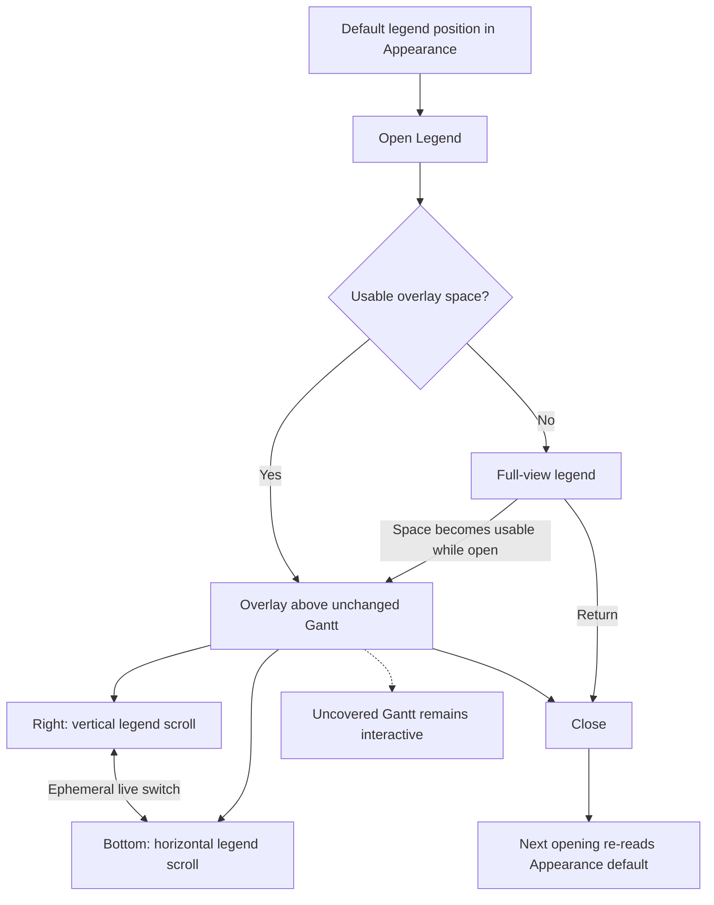
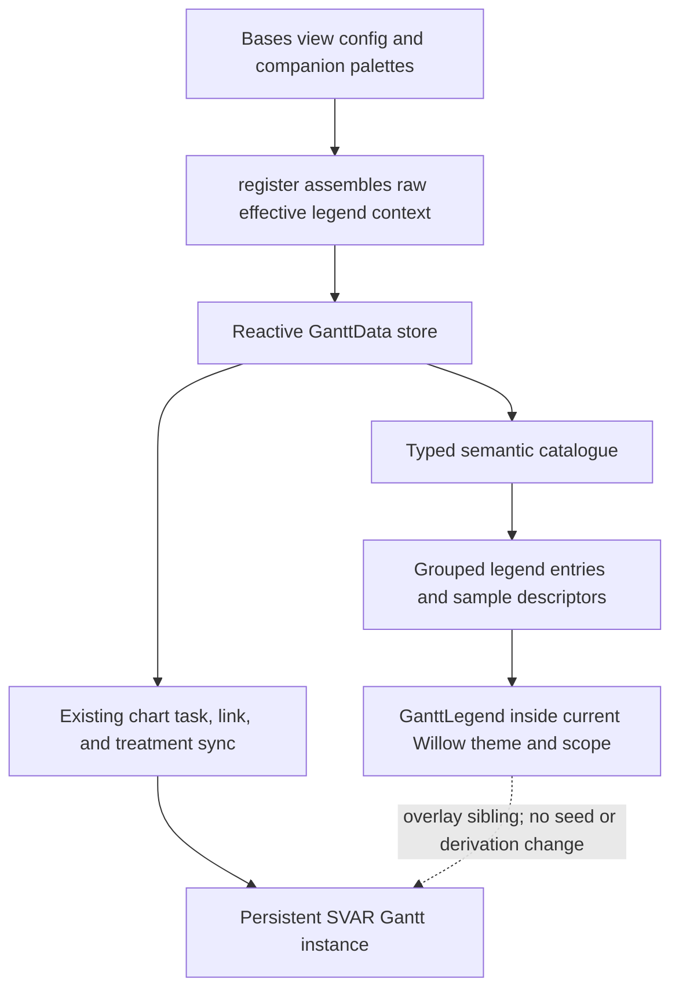
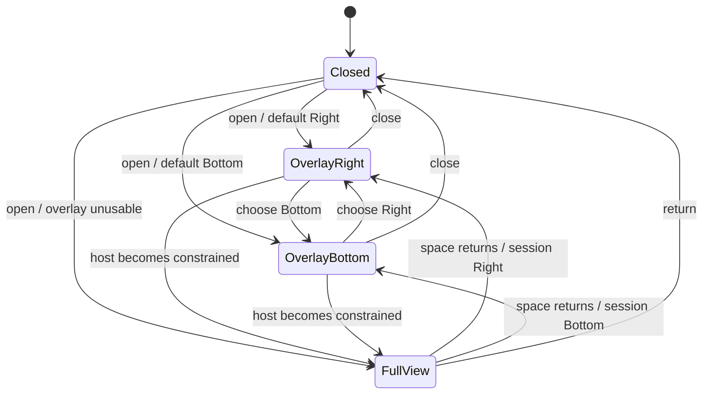

# Context-Aware Gantt Legend - Plan

## Goal Capsule

- **Objective:** Let users decode the visual semantics of the Gantt they are viewing without memorising colors, patterns, lines, segments, or decorations and without abandoning chart interaction.
- **Product authority:** The confirmed Product Contract below defines behavior and scope; the active Gantt's effective visual output is the authority for legend content and appearance.
- **Execution profile:** Implement test-first in dependency order, with Jest for pure policy and catalogue behavior and focused WebdriverIO coverage against real Obsidian for rendered behavior.
- **Stop conditions:** Stop if faithful samples require remounting or re-deriving the Gantt, if an applicable semantic cannot be represented from effective view inputs, or if the panel cannot preserve chart state and uncovered-chart interaction.
- **Tail ownership:** The implementing workflow owns code, tests, verified documentation media, review fixes, and repository-standard landing work.
- **Current implementation status:** U1–U4 are already implemented on the active feature branch. U5 is the corrective increment in this revision; it must preserve the shipped overlay, settings, and chart behavior.
- **Open blockers:** None.

---

## Product Contract

### Summary

Add a context-aware legend that opens from the current Gantt and explains its effective visual language.
The legend overlays the chart, switches live between right and bottom positions, owns its overflow, and becomes a full-view reference when space is too constrained for a usable overlay.
Each opening starts from the Default legend position selected in the view's Appearance settings; position changes made inside the open legend are ephemeral.
For calendar availability, the legend explains the active Estimate meaning separately from the active Non-working-day rendering.

### Problem Frame

Opening a Gantt currently presents many simultaneous visual meanings: colors from different sources, filled and outlined shapes, several hatch or line patterns, split and extended spans, occurrence states, dependency treatments, and small override decorations.
The distinctions are too numerous and too similar for users to remember reliably.
The recurring task is not learning the vocabulary once; it is checking what the symbols mean every time a Gantt opens.

A generic help page would still make the user reconcile documentation with the current view's configuration, theme, and available palettes.
The explanation must match what the user sees in the specific Gantt that opened it.

### Key Decisions

- **Overlay rather than reflow.** (session-settled: user-directed — chosen over squeezing the Gantt: preserve the chart's geometry and interaction state while the legend is open.) Governs R7, R8, R13.
- **Live position switching.** (session-settled: user-directed — chosen over a fixed legend position: users need to adapt the open legend to each embed.) Governs R9.
- **Panel-owned overflow.** (session-settled: user-directed — chosen over growing beyond the embed: every entry remains reachable without moving the Gantt.) Governs R10.
- **Appearance owns the default position.** (session-settled: user-directed — chosen over persisting position changes made inside the legend: only the view's Appearance settings define how future legend openings start.) Governs R9, R11, R12.
- **Configuration-complete content is the baseline.** Explain everything the active configuration can produce; exact present-on-screen filtering is optional. Governs R2, R14.
- **The legend is explanatory.** It describes the current visual language without becoming another style editor or task filter. Governs R6, R16.
- **Estimate meaning and non-working rendering stay independent.** (session-settled: user-approved — chosen over using split bars as evidence of working-day estimation: the settings are orthogonal and every active combination must remain explainable.) Governs R18, R19, R20.

### Requirements

#### Entry and context

- R1. Every Gantt provides a discoverable Legend control regardless of whether its optional toolbar is enabled.
- R2. Opening the control binds the legend to that Gantt's effective configuration, theme, palettes, and enabled visual features.
- R3. The legend covers every plugin-controlled semantic that can appear under the active configuration, including bar treatments, date and progress cues, dependency and calendar treatments, split or extended spans, occurrence states, repeated or contextual task cues, and override decorations.
- R4. Legend samples use the effective colors, contrast, patterns, shapes, and theme of the opening Gantt and update in place when those effective values change.
- R5. A split-task entry shows more than one segment and its meaningful gap; a Split non-working-day entry shows working segments separated by non-working time.
- R6. Every visual sample is paired with concise text naming both the symbol and what it means in the current Gantt.

#### Overlay behavior

- R7. On a layout with usable overlay space, the legend opens above the unchanged Gantt without resizing or reflowing the chart.
- R8. The overlay has no scrim, captures input only within its bounds, and leaves the uncovered Gantt interactive while the legend remains open.
- R9. The open legend offers Right and Bottom positions and moves between them immediately without closing; this choice lasts only for the current opening.
- R10. Right-position overflow scrolls vertically and Bottom-position overflow scrolls horizontally while the legend header, close action, and position control remain available.
- R11. The Appearance group provides a Default legend position setting with Right and Bottom values; an unset or invalid value resolves to Right, and every new legend opening starts from the current setting.
- R12. When available space cannot support a usable overlay, the legend replaces the Gantt view without changing the configured or current-session position and provides a clear return action.
- R13. Opening, closing, repositioning, scrolling, resizing through overlay and full-view modes, or returning from the legend preserves the Gantt's zoom, scroll, expansion, and selection state.

#### Coverage and accessibility

- R14. The required baseline lists every semantic the active configuration can produce even when the system cannot cheaply determine which examples are present in the current rendered rows.
- R15. The Legend control, position control, close or return action, entries, and overflow regions are keyboard reachable with visible focus and appropriate accessible names.
- R16. The legend does not change chart styling, configuration, task visibility, or task data.
- R17. Any future plugin-controlled Gantt semantic must have a legend explanation whenever it is applicable to the active configuration.
- R18. The estimate entry names the active Estimate meaning and states whether non-working time counts toward the estimate.
- R19. A separate rendering entry names the active Non-working-day rendering and explains either split pieces or background shading without implying an estimate meaning.
- R20. The estimate-override entry identifies the task's opposite estimate meaning relative to the current view default.

### Layout Model

### Key Flows

- F1. Open and check a symbol
  - **Trigger:** A user encounters an unfamiliar visual treatment in a Gantt.
  - **Steps:** The user opens Legend; the panel reflects the current view; the user matches the chart symbol to its sample and explanation.
  - **Outcome:** The user understands the symbol without leaving or reconfiguring the Gantt.
  - **Covered by:** R1–R8, R14.

- F2. Reposition within an embed
  - **Trigger:** The open overlay covers the part of the Gantt the user needs to inspect.
  - **Steps:** The user switches Right to Bottom or Bottom to Right; the panel moves immediately; the user continues interacting with the uncovered chart.
  - **Outcome:** The legend and relevant chart area remain usable together for the current opening; the next opening starts from the Appearance default.
  - **Covered by:** R8–R11, R13.

- F3. Follow live appearance changes
  - **Trigger:** The active theme or a view appearance choice changes while the legend is open.
  - **Steps:** The Gantt updates; the legend refreshes its samples and descriptions against the same effective values.
  - **Outcome:** The legend continues to explain the chart now visible.
  - **Covered by:** R2–R4, R17.

- F4. Use the legend in constrained space
  - **Trigger:** The Gantt embed cannot fit a usable overlay.
  - **Steps:** Legend opens as the full view; the user scrolls through its entries; the return action restores the chart.
  - **Outcome:** Every explanation remains reachable without losing chart state or changing the position used by the current or next opening.
  - **Covered by:** R12, R13, R15.

### Acceptance Examples

- AE1. Context-faithful treatments
  - **Covers R2, R3, R4, R6.**
  - **Given:** A dark Gantt configured with calendar fill, priority strip, and status icon.
  - **When:** The user opens Legend.
  - **Then:** The primary task-bar sample combines that view's calendar fill, priority strip, status icon, and effective dark-theme contrast, with text naming all three channels.

- AE2. Meaningful split example
  - **Covers R5.**
  - **Given:** Split working-time rendering is enabled.
  - **When:** The legend lists the split semantic.
  - **Then:** Its sample contains at least two painted segments and the intervening non-working-time treatment rather than a single isolated segment.

- AE3. Right-side overflow
  - **Covers R8, R10.**
  - **Given:** The right overlay is taller than a limited-height Gantt embed.
  - **When:** The user scrolls inside the legend.
  - **Then:** The entries move vertically, the legend controls remain available, and the Gantt behind it does not scroll.

- AE4. Bottom overflow
  - **Covers R8, R10.**
  - **Given:** The bottom overlay's legend groups are wider than the embed.
  - **When:** The user scrolls inside the legend.
  - **Then:** The legend content moves horizontally, its controls remain available, and the Gantt behind it does not move.

- AE5. Ephemeral live position change
  - **Covers R9, R11, R13.**
  - **Given:** Default legend position is Right, the legend is open on the right, and the Gantt has a non-default zoom, scroll position, expansion state, and selection.
  - **When:** The user selects Bottom, closes the legend, and opens it again.
  - **Then:** The first panel moves to the bottom immediately without changing chart state, and the new opening starts on the right.

- AE6. Constrained-layout fallback
  - **Covers R12, R13.**
  - **Given:** Available space is too small for a usable right or bottom overlay.
  - **When:** The user opens Legend and later activates the return action.
  - **Then:** The legend temporarily occupies the view and the Gantt returns with its prior state and position preference intact.

- AE7. No usage scan available
  - **Covers R14.**
  - **Given:** The active configuration can produce a semantic that is not present in the currently rendered task rows.
  - **When:** Exact present-on-screen detection is unavailable or disabled.
  - **Then:** The legend still lists and explains that configured semantic.

- AE8. Live theme change
  - **Covers R4.**
  - **Given:** The Gantt follows the Obsidian theme and its legend is open.
  - **When:** Obsidian changes from light to dark.
  - **Then:** The chart and legend samples both adopt the effective dark appearance without closing the legend.

- AE9. Keyboard-only use
  - **Covers R15.**
  - **Given:** A user operates the Gantt without a pointer.
  - **When:** They open Legend, change its position, scroll its content, and close or return from it.
  - **Then:** Each action is reachable in a logical focus order with visible focus and an accessible name.

- AE10. Toolbar-independent entry
  - **Covers R1.**
  - **Given:** A Gantt view has its optional toolbar disabled.
  - **When:** The user opens that Gantt.
  - **Then:** A discoverable Legend control remains available from the view.

- AE11. Future semantic coverage
  - **Covers R2, R3, R4, R17.**
  - **Given:** A new plugin-controlled visual semantic is available and enabled for a Gantt.
  - **When:** The user opens Legend.
  - **Then:** The legend includes a faithful sample and explanation for the new semantic; a view where it is not applicable omits it.

- AE12. Independent calendar axes
  - **Covers R2, R3, R6, R18, R19, R20.**
  - **Given:** A Gantt uses Calendar days with Split segments.
  - **When:** The user opens Legend, then changes only Estimate meaning, and later changes only Non-working-day rendering.
  - **Then:** The estimate and override explanations change only with Estimate meaning, while the rendering explanation and sample change only with Non-working-day rendering.

### Success Criteria

- A user can identify an unfamiliar Gantt symbol from the open legend without opening view settings or external documentation.
- The same configured Gantt produces matching chart and legend treatments in light and dark themes.
- Legend interaction never changes the Gantt's data or live interaction state.

### Scope Boundaries

#### Deferred to Follow-Up Work

- Exact present-on-screen filtering may be added later when it is cheap and reliable; this plan implements the configuration-complete baseline governed by R14.

#### Out of scope

- Legend-driven editing or filtering per R16.
- Persisting Right or Bottom from the in-legend position control.
- Redesigning the Gantt's existing visual vocabulary as part of the legend work.
- Changing estimate derivation, working-time stretching, split or shaded production rendering, date writes, or the existing view-option choices.
- A global static legend or documentation page detached from the Gantt that opened it.
- Free-floating, draggable, or arbitrarily resizable legend windows beyond the Right, Bottom, and constrained full-view positions.

### Dependencies and Assumptions

- The active Gantt can supply its effective view options, palettes, enabled features, and theme to a presentation-only consumer.
- Existing rendering behavior remains the authority; the legend must not maintain a contradictory visual vocabulary.
- The semantic inventory spans treatment channels, date and progress cues, dependency links, calendar shading and markers, ghost runs, occurrence states, series spines, replicated and context cues, and the estimate-meaning override dot.

### Sources and Research

| Source | Relevance |
|---|---|
| `src/bases/viewOptions.ts` | Current Appearance options and pure per-view readers; owner of the new default-position setting. |
| `src/bases/themeResolver.ts`, `src/bases/GanttToolbar.svelte`, `src/bases/GanttContainer.svelte` | Effective Willow/WillowDark behavior, optional toolbar, floating-control precedent, overlay host, and persistent SVAR composition. |
| `src/bases/BarContent.svelte`, `src/bases/barTreatment.ts`, `src/render/segmentLayout.ts` | Production bar markup, treatment CSS, icon resolution, multi-piece rendering, occurrence states, series spine, and override decoration. |
| `src/bases/calendarShading.ts`, `src/bases/markerOverlay.ts`, `src/bases/ganttSync.ts` | Calendar shading and conflict cues, marker presentation, task/link shaping, and instance-cue classes. |
| `docs/solutions/architecture-patterns/view-display-options-in-presentation-not-derivation.md` | Requires display-only state to stay out of task derivation. |
| `docs/solutions/integration-issues/svar-gantt-diff-sync-interactions.md` | Explains why the mounted SVAR instance must survive presentation changes. |
| `docs/solutions/integration-issues/gantt-theme-toggle-bases-refresh-loop.md` | Warns against configuration writes from refresh/reassert paths. |
| `docs/solutions/conventions/svar-gantt-bar-geometry-and-fill-conventions.md` | Requires fixed representative legend geometry and shared CSS custom-property paint. |
| `docs/solutions/integration-issues/svar-gantt-injected-css-scoped-specificity.md` | Requires production styling hooks instead of approximate parallel colors. |
| `docs/plans/2026-07-22-003-feat-independent-treatment-channels-plan.md` | Independent fill, strip, and icon vocabulary. |
| `docs/plans/2026-07-23-002-feat-estimate-meaning-and-rendering-plan.md` | Split rendering and the estimate-meaning override indicator. |
| `docs/plans/2026-08-03-001-feat-calendar-view-union-plan.md` | Occurrence-state and calendar display vocabulary. |
| `docs/plans/2026-06-17-002-feat-gantt-status-coloring-plan.md`, `docs/backlog.md` | Earlier parked status-legend/filter scope; this plan owns the broader context-aware explanatory legend only. |

---

## Planning Contract

**Product Contract preservation:** changed: Key Decisions, R11, Layout Model, F2, AE5, and related scope text record the Appearance-owned default and ephemeral in-legend switching. This revision adds the independent-axis Key Decision, R18–R20, AE12, and the corresponding scope boundary; all earlier R/A/F/AE meanings and IDs remain unchanged.

### Key Technical Decisions

- KTD1. **Keep the legend beside the mounted SVAR instance.** (session-settled: user-directed — chosen over squeezing or remounting the Gantt: R7, R8, and R13 require unchanged geometry and live state.) `GanttContainer` owns open state and renders the legend as an absolutely positioned presentation sibling inside the existing themed chart area; legend state never enters controller derivation or the SVAR seed/diff-sync path.
- KTD2. **Read the opening position from a normal Appearance option.** (session-settled: user-directed — chosen over persisting position changes inside the legend: only view settings define future openings.) Add a reactive `right | bottom` default to the view data path for R9 and R11. Each open copies the latest default into local session state; live switching changes only that local state, and a setting change made while the legend is open applies on the next open.
- KTD3. **Resolve responsive presentation from host size without rewriting preference.** A pure layout policy maps current-session position plus measured chart-area width and height to `right`, `bottom`, or `full`. Named minimum-usable dimensions keep the header and one meaningful sample reachable; full mode is a transient override, and returning space restores the current-session position.
- KTD4. **Drive content from an exhaustive semantic catalogue.** A typed catalogue owns semantic identity, applicability, group, concise explanation, and sample kind. The builder receives raw effective options and palettes, emits every semantic the active configuration can produce, and deliberately does not scan rendered rows in this version.
- KTD5. **Reuse production styling inputs and fixed representative geometry.** Samples render production-like class hooks inside the same per-view scope and Willow/WillowDark wrapper, consuming current treatment CSS, theme variables, palettes, and inherited paint custom properties. Split, ghost, occupancy, hatch, and spine samples use fixed legend geometry so their meaning never depends on the chart's current zoom.
- KTD6. **Keep overlay input and overflow contained.** The full overlay wrapper ignores pointer input while the visible panel accepts it; the right and bottom scroll regions use axis-specific overflow and scroll containment. Full mode uses an opaque panel and makes the covered chart subtree inactive and hidden from assistive technology without destroying it.
- KTD7. **Use non-modal focus behavior for overlays and return focus on exit.** Opening focuses the panel's first control, position choices form a labelled radio group, scroll regions are keyboard focusable, and close or return restores focus to Legend. Overlay mode does not trap focus because the uncovered chart remains interactive; full mode excludes the covered chart from focus until return.
- KTD8. **Extend the always-visible floating control surface.** The Legend entry joins the existing chart-level controls rather than the optional toolbar, satisfying R1 and R10 without making toolbar visibility a prerequisite. The open panel's header owns close/return and position controls.
- KTD9. **Carry both resolved calendar axes into the legend catalogue.** (session-settled: user-approved — chosen over inferring Estimate meaning from split or shaded presentation: the settings are independent and the legend must read each authoritative value.) `register` supplies the existing resolved Estimate meaning and Non-working-day rendering through `GanttLegendContext`; no calendar derivation or production rendering path changes.
- KTD10. **Resolve contextual copy in the pure catalogue builder.** (session-settled: user-approved — chosen over branching in the Svelte renderer or retaining misleading extension/split identities: one presentation seam keeps copy and samples consistent.) Rename the two internal semantic identities around Estimate meaning and Non-working-day rendering, keep `GanttLegend` data-driven, and reuse the current continuous-or-piece sample machinery.

### Assumptions

- The existing legend fixture can switch both calendar axes and restore its committed defaults without a new fixture or production hook.
- A pure four-combination matrix plus one real-Obsidian wiring journey provides stronger and faster evidence than duplicating the same copy assertions across four end-to-end cases.

### High-Level Technical Design

The implementation adds a presentation-only catalogue and panel around the persistent Gantt. The controller continues to own task derivation, while `register` supplies raw effective view facts through the existing reactive data store.

Legend lifecycle and responsive mode are separate from the persisted default:

### Sequencing

1. Establish the view option, local session-state policy, and size-to-mode resolver.
2. Establish the exhaustive context-to-entry catalogue and faithful sample descriptors.
3. Compose the accessible Svelte panel around the existing Gantt and verify it in real Obsidian.
4. Correct the calendar-axis explanations at the existing context-to-catalogue seam and verify their independence.
5. Capture verified documentation media from the final corrected legend after behavior and themes pass their gates.

### Deferred Implementation Notes

- Calibrate the named minimum-usable dimensions against the dedicated real-Obsidian fixture. Tuning the constants is allowed; changing the right/bottom/full policy is not.
- Keep transition styling minimal until overflow, pointer routing, and focus behavior are proven. Animation is not an acceptance boundary.

### Alternative Approaches Considered

- **Render a second miniature SVAR Gantt inside the legend:** rejected because it duplicates store/runtime cost, couples samples to zoom and date math, and creates another stateful Gantt instance.
- **Clone or inspect visible chart DOM:** rejected because virtualization makes it incomplete, it cannot explain configured-but-absent semantics, and it would bind the catalogue to unstable internal markup.
- **Create independent sample CSS:** rejected because user palettes, generated treatment specificity, custom properties, and theme variables would drift from production rendering.
- **Use a static global help page:** rejected because it cannot explain the active view's effective configuration or remain visible beside the Gantt.

### System-Wide Impact

- **Data and controller:** No task, dependency, calendar, or datasource mutation. The task-instance array and controller derivation remain unchanged.
- **View configuration:** One persisted Appearance option is added. The in-panel switch never calls `config.set`.
- **Rendering lifecycle:** The existing Gantt remains mounted across legend actions and constrained-mode changes. Theme changes keep using Willow/WillowDark.
- **Maintenance:** New plugin-controlled semantics must add or update a catalogue entry and its coverage test as part of the same change.
- **Packaging:** New Svelte and TypeScript modules remain inside the existing single-file plugin bundle; no dependency or deployment change is required.

### Risks and Mitigations

| Risk | Impact | Mitigation |
|---|---|---|
| Catalogue and production visuals drift | The legend teaches the wrong meaning. | Reuse production classes, variables, palette resolvers, and typed semantic IDs; require catalogue coverage with each new semantic. |
| Overlay intercepts chart input or scroll chains into it | The uncovered Gantt is not safely interactive. | Use pointer-transparent wrapper, panel-only input, axis-specific overflow, `overscroll-behavior: contain`, and real pointer/scroll assertions. |
| Full mode destroys or focuses covered chart state | Return loses interaction state or exposes hidden controls. | Keep the Gantt mounted, make the covered subtree inactive, restore focus on return, and assert zoom/scroll/expansion/selection before and after. |
| Theme change while open produces stale or low-contrast samples | Legend and chart disagree. | Render under the existing effective Willow theme and treatment scope; verify computed samples in light and dark. |
| Host-size transitions oscillate or overwrite user choice | Embedded views feel unstable. | Derive mode from an absolute overlay that does not affect host measurement; retain session position separately from responsive mode and persisted default. |
| New Appearance setting accidentally becomes writable from the panel | Ephemeral switching starts persisting. | Expose the setting only through `GanttData`; do not pass a legend persistence callback, and test close/reopen reset behavior. |
| Estimate meaning is inferred from split or shaded rendering | The legend teaches the wrong estimate semantics for two valid setting combinations. | Carry both resolved axes independently, test the four-combination matrix, and keep scheduling and production rendering outside the diff. |

---

## Implementation Units

### U1. Add default-position and responsive-layout policy

- **Goal:** Add the Appearance-owned default and pure state policy that resolves each opening and responsive presentation without persisting panel choices.
- **Requirements:** R7, R9, R11, R12; F2, F4; AE5, AE6.
- **Dependencies:** None.
- **Files:**
  - `src/bases/viewOptions.ts`
  - `src/bases/legendLayout.ts` (new)
  - `src/bases/types/gantt-view-data.ts`
  - `src/bases/register.ts`
  - `test/unit/viewOptions.test.ts`
  - `test/unit/legendLayout.test.ts` (new)
- **Approach:**
  1. Add `Default legend position` to Appearance with `Right` and `Bottom`, defaulting invalid or absent values to Right.
  2. Carry the effective default through the existing reactive view-data assembly so a settings change requires no Gantt remount.
  3. Model closed/open session position separately from responsive presentation mode. Opening copies the latest setting; switching updates only the open session; closing discards it.
  4. Resolve `right`, `bottom`, or `full` from current-session position and measured host dimensions. Full mode never becomes a persisted value.
- **Execution note:** Implement the option reader and layout/session reducer test-first before introducing DOM measurement.
- **Patterns to follow:** `readShowToolbar` and other pure readers in `src/bases/viewOptions.ts`; reactive `GanttData` fields in `src/bases/types/gantt-view-data.ts`; presentation-only state guidance in `docs/solutions/architecture-patterns/view-display-options-in-presentation-not-derivation.md`.
- **Test scenarios:**
  - An absent, invalid, Right, and Bottom stored value resolves to the expected Appearance default.
  - The Appearance group exposes the new dropdown with Right as its default and no Full value.
  - Covers AE5. Opening with default Right, switching to Bottom, closing, and reopening produces Right again without a persistence effect.
  - A settings change while open leaves the current session position unchanged and seeds the next opening with the new default.
  - A usable host resolves to the current-session Right or Bottom mode; a constrained host resolves to Full without changing either session position or default.
  - Covers AE6. A Full session returns to the same current-session position when space becomes usable and closes without modifying the default.
- **Verification:** The pure option and layout tests prove every state transition, and view-data assembly exposes only the default value with no panel write callback.

### U2. Build the context-aware semantic catalogue

- **Goal:** Produce grouped, exhaustive legend entries and faithful sample descriptors from the active Gantt's raw effective configuration.
- **Requirements:** R2–R6, R14, R16, R17; F1, F3; AE1, AE2, AE7, AE11.
- **Dependencies:** U1.
- **Files:**
  - `src/bases/legendCatalog.ts` (new)
  - `src/bases/types/gantt-view-data.ts`
  - `src/bases/register.ts`
  - `test/unit/legendCatalog.test.ts` (new)
- **Approach:**
  1. Define typed semantic IDs and grouped catalogue entries for active treatment channels and palettes, task/date/progress cues, dependencies, calendar shading and markers, ghost runs, occurrence states, series spine, replicated/context cues, and the estimate-meaning override dot.
  2. Supply raw effective sources, palettes, enabled feature flags, and current applicability from `register`; keep labels and explanation formatting in the presentation-side catalogue.
  3. Emit all semantics the configuration can produce even when no rendered row currently uses one. Omit semantics that cannot apply to the active configuration or integration.
  4. Represent composite samples with fixed normalized pieces and explicit gaps. Use production class tokens and inherited paint variables instead of invoking live segment geometry.
  5. Make the semantic ID set exhaustive so adding a new plugin-controlled semantic requires an intentional catalogue decision and test update.
- **Execution note:** Start with failing catalogue tests for the composite dark-theme example, split geometry, configuration-complete fallback, and semantic exhaustiveness.
- **Patterns to follow:** Pure resolver structure in `src/bases/barTreatment.ts`; raw-data/view-format boundary in `src/bases/types/gantt-view-data.ts`; composite-paint guidance in `docs/solutions/conventions/svar-gantt-bar-geometry-and-fill-conventions.md`.
- **Test scenarios:**
  - Covers AE1. Calendar fill, priority strip, and status icon produce a composite task sample carrying the current calendar, priority, and status palette inputs and all three channel explanations.
  - Covers AE2. Split non-working-time and occupancy examples contain multiple painted pieces plus a meaningful non-working interval or occurrence gap.
  - Status and priority icon samples distinguish configured glyphs, priority dots, completed discs, and non-completed rings using the effective palette.
  - Calendar availability includes active shading, conflict, marker, and working-time semantics without inventing inactive calendar behavior.
  - Occurrence entries distinguish next, projected, completed, skipped, materialized, external, and coarse series-spine treatments when their family is enabled.
  - Covers AE7. A semantic enabled by configuration remains in the catalogue when no current instance uses it.
  - Standalone and companion-backed Gantts omit semantics that cannot apply to their active integration while retaining core chart semantics.
  - Covers AE11. Every typed plugin semantic has an applicability rule, explanation, and sample descriptor; an unhandled semantic fails the exhaustive test.
- **Verification:** The catalogue tests prove content, applicability, palette threading, representative geometry, and future-semantic coverage without Svelte or Obsidian dependencies.

### U3. Compose the accessible overlay and full-view legend

- **Goal:** Render the always-available, theme-faithful legend with live ephemeral positioning, contained overflow, responsive full view, and preserved chart state.
- **Requirements:** R1–R16; F1–F4; AE1, AE3–AE6, AE8–AE10.
- **Dependencies:** U1, U2.
- **Files:**
  - `src/bases/GanttLegend.svelte` (new)
  - `src/bases/GanttContainer.svelte`
  - `test/specs/gantt-legend.e2e.ts` (new)
  - `test/vaults/gantt-legend/` (new fixture)
- **Approach:**
  1. Add a labelled Legend button to the existing always-visible floating view-control area and render the new component inside the chart's current Willow/WillowDark and per-view treatment scope.
  2. Observe the chart-area dimensions and feed them to U1's pure resolver. Do not change the chart area's computed height or seed props.
  3. Render a pointer-transparent overlay layer whose right or bottom panel alone accepts input. Keep header controls outside the scrolling body; contain right overflow vertically and bottom overflow horizontally.
  4. Render full mode as an opaque inset panel over the still-mounted Gantt. Make the covered chart inactive and unavailable to assistive technology until Return.
  5. Use production-like bar, piece, hatch, marker, link, and decoration class hooks inside sample frames so generated treatment CSS and theme variables paint both the chart and legend.
  6. On open, focus the first panel control; provide a labelled Right/Bottom radio group, focusable scroll region, Escape close behavior that does not also exit maximize, and focus restoration to the Legend trigger.
- **Execution note:** Write the focused real-Obsidian spec before completing panel behavior; `GanttContainer` integration and SVAR state preservation are not sufficiently proven by DOM-free tests.
- **Patterns to follow:** Always-visible maximize control in `src/bases/GanttContainer.svelte`; Obsidian-variable toolbar chrome in `src/bases/GanttToolbar.svelte`; current Willow/WillowDark wrapper and treatment scope; focused fixture pattern in `test/specs/gantt-theme-toolbar.e2e.ts` and `test/specs/gantt-viewport-sizing.e2e.ts`.
- **Test scenarios:**
  - Covers AE10. With the optional toolbar disabled, the labelled Legend control is present and opens the panel.
  - Covers AE1. A dark configured fixture renders composite sample classes and computed colors that match the active chart treatment channels.
  - Covers AE3. A limited-height right panel has vertical overflow, retains its header controls, contains wheel/keyboard scrolling, and leaves chart scroll offsets unchanged.
  - Covers AE4. A bottom panel lays groups horizontally, has horizontal overflow, retains its header controls, and leaves chart scroll offsets unchanged.
  - Covers AE5. Switching Right to Bottom moves the open panel without changing zoom, chart scroll, expansion, or selection; close and reopen restores the Appearance default.
  - An uncovered bar remains selectable while the overlay is open, while clicks on the panel do not activate or drag chart content beneath it.
  - Covers AE6. A constrained viewport renders full mode over an inert but still-mounted chart; Return restores the same chart DOM instance and its interaction state.
  - Covers AE8. Changing the effective theme while open repaints chart and legend samples together without closing the panel or losing session position.
  - Covers AE9. Keyboard-only use opens the legend, changes position, scrolls the applicable region, closes or returns, shows visible focus, and restores focus to the trigger.
  - Escape closes the legend before any maximize Escape handler and does not close an unrelated Obsidian modal.
- **Verification:** The focused WebdriverIO spec passes through `npm run e2e:local` against the built plugin in real Obsidian, and affected theme, fullscreen, viewport, bar-treatment, and calendar-axis regression specs remain green.

### U4. Document the verified legend

- **Goal:** Make the shipped control discoverable in project documentation and preserve verified right and bottom examples.
- **Requirements:** R1, R9, R10, R11.
- **Dependencies:** U3, U5.
- **Files:**
  - `README.md`
  - `docs/media/gantt-legend-right.png` (new)
  - `docs/media/gantt-legend-bottom.png` (new)
- **Approach:**
  1. Add concise README guidance for opening the legend, changing its ephemeral position, and setting the future-opening default under Appearance.
  2. Capture the right and bottom states from the verified real-Obsidian fixture using the repository's maximize and theme staging conventions.
  3. Reference committed media through pinned `raw.githubusercontent` URLs.
- **Patterns to follow:** `docs/conventions/visual-assets.md` and existing feature media references in `README.md`.
- **Test scenarios:** Test expectation: none — documentation and verified visual assets do not change runtime behavior.
- **Verification:** README wording agrees with R9–R11, media files render at their referenced URLs after publication, and screenshots depict the implemented UI rather than the disposable brainstorm sketch.

### U5. Separate estimate meaning from non-working rendering in the legend

- **Goal:** Make the legend explain the active estimate semantics, active non-working-time presentation, and per-task override direction as three context-aware concepts.
- **Requirements:** R2, R3, R6, R16–R20; F1, F3; AE7, AE11, AE12; KTD9, KTD10.
- **Dependencies:** U2, U3.
- **Files:**
  - `src/bases/types/gantt-view-data.ts`
  - `src/bases/register.ts`
  - `src/bases/visualSemantics.ts`
  - `src/bases/legendCatalog.ts`
  - `src/bases/GanttLegend.svelte`
  - `test/unit/legendCatalog.test.ts`
  - `test/specs/gantt-legend.e2e.ts`
  - `test/vaults/gantt-legend/Legend.base` (only if the existing fixture cannot switch and restore both axes without modification)
  - `CONCEPTS.md`
- **Approach:**
  1. Add the resolved Estimate meaning to `GanttLegendContext` beside the existing Non-working-day rendering value, using the same view-option reader that supplies production behavior.
  2. Search every consumer of the current extension/split semantic IDs before renaming. Rename internal symbols and presentation-only helpers, update owned test selectors, and keep any persisted key or externally supported CSS/DOM contract stable.
  3. Resolve entry names and explanations in the catalogue builder using this approved visible copy:

     | Active context | Entry name | Explanation |
     |---|---|---|
     | Calendar-day estimate | Calendar-day estimate | The bar keeps its elapsed span through non-working time because both working and non-working time count toward the estimate. |
     | Working-day estimate | Working-day estimate | Non-working time does not count toward the estimate, so an inferred edge extends until the required working time fits. |
     | Split non-working time | Split non-working time | Solid runs are working time; the translucent run between them is non-working time. |
     | Shaded non-working time | Shaded non-working time | The bar remains continuous while background shading marks non-working time. |
     | Working-day override | Estimate override | A corner dot means this task uses a working-day estimate instead of the view's calendar-day estimate. |
     | Calendar-day override | Estimate override | A corner dot means this task uses a calendar-day estimate instead of the view's working-day estimate. |

  4. Give the Estimate meaning entry fixed representative geometry selected only by `estimateMeaning`. Give the Non-working-day rendering entry exclusive ownership of the existing split-pieces or continuous-over-shading sample. Each entry's copy and sample must remain invariant when only the other axis changes.
  5. Confirm the existing legend fixture can switch both calendar axes and restore its committed defaults before writing the real-Obsidian journey. Modify the fixture only if that check proves necessary.
  6. Replace the stale Calendar mode glossary entry with the two independent concepts and update Ghost run wording to match interpretation-neutral split rendering.
- **Execution note:** Start with the four-combination catalogue matrix. Run the focused real-Obsidian journey only after the pure semantics are green.
- **Patterns to follow:** `readEstimateMeaning` and `readNonWorkingRendering` in `src/bases/viewOptions.ts`; reactive legend context assembly in `src/bases/register.ts`; pure entry construction in `src/bases/legendCatalog.ts`; `docs/solutions/architecture-patterns/resolve-config-defaults-at-one-seam.md`; `docs/solutions/tooling-decisions/test-at-the-fastest-level-not-redundant-e2e.md`.
- **Test scenarios:**
  - Covers AE12. Calendar days plus Split segments names a calendar-day estimate whose elapsed span includes working and non-working time, while the separate rendering entry explains split pieces.
  - Covers AE12. Working days plus Split segments changes the estimate and inverse-override explanations without changing the rendering explanation or sample.
  - Covers AE12. Calendar days plus Shaded background changes only the rendering explanation and sample from the split case.
  - Covers AE12. Working days plus Shaded background combines the working-day estimate explanation with the continuous-bar-over-shading sample.
  - Across the four-setting matrix, the estimate entry's copy and sample remain identical when only rendering changes, and the rendering entry's copy and sample remain identical when only estimate meaning changes.
  - The calendar-day and working-day defaults produce opposite, explicit estimate-override explanations.
  - The semantic exhaustiveness test recognizes the renamed internal IDs and rejects the retired extension/split identities.
  - One real-Obsidian journey changes each fixture setting independently, observes the matching visible legend entries, and restores both committed defaults even after a failed assertion.
- **Verification:** Focused catalogue tests prove the four-setting matrix and naming. The existing legend WebdriverIO fixture proves that live view settings reach the rendered legend without changing chart dates or production bar markup.

---

## Verification Contract

| Gate | Scope | Done signal |
|---|---|---|
| `npm test -- --runInBand` | All Jest unit tests, including catalogue, layout, option, treatment, and existing view-policy suites | No failing tests; new pure branches and semantic IDs are covered. |
| `npm run typecheck` | Strict TypeScript and Svelte component contracts | No diagnostics. |
| `npm run lint` | TypeScript and Svelte repository rules | No warnings or errors. |
| `npm run build` | Production single-file plugin bundle | Build completes and bundles no new runtime dependency. |
| `npm run e2e:local -- --spec test/specs/gantt-legend.e2e.ts` | Focused real-Obsidian legend behavior | AE1, AE3–AE6, and AE8–AE10 scenarios assigned to U3 pass against the freshly built plugin, and U5's AE12 calendar-axis journey passes with both fixture defaults restored. |
| `npm run e2e:local -- --spec test/specs/gantt-theme-toolbar.e2e.ts --spec test/specs/gantt-fullscreen.e2e.ts --spec test/specs/gantt-viewport-sizing.e2e.ts --spec test/specs/gantt-bar-channels.e2e.ts --spec test/specs/gantt-calendar-axes.e2e.ts` | Affected rendering and state-preservation regressions | Existing theme, maximize, sizing, treatment, and split/calendar behavior remains green. |
| Visual inspection of committed media | Right and bottom overlays in staged real Obsidian | Samples, labels, overflow affordances, and focus-visible treatment are legible in the captured theme. |

---

## Definition of Done

- The Default legend position option appears under Appearance, defaults to Right, and is the only path that changes how future openings start.
- The Legend control remains available with the optional toolbar disabled.
- Every applicable plugin-controlled visual semantic has a concise explanation and a faithful sample driven by the active Gantt's effective configuration, palettes, and theme.
- Estimate meaning, Non-working-day rendering, and the override marker are explained independently from the active view context.
- Split-rendering samples show multiple segments and their meaningful non-working stretch; shaded-rendering samples keep the task bar continuous over background shading.
- Right and Bottom switch live only for the current opening, with vertical and horizontal panel-owned overflow respectively.
- Constrained mode covers rather than unmounts the Gantt and does not change either the current-session position or the configured default.
- Opening, moving, scrolling, resizing, closing, and returning preserve zoom, chart scroll, expansion, selection, and task data.
- Overlay mode has no scrim and leaves uncovered chart controls and bars interactive.
- Keyboard navigation, visible focus, accessible names, Escape behavior, and focus restoration pass the focused real-Obsidian scenarios.
- Jest, typecheck, lint, production build, focused WebdriverIO, and affected regression gates pass.
- README guidance and committed media describe the implemented behavior accurately.
- No abandoned experiment, duplicate sample styling system, controller mutation, or unrelated refactor remains in the final diff.
- Calendar derivation, working-time stretching, production bar rendering, and date writes remain unchanged. Existing Estimate meaning and Non-working-day rendering choices and behavior remain unchanged; the only new view-option behavior in the full feature is Default legend position.
