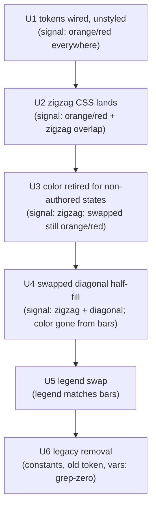
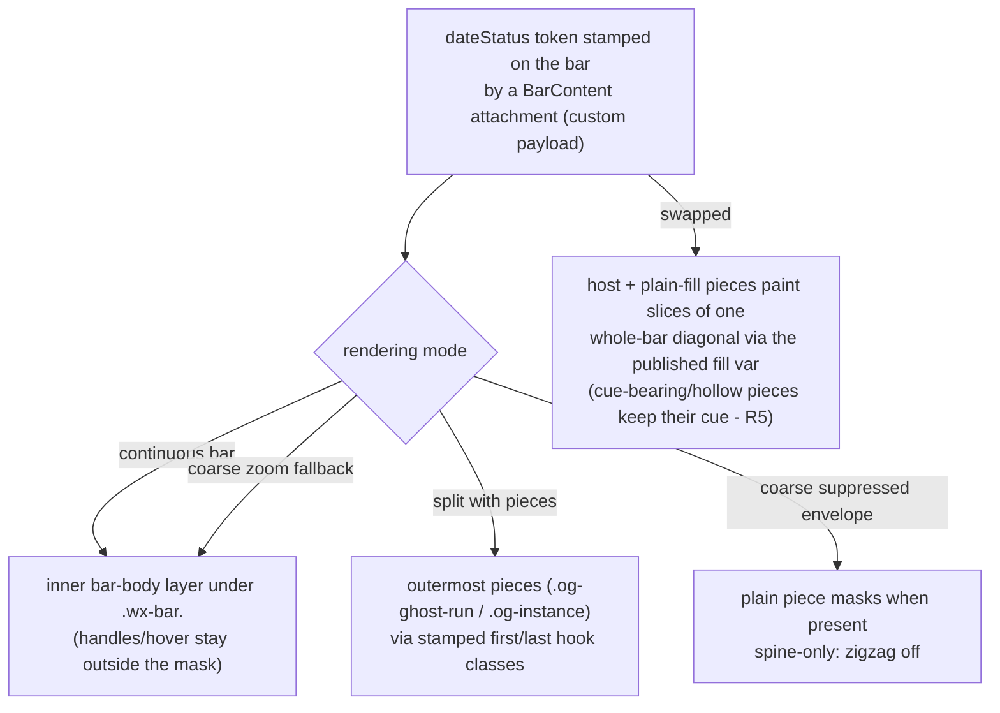

# Missing-Date Zigzag Semantics - Plan

## Goal Capsule

- **Objective:** Replace the color-based date-status treatment (orange fill + red border) with shape-based signals: a zigzag "torn" edge on the side of each non-authored date, a borderless diagonal half-fill for swapped dates, and matching legend entries.
- **Authority:** This plan. The Product Contract governs behavior; the Planning Contract governs mechanism; the Delivery Contract governs how every PR lands and is passed verbatim to every worker subagent.
- **Execution profile:** Six serial one-behavior PRs (U1→U6), additive-first. Each PR merges on gates-green (full jest + relevant e2e + CI + zero unresolved Codex comments). Self-merge on gates-green is authorized for this run.
- **Stop conditions:** Evidence that a settled decision cannot work; a gate failure not fixable within the current unit's scope; any need to widen a PR beyond its one behavior. Surface these instead of proceeding.

---

## Product Contract

Product Contract preservation: changed R5, R6, AE4 (+ added AE8) — the swapped-dates treatment was revised in-session from a small icon chip to a full-bar diagonal half-fill (user-directed). R3, R4 and R5 each gained one planning-review exception (a tooth too deep for its bar scales with it; spine-only coarse-zoom envelope drops the zigzag; occurrence-state-cued pieces keep their cue over the diagonal slice; conflict notes on the governing Key Decisions). All other requirements unchanged.

### Summary

Task bars signal a non-authored date with a zigzag edge on the corresponding side — left for a missing start, right for a missing due, both when neither is authored — cut into the bar's own shape so it works over any fill color and theme. Swapped dates render as a borderless diagonal half-fill of the bar in its own fill color, with icon chips above. The legend replaces its two date-status color entries with the new zigzag and swapped entries.

### Problem Frame

Today every non-complete date status renders the same way: a hardcoded orange fill and red border. That signal is fragile — the fill competes with the bar-treatment color channels (status, priority, theme, calendar), so other settings can override or mask it. It is also invasive: the hardcoded hues can coincide with colors users chose for their own semantics, making "this date is missing" indistinguishable from "this task is in status X". And it is blunt: one blanket treatment covers four distinct states, so the bar cannot say *which* date is missing or that the dates are merely inverted.

### Key Decisions

- **Shape over color.** (session-settled: user-directed — chosen over the hardcoded orange/red treatment: color is overridable by other settings and collides with user palettes.) Governs R2, R8.
- **One unified signal for non-authored edges.** A zigzag edge means "this edge was not authored", covering both today's missing-date fill and today's inferred-date border. (session-settled: user-approved — chosen over keeping missing and inferred visually distinct: both describe an edge the user did not author.) Governs R1.
- **Zigzag as a CSS mask carved into the bar.** The teeth are cut out of the bar's own painted body rather than drawn over it, so the signal composes with any fill. (session-settled: user-directed — chosen over overlay or border approaches: the user supplied the conic-gradient mask technique; see Sources.) The mask carrier is an inner body layer, not the host element — KTD2 — so dependency controls and hover feedback stay outside the cut. Governs R2.
- **Swapped dates render as a full-bar diagonal half-fill.** (session-settled: user-directed — chosen over a small half-filled square icon chip: no contention for the single chip slot, legible at any bar width, and icon chips render above it.) Governs R5. Conflict note from planning review: one evidence-based exception is recorded on R5 — split pieces whose rendering carries an occurrence-state cue (background-borne or hollow-interior) keep the cue instead of their diagonal slice.
- **Zigzag everywhere, including one-cell bars.** (session-settled: user-directed — chosen over a dashed-outline fallback below a width threshold: one visual language, consistent semantics.) Governs R3. Conflict note from implementation review: one evidence-based exception is recorded on R3 — a tooth too deep for its bar makes the rendered box wider than its laid-out width, so the tooth scales there. The visual language is unchanged; only its size follows the bar.
- **The signal survives Split rendering.** (session-settled: user-approved — chosen over continuous-bars-only: the missing-edge signal is semantics, not decoration.) Governs R4. Conflict note from planning review: one evidence-based exception is recorded on R4 — the spine-only coarse-zoom envelope exposes no maskable surface, so that single flavor drops the zigzag at that zoom.

The resulting state-to-treatment mapping:

| Date status | Treatment |
|---|---|
| complete | none |
| inferred-start | zigzag left edge |
| inferred-end | zigzag right edge |
| placeholder (neither date) | zigzag both edges |
| swapped (start > due) | borderless diagonal half-fill of the bar; icon chips render above; no zigzag |

### Requirements

**Bar rendering**

- R1. A bar whose start is not authored renders a zigzag left edge; a bar whose due is not authored renders a zigzag right edge; a bar with neither date renders both, per the mapping table above.
- R2. The zigzag is cut into the bar's own shape via CSS mask, so it renders identically over any fill source (status, priority, theme, calendar) in light and dark themes, with no hardcoded hue.
- R3. Teeth use an 8px vertical period (about 4px horizontal depth) at standard bar height, applied unchanged on short and one-cell bars — the treatment never switches to a different visual language below a width threshold. One planning-time exception: on a bar too narrow to carry a standard tooth, the tooth scales down with the bar rather than being forced; a fixed depth there makes the rendered bar wider than the width it was laid out at, which drags its hit area and dependency anchors out of position.
- R4. Under Split rendering, the outermost visible piece carries the zigzag on its outer edge; at zoom levels where split tiling falls back to a continuous bar, the zigzag renders on the continuous bar's edge. One planning-time exception: a fully-suppressed recurring envelope at coarse zoom renders no maskable surface (a zero-height spine only) and drops the zigzag at that zoom; every other split form keeps the signal.

**Swapped indicator**

- R5. A bar with swapped dates renders a borderless diagonal half-fill across the whole bar area — one triangle in the bar's fill color, the other transparent — with any icon chip rendered above it, and receives no zigzag. One planning-time exception: a split piece whose rendering is itself an occurrence-state cue — a cue-bearing background (state color, hatching) or a deliberately hollow outlined interior — keeps that rendering instead of its diagonal slice; the half-fill reads from the plain slices.

**Legend**

- R6. The legend's two date-status color entries are replaced by two new entries: a zigzag entry whose swatch shows teeth on both edges, meaning an edge that was not authored, and a swapped entry showing a diagonal-split swatch with its meaning.
- R7. The new entries are shown only when the view contains matching tasks and the date-status indicator option is on. The zigzag entry matches any task with a non-authored edge (inferred-start, inferred-end, placeholder); the swapped entry matches swapped tasks; presence is computed from the view's rendered instances. This gating is new mechanism — the legend does not gate entry visibility today.

**Removal and settings**

- R8. The orange-fill and red-border date-status treatment is removed entirely; no hardcoded date-status colors remain.
- R9. The existing "Show date-status indicators on bars" view option gates the zigzag edges and the swapped half-fill together; no new setting is introduced.

No Key Flows section: the change has no multi-step behavior — it restyles existing states, and the Acceptance Examples below pin the conditional cases.

### Acceptance Examples

- AE1. **Covers R1, R2, R8.** Given a task with only a due date, when indicators are on, then the bar shows a zigzag left edge over its normal fill, and no orange fill or red border anywhere.
- AE2. **Covers R1.** Given a task with only a start date, then the bar shows a zigzag right edge.
- AE3. **Covers R1.** Given a task with neither date, then the bar renders at today with zigzag on both edges.
- AE4. **Covers R5.** Given a task whose start is after its due, then the bar has no zigzag and no border, and renders a diagonal half-fill in the bar's fill color.
- AE5. **Covers R9, R7.** Given the date-status indicator option is off, then no bar shows a zigzag or diagonal half-fill and the two new legend entries are absent.
- AE6. **Covers R4.** Given Split rendering with ghost runs and a task whose due is inferred, then the outermost right piece carries the teeth on its right edge.
- AE7. **Covers R3.** Given a one-cell bar with neither date at a zoom where a standard tooth fits, then both-edge teeth are applied at the standard tooth size; at a zoom too coarse for that, the teeth scale with the bar and the bar still renders at the width it was laid out at.
- AE8. **Covers R5.** Given a swapped task that also has a status or priority icon configured, then the icon chip renders above the diagonal half-fill and both stay visible.

### Scope Boundaries

- Date derivation, date-status computation, and the inferred-drag prompt flow are untouched — this change is presentation only. E2e probes that read the old class are re-pointed to the new tokens, nothing more.
- No warning, validation, or auto-fix for swapped dates; the half-fill and its legend meaning are the whole treatment.
- No new settings and no per-view zigzag configuration (tooth size, side selection).
- Estimate meaning, working-time stretch, and ghost-run semantics are unchanged.
- Historical plans and brainstorms describing the orange/red behavior stay as-is.

### Sources / Research

- CSS zigzag-edge technique: [CSS Borders Using Masks](https://css-tricks.com/css-borders-using-masks/) (conic-gradient mask, repeat-y per edge). Chosen-treatment mock: `docs/mocks/missing-date-zigzag-options.html` (maintainer-local, gitignored — not in the repo).
- Current colors, class token, semantic ids: [src/bases/visualSemantics.ts](../../src/bases/visualSemantics.ts) (`#e67e22` fill, `#c0392b` border at lines 35-36; token `datestatus-flagged` at line 47; ids at lines 10-11).
- The five date-status states: [src/controller/datePolicy.ts](../../src/controller/datePolicy.ts) (union at lines 33-38).
- Flag assignment and task-type registration: [src/bases/ganttSync.ts](../../src/bases/ganttSync.ts) (`flagged` at 421-426; type composition 415-441; `buildTreatmentTaskTypes` 570-582 and `buildInstanceCueTaskTypes` 626-635 pre-enumerate the whole-string registry KTD1 keeps this feature out of; bare-class contract note at 50-53 — custom SVAR type ids get **no** `wx-` prefix; the pinned `.agents/skills/svar-svelte/gantt/index.md:406` claim of `.wx-task.<type>` is wrong for the installed 2.7.0, trust the codebase and e2e).
- Bar class/variable stamping from per-instance data — the channel KTD1 reuses: [src/bases/BarContent.svelte](../../src/bases/BarContent.svelte) (`markBarSplit` ~168-180 with its MutationObserver re-assertion, `markBarSplitWhen` ~187, `colorCalendarItemBar` ~192; attachments applied ~248-272).
- Bar CSS to replace: [src/bases/GanttContainer.svelte](../../src/bases/GanttContainer.svelte) (color block ~3260-3280; split carve-out ~3360-3374 whose `:not(.datestatus-flagged)` exists because the border is the only surviving cue on a transparent split host; inline var seeding ~2547; ghost-run radius ~3383-3392).
- Icon-chip mechanism: [src/bases/barTreatment.ts](../../src/bases/barTreatment.ts) (`resolveIconSpec` 844-871) rendered by [src/bases/BarContent.svelte](../../src/bases/BarContent.svelte) (~251-264; ghost pieces ~305-315, DOM order = visual order).
- Legend: [src/bases/legendCatalog.ts](../../src/bases/legendCatalog.ts) (mapped type over `GANTT_VISUAL_SEMANTIC_IDS` forces exhaustive updates; rows 155-156; `classTokensFor` 670-716; `isDateStatusSemantic`/`dateStatusSample` 347-377) and [src/bases/GanttLegend.svelte](../../src/bases/GanttLegend.svelte) (~400-429 — the legend swatch is a synthetic div, so mask CSS must be adapted for it separately).
- Institutional learnings that constrain the mechanism: [docs/solutions/integration-issues/svar-gantt-injected-css-scoped-specificity.md](../solutions/integration-issues/svar-gantt-injected-css-scoped-specificity.md), [docs/solutions/integration-issues/svar-gantt-datauri-currentcolor-glyph-invisible.md](../solutions/integration-issues/svar-gantt-datauri-currentcolor-glyph-invisible.md), [docs/solutions/conventions/svar-gantt-bar-geometry-and-fill-conventions.md](../solutions/conventions/svar-gantt-bar-geometry-and-fill-conventions.md), [docs/solutions/integration-issues/svar-shared-classname-selector-leak.md](../solutions/integration-issues/svar-shared-classname-selector-leak.md), [docs/solutions/architecture-patterns/context-aware-legends-project-orthogonal-semantics.md](../solutions/architecture-patterns/context-aware-legends-project-orthogonal-semantics.md).
- Drag prompt reads date status, not visuals: [src/bases/inferredDragGate.ts](../../src/bases/inferredDragGate.ts).

---

## Planning Contract

### Key Technical Decisions

- KTD1. **Per-state tokens ride per-instance data and are stamped by a bar attachment, not the task.type registry.** Four new class tokens (zigzag-left, zigzag-right, zigzag-both, swapped) replace the single `datestatus-flagged` flag; `ganttSync` resolves the token from `dateStatus` and publishes it on the instance's `custom` payload, and a `BarContent` attachment adds it to the host bar — reusing the established bar-attachment channel: `markBarSplit` is the class-stamping precedent, including the MutationObserver re-assertion its own contract explains (SVAR re-applies a bar's whole class list from `task.type` on `update-task`, which drops an imperatively-added class), and `colorCalendarItemBar` is the precedent for a parameterised attachment reading the `custom` payload. Chosen over composing the token into `task.type`: that channel is a pre-registered whole-string cross-product, so four tokens would multiply the registry against every treatment-class pair and instance cue (a large calendar palette reaches six figures of ids) while SVAR scans it linearly per bar. Governs the mechanism for R1 and R5.
- KTD2. **Zigzag is an alpha-only CSS mask in the view stylesheet.** Conic-gradient masks per the settled technique (see the Product Key Decision governing R2), painted with `mask`/`-webkit-mask`, never a data-URI SVG with `currentColor` (resolves in the wrong document context — see Sources learnings). Rules anchor at `.og-bases-gantt` with `!important` because SVAR's Svelte-hashed styles out-specify plain injected rules. The mask applies to an inner bar-body layer, never to `.wx-bar` itself: SVAR renders dependency link handles and link-delete controls as bar descendants positioned outside the border box, plus hover/selection feedback on the host — a host-level mask would clip them all and break dependency authoring. Consequence: the strip accent (host `::before`) is never mask-clipped, so the offset-or-mask strip treatment applies to continuous bars with a left-edge token exactly as to split hosts (KTD3). The masked side drops its corner radius. Tooth period is 8px per R3, carried as a CSS custom property (TS constants cannot interpolate into a Svelte style block) and asserted in tests.
- KTD3. **Split bars mask the outermost piece, not the host.** A `wx-split` host is `background-color: transparent`, so the mask targets the outermost `.og-ghost-run` pieces — via explicit hook classes stamped from the piece-rendering loop in `BarContent.svelte` (first index and last index), because the container's last DOM child is the bar-content element, so `:last-child` would never match a piece. A single-piece bar carries both hooks and receives both edge masks as combined mask layers. The mask targets the outermost piece regardless of whether it is a blocked (dimmed) piece; U2 verifies legibility on a dimmed outer piece and escalates if it fails. Suppressed recurring occupancy envelopes are also `wx-split` hosts but render `.og-instance` pieces instead of `.og-ghost-run` — stamp the same outer-piece hooks in that branch so recurring bars with non-authored edges keep the signal. At coarse zoom a suppressed envelope has two flavors: a fully-suppressed envelope (no kept plain run) renders only its series spine — a zero-height dashed-border element that cannot carry an 8px-period mask, so that flavor gracefully drops the zigzag at coarse zoom (same precedent as ghost-run tiling's feature-off); the union-overflow flavor also renders a filled `.og-instance` plain piece, and that piece carries the mask on its outer edges. The strip treatment's host-level accent (a ~6px `::before` at z-index 2) sits outside the masked inner layer (KTD2), so any bar carrying a left-edge token — continuous or split — must offset or mask the strip accent so the teeth stay visible. The coarse-zoom fallback needs no code: when tiling is off, `ghostPieces` is null and the plain continuous-bar branch (and its mask) applies. In U4 the carve-out's `:not(.datestatus-flagged)` qualifier is dropped (the flag class disappears) and its `border: 0` job — zeroing the strip halo on split hosts — moves to the unconditional `.wx-bar.wx-split` rule. Covers R4.
- KTD4. **Swapped half-fill is a diagonal gradient fed by a dedicated published fill variable.** The bar's fill color is not readable from CSS `background-color`, so the diagonal renders as a `linear-gradient(135deg, <fill> 50%, transparent 50%)` background whose color arrives via a dedicated custom property published by **every** fill-determining rule — `--og-ghost-fill` alone is not authoritative (parent-role rules change `background-color` without updating it; strip-only bodies publish nothing). Never mask the bar element instead (an alpha mask would also hide labels and chips). The swapped rule must also force `background-color: transparent !important` above the generated fill rules — a gradient is a background-image layered over the solid fill, so without defeating it the "transparent" triangle shows the fill itself (precedent: the `.wx-bar.wx-split` transparent override) — and that override plus the fill-variable publication apply to every surface painting a slice: the host bar and the piece elements alike, since pieces carry their own fills. Per-piece composition follows an explicit per-state map built at implementation time from the occupancy renderer's state set: a plain-fill piece paints its diagonal slice; a piece whose background is the cue (state colors, hatching) keeps it; a piece whose deliberately transparent interior is the cue (outlined hollow states such as projected/materialized) stays hollow — no diagonal underneath; pure overlay cues (dimming) layer above a painted slice. U4 asserts each mapped state's result. A swapped bar keeps its split and occupancy pieces — ghost-run and occurrence semantics are calendar truth, not decoration (Scope Boundaries) — and the diagonal composites across the visible pieces: each plain-fill piece paints its slice of one whole-bar diagonal (shared gradient geometry sized and offset to the host span), so R5's half-fill reads across the pieces except where an occurrence-state cue owns a piece — a cue-bearing background or a hollow outlined interior (see R5's exception). The diagonal keys on the toggle-gated swapped token, so indicators off shows plain pieces (R9). Icon chips need no change — they render in `.wx-content`, above the bar background. Inherits the session-settled label of the Product Key Decision governing R5.
- KTD5. **Legend entries are pure projections with new semantic ids.** Replace `date-status-fill`/`date-status-border` in `GANTT_VISUAL_SEMANTIC_IDS` and let the mapped type over `LEGEND_CATALOGUE_ROWS` compile-enumerate every site to update (`classTokensFor`, `isDateStatusSemantic`/`dateStatusSample`, `semanticUsesRepresentativeTreatment`). The legend swatch is a synthetic div, so the mask and diagonal CSS are adapted for `.og-legend-bar` under the new `data-semantic-id` hooks; entries never re-derive date-status logic (context-aware legend architecture, see Sources). Governs the mechanism for R6, R7.
- KTD6. **Farley delivery: six one-behavior PRs, additive-first, merge on gates-green.** (session-settled: user-directed — chosen over per-PR maintainer review stops and over one feature branch: integration frequency is the quality lever; the user granted self-merge-on-gates-green authorization for this run.) Sequencing dark-launches mechanism before visuals and never removes a signal before its replacement is live for that state. The Delivery Contract below is the normative statement.

### Delivery Contract

Pass this block verbatim to every worker subagent; it governs every unit and PR in this plan.

1. One behavior per PR — the unit's Goal, nothing else. No adjacent refactors, no drive-by cleanups; tangential findings go to the plan's deferred notes.
2. Branch per unit off fresh `main`; branches live hours, not days. One unit = one PR = a handful of atomic conventional commits.
3. Test-first: write the unit's failing test before the implementation. Full `npx jest` must pass before every push — the entire suite, not just touched files.
4. Run the unit's named e2e spec(s) via `npm run e2e:local` for any e2e-observable change; never claim e2e is unrunnable.
5. Quality gates are the merge arbiter: green CI, the eslint/pre-commit complexity ceiling (≤15, never weakened), and zero unresolved Codex review comments (chatgpt-codex-connector). When all gates pass, self-merge (squash) and start the next unit — authorization granted for this run.
6. No AI attribution on commits, PRs, or issues. No volatile refs (plan IDs, `file:line`) in code comments.
7. Surface genuine blockers (scope change, contradicted plan decision, unfixable gate) instead of improvising around them.

### Assumptions

- An inner bar-body mask carrier can be introduced under `.wx-bar` that contains the fill, progress, and text surfaces (today painted at host level); U2 verifies those surfaces render inside the carrier and stay legible under the mask (the teeth cut only edge pixels).
- A dedicated fill variable published from every fill-determining rule feeds the diagonal (KTD4); the existing `--og-ghost-fill` chain alone is not authoritative (parent-role and strip-only bodies miss it).

---

## High-Level Technical Design

PR chain and which signal is live on main after each merge (additive-first — no state is ever unsignalled):

Where the mask applies per rendering mode (KTD2/KTD3):

---

## Implementation Units

### U1. Per-state date-status tokens (dark launch)

- **Goal:** Bars carry per-state class tokens for the four non-complete date statuses, unstyled, while the existing `datestatus-flagged` class keeps current visuals unchanged.
- **Requirements:** R1, R5 (mechanism); KTD1.
- **Dependencies:** None.
- **Files:** `src/bases/visualSemantics.ts`, `src/bases/ganttSync.ts`, `src/bases/BarContent.svelte`, `test/unit/ganttSync.test.ts`, `test/specs/gantt-date-handling.e2e.ts`, `test/vaults/gantt-dates/` (start-only and swapped fixture notes).
- **Approach:**
  1. Add four class tokens to `GANTT_VISUAL_CLASS_TOKENS` and a `dateStatus → token` resolver.
  2. Publish the resolved token on the instance's `custom` payload in `ganttSync`, gated by `showDateIndicators` exactly as the existing flag is (R9); leave the `task.type` string and its registration cross-products untouched (KTD1). Fold the token into the task's sync fingerprint (`taskStateKey`) so a change to it alone emits an `update-task`: while `datestatus-flagged` still rides `task.type` the type string covers the toggle, but U3/U4 retire that flag and the token becomes the only signal — an unfolded token would leave a stale stamped class on a live toggle.
  3. Stamp the token onto the host bar with a `BarContent` attachment modelled on `markBarSplit`, re-asserting through the same MutationObserver path.
- **Execution note:** Test-first. This PR must produce zero visual change — dark launch.
- **Test scenarios:**
  - Each of the five `dateStatus` values maps to its expected token (or none for `complete`).
  - Indicators toggle off → no token published and no flag in the type string.
  - The `task.type` string and the registered type sets are byte-identical to before the change.
  - A change to the token alone — same dates, same treatment, indicators toggled — changes the sync fingerprint and emits an `update-task`, so the stamped class cannot go stale.
  - The attachment re-asserts the class after SVAR rewrites the bar's class list.
  - E2e in real Obsidian: each state's bar carries its expected class (fixture gains start-only and swapped notes), the complete bar carries none, and indicators-off clears them all.
- **Verification:** Full jest green; `npm run e2e:local` gantt-date-handling spec green including the new per-state assertions.

### U2. Zigzag mask rendering (continuous bars and split pieces)

- **Goal:** The three zigzag tokens render the torn edge — on the inner bar-body layer for continuous bars (KTD2), on the outermost piece under Split rendering (KTD3). Old colors remain active this PR.
- **Requirements:** R1, R2, R3, R4; KTD2, KTD3.
- **Dependencies:** U1.
- **Files:** `src/bases/GanttContainer.svelte`, `src/bases/BarContent.svelte` (outer-piece hook classes; the inner mask-carrier layer if one must be introduced), `test/specs/gantt-date-handling.e2e.ts` (additive assertions), `test/specs/gantt-dependency-types.e2e.ts` (handles stay clickable on masked bars).
- **Approach:**
  1. Introduce the inner bar-body mask carrier in `BarContent` per KTD2 and move or scope the host-level fill and progress painting into it for masked bars, so the mask cuts the visible body while handles, hover feedback, and the strip accent stay outside.
  2. Add mask CSS per KTD2 (left / right / both variants, 8px constant, masked side radius 0), scoped `.og-bases-gantt` + `!important`, selectors container-scoped to bar context (class-name leak learning).
  3. Stamp the outer-piece hook classes and add the split-piece selectors per KTD3, including the combined single-piece rule.
- **Execution note:** Start with a failing e2e assertion reading the computed `mask-image` on the masked inner layer of a zigzag-token bar.
- **Test scenarios:**
  - Covers AE1/AE2/AE3 (visual half): computed mask present on the correct side per state.
  - Covers AE7: one-cell bar keeps the mask at standard tooth size.
  - Covers AE6: split bar's outermost piece masked; inner pieces unmasked.
  - Single-piece split bar with both edges missing carries both edge masks (combined mask layers, per KTD3).
  - Hover and selection highlight remain clean rectangles on a masked bar (they paint on the host, outside the masked inner body layer per KTD2).
  - Strip-treated bar (continuous or split) with a left-edge token: the strip accent does not cover the teeth (offset or mask the accent per KTD2/KTD3).
  - Dependency link handles and link-delete controls on a masked bar remain visible and clickable — they sit outside the masked inner body layer (KTD2); the dependency e2e fixture gains an incomplete-date task so a genuinely masked bar exercises the handles.
  - Suppressed recurring envelope (split host rendering `.og-instance` pieces) with an inferred edge: the outermost piece carries the mask.
  - Suppressed recurring envelope at coarse zoom: the union-overflow flavor's filled plain piece carries the mask; the spine-only flavor drops the zigzag (feature-off per KTD3) without erroring.
  - Outermost piece that is a blocked (dimmed) piece: teeth remain legible per KTD3; escalate if not.
  - Bar label and progress fill remain visible on a masked bar (assumption check).
  - Dark theme: mask renders identically (it is alpha-only).
- **Verification:** Full jest; `npm run e2e:local` for the gantt-date-handling and gantt-dependency-types specs, green including the new assertions.

### U3. Retire the color signal for non-authored states

- **Goal:** Inferred and placeholder bars stop carrying `datestatus-flagged`; zigzag is the sole signal for those states. The legacy color CSS stays live for its last consumer (swapped bars) until U4.
- **Requirements:** R1, R2, R4; KTD1, KTD3.
- **Dependencies:** U2.
- **Files:** `src/bases/ganttSync.ts`, `src/bases/GanttContainer.svelte`, `test/unit/ganttSync.test.ts`, `test/specs/gantt-date-handling.e2e.ts`, `test/specs/gantt-inferred-date-drag.e2e.ts`, `test/specs/gantt-inferred-drag-write.e2e.ts`, `test/specs/gantt-time-estimate.e2e.ts`, `test/specs/gantt-calendar-stretch.e2e.ts`, `test/specs/gantt-legend.e2e.ts`.
- **Approach:**
  1. Restrict the old flag to `swapped` only (its last consumer until U4).
  2. Keep the `.wx-bar.datestatus-flagged` color CSS live — it now styles only swapped bars, so no state is ever unsignalled. Keep the `.wx-split:not(.datestatus-flagged)` carve-out untouched: it targets *unflagged* split bars (whose population grows here), and its border-zeroing also removes the strip treatment's halo on split hosts — a job that outlives this feature.
  3. Re-point e2e probes that used `.datestatus-flagged` as an inferred-state marker to the zigzag tokens.
  4. Upgrade the pinned stretch spec: replace the border-visibility assertions with mask assertions on the outermost ghost piece — this is the provenance-aware cue that spec's comment has been waiting for.
  5. Re-point the chart-side flagged-bar color assertions in the legend spec (its "Legend Flagged" fixture is an inferred-start task, so it loses the old class here; U5 owns the legend-side entries).
- **Test scenarios:**
  - Covers AE1 (removal half): no orange fill or red border on inferred/placeholder bars.
  - Re-pointed drag/estimate probes stay green with the new tokens.
  - Stretch spec: stretched split bar's outer piece carries the mask.
  - Swapped bars still show the legacy color treatment (unchanged until U4).
  - Legend spec's chart-side assertions pass against the new tokens.
- **Verification:** Full jest; `npm run e2e:local` for all six touched specs.

### U4. Swapped diagonal half-fill

- **Goal:** Swapped bars render the borderless diagonal half-fill in their own fill color with icon chips above; nothing assigns `datestatus-flagged` anymore and the legacy color CSS is deleted.
- **Requirements:** R5, R8 (bar surface); KTD4.
- **Dependencies:** U3.
- **Files:** `src/bases/GanttContainer.svelte`, `src/bases/BarContent.svelte` (thread the swapped token and host-span geometry to pieces for the composited diagonal), `src/bases/ganttSync.ts`, `src/bases/barTreatment.ts` (publish the dedicated fill variable from every fill rule), `test/unit/barTreatment.test.ts`, `test/specs/gantt-date-handling.e2e.ts`.
- **Approach:**
  1. Style the swapped token per KTD4 (diagonal gradient, forced-transparent background, no border, fill via the published variable).
  2. Composite the diagonal across pieces per KTD4's per-state map: each plain-fill piece paints its slice of one whole-bar gradient (size/position derived from the host span); pieces carrying a background-borne or hollow-interior occurrence cue keep that cue instead (R5's exception); piece structure, ghost runs, and occurrence rendering stay untouched.
  3. Remove the old-flag assignment for `swapped` in `ganttSync`, then delete the `.wx-bar.datestatus-flagged` color CSS block. Simplify the carve-out by dropping its `:not(.datestatus-flagged)` qualifier: fold `border: 0 !important` into the unconditional `.wx-bar.wx-split` rule, because zeroing the strip halo on split hosts is a job that outlives the date-status feature.
- **Execution note:** Verify the fill-variable assumption first; if any fill source doesn't publish it, add the variable to the generated fill rules in `barTreatment.ts` in the same PR (it is the same behavior's plumbing).
- **Test scenarios:**
  - Covers AE4: swapped bar shows the diagonal with the transparent triangle actually revealing the row behind (assert computed transparency or sampled pixel, not just gradient presence, per KTD4).
  - Covers AE8: a swapped task with a status/priority icon keeps the chip visible above the half-fill.
  - Diagonal color matches the bar's fill for at least two fill sources (default and status).
  - Swapped bar at mid and high progress keeps the diagonal legible; if the opaque progress overlay occludes it, composite progress with the diagonal (reduced height/opacity or inherit the gradient).
  - Deliberately pale/low-saturation fill: the diagonal split stays distinguishable from the row background in light theme; if not, give the transparent triangle a minimal neutral scrim (no border).
  - Diagonal color is correct across fill sources including default, status, and the parent role (whose rules change `background-color` without publishing the ghost-fill variable) — the dedicated variable per KTD4 must come from every fill-determining rule.
  - Swapped task under Split rendering with indicators on keeps its pieces (ghost runs and occurrences unchanged) and the diagonal reads across the plain-fill pieces as one whole-bar half-fill per KTD4 (state-cued pieces keep their cue per R5's exception).
  - Occurrence pieces on a swapped bar follow KTD4's per-state composition map — enumerate every occurrence state the occupancy renderer distinguishes and assert each mapped result (diagonal slice / cue-kept background / hollow interior stays hollow / overlay above), not an ad-hoc pair.
  - Swapped task under Split rendering with indicators off shows plain pieces — no diagonal anywhere (R9).
  - One-cell swapped bar remains legible.
  - Strip-treated split bar still shows no border halo (the carve-out's surviving `border: 0` job, now unconditional).
  - No orange fill or red border remains on any bar (the color CSS is gone).
- **Verification:** Full jest; `npm run e2e:local` gantt-date-handling spec.

### U5. Legend entry swap

- **Goal:** The legend replaces the two color entries with the zigzag entry (both-edge swatch) and the swapped entry (diagonal-split swatch), context-gated per R7 (new mechanism).
- **Requirements:** R6, R7; KTD5.
- **Dependencies:** U2, U3, U4 (the treatments the swatches project; U3 transitively via the PR chain).
- **Files:** `src/bases/visualSemantics.ts`, `src/bases/legendCatalog.ts`, `src/bases/GanttLegend.svelte`, `src/bases/GanttContainer.svelte` (presence computed from the post-filter set lives here), `src/bases/register.ts`, `src/bases/types/gantt-view-data.ts`, `test/unit/legendCatalog.test.ts`, `test/specs/gantt-legend.e2e.ts`.
- **Approach:**
  1. Replace the two semantic ids in `GANTT_VISUAL_SEMANTIC_IDS`; follow the compiler through every site the mapped type enumerates.
  2. Build the two swatches as pure projections (adapted mask/diagonal CSS on `.og-legend-bar` under the new `data-semantic-id` hooks); pin the swatch tooth period explicitly (a scaled swatch constant with at least two visible teeth); entry copy uses the CONCEPTS.md terms "non-authored edge" and "swapped dates".
  3. Add the R7 gating as new mechanism: extend `GanttLegendContext` with the indicator toggle plus per-state presence flags (any non-authored-edge task; any swapped task), and filter the two entries in `buildLegendCatalog`. Compute presence from the post-filter rendered instance set — display filters (show-undated, show-partial, hide-top-level, session sources) run in `GanttContainer` after the `register.ts` assembly, so presence must be computed at or downstream of that filtering and threaded into the context (the `hasRecordedRecurringOccurrences` flag is the shape precedent, not the seam precedent).
- **Execution note:** This is deliberately its own PR (user directive) — do not fold legend edits into any bar PR.
- **Test scenarios:**
  - Catalog matrix: new ids carry the right group, sample kind, name, and meaning; old ids gone.
  - Covers AE5 (legend half): entries absent when the toggle is off or no matching tasks exist.
  - Rows hidden by display filters (show-undated, show-partial, hide-top-level, session sources) do not count toward presence; ancestors the filter keeps visibly rendered DO count — anything whose bar can show a treatment must be able to summon its legend entry.
  - E2e: new `data-semantic-id` swatches render the mask/diagonal in the live legend, both themes.
- **Verification:** Full jest; `npm run e2e:local` gantt-legend spec.

### U6. Remove the legacy treatment

- **Goal:** The old constants, class token, CSS variables, inline seeding, and every remaining reference are deleted; the repo greps clean.
- **Requirements:** R8; KTD1.
- **Dependencies:** U5.
- **Files:** `src/bases/visualSemantics.ts`, `src/bases/ganttSync.ts` (`DATE_STATUS_TYPE`), `src/bases/GanttContainer.svelte` (inline `--og-date-status-*` seeding and remnants), any residual test references.
- **Approach:** Delete `GANTT_DATE_STATUS_FILL_COLOR`, `GANTT_DATE_STATUS_BORDER_COLOR`, the `datestatus-flagged` token, and the var seeding; let the compiler and grep confirm closure.
- **Test scenarios:** Test expectation: none — pure removal; the gate is the grep check plus the existing suites staying green.
- **Verification:** `GANTT_DATE_STATUS|datestatus-flagged|date-status-fill|date-status-border` greps to zero matches in `src/` and `test/`; full jest; one e2e smoke (gantt-date-handling).

---

## Verification Contract

| Gate | Command / check | Applies to |
|---|---|---|
| Unit suite (entire) | `npx jest` — full suite before every push | every PR |
| Lint + complexity ceiling (≤15) | repo eslint / pre-commit gate — never weakened | every PR |
| E2e in real Obsidian | `npm run e2e:local` — the spec(s) named in the unit | U2–U6 |
| CI | green on the PR head | every PR |
| Code review gate | zero unresolved Codex (chatgpt-codex-connector) comments on the current head | every PR |
| Merge | squash-merge on gates-green; self-merge authorized this run | every PR |
| Sonar | new-code coverage ≥80% (non-blocking; known v8 guard-line false-negative — diagnose via lcov before contorting code) | every PR |

---

## Definition of Done

- U1–U6 merged to `main` as six one-behavior squash-merged PRs, each gates-green per the Verification Contract.
- AE1–AE8 hold in real Obsidian via the named e2e specs.
- Legacy references grep to zero (U6 check).
- The legend shows exactly the two new date-status entries, context-gated.
- No abandoned or experimental code from intermediate attempts remains in the final state.
- Visual assets: a screenshot/GIF of the zigzag, the swapped half-fill, and the new legend entries added under `docs/media/` (feature-named, per the visual-assets convention), captured and committed in the U6 PR.
