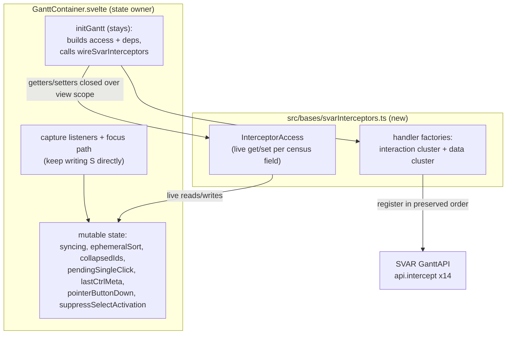

# SVAR Interceptor Extraction (Slice 2) - Plan

## Goal Capsule

- **Objective:** move every SVAR `api.intercept` policy out of `src/bases/GanttContainer.svelte` into a jest-reachable module, behavior-preserving, without moving the view's mutable state.
- **Authority:** this plan governs the how; [docs/engineering/practices.md](../engineering/practices.md) (charter E2/E3, session cadence) governs landing; [docs/architecture/principles.md](../architecture/principles.md) P5 (fastest reliable tier) and P7 (decomposition stopping rule) govern verification and scope; the ranked defect list ([docs/reports/2026-08-15-001-maintainability-rediagnosis.md](../reports/2026-08-15-001-maintainability-rediagnosis.md), rank 1) is the campaign authority this slice executes.
- **Stop conditions:** any observable behavior change; any function above complexity 15; an e2e spec that needs editing to stay green; a closure dependency discovered outside the R3 census — each is a stop-and-reconcile, not a workaround.
- **Landing:** one PR per unit. The plan document, the superseded plan's tombstone, and the backlog flake append ride the U1 PR (docs riding the unit they govern). U2 is its own PR in a later session — the session ends at its first merged PR.

---

## Product Contract

### Summary

Slice 2 of the maintainability campaign extracts the 9 `api.intercept` call sites (14 action registrations) from `GanttContainer.svelte` into a plain TypeScript module behind a typed live-access interface. State stays view-owned; the handlers reach it through getters and setters closed over the view's scope. The interception policies — echo suppression, reorder blocking, drag veto, selection and activation semantics, link authoring — become provable in jest instead of only by launching Obsidian.

### Problem Frame

`GanttContainer.svelte` is the ranked defect list's #1 entry: 18.7% full-history churn, 30 concerns, 4,176 lines. Inside it, `initGantt` (327 lines) welds five concerns' handlers to component-scope mutable state. Most of the policies it carries are today provable only through WebdriverIO against real Obsidian — the slowest tier (the data-cluster classifiers are already unit-tested; that cluster's gain is composition-level) — and its closure census has grown twice under review, which is why a naive extraction compiles and smoke-tests green while silently breaking echo suppression: primitives captured in a `deps` object are copies, and a copy of `syncing` never sees the sync coordinator raise it.

A prior plan for this extraction (2026-08-12-001, preserved unchanged on origin branch `docs/plan-wire-svar-interceptors` at `3c62bbe`) is superseded by this one. Its three acknowledged peer findings are inputs here: its echo test could not distinguish the `syncing` guard from the `eventSource` guard (either guard's deletion stayed green); its "ten intercepts" count was stale; its deferred `collapsedIds` question contradicted its own R1/U1.

### Requirements

**Extraction**

- R1. All 9 `api.intercept` call sites (14 action registrations) move to a plain TS module; after U2, `api.intercept` does not appear in `GanttContainer.svelte` (grep gate).
- R2. Behavior is identical: no e2e spec is edited, and registration order is preserved exactly (KTD3).
- R3. Extracted handlers reach any binding whose value can change after wiring — assigned mutable state and reactive `$derived` values alike — only through live access: interface members or getter-valued deps, never value snapshots. The census in the Planning Contract is the inventory — re-verified against the code at implementation time, not trusted from this document.

**Proof**

- R4. Unit tests pin every interception policy that today has no unit coverage: echo suppression, mid-drag collapse veto, reorder blocking, read-only row-mutation and link-authoring refusals, select-first activation gating, derived-geometry drag veto.
- R5. Guard discrimination: for each handler guarded by both `syncing` and `eventSource === OG_ECHO_SOURCE`, two separate named tests exist — one where only the `syncing` guard suppresses (echo-source absent) and one where only the echo-source guard suppresses (`syncing` false) — so deleting either guard fails a named test.
- R6. Liveness, per member: for every access-interface member and getter-valued dep, a test mutates the backing value after wiring and proves the next handler invocation observes it. A wiring-shape check proves the view-constructed object is live, not a snapshot: every census member the view passes is an accessor property, not a data property.
- R10. Registration contract: a test asserts the full action-ID sequence registered against the fake api matches today's order — the ten interaction-cluster actions after U1 (the clusters are contiguous in today's registration order: interaction first, data last), all fourteen after U2 — so a dropped or reordered registration fails a named test rather than passing the grep gate.
- R7. Mutation checks are self-evidencing per [docs/solutions/best-practices/a-test-name-is-a-claim-verify-the-mutation.md](../solutions/best-practices/a-test-name-is-a-claim-verify-the-mutation.md): a check that deletes a guard must first prove the deletion applied.

**Constraints**

- R8. Cognitive complexity ≤15 for every function touched or introduced, no suppressions. The two band members among the handlers (`select-task` at 12, `update-task` at 11) move complexity-neutral.
- R9. The 2026-08-12 plan's supersession is recorded on main by a tombstone at its own path; the origin branch is never mutated.

### Scope Boundaries

- No interceptor decides anything differently — only where the code lives changes.
- State ownership does not move: `collapsedIds`, `ephemeralSort`, and the rest stay view-owned. This resolves the superseded plan's deferred `collapsedIds` question by construction.
- The outer capture listeners (pointer down/up, dblclick), the focus-on-task writer, and `dbgInitCount` logging stay in the view.
- The 1,369-line style block is slice 3; diff-sync coordination is a later slice.
- The two parked cell-edit races stay parked (campaign rule: record, don't fix, in a behavior-neutral slice).

---

## Planning Contract

### Key Technical Decisions

- KTD1. **Live accessor bridge, not a moved state holder** (session-settled: user-approved — chosen over the superseded plan's state-object extraction: three of the ten bindings are Svelte 5 `$state` runes with ~30 view-side reader/writer sites, so moving them breaks rune reactivity or forces a wide rewrite; live getters/setters preserve both reactivity and closure liveness). The view constructs one `InterceptorAccess` object whose getter/setter properties close over its own scope; the module never holds a copy. This follows the seam rule in [docs/solutions/integration-issues/svar-gantt-diff-sync-interactions.md](../solutions/integration-issues/svar-gantt-diff-sync-interactions.md): pass a getter, never a boolean snapshot.
- KTD2. **Two units split by handler cluster, one PR each** — the interaction cluster (state-writing handlers) and the data-mutation cluster (read-only-state handlers). Bundling all nine handlers plus tests in one diff exceeds what the peer-review gate reads well; the clusters also differ in risk class.
- KTD3. **Registration order is preserved and stays driven from `initGantt`.** Re-ordering registration could change which handler sees an event first; that is not a refactor. `initGantt` keeps a single wiring call per cluster (one call after U2).
- KTD4. **The access interface is closed over the census.** Every mutable binding a handler touches is an explicit interface member; a new dependency requires an interface change, turning the silently-growing closure set into a compile-visible one (mechanism, not memory).
- KTD5. **Tombstone on main; never mutate the superseded artifact** (session-settled: user-directed — chosen over editing the plan on its branch: the charter supersedes plans, never mutates them). The tombstone file replaces the plan body at the superseded path with a pointer to this plan and to the preserved branch.

### The census (R3's inventory)

Measured on main at `bd95b56`. Re-enumerate before implementing — this set has grown twice under review (7 → 9 → 10+1).

| Binding | Handler use | Also written by |
|---|---|---|
| `syncing` | read by all guarded handlers | sync coordinator blocks, collapse-all, reseed re-assert (~6 sites) |
| `ephemeralSort` (`$state`) | read + written by `sort-tasks` | sort re-assert, restore, Base-sort change effect; template pill |
| `collapsedIds` (`$state`) | read + written by `open-task` | collapse-all, sync inputs, template |
| `pendingSingleClick` | read + written by `show-editor`, `select-task` | — |
| `lastCtrlMeta` | read by `show-editor`, `select-task` | capture pointerdown listener |
| `pointerButtonDown` | read by `open-task` | capture pointerdown/pointerup listeners |
| `suppressSelectActivation` | read by `select-task` | focus-on-task |
| `api` (`$state`) | assigned + read by `initGantt` body; `select-task` reads `getState()` | view-wide |
| `hostGeneration` | bumped by `initGantt` body | executor generation checks |
| `dbgInitCount` | bumped by `initGantt` body | — |
| `lastPieceActivation` (indirect) | read via `activateBar`'s path resolution | capture pointerdown listener; activation clear |

Only the first seven mutable bindings cross the seam as read/write interface members: `api`, `hostGeneration`, and `dbgInitCount` are touched by `initGantt`'s own body, which stays in the view (KTD3), and `lastPieceActivation` is read inside `activateBar`, which the module receives as a collaborator, so its closure never moves.

The seam-crossing criterion is R3's: anything whose value can change after wiring crosses live. Three reactive `$derived` bindings are read by handlers and cross as live reads, never value snapshots: `readOnly` and `cellEditColumnIds` (both change without a SVAR re-init — a capabilities flip or a grid-column edit flows through the sync path, not through `initGantt`) as getter-valued deps, and `instances` behind a `notePathOf(rowId)` lookup function for `show-editor`'s note-path resolution. `select-task`'s select-first gate reads selection state at event time; it crosses as a live `getState` function dep — the `api` binding itself stays view-owned. Stable collaborators (functions and callbacks) pass in the same `deps` object: the executors, `activateBar`, `restoreBaseOrder`, `cycleNext`, `resolveClickActivation`, `resolveShowEditorRoute`, the row/link policy predicates, `onMutate`, `onAddDependency`, `onRemoveDependency`, `OG_ECHO_SOURCE`, and the applied-links lookup.

### High-Level Technical Design

Directional guidance, not implementation specification.

Tests drive the factories with a fake `api` that records `intercept` registrations and replays events (the `themeResolver` fake-globals pattern, per the #416 plan's precedent), with a mutable fake backing the access interface so guard and liveness scenarios flip state between events.

---

## Implementation Units

### U1. Extract the interaction cluster behind the live-access seam

- **Goal:** `sort-tasks`, `open-task`, the six reorder-action registrations, `show-editor`, and `select-task` live in `src/bases/svarInterceptors.ts`; the view wires them through `InterceptorAccess`.
- **Requirements:** R2, R3, R4, R5, R6, R7, R8, R9.
- **Dependencies:** none.
- **Files:** `src/bases/svarInterceptors.ts` (new), `test/unit/svarInterceptors.test.ts` (new), `src/bases/GanttContainer.svelte`. Landing artifacts riding this PR per the Goal Capsule: this plan document, the tombstone at `docs/plans/2026-08-12-001-refactor-wire-svar-interceptors-plan.md`, and the flake append in `docs/backlog.md`.
- **Approach:**
  1. Define `InterceptorAccess` from the re-verified census (KTD4) and the `deps` contract for this cluster's read-only collaborators.
  2. Move the five handler bodies verbatim into factories; each state reference becomes an interface access.
  3. In `initGantt`, replace the moved registrations with one wiring call passing the accessor object literal (getter/setter properties over the view's bindings), preserving registration order (KTD3).
- **Execution note:** extract-and-test — characterize each policy against the factory with a failing test before the view delegates to it; never extract-and-move.
- **Patterns to follow:** `src/bases/ganttSyncCoordinator.ts` (PR #418) for module shape; the #416 plan's fake-api contract-test shape.
- **Test scenarios:**
  - Covers R5: `sort-tasks` passes an echo-sourced event through with `syncing` false, and passes any event through with `syncing` true and no echo source — two named tests; repeat the pair for `open-task` and the reorder block.
  - `sort-tasks`: a header click cycles asc → desc → cleared; the third click nulls the sort synchronously and defers `restoreBaseOrder` one tick; a new sort arriving within the tick skips the restore.
  - `open-task`: collapse adds the id, expand removes it, through the access setter; a held pointer button vetoes (returns false); a chevron toggle with the pointer up passes.
  - Reorder: each of the six actions returns false for an untagged user event and true for an echo.
  - `show-editor`: `syncing` returns false; a pending single-click is cleared; a calendar-item row with a backing note routes to `activateBar` as a double; a route of `none` is a no-op; the return value is always false.
  - `select-task`: `syncing` returns true without scheduling; `suppressSelectActivation` clears any pending click and returns true without scheduling; a first click on an unselected row schedules nothing; a click on an already-selected row schedules the deferred single activation; `ev.toggle` is cleared and the modifier is taken from `toggle` or the live `lastCtrlMeta`.
  - Covers R6: for each interface member and getter-valued dep this cluster reads or writes (including `notePathOf` and `getState` — change the fake's selected set between events and the select-first gate observes it), mutate the backing value after wiring; the next handler invocation observes it. The wiring-shape check asserts every census member of the view-passed access object is an accessor property.
  - Covers R10: the fake api records action IDs in order; the interaction cluster registers its ten actions in today's sequence.
  - Covers R7: each guard-deletion mutation check asserts the guard text existed before deletion.
- **Verification:** full `npx jest` green; `npm run e2e:local` green with no spec edited (column-sort, collapse, and selection-activation specs are the oracle); every touched function ≤15 complexity.

### U2. Extract the data-mutation cluster and close the seam

- **Goal:** `drag-task`, `update-task`, `add-link`, `delete-link` join the module; `initGantt` keeps a single wiring call; the grep gate holds.
- **Requirements:** R1, R2, R3, R4, R5, R6, R7, R8, R10.
- **Dependencies:** U1.
- **Files:** `src/bases/svarInterceptors.ts`, `test/unit/svarInterceptors.test.ts`, `src/bases/GanttContainer.svelte`.
- **Approach:**
  1. Move the four handler bodies verbatim; this cluster reads `syncing` through the existing access interface and adds no writable field.
  2. Pass the classification and policy collaborators (`classifyUpdateGesture`, `classifyUpdateEvent`, `refusesUserRowMutation`, row/link predicates, commit handlers, dependency callbacks, applied-links lookup) through `deps`. Test fakes for the classifiers stay neutral — a fake must not itself implement the guard a mutation check targets, or the check passes vacuously.
  3. Consolidate to one `wireSvarInterceptors` call in registration order; remove the last `api.intercept` from the view.
- **Execution note:** extract-and-test, same as U1.
- **Test scenarios:**
  - Covers R5: `update-task`, `add-link`, and `delete-link` each get the syncing-only / echo-source-only discrimination pair (through their classifier deps).
  - `drag-task`: refused for a row that disallows mutation and for derived geometry; allowed otherwise.
  - `update-task`: `inProgress` frames pass; a read-only row refusal returns false; a cell-edit routes to the commit handler with column and value; a cell-edit no-op returns false; an ambiguous cell edit reseeds the row's flat keys, notifies, and returns false; a user bar gesture routes to the gesture handler only when writable and `onMutate` exists.
  - `add-link`: a non-user-gesture passes; read-only or missing callback returns false; a disallowed or derived-geometry endpoint returns false; a non-finish-to-start geometry notifies and returns false; a valid link invokes the add callback with predecessor and dependent and returns false.
  - `delete-link`: a leading-colon id resolves through the applied-links lookup; an unresolvable id returns false; disallowed endpoints return false; a valid resolution invokes the remove callback and returns false.
  - Covers R6: mutate the fake behind the `readOnly` and `cellEditColumnIds` getters after wiring; `update-task` classifies the next event against the new values.
  - Covers R10: the recorded action-ID sequence matches all fourteen of today's registrations in order.
  - Covers R1: a test (or lint-style check in the suite) asserts `GanttContainer.svelte` contains no `api.intercept`.
- **Verification:** full `npx jest` green; `npm run e2e:local` green with no spec edited (drag, cell-edit, and dependency-types specs are the oracle); grep gate passes; every touched function ≤15 complexity.

---

## Verification Contract

| Gate | Command / check | Applies |
|---|---|---|
| Unit suite, in full | `npx jest` | every push (both units) |
| E2E against real Obsidian | `npm run e2e:local`, no spec edited | both units; a docs-only-style failure gets the same-SHA rerun test before diagnosis |
| Complexity | ESLint sonarjs gate, ≤15, zero suppressions | both units |
| Grep gate | no `api.intercept` in `src/bases/GanttContainer.svelte` | after U2 |
| Review | ce-code-review + cross-model peer receipts at exact tip; hosted final gate; zero unresolved threads | every PR |

The e2e specs are the behavior oracle precisely because they are unedited: echo suppression, drag veto, column sort, collapse persistence, selection activation, and dependency authoring already fail loudly when a guard breaks.

## Definition of Done

- Both units merged behind green gates; R1–R10 hold.
- The tombstone stands at the superseded plan's path on main; origin branch untouched.
- No dead or experimental code from abandoned approaches remains in the diff.
- Residuals and any parked findings recorded (backlog or PR record) before each merge.

---

## Sources & Research

- Census and rank: [docs/reports/2026-08-15-001-maintainability-rediagnosis.md](../reports/2026-08-15-001-maintainability-rediagnosis.md) Measurement 2 (`GanttContainer.svelte`) and Measurement 3 (pressure band).
- Seam rule and echo semantics: [docs/solutions/integration-issues/svar-gantt-diff-sync-interactions.md](../solutions/integration-issues/svar-gantt-diff-sync-interactions.md) — asymmetric guard returns (`show-editor` false vs `select-task` true under `syncing`) are behavior; preserve literally.
- Slice discipline: [docs/solutions/workflow-issues/run-behavior-neutral-refactoring-as-releasable-reviewed-slices.md](../solutions/workflow-issues/run-behavior-neutral-refactoring-as-releasable-reviewed-slices.md) — one responsibility per PR, characterize before moving, re-pick from fresh main after each squash merge.
- Mutation-check discipline: [docs/solutions/best-practices/a-test-name-is-a-claim-verify-the-mutation.md](../solutions/best-practices/a-test-name-is-a-claim-verify-the-mutation.md).
- Precedent extractions: PR #416 (`hostBarStamp`, plan 2026-08-11-004), PR #418 (`ganttSyncCoordinator.ts`).
- Superseded plan: origin branch `docs/plan-wire-svar-interceptors` at `3c62bbe`; its three acknowledged peer findings are folded into R5, the Problem Frame, and Scope Boundaries.
